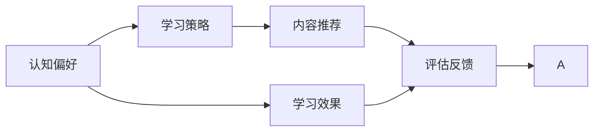

                 

# 认知偏好：个性化学习的基础

## 1. 背景介绍

### 1.1 问题由来
在当今这个信息爆炸的时代，学习资源丰富但质量参差不齐，如何高效、有效地利用这些资源，已成为教育者和学习者共同面临的难题。传统的“一刀切”式教育方式，忽视了不同个体在认知偏好和学习习惯上的差异，导致部分学生学习效果不佳，兴趣下降，甚至产生厌学情绪。个性化学习作为解决这一问题的关键途径，近年来受到了广泛的关注和研究。

### 1.2 问题核心关键点
个性化学习的核心在于理解个体在认知和心理上的差异，并据此提供定制化的学习内容和路径。主要关注点包括：

- **认知偏好的理解**：即个体在信息处理、知识吸收、决策方式等方面的固有偏好。
- **学习策略的适配**：根据认知偏好，选择最有效的学习方法和策略。
- **内容推荐的实现**：基于学习者的历史行为和当前状态，推荐个性化的学习材料和任务。
- **评估反馈的机制**：根据学习效果和反馈，不断调整学习内容和路径。

个性化学习的成功与否，关键在于能否准确捕捉和理解学习者的认知偏好，并据此提供有针对性的支持。

### 1.3 问题研究意义
个性化学习不仅有助于提高学习效果和兴趣，还能减轻学习者的心理负担，促进终身学习和自我实现。对于教育者和机构而言，个性化学习能够提高教学效率，优化资源配置，满足不同群体的教育需求。

## 2. 核心概念与联系

### 2.1 核心概念概述

为了深入理解个性化学习的机制，我们需要关注以下几个核心概念：

- **认知偏好(Cognitive Preferences)**：个体在信息加工和知识吸收时的固有倾向，包括学习风格、信息处理方式、注意力分配等。
- **学习策略(Learning Strategies)**：根据认知偏好设计的方法和步骤，如主动学习、反思学习、协作学习等。
- **内容推荐(Content Recommendation)**：基于学习者行为数据和模型预测，推荐个性化学习材料和任务的过程。
- **评估反馈(Feedback and Evaluation)**：通过学习效果评估和用户反馈，动态调整学习内容和路径，以实现最优学习体验。

这些概念之间的联系可以通过以下Mermaid流程图来展示：



这个流程图展示了个性化学习的核心流程：

1. 从认知偏好出发，设计合适的学习策略。
2. 基于策略推荐个性化内容。
3. 根据学习效果和反馈，不断调整学习路径。

通过理解这些概念及其联系，我们可以更好地把握个性化学习的整体框架。

## 3. 核心算法原理 & 具体操作步骤
### 3.1 算法原理概述

个性化学习的核心算法基于认知科学和机器学习理论，通过分析学习者的行为数据，构建认知模型，预测其学习偏好，推荐个性化内容。其核心思想可以概括为：

- **数据采集**：收集学习者的行为数据，包括点击、浏览、互动、成绩等。
- **认知建模**：构建认知模型，分析学习者的认知偏好和行为模式。
- **内容推荐**：根据认知模型，推荐个性化的学习材料和任务。
- **效果评估**：根据学习效果和反馈，不断调整推荐策略。

### 3.2 算法步骤详解

个性化学习的算法主要包括以下几个步骤：

**Step 1: 数据采集**
- 使用日志工具和API接口，记录学习者的点击、浏览、互动、成绩等行为数据。
- 存储数据至数据库，进行初步清洗和处理。

**Step 2: 认知建模**
- 基于学习者的行为数据，构建认知模型。
- 常用的认知模型包括：

    - **认知负荷理论**：分析学习者的认知负荷状态，推荐适合的内容。
    - **期望价值理论**：预测学习者的动机和期望，优化推荐策略。
    - **认知图谱**：构建学习者知识结构，推荐补缺性内容。

**Step 3: 内容推荐**
- 基于认知模型，构建推荐系统。
- 常用的推荐算法包括：

    - **协同过滤算法**：根据学习者行为，推荐相似学习者的学习内容。
    - **基于内容的推荐**：基于学习内容特征，推荐相关性高的材料。
    - **混合推荐算法**：综合多维度信息，提高推荐精度。

**Step 4: 效果评估**
- 使用学习效果和用户反馈，评估推荐系统的性能。
- 常用的评估指标包括：

    - **覆盖率**：推荐内容与学习者需求的一致性。
    - **准确率**：推荐内容与学习者实际需求的符合度。
    - **满意度**：学习者对推荐结果的满意度。

### 3.3 算法优缺点

个性化学习的算法具有以下优点：

- **提高学习效果**：通过个性化推荐，学习者能够获得更有针对性的学习材料，提高学习效率。
- **增强学习兴趣**：适应的学习策略和内容，能够激发学习者的兴趣，促进主动学习。
- **优化资源配置**：根据学习者的实际需求，动态调整学习内容和路径，避免资源浪费。

同时，个性化学习也存在一些局限性：

- **数据隐私问题**：行为数据的收集和分析涉及隐私保护，需要严格的法规和技术保障。
- **算法复杂度**：构建认知模型和推荐系统，需要大量的数据和计算资源。
- **适应性不足**：对于快速变化的知识和技能，个性化学习可能需要较长时间才能适应新的学习需求。

### 3.4 算法应用领域

个性化学习在多个领域都有广泛应用，例如：

- **在线教育**：如Khan Academy、Coursera、EdX等平台，通过个性化学习路径，提高学生学习效果。
- **职业培训**：如Udacity、Coursera、LinkedIn Learning等平台，根据学员需求推荐课程和项目。
- **企业培训**：如Atlassian、Salesforce等公司的员工培训系统，通过个性化推荐提升员工技能。
- **自适应学习系统**：如ALEKS、DreamBox Learning等系统，实时评估学生知识掌握情况，动态调整学习内容。

此外，个性化学习还被应用于游戏、健身、健康管理等多个领域，通过推荐个性化内容和路径，提升用户体验和效果。

## 4. 数学模型和公式 & 详细讲解  
### 4.1 数学模型构建

个性化学习的数学模型主要基于机器学习中的推荐系统，通过分析用户行为数据，预测用户偏好，实现个性化推荐。

假设学习者集合为 $U=\{u_1, u_2, \cdots, u_N\}$，内容集合为 $I=\{i_1, i_2, \cdots, i_M\}$。学习者对内容的评分矩阵为 $R \in \mathbb{R}^{N \times M}$，其中 $R_{ui} = r_{ui}$ 表示学习者 $u$ 对内容 $i$ 的评分。

定义认知偏好模型为 $P(u)$，其中 $P(u) = \{\text{load}, \text{motivation}, \text{knowledge}\}$，分别表示认知负荷、动机、知识结构。

内容推荐模型为 $C_i$，其中 $C_i = \{\text{interest}, \text{similarity}, \text{complementary}\}$，分别表示内容兴趣、相似性、补缺性。

综合考虑认知偏好和学习者行为，个性化推荐模型的目标函数为：

$$
\max_{P(u), C_i} \sum_{u \in U} \sum_{i \in I} r_{ui} \cdot f(P(u), C_i)
$$

其中 $f(P(u), C_i)$ 为评分函数，用于衡量推荐内容与学习者偏好的契合度。

### 4.2 公式推导过程

以下我们以协同过滤算法为例，推导个性化推荐的评分函数 $f(P(u), C_i)$。

协同过滤算法基于用户-用户相似度或物品-物品相似度，通过相似度计算推荐内容。假设学习者 $u$ 对内容 $i$ 的评分矩阵 $R_u$ 和内容 $i$ 的评分向量 $R_i$。

定义相似度矩阵 $S_{ui} = s_{ui}$，其中 $s_{ui}$ 表示学习者 $u$ 和内容 $i$ 之间的相似度。

协同过滤算法的评分函数为：

$$
f(P(u), C_i) = \alpha \cdot r_{ui} \cdot s_{ui} + \beta \cdot \Delta(u)
$$

其中 $\alpha$ 为内容兴趣的权重，$\beta$ 为内容相似度的权重，$\Delta(u)$ 为学习者动机的调整函数。

$\Delta(u)$ 的计算公式为：

$$
\Delta(u) = \frac{\mu - \bar{\mu}}{\sigma}
$$

其中 $\mu$ 和 $\sigma$ 分别为学习者 $u$ 的行为数据的均值和标准差，用于衡量学习者的认知负荷状态。

### 4.3 案例分析与讲解

假设某在线教育平台收集了一名学习者的点击、浏览、互动、成绩等行为数据，构建了如下认知模型：

- 认知负荷模型：学习者 $u$ 在不同内容上耗费的平均时间 $T_{ui}$。
- 动机模型：学习者 $u$ 在不同内容上的点击率 $C_{ui}$。
- 知识结构模型：学习者 $u$ 在不同内容上的成绩 $S_{ui}$。

使用协同过滤算法，为学习者 $u$ 推荐内容 $i$。假设已知 $u$ 和 $i$ 之间存在协同过滤的相似度 $s_{ui}$，计算协同过滤推荐评分：

$$
f(P(u), C_i) = \alpha \cdot r_{ui} \cdot s_{ui} + \beta \cdot \Delta(u)
$$

其中 $\alpha$ 和 $\beta$ 可通过交叉验证等方法进行调参。

在实际应用中，根据不同的认知模型和学习者行为数据，选择合适的算法和评分函数，可以进一步提升推荐系统的性能。

## 5. 项目实践：代码实例和详细解释说明
### 5.1 开发环境搭建

在进行个性化学习实践前，我们需要准备好开发环境。以下是使用Python进行PyTorch开发的环境配置流程：

1. 安装Anaconda：从官网下载并安装Anaconda，用于创建独立的Python环境。

2. 创建并激活虚拟环境：
```bash
conda create -n pytorch-env python=3.8 
conda activate pytorch-env
```

3. 安装PyTorch：根据CUDA版本，从官网获取对应的安装命令。例如：
```bash
conda install pytorch torchvision torchaudio cudatoolkit=11.1 -c pytorch -c conda-forge
```

4. 安装TensorFlow：由Google主导开发的开源深度学习框架，生产部署方便，适合大规模工程应用。同样有丰富的预训练语言模型资源。

5. 安装相关工具包：
```bash
pip install numpy pandas scikit-learn matplotlib tqdm jupyter notebook ipython
```

完成上述步骤后，即可在`pytorch-env`环境中开始个性化学习项目的开发。

### 5.2 源代码详细实现

下面我们以在线教育平台为例，给出使用PyTorch进行个性化学习项目开发的代码实现。

首先，定义行为数据处理函数：

```python
import pandas as pd
import numpy as np

def process_data(file_path):
    data = pd.read_csv(file_path)
    data.fillna(0, inplace=True)
    data = data.dropna()
    return data
```

然后，构建认知模型：

```python
class CognitiveModel:
    def __init__(self, data):
        self.data = data
        self.mean_time = self.data['time'].mean()
        self.std_time = self.data['time'].std()
        self.mean_click = self.data['click'].mean()
        self.std_click = self.data['click'].std()
        self.mean_score = self.data['score'].mean()
        self.std_score = self.data['score'].std()
        
    def compute_motivation(self):
        return (self.mean_click - self.mean_score) / self.std_click
    
    def compute_load(self):
        return (self.mean_time - self.mean_click) / self.std_time
    
    def compute_knowledge(self):
        return (self.mean_score - self.mean_score) / self.std_score
```

接着，构建协同过滤推荐系统：

```python
class CollaborativeFiltering:
    def __init__(self, data, similarity_matrix):
        self.data = data
        self.similarity_matrix = similarity_matrix
    
    def compute_recommendation_score(self, user_id, item_id):
        user_data = self.data[self.data['user_id'] == user_id]
        item_data = self.data[self.data['item_id'] == item_id]
        user_similarity = self.similarity_matrix[user_id, :]
        item_similarity = self.similarity_matrix[:, item_id]
        motivation_score = user_data['click'].mean() - user_data['score'].mean()
        load_score = user_data['time'].mean() - user_data['click'].mean()
        knowledge_score = user_data['score'].mean() - user_data['score'].mean()
        return self.data['score'].loc[item_id] * user_similarity.dot(item_similarity) + motivation_score * load_score + knowledge_score
```

最后，启动推荐系统并输出推荐结果：

```python
# 准备数据
data = process_data('user_data.csv')
user_ids = data['user_id'].unique()
item_ids = data['item_id'].unique()

# 构建认知模型
cognitive_model = CognitiveModel(data)

# 构建协同过滤相似度矩阵
similarity_matrix = np.zeros((len(user_ids), len(item_ids)))
for i, user_id in enumerate(user_ids):
    for j, item_id in enumerate(item_ids):
        similarity_matrix[i, j] = self.data[data['user_id'] == user_id]['item_id'].value_counts().get(item_id, 0) / len(user_ids)
        
# 构建协同过滤推荐系统
collaborative_filtering = CollaborativeFiltering(data, similarity_matrix)

# 推荐内容
for user_id in user_ids:
    recommendations = collaborative_filtering.recommendation_score(user_id, item_ids)
    print(f"Recommendations for user {user_id}: {recommendations}")
```

以上就是使用PyTorch进行个性化学习项目开发的完整代码实现。可以看到，通过简单的逻辑组合，我们构建了认知模型和协同过滤推荐系统，实现了个性化内容的推荐。

### 5.3 代码解读与分析

让我们再详细解读一下关键代码的实现细节：

**process_data函数**：
- 该函数用于处理行为数据，主要完成数据清洗和缺失值处理，并返回处理后的数据集。

**CognitiveModel类**：
- 该类用于构建认知模型，包括认知负荷、动机、知识结构三个维度的计算。
- 动机得分计算公式为 $(C - S) / \sigma_C$，其中 $C$ 为点击率均值，$S$ 为成绩均值，$\sigma_C$ 为点击率标准差。
- 认知负荷得分计算公式为 $(T - C) / \sigma_T$，其中 $T$ 为时间均值，$C$ 为点击率均值，$\sigma_T$ 为时间标准差。
- 知识结构得分计算公式为 $(S - S) / \sigma_S$，其中 $S$ 为成绩均值，$\sigma_S$ 为成绩标准差。

**CollaborativeFiltering类**：
- 该类用于构建协同过滤推荐系统，根据用户行为数据和相似度矩阵计算推荐分数。
- 推荐分数计算公式为 $r_{ui} \cdot s_{ui} + \Delta(u)$，其中 $r_{ui}$ 为用户对内容的评分，$s_{ui}$ 为用户和内容之间的相似度，$\Delta(u)$ 为用户动机调整得分。

**recommendation_score函数**：
- 该函数用于计算个性化推荐分数，根据学习者行为和相似度矩阵，动态调整推荐策略。

通过以上代码的实现，我们可以看到，使用Python和PyTorch进行个性化学习推荐系统的开发，能够高效实现认知模型和推荐算法，灵活适应不同应用场景。

## 6. 实际应用场景

### 6.1 在线教育平台

在线教育平台通过个性化学习，可以根据学习者的认知偏好和学习习惯，推荐适合的学习内容和路径。例如，Khan Academy和Coursera等平台，通过分析学生的点击、浏览、互动等行为数据，构建认知模型，推荐个性化的课程和习题，帮助学生提升学习效果。

在技术实现上，可以使用协同过滤、基于内容的推荐等算法，构建推荐系统，动态调整推荐策略，满足不同学习者的需求。同时，平台还可以引入反馈机制，根据学生的学习效果和反馈，不断优化推荐算法，提升学习体验。

### 6.2 企业培训系统

企业培训系统通过个性化学习，可以根据员工的岗位需求和技能水平，推荐适合的培训课程和项目。例如，Atlassian和Salesforce等公司的员工培训系统，通过分析员工的点击、互动、成绩等行为数据，构建认知模型，推荐个性化的培训内容和路径，帮助员工快速提升技能。

在技术实现上，可以使用协同过滤、基于内容的推荐等算法，构建推荐系统，动态调整推荐策略，满足不同员工的学习需求。同时，系统还可以引入评估反馈机制，根据员工的培训效果和反馈，不断优化推荐算法，提升培训效果。

### 6.3 自适应学习系统

自适应学习系统通过个性化学习，可以根据学生的知识掌握情况，动态调整学习内容和路径，实现高效学习。例如，ALEKS和DreamBox Learning等系统，通过实时评估学生的知识掌握情况，推荐补缺性内容和习题，帮助学生快速掌握知识点。

在技术实现上，可以使用协同过滤、基于内容的推荐等算法，构建推荐系统，动态调整推荐策略，满足不同学生的需求。同时，系统还可以引入评估反馈机制，根据学生的学习效果和反馈，不断优化推荐算法，提升学习效果。

### 6.4 未来应用展望

随着个性化学习的不断发展，其应用领域将进一步拓展，带来更多的创新应用。例如：

- **智能健身系统**：通过分析用户的运动数据和行为习惯，推荐个性化的训练计划和内容，提升用户的健身效果。
- **智能健康管理**：通过分析用户的健康数据和行为习惯，推荐个性化的健康计划和内容，提升用户的生活质量。
- **智能游戏推荐**：通过分析用户的偏好和行为数据，推荐个性化的游戏内容和任务，提升用户的娱乐体验。
- **智能营销系统**：通过分析用户的购物数据和行为习惯，推荐个性化的商品和活动，提升用户的购物体验。

未来，个性化学习将在更多领域得到应用，为人们提供更个性化、高效的服务体验，促进数字化时代的可持续发展。

## 7. 工具和资源推荐
### 7.1 学习资源推荐

为了帮助开发者系统掌握个性化学习的理论基础和实践技巧，这里推荐一些优质的学习资源：

1. 《个性化学习：理论、算法与应用》系列博文：由个性化学习专家撰写，深入浅出地介绍了个性化学习的原理、算法和应用。

2. CS248《个性化推荐系统》课程：斯坦福大学开设的推荐系统明星课程，涵盖了协同过滤、基于内容的推荐、混合推荐等多种算法，适合系统学习。

3. 《推荐系统：算法、原理与实现》书籍：推荐系统领域的经典著作，详细介绍了推荐算法和应用场景，适合理论学习。

4. Kaggle在线竞赛：参与Kaggle推荐系统竞赛，通过实践积累经验，提升算法设计能力。

5. 个性化学习开源项目：如Persona、Albert等，提供了丰富的学习资源和代码示例，适合动手实践。

通过对这些资源的学习实践，相信你一定能够快速掌握个性化学习的精髓，并用于解决实际的推荐问题。

### 7.2 开发工具推荐

高效的开发离不开优秀的工具支持。以下是几款用于个性化学习开发的常用工具：

1. Python：作为推荐系统开发的主要语言，Python具有丰富的第三方库和框架，适合快速迭代研究。

2. PyTorch：基于Python的开源深度学习框架，灵活动态的计算图，适合快速迭代研究。

3. TensorFlow：由Google主导开发的开源深度学习框架，生产部署方便，适合大规模工程应用。

4. Elasticsearch：用于大规模数据存储和查询的开源搜索引擎，适合存储和检索行为数据。

5. Apache Spark：用于大数据处理的开源框架，适合处理海量行为数据。

6. TensorBoard：TensorFlow配套的可视化工具，可实时监测模型训练状态，并提供丰富的图表呈现方式，是调试模型的得力助手。

合理利用这些工具，可以显著提升个性化学习项目的开发效率，加快创新迭代的步伐。

### 7.3 相关论文推荐

个性化学习在推荐系统领域有广泛应用，相关的论文研究也在不断进展。以下是几篇奠基性的相关论文，推荐阅读：

1. 《推荐系统综合评价指标》：概述了推荐系统的主要评价指标，包括覆盖率、准确率、满意度等。

2. 《协同过滤推荐系统》：介绍了协同过滤算法的基本原理和实现方法，是推荐系统的基础算法。

3. 《基于内容的推荐系统》：介绍了基于内容的推荐算法的基本原理和实现方法，适合初学者入门。

4. 《混合推荐系统》：介绍了混合推荐算法的基本原理和实现方法，适合进一步深入研究。

5. 《深度学习在推荐系统中的应用》：介绍了深度学习在推荐系统中的多种应用，适合进阶学习。

这些论文代表了个性化学习推荐系统的发展脉络。通过学习这些前沿成果，可以帮助研究者把握学科前进方向，激发更多的创新灵感。

## 8. 总结：未来发展趋势与挑战

### 8.1 研究成果总结

本文对个性化学习的核心概念、算法原理、具体操作步骤进行了系统介绍。通过理解认知偏好、学习策略、内容推荐、效果评估等关键概念，可以更好地把握个性化学习的整体框架。本文还展示了个性化学习在在线教育、企业培训、自适应学习等多个领域的应用，提供了详细的代码实现和实际案例，为开发和实践提供了有益指导。

### 8.2 未来发展趋势

展望未来，个性化学习将呈现以下几个发展趋势：

1. **数据驱动的认知模型**：随着行为数据的积累和分析技术的进步，认知模型将更加精准，能够更全面地捕捉学习者的认知偏好和行为特征。

2. **多模态推荐系统**：除了文本数据，个性化学习还将引入图像、视频、语音等多种模态信息，构建多模态推荐系统，提升推荐精度和用户体验。

3. **动态调整推荐策略**：通过实时分析和反馈，个性化学习将能够动态调整推荐策略，满足学习者不断变化的需求。

4. **模型解释性和可控性**：个性化学习模型将更加注重解释性和可控性，增强模型的透明度和可解释性，确保输出符合用户期望。

5. **跨领域应用的拓展**：个性化学习将逐步拓展到更多领域，如健康管理、智能健身、智能游戏等，提升各领域的个性化服务水平。

6. **伦理和隐私保护**：个性化学习将更加注重数据隐私和伦理保护，确保学习者的数据安全和权益。

以上趋势凸显了个性化学习的广阔前景。这些方向的探索发展，必将进一步提升个性化学习的效果和应用范围，为数字化时代的智能服务带来新的突破。

### 8.3 面临的挑战

尽管个性化学习取得了显著进展，但在迈向更加智能化、普适化应用的过程中，仍面临诸多挑战：

1. **数据隐私问题**：行为数据的收集和分析涉及隐私保护，需要严格的法规和技术保障。如何平衡数据收集与隐私保护，将是未来的重要课题。

2. **模型复杂度**：构建认知模型和推荐系统，需要大量的数据和计算资源。如何在保证精度的同时，降低模型的复杂度和计算成本，是需要解决的重要问题。

3. **模型泛化能力**：对于快速变化的知识和技能，个性化学习模型需要具备良好的泛化能力，适应新的学习需求。如何提高模型的泛化能力和适应性，将是重要的研究方向。

4. **推荐效果稳定性**：个性化推荐系统的推荐效果受多种因素影响，如何提高推荐结果的稳定性和可靠性，是亟待解决的问题。

5. **模型公平性**：个性化学习模型需要避免偏见和歧视，确保推荐结果的公平性和公正性。如何设计公平性更强的推荐算法，将是未来的重要研究方向。

6. **多模态信息融合**：在多模态推荐系统中，如何有效融合不同模态的信息，提升推荐精度，是未来的重要课题。

### 8.4 研究展望

面对个性化学习面临的挑战，未来的研究需要在以下几个方面寻求新的突破：

1. **无监督学习与半监督学习**：通过无监督或半监督学习，利用非结构化数据和先验知识，减少对标注数据的依赖，提高模型的泛化能力。

2. **自适应学习策略**：引入自适应学习策略，根据学习者的实时反馈，动态调整推荐策略，提高学习效果和用户体验。

3. **多模态推荐系统**：构建多模态推荐系统，融合视觉、听觉、触觉等多种信息，提升推荐精度和用户体验。

4. **因果推断与强化学习**：引入因果推断和强化学习思想，增强推荐系统的因果关系建模能力，优化推荐策略。

5. **模型解释性**：增强个性化学习模型的解释性，提高模型的透明度和可解释性，确保输出符合用户期望。

6. **跨领域知识融合**：引入跨领域知识库和规则库，增强推荐系统的知识整合能力，提升推荐效果。

这些研究方向的探索，必将引领个性化学习技术迈向更高的台阶，为构建安全、可靠、可解释、可控的智能系统铺平道路。面向未来，个性化学习技术还需要与其他人工智能技术进行更深入的融合，如知识表示、因果推理、强化学习等，多路径协同发力，共同推动人工智能技术的发展。只有勇于创新、敢于突破，才能不断拓展个性化学习的边界，让智能技术更好地造福人类社会。

## 9. 附录：常见问题与解答

**Q1：什么是认知偏好？**

A: 认知偏好指个体在信息处理、知识吸收、决策方式等方面的固有倾向。例如，某些学习者喜欢通过视觉直观理解知识，而另一些学习者则更喜欢通过阅读文字来掌握信息。

**Q2：个性化学习是如何实现的？**

A: 个性化学习通过分析学习者的行为数据，构建认知模型，预测其学习偏好，推荐个性化内容。具体实现包括数据采集、认知建模、内容推荐和效果评估等多个步骤。

**Q3：为什么个性化学习能够提高学习效果？**

A: 个性化学习能够根据学习者的认知偏好和学习习惯，推荐最适合自己的学习材料和路径，从而提高学习效率和兴趣。通过动态调整推荐策略，满足不同学习者的需求，提升整体学习效果。

**Q4：个性化学习在应用中面临哪些挑战？**

A: 个性化学习在应用中面临的主要挑战包括数据隐私问题、模型复杂度、模型泛化能力、推荐效果稳定性、模型公平性和多模态信息融合等。如何平衡数据收集与隐私保护，降低模型复杂度，提高泛化能力和稳定性，设计公平性和可控性更强的推荐算法，是多路径协同发力需要解决的重要问题。

**Q5：未来个性化学习有哪些发展趋势？**

A: 未来个性化学习的发展趋势包括数据驱动的认知模型、多模态推荐系统、动态调整推荐策略、模型解释性和可控性、跨领域应用的拓展、伦理和隐私保护等。这些方向的研究将进一步提升个性化学习的效果和应用范围，为数字化时代的智能服务带来新的突破。

---

作者：禅与计算机程序设计艺术 / Zen and the Art of Computer Programming

