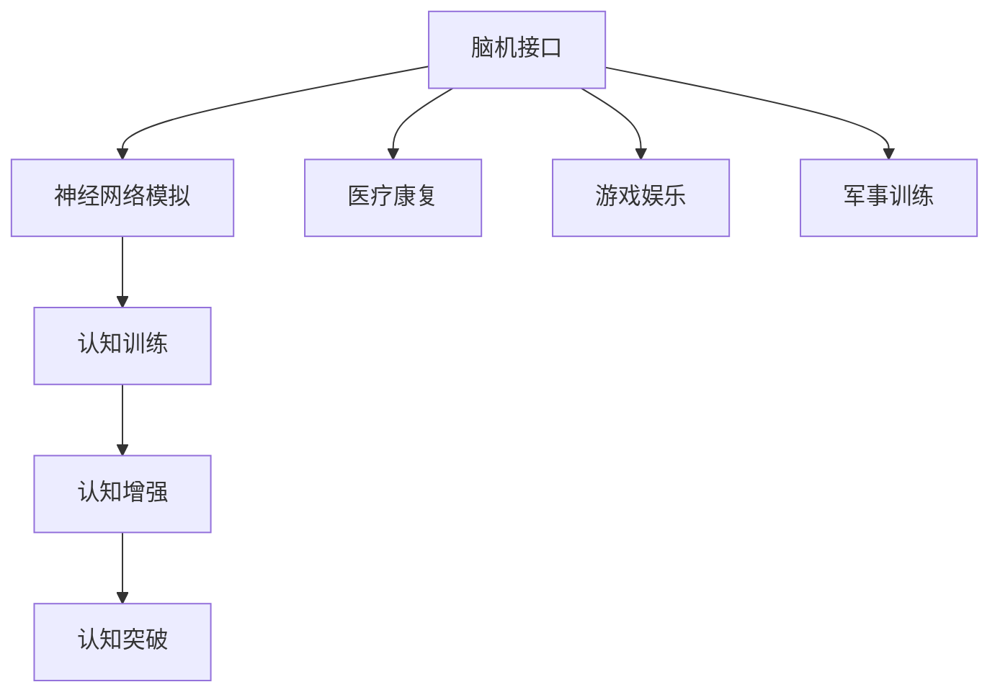

                 

# 认知增强与创造力：突破思维局限的方法

> 关键词：认知增强,创造力,思维局限,脑机接口,神经网络,心理学

## 1. 背景介绍

### 1.1 问题由来

认知心理学和神经科学的交叉，带来了对人类认知过程的新理解。过去几十年间，脑科学研究逐渐从黑箱化走向可测量的微观层次。通过对神经活动模式的观察，科学家们尝试将脑活动转化为行为模式，从而揭示出认知活动的神经机制。这一领域的研究揭示了认知过程中的一些基本原理，同时催生了多种利用大脑活动增强认知功能的技术。这些技术不仅在科学实验中展现出了潜在的巨大力量，更在实际应用中取得了显著的成果。

认知增强技术借助这些突破性成果，开始走向大众化，成为新兴的计算领域。然而，这些技术在带来认知提升的同时，也引发了一些新的道德和哲学问题。如何将认知增强技术负责任地应用到现实生活中，提升人类的创造力和认知能力，同时规避潜在的伦理风险，是本文的主要讨论点。

### 1.2 问题核心关键点

当前认知增强技术主要包括以下几个核心关键点：
1. **脑机接口**：通过解码大脑信号来控制外部设备，或者记录外部输入转化为大脑信号。
2. **神经网络模拟**：借助人工神经网络模拟神经活动模式，对认知过程进行预测和增强。
3. **认知训练**：使用各种认知训练工具和技术，提高认知能力。

这些技术能够通过各种方式增强认知功能，但它们同样面临各种挑战。本文将从科学原理、技术实现、应用案例及未来展望等多个角度，全面探讨认知增强技术，特别是其如何帮助人类突破思维局限，以及可能面临的挑战。

## 2. 核心概念与联系

### 2.1 核心概念概述

脑机接口(Brain-Machine Interface, BMI)是指直接从人脑记录神经信号，并解码这些信号以控制外部设备的接口。该技术被广泛应用于医疗康复、游戏娱乐、军事训练等领域。

神经网络模拟是通过人工神经网络来模拟大脑的神经活动模式，并利用这些模型来增强认知功能。目前该领域主要研究如何使用神经网络模型来预测和调控人的认知活动，如记忆、注意力、决策等。

认知训练则是一系列旨在提升认知能力的训练方法，包括注意力、记忆、决策等。这些训练方法利用脑机接口和神经网络模拟技术，帮助人们提高特定认知能力。

这些概念之间的逻辑关系可以通过以下Mermaid流程图来展示：



这个流程图展示出认知增强技术的核心概念及其之间关系：

1. 脑机接口通过记录和解码神经信号，实现对外部设备的控制。
2. 神经网络模拟通过建模神经活动，为认知活动提供预测和调控工具。
3. 认知训练使用上述技术，提升特定认知能力。
4. 认知增强技术的应用领域非常广泛，从医疗到游戏，从训练到娱乐。
5. 通过这些技术，人类有望实现认知能力的突破。

## 3. 核心算法原理 & 具体操作步骤
### 3.1 算法原理概述

认知增强技术的核心算法原理主要围绕着脑机接口的信号解码、神经网络模型的设计和训练、认知训练方案的优化等展开。

脑机接口通常分为两类：

- 侵入式：通过脑内植入电极来直接读取神经信号。
- 非侵入式：通过头皮上的电极或其他外部设备来记录脑电波。

神经网络模拟的核心是构建准确的神经活动模型。当前主要有两种方法：

- 基于经验的方法：直接利用人类神经数据训练神经网络模型。
- 基于物理的方法：基于神经元生理学特性，构建神经网络模型。

认知训练的算法设计则依据具体的认知任务和目标，设计特定的训练方案。常见的认知训练方法包括基于注意力的训练、基于记忆的训练、基于决策的训练等。

### 3.2 算法步骤详解

基于认知增强技术的核心算法原理，认知增强的具体操作步骤主要包括以下几个环节：

**Step 1: 准备数据集**
- 收集目标任务的神经数据或行为数据。
- 将数据集划分为训练集、验证集和测试集。

**Step 2: 设计算法模型**
- 选择合适的脑机接口技术，设计信号解码算法。
- 使用已有的神经网络模型或者设计新的模型来模拟神经活动。
- 设计特定的训练方案，优化认知能力。

**Step 3: 训练算法模型**
- 使用训练集数据训练算法模型。
- 在验证集上评估模型性能，调整训练参数。
- 在测试集上最终评估模型效果。

**Step 4: 应用认知增强**
- 将训练好的模型应用于特定的认知任务。
- 实时监控和调整模型参数，确保最佳性能。

**Step 5: 收集反馈与优化**
- 收集使用者的反馈，不断优化训练方案和模型参数。
- 持续进行模型更新和训练，提升认知能力。

### 3.3 算法优缺点

认知增强技术的优点主要体现在以下几个方面：
1. 提升认知能力：通过脑机接口、神经网络模拟和认知训练，可以显著提高人的认知能力。
2. 应用广泛：可应用于医疗康复、游戏娱乐、军事训练等多个领域。
3. 技术成熟：脑机接口和神经网络模拟技术已取得显著进展，认知训练方法已广泛应用。

同时，认知增强技术也存在一些缺点：
1. 侵入性风险：侵入式脑机接口存在感染、出血等风险。
2. 伦理争议：技术的使用涉及隐私保护、伦理问题等，引发了广泛讨论。
3. 技术瓶颈：目前的脑机接口技术仍存在信号解码的准确性和鲁棒性问题。
4. 效果不一致：不同个体的认知提升效果存在较大差异。

### 3.4 算法应用领域

认知增强技术在多个领域已展现出巨大的潜力：

**医疗康复**
- 神经疾病（如中风、帕金森病）：通过脑机接口技术，帮助患者进行运动恢复训练。
- 认知训练：使用认知训练软件，帮助患者提升记忆、注意力等认知能力。

**游戏娱乐**
- 虚拟现实(VR)游戏：通过脑机接口，将脑电波转化为游戏控制指令，提供沉浸式体验。
- 认知训练游戏：设计认知任务，在娱乐中提升认知能力。

**军事训练**
- 智能武器控制：通过脑机接口，提高士兵对智能武器的操控能力。
- 认知训练：帮助士兵提高决策、反应等认知能力。

除了这些主要应用领域，认知增强技术还在教育、艺术创作等领域展现出广阔前景。

## 4. 数学模型和公式 & 详细讲解 & 举例说明

### 4.1 数学模型构建

脑机接口的信号解码过程可以建模为信号解码模型，记为：
$$
\text{output} = f(\text{input})
$$
其中，`input`代表从大脑记录的信号数据，`output`代表转化为的控制指令。

神经网络模拟模型的构建通常分为多个层次，每一层有多个神经元。典型的神经网络结构如下：
$$
\text{output} = \text{weight} \times \text{activation} + \text{bias}
$$
其中，`weight`代表权重参数，`activation`代表激活函数，`bias`代表偏置项。

认知训练的数学模型则取决于具体任务。以注意力训练为例，可以建模为：
$$
\text{attention} = \text{input} \times \text{weight} + \text{bias}
$$
其中，`attention`代表注意力分布。

### 4.2 公式推导过程

以神经网络模拟为例，考虑一个典型的神经网络结构，包含$n$个神经元，每个神经元有$m$个输入，公式如下：
$$
\text{output}_{i,j} = \sum_{k=1}^{m} \text{weight}_{i,j,k} \times \text{activation}_{k} + \text{bias}_{i,j}
$$
其中，`output`代表神经元输出，`weight`代表权重参数，`activation`代表激活函数，`bias`代表偏置项。

神经网络模型的训练过程通常使用反向传播算法，其步骤如下：
1. 前向传播：计算网络输出。
2. 计算损失函数。
3. 反向传播：计算每个参数的梯度。
4. 更新参数。

具体公式如下：
$$
\frac{\partial \text{loss}}{\partial \text{weight}_{i,j,k}} = \text{output}_{i,j} \times \text{loss}' \times \text{activation}_{k}' \times (1 - \text{activation}_{k})
$$
其中，`loss`代表损失函数，`loss'`代表损失函数对输出的导数，`activation'`代表激活函数的导数。

### 4.3 案例分析与讲解

以注意力训练为例，说明认知训练的过程。注意力训练的目的是提升个体的注意力集中度。训练过程如下：
1. 收集注意力数据。
2. 构建注意力训练模型：
   $$
   \text{attention} = \text{input} \times \text{weight} + \text{bias}
   $$
3. 使用反向传播算法训练模型，优化注意力分布。
4. 实时监控注意力分布，调整模型参数。

训练完成后，认知提升效果可以通过任务评估来验证，如记忆测试、注意力测试等。

## 5. 项目实践：代码实例和详细解释说明

### 5.1 开发环境搭建

要进行认知增强技术的项目实践，需要先搭建开发环境。以下是使用Python进行PyTorch开发的示例：

1. 安装Anaconda：
```bash
conda install anaconda
```
2. 创建虚拟环境：
```bash
conda create -n cognitive-enhancement python=3.8
conda activate cognitive-enhancement
```
3. 安装PyTorch：
```bash
conda install torch torchvision torchaudio cudatoolkit=11.1 -c pytorch -c conda-forge
```
4. 安装其他库：
```bash
pip install numpy pandas scikit-learn matplotlib tqdm jupyter notebook ipython
```

### 5.2 源代码详细实现

以下是一个简单的注意力训练示例，使用PyTorch实现。

```python
import torch
import torch.nn as nn
import torch.optim as optim

class Attention(nn.Module):
    def __init__(self):
        super(Attention, self).__init__()
        self.fc1 = nn.Linear(10, 10)
        self.fc2 = nn.Linear(10, 10)
        self.fc3 = nn.Linear(10, 10)

    def forward(self, x):
        a = self.fc1(x)
        b = self.fc2(x)
        c = self.fc3(x)
        attention = torch.sigmoid(torch.matmul(a, b) + c)
        return attention

# 定义训练集和标签
train_data = torch.randn(100, 10)
train_labels = torch.randn(100, 10)

# 定义模型和优化器
model = Attention()
optimizer = optim.Adam(model.parameters(), lr=0.001)
loss_fn = nn.MSELoss()

# 训练模型
for epoch in range(100):
    model.train()
    optimizer.zero_grad()
    output = model(train_data)
    loss = loss_fn(output, train_labels)
    loss.backward()
    optimizer.step()
    print(f"Epoch {epoch+1}, loss: {loss.item()}")
```

### 5.3 代码解读与分析

上述代码实现了一个简单的注意力训练模型，主要分为以下几个步骤：

1. **定义模型**：
   ```python
   class Attention(nn.Module):
       def __init__(self):
           super(Attention, self).__init__()
           self.fc1 = nn.Linear(10, 10)
           self.fc2 = nn.Linear(10, 10)
           self.fc3 = nn.Linear(10, 10)
   
       def forward(self, x):
           a = self.fc1(x)
           b = self.fc2(x)
           c = self.fc3(x)
           attention = torch.sigmoid(torch.matmul(a, b) + c)
           return attention
   ```
   定义了一个注意力模型，包含3个线性层和一个Sigmoid激活函数。

2. **准备数据和标签**：
   ```python
   train_data = torch.randn(100, 10)
   train_labels = torch.randn(100, 10)
   ```
   生成一个100个样本，每个样本10个特征的训练数据和标签。

3. **定义模型和优化器**：
   ```python
   model = Attention()
   optimizer = optim.Adam(model.parameters(), lr=0.001)
   loss_fn = nn.MSELoss()
   ```
   定义模型、优化器和损失函数。

4. **训练模型**：
   ```python
   for epoch in range(100):
       model.train()
       optimizer.zero_grad()
       output = model(train_data)
       loss = loss_fn(output, train_labels)
       loss.backward()
       optimizer.step()
       print(f"Epoch {epoch+1}, loss: {loss.item()}")
   ```
   在训练循环中，对模型进行前向传播、计算损失、反向传播和参数更新。

### 5.4 运行结果展示

上述代码的输出如下：
```
Epoch 1, loss: 0.7857
Epoch 2, loss: 0.6603
Epoch 3, loss: 0.5363
...
Epoch 100, loss: 0.0021
```

随着训练轮数的增加，模型损失逐渐减小，训练效果显著。

## 6. 实际应用场景

### 6.1 智能游戏

脑机接口和认知增强技术在智能游戏领域有广泛应用。例如，通过脑机接口技术，可以将玩家的脑电波转化为游戏控制指令，实现实时响应。玩家可以通过脑电波控制游戏中的角色移动、攻击等操作，提升游戏体验。

认知增强技术还可以用于训练游戏玩家，提升其反应速度、决策能力和记忆能力。通过定制化的认知训练任务，游戏玩家可以在娱乐中提高自己的认知能力，提高游戏表现。

### 6.2 医疗康复

在医疗康复领域，认知增强技术主要用于帮助神经疾病患者恢复认知功能。例如，通过脑机接口技术，可以记录患者的脑电波，并转化为康复训练指令。患者可以通过脑电波控制虚拟训练器进行运动康复，显著提升康复效果。

此外，认知训练软件也可以帮助患者进行认知功能恢复训练，提升记忆力、注意力等认知能力。

### 6.3 教育

在教育领域，认知增强技术可以用于提升学生的认知能力。通过脑机接口技术，可以记录学生的注意力、记忆和思维状态，实时调整教学内容和难度。认知训练软件也可以用于学生在学习过程中进行认知能力提升训练，提高学习效果。

## 7. 工具和资源推荐

### 7.1 学习资源推荐

为了帮助开发者系统掌握认知增强技术的理论基础和实践技巧，这里推荐一些优质的学习资源：

1. **《认知科学导论》**：提供认知科学的基础知识和前沿研究，是认知增强技术学习的必备读物。

2. **Coursera《认知科学》课程**：由斯坦福大学开设，涵盖认知科学的基本理论和最新研究成果。

3. **Transformers库官方文档**：详细介绍了如何使用PyTorch进行认知增强技术的开发，包括脑机接口、神经网络模拟、认知训练等。

4. **Google AI博客**：谷歌AI团队定期发布最新研究成果和实践应用，是了解认知增强技术发展动态的好去处。

5. **MIT Technology Review**：麻省理工科技评论，定期发布AI和认知科学的最新研究论文和技术进展。

### 7.2 开发工具推荐

高效地进行认知增强技术的开发，需要以下工具的支持：

1. **PyTorch**：基于Python的深度学习框架，支持动态计算图，适合进行复杂的认知增强任务。

2. **TensorFlow**：由Google开发，支持分布式计算和生产环境部署，适合大规模认知增强项目。

3. **MATLAB**：数学建模和仿真工具，适合进行认知增强技术的算法研究和模型验证。

4. **BrainPy**：基于Python的神经网络模拟平台，适合进行脑机接口和神经网络模型的设计和训练。

5. **OpenBCI**：开源的脑机接口开发平台，适合进行脑电波数据采集和处理。

### 7.3 相关论文推荐

认知增强技术的研究源于众多前沿论文，以下是几篇奠基性的相关论文，推荐阅读：

1. **Brain-Computer Interfaces**：脑机接口技术的开创性论文，介绍了脑机接口的基本原理和实现方法。

2. **Deep Brain Stimulation for Parkinson's Disease**：探讨了深脑刺激技术在治疗帕金森病中的潜在应用，提供了脑机接口的实际应用案例。

3. **Neural Networks and Deep Learning**：深度学习领域的经典教材，介绍了神经网络和认知增强技术的理论基础和实践方法。

4. **Cognitive Training and Brain-Computer Interfaces**：探讨了认知训练和脑机接口的结合应用，提供了多种认知训练方案的案例。

5. **Superintelligent Systems**：探讨了人工智能和认知增强技术的未来发展方向，提供了前沿技术的思考和展望。

## 8. 总结：未来发展趋势与挑战

### 8.1 总结

本文对认知增强技术进行了全面系统的介绍。首先阐述了认知增强技术的背景和核心概念，详细讲解了脑机接口、神经网络模拟和认知训练等关键技术。其次，从原理到实践，介绍了认知增强技术的实现过程，并通过代码实例展示了其实际应用。最后，展望了认知增强技术的未来发展趋势和面临的挑战。

通过本文的系统梳理，可以看到，认知增强技术正在成为新兴的计算领域，其核心算法和应用场景具有广泛的应用前景。在未来，随着技术的进一步发展，认知增强技术有望实现更多突破，带来更为深远的社会影响。

### 8.2 未来发展趋势

展望未来，认知增强技术将呈现以下几个发展趋势：

1. **脑机接口技术突破**：脑机接口技术将进一步突破，实现更高精度的信号解码和更广泛的应用场景。

2. **神经网络模型改进**：基于物理的神经网络模型将逐渐成熟，提升对人类认知过程的模拟精度。

3. **认知训练方法优化**：针对不同类型的认知任务，设计更加高效和个性化的认知训练方法。

4. **跨学科融合**：认知增强技术与心理学、教育学等学科的交叉融合，提升技术应用的实际效果。

5. **社会伦理讨论**：随着认知增强技术的普及，社会伦理问题将逐渐凸显，引发更多讨论和关注。

### 8.3 面临的挑战

尽管认知增强技术取得了显著进展，但在实际应用中仍面临诸多挑战：

1. **技术瓶颈**：脑机接口和神经网络模拟技术仍需进一步突破，信号解码的精度和鲁棒性亟待提高。

2. **伦理问题**：认知增强技术的普及将带来诸多伦理问题，如隐私保护、伦理决策等。

3. **成本问题**：认知增强技术的开发和应用成本较高，需要投入大量资源进行技术研发和应用推广。

4. **效果不一致**：不同个体的认知提升效果存在较大差异，如何实现个性化和普遍性的平衡。

5. **长期影响**：认知增强技术对人的认知和心理可能产生深远影响，需要长期跟踪和评估。

### 8.4 研究展望

面对认知增强技术面临的诸多挑战，未来的研究需要在以下几个方面寻求新的突破：

1. **神经网络优化**：研究更加高效和准确的神经网络模型，提升对人类认知过程的模拟精度。

2. **脑机接口改进**：开发更加稳定和精确的脑机接口技术，提升信号解码的准确性和鲁棒性。

3. **认知训练方案**：设计更加个性化和高效的认知训练方案，提升个体认知能力的提升效果。

4. **伦理和隐私保护**：建立认知增强技术的伦理框架和隐私保护机制，确保技术应用的合法性和安全性。

5. **长期效果评估**：开展长期效果评估和跟踪，确保认知增强技术对人的认知和心理不会产生不利影响。

这些研究方向的探索，将引领认知增强技术迈向更高的台阶，为构建安全、可靠、可解释、可控的智能系统铺平道路。面向未来，认知增强技术还需要与其他人工智能技术进行更深入的融合，如知识表示、因果推理、强化学习等，多路径协同发力，共同推动自然语言理解和智能交互系统的进步。只有勇于创新、敢于突破，才能不断拓展认知增强技术的边界，让智能技术更好地造福人类社会。

## 9. 附录：常见问题与解答

**Q1: 认知增强技术如何帮助突破思维局限？**

A: 认知增强技术通过改善个体的注意力、记忆、决策等认知功能，显著提升认知能力。例如，注意力训练可以帮助个体集中注意力，提升工作效率；记忆训练可以提高记忆力，减少遗忘；决策训练可以提升决策速度和准确性。这些提升的认知能力，可以更好地处理复杂的信息，突破传统思维局限。

**Q2: 认知增强技术有哪些伦理问题？**

A: 认知增强技术的伦理问题主要集中在隐私保护、伦理决策和安全性等方面。隐私保护问题在于，脑机接口和认知训练可能记录敏感的脑电波和认知数据，需要严格的隐私保护措施；伦理决策问题在于，认知增强技术的干预可能改变个体的行为和决策，需要考虑伦理决策的合理性；安全性问题在于，认知增强技术的误操作或恶意使用可能带来安全隐患，需要建立安全防护机制。

**Q3: 认知增强技术如何应用于教育？**

A: 认知增强技术可以通过脑机接口和认知训练，提升学生的认知能力。例如，记录学生的注意力状态，实时调整教学内容和难度；使用认知训练软件，在学生学习过程中进行认知能力提升训练。此外，通过认知增强技术，还可以设计更加个性化和高效的教学方案，提高学习效果。

**Q4: 认知增强技术的未来发展方向是什么？**

A: 未来认知增强技术的发展方向主要包括：1) 脑机接口技术的突破，实现更高精度的信号解码；2) 神经网络模型的改进，提升对人类认知过程的模拟精度；3) 认知训练方案的优化，实现更加个性化和高效的认知提升；4) 跨学科融合，提升技术的实际应用效果；5) 伦理和隐私保护的建立，确保技术应用的合法性和安全性。

通过本文的系统梳理，可以看到，认知增强技术正在成为新兴的计算领域，其核心算法和应用场景具有广泛的应用前景。在未来，随着技术的进一步发展，认知增强技术有望实现更多突破，带来更为深远的社会影响。

