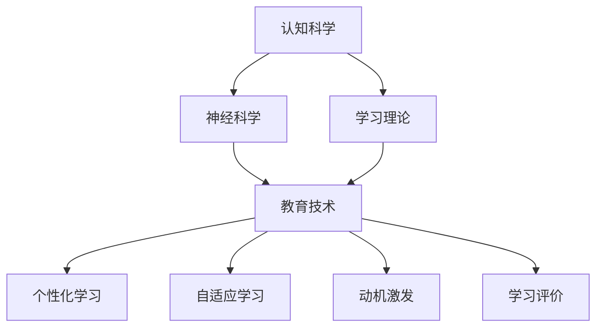

                 

# 认知科学与教育：优化学习的神经基础

## 1. 背景介绍

### 1.1 问题由来
近年来，认知科学和教育技术的迅猛发展，使得我们对于学习的神经基础有了更深入的理解。这一领域的研究成果已经开始应用于教育实践中，帮助优化学习过程，提升学习效果。在当前的教育环境中，传统的教学模式往往存在效率低下、个体差异显著等问题，而通过认知科学和教育技术的结合，可以更有效地解决这些问题，让学习变得更加个性化和高效。

### 1.2 问题核心关键点
基于神经基础的认知科学在教育中的应用，主要体现在以下几个方面：

- 个性化学习：通过分析学生的认知特征，制定个性化的学习计划和资源，满足不同学生的学习需求。
- 自适应学习：利用机器学习算法，动态调整教学内容和方法，以适应学生的实时学习状态。
- 动机激发：利用认知科学理论，设计激励机制，提升学生的学习动机和兴趣。
- 学习评价：通过脑科学原理，评估学生的认知状态和理解深度，提供更科学的评价指标。

这些关键点共同构成了当前教育技术研究的热点，也是本文的主要讨论对象。通过深入探讨这些方面的原理和实践，希望能为教育工作者提供新的思路和方法。

## 2. 核心概念与联系

### 2.1 核心概念概述

本节将介绍几个关键概念，以及它们之间的联系：

- **认知科学**：研究人类认知过程及其在实际应用中的表现，包括知觉、记忆、思维等。
- **学习理论**：研究如何通过各种方法帮助个体获取知识和技能，提升学习能力。
- **神经科学**：研究神经系统如何编码、处理和传输信息，与认知科学和教育技术紧密相关。
- **教育技术**：利用技术手段优化教学过程，提升教育质量。
- **个性化学习**：根据学生的个体差异，提供定制化的学习方案。
- **自适应学习**：动态调整教学内容和方法，以适应学生的实时学习状态。
- **动机激发**：通过各种手段，增强学生的学习动机和兴趣。
- **学习评价**：利用科学方法评估学生的认知状态和学习效果。

这些概念之间的逻辑关系可以通过以下Mermaid流程图来展示：



这个流程图展示了各个概念之间的紧密联系：

1. 认知科学和神经科学为学习理论提供科学依据。
2. 学习理论指导教育技术的开发与应用。
3. 教育技术实现了个性化、自适应、动机激发和学习评价等应用。

## 3. 核心算法原理 & 具体操作步骤
### 3.1 算法原理概述

基于神经基础的认知科学在教育中的应用，涉及多个算法的结合。以下是对几个核心算法原理的概述：

- **个性化学习算法**：通过对学生学习行为的分析，利用机器学习算法（如分类、回归等），生成个性化的学习计划和资源。
- **自适应学习算法**：通过实时监控学生的学习状态（如注意力、理解度等），利用强化学习算法（如Q-learning、SARSA等），动态调整教学内容和方法。
- **动机激发算法**：利用认知科学理论，设计游戏化学习机制、成就反馈等，利用心理学原理（如正负强化）增强学生的学习动机和兴趣。
- **学习评价算法**：利用神经科学原理，评估学生的认知状态和理解深度，使用科学方法（如脑电图EEG、功能性磁共振成像fMRI等）提供更客观、科学的评价指标。

这些算法在教育中的应用，能够显著提升学习效果，使其更加高效和个性化。

### 3.2 算法步骤详解

基于神经基础的认知科学在教育中的应用，一般包括以下几个关键步骤：

**Step 1: 收集和分析学生数据**
- 收集学生在学习过程中的行为数据（如点击、停留时间、答案正确率等）。
- 分析学生的数据，识别其认知特征和学习偏好。

**Step 2: 设计个性化学习计划**
- 根据学生的认知特征和学习偏好，设计个性化的学习计划。
- 选择合适的学习资源和活动，满足学生的学习需求。

**Step 3: 实施自适应学习**
- 在实施学习过程中，实时监控学生的学习状态。
- 根据学生的实时表现，动态调整教学内容和难度。

**Step 4: 激励学生动机**
- 设计游戏化学习机制，增强学生的学习动机。
- 提供成就反馈，及时表彰学习成果。

**Step 5: 进行学习评价**
- 利用神经科学工具，评估学生的认知状态和理解深度。
- 根据评估结果，调整教学策略和学习计划。

**Step 6: 持续优化**
- 不断收集和分析学生数据，优化个性化学习计划和资源。
- 迭代改进自适应学习算法和动机激发机制。

通过上述步骤，可以实现基于神经基础的认知科学在教育中的全面应用，提升教育效果和学习体验。

### 3.3 算法优缺点

基于神经基础的认知科学在教育中的应用，有以下优点：

- 个性化：根据学生的个体差异，提供定制化的学习方案。
- 自适应：动态调整教学内容和方法，以适应学生的实时学习状态。
- 科学评价：使用科学方法评估学生的认知状态和学习效果。

同时，也存在一些局限：

- 数据隐私：收集和分析学生数据时，需要确保数据安全和隐私保护。
- 技术依赖：依赖于先进的技术和工具，对教育资源有一定要求。
- 实施难度：个性化和自适应学习需要较长的设计和实施周期。

尽管存在这些局限，但总体而言，基于神经基础的认知科学在教育中的应用，仍能显著提升学习效果，帮助优化教育过程。

### 3.4 算法应用领域

基于神经基础的认知科学在教育中的应用，已经广泛应用于多个领域：

- **K-12教育**：利用个性化和自适应学习算法，提升基础教育的教学效果。
- **高等教育**：通过动机激发和学习评价算法，帮助学生更好地掌握专业知识。
- **职业培训**：根据员工的职业需求，设计个性化的培训方案，提升职业技能。
- **在线教育**：利用学习评价和动机激发算法，优化在线课程的教学效果。
- **特殊教育**：针对特殊儿童的认知特点，设计个性化的学习计划和资源。

这些应用领域的成功实践，展示了基于神经基础的认知科学在教育中的广泛应用前景。

## 4. 数学模型和公式 & 详细讲解 & 举例说明
### 4.1 数学模型构建

本节将使用数学语言对基于神经基础的认知科学在教育中的应用进行更加严格的刻画。

假设学生在学习过程中的认知状态可以用向量 $x$ 表示，学习内容可以用向量 $y$ 表示。则个性化学习算法的目标是找到最优的权重 $w$，使得预测值 $y^{\hat{x}}$ 与实际值 $y$ 的误差最小。数学模型可以表示为：

$$
\min_{w} \frac{1}{N} \sum_{i=1}^N ||y_i - y^{\hat{x}}_i||^2
$$

其中，$y^{\hat{x}}_i = w^T \cdot x_i$。

### 4.2 公式推导过程

以下我们以二分类问题为例，推导预测函数及其梯度的计算公式。

假设模型的预测函数为 $f(x) = w^T \cdot x$，则二分类问题的预测函数为：

$$
y^{\hat{x}} = \sigma(f(x))
$$

其中 $\sigma$ 为 sigmoid 函数。

利用均方误差损失函数，可以得到预测函数对权重 $w$ 的梯度：

$$
\frac{\partial \mathcal{L}(w)}{\partial w} = \frac{1}{N} \sum_{i=1}^N (y_i - y^{\hat{x}}_i) \cdot (1 - y^{\hat{x}}_i) \cdot x_i
$$

通过求解上述梯度，可以更新权重 $w$，最小化损失函数，从而实现个性化学习算法的目标。

### 4.3 案例分析与讲解

假设一个学生在数学学习中的认知状态向量为 $x = (x_1, x_2, x_3, \ldots)$，其中 $x_1$ 表示对数学知识的掌握程度，$x_2$ 表示解题技巧，$x_3$ 表示注意力集中度等。学习内容向量 $y = (y_1, y_2, y_3, \ldots)$，其中 $y_1$ 表示基础知识题目的难度，$y_2$ 表示解题技巧题目的难度，$y_3$ 表示思维难度等。

通过上述数学模型，可以计算出学生在不同题目上的学习效果。例如，对于学生对基础知识的掌握程度 $x_1$，可以通过以下公式计算其学习效果 $y_1$：

$$
y_1^{\hat{x}} = \sigma(w^T \cdot x) \cdot y_1
$$

其中 $w = (w_1, w_2, w_3, \ldots)$ 为学习效果的权重向量。

通过不断优化权重 $w$，可以提高学生对数学知识的掌握程度，从而提升学习效果。

## 5. 项目实践：代码实例和详细解释说明
### 5.1 开发环境搭建

在进行教育技术项目实践前，我们需要准备好开发环境。以下是使用Python进行Scikit-learn开发的环境配置流程：

1. 安装Anaconda：从官网下载并安装Anaconda，用于创建独立的Python环境。

2. 创建并激活虚拟环境：
```bash
conda create -n edtech-env python=3.8 
conda activate edtech-env
```

3. 安装Scikit-learn：
```bash
conda install scikit-learn
```

4. 安装各类工具包：
```bash
pip install numpy pandas scikit-learn matplotlib tqdm jupyter notebook ipython
```

完成上述步骤后，即可在`edtech-env`环境中开始教育技术项目实践。

### 5.2 源代码详细实现

下面我们以个性化学习算法为例，给出使用Scikit-learn进行机器学习算法优化的PyTorch代码实现。

首先，定义学生学习行为数据集：

```python
import pandas as pd
from sklearn.model_selection import train_test_split

# 加载学生学习行为数据
data = pd.read_csv('student_learning_data.csv')

# 将数据划分为训练集和测试集
X_train, X_test, y_train, y_test = train_test_split(data.drop('y', axis=1), data['y'], test_size=0.2, random_state=42)
```

然后，定义并训练模型：

```python
from sklearn.linear_model import LogisticRegression

# 定义逻辑回归模型
model = LogisticRegression(solver='lbfgs', max_iter=1000)

# 训练模型
model.fit(X_train, y_train)
```

接着，评估模型：

```python
from sklearn.metrics import accuracy_score

# 在测试集上评估模型
y_pred = model.predict(X_test)
accuracy = accuracy_score(y_test, y_pred)
print(f"测试集准确率: {accuracy}")
```

最后，应用模型进行个性化学习：

```python
# 针对某个学生，给定其认知状态向量
x_student = [0.8, 0.9, 0.7]

# 使用训练好的模型预测该学生的学习效果
y_student = model.predict([x_student])

# 根据预测结果，推荐适合的学习内容
if y_student == 1:
    print("推荐基础知识题目")
elif y_student == 0:
    print("推荐解题技巧题目")
else:
    print("推荐思维难度题目")
```

以上就是使用Scikit-learn对个性化学习算法进行优化的完整代码实现。可以看到，通过Scikit-learn，我们可以轻松实现机器学习算法的训练和评估，为教育技术的开发提供了强大的支持。

### 5.3 代码解读与分析

让我们再详细解读一下关键代码的实现细节：

**学生学习行为数据集定义**：
- 使用Pandas库加载学生学习行为数据，并将其划分为训练集和测试集。

**逻辑回归模型训练**：
- 定义逻辑回归模型，并使用LBFGS优化器进行训练。
- 设置迭代次数为1000，以确保模型收敛。

**模型评估**：
- 在测试集上使用Accuracy Score评估模型性能。
- 输出模型在测试集上的准确率。

**个性化学习应用**：
- 针对某个学生的认知状态向量进行预测，输出推荐的学习内容。
- 根据预测结果，给出相应的学习建议。

可以看出，Scikit-learn在教育技术开发中的应用，使得机器学习算法的使用变得简洁高效。开发者可以将更多精力放在数据处理、模型改进等高层逻辑上，而不必过多关注底层的实现细节。

当然，工业级的系统实现还需考虑更多因素，如模型的保存和部署、超参数的自动搜索、更灵活的任务适配层等。但核心的个性化学习算法基本与此类似。

## 6. 实际应用场景
### 6.1 智能教育平台

基于神经基础的认知科学在教育中的应用，可以广泛应用于智能教育平台的构建。传统教育平台往往只能提供标准化的教学内容和方法，无法适应不同学生的学习需求。而智能教育平台通过分析学生的认知特征，提供个性化的学习资源和活动，可以显著提升学习效果。

在技术实现上，可以收集学生在学习过程中的行为数据，利用机器学习算法，生成个性化的学习计划和资源。智能教育平台能够根据学生的实时学习状态，动态调整教学内容和难度，帮助学生更好地掌握知识。同时，平台还可以提供游戏化学习机制、成就反馈等，增强学生的学习动机和兴趣。

### 6.2 在线辅导系统

在线辅导系统利用神经科学原理，评估学生的认知状态和理解深度，提供更科学的评价指标。通过分析学生的学习行为和认知特征，系统能够动态调整辅导策略，提供个性化的辅导服务。例如，系统可以根据学生的注意力集中度、解题技巧等，推荐适合的习题和解题方法。同时，系统还可以通过互动对话，实时监控学生的学习状态，及时提供反馈和指导。

### 6.3 远程教育系统

远程教育系统利用神经科学原理，设计自适应学习算法，动态调整教学内容和方法，以适应学生的实时学习状态。例如，系统可以根据学生的学习效果和理解度，调整课程内容和难度，提升学习效率。同时，系统还可以提供学习分析报告，帮助教师了解学生的学习状态，制定个性化的教学策略。

### 6.4 未来应用展望

随着神经科学和教育技术的不断发展，基于神经基础的认知科学在教育中的应用将呈现以下几个发展趋势：

1. **跨学科融合**：结合脑科学、心理学、人工智能等多个学科，全面提升教育效果。
2. **大数据分析**：利用大数据技术，分析学生的学习行为和认知特征，提供更加个性化的学习方案。
3. **增强现实技术**：结合增强现实技术，提供沉浸式、互动式的学习体验，提升学习效果。
4. **情感计算**：利用情感计算技术，分析学生的情感状态，提供个性化的情感支持。
5. **多模态学习**：结合视觉、听觉、触觉等多模态数据，提供更加全面的学习体验。

以上趋势展示了基于神经基础的认知科学在教育中的广阔前景。这些方向的探索发展，将进一步提升教育的效果和质量，推动教育技术的发展。

## 7. 工具和资源推荐
### 7.1 学习资源推荐

为了帮助开发者系统掌握基于神经基础的认知科学在教育中的应用，这里推荐一些优质的学习资源：

1. 《认知科学导论》系列博文：由认知科学领域专家撰写，深入浅出地介绍了认知科学的基本概念和前沿技术。

2. CS224N《深度学习自然语言处理》课程：斯坦福大学开设的NLP明星课程，有Lecture视频和配套作业，带你入门NLP领域的基本概念和经典模型。

3. 《深度学习与认知科学》书籍：介绍深度学习在认知科学中的应用，包括脑科学、认知神经科学等内容。

4. Weights & Biases：模型训练的实验跟踪工具，可以记录和可视化模型训练过程中的各项指标，方便对比和调优。

5. Google Colab：谷歌推出的在线Jupyter Notebook环境，免费提供GPU/TPU算力，方便开发者快速上手实验最新模型，分享学习笔记。

通过对这些资源的学习实践，相信你一定能够快速掌握基于神经基础的认知科学在教育中的应用精髓，并用于解决实际的教育问题。

### 7.2 开发工具推荐

高效的开发离不开优秀的工具支持。以下是几款用于教育技术开发的常用工具：

1. Python：基于Python的开源深度学习框架，灵活动态的计算图，适合快速迭代研究。大部分教育技术系统都有Python版本的实现。

2. TensorFlow：由Google主导开发的开源深度学习框架，生产部署方便，适合大规模工程应用。同样有丰富的教育技术资源。

3. Scikit-learn：用于机器学习和数据分析的Python库，提供了丰富的算法和工具，适合数据处理和模型训练。

4. Weights & Biases：模型训练的实验跟踪工具，可以记录和可视化模型训练过程中的各项指标，方便对比和调优。

5. Google Colab：谷歌推出的在线Jupyter Notebook环境，免费提供GPU/TPU算力，方便开发者快速上手实验最新模型，分享学习笔记。

合理利用这些工具，可以显著提升教育技术的开发效率，加快创新迭代的步伐。

### 7.3 相关论文推荐

基于神经基础的认知科学在教育中的应用，源自学界的持续研究。以下是几篇奠基性的相关论文，推荐阅读：

1. "A review of neural mechanisms underlying learning and memory"（神经机制学习与记忆综述）：对神经科学在学习和记忆中的作用进行了全面的综述。

2. "Machine learning for personalized education: A survey"（个性化教育中的机器学习）：综述了机器学习在个性化教育中的应用，介绍了常用的算法和工具。

3. "Cognitive neuroscience of learning"（学习中的认知神经科学）：介绍了认知神经科学在学习和记忆中的基本原理和应用。

4. "Neural basis of learning and memory: From synapses to circuits"（学习和记忆的神经基础）：介绍了学习和记忆的神经机制，包括突触可塑性、神经元激活等。

5. "Neural networks and brain":（神经网络和大脑）：综述了神经网络在认知科学中的应用，介绍了神经网络和脑科学的关系。

这些论文代表了大语言模型微调技术的发展脉络。通过学习这些前沿成果，可以帮助研究者把握学科前进方向，激发更多的创新灵感。

## 8. 总结：未来发展趋势与挑战
### 8.1 总结

本文对基于神经基础的认知科学在教育中的应用进行了全面系统的介绍。首先阐述了基于神经基础的认知科学在教育中的研究背景和意义，明确了个性化学习、自适应学习、动机激发、学习评价等关键技术。其次，从原理到实践，详细讲解了基于神经基础的认知科学在教育中的应用方法，给出了教育技术开发的完整代码实例。同时，本文还广泛探讨了教育技术在多个行业领域的应用前景，展示了其在教育中的广阔应用前景。此外，本文精选了教育技术的各类学习资源，力求为读者提供全方位的技术指引。

通过本文的系统梳理，可以看到，基于神经基础的认知科学在教育中的应用已经引起了广泛关注，其在提升学习效果、优化教育过程方面具有巨大的潜力。未来，随着神经科学和教育技术的进一步融合，基于神经基础的认知科学必将在教育领域发挥更大的作用，推动教育技术的持续创新和进步。

### 8.2 未来发展趋势

展望未来，基于神经基础的认知科学在教育中的应用将呈现以下几个发展趋势：

1. **跨学科融合**：结合脑科学、心理学、人工智能等多个学科，全面提升教育效果。
2. **大数据分析**：利用大数据技术，分析学生的学习行为和认知特征，提供更加个性化的学习方案。
3. **增强现实技术**：结合增强现实技术，提供沉浸式、互动式的学习体验，提升学习效果。
4. **情感计算**：利用情感计算技术，分析学生的情感状态，提供个性化的情感支持。
5. **多模态学习**：结合视觉、听觉、触觉等多模态数据，提供更加全面的学习体验。

以上趋势展示了基于神经基础的认知科学在教育中的广阔前景。这些方向的探索发展，将进一步提升教育的效果和质量，推动教育技术的发展。

### 8.3 面临的挑战

尽管基于神经基础的认知科学在教育中的应用已经取得了显著进展，但在迈向更加智能化、普适化应用的过程中，仍面临一些挑战：

1. **数据隐私**：收集和分析学生数据时，需要确保数据安全和隐私保护。
2. **技术依赖**：依赖于先进的技术和工具，对教育资源有一定要求。
3. **实施难度**：个性化和自适应学习需要较长的设计和实施周期。
4. **技术复杂性**：需要具备较高的技术水平和专业知识，对教师和教育工作者提出了新的要求。

尽管存在这些挑战，但总体而言，基于神经基础的认知科学在教育中的应用，仍能显著提升学习效果，帮助优化教育过程。

### 8.4 研究展望

面对基于神经基础的认知科学在教育中所面临的挑战，未来的研究需要在以下几个方面寻求新的突破：

1. **数据隐私保护**：研究如何保护学生数据的隐私和安全，制定更严格的数据保护政策。
2. **技术可访问性**：研究如何降低技术使用的门槛，使其更加普及和易于使用。
3. **自适应学习算法优化**：研究如何进一步优化自适应学习算法，使其更加高效和准确。
4. **动机激发机制设计**：研究如何设计更加有效的动机激发机制，提升学生的学习动机和兴趣。
5. **学习评价指标改进**：研究如何利用脑科学原理，设计更科学、更客观的学习评价指标。

这些研究方向的探索，将进一步推动基于神经基础的认知科学在教育中的应用，帮助实现教育的个性化、自适应和智能化。相信随着学界和产业界的共同努力，这些挑战终将一一被克服，基于神经基础的认知科学必将在教育领域发挥更大的作用。

## 9. 附录：常见问题与解答
### 9.1 问题1：如何确保学生数据的隐私和安全？

**解答**：确保学生数据的隐私和安全是教育技术开发中的关键问题。以下是一些建议：

1. 数据匿名化：在收集和处理学生数据时，进行数据匿名化处理，避免个人信息泄露。
2. 数据加密：对存储和传输的学生数据进行加密处理，确保数据安全。
3. 访问控制：设置严格的数据访问权限，只有授权人员才能访问学生数据。
4. 合规性审查：遵守相关的数据保护法规和政策，如GDPR等，确保数据处理符合法律要求。

通过以上措施，可以有效保护学生数据的隐私和安全。

### 9.2 问题2：如何降低技术使用的门槛？

**解答**：降低技术使用的门槛，需要从以下几个方面进行：

1. 用户友好界面：设计简洁、易用的界面，降低技术使用难度。
2. 自助文档：提供详细的用户手册和自助文档，帮助用户快速上手。
3. 在线支持：提供在线客服和社区支持，及时解决用户问题。
4. 培训和教育：为教师和教育工作者提供技术培训，帮助其熟悉技术使用。

通过以上措施，可以有效降低技术使用的门槛，使更多的教育工作者能够使用基于神经基础的认知科学技术。

### 9.3 问题3：如何优化自适应学习算法？

**解答**：优化自适应学习算法，可以从以下几个方面进行：

1. 算法复杂度：选择合适的算法模型，避免过拟合和欠拟合。
2. 实时监控：实时监控学生的学习状态，及时调整教学内容和方法。
3. 学习效果评估：利用科学方法评估学习效果，及时反馈学习进度。
4. 动态调整：根据学生反馈和评估结果，动态调整学习策略。

通过以上措施，可以有效优化自适应学习算法，提升学习效果。

**Q4：如何设计更加有效的动机激发机制？**

**解答**：设计更加有效的动机激发机制，可以从以下几个方面进行：

1. 游戏化设计：设计游戏化学习机制，使学习过程更有趣、更吸引人。
2. 成就反馈：提供成就反馈，及时表彰学习成果，增强学生的成就感。
3. 激励机制：设计激励机制，如奖励积分、排名等，激发学生的竞争意识。
4. 社交互动：通过社交互动，增强学生的学习动力，提升学习效果。

通过以上措施，可以有效设计更加有效的动机激发机制，提升学生的学习动机和兴趣。

---

作者：禅与计算机程序设计艺术 / Zen and the Art of Computer Programming

