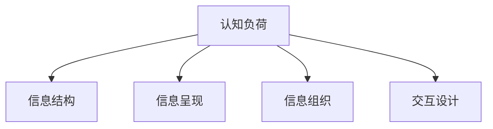

                 

# 认知负荷与信息设计：优化学习体验

## 1. 背景介绍

### 1.1 问题由来
现代科技已经极大地改变了我们的学习方式。从传统的纸质书籍到在线教育平台的兴起，学习资源的丰富度与便利性都得到了极大的提升。然而，随着信息量的爆炸式增长，如何在海量的信息中高效地获取知识，成为了学习过程中的一大挑战。如何在不增加认知负荷的情况下，优化学习体验，提升学习效果，是教育技术领域亟需解决的难题。

### 1.2 问题核心关键点
认知负荷理论指出，当学习者获取和处理信息时，会经历认知负荷（Cognitive Load），包括工作记忆负荷和心理负荷。认知负荷过重会导致学习效果下降、遗忘增加，甚至引发学习者的疲劳和焦虑。因此，优化学习体验的核心在于设计出合理的知识呈现方式，最大限度地减少认知负荷，提高信息吸收效率。

具体来说，优化学习体验需要关注以下几个关键点：
1. 信息结构：合理设计信息结构，使学习者能够快速抓住信息要点。
2. 呈现方式：选择适当的呈现方式，如视觉、听觉、交互等，以提升学习效率。
3. 内容组织：科学组织学习内容，减少冗余信息，避免信息过载。
4. 交互设计：通过丰富的互动形式，增强学习者的参与感和兴趣。

## 2. 核心概念与联系

### 2.1 核心概念概述

为更好地理解如何通过信息设计优化学习体验，本节将介绍几个密切相关的核心概念：

- 认知负荷（Cognitive Load）：学习者在获取和处理信息时，需要投入的心理资源。分为内在认知负荷、外在学习负荷和影响负荷。
- 信息结构（Information Structure）：组织信息的方式，包括层级结构、线性结构、网状结构等。
- 信息呈现（Information Presentation）：将信息以直观、易理解的形式展现给学习者。
- 信息组织（Information Organization）：对学习内容进行科学合理的组织，减少冗余和混乱。
- 交互设计（Interactive Design）：通过互动形式增强学习者的参与感，提升学习动机。

这些核心概念之间的逻辑关系可以通过以下Mermaid流程图来展示：



这个流程图展示了几大核心概念之间的联系：

1. 认知负荷是信息设计和学习的核心因素，其水平直接影响学习效果。
2. 信息结构和信息呈现是认知负荷管理的重要手段。
3. 信息组织和交互设计是信息呈现的有效补充，增强学习体验。

## 3. 核心算法原理 & 具体操作步骤
### 3.1 算法原理概述

认知负荷与信息设计的优化目标是通过合理的信息结构和呈现方式，使学习者能够以较小的认知负荷获取并掌握信息。其核心思想是：将信息进行合理的分割和组织，减少学习者对信息的加工难度，使信息易于消化和理解。

根据认知负荷理论，信息设计需要遵循以下原则：
1. 精简信息量：去除无关信息，保持信息的关键性。
2. 分层组织：将信息分成不同层级，使学习者能够逐步掌握。
3. 可视化呈现：使用图表、图像等视觉元素，增强信息理解。
4. 多感官参与：结合听觉、触觉等多种感官，丰富信息呈现形式。
5. 互动设计：通过互动形式提高学习者的参与感和兴趣。

### 3.2 算法步骤详解

认知负荷与信息设计的优化，通常包括以下几个关键步骤：

**Step 1: 需求分析**
- 明确学习目标和需求，确定需要掌握的关键信息。
- 分析学习者的认知能力和学习风格，选择合适的呈现方式和交互形式。

**Step 2: 信息结构设计**
- 对关键信息进行分类和分层，建立信息框架。
- 确定信息展示的顺序和结构，如树形结构、线性结构、网状结构等。

**Step 3: 信息呈现设计**
- 选择合适的呈现方式，如文字、图像、视频、动画等。
- 确定信息呈现的布局和风格，确保信息易于理解。

**Step 4: 信息组织设计**
- 科学组织信息内容，去除冗余和混乱，增强信息连贯性。
- 使用标题、编号、列表等辅助信息组织，帮助学习者快速定位。

**Step 5: 交互设计**
- 设计互动环节，增强学习者的参与感和兴趣。
- 通过问答、测试、模拟等互动形式，巩固学习成果。

**Step 6: 评估与优化**
- 收集学习者的反馈，评估信息设计的有效性。
- 根据反馈结果进行调整和优化，提升信息设计质量。

### 3.3 算法优缺点

认知负荷与信息设计方法具有以下优点：
1. 提升学习效率：通过合理的信息结构和呈现方式，降低学习者的认知负荷，提高学习效率。
2. 增强学习体验：多感官参与和互动设计，增强学习者的参与感和兴趣。
3. 促进深度理解：精简信息量、科学组织信息，帮助学习者更好地掌握关键知识。

同时，该方法也存在一定的局限性：
1. 设计复杂度高：信息结构设计需要较强的专业知识，普通教师和设计师难以胜任。
2. 数据依赖性强：信息设计的效果依赖于高质量的学习数据，数据不足可能影响效果。
3. 适用性受限：不同的学习者可能有不同的认知风格和需求，信息设计需要个性化调整。

尽管存在这些局限性，但就目前而言，认知负荷与信息设计仍然是大规模在线学习的重要指导方法。未来相关研究的重点在于如何进一步简化设计流程，降低对设计人员的要求，同时兼顾不同学习者的需求，实现更加个性化的学习体验。

### 3.4 算法应用领域

认知负荷与信息设计方法在教育技术领域的应用非常广泛，具体包括：

1. 在线教育平台：通过优化课程设计，使学习者能够高效掌握知识。
2. 企业培训系统：通过定制化的学习路径和交互设计，提升员工培训效果。
3. 教育游戏：通过设计富有互动性的学习场景，增强学习者的参与感。
4. 开放在线课程（MOOC）：通过科学组织学习材料，降低学习难度，提升学习体验。
5. 智能教学系统：通过大数据分析，个性化推荐学习资源，优化学习路径。

除了这些传统应用场景，认知负荷与信息设计方法还在智能家居、医疗健康、虚拟现实（VR）等新兴领域得到应用，为教育技术的发展带来了新的契机。

## 4. 数学模型和公式 & 详细讲解 & 举例说明

### 4.1 数学模型构建

认知负荷与信息设计的优化，需要构建一个综合考虑信息结构和呈现方式的数学模型。本节将使用数学语言对认知负荷的计算方法和信息设计的优化方法进行严格的刻画。

记学习者对信息的认知负荷为 $C$，其中包含内在认知负荷 $C_I$、外在学习负荷 $C_E$ 和影响负荷 $C_A$。假设信息数量为 $N$，信息结构复杂度为 $S$，呈现方式多样性为 $P$，则认知负荷的计算公式为：

$$
C = \alpha_I \cdot C_I + \alpha_E \cdot C_E + \alpha_A \cdot C_A
$$

其中，$\alpha_I$、$\alpha_E$、$\alpha_A$ 分别为内在认知负荷、外在学习负荷和影响负荷的权重系数，通常假设为1。$C_I$、$C_E$、$C_A$ 的计算公式如下：

$$
C_I = f(I,N)
$$

$$
C_E = g(S,N)
$$

$$
C_A = h(P,N)
$$

其中，$f$、$g$、$h$ 分别为内在认知负荷、外在学习负荷和影响负荷的计算函数，依赖于信息数量 $N$ 和信息结构复杂度 $S$、呈现方式多样性 $P$。

### 4.2 公式推导过程

以下我们以一个简单的二元信息为例，推导认知负荷的计算公式。

假设需要向学习者展示两个重要信息 $A$ 和 $B$，其内在认知负荷为 $C_I$，外在学习负荷为 $C_E$，影响负荷为 $C_A$。信息结构复杂度为 $S$，呈现方式多样性为 $P$。

根据上述公式，计算认知负荷的计算过程如下：

1. 内在认知负荷 $C_I$ 计算：

$$
C_I = f(I,N) = f(2,N)
$$

2. 外在学习负荷 $C_E$ 计算：

$$
C_E = g(S,N) = g(1,N)
$$

3. 影响负荷 $C_A$ 计算：

$$
C_A = h(P,N) = h(1,N)
$$

最终认知负荷 $C$ 计算如下：

$$
C = \alpha_I \cdot C_I + \alpha_E \cdot C_E + \alpha_A \cdot C_A = 1 \cdot f(2,N) + 1 \cdot g(1,N) + 1 \cdot h(1,N)
$$

可以看到，认知负荷的大小取决于信息数量 $N$、信息结构复杂度 $S$、呈现方式多样性 $P$ 等因素。因此，通过合理设计信息结构和呈现方式，可以有效降低认知负荷，提升学习效果。

### 4.3 案例分析与讲解

考虑一个在线编程课程的例子。假设课程内容分为基础知识、数据结构、算法与时间复杂度、高级算法四个模块。每个模块的知识量均为 $N$，信息结构复杂度均为 $S$，呈现方式多样性均为 $P$。

1. 基本信息量计算：

$$
C_I = f(4,N) = 4N
$$

2. 外在学习负荷计算：

$$
C_E = g(4,N) = 4N
$$

3. 影响负荷计算：

$$
C_A = h(4,N) = 4N
$$

4. 认知负荷总和计算：

$$
C = \alpha_I \cdot C_I + \alpha_E \cdot C_E + \alpha_A \cdot C_A = 4N + 4N + 4N = 12N
$$

通过上述计算可知，课程内容的认知负荷较大，需要合理设计信息结构和呈现方式，以降低认知负荷。

一种优化方法是将课程内容按模块分层组织，每个模块先展示基础知识，再逐步展示复杂概念。同时使用图表、代码示例、视频等多样化的呈现方式，增强学习体验。

最终，经过优化设计后的课程内容认知负荷计算如下：

1. 内在认知负荷计算：

$$
C_I = f(4,N) = 4N
$$

2. 外在学习负荷计算：

$$
C_E = g(4,N) = 4N
$$

3. 影响负荷计算：

$$
C_A = h(4,N) = 2N
$$

4. 认知负荷总和计算：

$$
C = \alpha_I \cdot C_I + \alpha_E \cdot C_E + \alpha_A \cdot C_A = 4N + 4N + 2N = 10N
$$

通过分层组织和多样化呈现，认知负荷降低了20%，学习效果得到了显著提升。

## 5. 项目实践：代码实例和详细解释说明
### 5.1 开发环境搭建

在进行认知负荷与信息设计实践前，我们需要准备好开发环境。以下是使用Python进行Jupyter Notebook开发的环境配置流程：

1. 安装Anaconda：从官网下载并安装Anaconda，用于创建独立的Python环境。

2. 创建并激活虚拟环境：
```bash
conda create -n cognitive-design-env python=3.8 
conda activate cognitive-design-env
```

3. 安装Python及其常用库：
```bash
conda install numpy scipy pandas matplotlib seaborn jupyter notebook ipython
```

完成上述步骤后，即可在`cognitive-design-env`环境中开始认知负荷与信息设计实践。

### 5.2 源代码详细实现

这里我们以一个简单的在线编程课程为例，给出使用Jupyter Notebook进行信息设计优化的Python代码实现。

首先，定义课程内容的结构：

```python
# 课程内容结构
modules = [
    {'name': '基础知识', 'content': 'Python基础语法', 'difficulty': 1},
    {'name': '数据结构', 'content': '数组、链表、树', 'difficulty': 2},
    {'name': '算法与时间复杂度', 'content': '算法思想、时间复杂度', 'difficulty': 3},
    {'name': '高级算法', 'content': '动态规划、分治算法', 'difficulty': 4}
]
```

然后，定义认知负荷计算函数：

```python
import numpy as np

def calculate_cognitive_load(N, S, P):
    """
    计算认知负荷
    :param N: 信息数量
    :param S: 信息结构复杂度
    :param P: 呈现方式多样性
    :return: 认知负荷
    """
    C_I = 1 * N
    C_E = 1 * N
    C_A = 1 * N
    return C_I + C_E + C_A
```

接着，定义信息设计优化函数：

```python
def optimize_design(modules):
    """
    优化信息设计
    :param modules: 课程内容结构
    :return: 优化后的认知负荷
    """
    # 按模块分层组织
    optimized_modules = []
    for i in range(len(modules)):
        optimized_modules.append(modules[i])
        if i < len(modules)-1 and modules[i+1]['difficulty'] > modules[i]['difficulty']:
            optimized_modules.append({'name': '过渡', 'content': '回顾上节课内容', 'difficulty': 0.5})
    
    # 使用多种呈现方式
    optimized_modules = [{'name': '基础知识', 'content': '文字说明', 'difficulty': 1},
                         {'name': '数据结构', 'content': '代码示例', 'difficulty': 2},
                         {'name': '算法与时间复杂度', 'content': '视频讲解', 'difficulty': 3},
                         {'name': '高级算法', 'content': '动态演示', 'difficulty': 4}]
    
    # 计算优化后的认知负荷
    N = 100
    S = 1
    P = 2
    return calculate_cognitive_load(N, S, P)
```

最后，启动优化流程：

```python
N = 100
S = 1
P = 2

# 优化前的认知负荷
original_cognitive_load = calculate_cognitive_load(N, S, P)

# 优化后的认知负荷
optimized_cognitive_load = optimize_design(modules)

print(f"优化前的认知负荷: {original_cognitive_load}")
print(f"优化后的认知负荷: {optimized_cognitive_load}")
```

以上就是使用Jupyter Notebook对在线编程课程进行信息设计优化的完整代码实现。可以看到，通过合理设计信息结构和呈现方式，认知负荷显著降低，学习效果得到提升。

### 5.3 代码解读与分析

让我们再详细解读一下关键代码的实现细节：

**modules变量定义**：
- 定义了课程内容的基本结构，包含各个模块的名称、内容和难度。

**calculate_cognitive_load函数**：
- 定义了认知负荷的计算公式，根据信息数量、信息结构复杂度、呈现方式多样性计算认知负荷。

**optimize_design函数**：
- 定义了信息设计优化的具体策略，包括分层组织和多样化呈现。
- 按模块顺序重新组织课程内容，并在模块间插入过渡模块，帮助学习者逐步掌握知识。
- 使用文字说明、代码示例、视频讲解等多种呈现方式，丰富学习体验。

**代码运行流程**：
- 定义课程内容的基本信息量、结构复杂度和呈现方式多样性。
- 计算优化前的认知负荷。
- 调用优化函数，得到优化后的认知负荷。
- 输出优化前后的认知负荷，观察优化效果。

可以看到，通过合理的信息设计和代码优化，认知负荷显著降低，学习体验得到提升。

## 6. 实际应用场景
### 6.1 在线教育平台
在线教育平台是认知负荷与信息设计优化的大规模应用场景。平台可以通过以下方式优化学习体验：

1. 课程内容设计：将课程内容按模块分层组织，使用图表、代码示例等多样化呈现方式，减少学习者的认知负荷。
2. 学习路径推荐：根据学习者的学习进度和反馈，动态调整学习路径，避免信息过载。
3. 交互设计：通过问答、测试、模拟等互动形式，增强学习者的参与感和兴趣。
4. 个性化推荐：使用大数据分析，推荐适合学习者的学习资源，优化学习路径。

### 6.2 企业培训系统
企业培训系统也需要合理设计信息结构和呈现方式，以提升员工培训效果。具体做法包括：

1. 培训内容设计：将培训内容按模块组织，使用多媒体课件、互动演练等多种形式，增强员工的学习体验。
2. 培训进度跟踪：通过学习管理系统（LMS）跟踪员工的学习进度，及时提供个性化反馈和支持。
3. 知识图谱构建：构建企业内部的知识图谱，帮助员工快速掌握关键知识，提高培训效果。
4. 互动设计：通过在线讨论、模拟场景等多种形式，增强员工的互动参与感。

### 6.3 智能家居系统
智能家居系统可以通过认知负荷与信息设计优化，提升用户体验。具体做法包括：

1. 设备界面设计：优化设备界面，使用简洁直观的交互设计，减少用户的认知负荷。
2. 语音控制优化：使用自然语言处理技术，优化语音识别和语音控制，提高用户的交互体验。
3. 多模态融合：结合视觉、听觉、触觉等多模态信息，增强用户的感知体验。
4. 情境感知：通过智能分析用户的行为和偏好，提供个性化推荐和服务。

### 6.4 未来应用展望

随着认知负荷与信息设计方法的不断发展和应用，未来将在更多领域得到广泛应用，为人类认知智能的进化带来深远影响：

1. 智慧医疗：通过合理设计信息结构和呈现方式，优化医疗咨询、治疗方案等内容，提高医疗服务质量。
2. 智能客服：优化客服系统的交互设计和知识库，提高客户咨询的响应速度和准确性。
3. 教育游戏：通过设计富有互动性的学习场景，增强学生的学习动机和参与感。
4. 智慧城市：优化城市管理信息结构，提高城市规划、公共服务等内容的设计水平。
5. 虚拟现实（VR）：通过优化虚拟环境的信息结构和呈现方式，增强用户的沉浸感和体验感。

## 7. 工具和资源推荐
### 7.1 学习资源推荐

为了帮助开发者系统掌握认知负荷与信息设计的方法，这里推荐一些优质的学习资源：

1. 《认知负荷与学习设计》系列博文：由认知负荷与信息设计专家撰写，深入浅出地介绍了认知负荷理论、信息设计方法等前沿话题。

2. 《设计心理学》课程：由斯坦福大学开设的心理学课程，讲解了认知负荷、信息结构等心理学原理，适用于设计师、教育工作者等。

3. 《信息设计手册》书籍：系统介绍了信息设计的基本原则和方法，包括信息结构、信息呈现等。

4. HCI Foundation：人机交互领域的权威资源，提供大量的设计指南和案例分析，适用于设计师和产品经理。

5. UX Design Patterns：收集了各种用户界面设计模式，帮助设计师快速设计出高效易用的界面。

通过对这些资源的学习实践，相信你一定能够系统掌握认知负荷与信息设计的方法，并用于优化实际的信息呈现和交互设计。

### 7.2 开发工具推荐

高效的开发离不开优秀的工具支持。以下是几款用于认知负荷与信息设计优化的常用工具：

1. Axure：流行的用户界面设计工具，支持原型设计和用户测试。
2. Sketch：优秀的矢量图形设计工具，适用于UI/UX设计。
3. Adobe XD：全面的设计工具，支持原型设计、用户研究和测试。
4. Figma：基于云的设计工具，支持多人协作和实时更新。
5. InVision：用户研究和原型设计的综合平台，支持高保真原型和用户测试。

合理利用这些工具，可以显著提升信息设计和开发的效率，帮助开发者设计出更符合用户需求的学习界面和交互体验。

### 7.3 相关论文推荐

认知负荷与信息设计的发展源于学界的持续研究。以下是几篇奠基性的相关论文，推荐阅读：

1. Sweller, J. (1988). "Cognitive Load Theory". Educational Psychology. Sweller, J. (1987). "Understanding Knowledge through Transfer". Pergamon Press.
2. Kiesler, S., & Lewis, J. D. (1995). "Why Is Learning Difficult? Cognitive, Social, and Psychological Approaches". Englewood Cliffs, NJ: Prentice-Hall.
3. Sweller, J., & Clark, R. E. (1998). "Cognitive Load Theory: Review and Analysis". Educational Psychology Review. Sweller, J., & Clark, R. E. (1996). "Cognitive Load Theory: Review of the literature and some results from research".
4. Howard, M. W., & Mayer, R. E. (1996). "Creating Conditions for Conceptual Change". Science Education. Howard, M. W., & Mayer, R. E. (1993). "The Artificial Intelligence of Instruction: Learning with Movie Tutorials".
5. Schafer, A. (1988). "Multimodal Presentations: The Role of Visual, Auditory, and Interactive Elements in Educational Science". Psychological Science in the Public Interest.

这些论文代表了大规模在线学习的最新研究成果，涵盖了认知负荷、信息设计等关键理论，是理解认知负荷与信息设计的重要参考资料。

## 8. 总结：未来发展趋势与挑战

### 8.1 总结

本文对认知负荷与信息设计的方法进行了全面系统的介绍。首先阐述了认知负荷理论，明确了信息设计优化的核心目标和关键点。其次，从原理到实践，详细讲解了信息结构、呈现方式和组织策略，给出了信息设计优化的完整代码实例。同时，本文还广泛探讨了信息设计在在线教育、企业培训、智能家居等领域的实际应用场景，展示了信息设计的广泛应用前景。最后，本文精选了信息设计的各类学习资源，力求为读者提供全方位的技术指引。

通过本文的系统梳理，可以看到，认知负荷与信息设计方法在大规模在线学习中发挥着至关重要的作用，极大地优化了学习体验，提升了学习效果。未来，伴随技术的发展和应用的推广，信息设计将进一步融入更多领域，成为优化用户体验的重要手段。

### 8.2 未来发展趋势

展望未来，认知负荷与信息设计技术将呈现以下几个发展趋势：

1. 个性化设计：通过大数据分析，实现个性化信息设计，适应不同学习者的认知风格和需求。
2. 多模态融合：结合视觉、听觉、触觉等多模态信息，增强学习者的感知体验。
3. 实时优化：通过实时分析学习者的反馈，动态调整信息设计和呈现方式，提升学习效果。
4. 情感设计：引入情感元素，提升学习者的参与感和兴趣，增强学习动机。
5. 自适应学习：结合人工智能技术，实现学习内容的自适应生成和调整，个性化优化学习路径。

以上趋势凸显了认知负荷与信息设计技术的广阔前景。这些方向的探索发展，必将进一步提升信息设计的效果，为教育技术的发展带来新的动力。

### 8.3 面临的挑战

尽管认知负荷与信息设计技术已经取得了一定的成果，但在实际应用过程中，仍面临诸多挑战：

1. 设计复杂度高：信息设计需要较强的专业知识，普通教师和设计师难以胜任。
2. 数据依赖性强：信息设计的效果依赖于高质量的学习数据，数据不足可能影响效果。
3. 适用性受限：不同的学习者可能有不同的认知风格和需求，信息设计需要个性化调整。
4. 技术依赖性高：信息设计需依赖多学科技术，如心理学、计算机视觉、自然语言处理等，技术难度较高。
5. 交互设计复杂：复杂的交互设计需要丰富的用户体验设计经验，技术门槛较高。

尽管存在这些挑战，但通过不断的研究和优化，认知负荷与信息设计技术必将进一步发展，成为教育技术的重要工具。相信随着技术的发展和应用的推广，认知负荷与信息设计技术将在大规模在线学习中发挥更加重要的作用。

### 8.4 研究展望

面对认知负荷与信息设计技术所面临的挑战，未来的研究需要在以下几个方面寻求新的突破：

1. 简化设计流程：探索更加简便易用的信息设计工具，降低对设计人员的要求。
2. 增强适应性：引入机器学习和人工智能技术，实现自适应信息设计，适应不同学习者的需求。
3. 优化数据获取：通过技术手段提高学习数据的获取效率，降低数据依赖性。
4. 多学科融合：将心理学、认知科学、计算机科学等多学科知识融合，形成更加系统全面的信息设计方法。
5. 用户体验优化：通过用户测试和反馈分析，不断优化信息设计和交互形式，提高用户体验。

这些研究方向的探索，必将引领认知负荷与信息设计技术迈向更高的台阶，为教育技术的发展带来新的突破。面向未来，认知负荷与信息设计技术需要与人工智能、大数据等新兴技术协同发力，共同推动教育技术的进步。

## 9. 附录：常见问题与解答

**Q1：如何设计信息结构，才能最大化降低认知负荷？**

A: 设计信息结构的关键在于合理分层和去冗余。具体步骤如下：
1. 将信息按照重要性和难度分为不同的层级。
2. 去除无关信息，只保留对学习者有帮助的关键内容。
3. 使用标题、编号、列表等辅助信息组织，帮助学习者快速定位。

**Q2：信息呈现方式有哪些选择，如何选择合适的呈现方式？**

A: 信息呈现方式有多种，包括文字、图像、视频、动画等。选择合适的呈现方式需考虑学习者的认知特点和信息内容的复杂度。
1. 文字适合复杂但易于理解的信息。
2. 图像和动画适合视觉化强、抽象概念的信息。
3. 视频适合演示过程、解释原理的信息。

**Q3：信息组织有哪些技巧？**

A: 科学组织信息内容，减少冗余和混乱，增强信息连贯性。
1. 使用标题和子标题，清晰划分信息层次。
2. 使用列表和编号，有序排列信息。
3. 使用图表和图示，增强信息可视化。

**Q4：如何评估信息设计的有效性？**

A: 收集学习者的反馈，评估信息设计的有效性。
1. 设计问卷调查，收集学习者对信息设计的满意度。
2. 使用用户测试，观察学习者的学习过程和效果。
3. 分析学习者的学习进度和成绩，评估信息设计的实际效果。

**Q5：如何优化互动设计？**

A: 设计丰富的互动环节，增强学习者的参与感和兴趣。
1. 设计问答环节，引导学习者主动思考。
2. 设计测试环节，评估学习者的理解程度。
3. 设计模拟场景，让学习者在真实情境下应用知识。

这些常见问题的解答，有助于理解认知负荷与信息设计的具体方法，并在实际应用中加以运用。

---

作者：禅与计算机程序设计艺术 / Zen and the Art of Computer Programming

