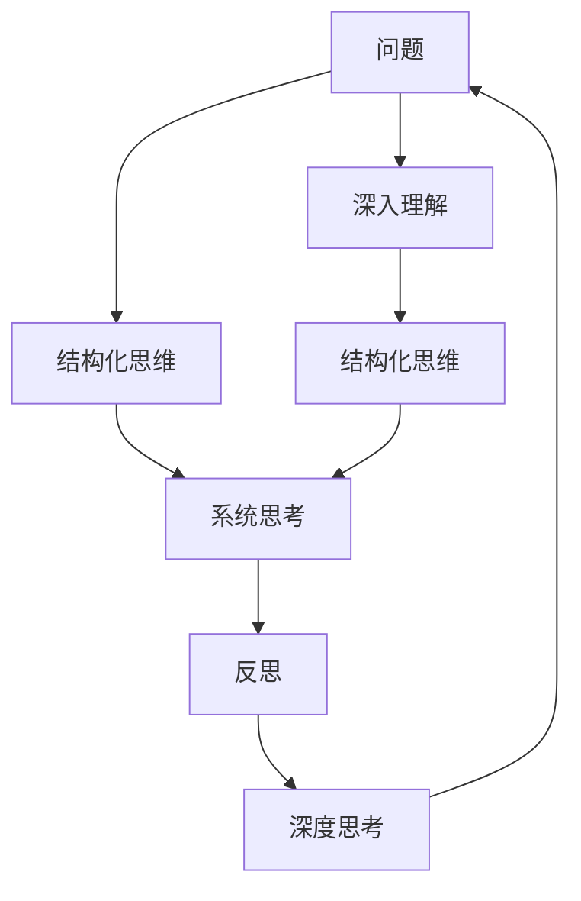

                 

# 费曼提问法激发管理者思考深度

费曼（Richard Feynman）是一位伟大的物理学家，被誉为"世界上最伟大的科学家"之一。他在教学中倡导一种独特的学习方法——费曼提问法（The Feynman Technique），被广泛应用在各个领域中。这篇文章将重点探讨费曼提问法对管理者思考深度的提升，以及在企业经营管理中的应用。

## 1. 背景介绍

### 1.1 问题由来

在企业管理中，决策者常常面临各种复杂问题和挑战。传统的决策方式往往依赖于经验和直觉，难以保证全面性和系统性。费曼提问法提供了一种全新的思维方式，能够帮助管理者从根本上提升问题解决的深度和广度。

### 1.2 问题核心关键点

费曼提问法关键在于：
- **深入理解**：通过深入思考和提问，使决策者对问题的本质有更全面的理解。
- **结构化思维**：以结构化的方式组织问题，便于理清思路和寻找解决方案。
- **持续反思**：通过不断反思和改进，提高个人和组织的思维深度和决策能力。

### 1.3 问题研究意义

费曼提问法对管理者的提升，不仅在于解决具体问题，更重要的是通过提问和反思，提升其系统性思维和全局视野。在快节奏、高竞争的商业环境中，管理者只有具备深入思考的能力，才能更好地把握机遇，迎接挑战，推动企业持续发展。

## 2. 核心概念与联系

### 2.1 核心概念概述

- **费曼提问法（Feynman Technique）**：由著名物理学家理查德·费曼提出，强调通过向自己提问，深入理解问题的本质，提升思考深度和广度。

- **结构化思维（Structured Thinking）**：将复杂问题分解为结构化的组成部分，逐一攻克，形成系统的解决方案。

- **系统思考（Systems Thinking）**：从整体和系统角度出发，理解各个部分之间的关系，揭示问题的根本原因和深层次影响。

- **反思（Reflection）**：不断回顾和审视自己的思考过程和决策结果，持续改进思维模式和方法。

- **深度思考（Deep Thinking）**：超越表面现象，深入探究问题的本质和根本原因，寻求最优化解决方案。

### 2.2 核心概念原理和架构的 Mermaid 流程图



## 3. 核心算法原理 & 具体操作步骤

### 3.1 算法原理概述

费曼提问法基于费曼学习法，强调通过自我提问的方式，深入理解问题的本质和细节，从而提升思考深度。其核心思想可以概括为：

1. **初始问题描述**：将问题清晰、简洁地描述出来。
2. **深入提问**：不断提出更深入、更具体的问题，逐步揭示问题的本质。
3. **结构化分解**：将问题分解为结构化的组成部分，逐一攻克。
4. **系统化思考**：从整体和系统角度出发，理解各个部分之间的关系。
5. **反思和改进**：持续回顾和反思自己的思考过程和决策结果，不断优化思维模式和方法。

### 3.2 算法步骤详解

#### 步骤1：明确初始问题

- **明确目标**：清晰地描述要解决的问题，确保问题具有明确的边界和目标。
- **消除歧义**：避免问题的描述过于宽泛或模糊，导致后续的思考难以聚焦。

#### 步骤2：深入提问

- **多角度提问**：从不同的角度和层面提出问题，逐步揭示问题的本质。
- **自问自答**：不断追问自己问题的答案，直到对问题的本质有深入的理解。
- **运用类比**：通过类比，将问题与已知的、相似的场景进行对比，寻找解决方案。

#### 步骤3：结构化分解

- **问题分解**：将问题分解为更小的、可操作的部分，逐一攻克。
- **优先级排序**：根据问题的复杂度和重要性，确定优先解决的子问题。
- **阶段性目标**：为每个子问题设定阶段性目标，逐步推进问题的解决。

#### 步骤4：系统化思考

- **整体视角**：从整体和系统角度出发，理解各个子问题之间的关系。
- **因果分析**：识别出问题的根本原因和深层次影响，揭示问题的全貌。
- **系统优化**：从系统优化的角度，设计解决问题的最佳方案。

#### 步骤5：反思和改进

- **持续回顾**：不断回顾和反思自己的思考过程和决策结果，总结经验教训。
- **迭代优化**：根据反馈和改进建议，不断调整和优化思维模式和方法。
- **持续学习**：持续学习新的知识和方法，提升思维深度和广度。

### 3.3 算法优缺点

#### 优点

- **深度思考**：通过不断深入提问，使决策者对问题的本质有更全面的理解，提升思考深度。
- **结构化思维**：将复杂问题分解为可操作的部分，便于理清思路和寻找解决方案。
- **系统性思考**：从整体和系统角度出发，理解问题的根本原因和深层次影响，揭示问题的全貌。
- **持续改进**：通过反思和改进，持续提升个人和组织的思维深度和决策能力。

#### 缺点

- **时间成本**：深入提问和系统思考需要大量的时间和精力，可能影响决策效率。
- **执行难度**：对于复杂的、多维的问题，难以一次性全面理解和解决。
- **依赖个人能力**：依赖于决策者的个人思维深度和提问技巧，存在一定的局限性。

### 3.4 算法应用领域

费曼提问法适用于各种管理场景，包括但不限于：

- **战略规划**：在制定企业战略时，通过提问和系统思考，明确目标和路径，优化资源配置。
- **项目管理**：在项目管理过程中，通过结构化分解和系统化思考，确保项目按时、按质完成。
- **组织变革**：在推动组织变革时，通过深入提问和反思，识别和解决阻碍变革的因素，确保变革成功。
- **创新管理**：在创新管理中，通过持续反思和改进，提升组织创新能力和竞争优势。
- **人力资源管理**：在人力资源管理中，通过提问和系统思考，优化人才选拔、培养和激励机制，提升团队绩效。

## 4. 数学模型和公式 & 详细讲解 & 举例说明

### 4.1 数学模型构建

假设问题为 $P$，设 $\mathcal{P} = \{p_1, p_2, \ldots, p_n\}$ 为问题 $P$ 的子问题集合。设 $\mathcal{R} = \{r_1, r_2, \ldots, r_m\}$ 为问题的反思点集合。

定义问题 $P$ 的深度为 $\delta(P)$，结构化为 $\delta(P) = \max_{i=1}^n \delta(p_i)$，其中 $\delta(p_i)$ 为子问题 $p_i$ 的深度。

定义问题 $P$ 的系统性为 $\sigma(P)$，定义为 $\sigma(P) = \sum_{j=1}^m r_j \cdot \delta(p_j)$，其中 $r_j$ 为反思点 $r_j$ 的权重。

### 4.2 公式推导过程

根据以上定义，问题 $P$ 的深度和系统性可以通过以下公式计算：

$$
\delta(P) = \max_{i=1}^n \delta(p_i)
$$

$$
\sigma(P) = \sum_{j=1}^m r_j \cdot \delta(p_j)
$$

其中，$n$ 为问题 $P$ 的子问题个数，$m$ 为反思点 $r_j$ 的个数，$r_j$ 为反思点 $r_j$ 的权重，$\delta(p_i)$ 为子问题 $p_i$ 的深度。

通过公式推导，可以明确问题 $P$ 的深度和系统性，从而指导后续的提问和结构化思考。

### 4.3 案例分析与讲解

**案例1：企业战略规划**

问题：如何制定有效的企业战略？

初始问题：企业当前面临的主要挑战是什么？

**问题1：市场竞争**  
问题：哪些行业领域的竞争最激烈？市场规模有多大？

**问题2：技术创新**  
问题：当前技术趋势是什么？企业在这方面的优势和劣势是什么？

**问题3：客户需求**  
问题：客户最看重哪些产品特性？市场对新产品的接受度如何？

通过深入提问，管理者可以明确企业面临的主要挑战，并从市场竞争、技术创新、客户需求三个方面进行系统性思考，制定出更有针对性的战略规划。

**案例2：项目管理**

问题：如何确保项目按时、按质完成？

初始问题：项目的主要里程碑有哪些？

**问题1：进度管理**  
问题：项目的各个里程碑之间有哪些依赖关系？

**问题2：质量控制**  
问题：项目的质量标准是什么？如何确保各个阶段的质量？

**问题3：风险管理**  
问题：项目中可能遇到的风险有哪些？如何预防和应对？

通过结构化分解和系统化思考，管理者可以制定出详细且可行的项目计划，确保项目顺利完成。

## 5. 项目实践：代码实例和详细解释说明

### 5.1 开发环境搭建

费曼提问法主要用于思维提升，无需复杂的代码实现。但为了进行系统性思考和结构化分解，可以使用一些工具辅助管理。

- **项目管理工具**：如JIRA、Trello等，用于跟踪任务进度和里程碑。
- **系统思维工具**：如因果图、鱼骨图等，用于分析问题原因和影响。
- **反思工具**：如日记、反思表格等，用于记录和总结反思结果。

### 5.2 源代码详细实现

由于费曼提问法主要依赖于思维提升和系统性思考，无需编写具体的代码实现。但可以通过编写代码来辅助进行系统化思考。

**示例代码：因果图绘制**

```python
import networkx as nx
import matplotlib.pyplot as plt

# 创建因果图
G = nx.DiGraph()

# 添加节点
G.add_node('市场竞争')
G.add_node('技术创新')
G.add_node('客户需求')

# 添加边
G.add_edge('市场竞争', '技术创新', weight=0.5)
G.add_edge('市场竞争', '客户需求', weight=0.5)
G.add_edge('技术创新', '客户需求', weight=0.5)

# 绘制因果图
nx.draw(G, with_labels=True)
plt.show()
```

### 5.3 代码解读与分析

以上代码展示了如何使用Python的NetworkX库绘制因果图，用于表示企业战略规划中的三个主要因素：市场竞争、技术创新和客户需求。通过因果图的可视化，管理者可以更直观地理解各个因素之间的关系，并进行系统性思考。

### 5.4 运行结果展示

通过绘制的因果图，管理者可以看到市场竞争、技术创新和客户需求之间的双向关系，从而更好地进行系统化思考，制定出更有针对性的战略规划。

## 6. 实际应用场景

### 6.1 战略规划

在企业战略规划中，费曼提问法可以帮助管理者深入理解市场环境、技术趋势和客户需求，从而制定出更科学、更具前瞻性的战略。通过深入提问和系统化思考，管理者可以全面掌握企业的发展方向和竞争优势，提升决策的科学性和有效性。

### 6.2 项目管理

在项目管理过程中，费曼提问法可以用于分解和结构化管理任务，确保项目按时、按质完成。通过系统化思考和反思，管理者可以及时发现和解决项目中的问题，提升项目的整体执行效率。

### 6.3 组织变革

在推动组织变革时，费曼提问法可以帮助管理者识别和解决阻碍变革的因素，确保变革顺利进行。通过深入提问和系统化思考，管理者可以全面评估变革的可行性，制定出科学的变革策略，减少变革阻力，提高变革成功率。

## 7. 工具和资源推荐

### 7.1 学习资源推荐

1. **《费曼学习法》**  
   费曼学习法（Feynman Technique）的详细介绍和实践指南，适合各种领域的读者阅读。
   
2. **《系统思考》**  
   帕斯卡尔·米格（Pascale Mutti）的著作，深入讲解系统思维和系统思考的方法，适合企业管理者阅读。

3. **《深度工作》**  
   卡尔·纽波特（Cal Newport）的著作，讲述如何通过深度工作提升个人和组织的思考深度，适合企业管理者和员工阅读。

### 7.2 开发工具推荐

1. **项目管理工具**  
   如JIRA、Trello等，用于跟踪任务进度和里程碑，确保项目按时完成。
   
2. **系统思维工具**  
   如因果图、鱼骨图等，用于分析问题原因和影响，进行系统化思考。

3. **反思工具**  
   如日记、反思表格等，用于记录和总结反思结果，持续改进思维模式。

### 7.3 相关论文推荐

1. **《费曼学习法：一个革命性的学习法》**  
   卡尔·纽波特（Cal Newport）的论文，详细介绍费曼学习法的原理和应用，适合企业管理者阅读。

2. **《系统思考：构建思维深度与决策能力》**  
   帕斯卡尔·米格的论文，深入讲解系统思维和系统思考的方法，适合企业管理者阅读。

3. **《深度工作：如何有效利用深度时间提升生产力》**  
   卡尔·纽波特（Cal Newport）的论文，讲述如何通过深度工作提升个人和组织的思考深度，适合企业管理者和员工阅读。

## 8. 总结：未来发展趋势与挑战

### 8.1 研究成果总结

费曼提问法在企业管理中已经得到了广泛应用，帮助管理者提升思考深度和决策能力。其核心思想是深入理解问题的本质，通过结构化思维和系统化思考，逐步揭示问题的全貌，提升决策的科学性和有效性。

### 8.2 未来发展趋势

未来，费曼提问法将进一步融入企业管理培训和实践，成为提升管理者思维深度和决策能力的标准工具。随着技术的进步和工具的完善，费曼提问法将更加自动化和智能化，进一步提升其应用效果。

### 8.3 面临的挑战

尽管费曼提问法在企业管理中已经取得了显著成效，但仍面临一些挑战：

1. **时间和精力成本**：深入提问和系统化思考需要大量的时间和精力，可能影响决策效率。
2. **执行难度**：对于复杂的、多维的问题，难以一次性全面理解和解决。
3. **依赖个人能力**：依赖于决策者的个人思维深度和提问技巧，存在一定的局限性。

### 8.4 研究展望

未来的研究将重点在于：

1. **工具和平台的开发**：开发更多智能化的工具和平台，帮助管理者自动化执行费曼提问法，降低时间和精力成本。
2. **知识图谱的应用**：将知识图谱与费曼提问法结合，提供更丰富、更准确的背景知识，提升问题的理解深度。
3. **案例库的建设**：构建丰富的案例库，提供可复制、可推广的实践经验，帮助更多管理者提升思维深度和决策能力。

总之，费曼提问法作为一种深度思考的方法，能够帮助管理者全面理解问题的本质，提升决策的科学性和有效性。未来，随着工具和平台的进一步优化，费曼提问法将在企业管理中发挥更大的作用。

## 9. 附录：常见问题与解答

**Q1：费曼提问法是否适用于所有管理者？**

A: 费曼提问法适用于各类管理场景，但适用程度因个体和组织而异。对于具有较高思维深度和管理经验的管理者，费曼提问法能够显著提升其决策能力。但对于缺乏系统思维和深度思考能力的管理者，需要逐步学习和适应。

**Q2：费曼提问法的时间成本如何？**

A: 费曼提问法的时间成本较高，但可以通过工具和平台自动化执行，减少时间和精力投入。在实际应用中，需要根据问题的复杂度和管理者的实际工作情况，灵活调整提问和思考的深度和时间。

**Q3：如何提高费曼提问法的执行效果？**

A: 提高费曼提问法的执行效果，可以通过以下方法：

1. **系统培训**：通过系统培训，帮助管理者掌握费曼提问法的原理和应用方法。
2. **团队合作**：将费曼提问法融入团队协作流程，通过集体讨论和反思，提升团队的思维深度和决策能力。
3. **持续改进**：在每次提问和反思中，不断总结经验和教训，持续改进思维模式和方法，提升思维深度和决策能力。

总之，费曼提问法作为一种深度的思考方法，需要管理者在实践中不断学习和应用，才能真正提升其决策能力和管理水平。

---

作者：禅与计算机程序设计艺术 / Zen and the Art of Computer Programming

