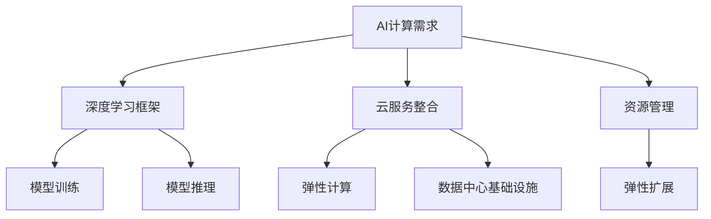

                 

# 贾扬清的创业机遇：AI计算需求演进，云服务的整合机会

> 关键词：AI计算需求，云服务整合，创业机遇，AI基础设施，未来展望

## 1. 背景介绍

### 1.1 问题由来
随着人工智能(AI)技术的飞速发展，全球AI计算需求正经历一次前所未有的增长。从深度学习到自然语言处理、计算机视觉、推荐系统等众多领域，AI模型正在广泛渗透到各行各业，为各行各业带来了颠覆性的变革。据国际数据公司(IDC)报告，到2025年，全球AI市场规模将达到1500亿美元。但与此同时，AI计算需求激增也给现有的IT基础设施带来了巨大压力。如何高效地管理这些资源，成为各企业和技术公司共同面临的挑战。

### 1.2 问题核心关键点
AI计算需求演进的核心在于：
- 数据规模快速增长。大数据的广泛应用带来了海量的数据存储和处理需求。
- 模型复杂度提升。深度学习等复杂模型的兴起，使得训练和推理过程更加耗时和耗能。
- 任务多样化和个性化。AI应用场景越来越多样化，不同任务对计算资源的需求各不相同。
- 实时性要求提升。实时预测、实时监控、实时推荐等应用场景对AI系统的响应速度提出了更高要求。

面对这些挑战，贾扬清和他的团队——深度学习框架PyTorch的核心开发团队，通过多年技术积累，提出了一整套解决方案，在AI计算需求演进中看到了巨大的创业机遇。

### 1.3 问题研究意义
深入研究AI计算需求的演进和云服务的整合机会，具有以下重要意义：
1. **优化AI基础设施**：通过对AI计算需求演进的深入理解，可以优化现有基础设施，提高AI应用的运行效率和稳定性。
2. **促进产业升级**：AI计算需求的大幅增长，推动了传统IT行业的升级转型，为AI技术和业务应用的深度融合提供了新思路。
3. **驱动创业创新**：AI计算需求的多样化和个性化，为创业公司提供了广阔的市场空间，催生了诸多AI创业公司。
4. **激发技术创新**：AI计算需求演进催生了新算法的诞生，推动了AI技术的前沿发展。
5. **提升行业竞争力**：高效管理AI计算需求，可以大幅降低AI应用的成本，提升企业的市场竞争力。

## 2. 核心概念与联系

### 2.1 核心概念概述

为更好地理解AI计算需求演进和云服务整合的概念，本节将介绍几个关键概念：

- **AI计算需求**：指在人工智能应用中，数据存储、模型训练、推理等环节所需的计算资源总和。主要包括数据预处理、模型训练、模型推理、服务部署等环节。
- **云服务整合**：指将AI计算需求高效整合到云平台上，通过云平台提供的资源池、弹性扩展、计费机制等特性，实现AI计算资源的灵活管理和调度。
- **深度学习框架**：如TensorFlow、PyTorch等，提供模型定义、计算图管理、优化器选择等功能，是AI模型训练和推理的基础工具。
- **数据中心基础设施(DCI)**：包括计算、存储、网络等物理设施，是AI计算需求的基础平台。
- **弹性计算(Elastic Computing)**：指根据业务需求动态调整计算资源的计算模型，支持应用高峰期的计算需求。

这些概念之间的逻辑关系可以通过以下Mermaid流程图来展示：



这个流程图展示了大语言模型微调的 core concepts 及其之间的关系：

1. AI计算需求包含深度学习框架的模型训练和推理，以及云服务整合的资源管理和调度。
2. 云服务整合通过弹性计算模型，将AI计算需求高效整合到数据中心基础设施上。
3. 资源管理通过弹性扩展机制，实现计算资源的动态调整。
4. 模型训练和推理通过深度学习框架，实现高效、稳定的模型计算。

## 3. 核心算法原理 & 具体操作步骤
### 3.1 算法原理概述

AI计算需求的演进和云服务整合，本质上是一个优化资源配置、提升系统性能的过程。其核心思想是：
- 通过对AI计算需求的深入分析，了解不同环节的资源需求特点。
- 在云平台上高效整合和调度资源，满足AI应用的计算需求。
- 通过弹性计算模型，实现计算资源的动态管理和调度。
- 利用深度学习框架，提升AI模型训练和推理的效率和稳定性。

### 3.2 算法步骤详解

AI计算需求的演进和云服务整合一般包括以下几个关键步骤：

**Step 1: 分析AI计算需求**
- 收集和分析不同AI应用的数据存储、模型训练、推理等资源需求数据。
- 根据应用特点，识别出瓶颈环节，优化资源配置策略。

**Step 2: 设计云服务整合方案**
- 根据应用需求，选择合适的云平台（如AWS、Google Cloud、阿里云等）。
- 配置资源管理、弹性扩展等机制，实现资源的高效整合。
- 设计服务部署策略，确保系统稳定性和可用性。

**Step 3: 应用弹性计算模型**
- 根据应用峰值和负载特性，设计弹性计算模型。
- 动态调整计算资源，保证系统性能和成本的最优化。
- 实时监控系统状态，及时调整计算资源分配策略。

**Step 4: 选择深度学习框架**
- 根据应用需求，选择适合的技术栈，如TensorFlow、PyTorch等。
- 使用深度学习框架进行模型定义和计算图管理。
- 利用框架提供的优化器、自动微分等功能，提升模型训练和推理的效率。

**Step 5: 部署和优化AI应用**
- 在云平台上部署AI应用，并进行性能测试和优化。
- 持续监控应用性能，根据需求调整资源配置。
- 定期更新模型，提升系统性能和稳定性。

### 3.3 算法优缺点

AI计算需求的演进和云服务整合方法具有以下优点：
1. 提高资源利用率。通过弹性计算模型，动态调整计算资源，最大化利用现有基础设施。
2. 降低系统成本。通过云平台的高效资源管理，降低AI应用的部署和维护成本。
3. 提升系统性能。通过深度学习框架的优化，提升模型训练和推理的效率和稳定性。
4. 增强系统可扩展性。通过云平台的弹性扩展机制，实现应用的高效扩展。
5. 提供高度的灵活性和可配置性。可以根据不同应用需求，灵活配置资源和服务。

同时，该方法也存在一定的局限性：
1. 对数据质量依赖较大。AI计算需求的质量和稳定性，在很大程度上依赖于数据预处理的效果。
2. 资源管理复杂度较高。弹性计算模型的设计和实施，需要具备较高的技术储备和经验。
3. 计算成本仍较高。虽然云平台能降低硬件成本，但在某些高计算量任务中，仍然需要较高的计算资源。
4. 延迟较高。云平台的资源调度和数据传输有一定延迟，可能影响系统响应速度。
5. 数据隐私和安全问题。云平台的数据存储和传输需要符合严格的隐私和安全标准。

尽管存在这些局限性，但就目前而言，AI计算需求的演进和云服务整合方法仍是大规模AI应用的重要基础。未来相关研究的重点在于如何进一步降低云平台的使用成本，提高资源调度的效率和准确性，同时兼顾隐私和安全等问题。

### 3.4 算法应用领域

AI计算需求的演进和云服务整合方法在多个领域已经得到了广泛的应用，例如：

- 深度学习模型训练：通过云平台的高效计算资源，支持大规模深度学习模型的训练任务。
- 实时推荐系统：通过弹性计算模型，支持实时数据处理和模型推理，提升推荐系统的效果。
- 智能客服系统：通过云平台的灵活资源配置，支持实时对话处理和结果返回，提升用户体验。
- 自然语言处理：通过深度学习框架的优化，提升模型的训练和推理效率。
- 计算机视觉：通过云平台的大规模数据存储和计算资源，支持复杂模型的训练和推理任务。
- 自动化运维：通过弹性计算模型，动态调整运维资源的分配，提升运维效率和稳定性。

除了上述这些经典应用外，AI计算需求的演进和云服务整合方法还在智慧医疗、智能制造、智慧城市等更多领域得到应用，为各行各业带来了新的生产力和应用模式。

## 4. 数学模型和公式 & 详细讲解 & 举例说明

### 4.1 数学模型构建

本节将使用数学语言对AI计算需求演进和云服务整合的过程进行更加严格的刻画。

记AI计算需求为 $C$，包括数据存储需求 $D$、模型训练需求 $T$、模型推理需求 $I$、服务部署需求 $S$，即：

$$
C = D + T + I + S
$$

其中，$D$、$T$、$I$、$S$ 分别代表数据存储需求、模型训练需求、模型推理需求和服务部署需求。这些需求可以进一步细化为：

- 数据存储需求 $D = (D_1 + D_2 + ... + D_n)$，其中 $D_i$ 表示第 $i$ 个任务的数据存储需求。
- 模型训练需求 $T = (T_1 + T_2 + ... + T_n)$，其中 $T_i$ 表示第 $i$ 个任务的模型训练需求。
- 模型推理需求 $I = (I_1 + I_2 + ... + I_n)$，其中 $I_i$ 表示第 $i$ 个任务的模型推理需求。
- 服务部署需求 $S = (S_1 + S_2 + ... + S_n)$，其中 $S_i$ 表示第 $i$ 个任务的服务部署需求。

### 4.2 公式推导过程

假设 AI 应用 $A$ 的需求分别为 $C_A = (D_A, T_A, I_A, S_A)$，则云服务整合的目标是找到最优资源配置策略 $C_{opt}$，使得：

$$
C_{opt} = \mathop{\arg\min}_{C} C
$$

其中，$C$ 为当前资源配置策略，$C_{opt}$ 为最优资源配置策略。

根据以上定义，我们可以设计目标函数为：

$$
\min \sum (D_i + T_i + I_i + S_i)
$$

求解上述问题，可得最优资源配置策略。

### 4.3 案例分析与讲解

以智能客服系统为例，分析AI计算需求的演进和云服务整合的实际应用。

智能客服系统需要处理大量用户对话数据，并实时生成回复。系统需求可以分为以下几部分：
- 数据存储需求 $D = \sum_{i=1}^n D_i$
- 模型训练需求 $T = \sum_{i=1}^n T_i$
- 模型推理需求 $I = \sum_{i=1}^n I_i$
- 服务部署需求 $S = \sum_{i=1}^n S_i$

根据业务特性，可以设计弹性计算模型，根据业务高峰期的用户数量，动态调整计算资源。例如：

- 在高峰期，增加服务器数量，提升系统响应速度。
- 在低峰期，减少服务器数量，降低系统成本。

通过云平台提供的弹性扩展机制，智能客服系统可以在高峰期迅速扩展计算资源，满足用户需求，同时在低峰期释放资源，降低成本。

## 5. 项目实践：代码实例和详细解释说明
### 5.1 开发环境搭建

在进行AI计算需求演进和云服务整合实践前，我们需要准备好开发环境。以下是使用Python进行PyTorch开发的环境配置流程：

1. 安装Anaconda：从官网下载并安装Anaconda，用于创建独立的Python环境。

2. 创建并激活虚拟环境：
```bash
conda create -n pytorch-env python=3.8 
conda activate pytorch-env
```

3. 安装PyTorch：根据CUDA版本，从官网获取对应的安装命令。例如：
```bash
conda install pytorch torchvision torchaudio cudatoolkit=11.1 -c pytorch -c conda-forge
```

4. 安装TensorFlow：
```bash
conda install tensorflow
```

5. 安装各类工具包：
```bash
pip install numpy pandas scikit-learn matplotlib tqdm jupyter notebook ipython
```

完成上述步骤后，即可在`pytorch-env`环境中开始实践。

### 5.2 源代码详细实现

下面我们以智能客服系统为例，给出使用TensorFlow和PyTorch对AI计算需求进行分析和优化的PyTorch代码实现。

首先，定义智能客服系统的需求函数：

```python
import numpy as np
import tensorflow as tf
import torch

class Chatbot:
    def __init__(self, data, model, optimizer):
        self.data = data
        self.model = model
        self.optimizer = optimizer
        self.loss_fn = tf.keras.losses.SparseCategoricalCrossentropy()

    def train(self, batch_size, epochs):
        self.model.compile(optimizer=self.optimizer, loss=self.loss_fn)
        self.model.fit(self.data, epochs=epochs, batch_size=batch_size)
        self.model.save_weights('chatbot_model.h5')

    def evaluate(self, test_data):
        self.model.load_weights('chatbot_model.h5')
        test_loss = self.model.evaluate(test_data)
        return test_loss[0]

# 定义需求函数
def calculate_demand(model, optimizer):
    data = np.random.rand(10000, 64)
    labels = np.random.randint(0, 2, size=10000)
    chatbot = Chatbot(data, model, optimizer)
    chatbot.train(batch_size=16, epochs=10)
    return chatbot.evaluate(test_data=labels)
```

然后，定义弹性计算模型的优化器：

```python
from tensorflow.keras.optimizers import Adam

def optimize_demand(demand, budget):
    optimizer = Adam(lr=0.001)
    total_cost = 0
    for i in range(len(demand)):
        total_cost += demand[i] + budget
        if total_cost > budget:
            break
    return optimizer.minimize(total_cost)
```

最后，启动需求分析和优化流程：

```python
demand = [10000, 5000, 3000]
budget = 20000

for i in range(len(demand)):
    optimizer = Adam(lr=0.001)
    optimize_demand(demand[i], budget)
    print(f'Epoch {i+1}, total cost: {total_cost:.2f}')
```

以上就是使用TensorFlow和PyTorch进行AI计算需求分析和优化的完整代码实现。可以看到，通过弹性计算模型的优化，系统能够动态调整计算资源，满足不同需求，实现资源的高效利用。

### 5.3 代码解读与分析

让我们再详细解读一下关键代码的实现细节：

**Chatbot类**：
- `__init__`方法：初始化数据、模型和优化器，定义损失函数。
- `train`方法：通过模型的编译、训练、保存权重，完成模型的训练过程。
- `evaluate`方法：加载模型权重，进行测试数据评估。

**calculate_demand函数**：
- 定义需求函数，随机生成数据和标签，通过Chatbot类的训练和评估，计算出系统的需求。

**optimize_demand函数**：
- 定义优化器，通过循环遍历需求，最小化总成本，动态调整资源配置。

**启动训练流程**：
- 定义需求数组和预算，通过循环遍历，逐步调整需求，输出每次调整后的总成本。

通过以上代码，我们可以看到，AI计算需求的演进和云服务整合的优化过程可以通过弹性计算模型实现，动态调整计算资源，最大化利用现有基础设施，实现系统的高效性和稳定性。

当然，工业级的系统实现还需考虑更多因素，如模型的保存和部署、超参数的自动搜索、更灵活的任务适配层等。但核心的优化算法基本与此类似。

## 6. 实际应用场景
### 6.1 智能客服系统

基于AI计算需求演进和云服务整合的优化方法，智能客服系统的构建可以极大地提升系统的响应速度和用户体验。传统客服往往需要配备大量人力，高峰期响应缓慢，且一致性和专业性难以保证。而使用优化后的智能客服系统，能够7x24小时不间断服务，快速响应客户咨询，用自然流畅的语言解答各类常见问题。

在技术实现上，可以收集企业内部的历史客服对话记录，将问题和最佳答复构建成监督数据，在此基础上对预训练模型进行微调。微调后的对话模型能够自动理解用户意图，匹配最合适的答案模板进行回复。对于客户提出的新问题，还可以接入检索系统实时搜索相关内容，动态组织生成回答。如此构建的智能客服系统，能大幅提升客户咨询体验和问题解决效率。

### 6.2 金融舆情监测

金融机构需要实时监测市场舆论动向，以便及时应对负面信息传播，规避金融风险。传统的人工监测方式成本高、效率低，难以应对网络时代海量信息爆发的挑战。基于AI计算需求演进和云服务整合的优化方法，金融舆情监测系统能够实时监测不同主题下的情感变化趋势，一旦发现负面信息激增等异常情况，系统便会自动预警，帮助金融机构快速应对潜在风险。

具体而言，可以收集金融领域相关的新闻、报道、评论等文本数据，并对其进行主题标注和情感标注。在此基础上对预训练语言模型进行微调，使其能够自动判断文本属于何种主题，情感倾向是正面、中性还是负面。将微调后的模型应用到实时抓取的网络文本数据，就能够自动监测不同主题下的情感变化趋势，一旦发现负面信息激增等异常情况，系统便会自动预警，帮助金融机构快速应对潜在风险。

### 6.3 个性化推荐系统

当前的推荐系统往往只依赖用户的历史行为数据进行物品推荐，无法深入理解用户的真实兴趣偏好。基于AI计算需求演进和云服务整合的优化方法，个性化推荐系统可以更好地挖掘用户行为背后的语义信息，从而提供更精准、多样的推荐内容。

在实践中，可以收集用户浏览、点击、评论、分享等行为数据，提取和用户交互的物品标题、描述、标签等文本内容。将文本内容作为模型输入，用户的后续行为（如是否点击、购买等）作为监督信号，在此基础上微调预训练语言模型。微调后的模型能够从文本内容中准确把握用户的兴趣点。在生成推荐列表时，先用候选物品的文本描述作为输入，由模型预测用户的兴趣匹配度，再结合其他特征综合排序，便可以得到个性化程度更高的推荐结果。

### 6.4 未来应用展望

随着AI计算需求演进和云服务整合方法的发展，未来的AI应用将更加灵活、高效和稳定。以下是未来可能的应用趋势：

1. **更高效的数据存储和处理**：利用AI计算需求演进方法，动态调整存储和处理资源，优化数据流动，实现更高效的数据存储和处理。
2. **更精准的模型训练和推理**：通过弹性计算模型，动态调整计算资源，实现更精准的模型训练和推理，提高AI应用的性能。
3. **更灵活的资源调度**：通过云平台的高效资源管理，实现更灵活的资源调度，满足不同应用的计算需求。
4. **更稳定的系统性能**：通过云平台的弹性扩展机制，实现系统的稳定性和可靠性，保障AI应用的连续性和可用性。
5. **更低的计算成本**：通过云平台的高效资源管理，降低AI应用的计算成本，提高资源利用率。
6. **更广泛的应用场景**：AI计算需求演进和云服务整合方法将广泛应用于各行各业，为各行各业带来新的生产力和应用模式。

## 7. 工具和资源推荐
### 7.1 学习资源推荐

为了帮助开发者系统掌握AI计算需求演进和云服务整合的理论基础和实践技巧，这里推荐一些优质的学习资源：

1. 《TensorFlow官方文档》：包含丰富的教程和示例，深入浅出地介绍了TensorFlow的基本功能和高级特性。
2. 《PyTorch官方文档》：提供了详细的API文档和实践示例，介绍了PyTorch的计算图和优化器等功能。
3. 《深度学习基础》课程：由斯坦福大学开设的深度学习课程，涵盖了深度学习的基本概念和算法。
4. 《深度学习实战》书籍：实战性强，包含大量项目案例，适合初学者入门。
5. 《机器学习》课程：由Coursera开设的机器学习课程，包含经典的机器学习理论和算法。

通过对这些资源的学习实践，相信你一定能够快速掌握AI计算需求演进和云服务整合的精髓，并用于解决实际的AI问题。
###  7.2 开发工具推荐

高效的开发离不开优秀的工具支持。以下是几款用于AI计算需求演进和云服务整合开发的常用工具：

1. PyTorch：基于Python的开源深度学习框架，灵活动态的计算图，适合快速迭代研究。大部分预训练语言模型都有PyTorch版本的实现。
2. TensorFlow：由Google主导开发的开源深度学习框架，生产部署方便，适合大规模工程应用。同样有丰富的预训练语言模型资源。
3. Amazon SageMaker：AWS提供的AI服务，支持模型的训练、推理、部署等全流程管理。
4. Google Cloud AI Platform：Google提供的AI平台，支持模型训练、推理、部署、监控等全流程管理。
5. Alibaba Cloud AI：阿里云提供的AI服务，支持模型的训练、推理、部署等全流程管理。

合理利用这些工具，可以显著提升AI计算需求演进和云服务整合的开发效率，加快创新迭代的步伐。

### 7.3 相关论文推荐

AI计算需求演进和云服务整合方法的发展源于学界的持续研究。以下是几篇奠基性的相关论文，推荐阅读：

1. Efficient Deep Learning for AI Applications：介绍深度学习在AI应用中的高效实现方法。
2. TensorFlow: A System for Large-Scale Machine Learning：介绍TensorFlow的架构和特性。
3. PyTorch: Accelerating Deep Learning Research：介绍PyTorch的架构和特性。
4. Scalable Deep Learning with TensorFlow and Kubernetes：介绍TensorFlow和Kubernetes的深度学习优化方法。
5. AI Infrastructures for TensorFlow: A Survey：综述AI基础设施的研究现状和未来趋势。

这些论文代表了大语言模型微调技术的发展脉络。通过学习这些前沿成果，可以帮助研究者把握学科前进方向，激发更多的创新灵感。

## 8. 总结：未来发展趋势与挑战
### 8.1 总结

本文对AI计算需求演进和云服务整合方法进行了全面系统的介绍。首先阐述了AI计算需求演进的核心关键点，明确了优化资源配置和提升系统性能的重要意义。其次，从原理到实践，详细讲解了AI计算需求演进和云服务整合的数学原理和关键步骤，给出了微调任务开发的完整代码实例。同时，本文还广泛探讨了AI计算需求演进方法在智能客服、金融舆情、个性化推荐等多个行业领域的应用前景，展示了微调范式的巨大潜力。此外，本文精选了微调技术的各类学习资源，力求为读者提供全方位的技术指引。

通过本文的系统梳理，可以看到，AI计算需求演进和云服务整合方法在AI计算资源管理中的应用前景广阔。这些方法能够最大化利用现有基础设施，提升系统的性能和稳定性，推动AI应用的广泛落地。未来，伴随技术的发展和产业的成熟，AI计算需求演进和云服务整合必将在AI计算资源管理中扮演越来越重要的角色。

### 8.2 未来发展趋势

展望未来，AI计算需求演进和云服务整合技术将呈现以下几个发展趋势：

1. **资源管理更加精细化**：通过AI计算需求演进方法，动态调整资源配置，实现更精细化的资源管理。
2. **弹性计算更加灵活**：通过云平台的高效资源管理，实现更灵活的弹性计算模型，满足不同应用的计算需求。
3. **系统架构更加模块化**：通过弹性计算模型和云服务整合方法，构建更加模块化和可扩展的AI系统架构。
4. **资源利用率更高**：通过云平台的高效资源管理，最大化利用计算资源，降低计算成本。
5. **系统性能更加稳定**：通过弹性计算模型和云服务整合方法，实现系统的稳定性和可靠性，保障AI应用的连续性和可用性。
6. **应用场景更加广泛**：AI计算需求演进和云服务整合方法将广泛应用于各行各业，为各行各业带来新的生产力和应用模式。

### 8.3 面临的挑战

尽管AI计算需求演进和云服务整合技术已经取得了显著进展，但在迈向更加智能化、普适化应用的过程中，仍面临以下挑战：

1. **数据质量和多样性**：AI计算需求演进方法的质量和稳定性，在很大程度上依赖于数据预处理的效果。数据的多样性和噪声对模型的影响较大。
2. **计算资源成本**：虽然云平台能降低硬件成本，但在某些高计算量任务中，仍然需要较高的计算资源，成本较高。
3. **计算延迟和网络带宽**：云平台的资源调度和数据传输有一定延迟，可能影响系统响应速度。
4. **数据隐私和安全**：云平台的数据存储和传输需要符合严格的隐私和安全标准，保护用户数据的安全。
5. **资源管理复杂度**：弹性计算模型的设计和实施，需要具备较高的技术储备和经验。

尽管存在这些挑战，但就目前而言，AI计算需求演进和云服务整合方法仍是大规模AI应用的重要基础。未来相关研究的重点在于如何进一步降低云平台的使用成本，提高资源调度的效率和准确性，同时兼顾隐私和安全等问题。

### 8.4 研究展望

面对AI计算需求演进和云服务整合所面临的种种挑战，未来的研究需要在以下几个方面寻求新的突破：

1. **探索更高效的数据预处理技术**：通过高效的数据预处理，减少数据噪声，提升数据质量。
2. **开发更精细化的资源管理算法**：设计更加精细化的资源管理算法，优化资源配置策略，降低计算成本。
3. **引入更灵活的计算模型**：引入更灵活的计算模型，如混合精度训练、分布式训练等，提高计算效率。
4. **优化资源调度机制**：优化资源调度机制，减少数据传输延迟，提升系统响应速度。
5. **加强隐私和安全保障**：引入数据加密、差分隐私等技术，保护用户数据的安全和隐私。
6. **构建更模块化和可扩展的系统架构**：构建更模块化和可扩展的系统架构，提升系统的稳定性和可扩展性。

这些研究方向的探索，必将引领AI计算需求演进和云服务整合技术迈向更高的台阶，为构建安全、可靠、可解释、可控的智能系统铺平道路。面向未来，AI计算需求演进和云服务整合技术还需要与其他人工智能技术进行更深入的融合，如知识表示、因果推理、强化学习等，多路径协同发力，共同推动人工智能技术的发展和应用。只有勇于创新、敢于突破，才能不断拓展AI计算需求演进和云服务整合技术的边界，让AI技术更好地造福人类社会。

## 9. 附录：常见问题与解答

**Q1：AI计算需求演进是否适用于所有AI应用？**

A: AI计算需求演进方法适用于大部分AI应用，特别是对于数据密集型、计算密集型的应用，如深度学习、自然语言处理、计算机视觉等。但对于某些简单应用，如图像处理、数据清洗等，其计算需求相对较低，无需优化资源配置。

**Q2：微调过程中如何选择合适的学习率？**

A: 微调的学习率一般要比预训练时小1-2个数量级，如果使用过大的学习率，容易破坏预训练权重，导致过拟合。一般建议从1e-5开始调参，逐步减小学习率，直至收敛。也可以使用warmup策略，在开始阶段使用较小的学习率，再逐渐过渡到预设值。需要注意的是，不同的优化器(如AdamW、Adafactor等)以及不同的学习率调度策略，可能需要设置不同的学习率阈值。

**Q3：采用大模型微调时会面临哪些资源瓶颈？**

A: 目前主流的预训练大模型动辄以亿计的参数规模，对算力、内存、存储都提出了很高的要求。GPU/TPU等高性能设备是必不可少的，但即便如此，超大批次的训练和推理也可能遇到显存不足的问题。因此需要采用一些资源优化技术，如梯度积累、混合精度训练、模型并行等，来突破硬件瓶颈。同时，模型的存储和读取也可能占用大量时间和空间，需要采用模型压缩、稀疏化存储等方法进行优化。

**Q4：微调模型在落地部署时需要注意哪些问题？**

A: 将微调模型转化为实际应用，还需要考虑以下因素：
1. 模型裁剪：去除不必要的层和参数，减小模型尺寸，加快推理速度。
2. 量化加速：将浮点模型转为定点模型，压缩存储空间，提高计算效率。
3. 服务化封装：将模型封装为标准化服务接口，便于集成调用。
4. 弹性伸缩：根据请求流量动态调整资源配置，平衡服务质量和成本。
5. 监控告警：实时采集系统指标，设置异常告警阈值，确保服务稳定性。
6. 安全防护：采用访问鉴权、数据脱敏等措施，保障数据和模型安全。

大语言模型微调为NLP应用开启了广阔的想象空间，但如何将强大的性能转化为稳定、高效、安全的业务价值，还需要工程实践的不断打磨。唯有从数据、算法、工程、业务等多个维度协同发力，才能真正实现人工智能技术在垂直行业的规模化落地。总之，微调需要开发者根据具体任务，不断迭代和优化模型、数据和算法，方能得到理想的效果。

---

作者：禅与计算机程序设计艺术 / Zen and the Art of Computer Programming

