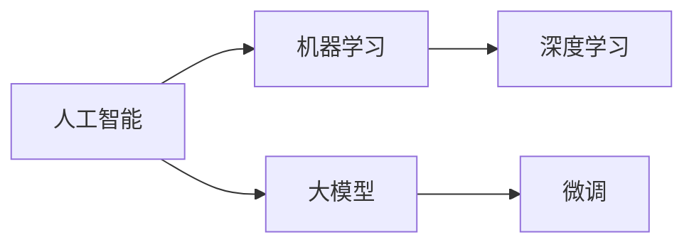

                 

# 赋能人类：释放个体潜能，创造无限可能

在人类历史的长河中，技术的进步始终是驱动社会发展的核心动力。从火的使用到电力的普及，再到互联网的兴起，每一次技术革命都极大地改变了人类生产生活方式，激发了人的潜能，创造出了前所未有的可能性。今天，我们站在人工智能(AI)技术飞速发展的门槛上，正迎来又一次前所未有的变革浪潮。本文旨在深入探讨人工智能如何赋能人类，释放个体潜能，创造无限可能。

## 1. 背景介绍

### 1.1 人工智能发展史

自1950s首次提出“人工智能”这一概念以来，AI技术经历了70多年的发展，经历了多次起伏。早期的人工智能研究主要集中在符号逻辑、专家系统、模式识别等方向，但由于计算能力和数据资源的限制，这些方法在实际应用中效果不佳。

2010s，深度学习技术的兴起标志着AI技术进入了一个全新的发展阶段。深度神经网络通过大规模数据训练，从根本上突破了传统机器学习算法的瓶颈，赋予了AI模型卓越的识别、分类、生成等能力。这一时期，机器学习、计算机视觉、自然语言处理等领域取得了显著的进展，推动了AI技术向实际应用场景的深入渗透。

2020s，随着计算资源的指数级提升和海量数据资源的涌现，大模型（Large Models）成为AI技术的核心趋势。以Transformer为代表的自注意力机制，带来了更为复杂和强大的语言模型。这些大模型在通用领域的泛化能力显著提升，为AI技术赋能人类提供了更为坚实的理论基础。

### 1.2 人工智能赋能人类的可能性

从历史的角度看，AI技术从早期的单一算子、专家规则逐步发展为今天大模型的丰富表示能力，赋予了人类前所未有的工具和手段。在技术不断演进的过程中，人工智能在多个层面展示了其赋能人类的潜力：

1. **提升生产效率**：AI技术可以自动化处理重复性、繁琐的工作，显著提升生产力。如自动驾驶、智能制造、客服机器人等。
2. **优化决策支持**：AI可以通过数据分析和推理，为人类决策提供更科学、精准的依据。如医疗诊断、金融风控、供应链管理等。
3. **增强个性化服务**：AI可以针对个体需求，提供定制化的产品和服务。如推荐系统、智能家居、个性化教育等。
4. **拓展创新边界**：AI技术以其强大的计算和分析能力，推动科学研究的突破和创新。如新药研发、基因编辑、自然语言生成等。

## 2. 核心概念与联系

### 2.1 核心概念概述

为更好地理解AI技术如何赋能人类，本文将介绍几个关键概念：

- **人工智能**：指通过计算机程序实现人类智能行为的机器系统，包括感知、推理、学习、决策等功能。
- **机器学习**：指通过数据训练，使机器系统具备自主学习、改进性能的能力。
- **深度学习**：一种特殊的机器学习方法，通过多层神经网络进行特征提取和复杂模式识别。
- **大模型**：指参数规模在亿级别以上的神经网络模型，如GPT、BERT等，具备强大的泛化能力和丰富的表示能力。
- **微调**：指在预训练模型的基础上，通过少量标注数据进行任务特定的优化，提升模型在特定任务上的性能。

这些概念之间存在着密切的联系：机器学习和深度学习是AI技术的两大基石，大模型是在这两者基础上进一步演进的高级形式。而微调则是在大模型基础上，针对具体任务进行进一步优化，提升模型的实用性。

### 2.2 核心概念之间的联系

为更清晰地展示这些核心概念之间的关系，以下是一个Mermaid流程图：



该图展示了核心概念之间的层次关系。机器学习是AI的基础，深度学习是机器学习的高级形式，大模型则是在深度学习基础上进一步扩展的高级形式。而微调是针对大模型进行任务特定优化的重要技术手段。

## 3. 核心算法原理 & 具体操作步骤

### 3.1 算法原理概述

AI技术的核心原理是通过数据驱动和模型训练，构建能够理解、学习和执行复杂任务的系统。以深度学习为例，其核心思想是通过多层神经网络模拟人脑的抽象和推理过程，从数据中自动学习特征表示，构建复杂模式的映射关系。

在大模型微调的过程中，核心原理与深度学习的原理基本一致，但更具任务导向性。大模型通过大规模数据预训练，构建了丰富的语言表示，具备强大的泛化能力。微调则是在此基础上，针对特定任务进行有监督学习，提升模型的任务执行能力。

### 3.2 算法步骤详解

大模型微调一般包括以下几个关键步骤：

**Step 1: 准备预训练模型和数据集**
- 选择合适的预训练模型（如GPT、BERT等）作为初始化参数。
- 收集该任务的标注数据集，划分训练集、验证集和测试集。

**Step 2: 任务适配**
- 根据任务类型设计合适的输出层和损失函数。
- 对于分类任务，通常使用线性分类器加交叉熵损失。
- 对于生成任务，通常使用语言模型的解码器加负对数似然损失。

**Step 3: 微调训练**
- 选择合适的优化器（如AdamW）和设置学习率、批大小、迭代轮数等。
- 应用正则化技术（如L2正则、Dropout、Early Stopping等）避免过拟合。
- 将训练集数据分批次输入模型，前向传播计算损失函数，反向传播更新模型参数。

**Step 4: 模型评估和部署**
- 在验证集上评估模型性能，根据指标调整超参数。
- 在测试集上评估最终模型性能，保存模型并部署到实际应用中。
- 持续收集新数据，定期重新微调模型以适应数据分布的变化。

### 3.3 算法优缺点

大模型微调具有以下优点：

1. **效率高**：相比从头训练，微调所需的计算和标注数据量显著减少。
2. **泛化能力强**：大模型通过预训练具备了较强的泛化能力，可以较好地适应新任务。
3. **实用性高**：微调模型可以迅速适配特定任务，提升实际应用效果。

同时，也存在以下缺点：

1. **过拟合风险**：微调过程中容易过拟合训练数据，导致泛化能力下降。
2. **对标注数据依赖高**：微调效果很大程度上依赖于标注数据的质量和数量，标注数据获取成本较高。
3. **模型复杂度高**：大模型的参数量庞大，部署和推理效率较低。

### 3.4 算法应用领域

大模型微调在多个领域得到了广泛应用，包括但不限于：

- **自然语言处理**：文本分类、命名实体识别、情感分析、机器翻译、问答系统等。
- **计算机视觉**：图像分类、目标检测、图像生成、视频分析等。
- **语音识别**：自动语音识别、语音合成、说话人识别等。
- **医疗**：医学影像分析、疾病预测、个性化医疗等。
- **金融**：信用评分、风险评估、市场分析等。
- **教育**：智能辅导、个性化学习、在线教育平台等。

## 4. 数学模型和公式 & 详细讲解 & 举例说明

### 4.1 数学模型构建

大模型微调的数学模型通常基于以下框架构建：

- 定义预训练模型 $M_{\theta}$ 和任务 $T$。
- 定义训练集 $D=\{(x_i,y_i)\}_{i=1}^N$，其中 $x_i$ 为输入数据，$y_i$ 为标注标签。
- 定义损失函数 $\mathcal{L}$，用于衡量模型预测输出与真实标签之间的差异。

### 4.2 公式推导过程

以文本分类任务为例，假设模型在输入 $x$ 上的输出为 $\hat{y}=M_{\theta}(x) \in [0,1]$，表示样本属于正类的概率。真实标签 $y \in \{0,1\}$。则二分类交叉熵损失函数定义为：

$$
\ell(M_{\theta}(x),y) = -[y\log \hat{y} + (1-y)\log (1-\hat{y})]
$$

在数据集 $D$ 上的经验风险为：

$$
\mathcal{L}(\theta) = \frac{1}{N}\sum_{i=1}^N [\ell(M_{\theta}(x_i),y_i)]
$$

通过反向传播算法，计算损失函数对参数 $\theta$ 的梯度，使用优化算法如AdamW更新模型参数。最终，最小化损失函数得到微调后的模型参数 $\theta^*$。

### 4.3 案例分析与讲解

以图像分类为例，假设输入图像 $x$，模型输出分类概率 $p_1,\dots,p_k$，对应的真实标签为 $y$。定义多分类交叉熵损失函数：

$$
\ell(x,y; M_{\theta}) = -\sum_{i=1}^k y_i \log p_i
$$

在训练集 $D$ 上的经验风险为：

$$
\mathcal{L}(\theta) = \frac{1}{N}\sum_{i=1}^N \ell(x_i,y_i; M_{\theta})
$$

通过反向传播算法计算损失函数对参数 $\theta$ 的梯度，使用优化算法如AdamW更新模型参数。在微调过程中，逐步降低学习率，减少过拟合风险。

## 5. 项目实践：代码实例和详细解释说明

### 5.1 开发环境搭建

1. **安装Python**：确保系统安装了最新版本的Python，并在环境变量中配置路径。
2. **安装TensorFlow和Keras**：使用pip安装TensorFlow和Keras，确保安装版本与预训练模型兼容。
3. **准备数据集**：收集并处理数据集，确保标注数据和输入格式符合模型要求。

### 5.2 源代码详细实现

以下是一个使用TensorFlow进行图像分类任务微调的示例代码：

```python
import tensorflow as tf
from tensorflow.keras import layers, models
from tensorflow.keras.preprocessing.image import ImageDataGenerator

# 加载预训练模型
base_model = tf.keras.applications.MobileNetV2(input_shape=(224,224,3), include_top=False, weights='imagenet')

# 构建新的分类器
model = models.Sequential([
    base_model,
    layers.GlobalAveragePooling2D(),
    layers.Dense(10, activation='softmax')
])

# 编译模型
model.compile(optimizer='adam', loss='sparse_categorical_crossentropy', metrics=['accuracy'])

# 数据增强
datagen = ImageDataGenerator(rescale=1./255, shear_range=0.2, zoom_range=0.2, horizontal_flip=True)
train_generator = datagen.flow_from_directory(
    'train/',
    target_size=(224, 224),
    batch_size=32,
    class_mode='categorical'
)

# 训练模型
model.fit(train_generator, epochs=10, validation_data=val_generator)

# 评估模型
test_generator = datagen.flow_from_directory(
    'test/',
    target_size=(224, 224),
    batch_size=32,
    class_mode='categorical'
)
model.evaluate(test_generator)
```

### 5.3 代码解读与分析

1. **模型加载**：使用Keras加载预训练的MobileNetV2模型，去除顶层输出，用于微调。
2. **分类器构建**：在顶层添加一个全局池化层和全连接层，用于任务特定的分类任务。
3. **模型编译**：编译模型，设置优化器、损失函数和评估指标。
4. **数据增强**：使用ImageDataGenerator对训练数据进行增强，增加数据多样性。
5. **模型训练**：使用fit函数训练模型，指定训练轮数和验证集。
6. **模型评估**：使用evaluate函数在测试集上评估模型性能。

## 6. 实际应用场景

### 6.1 智能医疗

在智能医疗领域，AI技术通过微调可以显著提升诊断和治疗的效率和精度。以影像识别为例，使用预训练模型在大量医学影像数据上进行微调，可以学习到精准的疾病特征，快速识别出肿瘤、病灶等异常区域。同时，结合医生的标注数据，微调模型可以学习到复杂的医学知识，帮助医生进行精准诊断。

### 6.2 智慧金融

在金融领域，AI技术可以通过微调预测市场趋势、识别欺诈行为、优化投资组合等。例如，使用微调后的模型对历史交易数据进行训练，可以预测未来的价格走势，辅助投资决策。同时，结合监控系统，微调模型可以实时分析交易行为，识别异常交易，防范金融风险。

### 6.3 个性化推荐

在电商和内容平台上，AI技术通过微调可以提供个性化的商品推荐和内容推荐。使用预训练模型在用户行为数据上微调，可以学习到用户的兴趣和偏好，生成精准的推荐结果。同时，结合实时数据，微调模型可以动态调整推荐策略，提升用户体验。

### 6.4 未来应用展望

未来，AI技术在更多领域将展现其巨大潜力。随着技术的不断进步，AI将深入到更多生产生活场景，推动社会进步。以下是我们对未来应用场景的展望：

- **智慧城市**：在城市管理中，AI可以实时监测交通流量、环境质量、公共安全等，提升城市治理的智能化水平。
- **智能交通**：在交通领域，AI可以优化交通流量、预测事故风险、自动驾驶等，提升交通效率和安全。
- **教育**：在教育领域，AI可以提供个性化的学习方案、智能辅导、自动化评估等，提升教育质量和效率。
- **能源管理**：在能源领域，AI可以优化能源分配、预测能源需求、提升能效等，促进可持续发展。
- **农业**：在农业领域，AI可以监测作物生长、预测天气变化、优化农业生产等，提升农业生产效率和产量。

## 7. 工具和资源推荐

### 7.1 学习资源推荐

为了系统掌握AI技术，以下是一些优质的学习资源：

1. **《深度学习》by Ian Goodfellow**：经典教材，详细介绍了深度学习的原理和应用。
2. **CS231n《卷积神经网络》课程**：斯坦福大学开设的计算机视觉课程，涵盖了深度学习在图像识别中的基础和进阶内容。
3. **Coursera《机器学习》课程**：由斯坦福大学Andrew Ng教授主讲的机器学习课程，讲解了机器学习的基本概念和算法。
4. **arXiv**：论文预印本网站，可以获取最新的人工智能研究进展。
5. **GitHub**：开源代码托管平台，可以找到大量的AI项目和代码库。

### 7.2 开发工具推荐

为了高效开发AI应用，以下是一些推荐的开发工具：

1. **TensorFlow**：谷歌开源的深度学习框架，支持大规模分布式计算。
2. **Keras**：基于TensorFlow的高级API，简单易用，适合快速原型开发。
3. **PyTorch**：Facebook开源的深度学习框架，动态计算图，适合研究和实验。
4. **Jupyter Notebook**：交互式开发环境，支持代码编写和数据分析。
5. **Anaconda**：Python环境管理工具，方便创建和管理虚拟环境。

### 7.3 相关论文推荐

为了深入了解AI技术的研究进展，以下是一些推荐的经典论文：

1. **《Attention is All You Need》**：Transformer模型的奠基之作，提出了自注意力机制。
2. **《ImageNet Classification with Deep Convolutional Neural Networks》**：AlexNet论文，引入了深度卷积神经网络，奠定了深度学习在图像识别中的基础。
3. **《Deep Residual Learning for Image Recognition》**：ResNet论文，解决了深度神经网络中的梯度消失问题。
4. **《Language Models are Unsupervised Multitask Learners》**：GPT-2论文，展示了预训练大模型在自然语言生成中的强大能力。
5. **《BERT: Pre-training of Deep Bidirectional Transformers for Language Understanding》**：BERT模型论文，提出了一种双向语言模型预训练方法。

## 8. 总结：未来发展趋势与挑战

### 8.1 研究成果总结

本文探讨了人工智能技术如何赋能人类，释放个体潜能，创造无限可能。通过介绍AI技术的基本原理和关键应用，展示了其广阔的发展前景。同时，也指出了AI技术面临的挑战和未来研究方向。

### 8.2 未来发展趋势

未来，AI技术将持续发展，在更多领域展现其赋能人类的潜力：

1. **跨领域融合**：AI技术将与其他技术深度融合，如物联网、区块链、量子计算等，推动更多跨领域创新。
2. **人机协同**：AI与人类将更加紧密地协同工作，提升工作效率和决策质量。
3. **普惠普及**：AI技术将更加普及，使得更多普通人能够受益。
4. **伦理规范**：AI技术的伦理和规范将得到更多重视，确保技术的公平、透明和可解释性。

### 8.3 面临的挑战

尽管AI技术前景广阔，但也面临诸多挑战：

1. **数据隐私和安全**：AI技术需要大量的数据支持，但数据隐私和安全问题不容忽视。
2. **伦理和公平**：AI技术可能带来歧视、偏见等问题，需要更多的伦理规范和公平性保障。
3. **计算资源**：AI技术需要强大的计算资源支持，对硬件要求较高。
4. **知识整合**：AI技术需要更多先验知识和专家规则，以提升模型的通用性和可解释性。

### 8.4 研究展望

未来，AI技术需要在多个方向进行突破：

1. **增强可解释性**：提升AI技术的可解释性，使其更具透明度和可信度。
2. **提高效率**：优化AI技术的计算效率，提升其处理大规模数据的能力。
3. **促进普惠**：推动AI技术的普及和普惠，确保更多人能够受益。
4. **强化伦理**：制定AI技术的伦理规范，确保其公平、透明和无害。

## 9. 附录：常见问题与解答

### Q1：AI技术对人类有何影响？

A: AI技术可以提升生产效率，优化决策支持，增强个性化服务，拓展创新边界。但在应用过程中，也需要关注其潜在的风险和挑战，如数据隐私、伦理问题等。

### Q2：AI技术如何赋能人类？

A: AI技术通过数据驱动和模型训练，构建了能够理解、学习和执行复杂任务的系统。通过微调，AI模型可以适应特定任务，提升其实用性。

### Q3：AI技术在实际应用中面临哪些挑战？

A: AI技术在实际应用中面临数据隐私、伦理规范、计算资源、知识整合等方面的挑战。需要多方合作，共同推进AI技术的发展。

### Q4：未来AI技术有哪些发展方向？

A: AI技术将在跨领域融合、人机协同、普惠普及、伦理规范等方向继续发展。推动AI技术向更加智能化、普适化方向迈进。

---

作者：禅与计算机程序设计艺术 / Zen and the Art of Computer Programming

