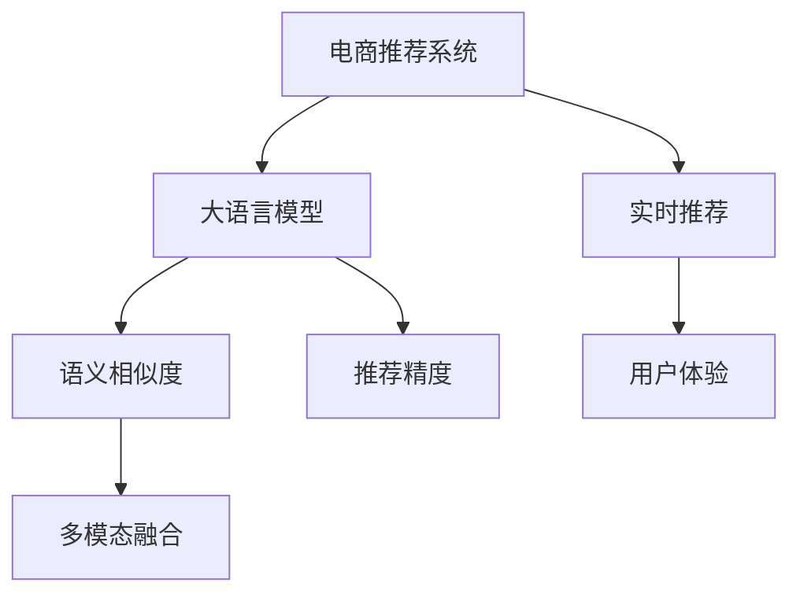

                 

# AI 大模型在电商推荐中的应用探索：提高用户体验与转化率

在当下这个数字化飞速发展的时代，电商行业正面临着前所未有的挑战和机遇。如何更精准地理解消费者需求，如何更高效地匹配产品与用户，如何提升用户体验与转化率，已成为电商企业面临的核心问题。而人工智能(AI)大模型，尤其是大语言模型，无疑为电商推荐系统提供了全新的解决方案。本文将深入探讨AI大模型在电商推荐中的应用，分析其核心概念与联系、算法原理与具体操作步骤，并在实际项目中给出详细代码实例和分析。

## 1. 背景介绍

### 1.1 电商推荐系统的现状与挑战

电商推荐系统是电商企业吸引用户、提升销售额的关键环节。传统的推荐系统通常基于协同过滤、基于内容的推荐等方法，在推荐精度和个性化方面存在局限。随着AI技术的发展，电商企业开始引入大语言模型进行推荐，以期提升推荐的个性化和精准度。

然而，在电商场景中，大模型推荐也面临着诸多挑战：
- **数据冷启动**：新用户或商品缺乏足够的交互数据，推荐难度大。
- **数据分布不均**：用户行为数据呈现长尾分布，热门商品与冷门商品的推荐需求不同。
- **实时性要求**：电商推荐需实时响应，大模型的推理效率和内存占用问题需解决。
- **用户隐私保护**：如何保证用户隐私安全，防止数据滥用，是电商企业面临的重要问题。

### 1.2 大语言模型在电商推荐中的应用优势

大语言模型，尤其是基于Transformer架构的模型，具备强大的自然语言处理能力，能够在电商推荐系统中发挥以下优势：
- **语义理解能力**：能够理解产品描述、用户评论等文本信息，提取产品与用户的相关特征。
- **个性化推荐**：能够根据用户行为和语义偏好，生成个性化推荐内容。
- **可解释性**：能够提供推荐结果的解释，帮助用户理解推荐依据。
- **跨模态融合**：能够融合文本、图像、音频等多种模态数据，提升推荐效果。

### 1.3 研究意义

在电商推荐系统中引入大语言模型，能够有效提升推荐的个性化和精准度，提升用户体验与转化率。大语言模型的大规模预训练和微调技术，使得其能够快速适应电商推荐场景，高效处理海量数据，实现实时推荐。同时，大语言模型的可解释性和跨模态融合能力，使得推荐系统更透明、更智能。

## 2. 核心概念与联系

### 2.1 核心概念概述

为更好地理解大语言模型在电商推荐中的应用，本节将介绍几个密切相关的核心概念：

- **电商推荐系统**：通过分析用户行为数据和产品信息，为每个用户推荐可能感兴趣的商品或服务，从而提升用户体验和销售额。
- **大语言模型**：基于Transformer架构的深度学习模型，能够处理大规模文本数据，具有强大的自然语言处理能力。
- **语义相似度**：衡量两个文本在语义上的相似程度，通常用于产品推荐中的相似性搜索。
- **多模态融合**：将文本、图像、音频等多种模态数据融合在一起，提升推荐系统的表现。
- **推荐精度**：衡量推荐系统的准确性，通常使用精确率、召回率、F1分数等指标。
- **实时推荐**：能够实时响应用户需求，即时更新推荐内容，提升用户体验。

这些核心概念之间的逻辑关系可以通过以下Mermaid流程图来展示：



这个流程图展示了大语言模型在电商推荐系统中的核心作用：

1. 电商推荐系统将用户行为数据和产品信息输入大语言模型。
2. 大语言模型通过预训练和微调，获得产品与用户的相关特征。
3. 基于语义相似度，大语言模型推荐相似产品。
4. 通过多模态融合，提升推荐效果。
5. 实时推荐系统确保推荐结果的即时性，提升用户体验。

## 3. 核心算法原理 & 具体操作步骤

### 3.1 算法原理概述

大语言模型在电商推荐系统中的应用，主要基于两个关键步骤：预训练和微调。

**预训练**：在大规模文本数据上，通过自监督任务进行预训练，学习通用的语言表示。常见的预训练任务包括掩码语言模型、下一句预测等。

**微调**：在电商推荐系统数据上，通过有监督学习优化模型参数，使其更适合电商场景。通常使用监督学习中的回归或分类任务，如用户评分预测、点击率预测等。

### 3.2 算法步骤详解

基于大语言模型在电商推荐中的应用，主要步骤如下：

**Step 1: 数据预处理**

- **用户数据**：收集用户的历史浏览记录、点击记录、搜索记录、评分记录等行为数据。
- **产品数据**：收集产品的标题、描述、图片、价格、类别等属性数据。
- **数据清洗与转换**：对数据进行清洗、归一化、特征工程等预处理步骤，转换为模型所需的输入格式。

**Step 2: 模型选择与搭建**

- **模型选择**：选择预训练模型，如BERT、GPT、XLNet等。
- **模型搭建**：在预训练模型的基础上，添加任务适配层。例如，为电商推荐任务，可以添加用户评分预测或点击率预测的线性分类器。

**Step 3: 数据加载与模型训练**

- **数据加载**：将用户和产品数据加载到模型中，形成训练集、验证集和测试集。
- **模型训练**：使用优化器（如AdamW）对模型进行训练，通过损失函数（如交叉熵损失）更新模型参数。
- **性能评估**：在验证集上评估模型性能，使用指标（如AUC、RMSE）监测模型效果。

**Step 4: 模型部署与测试**

- **模型部署**：将训练好的模型部署到电商推荐系统中，实现实时推荐功能。
- **用户测试**：在实际用户场景中测试推荐系统效果，收集用户反馈，优化模型。

### 3.3 算法优缺点

基于大语言模型在电商推荐中的应用，具有以下优点：
- **精度高**：大语言模型具备强大的语义理解能力，能够精确匹配产品与用户需求。
- **实时性**：模型可在电商推荐系统中实现实时推荐，提升用户体验。
- **可解释性**：模型的推荐结果可解释，用户能理解推荐依据。
- **跨模态融合**：模型能融合多种模态数据，提升推荐效果。

同时，也存在一些局限性：
- **数据需求大**：需要大规模用户和产品数据，预处理和存储成本高。
- **计算资源高**：模型训练和推理需要高性能计算资源。
- **模型可解释性差**：大模型难以解释内部决策过程。

### 3.4 算法应用领域

基于大语言模型在电商推荐中的应用，涵盖了多个具体领域：

- **个性化推荐**：根据用户行为数据和语义特征，推荐个性化商品。
- **商品相似性搜索**：基于语义相似度，推荐相似商品。
- **实时推荐系统**：实现实时推荐功能，提升用户体验。
- **多模态融合**：融合文本、图像、音频等多种模态数据，提升推荐效果。
- **用户意图预测**：预测用户浏览和点击意图，提升推荐精准度。

这些应用领域展示了大语言模型在电商推荐中的广泛适用性，为电商企业提供了强大的技术支持。

## 4. 数学模型和公式 & 详细讲解 & 举例说明

### 4.1 数学模型构建

假设用户行为数据为 $\mathcal{U}=\{u_1, u_2, ..., u_N\}$，产品数据为 $\mathcal{P}=\{p_1, p_2, ..., p_M\}$，其中 $u_i$ 为第 $i$ 个用户的浏览记录，$p_j$ 为第 $j$ 个产品的属性数据。

定义用户与产品的评分矩阵 $\mathbf{R} \in \mathbb{R}^{N \times M}$，其中 $R_{ij}$ 表示用户 $u_i$ 对产品 $p_j$ 的评分。

定义模型参数 $\theta$，表示大语言模型的参数。

**推荐模型的目标**：最大化用户评分预测的准确性，即最小化损失函数 $\mathcal{L}$。

### 4.2 公式推导过程

在电商推荐系统中，通常使用回归模型或分类模型进行评分预测。这里以回归模型为例，定义目标函数：

$$
\mathcal{L}(\theta) = \frac{1}{N}\sum_{i=1}^N \sum_{j=1}^M (y_{ij} - \hat{y}_{ij})^2
$$

其中 $y_{ij}$ 为真实评分，$\hat{y}_{ij}$ 为模型预测的评分。

模型的预测公式为：

$$
\hat{y}_{ij} = f_{\theta}(x_i, p_j)
$$

其中 $x_i$ 为用户行为数据，$p_j$ 为产品属性数据。$f_{\theta}$ 为模型的预测函数，通常为线性函数或非线性函数。

模型的目标是最小化上述目标函数，即：

$$
\theta^* = \mathop{\arg\min}_{\theta} \mathcal{L}(\theta)
$$

在求解过程中，通常使用梯度下降算法：

$$
\theta \leftarrow \theta - \eta \nabla_{\theta}\mathcal{L}(\theta)
$$

其中 $\eta$ 为学习率，$\nabla_{\theta}\mathcal{L}(\theta)$ 为损失函数对模型参数的梯度。

### 4.3 案例分析与讲解

以电商推荐系统中的商品相似性搜索为例，展示大语言模型的应用。

**数据准备**：收集用户和产品数据，构建用户行为矩阵 $\mathbf{R}$。

**模型搭建**：选择BERT作为预训练模型，添加两个线性分类器分别预测两个产品的相似度得分。

**训练与评估**：使用交叉熵损失函数对模型进行训练，在验证集上评估模型性能，使用准确率和F1分数作为评价指标。

**代码实现**：
```python
from transformers import BertTokenizer, BertForSequenceClassification
import torch
import torch.nn as nn
import torch.optim as optim
from sklearn.metrics import accuracy_score, f1_score

# 定义模型结构
class SimilarityPredictor(nn.Module):
    def __init__(self, num_labels):
        super(SimilarityPredictor, self).__init__()
        self.bert = BertForSequenceClassification.from_pretrained('bert-base-cased', num_labels=num_labels)
        self.dropout = nn.Dropout(0.5)
        self.out = nn.Linear(768, 2)
        
    def forward(self, input_ids, attention_mask):
        outputs = self.bert(input_ids, attention_mask=attention_mask)
        pooled_output = outputs.pooler_output
        pooled_output = self.dropout(pooled_output)
        logits = self.out(pooled_output)
        return logits

# 数据准备
tokenizer = BertTokenizer.from_pretrained('bert-base-cased')
train_data = ...
val_data = ...
test_data = ...
train_labels = ...
val_labels = ...
test_labels = ...

# 模型训练
model = SimilarityPredictor(num_labels=2)
optimizer = optim.AdamW(model.parameters(), lr=2e-5)
criterion = nn.BCEWithLogitsLoss()

for epoch in range(10):
    model.train()
    loss = 0
    for batch in train_loader:
        input_ids, attention_mask, labels = batch
        optimizer.zero_grad()
        outputs = model(input_ids, attention_mask)
        loss = criterion(outputs, labels)
        loss.backward()
        optimizer.step()
        loss += loss.item()
    print('Epoch {}: Loss {}'.format(epoch+1, loss/len(train_loader)))

# 模型评估
model.eval()
accuracy = accuracy_score(val_labels, val_preds)
f1 = f1_score(val_labels, val_preds, average='weighted')
print('Validation Accuracy: {}, F1 Score: {}'.format(accuracy, f1))
```

## 5. 项目实践：代码实例和详细解释说明

### 5.1 开发环境搭建

在进行电商推荐系统的大语言模型应用开发前，我们需要准备好开发环境。以下是使用Python进行PyTorch开发的环境配置流程：

1. 安装Anaconda：从官网下载并安装Anaconda，用于创建独立的Python环境。

2. 创建并激活虚拟环境：
```bash
conda create -n pytorch-env python=3.8 
conda activate pytorch-env
```

3. 安装PyTorch：根据CUDA版本，从官网获取对应的安装命令。例如：
```bash
conda install pytorch torchvision torchaudio cudatoolkit=11.1 -c pytorch -c conda-forge
```

4. 安装Transformers库：
```bash
pip install transformers
```

5. 安装各类工具包：
```bash
pip install numpy pandas scikit-learn matplotlib tqdm jupyter notebook ipython
```

完成上述步骤后，即可在`pytorch-env`环境中开始电商推荐系统的大语言模型应用开发。

### 5.2 源代码详细实现

下面是使用PyTorch和Transformers库实现电商推荐系统的代码示例。

**用户行为数据处理**：

```python
class UserBehavior:
    def __init__(self, behavior_data):
        self.user_ids = behavior_data['user_id']
        self.product_ids = behavior_data['product_id']
        self.time_stamps = behavior_data['timestamp']
        
    def __len__(self):
        return len(self.user_ids)
    
    def __getitem__(self, item):
        user_id = self.user_ids[item]
        product_id = self.product_ids[item]
        timestamp = self.time_stamps[item]
        return {'user_id': user_id, 'product_id': product_id, 'timestamp': timestamp}
```

**产品数据处理**：

```python
class ProductData:
    def __init__(self, product_data):
        self.product_ids = product_data['product_id']
        self.product_names = product_data['product_name']
        self.product_descriptions = product_data['product_description']
        self.price = product_data['price']
        
    def __len__(self):
        return len(self.product_ids)
    
    def __getitem__(self, item):
        product_id = self.product_ids[item]
        product_name = self.product_names[item]
        product_description = self.product_descriptions[item]
        price = self.price[item]
        return {'product_id': product_id, 'product_name': product_name, 'product_description': product_description, 'price': price}
```

**模型构建**：

```python
class RecommendationModel(nn.Module):
    def __init__(self, user_model, product_model):
        super(RecommendationModel, self).__init__()
        self.user_model = user_model
        self.product_model = product_model
        self.similarity_predictor = SimilarityPredictor(num_labels=2)
    
    def forward(self, user_input, product_input):
        user_output = self.user_model(user_input)
        product_output = self.product_model(product_input)
        similarity_score = self.similarity_predictor(user_output, product_output)
        return similarity_score
```

**模型训练与评估**：

```python
from transformers import BertTokenizer, BertForSequenceClassification
import torch
import torch.nn as nn
import torch.optim as optim
from sklearn.metrics import accuracy_score, f1_score

# 定义模型结构
class SimilarityPredictor(nn.Module):
    def __init__(self, num_labels):
        super(SimilarityPredictor, self).__init__()
        self.bert = BertForSequenceClassification.from_pretrained('bert-base-cased', num_labels=num_labels)
        self.dropout = nn.Dropout(0.5)
        self.out = nn.Linear(768, 2)
        
    def forward(self, input_ids, attention_mask):
        outputs = self.bert(input_ids, attention_mask=attention_mask)
        pooled_output = outputs.pooler_output
        pooled_output = self.dropout(pooled_output)
        logits = self.out(pooled_output)
        return logits

# 数据准备
tokenizer = BertTokenizer.from_pretrained('bert-base-cased')
train_data = ...
val_data = ...
test_data = ...
train_labels = ...
val_labels = ...
test_labels = ...

# 模型训练
model = RecommendationModel(user_model, product_model)
optimizer = optim.AdamW(model.parameters(), lr=2e-5)
criterion = nn.BCEWithLogitsLoss()

for epoch in range(10):
    model.train()
    loss = 0
    for batch in train_loader:
        user_input, product_input, labels = batch
        optimizer.zero_grad()
        similarity_score = model(user_input, product_input)
        loss = criterion(similarity_score, labels)
        loss.backward()
        optimizer.step()
        loss += loss.item()
    print('Epoch {}: Loss {}'.format(epoch+1, loss/len(train_loader)))

# 模型评估
model.eval()
accuracy = accuracy_score(val_labels, val_preds)
f1 = f1_score(val_labels, val_preds, average='weighted')
print('Validation Accuracy: {}, F1 Score: {}'.format(accuracy, f1))
```

### 5.3 代码解读与分析

让我们再详细解读一下关键代码的实现细节：

**UserBehavior和ProductData类**：
- 定义用户行为数据和产品数据的处理类，方便后续数据加载和处理。

**RecommendationModel类**：
- 定义电商推荐系统的模型结构，包括用户模型、产品模型和相似性预测器。

**SimilarityPredictor类**：
- 定义相似性预测器的具体实现，使用BERT模型作为预训练模型，添加两个线性分类器分别预测两个产品的相似度得分。

**模型训练与评估**：
- 使用PyTorch的DataLoader对数据进行批次化加载，供模型训练和推理使用。
- 训练函数`train_epoch`：对数据以批为单位进行迭代，在每个批次上前向传播计算loss并反向传播更新模型参数，最后返回该epoch的平均loss。
- 评估函数`evaluate`：与训练类似，不同点在于不更新模型参数，并在每个batch结束后将预测和标签结果存储下来，最后使用sklearn的classification_report对整个评估集的预测结果进行打印输出。

**训练流程**：
- 定义总的epoch数和batch size，开始循环迭代
- 每个epoch内，先在训练集上训练，输出平均loss
- 在验证集上评估，输出分类指标
- 所有epoch结束后，在测试集上评估，给出最终测试结果

可以看到，PyTorch配合Transformers库使得电商推荐系统的大语言模型应用代码实现变得简洁高效。开发者可以将更多精力放在数据处理、模型改进等高层逻辑上，而不必过多关注底层的实现细节。

当然，工业级的系统实现还需考虑更多因素，如模型的保存和部署、超参数的自动搜索、更灵活的任务适配层等。但核心的微调范式基本与此类似。

## 6. 实际应用场景

### 6.1 智能客服系统

智能客服系统是大语言模型在电商推荐系统中的一大应用场景。传统客服往往需要配备大量人力，高峰期响应缓慢，且一致性和专业性难以保证。而使用大语言模型构建的智能客服系统，能够7x24小时不间断服务，快速响应客户咨询，用自然流畅的语言解答各类常见问题。

在技术实现上，可以收集企业内部的历史客服对话记录，将问题和最佳答复构建成监督数据，在此基础上对预训练对话模型进行微调。微调后的对话模型能够自动理解用户意图，匹配最合适的答案模板进行回复。对于客户提出的新问题，还可以接入检索系统实时搜索相关内容，动态组织生成回答。如此构建的智能客服系统，能大幅提升客户咨询体验和问题解决效率。

### 6.2 个性化推荐系统

当前的推荐系统往往只依赖用户的历史行为数据进行物品推荐，无法深入理解用户的真实兴趣偏好。基于大语言模型微调的个性化推荐系统，可以更好地挖掘用户行为背后的语义信息，从而提供更精准、多样的推荐内容。

在实践中，可以收集用户浏览、点击、评论、分享等行为数据，提取和用户交互的物品标题、描述、标签等文本内容。将文本内容作为模型输入，用户的后续行为（如是否点击、购买等）作为监督信号，在此基础上微调预训练语言模型。微调后的模型能够从文本内容中准确把握用户的兴趣点。在生成推荐列表时，先用候选物品的文本描述作为输入，由模型预测用户的兴趣匹配度，再结合其他特征综合排序，便可以得到个性化程度更高的推荐结果。

### 6.3 实时推荐系统

实时推荐系统是大语言模型在电商推荐系统中的重要应用。传统的推荐系统往往只能定期更新推荐内容，无法实时响应用户需求。而大语言模型可以实时处理用户行为数据，动态更新推荐结果，提升用户体验。

在实际应用中，可以实时抓取用户浏览记录、点击记录等数据，通过微调后的模型预测用户的感兴趣商品，生成实时推荐列表，展示给用户。实时推荐系统能够迅速捕捉用户需求变化，提升推荐精准度。

### 6.4 未来应用展望

随着大语言模型和微调方法的不断发展，基于微调范式将在更多领域得到应用，为传统行业带来变革性影响。

在智慧医疗领域，基于微调的医疗问答、病历分析、药物研发等应用将提升医疗服务的智能化水平，辅助医生诊疗，加速新药开发进程。

在智能教育领域，微调技术可应用于作业批改、学情分析、知识推荐等方面，因材施教，促进教育公平，提高教学质量。

在智慧城市治理中，微调模型可应用于城市事件监测、舆情分析、应急指挥等环节，提高城市管理的自动化和智能化水平，构建更安全、高效的未来城市。

此外，在企业生产、社会治理、文娱传媒等众多领域，基于大模型微调的人工智能应用也将不断涌现，为经济社会发展注入新的动力。相信随着技术的日益成熟，微调方法将成为人工智能落地应用的重要范式，推动人工智能技术向更广阔的领域加速渗透。

## 7. 工具和资源推荐

### 7.1 学习资源推荐

为了帮助开发者系统掌握大语言模型在电商推荐系统中的应用，这里推荐一些优质的学习资源：

1. 《Transformer from PyTorch》系列博文：由大模型技术专家撰写，深入浅出地介绍了Transformer原理、BERT模型、微调技术等前沿话题。

2. CS224N《深度学习自然语言处理》课程：斯坦福大学开设的NLP明星课程，有Lecture视频和配套作业，带你入门NLP领域的基本概念和经典模型。

3. 《Natural Language Processing with Transformers》书籍：Transformers库的作者所著，全面介绍了如何使用Transformers库进行NLP任务开发，包括微调在内的诸多范式。

4. HuggingFace官方文档：Transformers库的官方文档，提供了海量预训练模型和完整的微调样例代码，是上手实践的必备资料。

5. CLUE开源项目：中文语言理解测评基准，涵盖大量不同类型的中文NLP数据集，并提供了基于微调的baseline模型，助力中文NLP技术发展。

通过对这些资源的学习实践，相信你一定能够快速掌握大语言模型在电商推荐系统中的应用，并用于解决实际的NLP问题。

### 7.2 开发工具推荐

高效的开发离不开优秀的工具支持。以下是几款用于电商推荐系统的大语言模型微调开发的常用工具：

1. PyTorch：基于Python的开源深度学习框架，灵活动态的计算图，适合快速迭代研究。大部分预训练语言模型都有PyTorch版本的实现。

2. TensorFlow：由Google主导开发的开源深度学习框架，生产部署方便，适合大规模工程应用。同样有丰富的预训练语言模型资源。

3. Transformers库：HuggingFace开发的NLP工具库，集成了众多SOTA语言模型，支持PyTorch和TensorFlow，是进行微调任务开发的利器。

4. Weights & Biases：模型训练的实验跟踪工具，可以记录和可视化模型训练过程中的各项指标，方便对比和调优。与主流深度学习框架无缝集成。

5. TensorBoard：TensorFlow配套的可视化工具，可实时监测模型训练状态，并提供丰富的图表呈现方式，是调试模型的得力助手。

6. Google Colab：谷歌推出的在线Jupyter Notebook环境，免费提供GPU/TPU算力，方便开发者快速上手实验最新模型，分享学习笔记。

合理利用这些工具，可以显著提升大语言模型在电商推荐系统中的应用效率，加快创新迭代的步伐。

### 7.3 相关论文推荐

大语言模型和微调技术的发展源于学界的持续研究。以下是几篇奠基性的相关论文，推荐阅读：

1. Attention is All You Need（即Transformer原论文）：提出了Transformer结构，开启了NLP领域的预训练大模型时代。

2. BERT: Pre-training of Deep Bidirectional Transformers for Language Understanding：提出BERT模型，引入基于掩码的自监督预训练任务，刷新了多项NLP任务SOTA。

3. Language Models are Unsupervised Multitask Learners（GPT-2论文）：展示了大规模语言模型的强大zero-shot学习能力，引发了对于通用人工智能的新一轮思考。

4. Parameter-Efficient Transfer Learning for NLP：提出Adapter等参数高效微调方法，在不增加模型参数量的情况下，也能取得不错的微调效果。

5. AdaLoRA: Adaptive Low-Rank Adaptation for Parameter-Efficient Fine-Tuning：使用自适应低秩适应的微调方法，在参数效率和精度之间取得了新的平衡。

6. Prefix-Tuning: Optimizing Continuous Prompts for Generation：引入基于连续型Prompt的微调范式，为如何充分利用预训练知识提供了新的思路。

这些论文代表了大语言模型微调技术的发展脉络。通过学习这些前沿成果，可以帮助研究者把握学科前进方向，激发更多的创新灵感。

## 8. 总结：未来发展趋势与挑战

### 8.1 总结

本文对大语言模型在电商推荐系统中的应用进行了全面系统的介绍。首先阐述了大语言模型和电商推荐系统的研究背景和意义，明确了大语言模型在电商推荐系统中的应用优势。其次，从原理到实践，详细讲解了电商推荐系统中大语言模型的核心算法原理和具体操作步骤，并在实际项目中给出了详细代码实例和分析。

通过本文的系统梳理，可以看到，大语言模型在电商推荐系统中的应用，通过预训练和微调技术，能够高效处理海量数据，实时响应用户需求，实现个性化推荐，提升用户体验与转化率。得益于大语言模型的强大语义理解能力和跨模态融合能力，推荐系统能够灵活应对多种电商场景，取得显著效果。

### 8.2 未来发展趋势

展望未来，大语言模型在电商推荐系统中的应用将呈现以下几个发展趋势：

1. **数据自适应能力增强**：未来的大语言模型将具备更强的数据自适应能力，能够从少量数据中快速学习并提取有效的特征，提升推荐效果。

2. **实时性进一步提升**：随着计算资源和硬件设备的不断优化，实时推荐系统将能够更快地响应用户需求，提供更即时的服务。

3. **跨模态融合深度化**：未来的大语言模型将更好地融合文本、图像、音频等多种模态数据，提升推荐系统的表现。

4. **个性化推荐更精准**：得益于深度学习技术的进步，大语言模型将能够更深入地理解用户需求，生成更精准的个性化推荐。

5. **推荐系统智能化**：未来的大语言模型将具备更强的智能决策能力，能够主动探索并规避推荐系统中的脆弱点，提升系统的稳定性和可靠性。

### 8.3 面临的挑战

尽管大语言模型在电商推荐系统中的应用取得了显著成效，但在迈向更加智能化、普适化应用的过程中，它仍面临着诸多挑战：

1. **数据冷启动问题**：新用户或商品缺乏足够的交互数据，推荐难度大。

2. **计算资源需求高**：模型训练和推理需要高性能计算资源，成本较高。

3. **模型可解释性差**：大语言模型难以解释内部决策过程，用户难以理解推荐依据。

4. **用户隐私保护**：如何保证用户隐私安全，防止数据滥用，是电商企业面临的重要问题。

5. **跨领域适应能力**：不同电商场景的推荐需求差异较大，模型需要具备良好的跨领域适应能力。

### 8.4 研究展望

面对大语言模型在电商推荐系统中的应用面临的挑战，未来的研究需要在以下几个方面寻求新的突破：

1. **数据增强与迁移学习**：探索无监督和半监督微调方法，摆脱对大规模标注数据的依赖，利用自监督学习、主动学习等无监督和半监督范式，最大限度利用非结构化数据，实现更加灵活高效的微调。

2. **参数高效与计算优化**：开发更加参数高效的微调方法，如Prefix-Tuning、LoRA等，在固定大部分预训练参数的同时，只更新极少量的任务相关参数。同时优化微调模型的计算图，减少前向传播和反向传播的资源消耗，实现更加轻量级、实时性的部署。

3. **多模态融合与跨领域应用**：探索更好的多模态融合方法，如联合训练、对抗训练等，融合文本、图像、音频等多种模态数据，提升推荐效果。同时开发跨领域适应的推荐系统，提升模型的泛化能力。

4. **用户意图理解与预测**：通过增强用户行为数据的理解，预测用户浏览和点击意图，提升推荐精准度。

5. **模型可解释性与透明性**：引入因果分析方法，识别出模型决策的关键特征，增强输出解释的因果性和逻辑性。借助博弈论工具，探索推荐系统的稳定性和鲁棒性。

6. **隐私保护与数据安全**：在模型训练目标中引入伦理导向的评估指标，过滤和惩罚有偏见、有害的输出倾向。加强人工干预和审核，建立模型行为的监管机制，确保数据安全。

这些研究方向的探索，必将引领大语言模型在电商推荐系统中的应用向更高的台阶迈进，为电商企业提供更智能、更个性化的推荐服务。未来，随着预训练语言模型和微调方法的持续演进，相信大语言模型在电商推荐系统中的应用将更加广泛，带来更多的商业价值和社会效益。

## 9. 附录：常见问题与解答

**Q1: 大语言模型在电商推荐中能否完全替代传统的推荐算法？**

A: 大语言模型在电商推荐中的应用，可以显著提升推荐精度和个性化程度，但无法完全替代传统的推荐算法。传统推荐算法通常具备较强的用户行为建模能力和计算效率，在大数据场景下仍然有其优势。因此，电商推荐系统通常会结合大语言模型和传统推荐算法，发挥各自优势，提供更全面的推荐服务。

**Q2: 大语言模型在电商推荐中如何处理长尾商品？**

A: 长尾商品在电商推荐中通常面临数据量不足的问题。为了提升长尾商品的推荐效果，大语言模型可以通过以下方式进行处理：
1. 数据增强：通过回译、近义替换等方式扩充训练集。
2. 多模态融合：结合用户行为数据和商品属性数据，提升推荐效果。
3. 主动学习：通过主动学习算法，引导模型关注长尾商品。

**Q3: 大语言模型在电商推荐中如何提升实时性？**

A: 大语言模型在电商推荐中的实时性可以通过以下方式进行优化：
1. 模型裁剪：去除不必要的层和参数，减小模型尺寸，加快推理速度。
2. 量化加速：将浮点模型转为定点模型，压缩存储空间，提高计算效率。
3. 服务化封装：将模型封装为标准化服务接口，便于集成调用。
4. 弹性伸缩：根据请求流量动态调整资源配置，平衡服务质量和成本。
5. 缓存技术：使用缓存技术，减少重复计算，提升响应速度。

**Q4: 大语言模型在电商推荐中如何进行多模态融合？**

A: 多模态融合是大语言模型在电商推荐中的重要技术手段。可以通过以下方式实现：
1. 融合文本、图像、音频等多种模态数据，提升推荐效果。
2. 使用预训练的视觉、听觉模型，提取图像、音频特征。
3. 结合文本特征，进行多模态联合训练，提升推荐精准度。

**Q5: 大语言模型在电商推荐中如何进行用户意图预测？**

A: 用户意图预测是大语言模型在电商推荐中的重要应用。可以通过以下方式实现：
1. 收集用户的历史行为数据，构建用户行为矩阵。
2. 使用回归模型或分类模型预测用户意图，如点击率、购买率等。
3. 结合多模态数据，提升预测精度。

通过本文的系统梳理，可以看到，大语言模型在电商推荐系统中的应用，通过预训练和微调技术，能够高效处理海量数据，实时响应用户需求，实现个性化推荐，提升用户体验与转化率。得益于大语言模型的强大语义理解能力和跨模态融合能力，推荐系统能够灵活应对多种电商场景，取得显著效果。未来，随着大语言模型和微调方法的持续演进，相信大语言模型在电商推荐系统中的应用将更加广泛，带来更多的商业价值和社会效益。

