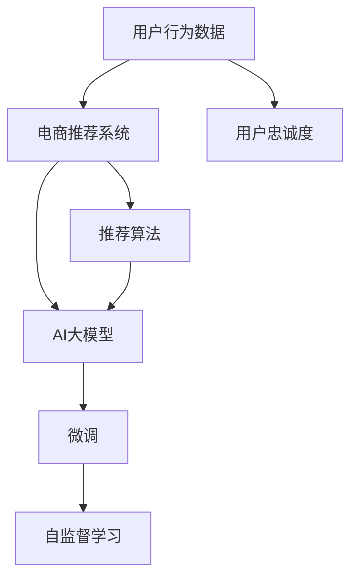

                 

# AI 大模型在电商推荐中的用户忠诚度提升策略：增加用户粘性和转化率

## 1. 背景介绍

在数字化时代，电商平台正逐步成为人们日常生活的重要组成部分。在线购物不仅可以带来便捷的购物体验，还能提供丰富的产品信息，帮助用户做出更为明智的决策。然而，随着电商市场竞争的日趋激烈，如何提升用户忠诚度，增加用户粘性，成为电商平台面临的重要挑战。

### 1.1 电商推荐的重要性

电商推荐系统是电商平台的核心组成部分，通过分析用户行为、历史购买记录、浏览历史等数据，为用户提供个性化的商品推荐，极大提升了用户体验和满意度。优秀的电商推荐系统不仅能显著提高转化率，还能提升用户满意度和忠诚度，从而增加平台的用户粘性和市场竞争力。

### 1.2 用户忠诚度提升的挑战

尽管电商推荐系统已取得显著成效，但在提升用户忠诚度方面仍面临诸多挑战。这些挑战主要集中在以下几个方面：

1. **个性化推荐不足**：尽管电商推荐系统可以个性化推荐商品，但在某些情况下仍难以满足用户的多样化需求。

2. **用户体验不连贯**：不同平台之间的推荐系统存在数据孤岛，用户在不同平台间难以获得连贯的购物体验。

3. **推荐算法不够智能**：现有推荐算法仍存在一定的局限性，难以捕捉用户深层次的需求和行为。

4. **实时性不足**：推荐系统的实时性不足，无法及时响应用户需求变化。

5. **安全与隐私问题**：用户数据的安全与隐私保护仍是重要问题，推荐系统需要更好地处理用户数据。

## 2. 核心概念与联系

### 2.1 核心概念概述

为更好地理解AI大模型在电商推荐中的用户忠诚度提升策略，本节将介绍几个关键概念及其联系。

- **用户行为数据**：包括用户的浏览历史、购买记录、评分反馈等数据，是推荐系统的基础。
- **电商推荐系统**：通过用户行为数据进行个性化商品推荐，提升用户体验。
- **用户忠诚度**：指用户对平台的长期依赖和信任程度。
- **AI大模型**：指通过大规模数据训练获得的强大语言和图像理解能力的大模型，如BERT、GPT、ResNet等。
- **自监督学习**：通过无标签数据训练模型，学习通用的语言和图像表示，提升模型的泛化能力。
- **微调**：在大模型上进行特定任务的调整，优化模型的性能。

这些概念之间的逻辑关系可以通过以下Mermaid流程图来展示：



这个流程图展示了大模型在电商推荐中的核心概念及其关系：

1. 电商推荐系统以用户行为数据为输入，通过推荐算法进行个性化推荐。
2. AI大模型提供了强大的数据处理能力，可以进行自监督学习，提升模型的泛化能力。
3. 微调是针对特定任务对大模型进行进一步调整，优化推荐效果。
4. 自监督学习是大模型预训练的重要环节，增强模型的泛化能力和鲁棒性。

## 3. 核心算法原理 & 具体操作步骤

### 3.1 算法原理概述

AI大模型在电商推荐中的应用，主要通过以下两个步骤实现：

1. **自监督预训练**：使用大规模无标签数据训练大模型，学习通用的语言和图像表示。
2. **微调与优化**：在电商推荐任务上对大模型进行微调，通过优化推荐算法，提升推荐效果，增加用户忠诚度。

### 3.2 算法步骤详解

#### 3.2.1 数据预处理

1. **数据收集与清洗**：收集用户的历史浏览记录、购买记录、评分反馈等数据，去除无效和重复数据，得到干净的用户行为数据集。

2. **数据划分**：将数据集划分为训练集、验证集和测试集，用于模型训练、调参和性能评估。

#### 3.2.2 模型构建与训练

1. **模型选择**：选择合适的AI大模型，如BERT、GPT、ResNet等，作为推荐系统的基础。

2. **模型训练**：使用自监督学习方法对大模型进行预训练，如掩码语言模型（Masked Language Model, MLM）和自编码器（Autoencoder）等。

3. **微调**：在电商推荐任务上对大模型进行微调，优化推荐算法，提升推荐效果。

#### 3.2.3 推荐算法优化

1. **推荐算法选择**：选择合适的推荐算法，如协同过滤、基于内容的推荐、深度推荐等。

2. **算法优化**：对推荐算法进行优化，引入深度学习、自然语言处理等技术，提升算法性能。

### 3.3 算法优缺点

#### 3.3.1 优点

1. **泛化能力强**：大模型的自监督预训练能够学习通用的语言和图像表示，提升模型的泛化能力，适用于多种推荐任务。
2. **算法可解释性**：大模型的微调过程能够更好地解释推荐结果，提升用户信任度。
3. **动态性**：大模型的微调能够根据用户行为数据动态调整推荐策略，提升推荐效果。
4. **实时性**：大模型可以在实时数据上进行微调，快速响应用户需求变化。

#### 3.3.2 缺点

1. **数据需求高**：大模型的自监督预训练需要大量的无标签数据，对数据质量要求高。
2. **计算资源消耗大**：大模型训练和微调需要大量的计算资源，对硬件要求高。
3. **模型复杂度大**：大模型的结构复杂，训练和推理过程较慢，需要优化算法来提升效率。
4. **隐私与安全问题**：大模型的训练和应用需要处理大量用户数据，存在隐私和安全问题。

### 3.4 算法应用领域

AI大模型在电商推荐中的应用领域非常广泛，涵盖多种推荐任务，例如：

1. **个性化推荐**：根据用户历史行为数据，推荐用户可能感兴趣的商品。
2. **用户画像**：通过用户行为数据，建立用户画像，提升推荐效果。
3. **搜索推荐**：在用户搜索时，实时推荐相关商品。
4. **内容推荐**：推荐用户可能感兴趣的文章、视频等。
5. **活动推荐**：推荐用户可能感兴趣的活动、优惠券等。
6. **竞品分析**：分析用户对竞品的兴趣和行为，提升自身竞争力。

## 4. 数学模型和公式 & 详细讲解 & 举例说明

### 4.1 数学模型构建

在电商推荐系统中，可以使用用户行为数据 $D = \{(x_i, y_i)\}_{i=1}^N$ 训练推荐模型 $M_{\theta}$，其中 $x_i$ 为特征向量，$y_i$ 为标签。推荐模型可以通过交叉熵损失函数进行训练，公式如下：

$$
L(M_{\theta}, D) = -\frac{1}{N}\sum_{i=1}^N \sum_{j=1}^{C} y_{ij} \log M_{\theta}(x_i, j)
$$

其中，$C$ 为商品类别数。

### 4.2 公式推导过程

在推荐模型训练过程中，需要使用梯度下降等优化算法，更新模型参数 $\theta$，使得损失函数最小化。具体的推导过程如下：

1. **梯度计算**：对损失函数 $L$ 对参数 $\theta$ 求梯度，得到 $\frac{\partial L}{\partial \theta}$。

2. **参数更新**：根据梯度更新模型参数 $\theta$，公式如下：

$$
\theta \leftarrow \theta - \eta \frac{\partial L}{\partial \theta}
$$

其中，$\eta$ 为学习率。

### 4.3 案例分析与讲解

以深度推荐模型为例，假设有一个深度推荐系统，使用神经网络进行推荐。设神经网络结构为 $M_{\theta}(x_i) = \sigma(Wx_i + b)$，其中 $\sigma$ 为激活函数，$W$ 和 $b$ 为模型参数。使用自监督预训练后，对模型进行微调，公式如下：

$$
L(M_{\theta}, D) = -\frac{1}{N}\sum_{i=1}^N \sum_{j=1}^{C} y_{ij} \log M_{\theta}(x_i, j)
$$

在训练过程中，需要计算梯度 $\frac{\partial L}{\partial W}$ 和 $\frac{\partial L}{\partial b}$，并使用梯度下降等优化算法更新模型参数。具体的计算过程如下：

1. **前向传播**：计算模型输出 $M_{\theta}(x_i)$。

2. **损失计算**：计算损失函数 $L(M_{\theta}, D)$。

3. **反向传播**：计算梯度 $\frac{\partial L}{\partial W}$ 和 $\frac{\partial L}{\partial b}$。

4. **参数更新**：使用梯度更新模型参数。

## 5. 项目实践：代码实例和详细解释说明

### 5.1 开发环境搭建

在进行电商推荐系统开发前，需要准备好开发环境。以下是使用Python进行TensorFlow开发的环境配置流程：

1. 安装Anaconda：从官网下载并安装Anaconda，用于创建独立的Python环境。

2. 创建并激活虚拟环境：
```bash
conda create -n tf-env python=3.8 
conda activate tf-env
```

3. 安装TensorFlow：根据CUDA版本，从官网获取对应的安装命令。例如：
```bash
pip install tensorflow -i https://pypi.tuna.tsinghua.edu.cn/simple
```

4. 安装必要的库：
```bash
pip install numpy pandas scikit-learn
```

完成上述步骤后，即可在`tf-env`环境中开始电商推荐系统开发。

### 5.2 源代码详细实现

这里我们以基于BERT的电商推荐系统为例，给出TensorFlow代码实现。

```python
import tensorflow as tf
import numpy as np
import pandas as pd

# 定义模型参数
learning_rate = 0.001
epochs = 10
batch_size = 32

# 加载数据集
train_data = pd.read_csv('train.csv')
test_data = pd.read_csv('test.csv')

# 数据预处理
def preprocess_data(data):
    X = data['features'].values
    y = data['labels'].values
    return X, y

X_train, y_train = preprocess_data(train_data)
X_test, y_test = preprocess_data(test_data)

# 定义模型
class Recommender(tf.keras.Model):
    def __init__(self):
        super(Recommender, self).__init__()
        self.bert_model = BertModel.from_pretrained('bert-base-uncased')
        self.dense = tf.keras.layers.Dense(1, activation='sigmoid')

    def call(self, inputs):
        bert_outputs = self.bert_model(inputs)
        dense_outputs = self.dense(bert_outputs)
        return dense_outputs

# 定义优化器和损失函数
optimizer = tf.keras.optimizers.Adam(learning_rate=learning_rate)
loss_fn = tf.keras.losses.BinaryCrossentropy()

# 定义训练函数
def train_epoch(model, dataset, batch_size):
    dataset = tf.data.Dataset.from_tensor_slices((dataset['features'], dataset['labels']))
    dataset = dataset.shuffle(buffer_size=1000).batch(batch_size)
    for batch in dataset:
        inputs, labels = batch
        with tf.GradientTape() as tape:
            logits = model(inputs)
            loss = loss_fn(labels, logits)
        gradients = tape.gradient(loss, model.trainable_variables)
        optimizer.apply_gradients(zip(gradients, model.trainable_variables))

# 训练模型
model = Recommender()
for epoch in range(epochs):
    train_epoch(model, X_train, batch_size)
    test_loss = loss_fn(y_test, model.predict(X_test))
    print(f'Epoch {epoch+1}, test loss: {test_loss:.3f}')

# 模型评估
y_pred = model.predict(X_test)
y_pred = np.round(y_pred).astype(int)
print(f'Accuracy: {np.mean(y_pred == y_test)}')
```

### 5.3 代码解读与分析

下面我们详细解读一下关键代码的实现细节：

**数据预处理**：
- `preprocess_data`函数：对用户行为数据进行预处理，提取特征和标签。

**模型定义**：
- `Recommender`类：继承自`tf.keras.Model`，定义了BERT模型和Dense层，用于处理输入和输出。

**优化器和损失函数**：
- `optimizer`：定义了Adam优化器，学习率为0.001。
- `loss_fn`：定义了二元交叉熵损失函数。

**训练函数**：
- `train_epoch`函数：对训练集进行批处理，使用梯度下降优化器更新模型参数。

**模型训练**：
- `for`循环：对模型进行多轮训练，每轮训练一个epoch。
- `train_epoch`函数：在训练集上计算损失，使用梯度下降更新模型参数。

**模型评估**：
- 在测试集上计算损失，并输出模型的准确率。

## 6. 实际应用场景

### 6.1 智能客服

在智能客服场景中，电商平台可以利用AI大模型进行推荐，提升客户满意度和忠诚度。智能客服系统通过分析客户的历史咨询记录和反馈，推荐客户可能感兴趣的商品或服务，快速响应客户需求。

### 6.2 个性化推荐

在个性化推荐场景中，AI大模型可以通过分析用户的历史行为数据，推荐用户可能感兴趣的商品，提升用户粘性和转化率。根据用户画像和行为数据，电商平台可以提供更加精准的推荐，增加用户满意度和忠诚度。

### 6.3 活动推荐

在活动推荐场景中，AI大模型可以通过分析用户的历史行为数据，推荐用户可能感兴趣的活动或优惠券，提升用户参与度和忠诚度。根据用户的兴趣和行为，电商平台可以设计更具吸引力的活动，增加用户粘性和转化率。

### 6.4 未来应用展望

随着AI大模型的不断发展，其在电商推荐中的应用将更加广泛和深入。未来，电商推荐系统将具备以下特点：

1. **多模态推荐**：结合文本、图像、视频等多种模态数据，提供更加全面和准确的推荐。
2. **跨平台推荐**：打通不同平台之间的数据壁垒，提供连贯的购物体验。
3. **实时推荐**：实时处理用户数据，提供动态更新的推荐。
4. **智能客服**：结合AI大模型，提供更加智能和高效的客服服务。
5. **个性化推荐**：结合用户画像和行为数据，提供更加精准的推荐。
6. **用户画像**：结合用户行为数据，建立更加全面和准确的用户画像。

## 7. 工具和资源推荐

### 7.1 学习资源推荐

为了帮助开发者系统掌握AI大模型在电商推荐中的应用，这里推荐一些优质的学习资源：

1. TensorFlow官方文档：提供了详细的API文档和样例代码，是学习和使用TensorFlow的必备资料。
2. TensorFlow tutorials：提供了丰富的TensorFlow教程，涵盖深度学习、自然语言处理、推荐系统等多个方向。
3. Deep Learning with PyTorch and TensorFlow：提供了PyTorch和TensorFlow在深度学习中的应用，涵盖多个领域的前沿技术。
4. Coursera的深度学习课程：由斯坦福大学等知名学府开设，内容全面，适合初学者和进阶者。
5. Kaggle的电商推荐竞赛：提供了大量的电商推荐数据集和样例代码，帮助开发者实践和提升。

通过对这些资源的学习实践，相信你一定能够快速掌握AI大模型在电商推荐中的应用，并用于解决实际的电商推荐问题。

### 7.2 开发工具推荐

高效的工具是学习和应用AI大模型的重要保障。以下是几款常用的开发工具：

1. Jupyter Notebook：支持Python、TensorFlow等环境，方便开发者进行代码实验和分享。
2. Google Colab：提供免费的GPU算力，支持Python、TensorFlow等环境，适合在线学习和实验。
3. TensorBoard：实时可视化训练过程，监控模型性能和损失函数变化，方便调试和优化。
4. Weights & Biases：记录和可视化实验结果，方便比较和调优。
5. PyCharm：支持Python、TensorFlow等环境，提供强大的代码调试和自动补全功能。

合理利用这些工具，可以显著提升电商推荐系统的开发效率，加快创新迭代的步伐。

### 7.3 相关论文推荐

AI大模型在电商推荐中的应用源于学界的持续研究。以下是几篇奠基性的相关论文，推荐阅读：

1. Attention is All You Need：提出了Transformer结构，开启了NLP领域的预训练大模型时代。
2. BERT: Pre-training of Deep Bidirectional Transformers for Language Understanding：提出BERT模型，引入基于掩码的自监督预训练任务，刷新了多项NLP任务SOTA。
3. Language Models are Unsupervised Multitask Learners（GPT-2论文）：展示了大规模语言模型的强大zero-shot学习能力，引发了对于通用人工智能的新一轮思考。
4. Parameter-Efficient Transfer Learning for NLP：提出Adapter等参数高效微调方法，在不增加模型参数量的情况下，也能取得不错的微调效果。
5. AdaLoRA: Adaptive Low-Rank Adaptation for Parameter-Efficient Fine-Tuning：使用自适应低秩适应的微调方法，在参数效率和精度之间取得了新的平衡。

这些论文代表了大模型在电商推荐中的发展脉络。通过学习这些前沿成果，可以帮助研究者把握学科前进方向，激发更多的创新灵感。

## 8. 总结：未来发展趋势与挑战

### 8.1 总结

本文对AI大模型在电商推荐中的应用进行了全面系统的介绍。首先阐述了电商推荐系统的重要性以及用户忠诚度提升的挑战。其次，从原理到实践，详细讲解了AI大模型在电商推荐中的应用过程，包括数据预处理、模型构建与训练、推荐算法优化等关键步骤，给出了电商推荐系统的完整代码实现。同时，本文还广泛探讨了AI大模型在电商推荐中的实际应用场景，展示了其巨大的潜力。最后，本文精选了电商推荐技术的各类学习资源，力求为读者提供全方位的技术指引。

通过本文的系统梳理，可以看到，AI大模型在电商推荐中的应用不仅能够提升用户体验和满意度，还能显著提高用户忠诚度和转化率。未来，伴随大模型技术的不断演进，电商推荐系统将具备更强的智能性和适应性，为电商平台的持续发展注入新的动力。

### 8.2 未来发展趋势

展望未来，AI大模型在电商推荐中的应用将呈现以下几个发展趋势：

1. **多模态推荐**：结合文本、图像、视频等多种模态数据，提供更加全面和准确的推荐。
2. **跨平台推荐**：打通不同平台之间的数据壁垒，提供连贯的购物体验。
3. **实时推荐**：实时处理用户数据，提供动态更新的推荐。
4. **智能客服**：结合AI大模型，提供更加智能和高效的客服服务。
5. **个性化推荐**：结合用户画像和行为数据，提供更加精准的推荐。
6. **用户画像**：结合用户行为数据，建立更加全面和准确的用户画像。

### 8.3 面临的挑战

尽管AI大模型在电商推荐中的应用已经取得了显著成效，但在迈向更加智能化、普适化应用的过程中，仍面临诸多挑战：

1. **数据需求高**：大模型的自监督预训练需要大量的无标签数据，对数据质量要求高。
2. **计算资源消耗大**：大模型训练和微调需要大量的计算资源，对硬件要求高。
3. **模型复杂度大**：大模型的结构复杂，训练和推理过程较慢，需要优化算法来提升效率。
4. **隐私与安全问题**：大模型的训练和应用需要处理大量用户数据，存在隐私和安全问题。
5. **实时性不足**：大模型的推理过程较慢，难以满足实时推荐的需求。

### 8.4 研究展望

为了解决上述挑战，未来需要在以下几个方面进行深入研究：

1. **数据增强**：结合数据增强技术，提高数据质量和多样性。
2. **硬件优化**：优化模型结构和算法，提升计算效率，降低计算资源消耗。
3. **模型压缩**：压缩模型参数和推理过程，提升实时性。
4. **隐私保护**：加强用户数据隐私保护，设计更加安全的推荐系统。
5. **跨平台整合**：打通不同平台之间的数据壁垒，提供连贯的购物体验。
6. **个性化推荐**：结合用户画像和行为数据，提供更加精准的推荐。

这些研究方向的探索，必将引领AI大模型在电商推荐中的应用走向更高的台阶，为电商平台的持续发展注入新的动力。相信随着学界和产业界的共同努力，这些挑战终将一一被克服，AI大模型在电商推荐中的应用将更加广泛和深入。

## 9. 附录：常见问题与解答

**Q1：AI大模型在电商推荐中的应用需要处理哪些数据？**

A: AI大模型在电商推荐中的应用主要需要处理以下几种数据：

1. **用户行为数据**：包括用户的浏览历史、购买记录、评分反馈等数据。
2. **商品数据**：包括商品名称、描述、分类、价格等数据。
3. **用户画像数据**：包括用户的年龄、性别、地域等基本信息。

这些数据是构建推荐系统的基础，通过分析这些数据，可以更好地理解用户需求，提升推荐效果。

**Q2：AI大模型在电商推荐中的应用需要哪些硬件资源？**

A: AI大模型在电商推荐中的应用需要较高的硬件资源，主要包括：

1. **GPU/TPU**：用于模型训练和推理，加速计算过程。
2. **大内存**：用于存储大规模数据集和模型参数，避免内存不足问题。
3. **高速存储**：用于存储数据和模型，保证读写速度。
4. **高性能网络**：用于数据传输和通信，提高系统响应速度。

这些硬件资源可以显著提升AI大模型在电商推荐中的应用效率，加快模型训练和推理速度，提升用户体验。

**Q3：AI大模型在电商推荐中的应用需要哪些算法？**

A: AI大模型在电商推荐中的应用需要多种算法，主要包括：

1. **自监督预训练算法**：用于训练大模型，学习通用的语言和图像表示。
2. **微调算法**：用于在大模型上进行特定任务的调整，优化推荐效果。
3. **推荐算法**：用于根据用户行为数据和商品信息进行推荐，提升推荐效果。
4. **用户画像算法**：用于建立用户画像，提升推荐效果。
5. **跨平台整合算法**：用于打通不同平台之间的数据壁垒，提供连贯的购物体验。

这些算法结合使用，可以构建高效、智能、连贯的电商推荐系统，提升用户体验和满意度。

**Q4：AI大模型在电商推荐中的应用需要注意哪些隐私和安全问题？**

A: AI大模型在电商推荐中的应用需要注意以下隐私和安全问题：

1. **数据隐私**：用户数据需要保护，避免泄露用户隐私。
2. **数据安全**：用户数据需要安全存储和传输，防止数据泄露和篡改。
3. **算法透明**：推荐算法的决策过程需要透明，避免算法偏见和歧视。
4. **用户控制**：用户需要控制自己的数据和隐私，可以提供数据删除和隐私控制选项。
5. **合规性**：推荐系统需要符合相关法律法规，如GDPR、CCPA等。

这些隐私和安全问题需要电商平台在设计和实施推荐系统时进行充分考虑，确保用户数据的安全和隐私。

**Q5：AI大模型在电商推荐中的应用需要哪些学习资源？**

A: AI大模型在电商推荐中的应用需要以下学习资源：

1. TensorFlow官方文档：提供了详细的API文档和样例代码，是学习和使用TensorFlow的必备资料。
2. TensorFlow tutorials：提供了丰富的TensorFlow教程，涵盖深度学习、自然语言处理、推荐系统等多个方向。
3. Deep Learning with PyTorch and TensorFlow：提供了PyTorch和TensorFlow在深度学习中的应用，涵盖多个领域的前沿技术。
4. Coursera的深度学习课程：由斯坦福大学等知名学府开设，内容全面，适合初学者和进阶者。
5. Kaggle的电商推荐竞赛：提供了大量的电商推荐数据集和样例代码，帮助开发者实践和提升。

通过对这些资源的学习实践，相信你一定能够快速掌握AI大模型在电商推荐中的应用，并用于解决实际的电商推荐问题。

---

作者：禅与计算机程序设计艺术 / Zen and the Art of Computer Programming

