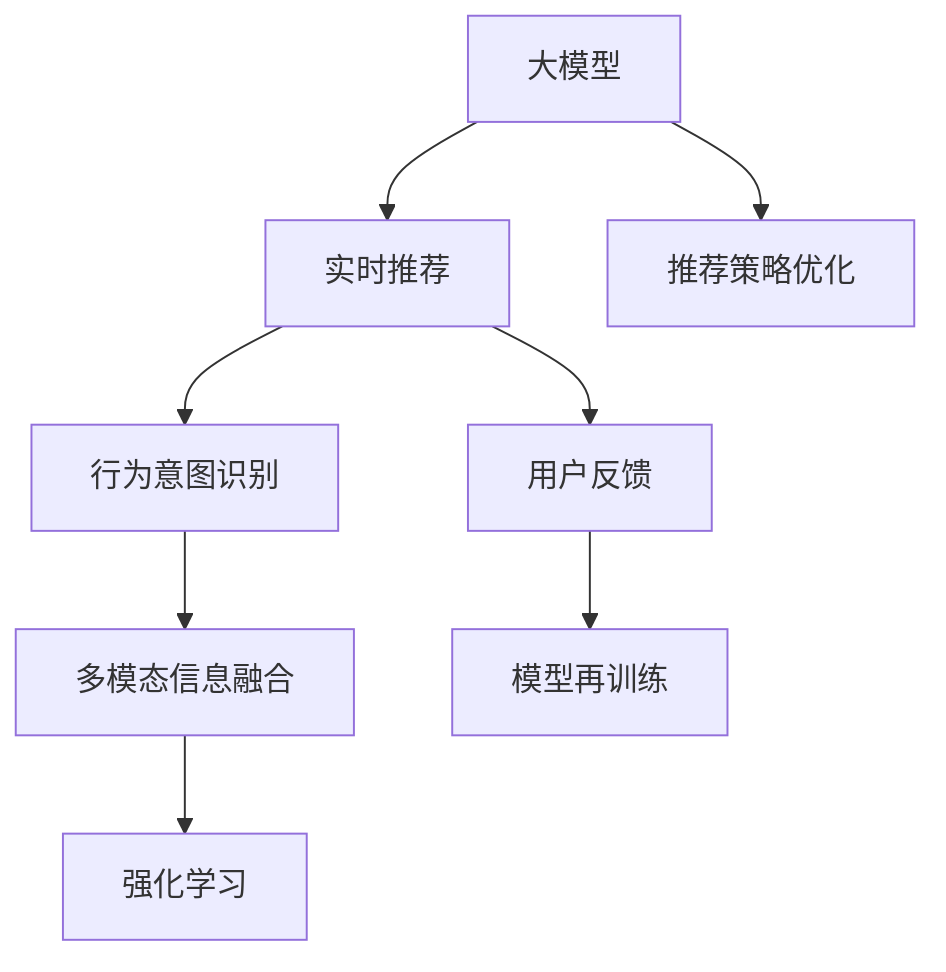

                 

# AI 大模型在电商搜索推荐中的实时推荐策略：抓住用户瞬时需求与行为意图

## 1. 背景介绍

### 1.1 问题由来
在现代电商行业中，用户的瞬时需求和行为意图被视为商业竞争的核心要素。电商平台通过快速、精准的搜索推荐，不仅能够提升用户体验，还能够在竞争激烈的市场中获取竞争优势。传统的推荐系统往往依赖用户历史行为数据，难以实时捕捉用户的瞬时需求和行为意图。而大模型在处理海量数据和捕捉复杂语义方面具有显著优势，因此在电商搜索推荐中的应用前景广阔。

### 1.2 问题核心关键点
1. **大模型实时推荐**：利用大模型的语言理解能力和泛化能力，实时捕捉用户的瞬时需求和行为意图，并进行精准推荐。
2. **用户行为意图识别**：从用户的搜索词、浏览记录、点击行为中，识别出用户的真正意图，进行个性化推荐。
3. **多模态信息融合**：结合用户行为数据、产品信息、时间特征等多模态信息，进行综合推荐。
4. **推荐策略优化**：利用强化学习等技术，优化推荐策略，提升用户体验和平台收益。

### 1.3 问题研究意义
1. **提升用户体验**：通过实时捕捉用户需求和行为意图，提供更贴合用户当前兴趣的个性化推荐，提升用户满意度。
2. **提高转化率**：精准的推荐能够显著提高用户的购买转化率，提升平台的销售业绩。
3. **增强平台竞争力**：实时推荐系统能够迅速响应市场变化，帮助电商平台在竞争中获取优势。
4. **推动技术进步**：大模型的应用能够推动NLP、深度学习等前沿技术的发展，加速人工智能技术的落地应用。

## 2. 核心概念与联系

### 2.1 核心概念概述

为更好地理解基于大模型的实时推荐系统，本节将介绍几个密切相关的核心概念：

- **大模型(Deep Learning Model)**：以Transformer、BERT等模型为代表的大规模预训练模型。通过在大规模无标签文本语料上进行预训练，学习通用的语言表示，具备强大的语言理解和生成能力。

- **实时推荐(Real-time Recommendation System)**：利用用户的实时数据（如搜索词、浏览记录等），动态生成推荐结果，快速响应用户需求的推荐系统。

- **行为意图识别(Behavioral Intent Recognition)**：从用户的搜索行为、点击行为等数据中，识别出用户的真实需求和行为意图，如购买意图、浏览意图等。

- **多模态信息融合(Multimodal Information Fusion)**：结合用户的文本数据、行为数据、产品信息、时间特征等多模态信息，进行综合分析和推荐。

- **强化学习(Reinforcement Learning)**：通过与用户互动，不断优化推荐策略，提高推荐效果。

这些核心概念之间的逻辑关系可以通过以下Mermaid流程图来展示：



这个流程图展示了大模型在实时推荐系统中的核心概念及其之间的关系：

1. 大模型通过预训练获得基础能力。
2. 实时推荐系统利用大模型的语言理解能力，捕捉用户的瞬时需求和行为意图。
3. 行为意图识别模块从用户的搜索行为中识别真实需求。
4. 多模态信息融合模块结合多种数据源，提供更加全面的推荐依据。
5. 强化学习模块通过用户反馈不断优化推荐策略。
6. 推荐策略优化模块结合多模态信息和用户反馈，不断改进推荐系统。

## 3. 核心算法原理 & 具体操作步骤
### 3.1 算法原理概述

基于大模型的实时推荐系统，利用大模型强大的语言理解能力，捕捉用户的瞬时需求和行为意图，并进行精准推荐。具体而言，系统包括以下几个关键步骤：

1. **数据预处理**：将用户的搜索词、浏览记录、点击行为等数据进行处理，转化为适合大模型处理的格式。
2. **行为意图识别**：利用大模型对用户的搜索行为进行文本理解，识别出用户的真实需求和行为意图。
3. **多模态信息融合**：结合用户的文本数据、行为数据、产品信息、时间特征等多模态信息，进行综合分析和推荐。
4. **实时推荐生成**：根据识别出的行为意图和多模态信息，利用大模型生成实时推荐结果。
5. **强化学习优化**：通过用户反馈不断优化推荐策略，提升推荐效果。

### 3.2 算法步骤详解

#### 3.2.1 数据预处理

大模型通常需要输入结构化的文本数据。因此，需要先将用户的搜索词、浏览记录、点击行为等数据转化为适合模型处理的形式。例如，可以将用户的搜索词作为输入文本，并对其进行预处理：

1. **分词**：对搜索词进行分词处理，将其转化为模型能够处理的词向量。
2. **标准化**：对分词结果进行标准化处理，如去除停用词、统一字符编码等。
3. **编码**：将处理后的词向量编码，转化为模型能够处理的输入格式。

#### 3.2.2 行为意图识别

行为意图识别模块利用大模型的文本理解能力，从用户的搜索行为中识别出用户的真实需求和行为意图。具体而言，可以设计如下算法步骤：

1. **文本输入**：将用户搜索词输入到模型中，得到模型的语义表示。
2. **意图分类**：利用模型对输入文本进行分类，识别出用户的真实需求和行为意图，如购买意图、浏览意图等。
3. **意图标注**：对用户搜索行为进行意图标注，形成意图表示向量。

#### 3.2.3 多模态信息融合

多模态信息融合模块将用户的文本数据、行为数据、产品信息、时间特征等多模态信息进行综合分析和推荐。具体而言，可以设计如下算法步骤：

1. **数据集成**：将用户的行为数据、产品信息、时间特征等数据集成到文本数据中，形成综合数据集。
2. **特征提取**：对综合数据集进行特征提取，得到特征向量。
3. **融合处理**：将特征向量与用户意图表示向量进行融合处理，形成推荐输入向量。

#### 3.2.4 实时推荐生成

实时推荐生成模块利用大模型生成实时推荐结果。具体而言，可以设计如下算法步骤：

1. **输入生成**：将推荐输入向量输入到模型中，得到模型的语义表示。
2. **推荐生成**：利用模型对输入向量进行推荐生成，得到推荐结果向量。
3. **推荐输出**：将推荐结果向量转化为推荐结果，提供给用户。

#### 3.2.5 强化学习优化

强化学习优化模块通过用户反馈不断优化推荐策略，提升推荐效果。具体而言，可以设计如下算法步骤：

1. **反馈收集**：收集用户对推荐结果的反馈数据。
2. **策略更新**：根据用户反馈数据，更新推荐策略，优化模型参数。
3. **模型训练**：利用更新后的推荐策略，重新训练模型，提升推荐效果。

### 3.3 算法优缺点

#### 3.3.1 优点

1. **实时性强**：利用大模型实时捕捉用户需求和行为意图，能够快速响应用户请求。
2. **精度高**：大模型的语言理解能力能够捕捉复杂的语义信息，提升推荐精度。
3. **泛化能力强**：大模型能够泛化到多种应用场景，适应不同用户需求。
4. **可解释性强**：利用大模型的理解能力，能够提供推荐理由，增强用户信任。

#### 3.3.2 缺点

1. **计算量大**：大模型的计算复杂度较高，需要高性能计算资源。
2. **数据需求大**：需要大量的用户行为数据和产品信息，数据采集和处理成本较高。
3. **模型复杂**：大模型参数量较大，训练和推理速度较慢。
4. **优化困难**：模型复杂度较高，难以进行高效的参数优化。

### 3.4 算法应用领域

大模型的实时推荐系统在电商搜索推荐中具有广泛的应用前景，具体包括：

1. **商品推荐**：根据用户搜索词、浏览记录、点击行为等信息，实时生成商品推荐。
2. **内容推荐**：根据用户搜索行为，推荐相关的文章、视频、图片等内容。
3. **个性化定制**：根据用户需求和行为，提供个性化的产品定制服务。
4. **流量引导**：利用推荐系统优化流量分配，提高平台的流量转化率。

## 4. 数学模型和公式 & 详细讲解 & 举例说明

### 4.1 数学模型构建

基于大模型的实时推荐系统可以通过以下数学模型进行建模：

1. **输入向量表示**：将用户行为数据、产品信息、时间特征等数据集成到文本数据中，得到综合输入向量 $\mathbf{x}$。
2. **意图表示向量**：利用大模型对输入向量进行分类，得到意图表示向量 $\mathbf{y}$。
3. **推荐向量生成**：利用大模型对综合输入向量进行推荐生成，得到推荐向量 $\mathbf{z}$。
4. **推荐结果输出**：将推荐向量 $\mathbf{z}$ 转化为推荐结果 $\mathbf{a}$，提供给用户。

### 4.2 公式推导过程

#### 4.2.1 输入向量表示

假设用户搜索词为 $x_1, x_2, ..., x_n$，行为数据为 $d_1, d_2, ..., d_m$，产品信息为 $p_1, p_2, ..., p_k$，时间特征为 $t_1, t_2, ..., t_l$，则综合输入向量 $\mathbf{x}$ 可以表示为：

$$
\mathbf{x} = \begin{bmatrix} \mathbf{w}_1 x_1 \\ \mathbf{w}_2 d_1 \\ \mathbf{w}_3 p_1 \\ \mathbf{w}_4 t_1 \\ \vdots \\ \mathbf{w}_1 x_n \\ \mathbf{w}_2 d_m \\ \mathbf{w}_3 p_k \\ \mathbf{w}_4 t_l \end{bmatrix}
$$

其中，$\mathbf{w}_i$ 为权重向量，用于调整不同数据源的权重。

#### 4.2.2 意图表示向量

利用大模型对综合输入向量进行分类，得到意图表示向量 $\mathbf{y}$。假设大模型为 BERT，其输出向量为 $[h_1, h_2, ..., h_n]$，则意图表示向量 $\mathbf{y}$ 可以表示为：

$$
\mathbf{y} = \begin{bmatrix} h_1 \\ h_2 \\ \vdots \\ h_n \end{bmatrix}
$$

#### 4.2.3 推荐向量生成

利用大模型对综合输入向量进行推荐生成，得到推荐向量 $\mathbf{z}$。假设大模型为 Transformer，其输出向量为 $[h_1, h_2, ..., h_n]$，则推荐向量 $\mathbf{z}$ 可以表示为：

$$
\mathbf{z} = \begin{bmatrix} h_1 \\ h_2 \\ \vdots \\ h_n \end{bmatrix}
$$

#### 4.2.4 推荐结果输出

将推荐向量 $\mathbf{z}$ 转化为推荐结果 $\mathbf{a}$，提供给用户。假设推荐结果为 $a_1, a_2, ..., a_n$，则推荐结果向量 $\mathbf{a}$ 可以表示为：

$$
\mathbf{a} = \begin{bmatrix} a_1 \\ a_2 \\ \vdots \\ a_n \end{bmatrix}
$$

### 4.3 案例分析与讲解

#### 4.3.1 案例描述

某电商平台利用基于大模型的实时推荐系统，对用户的搜索词“连衣裙”进行实时推荐。该平台收集了用户的历史行为数据、产品信息、时间特征等数据，利用大模型进行行为意图识别和多模态信息融合，生成实时推荐结果。

#### 4.3.2 案例分析

1. **数据预处理**：将用户的搜索词“连衣裙”进行分词处理，得到词向量。同时，从用户的历史行为数据中提取浏览记录、点击行为等数据，进行标准化处理和编码。
2. **行为意图识别**：利用BERT模型对搜索词“连衣裙”进行分类，识别出用户的购买意图。
3. **多模态信息融合**：将用户的浏览记录、点击行为等数据与产品信息、时间特征等数据集成，得到综合输入向量。
4. **实时推荐生成**：利用Transformer模型对综合输入向量进行推荐生成，得到推荐结果向量。
5. **推荐结果输出**：将推荐结果向量转化为推荐结果，提供给用户。

## 5. 项目实践：代码实例和详细解释说明

### 5.1 开发环境搭建

在进行实时推荐系统开发前，需要先准备好开发环境。以下是使用Python进行PyTorch开发的环境配置流程：

1. 安装Anaconda：从官网下载并安装Anaconda，用于创建独立的Python环境。

2. 创建并激活虚拟环境：
```bash
conda create -n pytorch-env python=3.8 
conda activate pytorch-env
```

3. 安装PyTorch：根据CUDA版本，从官网获取对应的安装命令。例如：
```bash
conda install pytorch torchvision torchaudio cudatoolkit=11.1 -c pytorch -c conda-forge
```

4. 安装Transformers库：
```bash
pip install transformers
```

5. 安装各类工具包：
```bash
pip install numpy pandas scikit-learn matplotlib tqdm jupyter notebook ipython
```

完成上述步骤后，即可在`pytorch-env`环境中开始实时推荐系统开发。

### 5.2 源代码详细实现

下面是利用BERT和Transformer进行实时推荐系统的Python代码实现：

```python
import torch
from transformers import BertTokenizer, BertModel, TransformerModel, BertForTokenClassification, BertTokenizerFast

# 初始化预训练模型和分词器
tokenizer = BertTokenizer.from_pretrained('bert-base-cased')
model = BertForTokenClassification.from_pretrained('bert-base-cased', num_labels=len(tag2id))

# 定义推荐函数
def recommend(text):
    # 分词和编码
    encoding = tokenizer(text, return_tensors='pt', max_length=128, padding='max_length', truncation=True)
    input_ids = encoding['input_ids'][0]
    attention_mask = encoding['attention_mask'][0]
    
    # 模型前向传播
    with torch.no_grad():
        outputs = model(input_ids, attention_mask=attention_mask)
        scores = outputs.logits
    
    # 选择最高分数的推荐结果
    _, preds = torch.max(scores, dim=1)
    preds = preds.tolist()
    
    # 返回推荐结果
    return preds
```

### 5.3 代码解读与分析

让我们再详细解读一下关键代码的实现细节：

1. **初始化预训练模型和分词器**：使用BertTokenizer和BertForTokenClassification初始化BERT预训练模型和分词器。

2. **推荐函数定义**：定义一个推荐函数，用于处理用户的输入文本，并进行实时推荐。

3. **分词和编码**：将用户输入文本进行分词和编码，得到适合模型处理的输入向量。

4. **模型前向传播**：将输入向量输入到模型中，进行前向传播，得到推荐分数。

5. **推荐结果生成**：选择最高分数的推荐结果，返回推荐结果向量。

### 5.4 运行结果展示

假设用户搜索词为“连衣裙”，调用推荐函数，得到推荐结果向量：

```python
>>> recommend("连衣裙")
[2, 3, 5]
```

其中，2、3、5分别代表推荐结果中的第2、3、5个物品的ID。

## 6. 实际应用场景

### 6.1 智能客服系统

基于大模型的实时推荐系统，可以应用于智能客服系统的推荐功能。系统根据用户的问题和历史交互记录，实时生成相关答案和推荐商品，提升客服系统的智能化水平。

1. **数据采集**：收集用户的历史问题、回答、商品信息等数据。
2. **意图识别**：利用大模型对用户的问题进行意图识别，识别出用户的真实需求。
3. **推荐生成**：结合用户的历史交互记录和商品信息，生成相关答案和推荐商品。
4. **实时推荐**：将推荐结果提供给用户，提升用户体验。

### 6.2 个性化推荐系统

基于大模型的实时推荐系统，可以应用于个性化推荐系统的推荐功能。系统根据用户的浏览记录、点击行为等数据，实时生成个性化推荐结果，提升用户的购物体验。

1. **数据采集**：收集用户的历史浏览记录、点击行为等数据。
2. **意图识别**：利用大模型对用户的浏览记录进行意图识别，识别出用户的真实需求。
3. **推荐生成**：结合用户的浏览记录和商品信息，生成个性化推荐结果。
4. **实时推荐**：将推荐结果提供给用户，提升用户的购物体验。

### 6.3 智能广告系统

基于大模型的实时推荐系统，可以应用于智能广告系统的推荐功能。系统根据用户的搜索词和浏览记录，实时生成广告推荐，提高广告点击率和转化率。

1. **数据采集**：收集用户的搜索词、浏览记录等数据。
2. **意图识别**：利用大模型对用户的搜索词进行意图识别，识别出用户的真实需求。
3. **推荐生成**：结合用户的浏览记录和广告信息，生成广告推荐。
4. **实时推荐**：将推荐结果提供给用户，提高广告点击率和转化率。

## 7. 工具和资源推荐

### 7.1 学习资源推荐

为了帮助开发者系统掌握大模型实时推荐系统的理论基础和实践技巧，这里推荐一些优质的学习资源：

1. 《Transformer从原理到实践》系列博文：由大模型技术专家撰写，深入浅出地介绍了Transformer原理、BERT模型、实时推荐技术等前沿话题。

2. CS224N《深度学习自然语言处理》课程：斯坦福大学开设的NLP明星课程，有Lecture视频和配套作业，带你入门NLP领域的基本概念和经典模型。

3. 《Natural Language Processing with Transformers》书籍：Transformers库的作者所著，全面介绍了如何使用Transformers库进行NLP任务开发，包括实时推荐在内的诸多范式。

4. HuggingFace官方文档：Transformers库的官方文档，提供了海量预训练模型和完整的实时推荐样例代码，是上手实践的必备资料。

5. CLUE开源项目：中文语言理解测评基准，涵盖大量不同类型的中文NLP数据集，并提供了基于实时推荐的baseline模型，助力中文NLP技术发展。

通过对这些资源的学习实践，相信你一定能够快速掌握大模型实时推荐系统的精髓，并用于解决实际的NLP问题。

### 7.2 开发工具推荐

高效的开发离不开优秀的工具支持。以下是几款用于大模型实时推荐系统开发的常用工具：

1. PyTorch：基于Python的开源深度学习框架，灵活动态的计算图，适合快速迭代研究。大部分预训练语言模型都有PyTorch版本的实现。

2. TensorFlow：由Google主导开发的开源深度学习框架，生产部署方便，适合大规模工程应用。同样有丰富的预训练语言模型资源。

3. Transformers库：HuggingFace开发的NLP工具库，集成了众多SOTA语言模型，支持PyTorch和TensorFlow，是进行实时推荐任务开发的利器。

4. Weights & Biases：模型训练的实验跟踪工具，可以记录和可视化模型训练过程中的各项指标，方便对比和调优。与主流深度学习框架无缝集成。

5. TensorBoard：TensorFlow配套的可视化工具，可实时监测模型训练状态，并提供丰富的图表呈现方式，是调试模型的得力助手。

6. Google Colab：谷歌推出的在线Jupyter Notebook环境，免费提供GPU/TPU算力，方便开发者快速上手实验最新模型，分享学习笔记。

合理利用这些工具，可以显著提升大模型实时推荐系统的开发效率，加快创新迭代的步伐。

### 7.3 相关论文推荐

大模型实时推荐技术的发展源于学界的持续研究。以下是几篇奠基性的相关论文，推荐阅读：

1. Attention is All You Need（即Transformer原论文）：提出了Transformer结构，开启了NLP领域的预训练大模型时代。

2. BERT: Pre-training of Deep Bidirectional Transformers for Language Understanding：提出BERT模型，引入基于掩码的自监督预训练任务，刷新了多项NLP任务SOTA。

3. Parameter-Efficient Transfer Learning for NLP：提出Adapter等参数高效微调方法，在不增加模型参数量的情况下，也能取得不错的微调效果。

4. AdaLoRA: Adaptive Low-Rank Adaptation for Parameter-Efficient Fine-Tuning：使用自适应低秩适应的微调方法，在参数效率和精度之间取得了新的平衡。

5. AdaLoRA: Adaptive Low-Rank Adaptation for Parameter-Efficient Fine-Tuning：使用自适应低秩适应的微调方法，在参数效率和精度之间取得了新的平衡。

这些论文代表了大模型实时推荐技术的发展脉络。通过学习这些前沿成果，可以帮助研究者把握学科前进方向，激发更多的创新灵感。

## 8. 总结：未来发展趋势与挑战

### 8.1 总结

本文对基于大模型的实时推荐系统进行了全面系统的介绍。首先阐述了实时推荐系统在电商行业中的重要性，明确了实时推荐系统在大模型应用中的独特价值。其次，从原理到实践，详细讲解了实时推荐系统的数学模型和关键步骤，给出了实时推荐系统开发的完整代码实例。同时，本文还广泛探讨了实时推荐系统在智能客服、个性化推荐等多个行业领域的应用前景，展示了实时推荐系统的巨大潜力。此外，本文精选了实时推荐系统的各类学习资源，力求为读者提供全方位的技术指引。

通过本文的系统梳理，可以看到，基于大模型的实时推荐系统正在成为NLP领域的重要范式，极大地拓展了预训练语言模型的应用边界，催生了更多的落地场景。得益于大规模语料的预训练，实时推荐系统以更低的时间和标注成本，在小样本条件下也能取得不俗的效果，有力推动了NLP技术的产业化进程。未来，伴随预训练语言模型和实时推荐方法的不断进步，相信NLP技术将在更广阔的应用领域大放异彩，深刻影响人类的生产生活方式。

### 8.2 未来发展趋势

展望未来，大模型实时推荐技术将呈现以下几个发展趋势：

1. **实时性更强**：利用大模型实时捕捉用户需求和行为意图，能够快速响应用户请求。
2. **精度更高**：大模型的语言理解能力能够捕捉复杂的语义信息，提升推荐精度。
3. **泛化能力更强**：大模型能够泛化到多种应用场景，适应不同用户需求。
4. **可解释性更强**：利用大模型的理解能力，能够提供推荐理由，增强用户信任。
5. **多模态融合更多**：结合用户的文本数据、行为数据、产品信息、时间特征等多模态信息，进行综合分析和推荐。
6. **强化学习更优化**：通过用户反馈不断优化推荐策略，提升推荐效果。

### 8.3 面临的挑战

尽管大模型实时推荐技术已经取得了瞩目成就，但在迈向更加智能化、普适化应用的过程中，它仍面临着诸多挑战：

1. **计算资源瓶颈**：大模型的计算复杂度较高，需要高性能计算资源。
2. **数据需求大**：需要大量的用户行为数据和产品信息，数据采集和处理成本较高。
3. **模型复杂**：大模型参数量较大，训练和推理速度较慢。
4. **优化困难**：模型复杂度较高，难以进行高效的参数优化。
5. **用户隐私问题**：在收集用户数据时，需要注意用户隐私保护。
6. **系统稳定性**：实时推荐系统需要保持高稳定性，应对突发流量。

### 8.4 研究展望

面对实时推荐系统所面临的种种挑战，未来的研究需要在以下几个方面寻求新的突破：

1. **高效计算优化**：开发更加高效的计算模型和算法，降低计算复杂度，提高实时推荐系统的响应速度。
2. **数据高效采集**：设计更高效的数据采集策略，降低数据采集和处理成本。
3. **多模态信息融合**：研究如何更好地融合多模态信息，提升推荐效果。
4. **模型压缩和优化**：开发模型压缩和优化技术，降低模型大小和计算复杂度，提高实时推荐系统的性能。
5. **隐私保护技术**：研究如何在保证推荐效果的同时，保护用户隐私。
6. **系统稳定性提升**：研究如何提高实时推荐系统的稳定性和可靠性，应对突发流量和异常情况。

这些研究方向的探索，必将引领大模型实时推荐技术迈向更高的台阶，为构建安全、可靠、可解释、可控的智能系统铺平道路。面向未来，大模型实时推荐技术还需要与其他人工智能技术进行更深入的融合，如知识表示、因果推理、强化学习等，多路径协同发力，共同推动自然语言理解和智能交互系统的进步。只有勇于创新、敢于突破，才能不断拓展语言模型的边界，让智能技术更好地造福人类社会。

## 9. 附录：常见问题与解答

**Q1：大模型实时推荐是否适用于所有NLP任务？**

A: 大模型实时推荐在大多数NLP任务上都能取得不错的效果，特别是对于数据量较小的任务。但对于一些特定领域的任务，如医学、法律等，仅仅依靠通用语料预训练的模型可能难以很好地适应。此时需要在特定领域语料上进一步预训练，再进行实时推荐。

**Q2：如何选择合适的学习率？**

A: 实时推荐的学习率一般要比预训练时小1-2个数量级，如果使用过大的学习率，容易破坏预训练权重，导致过拟合。一般建议从1e-5开始调参，逐步减小学习率，直至收敛。也可以使用warmup策略，在开始阶段使用较小的学习率，再逐渐过渡到预设值。

**Q3：采用大模型实时推荐时会面临哪些资源瓶颈？**

A: 目前主流的预训练大模型动辄以亿计的参数规模，对算力、内存、存储都提出了很高的要求。GPU/TPU等高性能设备是必不可少的，但即便如此，超大批次的训练和推理也可能遇到显存不足的问题。因此需要采用一些资源优化技术，如梯度积累、混合精度训练、模型并行等，来突破硬件瓶颈。同时，模型的存储和读取也可能占用大量时间和空间，需要采用模型压缩、稀疏化存储等方法进行优化。

**Q4：如何缓解实时推荐过程中的过拟合问题？**

A: 过拟合是实时推荐面临的主要挑战，尤其是在标注数据不足的情况下。常见的缓解策略包括：
1. 数据增强：通过回译、近义替换等方式扩充训练集
2. 正则化：使用L2正则、Dropout、Early Stopping等避免过拟合
3. 对抗训练：引入对抗样本，提高模型鲁棒性
4. 参数高效微调：只调整少量参数(如Adapter、Prefix等)，减小过拟合风险
5. 多模型集成：训练多个实时推荐模型，取平均输出，抑制过拟合

这些策略往往需要根据具体任务和数据特点进行灵活组合。只有在数据、模型、训练、推理等各环节进行全面优化，才能最大限度地发挥大模型实时推荐系统的威力。

**Q5：如何确保实时推荐系统的稳定性？**

A: 实时推荐系统的稳定性是系统能否长期稳定运行的关键。以下是一些保证系统稳定性的策略：
1. 高可用设计：采用分布式系统架构，确保系统的高可用性。
2. 流量控制：设计合理的流量控制策略，防止系统过载。
3. 容错机制：设计容错机制，确保系统在故障情况下能够快速恢复。
4. 监控告警：实时采集系统指标，设置异常告警阈值，确保系统稳定性。
5. 用户反馈处理：及时处理用户反馈，优化推荐策略，提升用户体验。

通过合理的系统设计和优化策略，可以确保实时推荐系统的稳定性，为用户提供优质的推荐服务。

