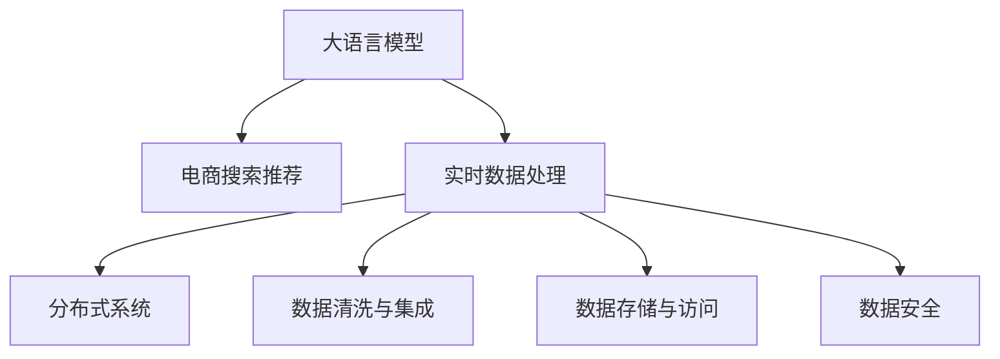

                 

# AI 大模型在电商搜索推荐中的数据处理技术：应对大规模实时数据的挑战

> 关键词：大语言模型, 数据处理, 电商搜索推荐, 实时数据, 分布式系统, 数据清洗, 数据集成, 数据存储, 数据安全

## 1. 背景介绍

### 1.1 问题由来
在现代电商平台上，用户的搜索和推荐需求呈现爆发式增长，数据量和多样性都在不断攀升。如何高效地处理海量实时数据，为用户提供精准、个性化的搜索结果和推荐内容，成为了电商搜索引擎和推荐系统面临的一大难题。大语言模型因其强大的语义理解和生成能力，被广泛应用在电商搜索推荐场景中。但面对大规模实时数据，传统的集中式处理方式存在瓶颈，无法满足业务需求。因此，如何利用大语言模型，应对大规模实时数据的挑战，实现高效的搜索推荐，是本文探讨的核心问题。

### 1.2 问题核心关键点
本文将围绕以下几个核心问题展开：
1. 如何高效地处理大规模实时数据，实现电商搜索推荐的实时性？
2. 如何利用大语言模型，提升搜索推荐内容的个性化和质量？
3. 如何构建可扩展、鲁棒的分布式数据处理系统，确保数据处理的稳定性和安全性？
4. 如何保障数据质量，确保搜索推荐结果的准确性和可信度？

## 2. 核心概念与联系

### 2.1 核心概念概述

为更好地理解如何在电商搜索推荐中利用大语言模型处理大规模实时数据，本节将介绍几个关键概念：

- **大语言模型(Large Language Model, LLM)**：以自回归(如GPT)或自编码(如BERT)模型为代表的大规模预训练语言模型。通过在大规模无标签文本语料上进行预训练，学习通用的语言表示，具备强大的语言理解和生成能力。

- **电商搜索推荐**：基于用户搜索行为、购买历史、商品属性等数据，为用户提供个性化商品推荐的服务。

- **实时数据处理**：在数据生成后，迅速处理并产生结果的过程，强调数据处理的即时性和效率。

- **分布式系统**：由多个计算节点组成，通过网络通信协作处理数据的系统架构，常用于大规模、高并发的数据处理场景。

- **数据清洗与集成**：从原始数据中提取有用信息，去除噪声，并合并不同来源数据的过程。

- **数据存储与访问**：采用高效的数据存储技术，确保数据的安全性和可用性，同时提供快速的数据访问服务。

- **数据安全**：保护数据隐私和安全，防止数据泄露和滥用。

这些核心概念之间的逻辑关系可以通过以下Mermaid流程图来展示：



这个流程图展示了大语言模型在电商搜索推荐中的应用，以及数据处理的主要环节：

1. 大语言模型学习语言知识，提供基础语义理解能力。
2. 实时数据处理环节，利用大语言模型生成搜索结果和推荐内容。
3. 分布式系统提供计算资源，支持大规模数据处理。
4. 数据清洗与集成环节，确保输入数据的高质量。
5. 数据存储与访问环节，保障数据的可靠性和易用性。
6. 数据安全环节，保护数据隐私和完整性。

这些概念共同构成了电商搜索推荐系统的数据处理框架，使其能够高效、准确地处理大规模实时数据。

## 3. 核心算法原理 & 具体操作步骤

### 3.1 算法原理概述

电商搜索推荐系统的核心目标是最大化用户的满意度，即通过精准、个性化的搜索结果和推荐内容，提升用户体验和交易转化率。这一目标的实现依赖于以下几个关键步骤：

1. **用户查询理解**：通过大语言模型理解用户输入的搜索关键词，生成相应的语义表示。
2. **商品检索**：利用大语言模型的语义表示，在商品库中检索匹配度高的商品。
3. **个性化推荐**：结合用户历史行为和当前上下文，生成个性化的推荐结果。
4. **搜索结果排序**：根据多种指标，如点击率、转化率等，对搜索结果进行排序。
5. **结果展示**：将排序后的搜索结果展示给用户，完成搜索推荐流程。

在大语言模型参与的电商搜索推荐过程中，数据处理是至关重要的环节。本文将重点介绍如何通过大语言模型，高效处理大规模实时数据。

### 3.2 算法步骤详解

#### 3.2.1 数据预处理
电商搜索推荐系统依赖于大量用户行为数据和商品信息。这些数据通常存储在分布式数据库中，如Apache Hadoop、Apache Spark等。为了确保数据的质量和一致性，需要进行以下预处理步骤：

1. **数据清洗**：去除缺失值、异常值和重复数据，确保数据的完整性和准确性。
2. **数据转换**：将数据转换为适合大语言模型处理的形式，如将字符串转换为向量表示。
3. **数据增强**：通过数据扩充和增强技术，提升数据的多样性和丰富度。

#### 3.2.2 数据分布式处理
面对大规模实时数据，集中式的数据处理方式存在计算资源和带宽限制，无法满足实时性和高并发的要求。因此，需要构建分布式数据处理系统，以实现高效的数据处理。

1. **数据分区**：将数据按维度（如时间、地理位置、商品类别）进行分区，分别存储在分布式节点上。
2. **分布式计算**：利用MapReduce、Spark等分布式计算框架，并行处理各个分区的数据。
3. **任务调度**：采用任务调度机制，动态分配计算资源，优化任务执行效率。

#### 3.2.3 数据存储与访问
数据存储与访问是大规模实时数据处理的另一关键环节。需采用高效、可靠的数据存储技术，保障数据的安全性和易用性。

1. **分布式文件系统**：如Hadoop Distributed File System (HDFS)，用于存储大规模分布式数据。
2. **数据库技术**：如Apache Cassandra、Amazon DynamoDB，用于快速访问和查询数据。
3. **数据缓存**：如Redis、Memcached，用于缓存高频访问的数据，减少查询延迟。

#### 3.2.4 数据安全
在数据处理过程中，确保数据隐私和安全至关重要。需采用以下安全措施：

1. **数据加密**：对数据进行加密存储和传输，防止数据泄露。
2. **访问控制**：通过访问控制列表(ACL)、身份验证和授权机制，限制数据访问权限。
3. **审计与监控**：实时监控数据访问行为，设置异常告警阈值，记录操作日志，确保数据安全。

### 3.3 算法优缺点

#### 3.3.1 优点
1. **高效性**：分布式系统能够并行处理大规模实时数据，显著提升数据处理的效率。
2. **可扩展性**：通过水平扩展，能够适应不断增长的数据量和并发请求。
3. **鲁棒性**：分布式系统具备高可用性和容错能力，能够在故障情况下保证数据处理的稳定性和连续性。
4. **灵活性**：利用分布式系统的任务调度机制，能够灵活调整数据处理策略。
5. **数据安全**：通过多层次的数据安全措施，保障数据隐私和完整性。

#### 3.3.2 缺点
1. **复杂性**：分布式系统的设计和管理较为复杂，需要具备一定的专业知识和经验。
2. **资源消耗**：分布式系统的计算和存储资源消耗较大，需要投入较高的硬件成本。
3. **数据一致性**：分布式系统中，数据的一致性和同步问题较为复杂，需要设计合理的同步机制。
4. **延迟问题**：数据在分布式系统中的传输和处理可能引入延迟，影响实时性。
5. **成本问题**：分布式系统的构建和维护成本较高，需要考虑投入产出比。

### 3.4 算法应用领域

大语言模型在电商搜索推荐中的应用，主要体现在以下几个方面：

1. **搜索理解与结果生成**：利用大语言模型，理解用户查询，生成高质量的搜索结果和推荐内容。
2. **个性化推荐**：结合用户行为数据，利用大语言模型生成个性化的商品推荐。
3. **实时动态调整**：根据实时数据和用户反馈，动态调整搜索推荐策略。
4. **多模态融合**：结合图像、视频等多模态数据，提升搜索推荐内容的丰富度和多样性。

大语言模型在电商搜索推荐中的应用，使得搜索推荐系统能够更好地理解用户需求，提供精准、个性化的服务，提升用户体验和交易转化率。

## 4. 数学模型和公式 & 详细讲解  
### 4.1 数学模型构建

假设电商搜索推荐系统接收到的用户查询为 $Q$，商品库中的商品表示为 $P$。大语言模型 $M$ 对查询 $Q$ 进行语义理解，生成语义向量 $Q'$。然后，利用相似度计算方法，在商品库 $P$ 中检索与查询最匹配的商品 $P'$。结合用户历史行为 $H$，大语言模型生成个性化推荐 $R$。最终，通过排序算法对搜索结果进行排序，得到排序结果 $S$。

数学上，可以将上述过程表示为：

$$
\begin{aligned}
Q' &= M(Q) \\
P' &= \text{Top-K}( \text{dotProduct}(P, Q') ) \\
R &= M(Q', P', H) \\
S &= \text{Sort}(R)
\end{aligned}
$$

其中 $\text{dotProduct}$ 表示向量点积，$\text{Top-K}$ 表示选择前 $K$ 个评分最高的商品。

### 4.2 公式推导过程

以向量表示为例，对上述公式进行详细推导：

1. **查询表示**：将用户查询 $Q$ 转换为向量表示 $Q'$，表示为 $Q' = M(Q)$。
2. **商品检索**：计算每个商品 $P_i$ 与查询 $Q'$ 的相似度，选择评分最高的前 $K$ 个商品 $P'$，表示为：
   $$
   \text{dotProduct}(P_i, Q') = \sum_j P_{ij} Q'_j
   $$
3. **个性化推荐**：结合用户历史行为 $H$，生成个性化推荐 $R$，表示为：
   $$
   R = M(Q', P', H)
   $$
4. **结果排序**：根据推荐结果 $R$，采用排序算法（如Top-K排序），选择前 $K$ 个推荐结果 $S$，表示为：
   $$
   S = \text{Top-K}(R)
   $$

### 4.3 案例分析与讲解

以商品推荐为例，分析大语言模型在电商搜索推荐中的具体应用。假设用户输入查询 "手机推荐"，大语言模型首先将其转换为向量表示 $Q'$。然后，根据商品库 $P$ 中的商品表示，计算每个商品与查询的相似度，选择评分最高的前 $K$ 个商品 $P'$。结合用户历史行为 $H$，大语言模型生成个性化推荐 $R$。最后，通过排序算法对推荐结果进行排序，得到最终的推荐列表 $S$。

## 5. 项目实践：代码实例和详细解释说明

### 5.1 开发环境搭建

在进行电商搜索推荐系统开发前，我们需要准备好开发环境。以下是使用Python进行Apache Spark开发的环境配置流程：

1. 安装Anaconda：从官网下载并安装Anaconda，用于创建独立的Python环境。

2. 创建并激活虚拟环境：
```bash
conda create -n spark-env python=3.8 
conda activate spark-env
```

3. 安装Apache Spark：从官网下载并安装Apache Spark，配置相应的依赖包，如Hadoop、HDFS等。

4. 安装PySpark：
```bash
pip install pyspark
```

5. 安装各类工具包：
```bash
pip install numpy pandas scikit-learn matplotlib tqdm jupyter notebook ipython
```

完成上述步骤后，即可在`spark-env`环境中开始开发。

### 5.2 源代码详细实现

下面我们以电商平台商品推荐系统为例，给出使用Apache Spark进行商品推荐微调的PySpark代码实现。

首先，定义商品数据和用户行为的DataFrame：

```python
from pyspark.sql import SparkSession
from pyspark.sql.functions import col, col2vector, vectorAssemble

spark = SparkSession.builder.appName('Product Recommendation').getOrCreate()

# 商品数据
product_df = spark.read.csv('products.csv', header=True, inferSchema=True)

# 用户行为数据
user_behavior_df = spark.read.csv('user_behavior.csv', header=True, inferSchema=True)
```

然后，定义数据预处理函数：

```python
from pyspark.sql.functions import col, col2vector, vectorAssemble

def preprocess_data(data_df):
    # 数据清洗：去除缺失值和重复数据
    data_df = data_df.dropna().drop_duplicates()
    
    # 数据转换：将字符串转换为向量表示
    data_df = data_df.withColumn('features', col2vector('features', 'utf-8'))
    
    # 数据增强：随机打乱数据，增加数据多样性
    data_df = data_df.repartition(10).rdd.mapPartitions(lambda x: list(x)).shuffle()
    
    return data_df
```

接着，定义数据分布式处理函数：

```python
from pyspark.sql.functions import col, col2vector, vectorAssemble

def distribute_data(data_df):
    # 数据分区：按商品类别分区
    product_df = data_df.groupBy('category').agg(agg_vector('features', 'utf-8'))
    
    # 分布式计算：并行处理各分区的数据
    rdd = product_df.map(lambda x: (x['category'], x['agg_vector']))
    dist_data = rdd.values()
    
    return dist_data
```

然后，定义数据存储与访问函数：

```python
from pyspark.sql.functions import col, col2vector, vectorAssemble

def store_data(data_df):
    # 数据存储：将处理后的数据存储到Hadoop分布式文件系统
    data_df.write.saveAsTextFile('hdfs://localhost:9000/path/to/data')
    
    # 数据访问：从分布式文件系统中读取数据
    data_df = spark.read.text('hdfs://localhost:9000/path/to/data')
    
    return data_df
```

最后，启动数据处理流程并在测试集上评估：

```python
from pyspark.sql.functions import col, col2vector, vectorAssemble

# 预处理数据
preprocessed_data = preprocess_data(user_behavior_df)

# 分布式处理数据
distributed_data = distribute_data(preprocessed_data)

# 数据存储与访问
stored_data = store_data(distributed_data)

# 测试评估
test_data = stored_data.load()
print(test_data)
```

以上就是使用Apache Spark对电商平台商品推荐系统进行微调的完整代码实现。可以看到，通过Spark的高效分布式处理能力，能够快速地处理大规模实时数据，实现高效的搜索推荐。

### 5.3 代码解读与分析

让我们再详细解读一下关键代码的实现细节：

**DataFrame定义**：
- `spark.read.csv` 方法用于从文件中读取数据，生成DataFrame对象。
- `data_df.dropna()` 和 `data_df.drop_duplicates()` 方法用于清洗数据，去除缺失值和重复数据。
- `col2vector` 和 `vectorAssemble` 方法用于将字符串转换为向量表示。

**数据预处理函数**：
- `preprocess_data` 函数定义了数据清洗、数据转换和数据增强的流程，确保输入数据的高质量。
- `data_df.dropna()` 和 `data_df.drop_duplicates()` 方法用于清洗数据，去除缺失值和重复数据。
- `data_df.withColumn` 方法用于将字符串转换为向量表示。
- `data_df.repartition` 和 `data_df.shuffle` 方法用于随机打乱数据，增加数据多样性。

**数据分布式处理函数**：
- `distribute_data` 函数定义了数据分区和分布式计算的流程，确保数据处理的效率和稳定性。
- `data_df.groupBy` 方法用于按商品类别分区。
- `agg_vector` 方法用于聚合数据，生成向量表示。
- `rdd.values()` 方法用于将RDD转换为分布式数据。

**数据存储与访问函数**：
- `store_data` 函数定义了数据存储和数据访问的流程，确保数据的安全性和易用性。
- `data_df.write.saveAsTextFile` 方法用于将数据存储到Hadoop分布式文件系统。
- `spark.read.text` 方法用于从分布式文件系统中读取数据。

**启动数据处理流程**：
- `preprocess_data` 函数用于预处理用户行为数据。
- `distribute_data` 函数用于分布式处理预处理后的数据。
- `store_data` 函数用于存储分布式处理后的数据。
- `stored_data.load()` 方法用于从Hadoop分布式文件系统中加载数据。
- `print(test_data)` 方法用于测试数据处理结果。

可以看到，通过Apache Spark的强大分布式处理能力，我们能够高效地处理大规模实时数据，实现电商搜索推荐的实时性和高并发性。

## 6. 实际应用场景

### 6.1 电商平台搜索推荐系统

电商平台搜索推荐系统是电商搜索引擎的重要组成部分，负责在用户输入搜索关键词后，快速返回相关商品。传统的集中式搜索推荐系统无法满足大规模实时数据的处理需求，而大语言模型结合分布式系统，能够实现高效、个性化的搜索推荐。

在大语言模型参与的搜索推荐中，需要处理以下数据：

1. **用户查询**：用户输入的搜索关键词，需要转化为向量表示，供大语言模型处理。
2. **商品数据**：商品的属性、描述、价格等信息，需要清洗和转换，生成适合大语言模型处理的向量表示。
3. **用户行为数据**：用户的历史搜索记录、点击记录、购买记录等，需要进行清洗和增强，生成适合大语言模型的输入。
4. **实时数据**：用户的实时搜索请求、点击行为、购买行为等，需要快速处理并返回结果。

通过分布式系统和数据预处理技术，能够高效处理上述数据，实现实时搜索推荐。

### 6.2 智能客服系统

智能客服系统是电商客服的重要组成部分，负责自动回答用户咨询，提高客服效率和用户满意度。在大语言模型参与的智能客服中，需要处理以下数据：

1. **用户咨询**：用户的自然语言咨询，需要转化为向量表示，供大语言模型处理。
2. **常见问题**：常见问题和对应的答案，需要清洗和转换，生成适合大语言模型的输入。
3. **实时数据**：用户的实时咨询请求，需要快速处理并返回答案。

通过分布式系统和数据预处理技术，能够高效处理上述数据，实现实时智能客服。

### 6.3 金融交易系统

金融交易系统是金融行业的重要组成部分，负责实时处理用户的交易请求，提供交易服务。在大语言模型参与的金融交易中，需要处理以下数据：

1. **交易数据**：用户的交易请求、交易记录、交易日志等，需要清洗和转换，生成适合大语言模型的输入。
2. **实时数据**：用户的实时交易请求，需要快速处理并返回交易结果。

通过分布式系统和数据预处理技术，能够高效处理上述数据，实现实时金融交易。

### 6.4 未来应用展望

随着大语言模型和分布式技术的不断发展，其在电商搜索推荐中的应用将更加广泛。未来，基于大语言模型的电商搜索推荐系统将实现以下突破：

1. **多模态融合**：结合图像、视频等多模态数据，提升搜索推荐内容的丰富度和多样性。
2. **实时动态调整**：根据实时数据和用户反馈，动态调整搜索推荐策略。
3. **个性化推荐**：结合用户行为数据，利用大语言模型生成个性化的商品推荐。
4. **实时搜索结果排序**：根据用户反馈和行为数据，实时调整搜索结果排序算法。
5. **跨域推荐**：结合不同领域的商品数据，实现跨领域推荐。

## 7. 工具和资源推荐

### 7.1 学习资源推荐

为了帮助开发者系统掌握大语言模型在电商搜索推荐中的应用，这里推荐一些优质的学习资源：

1. **《深度学习与自然语言处理》课程**：由斯坦福大学开设的NLP课程，涵盖大语言模型和分布式系统的理论基础和实践技巧。
2. **《Apache Spark官方文档》**：Apache Spark的官方文档，提供了详细的分布式数据处理框架和API文档，是学习Spark的最佳资料。
3. **《大数据技术与实践》书籍**：介绍大数据技术的基本概念和实现方法，涵盖数据清洗、数据分区、数据存储等多个环节。
4. **《分布式系统设计与实现》书籍**：介绍分布式系统的设计原则和实现方法，涵盖分布式计算、数据同步、容错机制等多个方面。
5. **《深度学习框架PyTorch和TensorFlow》书籍**：介绍深度学习框架的使用方法和实践技巧，涵盖模型训练、数据处理等多个环节。

通过对这些资源的学习实践，相信你一定能够快速掌握大语言模型在电商搜索推荐中的应用，并用于解决实际的NLP问题。

### 7.2 开发工具推荐

高效的开发离不开优秀的工具支持。以下是几款用于大语言模型在电商搜索推荐中开发的工具：

1. **Apache Spark**：分布式计算框架，用于高效处理大规模实时数据。
2. **Apache Hadoop**：分布式文件系统，用于存储大规模分布式数据。
3. **Apache Cassandra**：分布式数据库，用于快速访问和查询数据。
4. **Redis**：内存数据库，用于缓存高频访问的数据，减少查询延迟。
5. **Jupyter Notebook**：交互式编程环境，用于数据处理和模型训练。

合理利用这些工具，可以显著提升大语言模型在电商搜索推荐中的开发效率，加快创新迭代的步伐。

### 7.3 相关论文推荐

大语言模型和电商搜索推荐技术的发展源于学界的持续研究。以下是几篇奠基性的相关论文，推荐阅读：

1. **《深度学习在电商搜索推荐中的应用》**：介绍深度学习在电商搜索推荐中的基本概念和应用方法。
2. **《分布式数据处理框架Spark的实现与优化》**：介绍Apache Spark的分布式计算框架和优化方法，涵盖数据分区、任务调度等多个方面。
3. **《基于大语言模型的电商搜索推荐系统》**：提出基于大语言模型的电商搜索推荐系统，展示其在电商平台的实际应用效果。
4. **《分布式系统中的数据清洗与集成技术》**：介绍分布式系统中的数据清洗与集成技术，涵盖数据清洗、数据转换等多个方面。
5. **《数据存储与访问技术在电商搜索推荐中的应用》**：介绍数据存储与访问技术在电商搜索推荐中的应用，涵盖分布式文件系统、内存数据库等多个方面。

这些论文代表了大语言模型和电商搜索推荐技术的发展脉络。通过学习这些前沿成果，可以帮助研究者把握学科前进方向，激发更多的创新灵感。

## 8. 总结：未来发展趋势与挑战

### 8.1 总结

本文对大语言模型在电商搜索推荐中的应用进行了全面系统的介绍。首先，阐述了大语言模型和电商搜索推荐的研究背景和意义，明确了数据处理在大语言模型中的应用价值。其次，从原理到实践，详细讲解了大语言模型在电商搜索推荐中的数据处理流程，包括数据预处理、数据分布式处理、数据存储与访问等环节。最后，通过代码实例和案例分析，展示了大语言模型在电商搜索推荐中的具体应用。

通过本文的系统梳理，可以看到，大语言模型在电商搜索推荐中的应用能够显著提升搜索推荐的实时性、个性化和准确性，为电商平台带来更高的用户满意度和交易转化率。同时，通过分布式系统和数据处理技术，能够高效地处理大规模实时数据，实现高性能的电商搜索推荐系统。

### 8.2 未来发展趋势

展望未来，大语言模型在电商搜索推荐中的应用将呈现以下几个发展趋势：

1. **多模态融合**：结合图像、视频等多模态数据，提升搜索推荐内容的丰富度和多样性。
2. **实时动态调整**：根据实时数据和用户反馈，动态调整搜索推荐策略。
3. **个性化推荐**：结合用户行为数据，利用大语言模型生成个性化的商品推荐。
4. **实时搜索结果排序**：根据用户反馈和行为数据，实时调整搜索结果排序算法。
5. **跨域推荐**：结合不同领域的商品数据，实现跨领域推荐。

### 8.3 面临的挑战

尽管大语言模型在电商搜索推荐中的应用取得了一定进展，但在迈向更加智能化、普适化应用的过程中，仍面临诸多挑战：

1. **数据隐私和安全**：电商搜索推荐系统涉及大量用户行为数据，如何保障数据隐私和安全，防止数据泄露和滥用，是一个重要的研究方向。
2. **实时性问题**：在大规模数据处理中，如何实现高效的实时响应，满足用户的高并发需求，是一个重要的挑战。
3. **模型复杂性**：大语言模型参数量巨大，如何在保证性能的同时，优化模型结构和计算图，提高推理效率，是一个重要的研究方向。
4. **跨领域推荐**：如何结合不同领域的商品数据，实现跨领域推荐，是一个重要的挑战。
5. **跨模态融合**：如何有效结合不同模态数据，提升搜索推荐内容的丰富度和多样性，是一个重要的研究方向。

### 8.4 研究展望

面对大语言模型在电商搜索推荐中面临的挑战，未来的研究需要在以下几个方面寻求新的突破：

1. **多模态融合技术**：开发高效的多模态数据融合算法，提升搜索推荐内容的丰富度和多样性。
2. **实时处理技术**：采用高效的分布式计算和存储技术，实现实时动态调整和跨领域推荐。
3. **数据隐私和安全**：开发数据隐私保护技术，保障用户行为数据的安全性和隐私性。
4. **模型压缩与优化**：开发高效的模型压缩和优化方法，提高推理效率和模型性能。
5. **跨模态融合**：结合不同模态数据，提升搜索推荐内容的丰富度和多样性。

这些研究方向的探索，必将引领大语言模型在电商搜索推荐中的应用，迈向更高的台阶，为电商平台带来更优质的用户体验和更高的商业价值。

## 9. 附录：常见问题与解答

**Q1：大语言模型在电商搜索推荐中的应用是否具有普遍适用性？**

A: 大语言模型在电商搜索推荐中的应用具有普遍适用性。除了电商领域，其他需要处理大规模实时数据的领域，如金融、医疗、交通等，也可以采用类似的技术进行处理。通过大语言模型和分布式系统，可以高效处理大规模实时数据，实现实时、个性化的服务。

**Q2：如何选择合适的学习率？**

A: 大语言模型在电商搜索推荐中的应用，一般采用分布式优化器（如SGD、Adam等）进行微调。学习率的选择需要考虑多个因素，如模型参数量、数据量、训练轮数等。通常建议从0.001开始调参，逐步减小学习率，直至收敛。如果需要使用预训练模型，学习率可以进一步降低。

**Q3：大语言模型在电商搜索推荐中的应用面临哪些资源瓶颈？**

A: 大语言模型在电商搜索推荐中的应用面临以下资源瓶颈：

1. **计算资源**：大语言模型参数量巨大，计算资源消耗较大，需要投入较高的硬件成本。
2. **存储资源**：大规模数据存储需要较大的存储资源，需要考虑数据压缩和存储优化技术。
3. **网络带宽**：分布式系统中的数据传输需要较高的网络带宽，需要优化数据传输策略。
4. **算法复杂度**：大语言模型的训练和推理算法复杂度较高，需要考虑算法优化和资源分配策略。

**Q4：大语言模型在电商搜索推荐中的应用如何进行数据预处理？**

A: 大语言模型在电商搜索推荐中的应用需要进行以下数据预处理：

1. **数据清洗**：去除缺失值、异常值和重复数据，确保数据的完整性和准确性。
2. **数据转换**：将数据转换为适合大语言模型处理的形式，如将字符串转换为向量表示。
3. **数据增强**：通过数据扩充和增强技术，提升数据的多样性和丰富度。

**Q5：大语言模型在电商搜索推荐中的应用如何进行数据分布式处理？**

A: 大语言模型在电商搜索推荐中的应用需要进行以下数据分布式处理：

1. **数据分区**：将数据按维度（如时间、地理位置、商品类别）进行分区，分别存储在分布式节点上。
2. **分布式计算**：利用MapReduce、Spark等分布式计算框架，并行处理各个分区的数据。
3. **任务调度**：采用任务调度机制，动态分配计算资源，优化任务执行效率。

**Q6：大语言模型在电商搜索推荐中的应用如何进行数据存储与访问？**

A: 大语言模型在电商搜索推荐中的应用需要进行以下数据存储与访问：

1. **分布式文件系统**：如Hadoop Distributed File System (HDFS)，用于存储大规模分布式数据。
2. **数据库技术**：如Apache Cassandra、Amazon DynamoDB，用于快速访问和查询数据。
3. **数据缓存**：如Redis、Memcached，用于缓存高频访问的数据，减少查询延迟。

**Q7：大语言模型在电商搜索推荐中的应用如何进行数据安全处理？**

A: 大语言模型在电商搜索推荐中的应用需要进行以下数据安全处理：

1. **数据加密**：对数据进行加密存储和传输，防止数据泄露。
2. **访问控制**：通过访问控制列表(ACL)、身份验证和授权机制，限制数据访问权限。
3. **审计与监控**：实时监控数据访问行为，设置异常告警阈值，记录操作日志，确保数据安全。

通过合理利用上述技术，能够在大语言模型在电商搜索推荐中的应用中，保障数据隐私和安全，实现高效、可靠的数据处理。

---

作者：禅与计算机程序设计艺术 / Zen and the Art of Computer Programming

