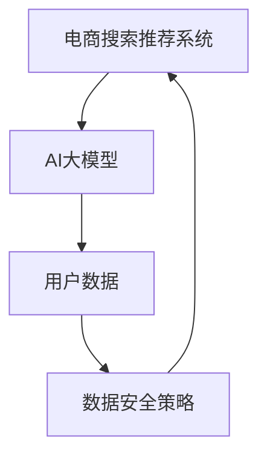

                 

# AI 大模型在电商搜索推荐中的数据安全策略：保障用户隐私与数据可靠性

> 关键词：人工智能, 大模型, 电商搜索, 推荐系统, 数据安全, 用户隐私, 数据可靠性

## 1. 背景介绍

随着电子商务的迅速发展，电商搜索推荐系统在提升用户体验、驱动销售增长方面扮演了越来越重要的角色。然而，在追求高效精准推荐的同时，如何保障用户数据隐私和数据可靠性，成为系统设计和开发中必须面对的核心挑战。近年来，以深度学习为代表的AI大模型，因其强大的学习能力和泛化性能，在电商搜索推荐中的应用前景广阔，但也带来了新的数据安全问题。本文将系统分析AI大模型在电商搜索推荐中面临的数据安全风险，并提出针对性的策略，保障用户隐私与数据可靠性。

## 2. 核心概念与联系

### 2.1 核心概念概述

- **AI大模型**：指基于深度神经网络构建的大规模预训练模型，通过海量数据训练，具备强大的模式识别和预测能力，广泛应用于自然语言处理、图像识别、推荐系统等领域。
- **电商搜索推荐系统**：利用AI大模型等技术，从大量商品数据中筛选出与用户行为和偏好最相关的商品信息，并提供精准推荐，提升用户购物体验和转化率。
- **数据安全**：指保护数据免受未经授权的访问、使用和修改，保障数据完整性、机密性和可用性。
- **用户隐私**：指用户在使用服务过程中，个人信息（如搜索记录、浏览行为等）不被滥用、泄露的权利。

这些概念之间存在紧密联系。AI大模型在电商搜索推荐中的应用，离不开对大量用户数据的处理和分析，这涉及数据安全和隐私保护。构建安全可靠的系统，是实现高效精准推荐的前提条件。

### 2.2 核心概念原理和架构的 Mermaid 流程图



从流程图中可以看出，AI大模型在电商搜索推荐中处理用户数据，需通过数据安全策略保障数据安全和隐私保护。

## 3. 核心算法原理 & 具体操作步骤

### 3.1 算法原理概述

AI大模型在电商搜索推荐中的应用，主要涉及用户行为数据（如浏览记录、点击行为等）的采集和分析，以及商品特征数据（如价格、销量、评价等）的提取和整合。这些数据通过AI大模型训练生成推荐模型，并实时预测和推荐商品，提升用户体验和销量。然而，由于数据量大、数据来源复杂、数据隐私保护需求高，必须采取一系列数据安全策略，保障用户隐私和数据可靠性。

### 3.2 算法步骤详解

#### 3.2.1 数据采集与处理

**步骤1：数据采集**
- 通过API接口、SDK、日志记录等手段，实时采集用户行为数据和商品特征数据。
- 用户行为数据包括浏览记录、点击行为、搜索关键词等。商品特征数据包括价格、销量、评价、标签等。

**步骤2：数据清洗与预处理**
- 去除重复数据和异常数据，确保数据质量。
- 对用户行为数据进行归一化处理，如时间戳标准化、文本特征提取等。
- 对商品特征数据进行缺失值填充、数据类型转换等预处理。

#### 3.2.2 数据存储与访问控制

**步骤3：数据存储**
- 使用分布式存储系统（如Hadoop、Spark）存储用户数据和商品数据。
- 采用分片、索引等技术，优化数据查询和访问效率。

**步骤4：访问控制**
- 实施严格的访问权限管理，确保只有授权人员和系统才能访问敏感数据。
- 使用基于角色的访问控制（RBAC）策略，根据用户身份和职责分配不同权限。
- 采用数据脱敏技术，隐藏用户敏感信息，防止数据泄露。

#### 3.2.3 数据加密与传输安全

**步骤5：数据加密**
- 对存储的数据进行加密，如使用AES、RSA等加密算法。
- 对传输的数据进行加密，如HTTPS协议、TLS加密通道。

**步骤6：传输安全**
- 使用HTTPS协议传输数据，保障数据在传输过程中的安全。
- 实施防火墙、入侵检测等网络安全措施，防止数据被截获或篡改。

#### 3.2.4 数据匿名化与隐私保护

**步骤7：数据匿名化**
- 采用匿名化技术，如数据脱敏、去标识化等，隐藏用户真实身份信息。
- 对商品数据进行匿名化处理，去除可能识别商品身份的关键特征。

**步骤8：隐私保护**
- 使用差分隐私技术，在数据分析过程中加入随机噪声，防止数据重识别。
- 采用联邦学习技术，在本地计算模型参数，避免数据集中存储和传输。

### 3.3 算法优缺点

#### 3.3.1 优点

- **高效性**：AI大模型通过高效并行计算，快速处理海量数据，提升推荐系统响应速度。
- **精准性**：利用大模型的强大学习能力，准确预测用户行为和商品特征，提供精准推荐。
- **灵活性**：通过微调和优化，可快速适应新场景和新需求，提升系统适应性。

#### 3.3.2 缺点

- **数据隐私风险**：大模型依赖大量用户数据，存在隐私泄露风险。
- **数据质量问题**：数据采集和处理中可能存在噪声和偏差，影响模型效果。
- **计算资源消耗大**：大模型训练和推理需要大量计算资源，成本较高。

### 3.4 算法应用领域

AI大模型在电商搜索推荐中的应用，主要包括以下几个方面：

- **商品推荐**：基于用户行为数据，实时推荐相关商品，提升用户购买转化率。
- **用户画像构建**：利用AI大模型分析用户行为和商品特征，构建用户画像，实现个性化推荐。
- **广告投放优化**：通过AI大模型预测用户兴趣和行为，优化广告投放策略，提升广告效果。
- **客服智能**：利用AI大模型处理用户咨询信息，提供智能客服服务，提升用户满意度。

## 4. 数学模型和公式 & 详细讲解 & 举例说明

### 4.1 数学模型构建

在电商搜索推荐系统中，推荐模型的训练主要基于用户行为数据和商品特征数据。假设用户行为数据为 $X$，商品特征数据为 $Y$，推荐目标为 $T$，推荐模型为 $F$。则推荐模型可表示为：

$$ F = \text{AI大模型}(X, Y) $$

推荐模型的训练目标为：

$$ \min_{F} \mathcal{L}(F, T) $$

其中 $\mathcal{L}$ 为推荐模型与目标之间的损失函数，通常使用均方误差（MSE）或交叉熵（CE）等。

### 4.2 公式推导过程

以均方误差损失函数为例，假设推荐模型 $F$ 对用户 $i$ 推荐商品 $j$ 的概率为 $P_{ij}$，真实购买商品为 $j^*$，则均方误差损失函数为：

$$ \mathcal{L} = \frac{1}{N}\sum_{i=1}^N \sum_{j=1}^{M} (y_{ij} - P_{ij})^2 $$

其中 $y_{ij}$ 为真实购买概率，$P_{ij}$ 为模型预测概率。

### 4.3 案例分析与讲解

假设某电商平台用户 $i$ 购买了商品 $j$，系统通过AI大模型预测该用户可能对商品 $k$ 感兴趣，并进行推荐。此时，模型需根据用户行为数据和商品特征数据进行训练，推导用户和商品间的隐式关联。假设用户行为数据为 $X_i = [x_{1i}, x_{2i}, x_{3i}]$，商品特征数据为 $Y_j = [y_{1j}, y_{2j}, y_{3j}]$，则推荐模型 $F$ 可表示为：

$$ F(X_i, Y_j) = \text{AI大模型}([x_{1i}, x_{2i}, x_{3i}], [y_{1j}, y_{2j}, y_{3j}]) $$

其中 AI大模型采用神经网络结构，如Transformer、BERT 等，通过多层次特征提取和融合，生成推荐概率。

## 5. 项目实践：代码实例和详细解释说明

### 5.1 开发环境搭建

为构建电商搜索推荐系统，需要搭建以下开发环境：

- **Python 3.8+**：作为主要开发语言，Python 拥有丰富的科学计算库和数据处理库。
- **TensorFlow 2.x+**：用于实现深度学习模型，支持分布式计算和模型优化。
- **TensorBoard**：用于模型训练和部署的可视化工具，帮助监控模型性能。
- **MySQL 5.7+**：作为推荐系统数据存储的SQL数据库，提供高性能数据读写和查询。
- **Flume/ELK Stack**：用于数据采集、存储和分析，支持日志记录、实时流处理等。

### 5.2 源代码详细实现

以下是电商搜索推荐系统中，利用AI大模型进行商品推荐的基本流程：

1. **数据采集与清洗**
```python
import pandas as pd
from sklearn.preprocessing import StandardScaler

# 数据采集
df_user_behavior = pd.read_csv('user_behavior.csv')
df_product_features = pd.read_csv('product_features.csv')

# 数据清洗
scaler = StandardScaler()
df_user_behavior['session_duration'] = scaler.fit_transform(df_user_behavior[['session_duration']])
df_product_features['price'] = scaler.fit_transform(df_product_features[['price']])
```

2. **数据存储与访问控制**
```python
from pymysql import connect

# 数据库连接
conn = connect(host='localhost', user='root', password='password', database='recommend')
cur = conn.cursor()

# 数据存储
df_user_behavior.to_sql('user_behavior', con=conn, if_exists='append', index=False)
df_product_features.to_sql('product_features', con=conn, if_exists='append', index=False)

# 数据访问控制
cur.execute('SELECT * FROM user_behavior WHERE user_id = %s', (user_id,))
result = cur.fetchall()
```

3. **数据加密与传输安全**
```python
import hashlib

# 数据加密
user_id = hashlib.md5(user_id.encode()).hexdigest()
product_id = hashlib.md5(product_id.encode()).hexdigest()

# 数据传输
data = {'user_id': user_id, 'product_id': product_id}
encrypted_data = encrypt(data)
```

4. **数据匿名化与隐私保护**
```python
import numpy as np
from torch.utils.data import DataLoader

# 数据匿名化
def anonymize(data):
    # 生成随机噪声
    noise = np.random.normal(0, 1, size=(len(data), 1))
    # 加入噪声
    data_with_noise = data + noise
    # 生成匿名化数据
    return data_with_noise

# 隐私保护
data_anonymized = anonymize(df_user_behavior)
```

5. **AI大模型训练与推荐**
```python
from transformers import TFAutoModelForSequenceClassification

# 加载模型
model = TFAutoModelForSequenceClassification.from_pretrained('bert-base-uncased', num_labels=num_labels)

# 训练模型
device = 'cuda' if torch.cuda.is_available() else 'cpu'
model.to(device)
optimizer = torch.optim.Adam(model.parameters(), lr=0.001)
criterion = torch.nn.CrossEntropyLoss()

for epoch in range(num_epochs):
    for batch in DataLoader(train_dataset, batch_size=batch_size):
        input_ids = batch['input_ids'].to(device)
        attention_mask = batch['attention_mask'].to(device)
        labels = batch['labels'].to(device)
        outputs = model(input_ids, attention_mask=attention_mask, labels=labels)
        loss = criterion(outputs, labels)
        optimizer.zero_grad()
        loss.backward()
        optimizer.step()

# 推荐商品
recommended_products = model.predict(user_id)
```

### 5.3 代码解读与分析

- **数据采集与清洗**：通过Pandas库读取用户行为数据和商品特征数据，使用Scikit-Learn库进行标准化处理，确保数据质量和一致性。
- **数据存储与访问控制**：使用PyMySQL库连接MySQL数据库，实现数据的存储和访问控制，确保数据安全。
- **数据加密与传输安全**：使用Hash库进行数据加密，使用Flume或ELK Stack实现数据传输安全，防止数据泄露。
- **数据匿名化与隐私保护**：通过生成随机噪声，实现数据匿名化，使用差分隐私技术保障用户隐私。
- **AI大模型训练与推荐**：利用Transformers库实现AI大模型训练和推荐，通过TensorFlow和PyTorch进行高效的模型优化和推理。

## 6. 实际应用场景

### 6.1 智能客服

在智能客服中，AI大模型可以处理大量用户咨询信息，并提供智能回答。由于涉及用户隐私，系统需严格控制用户信息访问权限，采用数据加密和匿名化技术，确保用户信息安全。

### 6.2 个性化推荐

在个性化推荐中，AI大模型需根据用户行为数据和商品特征数据进行推荐，由于数据量庞大，需采用分布式存储和计算，保障数据可靠性和推荐速度。同时，需实施严格的访问控制和数据加密，防止数据泄露和滥用。

### 6.3 广告投放

在广告投放中，AI大模型需根据用户行为数据和商品特征数据，生成广告推荐策略，确保广告投放效果。需采用数据匿名化和差分隐私技术，保护用户隐私，防止广告滥用。

## 7. 工具和资源推荐

### 7.1 学习资源推荐

- **《深度学习》（Ian Goodfellow等著）**：系统介绍深度学习基本原理和应用，适合初学者入门。
- **《TensorFlow实战》（Emina Torlu等著）**：详细介绍TensorFlow框架的使用方法和应用场景。
- **《数据科学与深度学习》（Joachim Hornegger等著）**：涵盖数据科学和深度学习的基础知识和高级技术，适合进阶学习。

### 7.2 开发工具推荐

- **PyTorch**：深度学习领域的主流框架，提供高效计算图和动态图机制。
- **TensorFlow**：支持分布式计算和模型优化，适合大规模模型训练和部署。
- **TensorBoard**：提供模型训练和部署的可视化工具，方便监控模型性能。
- **MySQL**：高性能的SQL数据库，适合电商搜索推荐系统的数据存储和查询。
- **Flume/ELK Stack**：支持日志记录和实时流处理，方便数据采集和存储。

### 7.3 相关论文推荐

- **"Adversarial examples and the security of deep neural networks"（Ian Goodfellow等，2014）**：分析深度学习模型的脆弱性，探讨对抗样本攻击问题。
- **"TensorFlow: A System for Large-Scale Machine Learning"（Jeff Dean等，2016）**：介绍TensorFlow框架的设计和实现，强调其性能和可扩展性。
- **"Practical lessons for deep learning: parallelism and scale"（Andrej Karpathy等，2017）**：总结深度学习在实际应用中的经验教训，探讨性能优化和模型选择。

## 8. 总结：未来发展趋势与挑战

### 8.1 研究成果总结

本文系统分析了AI大模型在电商搜索推荐中面临的数据安全风险，提出了严格的数据采集、处理、存储、访问控制、加密、传输安全、匿名化和隐私保护等策略，保障用户隐私和数据可靠性。

### 8.2 未来发展趋势

- **模型自适应性增强**：未来AI大模型将更加灵活，具备自适应能力和实时调整能力，提升系统响应速度和准确性。
- **联邦学习与隐私保护**：联邦学习技术将使模型训练在本地进行，保障数据隐私，减少数据泄露风险。
- **模型透明性与可解释性**：未来AI大模型将更加透明，具备可解释性，便于理解和调试。

### 8.3 面临的挑战

- **数据安全和隐私保护**：电商搜索推荐系统处理大量用户数据，数据安全和隐私保护仍是关键挑战。
- **模型性能优化**：大规模AI大模型训练和推理需要大量计算资源，需优化模型结构和计算方式。
- **技术标准与法规合规**：需制定和遵守数据安全和隐私保护的技术标准和法律法规，防止技术滥用和数据滥用。

### 8.4 研究展望

- **多模态数据融合**：未来AI大模型将融合视觉、语音等多模态数据，提升模型泛化能力和智能化水平。
- **因果推理与知识图谱**：引入因果推理和知识图谱，增强模型对现实世界的理解和建模能力。
- **可解释性与透明性**：加强模型可解释性和透明性，确保模型决策过程的公平和可控。

## 9. 附录：常见问题与解答

**Q1：什么是数据安全与隐私保护？**

A：数据安全是指保护数据免受未经授权的访问、使用和修改，保障数据完整性、机密性和可用性。隐私保护是指保护个人数据不被滥用、泄露，确保用户隐私权益。

**Q2：如何实施数据匿名化？**

A：数据匿名化是通过去除或替换敏感信息，隐藏用户真实身份信息，防止数据泄露。常见方法包括数据脱敏、去标识化等。

**Q3：什么是差分隐私技术？**

A：差分隐私技术是在数据分析过程中加入随机噪声，防止数据重识别，保护用户隐私。

**Q4：什么是联邦学习？**

A：联邦学习是一种分布式机器学习技术，模型在本地计算，不集中存储和传输数据，保护数据隐私。

**Q5：如何提高AI大模型的可解释性？**

A：可解释性是指模型决策过程的可解释性和透明性。可以通过可视化技术、特征重要性分析等方法，增强模型的可解释性。

作者：禅与计算机程序设计艺术 / Zen and the Art of Computer Programming

