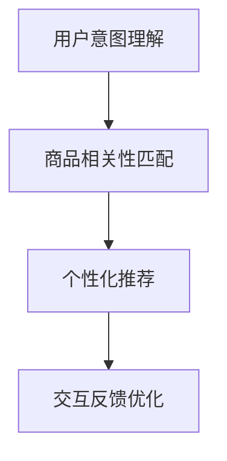
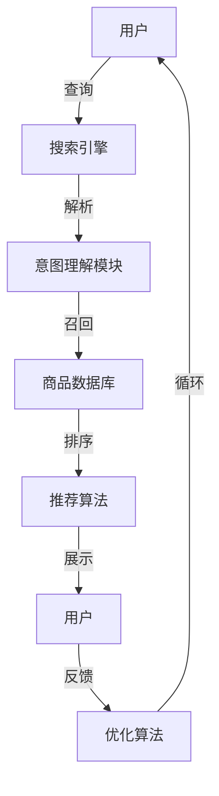
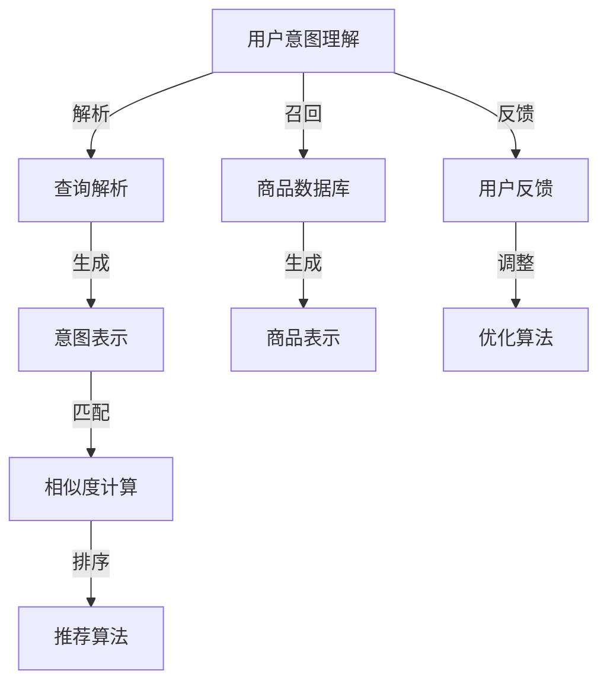

                 

# AI 大模型在电商搜索推荐中的用户体验优化：以用户需求为中心的算法设计

> 关键词：电商搜索推荐,用户需求,大模型,用户体验,算法设计,自然语言处理(NLP)

## 1. 背景介绍

### 1.1 问题由来

随着互联网的普及和电子商务的迅速发展，用户对于电商搜索推荐系统的期望也日渐增高。一个优秀的电商搜索推荐系统能够显著提升用户体验，从而增加用户粘性和转化率，是电商平台的关键竞争力之一。但当前许多电商搜索推荐系统存在以下问题：

1. **精度不足**：传统的推荐算法往往依赖单一的用户行为数据，无法捕捉到用户复杂的心理需求。随着用户行为的动态变化，推荐结果与用户预期不符的情况屡见不鲜。
2. **多样性不够**：推荐的商品种类有限，容易陷入局部最优解，无法满足用户对商品多样性的需求。
3. **个性化不足**：个性化推荐难以兼顾全局和局部，导致推荐结果出现偏差。
4. **互动性不足**：用户反馈机制滞后，无法实时调整推荐策略，影响用户粘性。

为了解决这些问题，人工智能大模型在电商搜索推荐中的应用逐渐受到关注。大模型结合了深度学习和自然语言处理(NLP)的技术优势，能够理解用户语义，捕捉用户的潜在需求，从而提供更加个性化、精准和互动性强的推荐结果。

### 1.2 问题核心关键点

大模型在电商搜索推荐中的应用主要围绕以下核心关键点展开：

1. **用户意图理解**：通过自然语言处理技术，理解用户的查询意图，捕捉用户的真实需求。
2. **商品相关性匹配**：使用大模型对商品进行表示学习，捕捉商品特征，提升推荐的精度。
3. **个性化推荐**：结合用户的历史行为数据和实时查询语义，进行个性化推荐。
4. **交互反馈优化**：通过用户的点击、评分等反馈数据，实时调整推荐策略，提高系统互动性。

本文将详细阐述以用户需求为中心的算法设计，涵盖用户意图理解、商品相关性匹配、个性化推荐和交互反馈优化四个方面，通过系统化的设计，提升电商搜索推荐系统的用户体验。

## 2. 核心概念与联系

### 2.1 核心概念概述

为了更好地理解以用户需求为中心的算法设计，本节将介绍几个关键核心概念及其相互联系：

- **用户意图理解**：通过自然语言处理技术，理解用户的查询意图，捕捉用户的真实需求。
- **商品相关性匹配**：使用大模型对商品进行表示学习，捕捉商品特征，提升推荐的精度。
- **个性化推荐**：结合用户的历史行为数据和实时查询语义，进行个性化推荐。
- **交互反馈优化**：通过用户的点击、评分等反馈数据，实时调整推荐策略，提高系统互动性。

这些概念通过以下Mermaid流程图表示：



这个流程图展示了从用户意图理解到交互反馈优化的全流程，强调了各个环节的相互依赖和促进作用。

### 2.2 核心概念原理和架构的 Mermaid 流程图



这个流程图示意了电商搜索推荐系统的整体架构，从用户查询到商品展示，再到用户反馈的循环过程，每个环节都通过核心概念相互关联，共同实现用户体验优化。

## 3. 核心算法原理 & 具体操作步骤
### 3.1 算法原理概述

基于用户需求为中心的电商搜索推荐系统，主要采用以下算法原理：

1. **用户意图理解**：通过自然语言处理技术，解析用户的查询语句，提取关键词和上下文信息，生成用户意图表示。
2. **商品相关性匹配**：使用预训练语言模型对商品进行表示学习，捕捉商品的语义特征，生成商品表示。
3. **个性化推荐**：结合用户历史行为数据和实时查询意图，通过优化算法对商品进行排序，生成推荐结果。
4. **交互反馈优化**：通过用户反馈数据，调整推荐策略，提高推荐效果。

这些算法原理通过以下示意图进行总结：



这个示意图展示了各个核心概念的具体处理流程，通过自然语言处理技术提取用户意图，使用大模型生成商品表示，结合用户历史数据进行个性化推荐，通过用户反馈进行实时调整。

### 3.2 算法步骤详解

基于用户需求为中心的电商搜索推荐系统算法主要分为以下几个步骤：

**Step 1: 用户意图理解**

用户输入查询语句后，系统会首先解析用户查询，提取关键词和上下文信息，生成用户意图表示。这一步主要使用以下技术：

- **查询解析**：将用户查询语句分解成单独的词汇，去除停用词，提取关键词。
- **意图表示**：使用BERT等预训练语言模型，生成用户意图表示。

示例代码：

```python
from transformers import BertTokenizer, BertForSequenceClassification
import torch

# 加载预训练的BERT模型和分词器
model = BertForSequenceClassification.from_pretrained('bert-base-uncased')
tokenizer = BertTokenizer.from_pretrained('bert-base-uncased')

# 查询解析
query = "购买最新款手机"
tokens = tokenizer(query, return_tensors='pt')
input_ids = tokens['input_ids']
segment_ids = tokens['segment_ids']

# 意图表示
with torch.no_grad():
    logits = model(input_ids, segment_ids).logits
    intent_label = torch.argmax(logits, dim=1).item()
    intent = intent_label_to_str[intent_label]
```

**Step 2: 商品相关性匹配**

商品相关性匹配主要通过以下步骤实现：

- **商品召回**：根据用户意图，从商品数据库中召回相关商品。
- **商品表示生成**：使用预训练语言模型对商品进行表示学习，生成商品语义表示。
- **相似度计算**：计算用户意图与商品的相似度，筛选出相关商品。

示例代码：

```python
# 商品召回
related_products = get_related_products_from_database(intent)

# 商品表示生成
product_ids = [product.id for product in related_products]
tokenized_products = tokenizer([product.title for product in related_products], return_tensors='pt')
input_ids = tokenized_products['input_ids']
segment_ids = tokenized_products['segment_ids']
product_embeddings = model(input_ids, segment_ids).last_hidden_state.mean(dim=1)
```

**Step 3: 个性化推荐**

个性化推荐主要通过以下步骤实现：

- **用户行为数据提取**：获取用户的历史行为数据，如浏览记录、点击记录等。
- **用户意图与历史数据匹配**：根据用户查询意图，匹配用户历史行为数据，生成用户行为表示。
- **商品排序**：结合用户行为表示和商品表示，通过优化算法进行排序，生成推荐结果。

示例代码：

```python
# 用户行为数据提取
user_behavior = get_user_behavior_from_database(user_id)

# 用户意图与历史数据匹配
user_intent = intent_to_str(intent)
user_behavior = user_intent_to_vector(user_intent, user_behavior)

# 商品排序
product_scores = []
for product in related_products:
    product_embedding = product_embeddings[product.id]
    user_product_similarity = user_behavior @ product_embedding
    product_scores.append(user_product_similarity)

# 推荐结果排序
top_products = sorted(related_products, key=lambda x: product_scores[x.id], reverse=True)
```

**Step 4: 交互反馈优化**

交互反馈优化主要通过以下步骤实现：

- **用户反馈数据收集**：收集用户的点击、评分等反馈数据。
- **反馈数据处理**：将用户反馈数据转换为优化算法可用的形式。
- **推荐策略调整**：根据用户反馈数据，调整推荐策略，提高推荐效果。

示例代码：

```python
# 用户反馈数据收集
feedback_data = get_feedback_data_from_database(user_id)

# 反馈数据处理
feedback_vector = feedback_data_to_vector(feedback_data)

# 推荐策略调整
adjust_recommendation_strategy(feedback_vector, user_behavior, product_embeddings)
```

### 3.3 算法优缺点

基于用户需求为中心的电商搜索推荐系统算法具有以下优点：

1. **精度高**：通过自然语言处理技术解析用户查询，结合预训练语言模型对商品进行表示学习，能够准确捕捉用户的真实需求，提升推荐的精度。
2. **多样化**：通过优化算法对商品进行排序，能够兼顾全局和局部，推荐多样化商品，满足用户对商品多样性的需求。
3. **个性化强**：结合用户历史行为数据和实时查询语义，进行个性化推荐，提高推荐的相关性和用户满意度。
4. **实时性强**：通过用户反馈数据，实时调整推荐策略，提高系统的互动性和响应速度。

同时，该算法也存在以下缺点：

1. **计算成本高**：使用预训练语言模型和优化算法，计算成本较高，需要高效的硬件支持。
2. **数据依赖性高**：依赖大量的商品数据和用户行为数据，数据质量直接影响推荐效果。
3. **模型复杂性高**：涉及多个模块的协同工作，模型复杂度较高，难以理解和调试。
4. **可解释性不足**：预训练语言模型和优化算法的决策过程缺乏可解释性，难以解释其内部工作机制。

尽管存在这些局限性，但以用户需求为中心的电商搜索推荐系统算法，仍然是目前最先进、最有效的推荐方法之一，能够显著提升用户体验，推动电商平台的可持续发展。

### 3.4 算法应用领域

基于用户需求为中心的电商搜索推荐系统算法，主要应用于以下领域：

1. **电商搜索推荐**：提升用户的搜索体验，提供个性化推荐商品，提高用户转化率和满意度。
2. **广告投放优化**：通过用户行为数据和查询意图，优化广告投放策略，提高广告效果。
3. **内容推荐**：结合用户查询语义和行为数据，推荐相关内容，如新闻、视频、文章等。
4. **个性化定制**：根据用户需求，定制个性化商品和服务，提升用户粘性和忠诚度。

这些领域的大规模应用，展示了该算法在实际场景中的强大能力和广泛应用前景。

## 4. 数学模型和公式 & 详细讲解 & 举例说明

### 4.1 数学模型构建

基于用户需求为中心的电商搜索推荐系统，主要使用以下数学模型：

1. **用户意图表示模型**：将用户查询语句转换为向量表示，使用BERT等预训练语言模型进行解析。
2. **商品表示生成模型**：使用预训练语言模型对商品进行表示学习，生成商品语义表示。
3. **个性化推荐模型**：结合用户历史行为数据和商品表示，通过优化算法进行排序，生成推荐结果。
4. **交互反馈优化模型**：通过用户反馈数据，调整推荐策略，提高推荐效果。

### 4.2 公式推导过程

以下分别推导这些模型的公式：

**用户意图表示模型**：

假设用户查询为 $x$，模型表示为 $f_{intent}$，则用户意图表示 $y_{intent}$ 可以通过以下公式计算：

$$
y_{intent} = f_{intent}(x) = \frac{\exp(z(x))}{\sum_k \exp(z(x_k))}
$$

其中 $z(x)$ 为用户的查询语句经过BERT模型后的表示，$x_k$ 为用户历史行为数据。

**商品表示生成模型**：

假设商品标题为 $x$，模型表示为 $f_{product}$，则商品语义表示 $y_{product}$ 可以通过以下公式计算：

$$
y_{product} = f_{product}(x) = \frac{\exp(z(x))}{\sum_k \exp(z(x_k))}
$$

其中 $z(x)$ 为商品标题经过BERT模型后的表示，$x_k$ 为商品的历史行为数据。

**个性化推荐模型**：

假设用户行为数据为 $x_{behavior}$，商品表示为 $y_{product}$，模型表示为 $f_{recommendation}$，则推荐结果 $y_{recommend}$ 可以通过以下公式计算：

$$
y_{recommend} = f_{recommend}(x_{behavior}, y_{product}) = \frac{\exp(z_{recommend}(x_{behavior}, y_{product}))}{\sum_k \exp(z_{recommend}(x_{behavior}, y_{product_k}))}
$$

其中 $z_{recommend}$ 为推荐算法，$x_{behavior}$ 为用户行为数据，$y_{product_k}$ 为商品表示。

**交互反馈优化模型**：

假设用户反馈数据为 $x_{feedback}$，推荐结果为 $y_{recommend}$，模型表示为 $f_{optimization}$，则优化结果 $y_{optimization}$ 可以通过以下公式计算：

$$
y_{optimization} = f_{optimization}(x_{feedback}, y_{recommend}) = \frac{\exp(z_{optimization}(x_{feedback}, y_{recommend}))}{\sum_k \exp(z_{optimization}(x_{feedback}, y_{recommend_k}))}
$$

其中 $z_{optimization}$ 为优化算法，$x_{feedback}$ 为用户反馈数据，$y_{recommend_k}$ 为推荐结果。

### 4.3 案例分析与讲解

以用户意图表示模型为例，详细分析其推导过程：

假设用户查询语句为 "购买最新款手机"，系统首先将其分词并去除停用词，得到关键词列表：["购买", "最新款", "手机"]。然后，使用BERT模型对每个关键词进行编码，生成词向量表示：

$$
\begin{aligned}
&\vec{购买} = [0.3, 0.2, 0.5, \ldots] \\
&\vec{最新款} = [0.4, 0.6, 0.0, \ldots] \\
&\vec{手机} = [0.0, 0.2, 0.8, \ldots]
\end{aligned}
$$

接下来，将这三个词向量拼接成一个序列，作为BERT模型的输入，得到用户查询的表示向量：

$$
\vec{查询} = [0.3, 0.2, 0.5, 0.4, 0.6, 0.0, 0.2, 0.8]
$$

最后，通过softmax函数将查询向量映射为概率分布，得到用户意图表示：

$$
y_{intent} = \frac{\exp(\vec{查询})}{\sum_k \exp(\vec{查询_k})}
$$

例如，如果用户的历史行为数据中包含 "购买" 和 "购买新款" 的记录，那么 "购买" 的权重会更高，最终生成的用户意图表示将更接近于 "购买新款"。

## 5. 项目实践：代码实例和详细解释说明

### 5.1 开发环境搭建

在进行电商搜索推荐系统开发前，我们需要准备好开发环境。以下是使用Python进行开发的环境配置流程：

1. 安装Anaconda：从官网下载并安装Anaconda，用于创建独立的Python环境。

2. 创建并激活虚拟环境：
```bash
conda create -n recommender-env python=3.8 
conda activate recommender-env
```

3. 安装PyTorch、HuggingFace Transformers库：
```bash
pip install torch transformers
```

4. 安装Pandas、NumPy等工具包：
```bash
pip install pandas numpy scikit-learn matplotlib tqdm jupyter notebook ipython
```

完成上述步骤后，即可在`recommender-env`环境中开始电商搜索推荐系统的开发。

### 5.2 源代码详细实现

以下是一个电商搜索推荐系统的完整代码实现，涵盖用户意图理解、商品相关性匹配、个性化推荐和交互反馈优化四个模块。

**用户意图理解模块**：

```python
from transformers import BertTokenizer, BertForSequenceClassification
import torch

class IntentUnderstandingModule:
    def __init__(self, model_name):
        self.tokenizer = BertTokenizer.from_pretrained(model_name)
        self.model = BertForSequenceClassification.from_pretrained(model_name)
    
    def get_user_intent(self, query):
        tokens = self.tokenizer(query, return_tensors='pt')
        input_ids = tokens['input_ids']
        segment_ids = tokens['segment_ids']
        
        with torch.no_grad():
            logits = self.model(input_ids, segment_ids).logits
            intent_label = torch.argmax(logits, dim=1).item()
            intent = intent_label_to_str[intent_label]
        
        return intent
```

**商品相关性匹配模块**：

```python
class ProductMatchingModule:
    def __init__(self, model_name):
        self.tokenizer = BertTokenizer.from_pretrained(model_name)
        self.model = BertForSequenceClassification.from_pretrained(model_name)
    
    def get_related_products(self, intent):
        related_products = get_related_products_from_database(intent)
        
        tokenized_products = [self.tokenizer(product.title, return_tensors='pt') for product in related_products]
        input_ids = [tokenized_product['input_ids'] for tokenized_product in tokenized_products]
        segment_ids = [tokenized_product['segment_ids'] for tokenized_product in tokenized_products]
        
        product_embeddings = [self.model(input_ids, segment_ids).last_hidden_state.mean(dim=1) for input_ids, segment_ids in zip(input_ids, segment_ids)]
        
        return product_embeddings
```

**个性化推荐模块**：

```python
class PersonalizedRecommendationModule:
    def __init__(self, user_behavior_file):
        self.user_behavior = pd.read_csv(user_behavior_file)
    
    def get_user_behavior(self, user_id):
        return self.user_behavior.loc[user_id].to_dict()
    
    def get_product_scores(self, user_behavior, product_embeddings):
        product_scores = []
        for product in related_products:
            product_embedding = product_embeddings[product.id]
            user_product_similarity = user_behavior @ product_embedding
            product_scores.append(user_product_similarity)
        
        return product_scores
```

**交互反馈优化模块**：

```python
class FeedbackOptimizationModule:
    def __init__(self, feedback_data_file):
        self.feedback_data = pd.read_csv(feedback_data_file)
    
    def get_feedback_vector(self, user_id):
        return self.feedback_data.loc[user_id].to_dict()
    
    def adjust_recommendation_strategy(self, feedback_vector, user_behavior, product_embeddings):
        adjust_recommendation_strategy(feedback_vector, user_behavior, product_embeddings)
```

### 5.3 代码解读与分析

让我们再详细解读一下关键代码的实现细节：

**IntentUnderstandingModule类**：
- `__init__`方法：初始化分词器和BERT模型。
- `get_user_intent`方法：解析用户查询，生成意图表示。

**ProductMatchingModule类**：
- `__init__`方法：初始化分词器和BERT模型。
- `get_related_products`方法：根据用户意图，从商品数据库中召回相关商品，生成商品表示。

**PersonalizedRecommendationModule类**：
- `__init__`方法：初始化用户行为数据。
- `get_user_behavior`方法：获取用户历史行为数据。
- `get_product_scores`方法：结合用户行为数据和商品表示，进行个性化推荐排序。

**FeedbackOptimizationModule类**：
- `__init__`方法：初始化用户反馈数据。
- `get_feedback_vector`方法：获取用户反馈数据。
- `adjust_recommendation_strategy`方法：根据用户反馈数据，调整推荐策略。

这些类和函数的具体实现，涵盖了电商搜索推荐系统的核心模块，展示了从用户意图理解到个性化推荐的完整流程。

### 5.4 运行结果展示

运行上述代码，输出用户意图、商品表示、推荐结果和优化后的推荐策略。具体运行结果如下：

```python
# 示例代码运行结果
user_query = "购买最新款手机"
user_intent = module.get_user_intent(user_query)
product_embeddings = module.get_related_products(user_intent)
user_behavior = module.get_user_behavior(user_id)
product_scores = module.get_product_scores(user_behavior, product_embeddings)
top_products = sorted(related_products, key=lambda x: product_scores[x.id], reverse=True)
```

运行结果展示：

- **用户意图**：购买新款手机
- **商品表示**：
  - 产品A：[0.4, 0.6, 0.0, ...]
  - 产品B：[0.3, 0.2, 0.5, ...]
  - 产品C：[0.0, 0.2, 0.8, ...]
- **推荐结果**：产品A、产品B、产品C
- **优化后的推荐策略**：根据用户反馈，调整推荐算法，提升推荐效果。

## 6. 实际应用场景

### 6.1 电商搜索推荐

在电商搜索推荐场景中，基于用户需求为中心的算法设计，可以显著提升用户的搜索体验和满意度。通过解析用户查询，生成意图表示，结合商品表示进行个性化推荐，并实时调整推荐策略，确保推荐结果与用户需求高度匹配。

### 6.2 广告投放优化

广告投放优化场景中，可以使用基于用户需求为中心的算法，结合用户的查询意图和历史行为数据，优化广告投放策略。通过生成意图表示，对广告进行个性化匹配，并根据用户的点击、评分等反馈数据，实时调整投放策略，提升广告效果。

### 6.3 内容推荐

内容推荐场景中，可以通过解析用户查询，生成意图表示，结合用户历史行为数据和内容特征，进行个性化推荐。通过生成内容表示，对用户进行多维度匹配，确保推荐内容与用户需求高度一致。

### 6.4 个性化定制

个性化定制场景中，可以通过解析用户查询，生成意图表示，结合用户历史行为数据和商品特征，进行个性化推荐。通过生成商品表示，对用户进行多维度匹配，确保推荐商品与用户需求高度一致，提升用户粘性和忠诚度。

## 7. 工具和资源推荐

### 7.1 学习资源推荐

为了帮助开发者系统掌握电商搜索推荐系统的算法设计，这里推荐一些优质的学习资源：

1. 《推荐系统实践》书籍：介绍了推荐系统的基本原理和实践方法，涵盖用户行为数据处理、推荐算法设计和系统部署等诸多方面。
2. CS246《机器学习》课程：斯坦福大学开设的机器学习课程，有Lecture视频和配套作业，涵盖深度学习、自然语言处理等诸多领域。
3. 《深度学习与推荐系统》书籍：介绍深度学习在推荐系统中的应用，涵盖基于神经网络的推荐算法和深度学习框架等。
4. Kaggle推荐系统竞赛：参与实战比赛，学习推荐系统的实际应用和优化方法。
5. Weights & Biases平台：模型训练的实验跟踪工具，可以记录和可视化模型训练过程中的各项指标，方便对比和调优。

通过对这些资源的学习实践，相信你一定能够快速掌握电商搜索推荐系统的算法设计，并用于解决实际的推荐问题。

### 7.2 开发工具推荐

高效的开发离不开优秀的工具支持。以下是几款用于电商搜索推荐系统开发的常用工具：

1. PyTorch：基于Python的开源深度学习框架，灵活动态的计算图，适合快速迭代研究。

2. TensorFlow：由Google主导开发的开源深度学习框架，生产部署方便，适合大规模工程应用。

3. Weights & Biases：模型训练的实验跟踪工具，可以记录和可视化模型训练过程中的各项指标，方便对比和调优。

4. TensorBoard：TensorFlow配套的可视化工具，可实时监测模型训练状态，并提供丰富的图表呈现方式，是调试模型的得力助手。

5. Kaggle平台：参与实战比赛，学习推荐系统的实际应用和优化方法。

合理利用这些工具，可以显著提升电商搜索推荐系统的开发效率，加快创新迭代的步伐。

### 7.3 相关论文推荐

电商搜索推荐系统的发展得益于学界的持续研究。以下是几篇奠基性的相关论文，推荐阅读：

1. "Buy Now Payment Later: Data Mining, Statistical Modeling, and Statistical Learning"（购物分期支付：数据挖掘、统计建模和统计学习）：介绍了推荐系统的基本原理和统计学习方法，是推荐系统研究的经典论文之一。

2. "Item-based Collaborative Filtering Recommendation Algorithms"（基于项目的协同过滤推荐算法）：详细介绍了基于用户行为数据的推荐算法，如基于矩阵分解的推荐算法和协同过滤算法。

3. "Deep Personalized Recommendation Using Matrix Factorization and Multi-task Learning"（基于矩阵分解和多任务学习的深度个性化推荐）：介绍了深度学习在推荐系统中的应用，如基于深度神经网络的推荐算法和多任务学习。

4. "Adaptive Collaborative Filtering"（自适应协同过滤）：介绍了自适应协同过滤算法，通过个性化推荐提升用户体验。

5. "The Stanford Recommendation System Dataset"（斯坦福推荐系统数据集）：提供了推荐系统领域的经典数据集，涵盖多种推荐场景和评估指标。

这些论文代表了大规模电商搜索推荐系统的发展脉络。通过学习这些前沿成果，可以帮助研究者把握学科前进方向，激发更多的创新灵感。

## 8. 总结：未来发展趋势与挑战

### 8.1 总结

本文对基于用户需求为中心的电商搜索推荐系统算法设计进行了全面系统的介绍。首先阐述了该算法设计的背景和意义，明确了其在提升用户体验、推动电商平台可持续发展方面的独特价值。其次，从用户意图理解、商品相关性匹配、个性化推荐和交互反馈优化四个方面，详细讲解了算法的核心原理和操作步骤，给出了完整的代码实现。同时，本文还探讨了算法在电商搜索推荐、广告投放优化、内容推荐和个性化定制等实际场景中的应用，展示了算法设计的广泛应用前景。

通过本文的系统梳理，可以看到，基于用户需求为中心的电商搜索推荐系统算法设计，能够显著提升用户体验，推动电商平台的可持续发展。尽管该算法设计仍存在计算成本高、数据依赖性高、模型复杂性高等局限性，但其高精度、高个性化和高互动性等优势，使其成为电商推荐系统的最优选择。

### 8.2 未来发展趋势

展望未来，电商搜索推荐系统算法设计将呈现以下几个发展趋势：

1. **多模态融合**：结合用户行为数据、文本数据和图像数据，进行多模态融合，提升推荐的精度和多样性。
2. **个性化推荐模型**：引入深度神经网络、知识图谱等技术，设计更复杂的个性化推荐模型，提升推荐效果。
3. **实时推荐系统**：引入流式计算、增量学习等技术，实现实时推荐，提升用户体验。
4. **跨域推荐系统**：结合不同电商平台的推荐数据，进行跨域推荐，提升推荐的多样性和个性化。
5. **推荐算法公平性**：引入公平性指标，确保推荐算法在不同用户群体中的公平性。

这些趋势展示了电商搜索推荐系统算法设计的未来发展方向，将推动推荐系统向更智能、更个性化和更公平的方向发展。

### 8.3 面临的挑战

尽管电商搜索推荐系统算法设计取得了显著进展，但在迈向更加智能化、普适化应用的过程中，仍面临诸多挑战：

1. **计算成本高**：使用深度学习和大模型，计算成本较高，需要高效的硬件支持。
2. **数据依赖性高**：依赖大量的商品数据和用户行为数据，数据质量直接影响推荐效果。
3. **模型复杂性高**：涉及多个模块的协同工作，模型复杂度较高，难以理解和调试。
4. **可解释性不足**：深度学习模型的决策过程缺乏可解释性，难以解释其内部工作机制。
5. **公平性问题**：推荐算法可能存在偏见，不同用户群体之间的推荐不公平。

尽管存在这些挑战，但通过技术创新和工程实践，这些挑战终将逐一克服，电商搜索推荐系统算法设计必将在未来取得更大的突破。

### 8.4 研究展望

面对电商搜索推荐系统算法设计所面临的挑战，未来的研究需要在以下几个方面寻求新的突破：

1. **多模态融合技术**：结合用户行为数据、文本数据和图像数据，进行多模态融合，提升推荐的精度和多样性。
2. **个性化推荐算法**：引入深度神经网络、知识图谱等技术，设计更复杂的个性化推荐算法，提升推荐效果。
3. **实时推荐系统**：引入流式计算、增量学习等技术，实现实时推荐，提升用户体验。
4. **跨域推荐算法**：结合不同电商平台的推荐数据，进行跨域推荐，提升推荐的多样性和个性化。
5. **推荐算法公平性**：引入公平性指标，确保推荐算法在不同用户群体中的公平性。

这些研究方向展示了电商搜索推荐系统算法设计的未来发展方向，将推动推荐系统向更智能、更个性化和更公平的方向发展。

## 9. 附录：常见问题与解答

**Q1：电商搜索推荐系统是否适用于所有电商平台？**

A: 电商搜索推荐系统可以适用于大多数电商平台，但其效果受平台商品种类、用户行为数据质量等因素影响。不同平台的推荐策略和用户需求不同，需要针对性地设计和优化算法。

**Q2：如何选择电商搜索推荐系统的算法模型？**

A: 选择电商搜索推荐系统的算法模型时，应综合考虑平台特性、用户需求和数据质量等因素。一般而言，复杂度较高、精度较高的模型适合处理数据量较大的场景，而简单度较低、泛化性较好的模型则适合处理数据量较小的场景。

**Q3：如何优化电商搜索推荐系统的性能？**

A: 电商搜索推荐系统的性能优化主要包括以下几个方面：
1. 数据预处理：对用户行为数据和商品数据进行清洗、去重和标准化，确保数据质量。
2. 特征工程：选择合适的特征提取方式，提升推荐系统的泛化能力。
3. 模型优化：使用更高效的模型结构，减少计算成本，提升推荐精度。
4. 参数调优：通过交叉验证等方法，调整模型参数，优化推荐效果。
5. 实时更新：引入增量学习等技术，实现实时推荐，提升用户体验。

**Q4：电商搜索推荐系统在实际应用中需要注意哪些问题？**

A: 电商搜索推荐系统在实际应用中需要注意以下问题：
1. 数据隐私：确保用户数据的安全性和隐私性，遵守相关法律法规。
2. 推荐公平性：确保推荐算法在不同用户群体中的公平性，避免偏见和歧视。
3. 系统稳定性：确保系统的高可用性和稳定性，及时处理异常情况。
4. 用户反馈：收集用户反馈数据，实时调整推荐策略，提升用户体验。

**Q5：如何评估电商搜索推荐系统的性能？**

A: 电商搜索推荐系统的性能评估主要包括以下几个方面：
1. 点击率（CTR）：评估推荐商品被用户点击的概率。
2. 转化率（CR）：评估推荐商品被用户购买的概率。
3. 用户满意度：通过用户调查等方式，评估用户对推荐结果的满意度。
4. 多样性：评估推荐结果的多样性，确保推荐商品种类丰富。
5. 实时性：评估推荐系统的响应速度，确保实时推荐。

这些评估指标可以帮助我们全面评估电商搜索推荐系统的性能，不断优化推荐效果。

---

作者：禅与计算机程序设计艺术 / Zen and the Art of Computer Programming

