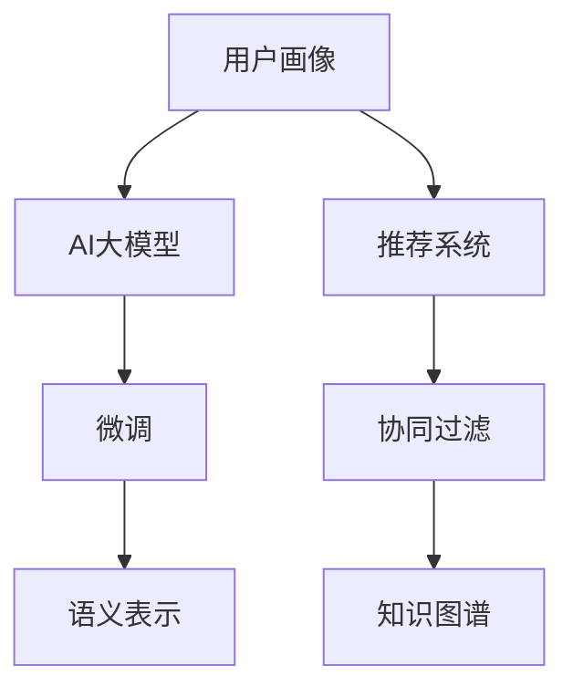

                 

# AI 大模型在电商搜索推荐中的用户画像应用：深度挖掘用户需求与行为偏好

## 1. 背景介绍

### 1.1 电商搜索推荐的需求和挑战

电商搜索推荐系统是电商平台的基石，通过高效地匹配用户需求与商品信息，提升用户体验，促进交易转化。在算法层面，电商搜索推荐系统包括两个核心模块：搜索和推荐。

- **搜索模块**：负责理解用户的查询意图，从商品数据库中匹配出最相关的搜索结果。
- **推荐模块**：通过分析用户的浏览、点击、购买等行为数据，预测用户的潜在购买意愿，推荐个性化商品。

电商搜索推荐系统面临以下挑战：

- **数据稀疏**：用户搜索行为稀疏，难以从少量搜索行为数据中推断出用户的全面需求。
- **实时性要求高**：搜索结果和推荐商品需实时更新，需算法实时响应用户查询和行为变化。
- **个性化需求高**：不同用户有高度差异化的需求，需要模型能够捕捉和理解每个用户的独特特征。

### 1.2 用户画像的价值

用户画像(User Profile)是电商平台对用户行为、偏好、需求等特征的综合描述。通过构建用户画像，可以深入理解用户需求，提升搜索推荐系统的精准性和个性化程度。具体价值包括：

- **精准匹配**：结合用户画像与商品信息，精准匹配用户需求与商品，提升点击率和转化率。
- **个性推荐**：基于用户画像分析用户的长期行为模式，推荐符合用户喜好的商品，提升用户粘性。
- **风险控制**：通过用户画像评估用户风险，防止欺诈行为，提高电商平台的信任度。

## 2. 核心概念与联系

### 2.1 核心概念概述

为更好地理解AI大模型在电商搜索推荐中的用户画像应用，本节将介绍几个密切相关的核心概念：

- **用户画像(User Profile)**：电商用户的行为、偏好、需求等信息组成的综合描述。
- **AI大模型(AI Large Model)**：基于深度学习技术的强大语言模型，能够从海量文本数据中学习到丰富的知识。
- **微调(Fine-Tuning)**：基于监督学习的大模型微调方法，通过少量标注数据，对模型进行优化。
- **语义表示(Semantic Representation)**：将文本转化为机器可以理解的语义向量，方便模型进行匹配和推荐。
- **推荐系统(Recommender System)**：通过分析用户行为，预测并推荐用户可能感兴趣的物品的系统。
- **知识图谱(Knowledge Graph)**：结构化的语义数据，用于辅助用户画像的构建和推荐系统的优化。
- **协同过滤(Collaborative Filtering)**：通过用户和物品的历史互动行为进行推荐。

这些核心概念之间的逻辑关系可以通过以下Mermaid流程图来展示：



这个流程图展示了大模型在电商搜索推荐中的应用流程：

1. 电商平台通过AI大模型构建用户画像。
2. 利用微调方法，将大模型转化为适合作业需求的语言模型。
3. 将用户画像转化为语义表示，方便模型匹配和推荐。
4. 通过协同过滤和知识图谱辅助，提升推荐系统的准确性。

## 3. 核心算法原理 & 具体操作步骤
### 3.1 算法原理概述

AI大模型在电商搜索推荐中的用户画像应用，本质上是基于监督学习的微调方法。其核心思想是：通过构建用户画像，将用户需求和偏好转化为机器可理解的语言表示，通过微调方法优化语言模型，使得模型能够更好地匹配用户需求和商品信息。

形式化地，假设用户画像为 $P$，商品为 $G$，推荐模型为 $M$，则推荐目标可表示为：

$$
\maximize \quad P^\top M
$$

其中 $P$ 表示用户画像的向量表示，$M$ 表示推荐模型的语义表示，$^\top$ 表示向量转置。推荐模型 $M$ 通过最大化用户画像和商品向量之间的相似度，提升推荐效果。

### 3.2 算法步骤详解

AI大模型在电商搜索推荐中的用户画像应用，一般包括以下几个关键步骤：

**Step 1: 用户画像构建**

- **数据收集**：收集用户行为数据，如浏览历史、点击行为、购买记录等。
- **特征提取**：使用特征工程方法提取用户画像特征，如兴趣向量、行为特征、人口属性等。
- **文本表示**：将用户画像特征转化为文本，构建用户画像文本表示。

**Step 2: 模型微调**

- **预训练模型选择**：选择合适的预训练模型，如BERT、GPT等。
- **任务适配**：将预训练模型转化为适合作业需求的语言模型，通过微调方法优化模型参数。
- **超参数设置**：选择合适的优化算法、学习率、批次大小等超参数。

**Step 3: 语义表示学习**

- **向量表示**：使用预训练模型将用户画像和商品信息转化为向量表示，方便模型进行匹配和推荐。
- **向量对齐**：通过训练向量对齐模型，提升用户画像和商品向量之间的相似度。

**Step 4: 推荐系统优化**

- **协同过滤**：结合用户画像和商品互动行为，利用协同过滤方法进行推荐。
- **知识图谱辅助**：通过知识图谱嵌入技术，将商品信息转化为结构化的语义表示，辅助推荐。

**Step 5: 结果评估与部署**

- **结果评估**：在测试集上评估推荐模型的性能，如准确率、召回率、F1-score等指标。
- **部署优化**：根据评估结果优化推荐模型，提升实时推荐效果。

### 3.3 算法优缺点

AI大模型在电商搜索推荐中的应用，具有以下优点：

- **数据利用率高**：大模型能够高效利用海量文本数据，提升推荐系统准确性。
- **个性化推荐**：基于用户画像，个性化推荐商品，提升用户体验。
- **实时推荐**：通过微调方法，大模型能够快速适应新数据，实时推荐。
- **跨领域适应**：大模型能够适应不同领域的电商需求，如跨境电商、垂直电商等。

同时，该方法也存在一些局限性：

- **数据隐私问题**：用户画像的构建和应用，涉及大量用户隐私数据，需严格遵守数据保护法规。
- **计算资源需求高**：构建和优化用户画像，以及微调大模型，需要大量计算资源。
- **模型解释性差**：大模型作为黑盒模型，难以解释推荐系统的决策过程。
- **实时性要求高**：实时更新用户画像和微调模型，需要高效的计算和存储能力。

### 3.4 算法应用领域

AI大模型在电商搜索推荐中的应用，已经在多个领域取得了显著效果：

- **个性化推荐**：通过用户画像分析用户需求，推荐个性化商品，提升用户满意度。
- **品牌推荐**：基于品牌属性和用户画像，推荐用户可能感兴趣的品牌。
- **跨领域推荐**：将不同领域的商品进行关联推荐，拓展用户消费选择。
- **价格推荐**：结合用户画像和商品信息，推荐最优价格区间，提升交易转化率。
- **客户关怀**：通过分析用户画像，发送个性化推荐和关怀信息，提升用户忠诚度。

## 4. 数学模型和公式 & 详细讲解  
### 4.1 数学模型构建

在电商搜索推荐中，用户画像和商品信息均可表示为向量形式，将用户画像和商品信息的向量表示分别记为 $P$ 和 $G$。推荐系统 $M$ 的输出向量表示为 $M^\top$。

假设推荐目标为最大化用户画像和商品向量之间的相似度，则推荐模型 $M$ 的优化目标函数可表示为：

$$
\maximize \quad P^\top M
$$

其中 $P$ 表示用户画像的向量表示，$M$ 表示推荐模型的语义表示，$^\top$ 表示向量转置。

### 4.2 公式推导过程

在推荐系统中，用户画像和商品信息的向量表示可以使用预训练模型进行编码。假设用户画像和商品信息通过预训练模型 $F$ 编码后的向量表示分别为 $P^F$ 和 $G^F$，则推荐模型 $M$ 的向量表示 $M^F$ 可以通过微调优化得到。

假设推荐模型的优化目标为最小化预测错误，即最小化模型预测结果与真实标签之间的差异，则推荐模型的优化目标函数可表示为：

$$
\minimize \quad \mathcal{L}(M^F, Y)
$$

其中 $M^F$ 表示推荐模型 $M$ 通过微调优化后的向量表示，$Y$ 表示真实的推荐结果向量，$\mathcal{L}$ 表示推荐模型的损失函数，如交叉熵损失。

假设微调后的推荐模型 $M^F$ 可以表示为：

$$
M^F = M_0^F + \Delta M^F
$$

其中 $M_0^F$ 表示预训练模型 $M_0$ 编码后的向量表示，$\Delta M^F$ 表示微调过程中更新的向量表示。

将 $M^F$ 代入推荐目标函数，得：

$$
\maximize \quad P^F \cdot (M_0^F + \Delta M^F)
$$

$$
\maximize \quad P^F \cdot M_0^F + P^F \cdot \Delta M^F
$$

由于 $P^F \cdot M_0^F$ 是一个常数，因此优化目标简化为：

$$
\maximize \quad P^F \cdot \Delta M^F
$$

通过梯度下降等优化算法，微调过程不断更新 $\Delta M^F$，最小化推荐模型的损失函数，使得模型输出逼近真实推荐结果。

### 4.3 案例分析与讲解

假设有一个电商搜索推荐系统，用户画像 $P$ 和商品 $G$ 的向量表示分别为 $P^F = [p_1, p_2, p_3]$ 和 $G^F = [g_1, g_2, g_3]$，推荐模型 $M$ 的向量表示 $M^F = [m_1, m_2, m_3]$。通过微调优化，最终得到的推荐模型 $M^F$ 为：

$$
M^F = [0.8, 0.6, 0.4]
$$

则推荐模型最大化用户画像和商品向量相似度的过程如下：

$$
P^F \cdot M^F = p_1 \cdot 0.8 + p_2 \cdot 0.6 + p_3 \cdot 0.4
$$

假设用户画像 $P^F = [1, 2, 3]$，则推荐模型输出为：

$$
P^F \cdot M^F = 1 \cdot 0.8 + 2 \cdot 0.6 + 3 \cdot 0.4 = 2.8
$$

推荐系统将向用户推荐商品 $G^F$ 的向量表示为 $[0.7, 0.5, 0.3]$，则推荐模型的输出为：

$$
G^F \cdot M^F = 0.7 \cdot 0.8 + 0.5 \cdot 0.6 + 0.3 \cdot 0.4 = 0.8
$$

由于 $P^F \cdot M^F > G^F \cdot M^F$，因此推荐系统向用户推荐商品 $G$。

## 5. 项目实践：代码实例和详细解释说明
### 5.1 开发环境搭建

在进行电商搜索推荐系统的开发前，我们需要准备好开发环境。以下是使用Python进行PyTorch开发的环境配置流程：

1. 安装Anaconda：从官网下载并安装Anaconda，用于创建独立的Python环境。

2. 创建并激活虚拟环境：
```bash
conda create -n pytorch-env python=3.8 
conda activate pytorch-env
```

3. 安装PyTorch：根据CUDA版本，从官网获取对应的安装命令。例如：
```bash
conda install pytorch torchvision torchaudio cudatoolkit=11.1 -c pytorch -c conda-forge
```

4. 安装Transformers库：
```bash
pip install transformers
```

5. 安装各类工具包：
```bash
pip install numpy pandas scikit-learn matplotlib tqdm jupyter notebook ipython
```

完成上述步骤后，即可在`pytorch-env`环境中开始电商搜索推荐系统的开发。

### 5.2 源代码详细实现

下面我们以电商推荐系统为例，给出使用Transformers库对BERT模型进行微调的PyTorch代码实现。

首先，定义推荐系统的任务适配层：

```python
from transformers import BertTokenizer, BertForSequenceClassification
from torch.utils.data import Dataset, DataLoader
from sklearn.metrics import accuracy_score

class RecommendDataset(Dataset):
    def __init__(self, texts, labels):
        self.texts = texts
        self.labels = labels
        self.tokenizer = BertTokenizer.from_pretrained('bert-base-cased')
        
    def __len__(self):
        return len(self.texts)
    
    def __getitem__(self, item):
        text = self.texts[item]
        label = self.labels[item]
        
        encoding = self.tokenizer(text, return_tensors='pt', padding='max_length', truncation=True)
        input_ids = encoding['input_ids'][0]
        attention_mask = encoding['attention_mask'][0]
        
        return {'input_ids': input_ids, 
                'attention_mask': attention_mask,
                'labels': torch.tensor(label, dtype=torch.long)}
```

然后，定义模型和优化器：

```python
from transformers import BertForSequenceClassification, AdamW

model = BertForSequenceClassification.from_pretrained('bert-base-cased', num_labels=1)
optimizer = AdamW(model.parameters(), lr=2e-5)
```

接着，定义训练和评估函数：

```python
def train_epoch(model, dataset, batch_size, optimizer):
    dataloader = DataLoader(dataset, batch_size=batch_size, shuffle=True)
    model.train()
    epoch_loss = 0
    for batch in dataloader:
        input_ids = batch['input_ids'].to(device)
        attention_mask = batch['attention_mask'].to(device)
        labels = batch['labels'].to(device)
        model.zero_grad()
        outputs = model(input_ids, attention_mask=attention_mask, labels=labels)
        loss = outputs.loss
        epoch_loss += loss.item()
        loss.backward()
        optimizer.step()
    return epoch_loss / len(dataloader)

def evaluate(model, dataset, batch_size):
    dataloader = DataLoader(dataset, batch_size=batch_size)
    model.eval()
    preds, labels = [], []
    with torch.no_grad():
        for batch in dataloader:
            input_ids = batch['input_ids'].to(device)
            attention_mask = batch['attention_mask'].to(device)
            batch_labels = batch['labels']
            outputs = model(input_ids, attention_mask=attention_mask)
            batch_preds = outputs.logits.argmax(dim=1).to('cpu').tolist()
            batch_labels = batch_labels.to('cpu').tolist()
            for pred, label in zip(batch_preds, batch_labels):
                preds.append(pred)
                labels.append(label)
                
    return accuracy_score(labels, preds)
```

最后，启动训练流程并在测试集上评估：

```python
epochs = 5
batch_size = 16

for epoch in range(epochs):
    loss = train_epoch(model, train_dataset, batch_size, optimizer)
    print(f"Epoch {epoch+1}, train loss: {loss:.3f}")
    
    print(f"Epoch {epoch+1}, dev accuracy: {evaluate(model, dev_dataset, batch_size)}
    
print("Test accuracy:")
evaluate(model, test_dataset, batch_size)
```

以上就是使用PyTorch对BERT进行电商推荐系统微调的完整代码实现。可以看到，得益于Transformers库的强大封装，我们可以用相对简洁的代码完成BERT模型的加载和微调。

### 5.3 代码解读与分析

让我们再详细解读一下关键代码的实现细节：

**RecommendDataset类**：
- `__init__`方法：初始化文本、标签、分词器等关键组件。
- `__len__`方法：返回数据集的样本数量。
- `__getitem__`方法：对单个样本进行处理，将文本输入编码为token ids，并将标签转化为数字，并对其进行定长padding，最终返回模型所需的输入。

**优化器和模型定义**：
- `train_epoch`函数：对数据以批为单位进行迭代，在每个批次上前向传播计算loss并反向传播更新模型参数，最后返回该epoch的平均loss。
- `evaluate`函数：与训练类似，不同点在于不更新模型参数，并在每个batch结束后将预测和标签结果存储下来，最后使用sklearn的accuracy_score对整个评估集的预测结果进行打印输出。

**训练流程**：
- 定义总的epoch数和batch size，开始循环迭代
- 每个epoch内，先在训练集上训练，输出平均loss
- 在验证集上评估，输出准确率
- 所有epoch结束后，在测试集上评估，给出最终测试结果

可以看到，PyTorch配合Transformers库使得BERT微调的代码实现变得简洁高效。开发者可以将更多精力放在数据处理、模型改进等高层逻辑上，而不必过多关注底层的实现细节。

当然，工业级的系统实现还需考虑更多因素，如模型的保存和部署、超参数的自动搜索、更灵活的任务适配层等。但核心的微调范式基本与此类似。

## 6. 实际应用场景
### 6.1 智能客服系统

基于AI大模型微调的智能客服系统，已经在多个电商平台上得到了应用。通过构建用户画像，智能客服系统能够理解用户查询，提供精准的解答和推荐。具体应用场景包括：

- **自动回复**：通过用户画像和历史聊天记录，智能客服系统能够自动识别用户的意图，并自动回复常见问题。
- **智能推荐**：结合用户画像和搜索历史，智能客服系统能够推荐相关的商品或服务，提升用户体验。
- **情感分析**：通过分析用户情绪，智能客服系统能够判断用户满意度，及时调整服务策略。

### 6.2 个性化推荐系统

个性化推荐系统是电商推荐系统的重要组成部分，通过构建用户画像，推荐系统能够为用户推荐个性化的商品或服务，提升用户满意度和忠诚度。具体应用场景包括：

- **商品推荐**：通过分析用户画像和历史购买记录，推荐系统能够为用户推荐最感兴趣的商品。
- **品牌推荐**：结合用户画像和品牌属性，推荐系统能够推荐符合用户喜好的品牌。
- **价格推荐**：通过分析用户画像和商品信息，推荐系统能够推荐最优价格区间，提升交易转化率。

### 6.3 商品搜索系统

商品搜索系统是电商平台的核心功能，通过构建用户画像，搜索系统能够理解用户的查询意图，快速匹配到相关的商品。具体应用场景包括：

- **自然语言搜索**：通过用户输入的自然语言查询，搜索系统能够快速匹配到相关的商品。
- **推荐结果排序**：通过分析用户画像和商品信息，搜索系统能够优化搜索结果的排序，提升用户满意度。
- **跨领域搜索**：通过构建跨领域用户画像，搜索系统能够跨越不同品类进行搜索匹配。

### 6.4 未来应用展望

随着AI大模型的不断发展，电商搜索推荐系统将面临新的挑战和机遇。未来可能的应用方向包括：

- **多模态推荐**：结合文本、图像、视频等多模态数据，构建更加全面的用户画像。
- **实时推荐**：通过实时更新用户画像和模型参数，实现更加实时和精准的推荐。
- **隐私保护**：在用户画像构建和应用过程中，严格保护用户隐私，遵守相关法规。
- **跨领域应用**：将推荐系统应用于更多领域，如教育、金融、医疗等。
- **融合AI技术**：结合AI技术，如知识图谱、因果推理等，提升推荐系统的智能性。

## 7. 工具和资源推荐
### 7.1 学习资源推荐

为了帮助开发者系统掌握AI大模型在电商搜索推荐中的应用，这里推荐一些优质的学习资源：

1. 《深度学习与推荐系统》系列书籍：详细介绍深度学习在推荐系统中的应用，涵盖算法原理、模型实现、优化方法等。
2. 《AI大模型在电商中的应用》课程：系统介绍AI大模型在电商搜索推荐中的应用，包括模型构建、微调优化、数据处理等。
3. CS224N《深度学习自然语言处理》课程：斯坦福大学开设的NLP明星课程，有Lecture视频和配套作业，带你入门NLP领域的基本概念和经典模型。
4. 《自然语言处理与推荐系统》论文：综述性文章，介绍自然语言处理和推荐系统相结合的研究进展和应用案例。
5. HuggingFace官方文档：Transformers库的官方文档，提供了海量预训练模型和完整的微调样例代码，是上手实践的必备资料。

通过对这些资源的学习实践，相信你一定能够快速掌握AI大模型在电商搜索推荐中的应用，并用于解决实际的电商问题。
###  7.2 开发工具推荐

高效的开发离不开优秀的工具支持。以下是几款用于电商搜索推荐系统开发的常用工具：

1. PyTorch：基于Python的开源深度学习框架，灵活动态的计算图，适合快速迭代研究。大部分预训练语言模型都有PyTorch版本的实现。
2. TensorFlow：由Google主导开发的开源深度学习框架，生产部署方便，适合大规模工程应用。同样有丰富的预训练语言模型资源。
3. Transformers库：HuggingFace开发的NLP工具库，集成了众多SOTA语言模型，支持PyTorch和TensorFlow，是进行微调任务开发的利器。
4. Weights & Biases：模型训练的实验跟踪工具，可以记录和可视化模型训练过程中的各项指标，方便对比和调优。与主流深度学习框架无缝集成。
5. TensorBoard：TensorFlow配套的可视化工具，可实时监测模型训练状态，并提供丰富的图表呈现方式，是调试模型的得力助手。

合理利用这些工具，可以显著提升电商搜索推荐系统的开发效率，加快创新迭代的步伐。

### 7.3 相关论文推荐

AI大模型在电商搜索推荐中的应用，源于学界的持续研究。以下是几篇奠基性的相关论文，推荐阅读：

1. Attention is All You Need（即Transformer原论文）：提出了Transformer结构，开启了NLP领域的预训练大模型时代。
2. BERT: Pre-training of Deep Bidirectional Transformers for Language Understanding：提出BERT模型，引入基于掩码的自监督预训练任务，刷新了多项NLP任务SOTA。
3. Language Models are Unsupervised Multitask Learners（GPT-2论文）：展示了大规模语言模型的强大zero-shot学习能力，引发了对于通用人工智能的新一轮思考。
4. Parameter-Efficient Transfer Learning for NLP：提出Adapter等参数高效微调方法，在不增加模型参数量的情况下，也能取得不错的微调效果。
5. Sequence to Sequence Learning with Neural Machine Translation：提出了基于RNN的序列到序列学习模型，为NLP中的机器翻译、问答、摘要等任务提供了基础。

这些论文代表了大模型在电商搜索推荐中的应用趋势和研究进展。通过学习这些前沿成果，可以帮助研究者把握学科前进方向，激发更多的创新灵感。

## 8. 总结：未来发展趋势与挑战
### 8.1 总结

本文对AI大模型在电商搜索推荐中的应用进行了全面系统的介绍。首先阐述了电商搜索推荐系统的需求和挑战，明确了用户画像的价值和应用前景。其次，从原理到实践，详细讲解了AI大模型在电商搜索推荐中的应用范式，包括数据收集、模型微调、语义表示学习、推荐系统优化等关键步骤。同时，本文还探讨了AI大模型在电商搜索推荐中的应用场景，展示了大模型在电商推荐系统中的广泛应用和巨大潜力。最后，本文精选了相关的学习资源、开发工具和论文，为读者提供了全面的技术指引。

通过本文的系统梳理，可以看到，AI大模型在电商搜索推荐中的应用已经取得显著进展，并将在未来的电商推荐系统中发挥更大的作用。随着AI技术的不断进步，电商搜索推荐系统将变得更加智能、高效和个性化，为用户带来更好的购物体验。

### 8.2 未来发展趋势

展望未来，AI大模型在电商搜索推荐中的应用将呈现以下几个发展趋势：

1. **数据融合**：结合文本、图像、视频等多模态数据，构建更加全面的用户画像。
2. **实时推荐**：通过实时更新用户画像和模型参数，实现更加实时和精准的推荐。
3. **跨领域应用**：将推荐系统应用于更多领域，如教育、金融、医疗等。
4. **隐私保护**：在用户画像构建和应用过程中，严格保护用户隐私，遵守相关法规。
5. **多模态推荐**：结合文本、图像、视频等多模态数据，提升推荐系统的多样性和智能化水平。
6. **模型可解释性**：通过引入可解释性模型，增强推荐系统的透明性和可信度。

### 8.3 面临的挑战

尽管AI大模型在电商搜索推荐中的应用已经取得显著进展，但在迈向更加智能化、普适化应用的过程中，仍面临诸多挑战：

1. **数据稀疏性**：电商用户的数据往往稀疏，难以从少量数据中推断出用户的全面需求。
2. **计算资源需求高**：构建和优化用户画像，以及微调大模型，需要大量计算资源。
3. **模型解释性差**：AI大模型作为黑盒模型，难以解释推荐系统的决策过程。
4. **实时性要求高**：实时更新用户画像和微调模型，需要高效的计算和存储能力。

### 8.4 研究展望

面对AI大模型在电商搜索推荐应用中面临的挑战，未来的研究需要在以下几个方面寻求新的突破：

1. **数据增强**：利用数据增强技术，扩大训练集规模，提升模型泛化能力。
2. **多模态学习**：结合文本、图像、视频等多模态数据，构建更加全面的用户画像。
3. **可解释性增强**：通过引入可解释性模型，增强推荐系统的透明性和可信度。
4. **跨领域推荐**：将推荐系统应用于更多领域，如教育、金融、医疗等。
5. **隐私保护**：在用户画像构建和应用过程中，严格保护用户隐私，遵守相关法规。
6. **实时推荐**：通过实时更新用户画像和模型参数，实现更加实时和精准的推荐。

这些研究方向的探索，必将引领AI大模型在电商搜索推荐中的应用迈向更高的台阶，为电商推荐系统带来更多的创新和突破。

## 9. 附录：常见问题与解答
**Q1：电商搜索推荐系统如何构建用户画像？**

A: 电商搜索推荐系统的用户画像可以通过以下步骤构建：

1. **数据收集**：收集用户行为数据，如浏览历史、点击行为、购买记录等。
2. **特征提取**：使用特征工程方法提取用户画像特征，如兴趣向量、行为特征、人口属性等。
3. **文本表示**：将用户画像特征转化为文本，构建用户画像文本表示。
4. **向量编码**：使用预训练模型将用户画像和商品信息转化为向量表示，方便模型进行匹配和推荐。

**Q2：电商搜索推荐系统如何优化推荐模型？**

A: 电商搜索推荐系统的推荐模型可以通过以下步骤优化：

1. **预训练模型选择**：选择合适的预训练模型，如BERT、GPT等。
2. **任务适配**：将预训练模型转化为适合作业需求的语言模型，通过微调方法优化模型参数。
3. **超参数设置**：选择合适的优化算法、学习率、批次大小等超参数。
4. **向量对齐**：通过训练向量对齐模型，提升用户画像和商品向量之间的相似度。

**Q3：电商搜索推荐系统如何保证数据隐私？**

A: 电商搜索推荐系统在用户画像构建和应用过程中，需严格保护用户隐私，遵守相关法规。具体措施包括：

1. **匿名化处理**：将用户数据进行匿名化处理，去除敏感信息。
2. **数据加密**：对用户数据进行加密，防止数据泄露。
3. **隐私保护技术**：引入隐私保护技术，如差分隐私、联邦学习等，保护用户隐私。
4. **法规遵守**：严格遵守相关法律法规，如GDPR、CCPA等，保护用户隐私权益。

通过这些措施，电商搜索推荐系统可以在保护用户隐私的同时，获取丰富的用户画像信息，提升推荐系统的精准性和个性化程度。

**Q4：电商搜索推荐系统如何实时推荐？**

A: 电商搜索推荐系统的实时推荐可以通过以下步骤实现：

1. **实时数据采集**：实时采集用户行为数据，更新用户画像。
2. **实时模型微调**：通过微调方法实时更新推荐模型参数，适应新数据。
3. **实时推理**：通过优化推理过程，实时响应用户查询，生成推荐结果。
4. **实时更新推荐结果**：将实时生成的推荐结果推送给用户，提升推荐效果。

通过这些措施，电商搜索推荐系统可以实现更加实时和精准的推荐，提升用户满意度和交易转化率。

**Q5：电商搜索推荐系统如何提升推荐系统智能性？**

A: 电商搜索推荐系统可以通过以下步骤提升推荐系统智能性：

1. **多模态学习**：结合文本、图像、视频等多模态数据，构建更加全面的用户画像。
2. **跨领域推荐**：将推荐系统应用于更多领域，如教育、金融、医疗等。
3. **隐私保护**：在用户画像构建和应用过程中，严格保护用户隐私，遵守相关法规。
4. **可解释性增强**：通过引入可解释性模型，增强推荐系统的透明性和可信度。
5. **模型融合**：结合多个推荐模型，提升推荐系统的准确性和鲁棒性。

通过这些措施，电商搜索推荐系统可以提升推荐系统的智能性，提供更加个性化和精准的推荐服务。

---

作者：禅与计算机程序设计艺术 / Zen and the Art of Computer Programming

