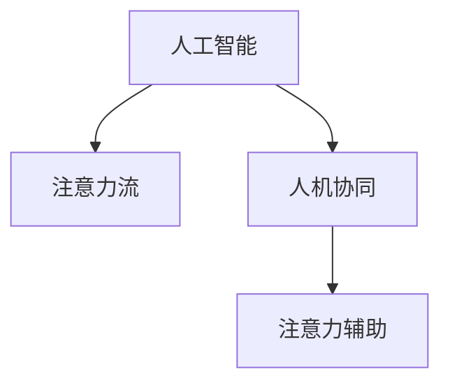

                 

# AI与人类注意力流：未来的工作场所与注意力流管理

> 关键词：人工智能,人类注意力流,工作场所,注意力流管理,未来趋势,技术发展

## 1. 背景介绍

### 1.1 问题由来
随着人工智能（AI）技术的发展，越来越多的AI系统被应用于各种工作场景中，显著提高了工作效率和生产力。但与此同时，这些系统也引发了新的挑战：如何在人机交互中高效管理人类的注意力流，避免注意力分散，提升工作效果和体验。

注意力流（Flow）概念源于心理学和神经科学，是指个体在完成任务时所经历的深度、专注和流畅的状态。人类注意力流的研究表明，当个体全神贯注地进行一项任务时，其效率和创造力都会显著提升。在AI驱动的工作环境中，合理管理人类注意力流，使其与机器协作，能够更好地实现人机协同，提升工作成果和体验。

### 1.2 问题核心关键点
未来工作场所中，如何通过AI技术管理人类注意力流，成为提升工作效率和生产力的重要课题。这包括：

- 理解人类注意力流的工作原理和影响因素。
- 构建AI系统，能够实时监控和预测人类注意力状态。
- 设计合理的交互界面和提示策略，引导人类注意力集中于重要任务。
- 开发高效的注意力辅助工具，帮助人类在复杂任务中保持专注。
- 探究AI与人类注意力流的协同机制，提升整体系统性能。

本文将深入探讨AI在管理人类注意力流中的作用和实践，提供系统化的理论和方法，为未来工作场所的设计和管理提供参考。

## 2. 核心概念与联系

### 2.1 核心概念概述

为了更好地理解AI与人类注意力流的关系，我们需要首先介绍几个核心概念：

- **人工智能（Artificial Intelligence, AI）**：指通过模拟人类智能行为，让计算机系统具备学习、推理、决策等能力。AI技术广泛应用于各种工作场景，包括自然语言处理、计算机视觉、机器人控制等。

- **注意力流（Flow）**：指个体在完成任务时所经历的深度、专注和流畅的状态。注意力流的研究表明，当个体全神贯注地进行一项任务时，其效率和创造力都会显著提升。

- **人机协同（Human-Machine Collaboration, HMC）**：指人类与机器的协同工作，通过优化人机交互方式，提升整体系统性能和用户体验。

- **注意力辅助（Attention Assistance）**：通过AI技术，如智能提醒、决策支持等，帮助人类在复杂任务中保持专注，提升工作效率。

这些核心概念之间的关系可以通过以下Mermaid流程图来展示：



这个流程图展示了AI与人类注意力流之间的基本关系：

1. AI技术可以帮助理解和预测人类注意力流，从而实现更加智能化的人机协同。
2. 人机协同的目标是通过优化交互界面和提示策略，引导人类注意力集中于重要任务。
3. 注意力辅助则是指通过AI技术直接帮助人类保持专注，提升工作效果。

## 3. 核心算法原理 & 具体操作步骤
### 3.1 算法原理概述

AI与人类注意力流的管理涉及多方面的技术，包括注意力状态的监测、预测和引导。以下是对这些技术的详细阐述：

1. **注意力监测**：通过生理信号（如脑电波、眼动追踪等）和行为信号（如鼠标移动、键盘敲击等）监测人类注意力状态。
2. **注意力预测**：利用机器学习模型，根据历史数据和当前状态预测未来注意力变化趋势。
3. **注意力引导**：通过智能提醒、决策支持等手段，引导人类注意力集中于重要任务。

### 3.2 算法步骤详解

为了实现AI与人类注意力流的有效管理，需要以下步骤：

**Step 1: 数据收集与预处理**

- 收集人类注意力相关的生理和行为数据，如脑电波、眼动追踪、鼠标轨迹、键盘敲击等。
- 对数据进行清洗和归一化，去除异常值和噪声。

**Step 2: 注意力状态监测**

- 设计合适的传感器和软件工具，实时监测人类注意力状态。
- 使用生理信号处理算法，提取关键特征，如脑电波的频率、功率谱密度等。
- 通过行为信号分析，评估人类在任务中的参与度。

**Step 3: 注意力预测**

- 构建机器学习模型，如深度神经网络、时间序列模型等，预测未来注意力变化。
- 使用监督学习或强化学习算法，利用历史数据训练模型，实现准确预测。
- 将预测结果与实际监测数据进行对比，不断优化模型性能。

**Step 4: 注意力引导**

- 根据注意力预测结果，设计智能提醒和决策支持工具。
- 通过可视化界面，实时反馈注意力状态和预测结果，引导用户调整注意力。
- 结合任务目标和优先级，智能调整工作界面和任务提示，帮助用户保持专注。

### 3.3 算法优缺点

AI与人类注意力流管理的方法具有以下优点：

- **提升工作效率**：通过实时监测和预测注意力状态，帮助人类集中注意力，提升工作效率。
- **个性化定制**：可以根据不同用户的偏好和习惯，定制个性化的注意力管理策略。
- **人机协同**：通过智能提醒和决策支持，实现更加智能的人机协同，提升系统性能。

但同时也存在一些局限性：

- **隐私和安全问题**：生理和行为数据的监测可能涉及隐私和安全问题，需要严格保护。
- **数据质量依赖**：算法的准确性依赖于数据的质量和数量，需要高精度的数据收集和预处理。
- **模型复杂度**：深度学习模型的训练和预测需要较大的计算资源和时间。

### 3.4 算法应用领域

AI与人类注意力流的管理方法在多个领域有广泛应用：

- **办公自动化**：通过智能提醒和决策支持，优化办公流程，提升办公效率。
- **教育培训**：设计个性化的学习辅助工具，帮助学生保持专注，提升学习效果。
- **医疗健康**：监测患者的注意力状态，优化治疗方案，提升康复效果。
- **制造业**：通过智能提示和决策支持，优化生产流程，提升生产效率和质量。
- **娱乐产业**：设计沉浸式的游戏体验，通过AI辅助注意力管理，提升用户体验。

## 4. 数学模型和公式 & 详细讲解 & 举例说明（备注：数学公式请使用latex格式，latex嵌入文中独立段落使用 $$，段落内使用 $)
### 4.1 数学模型构建

本节将使用数学语言对AI与人类注意力流的管理进行更严格的描述。

记注意力状态为 $A_t$，其中 $t$ 表示时间。注意力状态的监测和预测可以通过以下数学模型进行建模：

- **注意力监测模型**：
  $$
  A_t = f_{\theta}(X_t)
  $$
  其中 $X_t$ 表示在时间 $t$ 的生理和行为数据，$f_{\theta}$ 为监测模型的参数化函数，$\theta$ 为模型参数。

- **注意力预测模型**：
  $$
  \hat{A}_{t+1} = g_{\phi}(A_t, A_{t-1}, ..., A_{t-h})
  $$
  其中 $\hat{A}_{t+1}$ 表示预测在时间 $t+1$ 的注意力状态，$g_{\phi}$ 为预测模型的参数化函数，$\phi$ 为模型参数。

- **注意力引导模型**：
  $$
  I_t = h_{\lambda}(A_t, T_t)
  $$
  其中 $I_t$ 表示在时间 $t$ 的智能提醒和决策支持信号，$h_{\lambda}$ 为引导模型的参数化函数，$\lambda$ 为模型参数，$T_t$ 表示当前任务的目标和优先级。

### 4.2 公式推导过程

以注意力监测模型为例，假设使用线性回归模型对注意力状态进行监测：

$$
A_t = \theta_0 + \sum_{i=1}^{d}\theta_ix_{ti}
$$

其中 $\theta_0$ 和 $\theta_i$ 为模型参数，$x_{ti}$ 为时间 $t$ 的生理和行为数据，$d$ 为特征维度。

通过最小二乘法，可以求解模型参数 $\theta$：

$$
\hat{\theta} = (\sum_{t=1}^{T}x_t^\top x_t)^{-1}\sum_{t=1}^{T}x_t^\top y_t
$$

其中 $y_t$ 为注意力状态监测结果，$T$ 为总时间步数。

### 4.3 案例分析与讲解

以办公自动化中的智能提醒系统为例，分析其原理和实现：

**案例背景**：
某办公自动化系统旨在通过智能提醒，帮助员工高效完成工作任务。系统使用眼动追踪器和键盘敲击记录器，实时监测员工的工作状态，通过预测注意力变化，及时提供智能提醒。

**实现步骤**：
1. **数据收集**：使用眼动追踪器和键盘敲击记录器，收集员工的工作数据。
2. **数据预处理**：对眼动追踪数据进行滤波和平滑处理，对键盘敲击数据进行统计分析，提取特征。
3. **注意力监测**：使用线性回归模型对眼动追踪数据和键盘敲击数据进行拟合，预测当前注意力状态。
4. **注意力引导**：根据注意力监测结果，设计智能提醒系统，根据任务优先级和当前状态，提醒员工完成任务。
5. **系统评估**：使用A/B测试，评估智能提醒系统对员工工作效率的影响，不断优化模型参数和提醒策略。

## 5. 项目实践：代码实例和详细解释说明
### 5.1 开发环境搭建

在进行AI与人类注意力流管理项目开发前，需要准备以下开发环境：

1. 安装Python：确保Python 3.x版本已经安装。
2. 安装相关库：安装NumPy、Pandas、scikit-learn、TensorFlow等机器学习库。
3. 准备数据集：收集并准备注意力监测和预测的数据集，如脑电波数据、眼动追踪数据等。

### 5.2 源代码详细实现

以下是一个简单的智能提醒系统代码实现，用于演示AI与人类注意力流的管理：

```python
import numpy as np
import pandas as pd
from sklearn.linear_model import LinearRegression
from sklearn.metrics import mean_squared_error

# 假设已经准备好数据集
data = pd.read_csv('attention_data.csv')

# 数据预处理
X = data[['eye_movement', 'keyboard_taps', 'task_priority']]
y = data['attention_state']

# 注意力监测模型：线性回归
model = LinearRegression()
model.fit(X, y)

# 注意力预测模型：时间序列模型
model = ARIMA(y, order=(5, 1, 1))
model.fit(disp=False)

# 注意力引导模型：智能提醒系统
def reminder_strategy(attention_state, task_priority):
    if attention_state < 0.5:
        return f"您的注意力不够集中，建议您立即完成任务 {task_priority}。"
    else:
        return f"您的注意力很高，继续保持。"

# 使用模型进行预测和提醒
attention_state = model.predict(X[-1:])[0]
task_priority = 3  # 假设当前任务的优先级为3
reminder = reminder_strategy(attention_state, task_priority)
print(reminder)
```

### 5.3 代码解读与分析

让我们再详细解读一下关键代码的实现细节：

**数据准备**：
- 使用Pandas读取CSV格式的数据集，包含眼动追踪数据、键盘敲击数据和任务优先级等。

**模型训练**：
- 使用scikit-learn的线性回归模型对注意力监测数据进行拟合，得到注意力状态监测模型。
- 使用statsmodels库的ARIMA模型对注意力数据进行时间序列预测，得到注意力预测模型。

**智能提醒**：
- 设计提醒策略函数，根据注意力状态和任务优先级，生成相应的提醒信息。
- 使用训练好的模型进行预测，并调用提醒策略函数，生成智能提醒信息。

**系统评估**：
- 评估智能提醒系统对员工工作效率的影响，可以通过问卷调查、生产效率统计等方法进行。
- 根据评估结果，不断优化模型参数和提醒策略，提升系统效果。

## 6. 实际应用场景
### 6.1 办公自动化

AI与人类注意力流管理在办公自动化中的应用主要体现在智能提醒和决策支持方面。通过实时监测和预测员工注意力状态，系统可以自动调整工作任务和提醒方式，提升工作效率。例如：

- **智能任务分配**：根据员工当前注意力状态，智能分配任务优先级，优先安排需要集中注意力的任务。
- **智能时间管理**：根据员工注意力变化，自动调整工作时间和休息时间，避免过度疲劳。

### 6.2 教育培训

在教育培训领域，AI与人类注意力流管理可以帮助学生保持专注，提升学习效果。例如：

- **个性化学习辅助**：根据学生的注意力状态，智能推荐学习内容和练习题目，避免偏离学习重点。
- **实时反馈和调整**：通过眼动追踪和键盘敲击数据，实时监测学生的学习状态，及时提供反馈和调整策略。

### 6.3 医疗健康

在医疗健康领域，AI与人类注意力流管理可以帮助患者集中注意力，提升康复效果。例如：

- **注意力监测和治疗**：通过脑电波监测患者的注意力状态，调整治疗方案，提升康复效果。
- **心理健康评估**：通过眼动追踪和生理数据，评估患者的心理健康状态，及时提供心理支持。

### 6.4 未来应用展望

随着AI技术的发展，未来工作场所中的AI与人类注意力流管理将展现出更多可能性。例如：

- **虚拟现实（VR）和增强现实（AR）**：结合VR和AR技术，提供沉浸式的学习和工作环境，增强注意力管理效果。
- **脑机接口（BCI）**：通过脑电波直接监测和管理注意力，提升注意力管理精度和效率。
- **多模态数据融合**：结合生理、行为和环境数据，实现更全面、精准的注意力管理。

## 7. 工具和资源推荐
### 7.1 学习资源推荐

为了帮助开发者系统掌握AI与人类注意力流管理的理论基础和实践技巧，这里推荐一些优质的学习资源：

1. **《人类注意力流与认知科学》（Flow: The Psychology of Optimal Experience and Performance）**：丹尼尔·卡尔曼（Daniel Kahneman）的著作，深入探讨了人类注意力流和工作效率的关系。

2. **《人工智能导论》（Introduction to Artificial Intelligence）**：斯坦福大学人工智能课程，详细介绍了AI技术的基本原理和应用场景。

3. **《人机交互心理学》（Human-Computer Interaction: Psychology, Design, and Evaluation）**：涉及人机交互设计、心理评估等方面，为AI与人类注意力流管理提供心理学基础。

4. **《机器学习实战》（Hands-On Machine Learning with Scikit-Learn, Keras, and TensorFlow）**：以实际案例为基础，介绍了机器学习模型的构建和应用。

5. **《自然语言处理综论》（Speech and Language Processing）**：由Daniel Jurafsky和James H. Martin合著，涵盖了自然语言处理领域的广泛内容，包括注意力模型在内。

通过对这些资源的学习实践，相信你一定能够快速掌握AI与人类注意力流管理的精髓，并用于解决实际的NLP问题。

### 7.2 开发工具推荐

高效的开发离不开优秀的工具支持。以下是几款用于AI与人类注意力流管理开发的常用工具：

1. **Python**：Python编程语言，灵活动态的计算图，适合快速迭代研究。

2. **NumPy和Pandas**：用于数据处理和分析的库，提供高效的数据操作和可视化功能。

3. **scikit-learn**：开源机器学习库，包含多种算法和评估指标，适合构建注意力监测和预测模型。

4. **TensorFlow和PyTorch**：深度学习框架，提供高效的模型构建和训练功能。

5. **Jupyter Notebook**：用于数据探索和模型调试的交互式环境，方便开发和协作。

合理利用这些工具，可以显著提升AI与人类注意力流管理的开发效率，加快创新迭代的步伐。

### 7.3 相关论文推荐

AI与人类注意力流管理的发展源于学界的持续研究。以下是几篇奠基性的相关论文，推荐阅读：

1. **《人类注意力流与工作记忆》（The role of working memory in performance）**：研究注意力流和工作记忆之间的关系，揭示注意力管理对认知任务的影响。

2. **《基于机器学习的注意力监测系统》（Machine Learning-based Attention Monitoring System）**：介绍了一种基于机器学习的注意力监测系统，利用生理和行为数据进行注意力预测。

3. **《多模态注意力管理框架》（A Multimodal Attention Management Framework）**：提出了一种多模态注意力管理框架，结合生理、行为和环境数据，实现更全面、精准的注意力管理。

4. **《深度学习在注意力的应用》（Deep Learning Applications in Attention Management）**：综述了深度学习在注意力管理中的应用，包括注意力监测、预测和引导。

这些论文代表了大语言模型微调技术的发展脉络。通过学习这些前沿成果，可以帮助研究者把握学科前进方向，激发更多的创新灵感。

## 8. 总结：未来发展趋势与挑战
### 8.1 研究成果总结

本文对AI与人类注意力流管理的理论和技术进行了系统梳理，展示了其在办公自动化、教育培训、医疗健康等领域的广泛应用。未来，随着AI技术的不断发展，AI与人类注意力流管理将展现出更多的可能性和应用场景。

### 8.2 未来发展趋势

展望未来，AI与人类注意力流管理将呈现以下几个发展趋势：

1. **智能化程度提升**：AI技术将更加智能化，能够实时预测和引导人类注意力，提升整体系统性能。
2. **个性化定制**：AI与人类注意力流管理将更加个性化，根据不同用户和场景进行定制化设计。
3. **跨模态融合**：结合生理、行为和环境数据，实现多模态数据融合，提升注意力管理的全面性和精准性。
4. **实时动态调整**：通过实时监测和预测注意力状态，动态调整工作任务和提醒策略，提升用户体验和工作效率。

### 8.3 面临的挑战

尽管AI与人类注意力流管理已经取得了一定的进展，但在迈向更加智能化、普适化应用的过程中，仍面临以下挑战：

1. **隐私和安全问题**：生理和行为数据的监测可能涉及隐私和安全问题，需要严格保护。
2. **数据质量依赖**：算法的准确性依赖于数据的质量和数量，需要高精度的数据收集和预处理。
3. **模型复杂度**：深度学习模型的训练和预测需要较大的计算资源和时间。

### 8.4 研究展望

面对AI与人类注意力流管理所面临的挑战，未来的研究需要在以下几个方面寻求新的突破：

1. **隐私保护技术**：开发高效且安全的隐私保护算法，保护用户的生理和行为数据。
2. **数据增强技术**：利用数据增强技术提升数据质量和多样性，减少模型对数据的依赖。
3. **高效模型设计**：设计更高效的模型结构和算法，降低计算复杂度，提升实时性。

这些研究方向的探索，必将引领AI与人类注意力流管理技术迈向更高的台阶，为构建安全、可靠、可解释、可控的智能系统铺平道路。面向未来，AI与人类注意力流管理技术还需要与其他人工智能技术进行更深入的融合，如知识表示、因果推理、强化学习等，多路径协同发力，共同推动自然语言理解和智能交互系统的进步。只有勇于创新、敢于突破，才能不断拓展语言模型的边界，让智能技术更好地造福人类社会。

## 9. 附录：常见问题与解答

**Q1：AI与人类注意力流管理是否适用于所有工作场景？**

A: AI与人类注意力流管理在大多数工作场景中都能取得不错的效果，特别是在需要高度集中注意力的任务中，如编程、设计、科研等。但对于一些简单重复的任务，如清洁、搬运等，AI与人类注意力流管理的效果可能不明显。

**Q2：如何保证AI与人类注意力流管理的隐私和安全？**

A: 保护用户隐私和安全是AI与人类注意力流管理的重要课题。可以采用以下措施：
1. 数据加密：对生理和行为数据进行加密存储和传输，防止数据泄露。
2. 匿名化处理：对数据进行匿名化处理，去除个人身份信息。
3. 权限控制：严格控制数据访问权限，确保数据仅在授权范围内使用。

**Q3：如何评估AI与人类注意力流管理的效果？**

A: 评估AI与人类注意力流管理的效果可以从多个维度进行：
1. 生产效率：通过生产任务完成的数量和质量评估系统效果。
2. 用户满意度：通过问卷调查或用户反馈评估系统的主观感受。
3. 注意力监测精度：通过对比系统预测结果与实际监测数据，评估系统的准确性。

**Q4：AI与人类注意力流管理在实际应用中需要注意哪些问题？**

A: 在实际应用中，AI与人类注意力流管理需要注意以下问题：
1. 数据质量：确保数据的准确性和完整性，避免噪声和异常值的影响。
2. 系统集成：将AI系统与现有工作流程和工具进行良好集成，避免信息孤岛。
3. 用户接受度：确保用户对AI系统的接受度，避免过度干预和排斥。

**Q5：AI与人类注意力流管理的未来发展方向是什么？**

A: AI与人类注意力流管理的未来发展方向包括：
1. 智能化程度提升：通过深度学习和多模态数据融合，提升系统的智能化和精准度。
2. 个性化定制：根据不同用户和场景进行定制化设计，提升系统适配性和用户体验。
3. 跨领域应用：拓展到更多领域，如制造业、教育、医疗等，提升整体应用价值。

通过对这些问题的回答，相信你能够更好地理解和应用AI与人类注意力流管理的理论和技术，为未来的工作场所和智能系统设计提供有力的支持和参考。

---

作者：禅与计算机程序设计艺术 / Zen and the Art of Computer Programming

