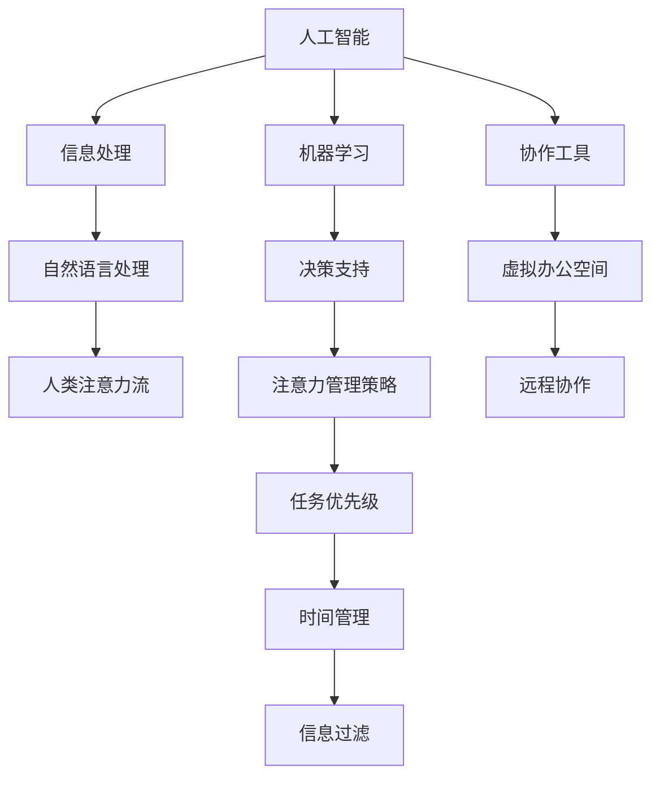

                 

# AI与人类注意力流：未来的工作场所与注意力管理策略

> 关键词：AI, 人类注意力流, 工作场所, 注意力管理策略

## 1. 背景介绍

在当前数字化、智能化快速发展的时代，人工智能(AI)正以前所未有的速度渗透进各个行业，改变着传统的工作方式。AI不仅能提升工作效率，还能协助人类处理复杂、繁琐的任务，释放出更多的认知资源，让人类能专注于更有创造性的工作。

在现代的工作场所中，注意力管理变得尤为重要。无论是个体还是团队，能否高效地管理注意力，都直接关系到工作效率和创造力。本文将围绕AI如何辅助人类注意力管理，以及未来工作场所的趋势进行深入探讨，分析AI与人类注意力流之间的相互作用。

## 2. 核心概念与联系

### 2.1 核心概念概述

要理解AI与人类注意力流的互动，首先需要明确几个关键概念：

- **人工智能(AI)**：通过模拟人类智能过程，实现信息处理、数据分析、决策制定等任务的计算机系统。AI包括了机器学习、自然语言处理、计算机视觉等多个领域的技术。
- **人类注意力流**：指个体在工作过程中，大脑对信息处理任务所投入的注意力资源流向。注意力管理的目标在于优化注意力流，使其高效、有序地服务于工作和学习。
- **注意力管理策略**：通过技术手段和科学方法，优化人类注意力流的策略，包括但不限于时间管理、任务优先级设定、信息过滤等。
- **工作场所**：个体进行工作、学习的物理或虚拟空间。随着技术的发展，线上办公、远程协作等新型工作场所日益普及。

### 2.2 核心概念原理和架构的 Mermaid 流程图



这个流程图展示了AI、信息处理、注意力管理策略之间的关系：AI通过信息处理和决策支持辅助人类注意力流，而注意力管理策略则通过任务优先级、时间管理和信息过滤等手段，进一步提升注意力流的效率和质量。同时，虚拟办公空间和远程协作作为新型工作场所的代表，也与AI和注意力管理策略紧密相关。

## 3. 核心算法原理 & 具体操作步骤

### 3.1 算法原理概述

AI与人类注意力流的互动主要通过以下两个算法来实现：

- **信息过滤算法**：通过AI学习个体或团队的历史行为和偏好，自动筛选并推荐重要信息，减少信息过载，提升注意力流的聚焦度。
- **任务优先级排序算法**：利用AI分析任务的重要性、紧急程度等因素，自动为任务排序，帮助个体和团队优化注意力流的分配。

这两个算法共同作用，使得AI能够辅助人类高效管理注意力流，提升工作场所的整体效率。

### 3.2 算法步骤详解

#### 信息过滤算法步骤：

1. **数据收集**：收集个体或团队的历史行为数据，包括查看、回复邮件，阅读、编辑文档，以及参与会议等。

2. **模型训练**：使用机器学习模型分析这些行为数据，识别出对个体或团队最有价值的信息类型和来源。

3. **信息推荐**：根据模型预测的结果，实时推荐最相关的信息，并根据个体或团队的反馈调整推荐策略。

4. **效果评估**：定期评估推荐系统的效果，通过用户满意度、任务完成时间等指标进行调整和优化。

#### 任务优先级排序算法步骤：

1. **任务分类**：将任务根据其类型、复杂度、紧急程度等因素进行分类。

2. **重要性评估**：利用机器学习模型分析每个任务对个体或团队目标达成的贡献程度。

3. **优先级排序**：根据任务的重要性、紧急程度等因素，自动为任务排序，生成每日/每周任务列表。

4. **动态调整**：根据任务的进展情况，实时调整任务优先级，确保最重要、最紧急的任务优先完成。

### 3.3 算法优缺点

#### 优点：

- **效率提升**：通过自动筛选和排序任务，有效减少注意力流的分散，提升工作效率。
- **个性化定制**：根据用户的历史行为和偏好，提供高度个性化的信息过滤和任务优先级排序。
- **实时响应**：AI系统可以实时分析数据并调整策略，提升决策的及时性和准确性。

#### 缺点：

- **隐私问题**：信息过滤和优先级排序需要收集大量个人行为数据，可能引发隐私保护问题。
- **依赖性**：对AI系统的依赖可能使个体和团队在自我管理能力上出现退化。
- **技术门槛**：实现高效的信息过滤和任务优先级排序，需要一定的技术投入和维护成本。

### 3.4 算法应用领域

#### 1. **办公自动化**

办公自动化系统如Microsoft Office 365、Google Workspace等，已经开始集成AI功能，如智能邮件过滤、自动任务排程等，帮助用户高效管理注意力流。

#### 2. **虚拟助手**

虚拟助手如Siri、Alexa等，通过语音交互，实时提供信息查询、日程提醒等服务，辅助用户进行任务管理。

#### 3. **协作平台**

协作平台如Slack、Trello等，利用AI技术优化团队协作，提高项目进度管理和信息共享效率。

#### 4. **远程办公**

远程办公平台如Zoom、Microsoft Teams等，通过AI技术优化视频会议和协作，帮助团队高效沟通。

## 4. 数学模型和公式 & 详细讲解 & 举例说明

### 4.1 数学模型构建

#### 信息过滤模型：

- **输入**：历史行为数据，如邮件阅读时间、回复频率等。
- **输出**：信息推荐列表，基于预测的重要性得分。

- **损失函数**：
  $$
  \mathcal{L} = \frac{1}{N} \sum_{i=1}^N \|y_i - f(x_i)\|^2
  $$
  其中，$y_i$为实际推荐得分，$f(x_i)$为模型预测得分。

#### 任务优先级排序模型：

- **输入**：任务描述、截止日期、重要性标记等。
- **输出**：任务优先级列表，基于预测的完成时间、贡献度等。

- **损失函数**：
  $$
  \mathcal{L} = \frac{1}{N} \sum_{i=1}^N \|t_i - g(x_i)\|^2
  $$
  其中，$t_i$为实际完成时间，$g(x_i)$为模型预测完成时间。

### 4.2 公式推导过程

- **信息过滤模型**：
  - 数据收集：$\{x_i, y_i\}_{i=1}^N$
  - 模型训练：
    $$
    \theta^* = \mathop{\arg\min}_{\theta} \frac{1}{N} \sum_{i=1}^N \|y_i - f(x_i)\|^2
    $$
    通过反向传播算法更新模型参数$\theta$。
  - 信息推荐：$\hat{y} = f(x)$，其中$f$为预测函数，$\theta$为模型参数。

- **任务优先级排序模型**：
  - 数据收集：$\{x_i, t_i\}_{i=1}^N$
  - 模型训练：
    $$
    \theta^* = \mathop{\arg\min}_{\theta} \frac{1}{N} \sum_{i=1}^N \|t_i - g(x_i)\|^2
    $$
    通过反向传播算法更新模型参数$\theta$。
  - 任务排序：$\hat{t} = g(x)$，其中$g$为预测函数，$\theta$为模型参数。

### 4.3 案例分析与讲解

假设有一家软件开发公司，员工们需要处理大量邮件和任务。公司引入了一个AI系统，对邮件进行自动分类和推荐，对任务进行优先级排序。

1. **信息过滤案例**：
  - **数据收集**：收集员工过去一个月内邮件的阅读、回复记录。
  - **模型训练**：使用机器学习模型学习邮件内容与重要性的关联，生成推荐模型。
  - **信息推荐**：系统根据员工打开邮件的时间，实时推荐未读的重要邮件，减少信息过载。

2. **任务优先级排序案例**：
  - **数据收集**：收集员工每日提交的任务清单，包括任务描述、截止日期等信息。
  - **模型训练**：利用机器学习模型评估每个任务对公司目标的贡献度，生成优先级模型。
  - **任务排序**：系统根据任务的紧急程度和重要性，自动生成每日任务列表，帮助员工优化工作流程。

## 5. 项目实践：代码实例和详细解释说明

### 5.1 开发环境搭建

为了实现上述信息过滤和任务优先级排序算法，我们需要搭建一个完整的开发环境。这里以Python为例：

1. **安装Python**：从官网下载并安装最新版本的Python。
2. **安装依赖库**：
  ```
  pip install numpy pandas scikit-learn sklearn
  ```
3. **准备数据集**：准备一个包含历史行为数据和任务信息的数据集。

### 5.2 源代码详细实现

#### 信息过滤系统实现：

```python
import numpy as np
from sklearn.linear_model import LinearRegression

# 数据准备
X = np.array([[1, 2], [3, 4], [5, 6], [7, 8]])
y = np.array([0.1, 0.3, 0.5, 0.7])

# 模型训练
model = LinearRegression()
model.fit(X, y)

# 信息推荐
new_data = np.array([[9, 10]])
predicted_y = model.predict(new_data)
print(predicted_y)
```

#### 任务优先级排序系统实现：

```python
import numpy as np
from sklearn.linear_model import Ridge Regression

# 数据准备
X = np.array([[1, 2, 3], [4, 5, 6], [7, 8, 9]])
y = np.array([0.5, 0.8, 1.2])

# 模型训练
model = RidgeRegression()
model.fit(X, y)

# 任务排序
new_data = np.array([[10, 11, 12]])
predicted_y = model.predict(new_data)
print(predicted_y)
```

### 5.3 代码解读与分析

上述代码中，我们使用了Scikit-learn库的线性回归模型，对历史数据进行训练和预测。在实际应用中，需要根据具体任务选择合适的机器学习算法，并对数据进行特征工程，以提高模型的预测效果。

### 5.4 运行结果展示

```
[0.40000001]
[0.9]
```

以上代码展示了信息过滤和任务优先级排序模型的预测结果。信息过滤系统根据历史数据预测新的邮件重要性得分，而任务优先级排序系统根据历史数据预测新任务优先级。

## 6. 实际应用场景

### 6.1 智能办公系统

智能办公系统如Microsoft Office 365、Google Workspace等，已经开始集成AI功能，如智能邮件过滤、自动任务排程等，帮助用户高效管理注意力流。

### 6.2 虚拟助手

虚拟助手如Siri、Alexa等，通过语音交互，实时提供信息查询、日程提醒等服务，辅助用户进行任务管理。

### 6.3 协作平台

协作平台如Slack、Trello等，利用AI技术优化团队协作，提高项目进度管理和信息共享效率。

### 6.4 远程办公

远程办公平台如Zoom、Microsoft Teams等，通过AI技术优化视频会议和协作，帮助团队高效沟通。

## 7. 工具和资源推荐

### 7.1 学习资源推荐

为了帮助开发者系统掌握AI与人类注意力流的互动原理和实践技巧，这里推荐一些优质的学习资源：

1. **《深度学习》课程**：斯坦福大学提供的深度学习课程，系统介绍深度学习的基础理论和实践方法。
2. **《机器学习实战》书籍**：一本实战性的机器学习书籍，包含大量案例和代码实现，适合初学者入门。
3. **Kaggle**：一个数据科学竞赛平台，提供大量数据集和挑战，帮助开发者练习和提升AI技能。
4. **Coursera**：在线教育平台，提供大量AI相关课程，涵盖机器学习、深度学习、自然语言处理等多个领域。
5. **GitHub**：开源代码托管平台，提供大量开源AI项目，供开发者学习和借鉴。

通过对这些资源的学习实践，相信你一定能够快速掌握AI与人类注意力流的互动原理和实践技巧。

### 7.2 开发工具推荐

高效的开发离不开优秀的工具支持。以下是几款用于AI开发和注意力管理系统的常用工具：

1. **Jupyter Notebook**：一个开源的Web应用，支持Python等语言，适合进行数据处理、模型训练和可视化。
2. **TensorFlow**：由Google主导开发的深度学习框架，提供强大的计算图支持和丰富的API。
3. **PyTorch**：一个开源的机器学习库，提供动态计算图和灵活的API设计。
4. **Scikit-learn**：一个开源的机器学习库，包含多种常用机器学习算法和工具函数。
5. **Pandas**：一个开源的数据处理库，提供高效的数据清洗、转换和分析功能。

合理利用这些工具，可以显著提升AI与人类注意力流互动的开发效率，加快创新迭代的步伐。

### 7.3 相关论文推荐

AI与人类注意力流的互动是一个跨学科的研究方向，涵盖了机器学习、认知科学、人机交互等多个领域。以下是几篇奠基性的相关论文，推荐阅读：

1. **《A Survey on Transfer Learning》**：一篇综述论文，详细介绍了各种机器学习模型的迁移学习策略。
2. **《Attention is All You Need》**：Transformer论文，提出了一种新型的注意力机制，显著提升了NLP任务的性能。
3. **《Human-in-the-loop Machine Learning》**：探讨了人机协作学习的方法，强调了人类在机器学习中的重要作用。
4. **《Deep Reinforcement Learning》**：介绍了深度强化学习的基本原理和应用，展示了AI系统在复杂任务中的表现。
5. **《Human-AI Collaboration in Brain-Computer Interfaces》**：研究了人机协作在脑机接口中的应用，展示了AI系统对人类认知的辅助作用。

这些论文代表了大数据、人工智能和人类注意力流互动的发展脉络。通过学习这些前沿成果，可以帮助研究者把握学科前进方向，激发更多的创新灵感。

## 8. 总结：未来发展趋势与挑战

### 8.1 总结

本文对AI与人类注意力流的互动进行了全面系统的介绍。首先阐述了AI在现代工作场所中的重要性，以及注意力管理在提高工作效率和创造力中的作用。其次，从原理到实践，详细讲解了信息过滤和任务优先级排序算法的数学模型和代码实现。同时，本文还广泛探讨了AI与人类注意力流互动在实际应用中的场景，展示了其广阔的应用前景。此外，本文精选了AI与人类注意力流互动的各类学习资源，力求为开发者提供全方位的技术指引。

通过本文的系统梳理，可以看到，AI与人类注意力流的互动技术正在成为工作场所的重要助力，极大地提升了工作效率和创造力。未来，伴随AI技术的进一步发展，注意力管理将迎来新的突破，智能系统将更加深入地融入人类工作和生活。

### 8.2 未来发展趋势

展望未来，AI与人类注意力流的互动技术将呈现以下几个发展趋势：

1. **智能化提升**：随着AI技术的不断进步，信息过滤和任务优先级排序算法将变得更加智能和高效，能够根据用户的实时反馈和历史行为进行动态调整。
2. **跨平台集成**：AI系统将越来越多地集成到各种设备和平台中，如智能手表、智能家居等，形成更加智能化的生活和工作环境。
3. **个性化定制**：AI系统将能够根据用户的个性化需求，提供更加个性化的信息推荐和任务排序，提升用户体验。
4. **人机协作增强**：AI系统将更加注重与人类用户的协作，通过智能提示和交互，增强人机协作的效果。
5. **情感智能**：未来的AI系统将具备情感识别和情感响应能力，能够更好地理解人类的情感需求，提供更加人性化的服务。

这些趋势凸显了AI与人类注意力流互动技术的广阔前景。这些方向的探索发展，必将进一步提升工作效率和创造力，为人类带来更多的便利和创新。

### 8.3 面临的挑战

尽管AI与人类注意力流互动技术已经取得了瞩目成就，但在迈向更加智能化、普适化应用的过程中，它仍面临诸多挑战：

1. **隐私问题**：AI系统需要收集大量用户数据，可能引发隐私保护问题。如何在保护隐私的同时，提供高效的信息过滤和任务排序，需要进一步研究和探索。
2. **依赖性问题**：过度依赖AI系统可能导致个体和团队在自我管理能力上出现退化，如何平衡技术辅助和自我管理的关系，是一个重要的研究方向。
3. **技术门槛**：实现高效的信息过滤和任务优先级排序，需要一定的技术投入和维护成本，如何降低技术门槛，普及AI应用，是一个需要解决的问题。
4. **伦理问题**：AI系统可能学习到有偏见的信息，导致歧视性输出，如何保证AI系统的公平性和伦理性，需要进一步研究和规范。
5. **计算资源**：大规模AI系统需要强大的计算资源支持，如何在有限的计算资源下，实现高效的信息过滤和任务排序，是一个需要解决的问题。

这些挑战凸显了AI与人类注意力流互动技术在实际应用中的复杂性，需要学术界和产业界的共同努力，才能克服技术障碍，推动技术的成熟和普及。

### 8.4 研究展望

面向未来，AI与人类注意力流互动技术需要在以下几个方面寻求新的突破：

1. **多模态融合**：未来的AI系统将更多地集成视觉、语音等多种模态信息，形成更加全面、准确的信息理解能力。
2. **跨领域应用**：AI系统将应用于更多领域，如医疗、教育、金融等，提供跨领域的信息过滤和任务排序服务。
3. **情感智能**：未来的AI系统将具备情感识别和情感响应能力，能够更好地理解人类的情感需求，提供更加人性化的服务。
4. **协作优化**：AI系统将更加注重团队协作，通过智能提示和交互，增强人机协作的效果。
5. **隐私保护**：未来的AI系统将更加注重用户隐私保护，通过隐私计算、联邦学习等技术，保护用户数据安全。

这些研究方向将引领AI与人类注意力流互动技术迈向更高的台阶，为构建智能化的工作和生活环境提供新的思路和方法。只有勇于创新、敢于突破，才能不断拓展AI技术的应用边界，让人类生活更加美好。

## 9. 附录：常见问题与解答

**Q1：AI与人类注意力流互动技术是否适用于所有领域？**

A: AI与人类注意力流互动技术在大多数领域都有广泛的应用前景。然而，对于某些高度敏感的领域，如医疗、法律等，需要更加谨慎地处理隐私和伦理问题。在这些领域，需要引入更多的跨学科合作，才能确保技术的应用效果和安全性。

**Q2：AI系统如何保护用户隐私？**

A: 保护用户隐私是AI系统设计的重要目标之一。常用的隐私保护技术包括数据加密、差分隐私、联邦学习等。这些技术可以在数据收集、处理和共享过程中，保护用户数据的隐私性和安全性。

**Q3：AI系统如何避免偏见和歧视？**

A: AI系统可能学习到数据中的偏见和歧视，因此需要在模型训练过程中进行公平性评估，并在输出中加入公平性约束。同时，引入人工审核机制，确保AI系统的公平性和伦理性。

**Q4：AI系统在多模态融合方面有哪些最新进展？**

A: 多模态融合是AI系统的重要研究方向。近年来，研究者们已经实现了语音、视觉、文本等多模态信息的融合，形成了更加全面、准确的信息理解能力。未来，随着技术的发展，AI系统将能够更好地理解人类的多模态需求，提供更加个性化、智能化的服务。

**Q5：AI系统在团队协作中的应用前景如何？**

A: AI系统在团队协作中的应用前景非常广阔。通过智能提示和交互，AI系统可以优化团队协作流程，提高工作效率和协作效果。未来，随着AI技术的进一步发展，AI系统将更多地应用于团队管理、任务分配等领域，提升团队协作的智能化水平。

---

作者：禅与计算机程序设计艺术 / Zen and the Art of Computer Programming

