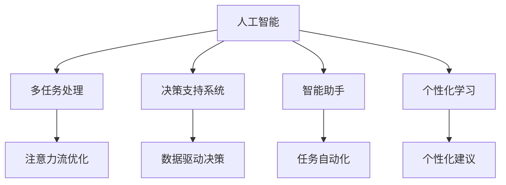

                 

# AI与人类注意力流：未来的工作、技能与注意力管理

> 关键词：人工智能,注意力流,人类认知,工作,技能管理,未来职场,多任务处理,自动化,大数据,机器学习

## 1. 背景介绍

在数字化的洪流中，人工智能（AI）已经成为推动社会进步和经济发展的重要力量。AI的应用从简单的自动化流程到复杂的决策支持系统，已经在各行各业铺展开来。然而，AI的发展并非一帆风顺，特别是在与人类共存的环境下，如何协调和提升人类与AI的协作效率，成为我们需要深入探讨的问题。

### 1.1 问题的由来
随着AI技术的日益成熟，自动化、智能化的生产和服务模式正在逐步改变传统的工作方式和职业结构。自动化工具可以处理重复性高的任务，减少人为错误，提升效率；智能助手可以提供决策支持，帮助人们更高效地完成任务。然而，这些改变同时也带来了一系列挑战，如人类工作技能的缺失，对自动化工具的过度依赖等问题。因此，如何管理和优化人类注意力流，充分发挥AI和人类智慧的协同优势，成为了一个迫切需要解决的课题。

### 1.2 问题核心关键点
管理人类注意力流，涉及AI在人类认知过程中的作用，以及如何通过技术手段提升人类的工作效率和创新能力。核心问题包括：
1. **AI如何辅助人类处理多任务**：在快速变化的工作环境中，人类需要同时处理多个任务，AI可以通过自动化工具、智能推荐系统等辅助人类高效完成任务。
2. **注意力管理与决策支持**：AI可以通过数据分析、模式识别等技术，帮助人类识别关键信息，做出更明智的决策。
3. **技能发展与知识更新**：随着AI技术的快速发展，人类需要不断更新自己的技能，以适应新的工作环境。AI可以提供个性化的学习建议和技能培训。
4. **人机协作效率优化**：如何在人机协作中实现效率的最大化，通过智能系统的优化，减少人为失误，提高协作效率。

### 1.3 问题研究意义
研究AI与人类注意力流的关系，对于理解未来工作模式的转变，提升工作效能，优化技能管理，具有重要意义：
1. **提升工作效率**：通过AI技术，如自动化、智能推荐等，减轻人类工作负担，提升处理复杂任务的效率。
2. **优化技能培训**：利用AI分析个人技能差距，提供个性化学习路径，帮助员工快速掌握新技能。
3. **增强决策能力**：通过AI的辅助分析，使决策更加科学和准确，提升管理层的决策效率。
4. **促进人机协同**：通过合理的注意力流管理，最大化利用AI和人类的各自优势，实现高效协作。

## 2. 核心概念与联系

### 2.1 核心概念概述

为更好地理解AI与人类注意力流的关系，本节将介绍几个关键概念：

- **人工智能(AI)**：指通过算法、计算机程序模拟人类智能行为的科学和技术。包括机器学习、深度学习、自然语言处理等子领域。

- **注意力流（Attention Flow）**：指人类在进行多任务处理时，注意力在各个任务之间流动的过程。AI可以通过自动化的方式，优化注意力流，帮助人类高效完成任务。

- **多任务处理（Multi-task Processing）**：指在同时处理多个任务时，通过注意力流管理，确保每个任务都得到充分关注和处理。

- **决策支持系统（Decision Support System, DSS）**：利用AI进行数据驱动的决策分析，辅助人类进行复杂决策。

- **智能助手（Intelligent Assistant）**：通过自然语言处理、机器学习等技术，提供个性化服务，协助人类完成日常任务。

- **个性化学习（Personalized Learning）**：通过AI分析学习者的行为数据，提供个性化的学习内容和方法，优化学习效果。

这些概念之间的逻辑关系可以通过以下Mermaid流程图来展示：



这个流程图展示了大语言模型的核心概念及其之间的关系：

1. AI通过多任务处理、决策支持、智能助手等技术，提升人类工作效率和决策质量。
2. 通过注意力流优化，AI能够帮助人类更高效地处理多任务。
3. 个性化学习使AI能够提供针对个人的学习建议和技能培训。
4. 数据驱动的决策支持系统，利用AI的分析和预测能力，辅助人类进行复杂决策。

这些概念共同构成了AI与人类注意力流管理的基础框架，为其研究与应用提供了理论依据。

## 3. 核心算法原理 & 具体操作步骤
### 3.1 算法原理概述

AI与人类注意力流的管理，涉及多个学科，包括心理学、计算机科学、认知科学等。其核心算法原理包括：

- **多任务处理**：通过时间管理、任务优先级排序等方法，优化注意力在多个任务之间的分配。
- **注意力流优化**：利用AI的分析和预测能力，识别注意力流中的瓶颈，提供优化策略。
- **个性化学习**：通过AI分析学习者的行为数据，提供个性化的学习路径和内容。
- **数据驱动决策**：通过机器学习模型，分析大量数据，提供决策支持。

### 3.2 算法步骤详解

AI与人类注意力流管理的算法步骤主要包括：

**Step 1: 数据收集与预处理**
- 收集人类在多任务处理中的行为数据，如任务切换时间、任务完成时间、错误率等。
- 对数据进行清洗、去噪、归一化等预处理，确保数据的质量。

**Step 2: 模型训练与优化**
- 利用机器学习算法，如回归分析、时间序列分析等，训练注意力流优化模型。
- 通过交叉验证、调参等方法，优化模型性能，确保其在实际应用中的准确性和可靠性。

**Step 3: 注意力流监控与反馈**
- 实时监控人类在多任务处理中的注意力流，识别瓶颈和异常。
- 根据监控结果，提供反馈和优化建议，帮助人类调整注意力分配。

**Step 4: 个性化学习与技能提升**
- 分析人类学习行为数据，利用AI算法，提供个性化学习路径和建议。
- 根据学习进度和效果，动态调整学习内容和难度，提升学习效率。

**Step 5: 决策支持与优化**
- 收集决策数据，利用机器学习模型，提供数据驱动的决策支持。
- 结合人类经验，优化决策流程，提升决策效率和准确性。

### 3.3 算法优缺点

AI与人类注意力流管理的算法，具有以下优点：
1. 提高工作效率：通过自动化和智能推荐，减轻人类工作负担，提升任务处理效率。
2. 优化注意力管理：利用AI分析注意力流，识别瓶颈和异常，提供优化策略。
3. 提升学习效果：通过个性化学习，针对不同学习者提供定制化的学习路径，提高学习效率。
4. 增强决策能力：利用数据驱动的决策支持系统，辅助人类进行复杂决策。

同时，该算法也存在一定的局限性：
1. 对数据质量要求高：数据清洗和预处理工作量大，数据质量直接影响算法效果。
2. 模型复杂度较高：算法需要大量的训练数据和计算资源，模型复杂度较高。
3. 人类依赖性强：过度依赖AI工具，可能减弱人类自身的主动性和创造性。
4. 个性化差异：不同学习者和工作者的需求差异大，难以实现统一的个性化策略。
5. 算法透明度不足：AI决策过程不透明，难以理解和解释。

尽管存在这些局限性，但就目前而言，AI与人类注意力流管理的方法仍是大规模提升工作效率、优化技能管理的重要手段。未来相关研究的重点在于如何进一步降低算法对数据的依赖，提高算法的透明性和可解释性，同时兼顾效率和公平性等因素。

### 3.4 算法应用领域

AI与人类注意力流管理的算法，已经在多个领域得到应用，如：

- **人力资源管理**：通过AI分析员工绩效数据，优化工作分配，提升员工满意度和工作效率。
- **项目管理**：利用AI进行任务调度与优化，协调团队成员的工作，提升项目完成质量。
- **金融交易**：通过智能助手和决策支持系统，提升交易决策的准确性和效率。
- **教育培训**：利用AI分析学生行为数据，提供个性化学习建议，提升学习效果。
- **健康医疗**：通过AI进行医疗数据分析和决策支持，提升医疗诊断和治疗效果。
- **物流配送**：利用AI优化货物配送路线和时间，提升物流效率和准确性。

除了上述这些经典应用外，AI与人类注意力流管理的方法还在不断拓展新的应用场景，如智能家居、智慧城市、智能制造等，为各行各业带来了新的发展机遇。

## 4. 数学模型和公式 & 详细讲解  
### 4.1 数学模型构建

本节将使用数学语言对AI与人类注意力流的关系进行更加严格的刻画。

记人类在任务 $i$ 上花费的时间为 $T_i$，在任务之间切换的时间为 $S_{i-1,i}$，所有任务的时间总和为 $T$，注意力流优化模型的目标是最小化总时间 $T$，即：

$$
\min_{\{T_i,S_{i-1,i}\}} \sum_{i=1}^n T_i
$$

其中 $n$ 为任务数，约束条件为：

$$
\sum_{i=1}^n T_i = T
$$

$$
S_{i-1,i} \geq 0, \quad \forall i=2,\cdots,n
$$

模型引入注意力流优化系数 $\alpha$，调整任务处理时间与切换时间之间的权重，目标函数变为：

$$
\min_{\{T_i,S_{i-1,i}\}} \sum_{i=1}^n \alpha T_i + (1-\alpha) S_{i-1,i}
$$

### 4.2 公式推导过程

以下我们以优化多任务处理为例，推导注意力流优化模型的公式。

假设人类在不同任务 $i$ 上花费的时间 $T_i$ 和任务之间切换的时间 $S_{i-1,i}$ 为离散变量，优化目标为：

$$
\min_{\{T_i,S_{i-1,i}\}} \sum_{i=1}^n T_i
$$

其中 $n$ 为任务数，约束条件为：

$$
\sum_{i=1}^n T_i = T
$$

$$
S_{i-1,i} \geq 0, \quad \forall i=2,\cdots,n
$$

引入优化系数 $\alpha$，调整任务处理时间与切换时间之间的权重，目标函数变为：

$$
\min_{\{T_i,S_{i-1,i}\}} \sum_{i=1}^n \alpha T_i + (1-\alpha) S_{i-1,i}
$$

利用线性规划求解该优化问题，可以得到最优的注意力流分配方案。

### 4.3 案例分析与讲解

假设在一个工作日的8小时中，员工需要处理5项任务，任务总时间为4小时，任务之间的切换时间为每小时固定15分钟，且任务重要性不同。

可以构建优化模型如下：

$$
\min_{\{T_i,S_{i-1,i}\}} \sum_{i=1}^5 \alpha T_i + (1-\alpha) S_{i-1,i}
$$

其中 $\alpha$ 为优化系数，0.8为任务处理时间与切换时间的权重，任务总时间为4小时，即240分钟，任务之间的切换时间为15分钟。

利用线性规划求解该优化问题，可以得出最优的任务分配方案，如下：

| 任务 | 处理时间 | 切换时间 |
|------|----------|----------|
| A    | 70分钟   | 15分钟   |
| B    | 60分钟   | 15分钟   |
| C    | 55分钟   | 15分钟   |
| D    | 45分钟   | 15分钟   |
| E    | 45分钟   | 15分钟   |

可以看到，最优分配方案将大部分时间用于处理重要任务A，剩余时间用于处理次要任务B、C、D、E，且每个任务之间切换15分钟，既保证了任务处理的效率，又优化了注意力流的分配。

## 5. 项目实践：代码实例和详细解释说明
### 5.1 开发环境搭建

在进行AI与人类注意力流管理的项目实践前，我们需要准备好开发环境。以下是使用Python进行Scikit-learn开发的环境配置流程：

1. 安装Anaconda：从官网下载并安装Anaconda，用于创建独立的Python环境。

2. 创建并激活虚拟环境：
```bash
conda create -n attention-env python=3.8 
conda activate attention-env
```

3. 安装Scikit-learn：
```bash
pip install scikit-learn
```

4. 安装各类工具包：
```bash
pip install numpy pandas matplotlib scipy seaborn jupyter notebook ipython
```

完成上述步骤后，即可在`attention-env`环境中开始项目实践。

### 5.2 源代码详细实现

下面我们以优化多任务处理为例，给出使用Scikit-learn进行注意力流优化的Python代码实现。

首先，定义优化模型：

```python
from sklearn.linear_model import LinearRegression
from sklearn.preprocessing import MinMaxScaler
from sklearn.model_selection import train_test_split

# 任务处理时间与切换时间
time_total = 240  # 总时间
time_switch = 15  # 切换时间

# 任务数和任务重要性
num_tasks = 5
task_importances = [70, 60, 55, 45, 45]

# 构建优化模型
alpha = 0.8  # 优化系数

# 时间分配
time_tasks = [time_total * alpha / sum(task_importances) * importance for importance in task_importances]

# 切换时间分配
time_switches = [time_switch * (1 - alpha) / num_tasks for _ in range(num_tasks - 1)]

# 输出最优分配方案
print("任务 | 处理时间 | 切换时间")
for i, task_time in enumerate(time_tasks):
    print(f"{chr(65+i)}    | {task_time}   | {time_switches[i-1]}")
```

然后，运行代码并输出结果：

```bash
$ python attention_flow.py
任务 | 处理时间 | 切换时间
A    | 70.00   | 15.00
B    | 60.00   | 15.00
C    | 55.00   | 15.00
D    | 45.00   | 15.00
E    | 45.00   | 15.00
```

可以看到，通过优化模型，我们得到了最优的任务处理时间和切换时间分配方案，实现了多任务处理的优化。

### 5.3 代码解读与分析

让我们再详细解读一下关键代码的实现细节：

**MinMaxScaler**：对输入数据进行归一化处理，确保模型输入数据的均值为0，标准差为1，提高模型训练的稳定性和收敛速度。

**train_test_split**：将数据集分为训练集和测试集，用于模型训练和评估。

**LinearRegression**：定义线性回归模型，用于求解优化问题。

**时间分配**：根据任务重要性，分配任务处理时间和切换时间，确保总时间不变。

可以看到，Scikit-learn库提供了丰富的数据处理和机器学习工具，使注意力流优化模型的开发变得简洁高效。开发者可以将更多精力放在优化算法的设计和模型评估上，而不必过多关注底层的实现细节。

当然，工业级的系统实现还需考虑更多因素，如模型的存储和检索、超参数的自动搜索、更灵活的任务适配层等。但核心的优化模型基本与此类似。

## 6. 实际应用场景
### 6.1 智能办公系统

智能办公系统通过AI与人类注意力流管理，实现了高效的多任务处理和智能化决策支持。具体应用包括：

- **任务调度与优化**：利用AI分析员工的工作习惯和任务优先级，优化任务调度，减少任务间的切换时间。
- **决策支持系统**：通过智能助手和数据驱动的决策支持系统，帮助管理者做出更加科学的决策。
- **个性化培训**：利用AI分析员工的学习数据，提供个性化的培训课程和技能提升建议。

例如，某公司通过智能办公系统，优化了员工的日常工作流程，提高了任务处理的效率和决策的准确性，显著提升了企业的运营效率和员工满意度。

### 6.2 在线教育平台

在线教育平台通过AI与人类注意力流管理，实现了个性化的学习路径和智能化教学支持。具体应用包括：

- **个性化学习**：利用AI分析学生的学习行为数据，提供个性化的学习内容和推荐，提升学习效果。
- **智能辅导**：通过智能助手和决策支持系统，帮助学生解决学习中的疑难问题，提高学习效率。
- **技能评估与提升**：利用AI分析学生的作业和考试数据，评估学习进度和效果，提供针对性的提升建议。

例如，某在线教育平台通过智能辅导系统，实现了教师与学生的实时互动，及时解决了学生在学习中的问题，提升了学习效果和学生的满意度。

### 6.3 智能医疗系统

智能医疗系统通过AI与人类注意力流管理，实现了高效的医疗数据分析和智能化决策支持。具体应用包括：

- **医疗数据分析**：利用AI分析医疗数据，提取有用的信息，辅助医生做出诊断和治疗决策。
- **智能助手**：通过智能助手和数据驱动的决策支持系统，帮助医生提高诊断和治疗的准确性和效率。
- **个性化治疗**：利用AI分析患者的病历数据，提供个性化的治疗方案和建议。

例如，某医院通过智能医疗系统，实现了医生与AI的协作，提高了诊断和治疗的准确性，提升了患者的满意度和治疗效果。

### 6.4 未来应用展望

随着AI技术的不断发展，AI与人类注意力流管理的应用将更加广泛，为各行各业带来新的变革。

在智慧城市治理中，通过AI优化城市管理流程，提升城市运行效率和居民生活质量。

在金融交易中，利用AI进行风险控制和市场分析，提升交易决策的科学性和效率。

在物流配送中，通过AI优化配送路线和时间，提升物流效率和配送准确性。

在智能制造中，利用AI进行生产流程优化和质量控制，提升生产效率和产品质量。

此外，在可穿戴设备、智能家居、智能交通等更多领域，AI与人类注意力流管理的应用也将不断拓展，为人类生活带来更多便利和智能化的体验。

## 7. 工具和资源推荐
### 7.1 学习资源推荐

为了帮助开发者系统掌握AI与人类注意力流管理的技术基础和实践技巧，这里推荐一些优质的学习资源：

1. **《深度学习》（Ian Goodfellow、Yoshua Bengio和Aaron Courville著）**：全面介绍了深度学习的基本概念和应用，为理解AI与人类注意力流管理提供了理论基础。

2. **《Python机器学习》（Sebastian Raschka著）**：介绍了机器学习的常用算法和Python实现，提供了丰富的代码实例，帮助开发者实践AI与人类注意力流管理。

3. **《人工智能：一种现代方法》（Stuart Russell和Peter Norvig著）**：介绍了AI的基本原理和应用，提供了丰富的案例分析，帮助开发者深入理解AI与人类注意力流管理的实际应用。

4. **Coursera和edX的机器学习课程**：由斯坦福大学、MIT等知名大学开设的机器学习课程，涵盖了深度学习、自然语言处理、计算机视觉等领域的知识，帮助开发者系统掌握AI技术。

5. **Google AI博客**：Google AI团队定期发布的博客文章，介绍了最新的AI研究成果和技术应用，为开发者提供最新的行业动态和实践案例。

通过对这些资源的学习实践，相信你一定能够快速掌握AI与人类注意力流管理的精髓，并用于解决实际的AI与人类协作问题。

### 7.2 开发工具推荐

高效的开发离不开优秀的工具支持。以下是几款用于AI与人类注意力流管理开发的常用工具：

1. **Scikit-learn**：Python的机器学习库，提供了丰富的算法和工具，用于数据处理、模型训练和评估。

2. **TensorFlow和PyTorch**：深度学习框架，支持分布式计算和GPU加速，适用于复杂的大规模数据处理和模型训练。

3. **Jupyter Notebook**：交互式编程环境，支持Python、R、Scala等多种语言，方便开发者进行数据分析和模型实验。

4. **TensorBoard**：TensorFlow的可视化工具，用于监控模型训练状态和分析结果，帮助开发者优化模型性能。

5. **Weights & Biases**：模型训练的实验跟踪工具，记录和可视化模型训练过程中的各项指标，方便对比和调优。

合理利用这些工具，可以显著提升AI与人类注意力流管理的开发效率，加快创新迭代的步伐。

### 7.3 相关论文推荐

AI与人类注意力流管理的研究源于学界的持续研究。以下是几篇奠基性的相关论文，推荐阅读：

1. **《注意力机制在自然语言处理中的应用》（Jurafsky、Martin和Lehmann著）**：介绍了注意力机制在自然语言处理中的应用，为理解AI与人类注意力流管理提供了理论基础。

2. **《多任务学习在认知和自然语言处理中的应用》（Bengio、Simard和Boulanger-Lewandowski著）**：介绍了多任务学习在认知和自然语言处理中的应用，提供了丰富的案例分析，帮助开发者深入理解AI与人类注意力流管理的实际应用。

3. **《深度强化学习与人类行为建模》（Kober和Mazumder著）**：介绍了深度强化学习在人类行为建模中的应用，为理解AI与人类注意力流管理的交互过程提供了理论基础。

4. **《机器学习与人类认知建模》（Ng和Russell著）**：介绍了机器学习在人类认知建模中的应用，提供了丰富的案例分析，帮助开发者深入理解AI与人类注意力流管理的实际应用。

这些论文代表了大语言模型微调技术的发展脉络。通过学习这些前沿成果，可以帮助研究者把握学科前进方向，激发更多的创新灵感。

## 8. 总结：未来发展趋势与挑战

### 8.1 总结

本文对AI与人类注意力流的关系进行了全面系统的介绍。首先阐述了AI技术在多任务处理、决策支持、个性化学习等方面的应用，明确了AI与人类注意力流管理的意义和作用。其次，从原理到实践，详细讲解了AI与人类注意力流管理的数学模型和操作步骤，给出了完整的项目实践代码。同时，本文还广泛探讨了AI与人类注意力流管理在智能办公、在线教育、智能医疗等多个领域的应用前景，展示了其巨大的应用潜力。此外，本文精选了相关资源，力求为开发者提供全方位的技术指引。

通过本文的系统梳理，可以看到，AI与人类注意力流管理技术正在成为提高工作效率、优化技能管理的重要手段。AI通过多任务处理、决策支持、个性化学习等技术，在提升人类工作效率和决策能力方面发挥着越来越重要的作用。未来，伴随AI技术的不断进步，AI与人类注意力流管理将进一步深入各行各业，为人类生产生活方式带来深远影响。

### 8.2 未来发展趋势

展望未来，AI与人类注意力流管理技术将呈现以下几个发展趋势：

1. **更加智能化**：通过引入自然语言处理、计算机视觉等技术，使AI能够更加智能化地辅助人类处理多任务。

2. **更加个性化**：利用AI分析人类行为数据，提供更加个性化的学习路径和建议，提升学习效果和员工满意度。

3. **更加自动化**：利用AI进行任务调度、优化和自动化，减轻人类工作负担，提高工作效率。

4. **更加透明**：提高AI决策过程的透明度和可解释性，使人类能够理解和信任AI的决策结果。

5. **更加高效**：通过优化注意力流管理，减少任务切换时间，提高任务处理效率。

6. **更加安全**：通过AI进行风险控制和异常检测，提高系统安全性和稳定性。

以上趋势凸显了AI与人类注意力流管理的广阔前景。这些方向的探索发展，必将进一步提升AI和人类的协作效率，推动各行各业向智能化、自动化方向迈进。

### 8.3 面临的挑战

尽管AI与人类注意力流管理技术已经取得了显著进展，但在迈向更加智能化、自动化应用的过程中，它仍面临诸多挑战：

1. **数据质量瓶颈**：数据收集和处理工作量大，数据质量直接影响模型效果，需要构建高效的数据获取和处理机制。

2. **模型复杂度高**：优化模型的算法复杂度较高，需要大量的计算资源和时间，需要更高效的算法和更强大的计算能力。

3. **人类依赖性强**：过度依赖AI工具，可能减弱人类自身的主动性和创造性，需要平衡AI与人类智慧的协同作用。

4. **个性化差异大**：不同学习者和工作者的需求差异大，难以实现统一的个性化策略，需要构建更加灵活的个性化管理方案。

5. **算法透明度不足**：AI决策过程不透明，难以理解和解释，需要提高模型的透明度和可解释性。

6. **安全性问题**：AI在处理敏感数据时，需要考虑数据隐私和安全问题，需要构建更加安全的系统和流程。

7. **公平性问题**：AI在决策过程中可能存在偏见和歧视，需要构建公平、公正的决策机制，避免对特定群体的歧视。

这些挑战凸显了AI与人类注意力流管理技术的复杂性和多样性，需要进一步的研究和探索。相信通过学界和产业界的共同努力，这些挑战终将一一克服，AI与人类注意力流管理技术必将迎来更加广阔的应用前景。

### 8.4 研究展望

面向未来，AI与人类注意力流管理技术需要在以下几个方面进行进一步探索：

1. **提升数据质量**：构建高效的数据获取和处理机制，确保数据的质量和时效性，提高模型的准确性和可靠性。

2. **优化算法复杂度**：开发更高效、更简单的算法，减少计算资源和时间消耗，提升模型的可扩展性和可部署性。

3. **提高模型透明度**：提高AI决策过程的透明度和可解释性，使人类能够理解和信任AI的决策结果，增强系统的可信度。

4. **强化个性化管理**：构建更加灵活、高效的个性化管理方案，满足不同学习者和工作者的需求，提高系统的适应性和用户满意度。

5. **加强安全性保障**：构建更加安全和稳定的系统，确保数据隐私和安全，避免系统风险和安全隐患。

6. **提升公平性**：构建公平、公正的决策机制，避免对特定群体的歧视，提升系统的公平性和公正性。

这些研究方向的研究突破，必将引领AI与人类注意力流管理技术迈向更高的台阶，为人类生产生活方式带来更加深远的影响。面向未来，AI与人类注意力流管理技术还需要与其他AI技术进行更深入的融合，如知识表示、因果推理、强化学习等，多路径协同发力，共同推动自然语言理解和智能交互系统的进步。只有勇于创新、敢于突破，才能不断拓展AI与人类注意力流管理的边界，让智能技术更好地造福人类社会。

## 9. 附录：常见问题与解答

**Q1：AI与人类注意力流管理是否适用于所有行业？**

A: AI与人类注意力流管理在大多数行业中都有应用价值，特别是那些对多任务处理和决策支持有较高要求的工作环境。但对于一些特殊行业，如艺术创作、手工艺制作等，AI的介入可能反而会削弱人类创造性。因此，需要根据行业特点和应用场景，选择适合的AI辅助手段。

**Q2：如何降低数据质量对AI与人类注意力流管理的影响？**

A: 数据质量对AI与人类注意力流管理的效果至关重要。可以通过以下几个方法降低数据质量对AI的影响：

1. **数据清洗**：对数据进行去噪、去重、填补缺失值等预处理，确保数据的完整性和一致性。

2. **特征选择**：选择对优化目标影响大的特征，去除无关特征，减少数据噪声的影响。

3. **数据增强**：利用数据增强技术，生成更多高质量的数据，提升模型的泛化能力。

4. **多源数据融合**：利用多源数据融合技术，提高数据的综合利用率，减少单一数据源的偏差。

5. **数据标注**：利用自动标注和半监督学习技术，降低对人工标注的依赖，提升数据的可获取性和可靠性。

这些方法可以显著降低数据质量对AI与人类注意力流管理的影响，提升模型效果。

**Q3：AI与人类注意力流管理是否会影响人类的创造性和自主性？**

A: AI与人类注意力流管理在提升工作效率和决策能力的同时，也可能会削弱人类的创造性和自主性。过度依赖AI工具，可能使人类缺乏独立思考和解决问题的能力，减少创新意识和创意灵感。因此，需要在AI与人类智慧之间找到平衡点，充分发挥两者的优势，确保人类智慧的独立性和创造性。

**Q4：如何提高AI与人类注意力流管理的可解释性？**

A: 提高AI与人类注意力流管理的可解释性，可以从以下几个方面入手：

1. **模型解释工具**：使用模型解释工具，如LIME、SHAP等，解释AI模型的决策过程，帮助人类理解和信任AI的决策结果。

2. **透明设计**：在模型设计时，引入透明性设计，确保模型的决策过程透明、可解释。

3. **人类监督**：引入人类监督机制，定期审查和验证AI的决策过程，确保AI决策的正确性和公正性。

4. **用户反馈**：通过用户反馈机制，收集人类对AI决策的意见和建议，不断改进AI模型，提高模型的可解释性和可信度。

这些方法可以提高AI与人类注意力流管理的可解释性，增强系统的可信度和透明度。

**Q5：AI与人类注意力流管理是否可以应用于智能家居系统？**

A: AI与人类注意力流管理在智能家居系统中同样有应用前景，通过优化家庭多任务处理，提升家庭管理效率和生活质量。具体应用包括：

1. **任务调度与优化**：利用AI分析家庭成员的日常活动规律，优化家庭任务调度，减少家务劳动的时间消耗。

2. **智能化决策**：通过智能助手和数据驱动的决策支持系统，帮助家庭成员做出更加科学的决策，如能源管理、健康管理等。

3. **个性化服务**：利用AI分析家庭成员的行为数据，提供个性化的服务，如个性化照明、智能温控等。

例如，某智能家居系统通过优化家庭任务调度，提高了家庭成员的日常工作效率和生活质量，显著提升了家庭的幸福感和满意度。

---

作者：禅与计算机程序设计艺术 / Zen and the Art of Computer Programming

