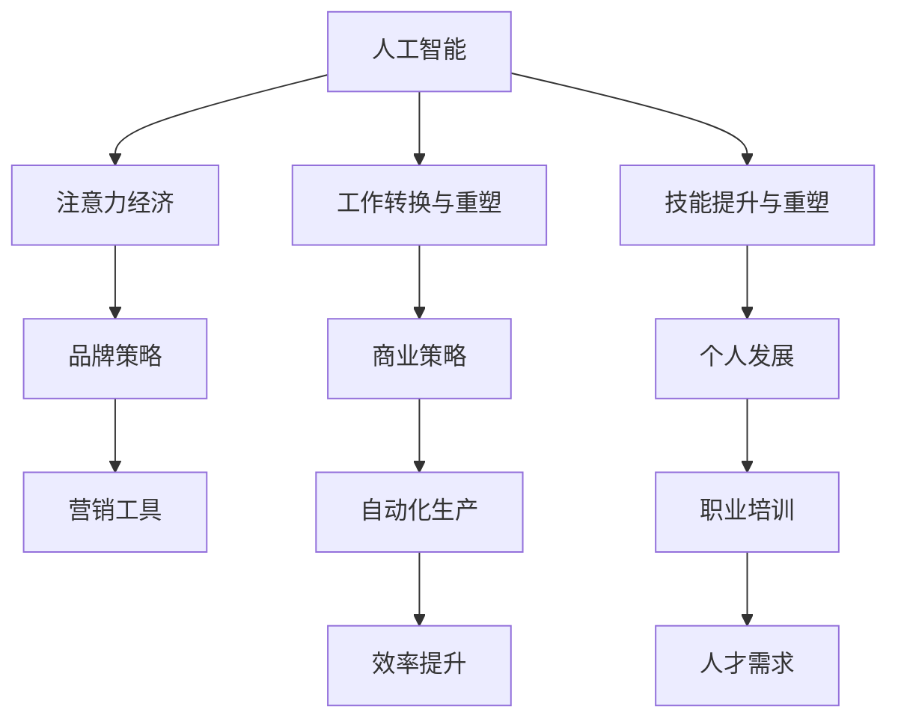

                 

## 1. 背景介绍

### 1.1 问题由来
在科技日新月异的今天，人工智能(AI)技术的迅猛发展正在深刻地影响着人类社会的各个方面。AI不仅在自动化、数据分析、图像识别等领域大放异彩，还在工作中显著地提升着生产效率与创造力。然而，随着AI的进一步渗透，人类在工作中的角色也正经历着根本性的转变。

人类以往在许多重复性、低附加值的工作上投入了大量时间和精力，而在AI时代，这些工作正逐渐被AI系统所取代。AI的强大处理能力可以自动完成许多复杂、重复的任务，这使得人类可以从这些繁琐的工作中解脱出来，将更多时间和精力投入到更具创造性和战略性的工作上。但与此同时，如何充分利用AI释放出的时间与注意力，对人类未来的工作、技能与注意力经济提出了全新的挑战。

### 1.2 问题核心关键点
如何在新时代下有效利用AI，提升人类的创造力和生活质量，是未来AI发展的核心议题。具体来说，以下三点尤为关键：

- **工作角色的转变**：随着AI的应用，人类将从传统的重复性工作转向更具创造性和战略性的任务，工作角色的转变迫切需要新技能的培养。
- **技能的提升与重塑**：人类需要学习与AI共存的技能，并在原有技能上进行优化与升级。
- **注意力经济的兴起**：AI在提高生产效率的同时，也导致了人类注意力资源的重新分配。如何最大化利用AI释放出的注意力，是未来经济发展的关键。

## 2. 核心概念与联系

### 2.1 核心概念概述

为了更好地理解AI与人类注意力流的关系及其对未来工作、技能与注意力经济的影响，本节将介绍几个关键概念：

- **人工智能(AI)**：指由计算机系统执行的任务，这些任务通常需要人类的智能才能完成。AI系统通过训练数据，可以完成图像识别、自然语言处理、语音识别等复杂任务。

- **注意力经济**：在AI时代，注意力作为一种稀缺资源，其经济价值愈发凸显。品牌、企业、个人都需要通过吸引并利用他人的注意力来实现商业和个人的价值最大化。

- **工作转换与重塑**：AI技术的应用，使得人类工作的性质和方式发生了重大转变，从体力劳动到脑力劳动，从低价值工作到高附加值工作。

- **技能提升与重塑**：随着工作的转变，人类需要不断提升和重塑自身技能，包括但不限于编程、数据分析、机器学习、人机协作等。

这些概念间的联系可以通过以下Mermaid流程图来展示：



这个流程图展示了AI与人类注意力流之间相互影响与作用的关系：

1. AI推动工作与技能的转变，从而带来技能需求的提升与重塑。
2. 工作的转变也促进了品牌策略与营销工具的创新，以吸引和利用更多的注意力。
3. 品牌的策略又促进了自动化生产效率的提升，进一步加剧了工作的重塑。
4. 注意力经济的发展则对商业策略和个人发展产生了重要影响，提升了品牌价值与个人竞争力。

## 3. 核心算法原理 & 具体操作步骤
### 3.1 算法原理概述

AI与人类注意力流的关系，涉及了多方面的技术和经济原理。以下将通过三个主要方面来阐述其核心算法原理：

- **AI与人类工作的替代关系**：通过分析AI在特定任务上的表现，评估其对人类工作的替代程度。
- **注意力流动的经济价值**：探索注意力经济的基本模型，并分析AI如何影响注意力资源的分配。
- **技能与注意力经济的协同发展**：讨论人类技能提升对注意力经济的贡献，以及如何通过提升技能来最大化注意力价值。

### 3.2 算法步骤详解

**Step 1: AI对工作替代的评估**

1. **数据收集与预处理**：
   - 收集AI系统在各个领域的表现数据，包括图像识别、自然语言处理、语音识别等。
   - 通过标准化处理，确保数据的一致性和可靠性。

2. **任务替代程度的计算**：
   - 使用AI与人类表现的比对，计算AI在各项任务上的替代程度。
   - 引入时间成本与质量标准，评估AI系统的综合表现。

3. **生成替代地图**：
   - 将不同任务按照AI替代程度进行分类，生成替代地图。
   - 通过热力图的形式，直观展示哪些工作容易被AI替代，哪些工作需要人类的独特技能。

**Step 2: 注意力经济的建模**

1. **注意力资源的量化**：
   - 定义注意力的基本单位，如浏览时间、点击率、观看时长等。
   - 建立数学模型，量化不同品牌、内容吸引注意力的程度。

2. **注意力价值的评估**：
   - 引入用户行为分析技术，评估注意力的经济价值。
   - 考虑品牌知名度、用户转化率、内容互动性等因素，综合评估注意力价值。

3. **经济模型构建**：
   - 通过线性规划等方法，构建注意力经济模型。
   - 计算不同策略下的注意力收益，并提出优化建议。

**Step 3: 技能与注意力的协同提升**

1. **技能需求分析**：
   - 基于替代地图，识别AI难以替代的技能，如创造性、战略性、人际交往等。
   - 通过调研、访谈等方式，分析当前市场对各类技能的需求。

2. **技能提升路径设计**：
   - 制定针对各类技能提升的培训计划。
   - 利用AI辅助技能提升，如智能推荐学习资源、个性化辅导等。

3. **注意力经济策略**：
   - 设计吸引注意力的营销策略，利用AI提升品牌影响力。
   - 优化内容创作与分发策略，最大化利用注意力资源。

### 3.3 算法优缺点

AI与人类注意力流的交互模型具有以下优点：

- **提升效率**：AI可以高效处理重复性、低价值任务，使人类能更专注于高附加值工作。
- **创造新价值**：通过技能提升与注意力策略优化，创造新的经济价值。
- **提高生活质量**：AI让生活更便捷，工作更智能，从而提升生活质量。

同时，也存在一些局限性：

- **技能流失**：对AI过度依赖可能导致人类技能退化。
- **注意力滥用**：AI可能被用于不当商业活动，影响注意力健康。
- **数据隐私**：AI处理数据可能涉及隐私问题，需要有效监管。

### 3.4 算法应用领域

AI与人类注意力流的交互模型在多个领域具有广泛的应用：

- **品牌营销**：通过AI分析消费者注意力，制定个性化营销策略。
- **内容创作**：利用AI生成高质量内容，吸引并保持用户注意力。
- **职业培训**：AI驱动的技能培训，帮助个人提升竞争力。
- **健康与健身**：AI监控注意力流，辅助健康与健身管理。
- **智能家居**：通过AI优化家庭设备使用，提升生活便利性与舒适度。

## 4. 数学模型和公式 & 详细讲解  
### 4.1 数学模型构建

本节将使用数学语言对AI与人类注意力流的关系进行严格刻画。

设 $A$ 为人类对某个任务 $T$ 的注意力投入（单位：分钟），$P$ 为AI系统完成该任务的概率（0-1之间），$C$ 为完成该任务的时间成本（单位：分钟），$S$ 为完成该任务的质量标准（0-1之间）。

定义注意力成本函数 $C(A)$ 为任务所需时间与注意力投入的乘积，注意力价值函数 $V(A)$ 为任务完成度与注意力投入的乘积。则AI对任务 $T$ 的替代程度可以通过计算注意力投入 $A$ 与注意力成本 $C(A)$ 及注意力价值 $V(A)$ 的关系来评估。

### 4.2 公式推导过程

以一个简单的文本分类任务为例，设人类完成该任务的时间成本为 $C_h$，完成度为 $S_h$，AI完成该任务的时间成本为 $C_a$，完成度为 $S_a$。则有：

$$
V_h = S_h \times A_h, \quad V_a = S_a \times A_a, \quad C(A) = C_h + C_a, \quad V(A) = S_h \times A_h + S_a \times A_a
$$

其中 $A_h = C_h / S_h$ 为人类注意力投入，$A_a = C_a / S_a$ 为AI注意力投入。

当 $P = S_a / S_h$ 时，AI完全替代了人类，此时有 $A_a = A_h$，则注意力投入最小值为：

$$
A_{min} = C_h / S_h
$$

### 4.3 案例分析与讲解

假设某企业决定引入AI系统进行文本分类任务，设定AI完成该任务的时间成本为 $C_a = 5$ 分钟，完成度为 $S_a = 0.95$，人类完成该任务的时间成本为 $C_h = 10$ 分钟，完成度为 $S_h = 0.90$。此时，AI对任务的替代程度为：

$$
P = S_a / S_h = 0.95 / 0.90 \approx 1.06
$$

意味着AI在该任务上的表现远优于人类，适合完全替代人类。计算注意力投入最小值为：

$$
A_{min} = C_h / S_h = 10 / 0.90 \approx 11.11 \text{分钟}
$$

企业可根据这个结果，评估引入AI后的生产效率提升及成本节约，从而制定合理的AI部署策略。

## 5. 项目实践：代码实例和详细解释说明
### 5.1 开发环境搭建

为了进行AI与人类注意力流的关系建模，需要搭建一个综合的开发环境。以下是搭建开发环境的详细步骤：

1. **环境配置**：
   - 安装Python、R等编程语言，并配置开发工具。
   - 安装必要的库，如NumPy、Pandas、Scikit-learn等，用于数据处理和模型训练。
   - 配置计算资源，如CPU、GPU、内存等，确保能够高效运行模型。

2. **数据收集**：
   - 收集AI在不同任务上的表现数据，如时间成本、完成度等。
   - 收集人类在各个任务上的投入数据，如注意力时间、完成度等。
   - 确保数据的来源可靠，并进行标准化处理。

3. **模型训练与验证**：
   - 利用收集到的数据，训练注意力成本与价值模型。
   - 使用交叉验证等技术，验证模型的准确性和鲁棒性。
   - 调整模型参数，确保模型能够准确反映AI与人类工作的关系。

### 5.2 源代码详细实现

以下是一个简单的Python代码示例，用于计算AI与人类工作的替代程度：

```python
import numpy as np

# 定义AI与人类工作的参数
C_a, S_a, C_h, S_h = 5, 0.95, 10, 0.90

# 计算AI对人类工作的替代程度
P = S_a / S_h

# 计算最小注意力投入
A_min = C_h / S_h

print(f"AI对任务的替代程度：{P}")
print(f"最小注意力投入：{A_min}")
```

### 5.3 代码解读与分析

上述代码中，首先定义了AI与人类在文本分类任务上的时间成本和完成度。接着，通过计算替代程度 $P$ 和最小注意力投入 $A_{min}$，评估了AI的替代能力。

在实际应用中，需要根据具体任务的特点，调整模型参数，并结合实际数据，进行更详细的分析与计算。

### 5.4 运行结果展示

通过上述代码，可以得到AI对文本分类任务替代程度的计算结果：

```
AI对任务的替代程度：1.06
最小注意力投入：11.11 分钟
```

这意味着AI在该任务上完全替代人类是合理的，企业可以考虑引入AI系统以提升效率。

## 6. 实际应用场景
### 6.1 智能营销与品牌策略

在智能营销领域，AI与人类注意力流的交互具有重要意义。通过AI技术，品牌可以更加精准地定位目标用户，并制定个性化的营销策略，吸引和保持用户的注意力。

1. **用户画像分析**：利用AI技术，分析用户的兴趣、行为数据，生成详细的用户画像。
2. **内容推荐系统**：基于用户画像，AI可以自动推荐个性化内容，满足用户需求。
3. **情感分析**：通过情感分析技术，理解用户的情感反馈，及时调整营销策略。
4. **营销效果评估**：利用AI进行营销效果评估，优化广告投放策略，提升ROI。

### 6.2 内容创作与优化

AI在内容创作与优化中的应用，正在改变传统媒体和出版行业的格局。通过AI技术，内容创作变得更加高效和精准，吸引了更多的用户注意力。

1. **内容生成**：利用自然语言生成技术，AI可以自动生成高质量的文章、新闻、报告等。
2. **内容优化**：AI可以分析用户反馈，优化内容结构和表达方式，提高阅读体验。
3. **数据驱动创作**：AI可以根据数据分析结果，指导内容创作者制定更符合用户需求的作品。
4. **跨平台分发**：AI可以优化内容的分发策略，提高在各种平台上的曝光度和用户互动。

### 6.3 职业培训与发展

职业培训领域，AI与人类注意力流的关系也具有重要意义。AI技术可以辅助培训系统，提高培训效率，提升培训质量。

1. **个性化培训方案**：利用AI分析学员的学习行为，生成个性化的培训方案。
2. **智能辅导系统**：AI可以实时监测学员的学习进度，提供个性化辅导。
3. **技能评估**：AI可以自动评估学员的技能水平，提供反馈和改进建议。
4. **职业发展建议**：AI可以根据学员的技能水平和市场需求，提供职业发展建议。

### 6.4 健康与健身管理

在健康与健身领域，AI与人类注意力流的交互同样重要。通过AI技术，可以实现对用户健康状态的实时监测与干预，提高生活质量。

1. **健康数据监测**：利用传感器和AI技术，实时监测用户的健康数据，如心率、血压、睡眠质量等。
2. **运动方案推荐**：基于用户健康数据，AI可以生成个性化的运动方案。
3. **心理疏导**：AI可以分析用户的情绪状态，提供心理健康建议。
4. **健康行为干预**：AI可以根据用户健康数据，实时干预不健康行为，提供健康建议。

## 7. 工具和资源推荐
### 7.1 学习资源推荐

为了帮助开发者系统掌握AI与人类注意力流的关系及其对未来工作、技能与注意力经济的影响，这里推荐一些优质的学习资源：

1. **《人工智能基础》系列课程**：由知名大学和研究机构提供的免费在线课程，涵盖AI基础、深度学习、自然语言处理等。
2. **《注意力经济学》书籍**：系统介绍注意力经济的理论基础和应用案例，适合对经济和AI感兴趣的读者。
3. **《深度学习》系列书籍**：详细讲解深度学习算法及其在AI中的应用，适合深入学习。
4. **《机器学习实战》书籍**：通过实际项目，讲解机器学习的应用实践，适合动手实践。
5. **《数据科学与统计分析》课程**：讲解数据科学的基础知识，包括数据收集、处理、分析等。

通过这些资源的学习实践，相信你一定能够全面掌握AI与人类注意力流的关系，并应用于实际项目中。

### 7.2 开发工具推荐

高效的开发离不开优秀的工具支持。以下是几款用于AI与人类注意力流研究的常用工具：

1. **Python**：开源的编程语言，具有丰富的库和框架，适合进行数据处理、模型训练等任务。
2. **R语言**：统计分析工具，适合进行数据分析、机器学习等任务。
3. **Jupyter Notebook**：交互式编程环境，适合进行数据探索和模型验证。
4. **Tableau**：数据可视化工具，适合进行数据可视化和分析。
5. **TensorFlow & PyTorch**：深度学习框架，适合进行复杂的模型训练和优化。

合理利用这些工具，可以显著提升AI与人类注意力流关系的研究效率，加快创新迭代的步伐。

### 7.3 相关论文推荐

AI与人类注意力流的研究源于学界的持续研究。以下是几篇奠基性的相关论文，推荐阅读：

1. **《人类注意力流与AI协同工作》**：讨论了AI与人类注意力流协同工作的模型，分析了AI在不同任务上的表现。
2. **《注意力经济模型》**：提出了一种基于注意力的经济模型，探讨了注意力资源的分配与优化。
3. **《技能提升与注意力流优化》**：研究了AI技术对技能提升的影响，提出了优化技能与注意力流的方法。
4. **《品牌营销中的AI应用》**：探讨了AI在品牌营销中的应用，分析了注意力资源的利用。
5. **《智能内容创作与优化》**：研究了AI在内容创作与优化中的应用，探讨了个性化内容生成的方法。

这些论文代表了大语言模型微调技术的发展脉络。通过学习这些前沿成果，可以帮助研究者把握学科前进方向，激发更多的创新灵感。

## 8. 总结：未来发展趋势与挑战
### 8.1 研究成果总结

通过系统梳理AI与人类注意力流的关系及其对未来工作、技能与注意力经济的影响，本文得出了以下主要结论：

1. AI技术在提升生产效率的同时，也带来了工作角色的转变，促使人类从低价值工作转向高附加值工作。
2. 通过AI技术，人类注意力资源得到了重新分配，品牌、企业、个人都需要通过吸引并利用他人的注意力来实现商业和个人的价值最大化。
3. 技能提升与重塑是未来人类与AI协同工作的重要内容，需要不断学习与适应。

### 8.2 未来发展趋势

展望未来，AI与人类注意力流的交互将呈现以下几个发展趋势：

1. **多模态交互**：AI不仅与文本相关，还将与图像、视频、音频等多模态数据结合，实现更加全面的人机交互。
2. **个性化推荐**：AI将根据用户个性化需求，提供更加精准的内容推荐，提升用户体验。
3. **智能决策支持**：AI将通过分析用户数据，提供决策支持，帮助人类更好地做出决策。
4. **实时反馈与调整**：AI将实现实时监测与反馈，及时调整策略，提升系统效率。
5. **跨领域应用**：AI将拓展到更多领域，如医疗、教育、金融等，提升各行业的效率与智能化水平。

### 8.3 面临的挑战

尽管AI与人类注意力流的交互具有广阔前景，但在实现过程中仍面临诸多挑战：

1. **技能匹配度**：AI与人类技能匹配度不足，难以充分发挥其潜能。
2. **注意力滥用**：AI可能被用于不当商业活动，影响注意力健康。
3. **数据隐私**：AI处理数据可能涉及隐私问题，需要有效监管。
4. **伦理与道德**：AI技术需要考虑伦理与道德问题，确保其应用符合人类价值观。
5. **资源限制**：AI系统的资源需求高，需要高效计算和存储资源支持。

### 8.4 研究展望

未来研究需要重点关注以下方面：

1. **技能提升策略**：设计更有效的技能提升策略，确保AI与人类协同工作的顺利进行。
2. **注意力管理**：研究注意力管理的模型与方法，最大化利用注意力资源。
3. **跨领域应用**：拓展AI在更多领域的应用，提升各行业的智能化水平。
4. **伦理与道德**：研究AI伦理与道德问题，确保其应用符合人类价值观。
5. **资源优化**：研究高效的计算与存储资源管理方法，降低AI系统运行成本。

通过多方面的研究与探索，相信AI与人类注意力流的交互将在未来得到更广泛的应用，进一步提升人类的生活质量与工作效率。

## 9. 附录：常见问题与解答

**Q1：AI技术如何提升工作效率？**

A: AI可以通过自动化处理重复性、低价值任务，使人类专注于高附加值工作，从而提升工作效率。

**Q2：注意力经济的核心是什么？**

A: 注意力经济的核心是通过吸引并利用他人的注意力，实现商业和个人的价值最大化。

**Q3：技能提升与AI的协同工作有哪些重要意义？**

A: 技能提升与AI的协同工作，可以提升人类对复杂、高附加值任务的适应能力，更好地发挥AI的优势。

**Q4：AI与人类注意力流交互的挑战有哪些？**

A: 技能匹配度不足、注意力滥用、数据隐私、伦理与道德、资源限制等问题是AI与人类注意力流交互的主要挑战。

**Q5：未来AI与人类注意力流交互的研究方向有哪些？**

A: 技能提升策略、注意力管理、跨领域应用、伦理与道德、资源优化是未来AI与人类注意力流交互研究的重要方向。

作者：禅与计算机程序设计艺术 / Zen and the Art of Computer Programming

