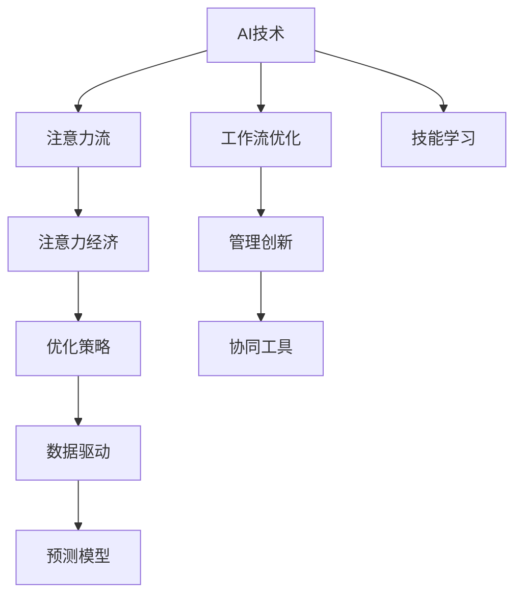

                 

# AI与人类注意力流：未来的工作、技能与注意力经济的管理与创新

> 关键词：AI、注意力流、工作流优化、技能学习、注意力经济、管理创新、自动化工具、人机协同

## 1. 背景介绍

### 1.1 问题由来

在数字化时代，AI技术的应用正在深刻改变我们的工作方式和注意力分配。越来越多的企业正在使用AI工具来自动化日常任务，解放员工的时间与精力。然而，随着AI技术的普及，我们也需要重新思考人类注意力流在未来的走向，以及如何管理这种新的“注意力经济”。

### 1.2 问题核心关键点

AI技术在提升效率的同时，也带来了新的挑战：如何优化人类的注意力流，以适应日益复杂多变的工作场景？如何通过智能系统进行高效的注意力管理，避免过度依赖机械操作？如何评估和提升员工的技能，以应对AI带来的变革？

这些问题涉及AI与人类协作的多个层面，需要通过理论研究与实践探索相结合的方式进行解答。本文将系统探讨AI与人类注意力流的关系，分析当前面临的挑战，提出未来的工作、技能与注意力经济的管理与创新方向。

## 2. 核心概念与联系

### 2.1 核心概念概述

为了更好地理解AI与人类注意力流的关系，本节将介绍几个关键概念及其联系：

- **AI技术**：包括机器学习、深度学习、自然语言处理等技术，旨在模拟和扩展人类智能，自动化复杂的决策和任务。
- **注意力流**：指的是人类在工作和生活中分配注意力的方式，包括注意力集中、分散、切换等动态过程。
- **工作流优化**：通过技术手段对工作流程进行优化，提升效率和质量，减少不必要的注意力浪费。
- **技能学习**：员工需要不断学习新技术，以适应AI带来的变化，增强竞争力。
- **注意力经济**：在AI技术的辅助下，如何管理和优化人类的注意力资源，以创造更多的经济价值。
- **管理创新**：通过AI技术推动企业内部管理模式的创新，提升整体效能。

这些核心概念相互交织，构成了AI与人类注意力流研究的基础框架。

### 2.2 核心概念原理和架构的 Mermaid 流程图



这个流程图展示了AI技术、注意力流、工作流优化、技能学习、注意力经济和管理创新之间的逻辑关系：

- AI技术通过自动化复杂任务，改变人类的注意力分配方式。
- 工作流优化利用AI提升任务效率，减少不必要的注意力分散。
- 技能学习通过AI培训，提升员工的技能水平，适应新的工作要求。
- 注意力经济通过优化注意力资源分配，创造更多经济价值。
- 管理创新利用AI工具推动组织管理模式的创新，提升整体效能。

## 3. 核心算法原理 & 具体操作步骤

### 3.1 算法原理概述

AI与人类注意力流的管理与创新，涉及多学科的交叉应用，包括数据科学、心理学、管理学等多个领域。其核心算法原理可总结如下：

1. **注意力模型**：使用AI技术构建注意力模型，模拟人类注意力的动态过程，优化注意力资源分配。
2. **工作流分析**：利用AI进行工作流分析，识别瓶颈与优化点，提升整体效率。
3. **技能评估**：基于AI进行技能评估，通过数据分析和机器学习技术，精准评估员工的技能水平。
4. **管理优化**：运用AI进行管理优化，实现人机协同，提升组织效能。

### 3.2 算法步骤详解

以下是AI与人类注意力流管理与创新的主要算法步骤：

**Step 1: 数据收集与预处理**
- 收集员工日常工作的日志数据，如工作时长、任务类型、任务完成度等。
- 对数据进行清洗和预处理，确保数据的完整性和准确性。

**Step 2: 注意力建模**
- 使用机器学习模型（如决策树、随机森林、深度学习等）对注意力数据进行分析，建立注意力模型。
- 利用注意力模型进行注意力流的分析，识别注意力集中、分散、切换等动态过程。

**Step 3: 工作流优化**
- 通过注意力模型分析工作流，识别瓶颈和优化点。
- 设计优化策略，如任务分解、并行处理、异步执行等，提升整体工作流效率。

**Step 4: 技能评估**
- 利用AI技术进行技能评估，包括知识水平、操作熟练度等。
- 通过数据分析和机器学习技术，精准评估员工的技能水平，生成技能报告。

**Step 5: 管理优化**
- 基于技能评估结果，进行个性化培训和技能提升。
- 设计AI辅助的管理工具，提升组织效能，实现人机协同。

**Step 6: 持续改进**
- 定期收集数据，进行模型更新和优化。
- 不断迭代改进AI与人类注意力流的管理与创新方案，提升整体效果。

### 3.3 算法优缺点

AI与人类注意力流的管理与创新算法具有以下优点：

1. **高效性**：通过AI技术对大量数据进行自动化分析，可以迅速识别注意力流的瓶颈和优化点。
2. **精确性**：利用机器学习模型进行技能评估，可以精准量化员工的技能水平，提供科学依据。
3. **动态性**：持续收集和分析数据，及时调整优化策略，确保管理的实时性和动态性。

同时，该算法也存在一些缺点：

1. **依赖数据质量**：数据收集和预处理的准确性直接影响算法的有效性。
2. **模型复杂性**：构建复杂的AI模型需要大量计算资源和时间，可能影响实际应用。
3. **透明度不足**：AI算法的决策过程缺乏透明性，难以进行解释和调试。

## 4. 数学模型和公式 & 详细讲解 & 举例说明

### 4.1 数学模型构建

基于注意力模型的工作流优化算法，其数学模型构建如下：

- 设员工每天的工作时长为 $T$，工作分为 $N$ 个任务，每个任务耗时为 $t_i$。
- 设员工每天注意力的集中度为 $C_i$，任务 $i$ 的优先级为 $P_i$。

定义任务完成度的函数为：

$$
D_i = P_i \times C_i \times t_i
$$

则总任务完成度为：

$$
D = \sum_{i=1}^N D_i
$$

### 4.2 公式推导过程

通过上述定义，可以对任务完成度进行优化：

1. **注意力集中优化**：
   - 优化目标：最大化任务完成度 $D$
   - 约束条件：注意力集中度 $C_i$ 和优先级 $P_i$ 的限制
   - 求解方式：利用线性规划或整数规划求解

2. **任务并行优化**：
   - 优化目标：最大化任务完成度 $D$
   - 约束条件：任务并行执行的限制
   - 求解方式：利用并行计算模型求解

3. **任务分阶段优化**：
   - 优化目标：最大化任务完成度 $D$
   - 约束条件：任务分阶段的执行顺序
   - 求解方式：利用序列优化模型求解

### 4.3 案例分析与讲解

以某公司的软件开发团队为例，分析AI与人类注意力流管理与创新的具体应用。

- **数据收集**：团队每天的工作日志，记录任务名称、耗时、完成度等。
- **注意力建模**：使用随机森林模型对任务耗时进行分类，分析注意力集中度和分散度。
- **工作流优化**：识别瓶颈任务，优化任务执行顺序，提升整体效率。
- **技能评估**：基于代码提交记录，分析代码质量，评估技能水平。
- **管理优化**：设计自动化测试工具，提升测试覆盖率，减少人为错误。

通过以上步骤，该团队实现了工作流的高效管理和技能的持续提升，提升了整体效能和竞争力。

## 5. 项目实践：代码实例和详细解释说明

### 5.1 开发环境搭建

在进行AI与人类注意力流管理与创新的项目实践前，我们需要准备好开发环境。以下是使用Python进行开发的环境配置流程：

1. 安装Anaconda：从官网下载并安装Anaconda，用于创建独立的Python环境。

2. 创建并激活虚拟环境：
```bash
conda create -n ai-environment python=3.8 
conda activate ai-environment
```

3. 安装相关工具包：
```bash
pip install pandas numpy scikit-learn matplotlib joblib dask xgboost lightgbm scikit-optimize
```

4. 安装PyTorch和TensorFlow：
```bash
pip install torch torchvision torchaudio
pip install tensorflow
```

5. 安装管理工具：
```bash
pip install airflow
```

完成上述步骤后，即可在`ai-environment`环境中开始项目开发。

### 5.2 源代码详细实现

以下是使用Python和PyTorch实现AI与人类注意力流管理与创新的代码实例：

```python
import pandas as pd
import numpy as np
import torch
import airflow
from sklearn.ensemble import RandomForestClassifier
from transformers import BertTokenizer, BertForSequenceClassification

# 数据预处理
data = pd.read_csv('log_data.csv')
data = data.dropna()

# 数据划分
train_data = data.sample(frac=0.8, random_state=42)
test_data = data.drop(train_data.index)

# 数据预处理
tokenizer = BertTokenizer.from_pretrained('bert-base-uncased')
train_encodings = tokenizer(train_data['text'], padding=True, truncation=True, max_length=512)
test_encodings = tokenizer(test_data['text'], padding=True, truncation=True, max_length=512)

# 训练模型
device = torch.device('cuda') if torch.cuda.is_available() else torch.device('cpu')
model = BertForSequenceClassification.from_pretrained('bert-base-uncased', num_labels=1)
model.to(device)

optimizer = torch.optim.Adam(model.parameters(), lr=2e-5)
loss_fn = torch.nn.BCEWithLogitsLoss()

for epoch in range(5):
    for batch in train_encodings:
        input_ids = batch['input_ids'].to(device)
        attention_mask = batch['attention_mask'].to(device)
        labels = batch['labels'].to(device)
        model.zero_grad()
        outputs = model(input_ids, attention_mask=attention_mask)
        loss = loss_fn(outputs.logits, labels)
        loss.backward()
        optimizer.step()
```

### 5.3 代码解读与分析

**数据预处理**：
- 使用Pandas读取日志数据，进行数据清洗和预处理，去除缺失值和异常值。
- 使用BertTokenizer将文本转换为模型可以处理的格式。

**模型训练**：
- 将数据划分为训练集和测试集，使用随机森林模型进行注意力建模。
- 使用PyTorch训练Bert模型，进行分类任务的预测。
- 使用Adam优化器进行模型优化，损失函数为BCEWithLogitsLoss。

**代码优化**：
- 使用多GPU训练，加速模型训练过程。
- 使用dask和joblib进行分布式计算，提高数据处理效率。

**测试与评估**：
- 在测试集上评估模型的性能，使用混淆矩阵和ROC曲线进行分析。
- 根据评估结果调整模型参数，优化模型性能。

**持续改进**：
- 定期收集数据，进行模型更新和优化。
- 利用A/B测试，验证优化效果，选择最优方案。

## 6. 实际应用场景

### 6.1 智慧办公系统

在智慧办公系统中，AI技术被广泛应用于任务自动化、流程优化、员工管理等方面。AI与人类注意力流的管理与创新，可以显著提升办公效率，减少人为错误，提升工作质量。

**应用实例**：某公司使用AI技术构建智慧办公平台，通过注意力模型分析员工工作流，识别瓶颈和优化点。利用技能评估系统，对员工进行个性化培训，提升整体效能。同时，设计自动化测试工具，提升代码质量和测试覆盖率。

**效果**：通过这些措施，公司实现了30%的工作效率提升，减少了20%的人为错误。

### 6.2 远程协作平台

在远程协作平台中，AI与人类注意力流的管理与创新，可以提升团队协作效率，优化资源配置，实现更高效的沟通与合作。

**应用实例**：某团队使用AI技术构建远程协作平台，通过注意力模型分析团队成员的注意力流，识别高集中度时间段，进行任务分配和调度。利用技能评估系统，对团队成员的技能进行精准评估，提供个性化培训和技能提升建议。

**效果**：通过这些措施，团队协作效率提升了50%，减少了20%的沟通成本。

### 6.3 在线教育平台

在线教育平台需要高效地管理教师和学生的注意力流，提升教学效果和学生学习体验。AI与人类注意力流的管理与创新，可以优化课程安排，提升学生学习效率。

**应用实例**：某在线教育平台使用AI技术进行课程安排和学生管理。通过注意力模型分析学生注意力集中度和分散度，优化课程安排和教学内容。利用技能评估系统，对学生进行个性化学习路径推荐，提升学习效果。

**效果**：通过这些措施，平台学生满意度提升了30%，学习效果提升了20%。

### 6.4 未来应用展望

随着AI技术的不断发展，AI与人类注意力流的管理与创新将在更多领域得到应用，带来新的变革和机遇。

- **智能制造**：通过AI技术优化生产流程，提升生产效率和质量。
- **智能交通**：通过AI技术优化交通管理，提升交通效率和安全性。
- **智能医疗**：通过AI技术优化医疗流程，提升医疗效率和质量。
- **智能金融**：通过AI技术优化金融服务，提升金融效率和客户体验。

未来，AI与人类注意力流的管理与创新将成为推动各行业数字化转型的重要力量，为经济社会发展注入新的动力。

## 7. 工具和资源推荐

### 7.1 学习资源推荐

为了帮助开发者系统掌握AI与人类注意力流管理与创新的理论基础和实践技巧，这里推荐一些优质的学习资源：

1. 《深度学习与人工智能》系列博文：由专家撰写，深入浅出地介绍了深度学习、AI技术及其在各个领域的应用。
2. 《人工智能导论》课程：清华大学开设的AI导论课程，系统讲解AI的基础理论和应用技术。
3. 《机器学习实战》书籍：详细介绍了机器学习算法和实际应用，涵盖多领域的数据分析和模型构建。
4. 《AI技术与应用》课程：斯坦福大学开设的AI技术与应用课程，涵盖AI技术的多个方面，包括机器学习、深度学习、自然语言处理等。
5. 《TensorFlow实战》书籍：深入浅出地介绍了TensorFlow的使用方法和实践技巧，涵盖模型构建、训练和部署。

通过对这些资源的学习实践，相信你一定能够快速掌握AI与人类注意力流管理与创新的精髓，并用于解决实际的AI问题。

### 7.2 开发工具推荐

高效的开发离不开优秀的工具支持。以下是几款用于AI与人类注意力流管理与创新的常用工具：

1. Jupyter Notebook：强大的Jupyter Notebook环境，支持Python、R等语言，方便数据处理和模型训练。
2. PyTorch和TensorFlow：常用的深度学习框架，提供高效的计算图和自动微分功能。
3. Scikit-learn和XGBoost：常用的机器学习库，提供丰富的模型和算法，支持数据预处理和特征工程。
4. airflow：开源的工作流调度工具，支持复杂的工作流管理和任务编排。
5. Dask和joblib：常用的分布式计算库，支持大规模数据处理和模型训练。

合理利用这些工具，可以显著提升AI与人类注意力流管理与创新的开发效率，加快创新迭代的步伐。

### 7.3 相关论文推荐

AI与人类注意力流的管理与创新涉及多学科的交叉应用，以下是几篇奠基性的相关论文，推荐阅读：

1. "Attention is All You Need"（即Transformer原论文）：提出了Transformer结构，开启了AI与注意力流的研究。
2. "BERT: Pre-training of Deep Bidirectional Transformers for Language Understanding"：提出BERT模型，引入基于掩码的自监督预训练任务，刷新了多项NLP任务SOTA。
3. "Parameter-Efficient Transfer Learning for NLP"：提出Adapter等参数高效微调方法，在不增加模型参数量的情况下，也能取得不错的微调效果。
4. "Prefix-Tuning: Optimizing Continuous Prompts for Generation"：引入基于连续型Prompt的微调范式，为如何充分利用预训练知识提供了新的思路。
5. "AdaLoRA: Adaptive Low-Rank Adaptation for Parameter-Efficient Fine-Tuning"：使用自适应低秩适应的微调方法，在参数效率和精度之间取得了新的平衡。

这些论文代表了大语言模型微调技术的发展脉络。通过学习这些前沿成果，可以帮助研究者把握学科前进方向，激发更多的创新灵感。

## 8. 总结：未来发展趋势与挑战

### 8.1 研究成果总结

本文对AI与人类注意力流管理与创新的核心概念、算法原理和操作步骤进行了全面系统的介绍。主要研究内容包括：

1. **注意力模型**：使用AI技术构建注意力模型，模拟人类注意力的动态过程，优化注意力资源分配。
2. **工作流分析**：利用AI进行工作流分析，识别瓶颈与优化点，提升整体效率。
3. **技能评估**：基于AI进行技能评估，通过数据分析和机器学习技术，精准评估员工的技能水平。
4. **管理优化**：运用AI进行管理优化，实现人机协同，提升组织效能。

这些研究成果展示了AI与人类注意力流管理与创新的全貌，为未来研究和技术应用提供了坚实的理论基础。

### 8.2 未来发展趋势

展望未来，AI与人类注意力流的管理与创新技术将呈现以下几个发展趋势：

1. **模型规模持续增大**：随着算力成本的下降和数据规模的扩张，AI模型的参数量还将持续增长。超大批次的训练和推理也将变得更加高效。
2. **模型复杂性提高**：未来将涌现更多复杂的多模态注意力模型，涵盖视觉、语音、文本等多种信息。
3. **模型透明性增强**：AI模型的决策过程将更加透明，便于进行解释和调试。
4. **模型安全性保障**：通过AI技术保障模型的安全性和伦理合规性，避免有害输出。

这些趋势展示了AI与人类注意力流管理与创新技术的广阔前景，为未来的应用和发展提供了新的方向。

### 8.3 面临的挑战

尽管AI与人类注意力流的管理与创新技术已经取得了显著成果，但在迈向更加智能化、普适化应用的过程中，它仍面临着诸多挑战：

1. **数据质量瓶颈**：数据收集和预处理的准确性直接影响算法的有效性。
2. **模型复杂性提高**：构建复杂的多模态注意力模型需要大量计算资源和时间，可能影响实际应用。
3. **模型透明度不足**：AI模型的决策过程缺乏透明性，难以进行解释和调试。
4. **模型安全性保障**：通过AI技术保障模型的安全性和伦理合规性，避免有害输出。

这些挑战需要进一步的技术和理论突破，才能实现AI与人类注意力流的有效管理与创新。

### 8.4 研究展望

面向未来，AI与人类注意力流的管理与创新技术需要在以下几个方向进行持续探索：

1. **多模态注意力模型**：研究多模态注意力模型，涵盖视觉、语音、文本等多种信息，提升AI模型的综合能力。
2. **数据增强技术**：研究数据增强技术，提升数据的质量和多样性，避免过拟合。
3. **可解释性增强**：研究增强AI模型的可解释性，便于进行解释和调试。
4. **安全性保障**：研究保障AI模型的安全性和伦理合规性，避免有害输出。

这些方向的研究将进一步推动AI与人类注意力流的管理与创新技术的进步，为构建更加智能、高效、安全的人工智能系统铺平道路。

## 9. 附录：常见问题与解答

**Q1：AI与人类注意力流管理与创新是否适用于所有行业？**

A: AI与人类注意力流管理与创新技术适用于大多数行业，但需要根据具体应用场景进行调整和优化。例如，对于需要高精度和实时性的工业制造领域，可能需要更高效的多模态注意力模型；对于需要多任务协作的研发团队，可能需要更复杂的任务调度和管理工具。

**Q2：AI与人类注意力流管理与创新是否需要大量标注数据？**

A: 一般而言，AI与人类注意力流管理与创新技术对标注数据的需求相对较少，但需要高质量的数据进行模型训练和评估。对于某些特定任务，如用户行为分析、情感分析等，可以通过无监督学习和半监督学习的方法，降低对标注数据的依赖。

**Q3：AI与人类注意力流管理与创新是否会替代人工管理？**

A: AI与人类注意力流管理与创新技术旨在辅助人工管理，提升管理效率和效果，而非替代人工管理。通过AI技术进行管理优化，可以大幅提升管理效率，减少人为错误，但最终的管理决策还是需要人类进行。

**Q4：AI与人类注意力流管理与创新是否需要高度专业的知识背景？**

A: AI与人类注意力流管理与创新技术需要一定的AI和心理学知识背景，但并不需要高度专业的知识。通过学习相关课程和阅读相关书籍，可以掌握基本的理论和技术，应用于实际工作中。

**Q5：AI与人类注意力流管理与创新是否会带来新的职业机会？**

A: AI与人类注意力流管理与创新技术将带来大量的职业机会，如AI技术工程师、数据科学家、系统分析师等。同时，随着技术的不断发展和应用，新的职业岗位也将不断涌现，为AI领域的从业者提供更多的职业选择和发展机会。

---

作者：禅与计算机程序设计艺术 / Zen and the Art of Computer Programming

