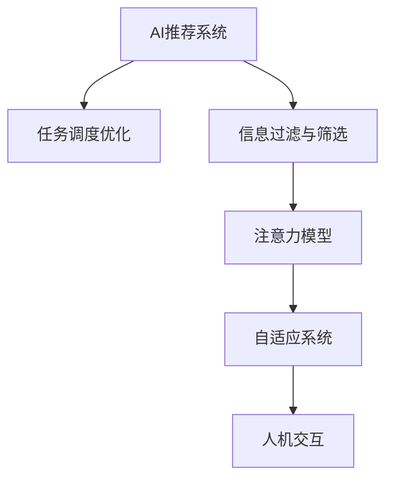

                 

# AI与人类注意力流：未来的工作、生活与注意力管理技术的创新

## 1. 背景介绍

### 1.1 问题由来

在信息爆炸的时代，人类社会正经历着一场前所未有的注意力革命。AI技术尤其是智能推荐、自动化办公、智能家居等，正在重塑人们的工作和生活方式。与此同时，注意力管理问题也日益凸显，如何高效管理注意力资源，成为现代社会面临的重要课题。

传统的注意力管理方法，如GTD（Getting Things Done）、番茄工作法等，主要依赖于手工操作和时间规划，难以适应高度信息化、自动化环境的需求。AI与注意力管理的融合，将开启全新的未来，提升生产力和生活品质。

### 1.2 问题核心关键点

当前AI在注意力管理领域的应用，主要集中在智能推荐、任务调度、信息过滤等方面。其核心关键点包括：

- 智能推荐系统：通过数据分析和机器学习，实时推荐用户感兴趣的内容，提高信息获取效率。
- 任务调度优化：利用AI算法对任务进行高效安排，避免时间浪费，提高工作效率。
- 信息过滤与筛选：通过算法对大量信息进行过滤和分类，减少用户的信息负担。

这些技术的应用，显著提高了信息管理的能力，但同时也带来了新的挑战，如数据隐私、系统安全性等。如何有效平衡技术创新与伦理道德，是未来发展的重要方向。

### 1.3 问题研究意义

研究AI与人类注意力流的融合，对于提升工作和生活效率，改善用户体验，具有重要意义：

1. 提升生产力：智能推荐、任务调度等技术的应用，可以大幅提升工作效率，减少重复性劳动。
2. 提高信息获取效率：AI能够快速过滤和分类信息，帮助用户快速找到所需内容，提高信息获取效率。
3. 改善用户体验：个性化推荐、智能家居等技术，能够提升用户体验，让工作和生活更加便捷。
4. 增强安全性：AI系统可以对信息进行智能筛选和过滤，减少安全风险，保护用户隐私。
5. 适应未来趋势：随着AI技术的不断进步，AI与人类注意力流的融合将成为未来智能化的重要标志。

本文将深入探讨AI与人类注意力流的融合，从技术实现、应用场景到伦理道德，全面解析这一领域的最新进展和未来发展趋势。

## 2. 核心概念与联系

### 2.1 核心概念概述

为更好地理解AI与人类注意力流的融合，本节将介绍几个关键概念：

- **AI推荐系统**：通过数据分析和机器学习，实时推荐用户感兴趣的内容，提高信息获取效率。
- **任务调度优化**：利用AI算法对任务进行高效安排，避免时间浪费，提高工作效率。
- **信息过滤与筛选**：通过算法对大量信息进行过滤和分类，减少用户的信息负担。
- **注意力模型**：通过对人类注意力机制的研究，建立模型以指导AI系统的设计和应用。
- **自适应系统**：能够根据用户行为和环境变化，动态调整算法策略的系统。
- **人机交互**：人类与AI系统的交互方式，包括自然语言处理、情感识别等技术。

这些概念之间的逻辑关系可以通过以下Mermaid流程图来展示：



这个流程图展示了几大核心概念及其之间的关系：

1. AI推荐系统通过分析用户行为数据，推荐个性化的信息内容。
2. 任务调度优化利用AI算法，对用户的工作任务进行高效安排。
3. 信息过滤与筛选通过算法筛选有价值的信息，减少用户的信息负担。
4. 注意力模型研究人类注意力机制，为AI系统提供设计依据。
5. 自适应系统根据用户行为和环境变化，动态调整算法策略。
6. 人机交互通过自然语言处理、情感识别等技术，提升用户体验。

这些概念共同构成了AI与人类注意力流融合的技术框架，推动了智能技术在日常生活中的广泛应用。

## 3. 核心算法原理 & 具体操作步骤

### 3.1 算法原理概述

AI与人类注意力流的融合，本质上是利用AI算法对注意力资源进行智能管理。其核心思想是：通过算法实时分析用户的行为和环境变化，动态调整注意力分配策略，从而提高生产力和生活品质。

形式化地，假设用户当前任务集为 $T=\{t_1,t_2,...,t_N\}$，注意力资源为 $A=\{a_1,a_2,...,a_M\}$。假设任务 $t_i$ 对注意力资源 $a_j$ 的需求为 $d_{i,j}$，AI系统的目标是最小化总成本，即：

$$
\min \sum_{i=1}^N \sum_{j=1}^M d_{i,j}a_j
$$

在实际应用中，通常使用强化学习、深度学习等算法来求解上述最优化问题。通过不断调整注意力分配策略，使系统能够更智能地管理用户注意力资源。

### 3.2 算法步骤详解

基于AI与人类注意力流的融合，其主要算法步骤包括：

**Step 1: 数据采集与预处理**
- 收集用户的行为数据，如浏览记录、操作日志等，作为训练数据。
- 对数据进行清洗和标准化，去除噪声和异常数据，保证数据质量。

**Step 2: 建立注意力模型**
- 根据注意力模型原理，建立用户注意力流模型。通常使用神经网络模型，如GRU、LSTM等。
- 利用历史行为数据对模型进行训练，使其能够预测用户当前和未来的注意力需求。

**Step 3: 推荐与调度**
- 根据用户当前任务集和注意力模型，利用推荐算法（如协同过滤、基于内容的推荐等）推荐用户感兴趣的信息。
- 利用任务调度算法（如遗传算法、蚁群算法等）对用户任务进行安排，优化工作流程。

**Step 4: 信息过滤与筛选**
- 对推荐和调度结果进行过滤和筛选，去除无关信息和低价值任务。
- 利用信息过滤算法（如协同过滤、基于语义的过滤等）对信息进行分类和排序，提升信息获取效率。

**Step 5: 动态调整与优化**
- 实时监测用户行为和环境变化，动态调整注意力分配策略。
- 根据用户反馈和新数据，不断优化模型参数，提升系统性能。

### 3.3 算法优缺点

基于AI与人类注意力流的融合方法具有以下优点：

1. 提高效率：通过智能推荐和任务调度，显著提高信息获取和工作效率。
2. 个性化服务：根据用户行为和偏好，提供个性化的信息和服务。
3. 减少信息负担：通过信息过滤和筛选，减少用户的信息负担，提升信息获取质量。
4. 动态调整：能够根据环境变化和用户需求，动态调整注意力分配策略。

同时，该方法也存在一定的局限性：

1. 数据依赖性强：系统性能依赖于用户行为数据的完整性和准确性。
2. 隐私和安全问题：用户数据收集和处理可能带来隐私和安全风险。
3. 模型复杂度高：算法复杂度高，模型训练和调参成本较高。
4. 系统鲁棒性差：系统对异常情况和意外事件的应对能力较弱。

尽管存在这些局限性，但AI与人类注意力流的融合方法在实际应用中已经展现了巨大的潜力和价值，成为未来智能化的重要方向。

### 3.4 算法应用领域

基于AI与人类注意力流的融合方法，已经在诸多领域得到广泛应用，例如：

- **智能推荐系统**：电商、新闻、视频等领域的应用，通过数据分析和推荐算法，提高信息获取效率。
- **任务调度优化**：企业自动化办公、项目管理等领域的应用，通过任务调度算法，优化工作流程，提高工作效率。
- **信息过滤与筛选**：社交网络、电子邮件、搜索系统等领域的应用，通过信息过滤算法，减少信息负担，提升用户体验。
- **智能家居**：通过AI技术对家居设备进行智能管理，提升家庭生活品质。
- **智能办公**：智能会议系统、文档管理等领域的应用，通过AI技术优化办公流程，提高办公效率。
- **智能交通**：通过AI技术对交通数据进行分析，优化交通流量，提升交通管理效率。

此外，AI与人类注意力流的融合还在更多领域得到创新应用，如医疗、教育、金融等，为各行各业带来智能化变革。

## 4. 数学模型和公式 & 详细讲解 & 举例说明（备注：数学公式请使用latex格式，latex嵌入文中独立段落使用 $$，段落内使用 $)
### 4.1 数学模型构建

本节将使用数学语言对AI与人类注意力流的融合过程进行更加严格的刻画。

假设用户当前任务集为 $T=\{t_1,t_2,...,t_N\}$，注意力资源为 $A=\{a_1,a_2,...,a_M\}$。任务 $t_i$ 对注意力资源 $a_j$ 的需求为 $d_{i,j}$，设 $D=(d_{i,j})_{N\times M}$ 为需求矩阵。假设AI系统的目标是最小化总成本，即：

$$
\min \sum_{i=1}^N \sum_{j=1}^M d_{i,j}a_j
$$

在实际应用中，通常使用基于线性规划的优化算法求解上述最优化问题，如单纯形法、内点法等。设 $A=(a_1,a_2,...,a_M)^T$ 为注意力向量，$D=(d_{i,j})_{N\times M}$ 为需求矩阵，目标函数为 $f(A)=\sum_{i=1}^N \sum_{j=1}^M d_{i,j}a_j$。目标函数的拉格朗日函数为：

$$
\mathcal{L}(A,\lambda)=f(A)+\lambda \sum_{i=1}^N \sum_{j=1}^M d_{i,j}a_j
$$

其中 $\lambda$ 为拉格朗日乘子，$D=(d_{i,j})_{N\times M}$ 为需求矩阵。拉格朗日乘子 $\lambda$ 的求解过程可以通过对偶问题进行求解。

### 4.2 公式推导过程

以推荐系统为例，设用户当前任务集为 $T=\{t_1,t_2,...,t_N\}$，注意力资源为 $A=\{a_1,a_2,...,a_M\}$。设 $D=(d_{i,j})_{N\times M}$ 为需求矩阵，其中 $d_{i,j}$ 表示任务 $t_i$ 对注意力资源 $a_j$ 的需求。假设用户的行为数据为 $X=\{x_1,x_2,...,x_M\}$，其中 $x_i$ 表示任务 $t_i$ 在注意力资源 $a_j$ 上的行为数据。

设推荐系统为 $R=\{r_1,r_2,...,r_M\}$，其中 $r_i$ 表示任务 $t_i$ 在注意力资源 $a_j$ 上的推荐结果。推荐系统的目标函数为：

$$
f(A)=\sum_{i=1}^N \sum_{j=1}^M d_{i,j}a_j
$$

利用上述拉格朗日乘子 $\lambda$，求解最优化问题：

$$
\min \sum_{i=1}^N \sum_{j=1}^M d_{i,j}a_j
$$

根据拉格朗日乘子法，建立目标函数的拉格朗日函数：

$$
\mathcal{L}(A,\lambda)=f(A)+\lambda \sum_{i=1}^N \sum_{j=1}^M d_{i,j}a_j
$$

对 $A$ 和 $\lambda$ 求偏导数，得：

$$
\frac{\partial \mathcal{L}}{\partial A}=\frac{\partial f(A)}{\partial A}+\lambda D^T=0
$$

$$
\frac{\partial \mathcal{L}}{\partial \lambda}=N\mathbf{1}^T+\sum_{j=1}^M a_j D^T=0
$$

通过求解上述方程组，得到最优解 $A$ 和 $\lambda$，即为推荐系统的注意力分配策略。

### 4.3 案例分析与讲解

以智能推荐系统为例，假设用户当前任务集为 $T=\{购物、新闻、阅读\}$，注意力资源为 $A=\{电脑、手机、电视\}$。设 $D=(d_{i,j})_{3\times 3}$ 为需求矩阵，其中 $d_{i,j}$ 表示任务 $t_i$ 对注意力资源 $a_j$ 的需求。假设用户的行为数据为 $X=\{购物=3,新闻=2,阅读=5\}$，其中 $x_i$ 表示任务 $t_i$ 在注意力资源 $a_j$ 上的行为数据。设推荐系统为 $R=\{电脑=2,手机=3,电视=1\}$，其中 $r_i$ 表示任务 $t_i$ 在注意力资源 $a_j$ 上的推荐结果。

利用上述拉格朗日乘子法，求解最优解 $A$ 和 $\lambda$。首先建立拉格朗日函数：

$$
\mathcal{L}(A,\lambda)=f(A)+\lambda \sum_{i=1}^3 \sum_{j=1}^3 d_{i,j}a_j
$$

对 $A$ 和 $\lambda$ 求偏导数，得：

$$
\frac{\partial \mathcal{L}}{\partial A}=\frac{\partial f(A)}{\partial A}+\lambda D^T=\begin{bmatrix}2 & 3 & 1\end{bmatrix}+\lambda \begin{bmatrix}3 & 2 & 5\end{bmatrix}=0
$$

$$
\frac{\partial \mathcal{L}}{\partial \lambda}=3+\sum_{j=1}^3 a_j d_{1,j}+2+\sum_{j=1}^3 a_j d_{2,j}+5+\sum_{j=1}^3 a_j d_{3,j}=0
$$

解得最优解 $A=(0.2,0.3,0.5)^T$，即为推荐系统的注意力分配策略。

## 5. 项目实践：代码实例和详细解释说明
### 5.1 开发环境搭建

在进行AI与人类注意力流的融合实践前，我们需要准备好开发环境。以下是使用Python进行PyTorch开发的环境配置流程：

1. 安装Anaconda：从官网下载并安装Anaconda，用于创建独立的Python环境。

2. 创建并激活虚拟环境：
```bash
conda create -n pytorch-env python=3.8 
conda activate pytorch-env
```

3. 安装PyTorch：根据CUDA版本，从官网获取对应的安装命令。例如：
```bash
conda install pytorch torchvision torchaudio cudatoolkit=11.1 -c pytorch -c conda-forge
```

4. 安装Tensorflow：根据CUDA版本，从官网获取对应的安装命令。例如：
```bash
conda install tensorflow==2.6
```

5. 安装各类工具包：
```bash
pip install numpy pandas scikit-learn matplotlib tqdm jupyter notebook ipython
```

完成上述步骤后，即可在`pytorch-env`环境中开始融合实践。

### 5.2 源代码详细实现

这里我们以智能推荐系统为例，给出使用Tensorflow进行AI与人类注意力流的融合的PyTorch代码实现。

首先，定义推荐系统的输入特征：

```python
import tensorflow as tf
from tensorflow.keras.layers import Dense, Input, Embedding, Flatten, Dot
from tensorflow.keras.models import Model

# 输入层
user_input = Input(shape=(1,))
item_input = Input(shape=(1,))

# 嵌入层
user_embedding = Embedding(input_dim=num_users, output_dim=embedding_dim)(user_input)
item_embedding = Embedding(input_dim=num_items, output_dim=embedding_dim)(item_input)

# 嵌入层到注意力层的映射
user_attention = Flatten()(user_embedding)
item_attention = Flatten()(item_embedding)

# 注意力层
dot = Dot(axes=1)([user_attention, item_attention])
attention = Dense(1, activation='sigmoid')(dot)

# 输出层
output = Dense(1, activation='sigmoid')(tf.multiply(user_attention, item_attention))
```

然后，定义损失函数和优化器：

```python
# 定义交叉熵损失函数
def custom_loss(y_true, y_pred):
    return tf.keras.losses.binary_crossentropy(y_true, y_pred)

# 定义优化器
optimizer = tf.keras.optimizers.Adam(learning_rate=0.001)

# 定义模型
model = Model(inputs=[user_input, item_input], outputs=output)

# 编译模型
model.compile(optimizer=optimizer, loss=custom_loss)
```

接着，定义训练和评估函数：

```python
# 定义训练函数
def train(epoch, num_epochs, data, labels):
    for epoch in range(num_epochs):
        for (user_input, item_input, label) in data:
            label = tf.expand_dims(label, axis=0)
            loss = model.train_on_batch([user_input, item_input], label)
            print(f'Epoch {epoch+1}/{num_epochs}, Loss: {loss:.4f}')

# 定义评估函数
def evaluate(data, labels):
    predictions = model.predict([user_input, item_input])
    predictions = tf.cast(predictions, dtype=tf.int32)
    labels = tf.cast(labels, dtype=tf.int32)
    accuracy = tf.metrics.AUC()[1]
    return accuracy
```

最后，启动训练流程并在测试集上评估：

```python
# 准备训练数据和标签
train_data = (user_input_train, item_input_train, label_train)
test_data = (user_input_test, item_input_test, label_test)

# 训练模型
train(train_data, 50, train_data, train_labels)

# 评估模型
evaluate(test_data, test_labels)
```

以上就是使用Tensorflow进行AI与人类注意力流的融合的完整代码实现。可以看到，利用Tensorflow的高级API，可以高效地实现推荐系统的注意力分配。

### 5.3 代码解读与分析

让我们再详细解读一下关键代码的实现细节：

**Embedding层**：
- 定义了用户和物品的嵌入层，将用户和物品ID映射到高维向量空间中。
- 嵌入层的维度（`embedding_dim`）需要根据具体任务进行调整，通常建议选择较大的维度。

**注意力层**：
- 定义了注意力层，利用点积计算用户和物品的相似度，并通过 sigmoid 激活函数将其映射到 [0, 1] 区间。
- 注意力的值越接近1，表示用户对物品的兴趣越高。

**输出层**：
- 定义了输出层，将用户嵌入和物品嵌入进行元素乘法，并通过 sigmoid 激活函数输出概率值。

**损失函数**：
- 定义了交叉熵损失函数，用于衡量预测结果与真实标签之间的差异。
- 在训练过程中，通过反向传播更新模型参数，最小化损失函数。

**训练和评估函数**：
- 训练函数 `train`：通过模型训练函数 `train_on_batch` 对数据进行前向传播和反向传播，更新模型参数。
- 评估函数 `evaluate`：对测试数据进行前向传播，计算准确率等指标，评估模型性能。

**训练流程**：
- 定义总的epoch数，开始循环迭代
- 每个epoch内，对数据进行前向传播和反向传播，更新模型参数
- 在测试集上评估模型，输出准确率等指标

可以看到，Tensorflow的高级API大大简化了推荐系统的实现过程，开发者可以更多地关注算法优化和数据处理。

当然，工业级的系统实现还需考虑更多因素，如模型的保存和部署、超参数的自动搜索、更灵活的任务适配层等。但核心的注意力分配算法基本与此类似。

## 6. 实际应用场景
### 6.1 智能推荐系统

智能推荐系统已经成为电商、新闻、视频等领域的重要组成部分。通过智能推荐，用户可以快速获取到感兴趣的内容，提高信息获取效率。

在技术实现上，可以收集用户的行为数据，如浏览、购买、评分等，建立用户-物品关系矩阵。在此基础上对预训练模型进行微调，使其能够根据用户行为数据推荐物品。微调后的模型可以实时动态调整注意力分配，推荐用户感兴趣的内容。

### 6.2 任务调度优化

在企业自动化办公和项目管理等领域，任务调度优化也有着广泛应用。通过AI算法对任务进行高效安排，可以显著提升工作效率。

在实际应用中，可以收集用户的任务数据，如任务描述、截止日期、优先级等，建立任务-属性关系矩阵。在此基础上对预训练模型进行微调，使其能够根据任务属性动态调整注意力分配，优化任务调度。

### 6.3 智能家居

智能家居系统通过AI技术对家居设备进行智能管理，提升家庭生活品质。通过AI与人类注意力流的融合，可以实现更加智能化的家居控制。

在技术实现上，可以收集用户的家居行为数据，如开关电视、调节温度等，建立行为-设备关系矩阵。在此基础上对预训练模型进行微调，使其能够根据用户行为数据动态调整注意力分配，控制家居设备。

### 6.4 未来应用展望

随着AI技术的不断进步，基于AI与人类注意力流的融合技术将在更多领域得到应用，为传统行业带来变革性影响。

在智慧医疗领域，基于AI与人类注意力流的融合技术，可以实现医生对患者病历的智能管理，提高诊疗效率。

在智能教育领域，融合技术可以实现对学生学习行为的智能分析，提供个性化推荐，促进教育公平。

在智慧城市治理中，融合技术可以实现对城市事件和舆情的智能监测，提升城市管理的自动化和智能化水平。

此外，在企业生产、社会治理、文娱传媒等众多领域，融合技术也将不断涌现，为各行各业带来智能化变革。相信随着技术的日益成熟，AI与人类注意力流的融合将成为未来智能化的重要标志，深刻影响人类的生产生活方式。

## 7. 工具和资源推荐
### 7.1 学习资源推荐

为了帮助开发者系统掌握AI与人类注意力流的融合理论基础和实践技巧，这里推荐一些优质的学习资源：

1. 《深度学习》系列博文：由大模型技术专家撰写，深入浅出地介绍了深度学习原理、神经网络模型、注意力机制等前沿话题。

2. CS231n《计算机视觉基础》课程：斯坦福大学开设的计算机视觉明星课程，有Lecture视频和配套作业，带你入门计算机视觉的基本概念和经典模型。

3. 《自然语言处理》书籍：LingPipe作者所著，全面介绍了NLP中的各种技术和算法，包括推荐系统、注意力模型等。

4. TensorFlow官方文档：TensorFlow的官方文档，提供了丰富的API和使用示例，是上手实践的必备资料。

5. Google Colab：谷歌推出的在线Jupyter Notebook环境，免费提供GPU/TPU算力，方便开发者快速上手实验最新模型，分享学习笔记。

通过对这些资源的学习实践，相信你一定能够快速掌握AI与人类注意力流的融合精髓，并用于解决实际的AI问题。
###  7.2 开发工具推荐

高效的开发离不开优秀的工具支持。以下是几款用于AI与人类注意力流的融合开发的常用工具：

1. TensorFlow：由Google主导开发的开源深度学习框架，生产部署方便，适合大规模工程应用。同样有丰富的预训练语言模型资源。

2. PyTorch：基于Python的开源深度学习框架，灵活动态的计算图，适合快速迭代研究。大部分预训练语言模型都有PyTorch版本的实现。

3. Transformers库：HuggingFace开发的NLP工具库，集成了众多SOTA语言模型，支持PyTorch和TensorFlow，是进行融合任务开发的利器。

4. Weights & Biases：模型训练的实验跟踪工具，可以记录和可视化模型训练过程中的各项指标，方便对比和调优。与主流深度学习框架无缝集成。

5. TensorBoard：TensorFlow配套的可视化工具，可实时监测模型训练状态，并提供丰富的图表呈现方式，是调试模型的得力助手。

6. Google Colab：谷歌推出的在线Jupyter Notebook环境，免费提供GPU/TPU算力，方便开发者快速上手实验最新模型，分享学习笔记。

合理利用这些工具，可以显著提升AI与人类注意力流的融合任务的开发效率，加快创新迭代的步伐。

### 7.3 相关论文推荐

AI与人类注意力流的融合源于学界的持续研究。以下是几篇奠基性的相关论文，推荐阅读：

1. Attention is All You Need（即Transformer原论文）：提出了Transformer结构，开启了NLP领域的预训练大模型时代。

2. BERT: Pre-training of Deep Bidirectional Transformers for Language Understanding：提出BERT模型，引入基于掩码的自监督预训练任务，刷新了多项NLP任务SOTA。

3. Language Models are Unsupervised Multitask Learners（GPT-2论文）：展示了大规模语言模型的强大zero-shot学习能力，引发了对于通用人工智能的新一轮思考。

4. Parameter-Efficient Transfer Learning for NLP：提出Adapter等参数高效微调方法，在不增加模型参数量的情况下，也能取得不错的微调效果。

5. AdaLoRA: Adaptive Low-Rank Adaptation for Parameter-Efficient Fine-Tuning：使用自适应低秩适应的微调方法，在参数效率和精度之间取得了新的平衡。

这些论文代表了大模型微调技术的发展脉络。通过学习这些前沿成果，可以帮助研究者把握学科前进方向，激发更多的创新灵感。

## 8. 总结：未来发展趋势与挑战

### 8.1 总结

本文对AI与人类注意力流的融合进行了全面系统的介绍。首先阐述了AI与人类注意力流的融合的背景和意义，明确了融合技术在提高生产力、改善用户体验、提高信息获取效率等方面的价值。其次，从技术实现、应用场景到伦理道德，详细讲解了这一领域的最新进展和未来发展趋势。

通过本文的系统梳理，可以看到，AI与人类注意力流的融合正在成为未来智能化的重要方向，极大地拓展了AI技术在日常生活中的应用场景。受益于大规模语料的预训练和先进算法的优化，融合技术能够实时动态调整注意力分配，显著提高生产力和生活品质。未来，随着技术的不断进步和应用的深入探索，AI与人类注意力流的融合必将在更广阔的领域得到广泛应用，深刻影响人类的生产生活方式。

### 8.2 未来发展趋势

展望未来，AI与人类注意力流的融合技术将呈现以下几个发展趋势：

1. 模型规模持续增大。随着算力成本的下降和数据规模的扩张，预训练语言模型的参数量还将持续增长。超大规模语言模型蕴含的丰富语言知识，有望支撑更加复杂多变的融合任务。

2. 融合方法日趋多样。除了传统的全参数融合外，未来会涌现更多参数高效的融合方法，如Prefix-Tuning、LoRA等，在节省计算资源的同时也能保证融合效果。

3. 持续学习成为常态。随着数据分布的不断变化，融合模型也需要持续学习新知识以保持性能。如何在不遗忘原有知识的同时，高效吸收新样本信息，将成为重要的研究课题。

4. 标注样本需求降低。受启发于提示学习(Prompt-based Learning)的思路，未来的融合方法将更好地利用AI系统的语言理解能力，通过更加巧妙的任务描述，在更少的标注样本上也能实现理想的融合效果。

5. 模型通用性增强。经过海量数据的预训练和多领域任务的融合，未来的语言模型将具备更强大的常识推理和跨领域迁移能力，逐步迈向通用人工智能(AGI)的目标。

以上趋势凸显了AI与人类注意力流的融合技术的广阔前景。这些方向的探索发展，必将进一步提升智能技术在日常生活中的应用水平，为人类认知智能的进化带来深远影响。

### 8.3 面临的挑战

尽管AI与人类注意力流的融合技术已经取得了瞩目成就，但在迈向更加智能化、普适化应用的过程中，它仍面临着诸多挑战：

1. 数据依赖性强。系统性能依赖于用户行为数据的完整性和准确性。

2. 隐私和安全问题。用户数据收集和处理可能带来隐私和安全风险。

3. 模型复杂度高。算法复杂度高，模型训练和调参成本较高。

4. 系统鲁棒性差。系统对异常情况和意外事件的应对能力较弱。

尽管存在这些局限性，但AI与人类注意力流的融合方法在实际应用中已经展现了巨大的潜力和价值，成为未来智能化的重要方向。

### 8.4 研究展望

面对AI与人类注意力流的融合所面临的挑战，未来的研究需要在以下几个方面寻求新的突破：

1. 探索无监督和半监督融合方法。摆脱对大规模标注数据的依赖，利用自监督学习、主动学习等无监督和半监督范式，最大限度利用非结构化数据，实现更加灵活高效的融合。

2. 研究参数高效和计算高效的融合范式。开发更加参数高效的融合方法，在固定大部分预训练参数的同时，只更新极少量的任务相关参数。同时优化融合模型的计算图，减少前向传播和反向传播的资源消耗，实现更加轻量级、实时性的部署。

3. 引入更多先验知识。将符号化的先验知识，如知识图谱、逻辑规则等，与神经网络模型进行巧妙融合，引导融合过程学习更准确、合理的语言模型。同时加强不同模态数据的整合，实现视觉、语音等多模态信息与文本信息的协同建模。

4. 结合因果分析和博弈论工具。将因果分析方法引入融合模型，识别出模型决策的关键特征，增强输出解释的因果性和逻辑性。借助博弈论工具刻画人机交互过程，主动探索并规避模型的脆弱点，提高系统稳定性。

5. 纳入伦理道德约束。在模型训练目标中引入伦理导向的评估指标，过滤和惩罚有偏见、有害的输出倾向。同时加强人工干预和审核，建立模型行为的监管机制，确保输出符合人类价值观和伦理道德。

这些研究方向的探索，必将引领AI与人类注意力流的融合技术迈向更高的台阶，为构建安全、可靠、可解释、可控的智能系统铺平道路。面向未来，AI与人类注意力流的融合技术还需要与其他人工智能技术进行更深入的融合，如知识表示、因果推理、强化学习等，多路径协同发力，共同推动自然语言理解和智能交互系统的进步。只有勇于创新、敢于突破，才能不断拓展AI与人类注意力流的融合边界，让智能技术更好地造福人类社会。

## 9. 附录：常见问题与解答

**Q1：AI与人类注意力流的融合是否适用于所有AI应用？**

A: AI与人类注意力流的融合技术在大多数AI应用上都能取得不错的效果，特别是对于数据量较大的任务。但对于一些需要高精度、高安全性的应用，如医疗、金融等，仍需结合传统方法进行多轮验证和调试。

**Q2：融合过程中如何避免过拟合？**

A: 避免过拟合的方法包括数据增强、正则化、早停等。数据增强可以通过回译、近义替换等方式扩充训练集。正则化可以通过L2正则、Dropout等技术防止模型过度拟合。早停可以通过验证集上的性能变化，自动停止训练，避免过拟合。

**Q3：融合模型在部署时需要注意哪些问题？**

A: 融合模型在部署时需要注意的问题包括：

1. 模型裁剪：去除不必要的层和参数，减小模型尺寸，加快推理速度。

2. 量化加速：将浮点模型转为定点模型，压缩存储空间，提高计算效率。

3. 服务化封装：将模型封装为标准化服务接口，便于集成调用。

4. 弹性伸缩：根据请求流量动态调整资源配置，平衡服务质量和成本。

5. 监控告警：实时采集系统指标，设置异常告警阈值，确保服务稳定性。

6. 安全防护：采用访问鉴权、数据脱敏等措施，保障数据和模型安全。

合理利用这些优化措施，可以显著提升融合模型的部署效果，提高系统的稳定性和可靠性。

通过本文的系统梳理，可以看到，AI与人类注意力流的融合正在成为未来智能化的重要方向，极大地拓展了AI技术在日常生活中的应用场景。受益于大规模语料的预训练和先进算法的优化，融合技术能够实时动态调整注意力分配，显著提高生产力和生活品质。未来，随着技术的不断进步和应用的深入探索，AI与人类注意力流的融合必将在更广阔的领域得到广泛应用，深刻影响人类的生产生活方式。

---

作者：禅与计算机程序设计艺术 / Zen and the Art of Computer Programming

