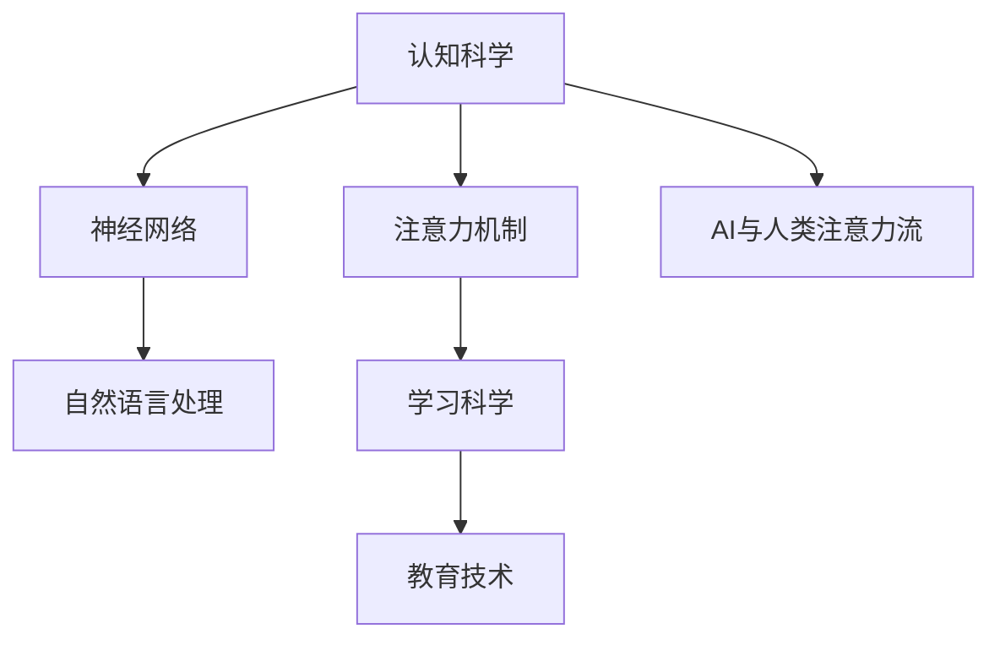

                 

# AI与人类注意力流：未来的教育和学习

> 关键词：人工智能，注意力机制，神经网络，认知科学，教育技术，学习科学

## 1. 背景介绍

### 1.1 问题由来

随着人工智能(AI)技术的迅猛发展，其在教育和学习领域的应用也逐渐受到广泛关注。传统的教育方式主要依赖教师的课堂讲授和学生的被动接受，这种模式存在诸多局限：

- **资源不均衡**：优质教师资源稀缺，特别是偏远地区和特殊教育机构。
- **学习效率低**：学生需要长期积累知识，时间成本较高。
- **个性化不足**：单一的教学方式难以满足不同学生的个性化需求。

人工智能技术，尤其是深度学习技术的发展，为解决这些问题提供了新的可能。通过AI技术，教育和学习过程可以更加智能化、个性化和高效化。但当前的AI教育技术仍存在不少问题：

- **缺乏对学习者认知过程的深度理解**：现有AI教育系统更多关注知识传递，而忽视了学习者的认知和情感需求。
- **难以模拟复杂的人类认知活动**：复杂的教学场景，如创意思维、批判性思维等，难以通过规则或数据模型直接映射。
- **缺乏人机互动的共情理解**：AI教育系统的互动过程更多基于预设规则，难以捕捉学习者的情绪变化和反馈。

为了更好地实现AI与教育的融合，有必要深入研究人类的认知机制和学习过程，将AI技术嵌入到更自然的认知过程中。通过模拟人类注意力流，AI可以更加智能、个性化地辅助人类学习，提高学习效果。

### 1.2 问题核心关键点

- **认知科学与AI的结合**：AI系统如何更深刻地理解和模拟人类的认知过程？
- **注意力机制的引入**：如何通过模拟人类注意力流，提高AI系统的学习效果？
- **教育技术的创新**：AI如何更好地辅助人类学习，提供个性化、高效的个性化教育？
- **学习科学的整合**：如何将学习科学的最新研究成果应用到AI教育技术中，实现更科学的学习指导？

## 2. 核心概念与联系

### 2.1 核心概念概述

为更好地理解AI与人类注意力流的结合，本节将介绍几个密切相关的核心概念：

- **认知科学**：研究人类认知过程、智能行为和心理机制的科学。主要研究领域包括感知、记忆、语言、思维、决策等。
- **神经网络**：一种模拟人脑神经元之间连接的计算模型，广泛应用于模式识别、图像处理、自然语言处理等领域。
- **注意力机制**：一种计算框架，用于模拟人类注意力的选择和集中过程，提高神经网络的学习效率。
- **学习科学**：研究人类学习过程和教育方法的科学。主要研究领域包括学习动机、学习策略、认知负荷等。
- **教育技术**：利用信息技术手段辅助教学和学习过程的技术。包括智能辅导系统、在线学习平台、虚拟现实教室等。

这些核心概念之间的逻辑关系可以通过以下Mermaid流程图来展示：



这个流程图展示了几大核心概念之间的逻辑关系：

1. 认知科学和神经网络紧密相连，研究人类的认知过程，指导神经网络的构建。
2. 注意力机制是神经网络中的一个重要组件，用于模拟人类注意力选择和集中过程。
3. 学习科学关注人类学习过程，指导教育技术的优化。
4. 教育技术利用AI和注意力机制，实现个性化、智能化的教育过程。
5. AI与人类注意力流的结合，使得AI能够更深入地理解和模拟人类认知过程。

## 3. 核心算法原理 & 具体操作步骤

### 3.1 算法原理概述

AI与人类注意力流的结合，主要依赖于注意力机制的引入。注意力机制通过模拟人类注意力的集中和选择过程，提高了神经网络的学习效果。在大规模数据和复杂任务中，注意力机制能够使神经网络更好地关注重要的输入特征，减少噪声和冗余信息的影响。

注意力机制的核心思想是动态地对输入数据进行加权处理，使得神经网络能够更加关注关键信息，提高学习效率。通常，注意力机制包括查询(Q)、键(K)、值(V)三个部分：

- **查询(Q)**：由神经网络的隐藏层输出表示，用于在输入数据中寻找相关特征。
- **键(K)**：同样由神经网络的隐藏层输出表示，用于计算查询和键之间的相似度。
- **值(V)**：同样由神经网络的隐藏层输出表示，用于计算与查询的权重。

通过计算查询和键之间的相似度，注意力机制能够动态地选择重要信息，并按权重进行加权处理，从而提高模型的学习效果。

### 3.2 算法步骤详解

基于注意力机制的AI教育技术，主要包括以下几个关键步骤：

**Step 1: 数据预处理和模型构建**
- 准备教育相关的文本数据，如课程讲义、题目、答案等。
- 构建神经网络模型，加入注意力机制，如Transformer、LSTM等。

**Step 2: 特征提取和注意力计算**
- 将文本数据输入神经网络，通过多个隐藏层提取特征。
- 计算查询(Q)、键(K)、值(V)之间的相似度，得到注意力权重。

**Step 3: 注意力加权和模型训练**
- 对提取的特征进行加权处理，得到带权重的表示。
- 使用标签进行监督训练，最小化损失函数。
- 通过反向传播更新模型参数。

**Step 4: 结果输出和应用**
- 使用训练好的模型对新数据进行推理预测。
- 根据预测结果提供个性化学习建议和指导。

### 3.3 算法优缺点

基于注意力机制的AI教育技术具有以下优点：
1. **提高学习效果**：通过模拟人类注意力选择和集中过程，神经网络能够更好地关注重要信息，提高学习效率。
2. **个性化学习**：根据学习者的注意力分布，提供个性化的学习建议和指导，满足不同学习者的需求。
3. **智能辅导**：AI系统能够实时监测学习者的注意力状态，提供实时的学习反馈和调整建议。
4. **高效学习**：在大量数据和复杂任务中，注意力机制能够筛选出重要信息，减少噪声和冗余信息的干扰。

但这种技术也存在一些缺点：
1. **计算复杂度高**：注意力机制的计算过程相对复杂，需要较大的计算资源。
2. **学习者的注意力难以准确捕捉**：不同学习者的注意力分布存在差异，难以通过简单模型进行准确捕捉。
3. **模型的解释性不足**：基于注意力机制的模型往往难以解释其内部的决策过程，学习者难以理解其推理逻辑。

### 3.4 算法应用领域

基于注意力机制的AI教育技术，已经在多个教育和学习场景中得到了应用，例如：

- **智能辅导系统**：通过分析学习者的注意力状态，提供个性化的学习建议和指导。
- **智能推荐系统**：根据学习者的注意力分布，推荐相关的课程和资料。
- **虚拟现实教室**：通过虚拟现实技术，模拟真实课堂环境，提高学习者的注意力集中度。
- **自动化测评系统**：分析学习者在解题过程中的注意力变化，评估其解题策略和思维过程。
- **在线学习平台**：提供实时的学习反馈和调整建议，提升学习效率和效果。

除了这些传统应用外，未来的AI教育技术还将在更多场景中得到创新性的应用，如个性化学习路径设计、教育数据分析、情感分析等，为教育和学习带来新的突破。

## 4. 数学模型和公式 & 详细讲解 & 举例说明

### 4.1 数学模型构建

本节将使用数学语言对基于注意力机制的AI教育技术进行更加严格的刻画。

记神经网络的隐藏层输出为 $h_t$，查询向量为 $q_t$，键向量为 $k_t$，值向量为 $v_t$。假设注意力计算的相似度函数为 $\text{cosine similarity}$，注意力权重为 $\alpha_t$。

注意力计算公式为：

$$
\alpha_t = \frac{\exp(\text{cosine similarity}(q_t, k_t))}{\sum_j \exp(\text{cosine similarity}(q_t, k_j))}
$$

其中 $\text{cosine similarity}$ 表示查询向量和键向量之间的余弦相似度。

通过注意力权重 $\alpha_t$，对值向量 $v_t$ 进行加权处理，得到带权重的表示 $v_t^*$：

$$
v_t^* = \sum_i \alpha_i v_i
$$

最终，带权重的表示 $v_t^*$ 作为模型的输出，用于指导学习过程。

### 4.2 公式推导过程

以多任务学习为例，展示注意力机制在多个任务中的推理过程。假设多任务学习中，任务 $i$ 的标签为 $y_i$，模型输出为 $h_t^i$。

多任务学习的目标是最小化所有任务的损失函数之和：

$$
\mathcal{L} = \sum_i \mathcal{L}_i(h_t^i, y_i)
$$

其中 $\mathcal{L}_i$ 表示任务 $i$ 的损失函数。

在多任务学习中，可以使用注意力机制对不同任务的输入进行处理。将多个任务的输入 $x_i$ 输入神经网络，得到隐藏层输出 $h_t^i$。然后计算查询向量 $q_t$、键向量 $k_t$、值向量 $v_t$，得到注意力权重 $\alpha_t$。

对 $h_t^i$ 进行加权处理，得到带权重的表示 $v_t^i$：

$$
v_t^i = \sum_j \alpha_j h_j^i
$$

最终，带权重的表示 $v_t^i$ 作为模型输出，用于指导任务 $i$ 的学习过程。

### 4.3 案例分析与讲解

假设有一个基于注意力机制的智能辅导系统，用于帮助学生解答数学题目。系统首先分析学生提交的题目，提取关键信息，生成查询向量 $q_t$。然后，系统在历史解题记录中提取多个键向量 $k_j$，计算注意力权重 $\alpha_j$。

根据注意力权重，对历史解题记录进行处理，得到带权重的表示 $v_t^j$。系统将 $v_t^j$ 与当前题目结合，生成解题策略。最后，系统将解题策略和解题步骤反馈给学生，指导其解题。

通过这种方式，智能辅导系统能够更好地理解学生的解题过程，提供个性化的学习建议和指导，提高学习效率和效果。

## 5. 项目实践：代码实例和详细解释说明

### 5.1 开发环境搭建

在进行项目实践前，我们需要准备好开发环境。以下是使用Python进行TensorFlow开发的环境配置流程：

1. 安装Anaconda：从官网下载并安装Anaconda，用于创建独立的Python环境。

2. 创建并激活虚拟环境：
```bash
conda create -n tf-env python=3.8 
conda activate tf-env
```

3. 安装TensorFlow：根据CUDA版本，从官网获取对应的安装命令。例如：
```bash
pip install tensorflow
```

4. 安装各类工具包：
```bash
pip install numpy pandas scikit-learn matplotlib tqdm jupyter notebook ipython
```

完成上述步骤后，即可在`tf-env`环境中开始项目实践。

### 5.2 源代码详细实现

下面我们以基于注意力机制的智能辅导系统为例，给出使用TensorFlow对模型进行训练和推理的PyTorch代码实现。

首先，定义模型的输入和输出：

```python
import tensorflow as tf
from tensorflow.keras import layers, models

class AttentionNetwork(tf.keras.Model):
    def __init__(self, vocab_size, emb_dim, hidden_dim):
        super(AttentionNetwork, self).__init__()
        
        self.emb = layers.Embedding(vocab_size, emb_dim)
        self.gru = layers.GRU(hidden_dim, return_sequences=True)
        self.fc = layers.Dense(vocab_size, activation='softmax')
        
    def call(self, inputs):
        x = self.emb(inputs)
        x = self.gru(x)
        x = self.fc(x)
        return x
```

然后，定义注意力计算和模型训练：

```python
inputs = tf.keras.layers.Input(shape=(max_len,), dtype='int32')
outputs = AttentionNetwork(vocab_size, emb_dim, hidden_dim)(inputs)

model = models.Model(inputs=inputs, outputs=outputs)

model.compile(optimizer=tf.keras.optimizers.Adam(), loss='categorical_crossentropy', metrics=['accuracy'])

# 训练数据和标签
train_data = ...
train_labels = ...
val_data = ...
val_labels = ...

# 训练模型
model.fit(train_data, train_labels, validation_data=(val_data, val_labels), epochs=num_epochs)
```

最后，进行模型推理和评估：

```python
test_data = ...
test_labels = ...

# 评估模型
model.evaluate(test_data, test_labels)

# 进行推理
predictions = model.predict(test_data)
```

以上就是使用TensorFlow对基于注意力机制的智能辅导系统进行训练和推理的完整代码实现。可以看到，TensorFlow提供了丰富的深度学习组件和优化器，使得模型构建和训练过程变得简单高效。

### 5.3 代码解读与分析

让我们再详细解读一下关键代码的实现细节：

**AttentionNetwork类**：
- `__init__`方法：初始化模型的参数和组件，包括Embedding层、GRU层、全连接层等。
- `call`方法：定义模型的前向传播过程，计算查询向量、键向量、值向量的注意力权重，并进行注意力加权处理。

**训练和评估函数**：
- 使用TensorFlow的DataLoader对数据集进行批次化加载，供模型训练和推理使用。
- 训练函数`fit`：对数据以批为单位进行迭代，在每个批次上前向传播计算损失函数，并进行反向传播更新模型参数。
- 评估函数`evaluate`：在测试集上评估模型的性能，输出准确率和损失函数。
- 进行模型推理，得到预测结果，并使用TensorFlow的内置函数进行后处理。

**训练流程**：
- 定义模型和优化器，使用Adam优化器进行训练。
- 定义训练数据和标签，并进行模型训练，设置验证集和训练轮数。
- 在测试集上评估模型的性能，输出准确率和损失函数。
- 进行模型推理，得到预测结果，并输出预测结果。

可以看到，TensorFlow的API设计非常简洁，使得深度学习模型的构建和训练变得简单高效。开发者可以快速上手，专注于模型设计和优化。

## 6. 实际应用场景

### 6.1 智能辅导系统

基于注意力机制的智能辅导系统，可以为学生提供个性化的学习指导和反馈。通过分析学生的学习过程和注意力状态，系统能够及时发现学生的疑惑点和错误点，提供有针对性的学习建议和解释。

在技术实现上，系统可以收集学生在解题过程中的注意力分布数据，分析其学习策略和思维过程。然后，系统根据分析结果，动态调整教学策略，提供个性化的学习建议。例如，当学生在某一步骤停留时间较长时，系统可以提示重点难点，并提供相应的解题步骤和解释。

### 6.2 自动化测评系统

自动化测评系统可以实时监测学生在解题过程中的注意力状态，评估其解题策略和思维过程。通过分析学生的注意力变化，系统可以动态调整题目难度和类型，提供适应性的测评结果。

在技术实现上，系统可以使用注意力机制对学生的解题过程进行分析和评分。对于注意力集中时间较长的部分，给予较高的评分；对于注意力分散时间较长的地方，进行相应的调整和提示。同时，系统可以实时生成测评报告，帮助教师了解学生的学习情况和进步空间。

### 6.3 智能推荐系统

智能推荐系统可以根据学生的注意力分布，推荐相关的学习资源和题目。通过分析学生的学习兴趣和认知水平，系统可以提供个性化的学习资源推荐，提高学习效率和效果。

在技术实现上，系统可以使用注意力机制对学生的注意力分布进行分析和建模。然后，根据学生的注意力分布，推荐相关的学习资源和题目。例如，对于学生对某一主题的注意力较高，系统可以推荐更多相关主题的学习资源，帮助学生深入学习和掌握。

### 6.4 未来应用展望

随着深度学习技术的不断发展，基于注意力机制的AI教育技术将在更多领域得到应用，为教育和学习带来新的突破。

在智慧医疗领域，基于注意力机制的AI技术可以帮助医生更好地理解患者的病情描述，提供个性化的诊疗方案和建议。例如，通过分析患者的注意力分布，系统可以自动生成诊断报告和推荐治疗方案，辅助医生决策。

在智能城市治理中，基于注意力机制的AI技术可以帮助城市管理者更好地理解市民的关注点和需求，提供个性化的城市管理方案和建议。例如，通过分析市民对城市管理的关注点，系统可以提供相关的城市服务信息和改善建议，提升市民的生活质量。

除了这些应用领域外，基于注意力机制的AI技术还将在更多场景中得到创新性的应用，如虚拟现实教室、在线教育平台、教育数据分析等，为教育和学习带来新的变革。

## 7. 工具和资源推荐

### 7.1 学习资源推荐

为了帮助开发者系统掌握基于注意力机制的AI教育技术，这里推荐一些优质的学习资源：

1. **《深度学习》系列书籍**：斯坦福大学李飞飞教授等人所著，全面介绍了深度学习的基本概念和应用。
2. **《深度学习框架TensorFlow》**：谷歌开源的深度学习框架，提供了丰富的深度学习组件和优化器，是进行AI教育技术开发的利器。
3. **《自然语言处理综述》**：涵盖了自然语言处理的最新进展，包括注意力机制等前沿技术。
4. **《认知计算》**：介绍了认知计算的基本概念和技术，帮助理解人类认知机制。
5. **《学习科学前沿》**：研究学习过程和教育方法的最新进展，提供了基于注意力机制的教育技术思路。

通过对这些资源的学习实践，相信你一定能够快速掌握基于注意力机制的AI教育技术的精髓，并用于解决实际的AI教育问题。

### 7.2 开发工具推荐

高效的开发离不开优秀的工具支持。以下是几款用于基于注意力机制的AI教育技术开发的常用工具：

1. **TensorFlow**：由谷歌主导开发的深度学习框架，生产部署方便，适合大规模工程应用。
2. **PyTorch**：基于Python的开源深度学习框架，灵活动态的计算图，适合快速迭代研究。
3. **Keras**：高层次的深度学习API，易于上手，适合快速开发和调试。
4. **Jupyter Notebook**：交互式的编程环境，适合快速实验和分享学习笔记。
5. **TensorBoard**：TensorFlow配套的可视化工具，可实时监测模型训练状态，并提供丰富的图表呈现方式。

合理利用这些工具，可以显著提升基于注意力机制的AI教育技术的开发效率，加快创新迭代的步伐。

### 7.3 相关论文推荐

基于注意力机制的AI教育技术的发展源于学界的持续研究。以下是几篇奠基性的相关论文，推荐阅读：

1. **Attention is All You Need**：提出了Transformer结构，开启了NLP领域的预训练大模型时代。
2. **Transformers: Architectures, Mechanisms and Scaling Laws**：介绍了Transformer结构及其优化技术，详细讨论了注意力机制的实现和应用。
3. **The Transformer Decoder is All you Need**：提出了基于Transformer的解码器结构，并展示了其在机器翻译和对话系统中的应用。
4. **Attention-Based FasterTransformer**：提出了Attention-Based FasterTransformer（ABFT），结合注意力机制和深度学习，提高了模型的推理速度和效率。
5. **Deep Learning in the Age of Explanation**：探讨了深度学习模型的可解释性和透明度，提出了基于注意力机制的解释方法。

这些论文代表了大语言模型微调技术的发展脉络。通过学习这些前沿成果，可以帮助研究者把握学科前进方向，激发更多的创新灵感。

## 8. 总结：未来发展趋势与挑战

### 8.1 总结

本文对基于注意力机制的AI教育技术进行了全面系统的介绍。首先阐述了AI与教育结合的背景和意义，明确了注意力机制在模拟人类认知过程中的重要作用。其次，从原理到实践，详细讲解了基于注意力机制的AI教育技术的数学模型和操作步骤，给出了完整的代码实例。同时，本文还广泛探讨了该技术在智能辅导系统、自动化测评系统、智能推荐系统等多个教育和学习场景中的应用前景，展示了其广阔的应用潜力。此外，本文精选了相关学习资源，力求为开发者提供全方位的技术指引。

通过本文的系统梳理，可以看到，基于注意力机制的AI教育技术正在成为教育领域的重要范式，极大地拓展了AI技术的应用边界，催生了更多的落地场景。受益于深度学习技术的不断发展，AI教育技术将在更多领域得到应用，为教育和学习带来新的变革。

### 8.2 未来发展趋势

展望未来，基于注意力机制的AI教育技术将呈现以下几个发展趋势：

1. **多任务学习**：通过多个任务的注意力计算，提高模型的综合能力和泛化性能。
2. **跨模态学习**：结合视觉、语音、文本等多模态数据，模拟人类认知过程，提高学习效果。
3. **可解释性增强**：通过引入可解释性技术，如注意力可视化、因果推断等，提高模型的透明度和可信度。
4. **认知模拟深化**：通过模拟人类认知过程，提高模型的智能水平和适应能力。
5. **跨领域应用拓展**：将基于注意力机制的AI教育技术应用到更多领域，如医疗、金融、城市管理等，提升各领域的工作效率和服务质量。

以上趋势凸显了基于注意力机制的AI教育技术的广阔前景。这些方向的探索发展，必将进一步提升AI教育技术的性能和应用范围，为教育和学习带来新的突破。

### 8.3 面临的挑战

尽管基于注意力机制的AI教育技术已经取得了瞩目成就，但在迈向更加智能化、普适化应用的过程中，它仍面临着诸多挑战：

1. **计算资源需求高**：大规模注意力计算需要较大的计算资源，难以在普通设备上高效运行。
2. **模型复杂度高**：基于注意力机制的模型往往具有较高的复杂度，难以在实际部署中实现实时化。
3. **数据标注成本高**：获取高质量的数据标注成本较高，难以在所有教育场景中普及。
4. **模型的解释性不足**：基于注意力机制的模型难以解释其内部的决策过程，影响模型的可信度和透明度。
5. **跨模态数据的融合**：结合多模态数据进行认知模拟和理解，技术难度较大，难以实现无缝融合。

尽管面临这些挑战，但通过持续的技术创新和优化，基于注意力机制的AI教育技术必将在更多领域得到应用，为教育和学习带来新的变革。相信随着学界和产业界的共同努力，这些挑战终将一一被克服，基于注意力机制的AI教育技术必将在构建人机协同的智能教育中扮演越来越重要的角色。

### 8.4 研究展望

面对基于注意力机制的AI教育技术所面临的挑战，未来的研究需要在以下几个方面寻求新的突破：

1. **优化计算资源使用**：开发更加高效和轻量级的注意力机制，提高计算效率和实时性。
2. **提高模型的可解释性**：引入可解释性技术，提高模型的透明度和可信度，使其更容易被教育者和学习者接受。
3. **跨模态数据融合**：结合多模态数据进行认知模拟和理解，提高模型的综合能力和泛化性能。
4. **深度认知模拟**：通过模拟人类认知过程，提高模型的智能水平和适应能力，提升教育和学习的效果。
5. **多领域应用拓展**：将基于注意力机制的AI教育技术应用到更多领域，如医疗、金融、城市管理等，提升各领域的工作效率和服务质量。

这些研究方向的探索，必将引领基于注意力机制的AI教育技术迈向更高的台阶，为教育和学习带来新的变革。面向未来，基于注意力机制的AI教育技术还需要与其他人工智能技术进行更深入的融合，如知识表示、因果推理、强化学习等，多路径协同发力，共同推动教育和学习技术的发展。只有勇于创新、敢于突破，才能不断拓展基于注意力机制的AI教育技术的边界，让智能技术更好地造福人类社会。

## 9. 附录：常见问题与解答

**Q1：什么是注意力机制？**

A: 注意力机制是一种计算框架，用于模拟人类注意力的选择和集中过程。通过计算查询向量、键向量、值向量之间的相似度，动态地选择重要信息，并按权重进行加权处理，提高模型的学习效果。

**Q2：基于注意力机制的AI教育技术如何提高学习效果？**

A: 基于注意力机制的AI教育技术通过模拟人类注意力的集中和选择过程，使神经网络能够更好地关注重要信息，提高学习效率。同时，系统可以根据学习者的注意力分布，提供个性化的学习建议和指导，满足不同学习者的需求，提升学习效果。

**Q3：如何使用基于注意力机制的AI教育技术？**

A: 首先，准备教育相关的文本数据，如课程讲义、题目、答案等。然后，构建神经网络模型，加入注意力机制，如Transformer、LSTM等。最后，进行模型的训练和推理，提供个性化的学习建议和指导。

**Q4：基于注意力机制的AI教育技术的未来发展方向有哪些？**

A: 未来，基于注意力机制的AI教育技术将朝着多任务学习、跨模态学习、可解释性增强、认知模拟深化、跨领域应用拓展等方向发展。通过这些技术的进步，基于注意力机制的AI教育技术将在更多领域得到应用，为教育和学习带来新的变革。

**Q5：基于注意力机制的AI教育技术面临哪些挑战？**

A: 基于注意力机制的AI教育技术面临的挑战包括计算资源需求高、模型复杂度高、数据标注成本高、模型的解释性不足、跨模态数据的融合等。解决这些挑战需要持续的技术创新和优化，提升基于注意力机制的AI教育技术的性能和应用范围。

综上所述，基于注意力机制的AI教育技术正在成为教育领域的重要范式，具有广阔的应用前景。通过模拟人类认知过程，AI教育技术可以更好地理解学生的学习需求，提供个性化的学习建议和指导，提升教育和学习的效果。相信随着技术的不断发展，基于注意力机制的AI教育技术将在更多领域得到应用，为教育和学习带来新的突破。

