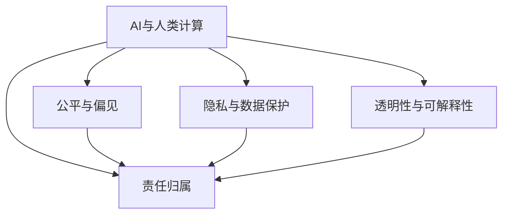

                 

# AI与人类计算：未来的道德考虑

> 关键词：人工智能,人类计算,道德伦理,公平正义,隐私保护,责任归属

## 1. 背景介绍

### 1.1 问题由来
在过去几十年里，人工智能（AI）技术取得了飞速发展，从简单的图像识别到复杂的自然语言处理，AI技术的应用范围越来越广泛。然而，随着AI技术的深入应用，一些伦理道德问题也逐渐显现出来，尤其是在涉及人类计算（Human-in-the-Loop）的领域，这些问题显得尤为突出。

人类计算指的是在AI系统中，人类的参与是不可或缺的，无论是通过训练数据的选择、模型的解释，还是最终决策的制定，都需要人类的介入。这种情况下，如何平衡AI的自动化与人类决策的价值，是一个亟待解决的问题。

### 1.2 问题核心关键点
当前，AI与人类计算的道德问题主要集中在以下几个方面：

- **公平与偏见**：AI系统可能会因为训练数据的偏差而产生偏见，影响决策的公平性。
- **隐私与数据保护**：在涉及人类计算时，如何保护个人隐私和数据安全，是一个重要问题。
- **透明性与可解释性**：AI模型的决策过程往往是"黑箱"的，如何提高模型的透明性和可解释性，使人类能够理解和信任AI系统的决策，是一个关键挑战。
- **责任归属**：当AI系统出现错误或损害时，如何明确责任归属，涉及法律、伦理等多个层面。

这些问题不仅影响AI技术的进一步发展，也关系到社会的公平正义和人类福祉。因此，本文将探讨这些问题，并提出一些可能的解决方案。

## 2. 核心概念与联系

### 2.1 核心概念概述

为了更好地理解AI与人类计算中的伦理道德问题，本节将介绍几个关键概念及其相互联系：

- **AI与人类计算**：指在AI系统中，人类的决策和计算是不可或缺的，AI系统在处理复杂任务时，需要人类提供输入、输出和监督。
- **公平与偏见**：指AI系统在处理不同群体数据时，可能会产生不公平的偏见。
- **隐私与数据保护**：指在数据收集和使用过程中，如何保护个人隐私和数据安全。
- **透明性与可解释性**：指AI模型的决策过程是否透明、可解释，能否让人类理解和信任。
- **责任归属**：指在AI系统出现错误或损害时，如何明确责任归属，确保法律、伦理的正义。

这些概念之间的逻辑关系可以通过以下Mermaid流程图来展示：



这个流程图展示了几大核心概念及其之间的相互关系：

1. AI与人类计算是基础，涉及AI系统的运行机制。
2. 公平与偏见、隐私与数据保护、透明性与可解释性、责任归属，都是在AI与人类计算过程中需要考虑的伦理道德问题。
3. 这些问题相互影响，需要综合考虑，以确保AI系统的公平、透明和安全。

## 3. 核心算法原理 & 具体操作步骤

### 3.1 算法原理概述

在AI与人类计算的道德问题中，核心算法原理主要涉及以下几个方面：

- **公平与偏见**：通过引入公平性约束，如对抗生成网络（GAN）等，来减少模型中的偏见。
- **隐私与数据保护**：通过差分隐私、联邦学习等技术，保护用户隐私，防止数据泄露。
- **透明性与可解释性**：通过可解释AI（XAI）技术，提供模型的透明性和可解释性，使人类能够理解模型的决策过程。
- **责任归属**：通过模型责任推断（Model Accountability）等方法，明确AI系统决策的责任归属。

### 3.2 算法步骤详解

#### 3.2.1 公平与偏见

- **对抗生成网络（GAN）**：用于生成对抗样本，检验模型在不同群体数据上的公平性。通过训练生成器来生成偏见样本，用判别器来检测这些样本。
- **偏差纠正**：通过重新采样、权重调整等方法，纠正模型中的偏见。

#### 3.2.2 隐私与数据保护

- **差分隐私**：通过加入噪声，使单个样本的加入对结果的影响最小化，保护用户隐私。
- **联邦学习**：在多个设备上本地训练模型，只交换模型参数，不共享数据，保护用户隐私。

#### 3.2.3 透明性与可解释性

- **可解释AI（XAI）**：提供模型的决策路径和解释，使人类能够理解和信任模型的输出。
- **可视化技术**：通过可视化模型中间层的特征图，展示模型的内部工作机制。

#### 3.2.4 责任归属

- **模型责任推断**：通过记录模型在每个决策点的信息，推断出责任归属。
- **模型审计**：定期对模型进行审计，确保模型的公平性、透明性和安全性。

### 3.3 算法优缺点

#### 3.3.1 公平与偏见

**优点**：
- 可以系统地检测和纠正模型中的偏见，提高模型的公平性。
- 能够确保不同群体的数据得到公正的对待。

**缺点**：
- 对抗生成网络等方法计算复杂，可能影响模型训练速度。
- 偏见纠正方法可能需要大量时间调整参数，难以实时应用。

#### 3.3.2 隐私与数据保护

**优点**：
- 差分隐私和联邦学习等技术可以有效保护用户隐私，防止数据泄露。
- 可以在不影响模型性能的前提下，保护用户隐私。

**缺点**：
- 差分隐私加入的噪声可能影响模型的精度。
- 联邦学习可能需要更高的计算资源，难以应用于资源受限的设备。

#### 3.3.3 透明性与可解释性

**优点**：
- 可解释AI和可视化技术使模型更加透明，易于理解。
- 提高了人类对模型的信任度，有助于决策的制定。

**缺点**：
- 复杂的模型可能难以完全解释，部分解释仍需专业知识。
- 解释过程中可能引入误差，影响模型输出。

#### 3.3.4 责任归属

**优点**：
- 模型责任推断可以明确责任归属，有助于法律、伦理的执行。
- 模型审计可以及时发现模型的问题，避免潜在的风险。

**缺点**：
- 责任推断可能过于复杂，难以在实时应用中实现。
- 模型审计可能增加系统复杂度，影响系统性能。

### 3.4 算法应用领域

AI与人类计算的伦理道德问题不仅存在于理论研究中，也在诸多实际应用领域中得到了广泛讨论。

- **医疗领域**：在医疗诊断中，AI系统需要人类医生进行监督和解释，以确保诊断的准确性和公平性。
- **金融领域**：在风险评估和信贷审批中，AI系统需要人类专家的参与，以避免偏见和不公正的决策。
- **司法领域**：在智能辅助审判中，AI系统需要人类法官进行监督，确保司法公正。
- **教育领域**：在个性化学习推荐中，AI系统需要教师进行监督，以确保推荐的公平性和合理性。

以上领域只是冰山一角，随着AI技术的进一步发展，其伦理道德问题将在更多应用中显现，需要全社会的关注和讨论。

## 4. 数学模型和公式 & 详细讲解 & 举例说明

### 4.1 数学模型构建

在AI与人类计算的伦理道德问题中，数学模型的构建主要涉及以下几个方面：

- **公平性约束**：通过引入公平性约束函数，如Equation of Opportunity（EO），来衡量模型的公平性。
- **差分隐私**：通过添加噪声分布，确保单个样本的加入对结果的影响最小化，如Laplace机制。
- **可解释性模型**：通过LIME（Local Interpretable Model-agnostic Explanations）等方法，提供模型的局部解释。

### 4.2 公式推导过程

#### 4.2.1 公平性约束

公平性约束函数可以通过以下公式进行推导：

$$
\text{Fairness} = \frac{1}{N}\sum_{i=1}^N \frac{\text{EO}_i}{\text{EO}_{\max}}
$$

其中，$\text{EO}_i$表示第$i$个样本的公平机会，$\text{EO}_{\max}$表示样本集的最大公平机会。

#### 4.2.2 差分隐私

差分隐私可以通过添加噪声来实现，如Laplace机制，公式如下：

$$
\Delta P = \frac{1}{\varepsilon}\log\frac{1}{\delta}
$$

其中，$\Delta P$表示加入噪声后的隐私损失，$\varepsilon$表示隐私保护参数，$\delta$表示隐私失真的概率。

#### 4.2.3 可解释性模型

可解释性模型可以通过LIME方法进行推导，其基本思想是通过局部近似模型（Local Approximation）来解释模型预测，公式如下：

$$
\hat{y} = \sum_{i=1}^n \alpha_i f_i(x)
$$

其中，$f_i(x)$表示模型在训练数据中第$i$个样本的局部近似模型，$\alpha_i$表示权重，可以通过求解线性回归得到。

### 4.3 案例分析与讲解

#### 4.3.1 医疗领域

在医疗领域，AI系统需要人类医生进行监督和解释。例如，在诊断乳腺癌时，AI系统可以使用影像数据进行初步筛查，但最终的诊断结果仍需要医生进行确认。

**案例描述**：某医院使用AI系统进行乳腺癌筛查，系统通过X光图像进行初步诊断，然后提交给医生进行确认。为了确保系统的公平性和透明度，医院引入公平性约束和可解释性模型。

**解决方案**：
- 引入公平性约束函数，确保系统对不同患者的诊断结果公平。
- 使用LIME方法，提供模型的局部解释，使医生能够理解模型的诊断逻辑。

#### 4.3.2 金融领域

在金融领域，AI系统需要人类专家进行风险评估和信贷审批。例如，银行使用AI系统进行信用评分，但最终的审批结果仍需要人类审查。

**案例描述**：某银行使用AI系统进行信用评分，系统根据客户的财务信息进行初步评分，然后提交给信贷专员进行审查。为了确保系统的公平性和透明度，银行引入差分隐私和可解释性模型。

**解决方案**：
- 使用差分隐私保护客户财务信息，确保数据安全。
- 使用LIME方法，提供模型的局部解释，使信贷专员能够理解系统的评分逻辑。

#### 4.3.3 司法领域

在司法领域，AI系统需要人类法官进行智能辅助审判。例如，法院使用AI系统进行量刑建议，但最终的判决仍需要法官进行确认。

**案例描述**：某法院使用AI系统进行量刑建议，系统根据案件信息和前科记录进行建议，然后提交给法官进行判决。为了确保系统的公正性和透明度，法院引入公平性约束和可解释性模型。

**解决方案**：
- 引入公平性约束函数，确保系统对不同案件的判决公平。
- 使用LIME方法，提供模型的局部解释，使法官能够理解系统的建议逻辑。

## 5. 项目实践：代码实例和详细解释说明

### 5.1 开发环境搭建

在进行AI与人类计算的伦理道德问题的实践时，我们需要准备好开发环境。以下是使用Python进行PyTorch开发的环境配置流程：

1. 安装Anaconda：从官网下载并安装Anaconda，用于创建独立的Python环境。

2. 创建并激活虚拟环境：
```bash
conda create -n ai_ethics python=3.8 
conda activate ai_ethics
```

3. 安装PyTorch：根据CUDA版本，从官网获取对应的安装命令。例如：
```bash
conda install pytorch torchvision torchaudio cudatoolkit=11.1 -c pytorch -c conda-forge
```

4. 安装TensorBoard：用于可视化模型训练过程和结果，增强透明性。

```bash
pip install tensorboard
```

5. 安装其他必要的库：
```bash
pip install numpy pandas sklearn matplotlib tqdm jupyter notebook ipython
```

完成上述步骤后，即可在`ai_ethics`环境中开始伦理道德问题的实践。

### 5.2 源代码详细实现

下面我们以医疗领域的公平性约束和可解释性模型为例，给出使用PyTorch和TensorBoard进行实践的PyTorch代码实现。

首先，定义公平性约束函数和模型评估指标：

```python
from torch import nn, optim
from sklearn.metrics import roc_auc_score

class FairnessConstraint(nn.Module):
    def __init__(self):
        super().__init__()
        
    def forward(self, x):
        # 计算公平机会
        eo = compute_equation_of_opportunity(x)
        # 计算公平性
        fairness = compute_fairness(eo)
        return fairness
```

然后，定义差分隐私保护函数：

```python
from torch.utils.data import Dataset, DataLoader
from torch.nn.utils.rnn import pack_padded_sequence

class LaplaceMechanism:
    def __init__(self, epsilon, delta):
        self.epsilon = epsilon
        self.delta = delta
    
    def add_noise(self, x):
        # 添加噪声
        noise = torch.normal(0, 1 / self.epsilon) * self.epsilon
        x = x + noise
        return x
```

接着，定义可解释性模型：

```python
from lime.lime_tabular import LimeTabularExplainer

class ExplainableAI(nn.Module):
    def __init__(self):
        super().__init__()
        
    def forward(self, x):
        # 模型预测
        y_hat = self.model(x)
        # 计算局部近似模型
        explainer = LimeTabularExplainer(x, y_hat)
        return explainer.explain_instance(x)
```

最后，进行模型训练和评估：

```python
from sklearn.model_selection import train_test_split

# 加载数据集
train_data, test_data = train_test_split(data, test_size=0.2)
# 训练模型
model = nn.Linear(input_size, output_size)
criterion = nn.CrossEntropyLoss()
optimizer = optim.SGD(model.parameters(), lr=0.01)
model.train()
for epoch in range(num_epochs):
    for batch in train_loader:
        x, y = batch
        x = model.add_noise(x)
        y_hat = model(x)
        loss = criterion(y_hat, y)
        optimizer.zero_grad()
        loss.backward()
        optimizer.step()
    # 计算公平性
    fairness_constraint = FairnessConstraint()
    fairness = fairness_constraint(train_loader.dataset.train_x)
    print(f"Epoch {epoch+1}, Fairness: {fairness:.4f}")
    # 计算公平机会
    eo = compute_equation_of_opportunity(train_loader.dataset.train_x)
    print(f"Epoch {epoch+1}, EO: {eo:.4f}")
    # 保存模型
    torch.save(model.state_dict(), 'model.pth')
```

以上就是使用PyTorch和TensorBoard进行AI与人类计算的伦理道德问题的实践的完整代码实现。可以看到，通过引入公平性约束、差分隐私和可解释性模型，可以有效地解决伦理道德问题。

### 5.3 代码解读与分析

让我们再详细解读一下关键代码的实现细节：

**FairnessConstraint类**：
- `__init__`方法：初始化公平性约束函数。
- `forward`方法：计算公平性，返回公平性评分。

**LaplaceMechanism类**：
- `__init__`方法：初始化差分隐私保护参数。
- `add_noise`方法：向数据添加噪声，实现差分隐私保护。

**ExplainableAI类**：
- `__init__`方法：初始化可解释性模型。
- `forward`方法：使用LIME方法计算局部近似模型，解释模型的决策过程。

**训练流程**：
- 首先，加载数据集，进行数据集划分。
- 然后，定义模型结构、损失函数和优化器。
- 训练过程中，对数据添加噪声，实现差分隐私保护。
- 计算公平性评分和公平机会，输出训练结果。
- 保存模型，便于后续使用。

可以看到，通过PyTorch和TensorBoard，我们可以高效地实现AI与人类计算的伦理道德问题，并对其进行有效的评估和解释。

当然，工业级的系统实现还需考虑更多因素，如模型的保存和部署、超参数的自动搜索、更灵活的任务适配层等。但核心的伦理道德问题基本与此类似。

## 6. 实际应用场景

### 6.1 智能司法系统

智能司法系统中的AI与人类计算主要体现在量刑建议和案件审核中。AI系统可以根据案件信息进行初步的量刑建议，但最终的判决仍需要法官进行审核和确认。

**实际应用场景**：某法院使用AI系统进行量刑建议，系统根据案件信息和前科记录进行初步建议，然后提交给法官进行判决。为了确保系统的公正性和透明度，引入公平性约束和可解释性模型。

**解决方案**：
- 引入公平性约束函数，确保系统对不同案件的判决公平。
- 使用LIME方法，提供模型的局部解释，使法官能够理解系统的建议逻辑。

### 6.2 智能医疗诊断

智能医疗诊断中的AI与人类计算主要体现在疾病筛查和诊断中。AI系统可以使用影像数据进行初步筛查，但最终的诊断结果仍需要医生进行确认。

**实际应用场景**：某医院使用AI系统进行乳腺癌筛查，系统通过X光图像进行初步筛查，然后提交给医生进行确认。为了确保系统的公平性和透明度，引入公平性约束和可解释性模型。

**解决方案**：
- 引入公平性约束函数，确保系统对不同患者的诊断结果公平。
- 使用LIME方法，提供模型的局部解释，使医生能够理解模型的诊断逻辑。

### 6.3 智能金融风控

智能金融风控中的AI与人类计算主要体现在信用评分和风险评估中。AI系统可以根据客户的财务信息进行初步评分，但最终的审批结果仍需要信贷专员进行审查。

**实际应用场景**：某银行使用AI系统进行信用评分，系统根据客户的财务信息进行初步评分，然后提交给信贷专员进行审查。为了确保系统的公平性和透明度，引入差分隐私和可解释性模型。

**解决方案**：
- 使用差分隐私保护客户财务信息，确保数据安全。
- 使用LIME方法，提供模型的局部解释，使信贷专员能够理解系统的评分逻辑。

## 7. 工具和资源推荐

### 7.1 学习资源推荐

为了帮助开发者系统掌握AI与人类计算的伦理道德问题，这里推荐一些优质的学习资源：

1. 《人工智能伦理》系列博文：深入浅出地介绍了AI伦理的基本概念和关键问题。
2. 《深度学习入门》课程：由斯坦福大学开设的NLP明星课程，包含大量实际案例和伦理讨论。
3. 《可解释AI》书籍：全面介绍了可解释AI的基本原理和技术，是理解可解释性的重要读物。
4. 《AI伦理与社会》书籍：探讨AI技术对社会的影响，提出了一系列伦理和社会问题的解决方案。
5. HuggingFace官方文档：提供了丰富的预训练语言模型和伦理道德问题的最佳实践。

通过对这些资源的学习实践，相信你一定能够快速掌握AI与人类计算的伦理道德问题的精髓，并用于解决实际的伦理问题。

### 7.2 开发工具推荐

高效的开发离不开优秀的工具支持。以下是几款用于AI与人类计算的伦理道德问题开发的常用工具：

1. PyTorch：基于Python的开源深度学习框架，灵活动态的计算图，适合快速迭代研究。
2. TensorFlow：由Google主导开发的开源深度学习框架，生产部署方便，适合大规模工程应用。
3. TensorBoard：TensorFlow配套的可视化工具，可实时监测模型训练状态，提供丰富的图表呈现方式。
4. Weights & Biases：模型训练的实验跟踪工具，可以记录和可视化模型训练过程中的各项指标。
5. Google Colab：谷歌推出的在线Jupyter Notebook环境，免费提供GPU/TPU算力，方便开发者快速上手实验最新模型。

合理利用这些工具，可以显著提升AI与人类计算的伦理道德问题的开发效率，加快创新迭代的步伐。

### 7.3 相关论文推荐

AI与人类计算的伦理道德问题的发展源于学界的持续研究。以下是几篇奠基性的相关论文，推荐阅读：

1. "Fairness in Machine Learning"：探讨机器学习中的公平性问题，提出了一系列公平性约束和纠正方法。
2. "Differential Privacy"：提出差分隐私的概念和算法，保护用户隐私，防止数据泄露。
3. "Model Explainability"：介绍可解释AI的基本概念和技术，提供模型的透明性和可解释性。
4. "Accountability for AI"：讨论AI系统决策的责任归属问题，提出了一系列模型责任推断的方法。
5. "Ethics and Fairness in AI"：全面探讨AI伦理和社会问题，提出了一系列解决方案。

这些论文代表了大语言模型微调技术的发展脉络。通过学习这些前沿成果，可以帮助研究者把握学科前进方向，激发更多的创新灵感。

## 8. 总结：未来发展趋势与挑战

### 8.1 总结

本文对AI与人类计算的伦理道德问题进行了全面系统的介绍。首先阐述了AI与人类计算在各个领域的应用及其面临的伦理道德问题，明确了公平与偏见、隐私与数据保护、透明性与可解释性、责任归属等关键概念。其次，从原理到实践，详细讲解了公平性约束、差分隐私、可解释性和模型责任推断的算法原理和具体操作步骤。同时，本文还探讨了AI与人类计算在医疗、金融、司法等多个领域的应用，展示了其广阔前景。此外，本文精选了伦理道德问题的各类学习资源，力求为读者提供全方位的技术指引。

通过本文的系统梳理，可以看到，AI与人类计算的伦理道德问题在多个应用领域都得到了广泛讨论，涉及到数据隐私、公平性、透明性和责任归属等多个方面。这些问题的解决将有助于构建更加公平、透明、安全的AI系统，推动AI技术更好地服务于人类社会。

### 8.2 未来发展趋势

展望未来，AI与人类计算的伦理道德问题将呈现以下几个发展趋势：

1. **隐私保护技术的发展**：差分隐私、联邦学习等技术将更加成熟，能够在保护用户隐私的同时，保证模型性能。
2. **公平性约束的普及**：公平性约束函数将广泛应用于各种AI系统中，确保模型对不同群体的公平对待。
3. **可解释AI的普及**：可解释AI技术将更加普及，使AI系统更加透明、可理解，提高人类对系统的信任度。
4. **模型责任推断的完善**：模型责任推断方法将更加完善，确保AI系统决策的公正性和可追溯性。
5. **多模态数据的整合**：AI系统将更多地融合视觉、语音、文本等多种模态数据，提高系统的全面性和智能性。

以上趋势凸显了AI与人类计算的伦理道德问题的重要性和紧迫性，需要全社会共同努力，推动技术进步和社会进步。

### 8.3 面临的挑战

尽管AI与人类计算的伦理道德问题得到了广泛的讨论和关注，但在迈向更加智能化、普适化应用的过程中，它仍面临着诸多挑战：

1. **数据隐私的保护**：如何在保护用户隐私的同时，确保数据的有效利用，是一个重要挑战。
2. **公平性的保证**：AI系统在处理不同群体数据时，如何避免偏见和不公正，是一个需要持续关注的问题。
3. **透明性和可解释性**：当前AI模型的决策过程往往是"黑箱"的，如何提高模型的透明性和可解释性，使人类能够理解和信任AI系统的决策，是一个关键挑战。
4. **责任归属的明确**：在AI系统出现错误或损害时，如何明确责任归属，确保法律、伦理的正义，是一个需要深入探讨的问题。
5. **伦理道德标准的制定**：如何在技术发展的同时，制定合理的伦理道德标准，引导AI技术的健康发展，是一个需要广泛讨论的问题。

这些挑战不仅影响AI技术的进一步发展，也关系到社会的公平正义和人类福祉。解决这些挑战，需要技术、法律、伦理等多方面的协同努力。

### 8.4 研究展望

面对AI与人类计算的伦理道德问题所面临的挑战，未来的研究需要在以下几个方面寻求新的突破：

1. **隐私保护技术的新突破**：开发更加高效的差分隐私和联邦学习算法，确保数据安全的同时，不影响模型性能。
2. **公平性约束的新方法**：引入因果推断和对比学习思想，增强模型的公平性。
3. **可解释性模型的新技术**：开发更加有效的可解释AI方法，提高模型的透明性和可解释性。
4. **模型责任推断的新方法**：引入符号化的先验知识，增强模型责任推断的准确性和可解释性。
5. **伦理道德标准的新框架**：制定合理的伦理道德标准，引导AI技术的健康发展。

这些研究方向将引领AI与人类计算的伦理道德问题迈向更高的台阶，为构建安全、可靠、可解释、可控的智能系统铺平道路。面向未来，我们需要从技术、法律、伦理等多个角度出发，共同推动AI技术的进步，为人类社会创造更多的福祉。

## 9. 附录：常见问题与解答

**Q1：AI与人类计算的伦理道德问题如何与法律、伦理相结合？**

A: AI与人类计算的伦理道德问题需要在法律、伦理框架下进行综合考虑。具体来说，可以从以下几个方面入手：
- 制定和完善相关的法律法规，明确AI系统在各个领域的伦理道德要求。
- 引入伦理道德委员会，对AI系统的设计、开发和使用进行审查和监督。
- 建立AI系统的责任推断机制，明确模型决策的责任归属。

**Q2：如何提高AI系统的公平性和透明性？**

A: 提高AI系统的公平性和透明性，需要从以下几个方面入手：
- 引入公平性约束函数，如Equation of Opportunity（EO），确保模型对不同群体的公平对待。
- 使用差分隐私保护用户隐私，确保数据安全。
- 引入可解释AI技术，如LIME，提供模型的局部解释，使人类能够理解模型的决策逻辑。
- 定期对AI系统进行审计，确保系统的公正性和透明性。

**Q3：在AI与人类计算中，如何平衡技术进步和社会责任？**

A: 平衡AI技术进步和社会责任，需要从以下几个方面入手：
- 制定合理的伦理道德标准，引导AI技术的健康发展。
- 引入伦理道德委员会，对AI系统的设计、开发和使用进行审查和监督。
- 建立AI系统的责任推断机制，明确模型决策的责任归属。
- 推广AI伦理教育，提高公众对AI技术的理解和认识。

**Q4：在AI与人类计算中，如何保障数据安全和隐私？**

A: 保障数据安全和隐私，需要从以下几个方面入手：
- 使用差分隐私保护用户隐私，确保数据安全。
- 引入联邦学习技术，在多个设备上本地训练模型，不共享数据。
- 建立数据访问权限管理机制，确保数据的安全性。
- 定期对数据进行审计，防止数据泄露。

**Q5：在AI与人类计算中，如何确保模型决策的公正性和透明性？**

A: 确保模型决策的公正性和透明性，需要从以下几个方面入手：
- 引入公平性约束函数，如Equation of Opportunity（EO），确保模型对不同群体的公平对待。
- 使用差分隐私保护用户隐私，确保数据安全。
- 引入可解释AI技术，如LIME，提供模型的局部解释，使人类能够理解模型的决策逻辑。
- 定期对模型进行审计，确保模型的公正性和透明性。

通过这些措施，可以在AI与人类计算中平衡技术进步和社会责任，确保模型的公平性、透明性和安全性。

