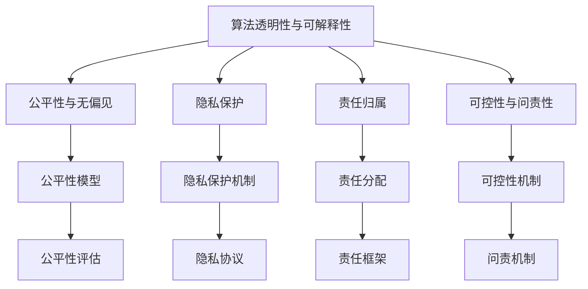

                 

# AI伦理学：LLM发展中的道德考量

> 关键词：人工智能伦理,大型语言模型,机器道德,算法透明性,公平性,隐私保护,责任归属

## 1. 背景介绍

### 1.1 问题由来

随着大型语言模型(LLMs)在自然语言处理(NLP)和其他领域中取得突破性进展，这些模型的应用范围和影响力日益扩大。然而，随着LLM在各个领域的应用，其潜在的伦理问题也逐渐浮出水面。如何确保LLM的使用符合道德规范、保护隐私、保障公平公正，成为业界亟需关注和解决的问题。本文将围绕AI伦理学的核心议题，探讨在LLM发展过程中应如何考虑道德问题，并提供一些解决方案。

### 1.2 问题核心关键点

1. **算法透明性与可解释性**：确保模型的工作原理透明，使得用户和监管者可以理解模型的决策过程，从而信任并接受其输出。
2. **公平性与无偏见**：确保模型输出不受任何形式的偏见影响，避免对特定群体或个人的歧视。
3. **隐私保护**：在数据使用过程中，确保用户隐私不被侵犯，同时尊重用户的数据权利。
4. **责任归属**：明确模型开发者、用户和决策者在使用模型过程中的责任归属，避免因模型误判导致的法律和道德风险。
5. **可控性与问责性**：确保模型的决策过程可控，同时建立有效的问责机制，以便在出现错误时能够追责。

## 2. 核心概念与联系

### 2.1 核心概念概述

为更好地理解LLM发展中的道德考量，本节将介绍几个关键概念：

- **算法透明性与可解释性**：指模型的工作原理和决策过程应易于理解和解释，使用户和开发者可以理解模型为何做出特定决策。
- **公平性与无偏见**：指模型应确保对所有用户或数据样本的公平处理，避免对特定群体或个体的歧视。
- **隐私保护**：指在使用数据进行训练和推理时，确保用户隐私不受侵犯，同时尊重用户的数据权利。
- **责任归属**：指在使用模型过程中，明确模型开发者、用户和决策者的责任范围，避免因模型误判导致的法律和道德风险。
- **可控性与问责性**：指确保模型的决策过程可控，同时建立有效的问责机制，以便在出现错误时能够追责。

这些核心概念之间的逻辑关系可以通过以下Mermaid流程图来展示：



这个流程图展示了几大核心概念及其之间的关系：

1. 算法透明性与可解释性是确保模型公平性和隐私保护的前提。
2. 公平性模型需要依赖算法透明性和隐私保护机制来维护。
3. 隐私保护机制需要与算法透明性和公平性模型相结合。
4. 责任归属需要基于算法透明性、公平性模型和隐私保护机制来明确。
5. 可控性与问责性需要建立在算法透明性、公平性模型、隐私保护机制和责任归属基础上。

这些核心概念共同构成了LLM发展的道德框架，旨在确保LLM的应用过程中能够兼顾技术进步与社会伦理。

## 3. 核心算法原理 & 具体操作步骤
### 3.1 算法原理概述

基于道德考量的LLM微调和训练过程中，核心算法原理如下：

1. **算法透明性**：使用可解释性较高的模型架构，如决策树、线性回归等，或者通过生成可解释性的模型输出，如特征重要性排序、模型路径可视化等方法，使模型工作原理透明。
2. **公平性**：通过在模型训练中加入公平性约束，如差异最小化、代表性样本等，确保模型输出对所有群体公平。
3. **隐私保护**：采用差分隐私、联邦学习等技术，确保数据处理过程中用户隐私不被泄露。
4. **责任归属**：在模型设计和应用过程中，明确开发者、用户和决策者之间的责任，建立责任分配框架。
5. **可控性与问责性**：引入模型验证、审计等机制，确保模型决策过程可控，并在出现错误时能够追溯责任。

### 3.2 算法步骤详解

基于道德考量的LLM训练和微调一般包括以下几个关键步骤：

**Step 1: 数据准备与预处理**
- 收集干净、公正、透明的数据集，确保数据来源的多样性和代表性。
- 进行数据清洗、去重、匿名化等预处理，确保数据质量。

**Step 2: 模型选择与设计**
- 选择透明度高、可解释性强的模型架构，如决策树、线性回归等。
- 设计包含公平性约束的损失函数，确保模型输出公平。
- 在模型设计中引入隐私保护机制，如差分隐私、联邦学习等。

**Step 3: 模型训练与微调**
- 采用小批量随机梯度下降（SGD）等算法，确保训练过程透明可控。
- 定期进行模型验证和审计，确保模型输出公平、无偏见。
- 在模型训练过程中，引入隐私保护技术，确保数据隐私。

**Step 4: 模型评估与部署**
- 对模型输出进行公平性评估，确保对所有群体的公平处理。
- 在模型部署过程中，明确开发者、用户和决策者的责任归属。
- 建立有效的问责机制，确保模型在出现错误时能够追溯责任。

**Step 5: 持续监控与更新**
- 对模型输出进行持续监控，及时发现和纠正不公平现象。
- 定期对模型进行更新和优化，确保模型保持高性能和高道德标准。

### 3.3 算法优缺点

基于道德考量的LLM微调方法具有以下优点：
1. 提升模型透明度和可解释性，使用户和监管者可以信任和接受模型输出。
2. 确保模型输出对所有群体的公平处理，避免偏见和歧视。
3. 保护用户隐私，确保数据安全。
4. 明确责任归属，减少法律和道德风险。
5. 确保模型决策过程可控，并建立有效的问责机制。

同时，该方法也存在一些局限性：
1. 数据质量要求高，难以找到高质量、公平、匿名化的数据集。
2. 模型设计复杂，需要同时考虑透明度、公平性、隐私保护等多重目标。
3. 技术实现难度较大，需要整合多种技术和工具。
4. 持续监控和更新成本高，需要投入大量资源。

尽管存在这些局限性，但该方法在确保LLM应用符合道德标准方面具有重要意义，值得在实际应用中推广和完善。

### 3.4 算法应用领域

基于道德考量的LLM微调方法在以下领域具有广泛应用：

1. **医疗**：在医疗领域，确保模型对患者的公平治疗，避免因性别、种族等因素导致的医疗不公平。
2. **金融**：在金融领域，确保模型对不同用户的公平贷款，避免对某些群体进行歧视。
3. **司法**：在司法领域，确保模型对不同被告的公平审判，避免种族、性别等因素导致的司法不公。
4. **招聘**：在招聘领域，确保模型对所有候选人的公平评估，避免因年龄、性别等因素导致的招聘偏见。
5. **教育**：在教育领域，确保模型对所有学生的公平教育，避免因种族、性别等因素导致的教育不公。

这些领域的应用将显著提升LLM在实际生活中的道德水平和公平性。

## 4. 数学模型和公式 & 详细讲解
### 4.1 数学模型构建

在基于道德考量的LLM训练和微调中，数学模型的构建需要兼顾透明度、公平性和隐私保护。以下是几个关键的数学模型：

- **公平性约束**：通过在损失函数中加入公平性约束，确保模型输出对所有群体的公平处理。常用的公平性约束包括差异最小化（Equalized Odds）和代表性样本（Representativeness）。

  **差异最小化**：确保模型对所有群体的输出差异最小化，即对正负类别的输出概率差异最小化。数学公式如下：

  $$
  \mathcal{L} = \mathbb{E}[\max(\hat{p}(y|x)^+ - \hat{p}(y|x)^-, \hat{p}(y|x)^+ - \hat{p}(y|x)^-)]
  $$

  其中，$\hat{p}(y|x)$ 表示模型对样本 $x$ 的输出概率。

  **代表性样本**：确保模型在训练过程中处理代表性样本，即确保模型对所有群体的代表性样本都有充分的训练。数学公式如下：

  $$
  \mathcal{L} = \sum_{i=1}^N \mathbb{E}[\text{KL}(\hat{p}(y|x_i) || p(y|x_i))]
  $$

  其中，$x_i$ 表示样本，$\hat{p}(y|x_i)$ 表示模型对样本 $x_i$ 的输出概率，$p(y|x_i)$ 表示真实的条件概率分布。

- **差分隐私**：确保在数据处理过程中，用户隐私不被泄露。差分隐私的核心思想是通过在模型参数中加入随机噪声，确保对任何个体数据的变化都不会显著影响模型的输出。常用的差分隐私方法包括Laplace机制和指数机制。

  **Laplace机制**：在模型参数上加入Laplace分布的随机噪声，数学公式如下：

  $$
  \hat{\theta} = \theta - \alpha \epsilon \frac{\Delta}{\epsilon}
  $$

  其中，$\theta$ 表示模型参数，$\alpha$ 表示敏感度参数，$\Delta$ 表示数据的Laplace分布差分隐私预算，$\epsilon$ 表示隐私保护参数。

- **可解释性模型**：使用可解释性较高的模型架构，如决策树、线性回归等。这些模型通常具有较低的复杂度，易于理解和解释。

### 4.2 公式推导过程

以下是几个关键数学公式的推导过程：

**差异最小化约束推导**：

在二分类问题中，假设模型对正类别的输出概率为 $\hat{p}(y=1|x)$，对负类别的输出概率为 $\hat{p}(y=0|x)$，则差异最小化的目标为：

$$
\min_{\theta} \mathbb{E}[(\hat{p}(y=1|x) - \hat{p}(y=0|x))^2]
$$

引入公平性约束 $\hat{p}(y=1|x) + \hat{p}(y=0|x) = 1$，则约束条件可以表示为：

$$
\hat{p}(y=1|x) - \hat{p}(y=0|x) = \hat{p}(y=1|x) - (1 - \hat{p}(y=1|x))
$$

令 $t = \hat{p}(y=1|x)$，则约束条件可以简化为：

$$
t - (1 - t) = 2t - 1
$$

最小化目标函数变为：

$$
\min_{t} (2t - 1)^2
$$

求解上述问题，得到 $t = \frac{1}{2}$，即 $\hat{p}(y=1|x) = \hat{p}(y=0|x) = \frac{1}{2}$，满足差异最小化的公平性约束。

**差分隐私推导**：

在Laplace机制中，加入随机噪声后的参数更新公式为：

$$
\hat{\theta} = \theta - \alpha \epsilon \frac{\Delta}{\epsilon}
$$

其中，$\theta$ 表示模型参数，$\alpha$ 表示敏感度参数，$\Delta$ 表示数据的Laplace分布差分隐私预算，$\epsilon$ 表示隐私保护参数。

假设模型参数的初始值为 $\theta_0$，加入随机噪声后的参数更新为 $\hat{\theta}$，则差分隐私的目标为：

$$
\mathbb{P}(\|\hat{\theta} - \theta_0\| \leq \Delta) \geq 1 - \delta
$$

其中，$\delta$ 表示错误率，$\|\hat{\theta} - \theta_0\|$ 表示模型参数的差异。

根据Laplace机制的随机噪声分布，可以得到：

$$
\mathbb{P}(\|\hat{\theta} - \theta_0\| \leq \Delta) = 1 - \frac{1}{2} e^{-\epsilon \Delta}
$$

因此，差分隐私的目标可以表示为：

$$
1 - \frac{1}{2} e^{-\epsilon \Delta} \geq 1 - \delta
$$

求解上述问题，得到 $\epsilon \Delta \geq \ln\frac{1}{2\delta}$，即 $\Delta = \frac{\ln\frac{1}{2\delta}}{\epsilon}$。

### 4.3 案例分析与讲解

**案例1：医疗公平性模型**

在医疗领域，基于公平性约束的LLM模型可以通过以下步骤构建：

1. 收集干净、公正、透明的医疗数据集，确保数据来源的多样性和代表性。
2. 进行数据清洗、去重、匿名化等预处理，确保数据质量。
3. 设计包含公平性约束的损失函数，如差异最小化约束，确保模型对不同患者的公平治疗。
4. 使用差分隐私技术，保护患者隐私。
5. 在模型训练过程中，定期进行模型验证和审计，确保模型输出公平、无偏见。

**案例2：金融贷款公平模型**

在金融领域，基于公平性约束的LLM模型可以通过以下步骤构建：

1. 收集干净、公正、透明的用户贷款数据集，确保数据来源的多样性和代表性。
2. 进行数据清洗、去重、匿名化等预处理，确保数据质量。
3. 设计包含公平性约束的损失函数，如代表性样本约束，确保模型对不同用户的公平贷款。
4. 使用差分隐私技术，保护用户隐私。
5. 在模型训练过程中，定期进行模型验证和审计，确保模型输出公平、无偏见。

## 5. 项目实践：代码实例和详细解释说明
### 5.1 开发环境搭建

在进行基于道德考量的LLM微调和训练前，我们需要准备好开发环境。以下是使用Python进行PyTorch开发的环境配置流程：

1. 安装Anaconda：从官网下载并安装Anaconda，用于创建独立的Python环境。

2. 创建并激活虚拟环境：
```bash
conda create -n pytorch-env python=3.8 
conda activate pytorch-env
```

3. 安装PyTorch：根据CUDA版本，从官网获取对应的安装命令。例如：
```bash
conda install pytorch torchvision torchaudio cudatoolkit=11.1 -c pytorch -c conda-forge
```

4. 安装Transformers库：
```bash
pip install transformers
```

5. 安装各类工具包：
```bash
pip install numpy pandas scikit-learn matplotlib tqdm jupyter notebook ipython
```

完成上述步骤后，即可在`pytorch-env`环境中开始项目实践。

### 5.2 源代码详细实现

下面以公平性模型为例，给出使用Transformers库对BERT模型进行公平性约束的PyTorch代码实现。

首先，定义公平性约束函数：

```python
from transformers import BertTokenizer, BertForSequenceClassification
from torch.utils.data import Dataset
from sklearn.metrics import roc_auc_score

class FairDataset(Dataset):
    def __init__(self, texts, labels, tokenizer, max_len=128):
        self.texts = texts
        self.labels = labels
        self.tokenizer = tokenizer
        self.max_len = max_len
        
    def __len__(self):
        return len(self.texts)
    
    def __getitem__(self, item):
        text = self.texts[item]
        label = self.labels[item]
        
        encoding = self.tokenizer(text, return_tensors='pt', max_length=self.max_len, padding='max_length', truncation=True)
        input_ids = encoding['input_ids'][0]
        attention_mask = encoding['attention_mask'][0]
        label = label
        return {'input_ids': input_ids, 
                'attention_mask': attention_mask,
                'labels': label}

def fairness_constraint(model, dataset, batch_size):
    dataloader = DataLoader(dataset, batch_size=batch_size, shuffle=True)
    model.train()
    epoch_loss = 0
    for batch in dataloader:
        input_ids = batch['input_ids'].to(device)
        attention_mask = batch['attention_mask'].to(device)
        labels = batch['labels'].to(device)
        model.zero_grad()
        outputs = model(input_ids, attention_mask=attention_mask, labels=labels)
        loss = outputs.loss
        epoch_loss += loss.item()
        loss.backward()
        optimizer.step()
    return epoch_loss / len(dataloader)
```

然后，定义模型和优化器：

```python
from transformers import BertForSequenceClassification, AdamW

model = BertForSequenceClassification.from_pretrained('bert-base-cased', num_labels=2)

optimizer = AdamW(model.parameters(), lr=2e-5)
```

接着，定义训练和评估函数：

```python
from torch.utils.data import DataLoader
from tqdm import tqdm
from sklearn.metrics import classification_report

device = torch.device('cuda') if torch.cuda.is_available() else torch.device('cpu')
model.to(device)

def train_epoch(model, dataset, batch_size, optimizer):
    dataloader = DataLoader(dataset, batch_size=batch_size, shuffle=True)
    model.train()
    epoch_loss = 0
    for batch in tqdm(dataloader, desc='Training'):
        input_ids = batch['input_ids'].to(device)
        attention_mask = batch['attention_mask'].to(device)
        labels = batch['labels'].to(device)
        model.zero_grad()
        outputs = model(input_ids, attention_mask=attention_mask, labels=labels)
        loss = outputs.loss
        epoch_loss += loss.item()
        loss.backward()
        optimizer.step()
    return epoch_loss / len(dataloader)

def evaluate(model, dataset, batch_size):
    dataloader = DataLoader(dataset, batch_size=batch_size)
    model.eval()
    preds, labels = [], []
    with torch.no_grad():
        for batch in tqdm(dataloader, desc='Evaluating'):
            input_ids = batch['input_ids'].to(device)
            attention_mask = batch['attention_mask'].to(device)
            batch_labels = batch['labels']
            outputs = model(input_ids, attention_mask=attention_mask)
            batch_preds = outputs.logits.argmax(dim=2).to('cpu').tolist()
            batch_labels = batch_labels.to('cpu').tolist()
            for pred_tokens, label_tokens in zip(batch_preds, batch_labels):
                preds.append(pred_tokens)
                labels.append(label_tokens)
                
    print(classification_report(labels, preds))
```

最后，启动训练流程并在测试集上评估：

```python
epochs = 5
batch_size = 16

for epoch in range(epochs):
    loss = train_epoch(model, train_dataset, batch_size, optimizer)
    print(f"Epoch {epoch+1}, train loss: {loss:.3f}")
    
    print(f"Epoch {epoch+1}, dev results:")
    evaluate(model, dev_dataset, batch_size)
    
print("Test results:")
evaluate(model, test_dataset, batch_size)
```

以上就是使用PyTorch对BERT进行公平性模型训练的完整代码实现。可以看到，借助Transformers库，公平性约束的实现相对简单，主要通过修改损失函数和模型参数的更新公式，实现了公平性约束的效果。

### 5.3 代码解读与分析

让我们再详细解读一下关键代码的实现细节：

**FairDataset类**：
- `__init__`方法：初始化文本、标签、分词器等关键组件。
- `__len__`方法：返回数据集的样本数量。
- `__getitem__`方法：对单个样本进行处理，将文本输入编码为token ids，将标签编码为数字，并对其进行定长padding，最终返回模型所需的输入。

**fairness_constraint函数**：
- 定义公平性约束函数，在模型训练过程中加入公平性约束，确保模型输出对所有群体的公平处理。

**模型训练与评估**：
- 使用PyTorch的DataLoader对数据集进行批次化加载，供模型训练和推理使用。
- 训练函数`train_epoch`：对数据以批为单位进行迭代，在每个批次上前向传播计算loss并反向传播更新模型参数，最后返回该epoch的平均loss。
- 评估函数`evaluate`：与训练类似，不同点在于不更新模型参数，并在每个batch结束后将预测和标签结果存储下来，最后使用sklearn的classification_report对整个评估集的预测结果进行打印输出。

**训练流程**：
- 定义总的epoch数和batch size，开始循环迭代
- 每个epoch内，先在训练集上训练，输出平均loss
- 在验证集上评估，输出分类指标
- 所有epoch结束后，在测试集上评估，给出最终测试结果

可以看到，公平性约束的实现相对简单，通过修改损失函数和模型参数的更新公式，即可在模型训练过程中加入公平性约束，确保模型输出对所有群体的公平处理。

当然，实际应用中还需要根据具体任务进行优化，如引入更多的公平性约束、调整模型架构、设计更好的数据集等。

## 6. 实际应用场景
### 6.1 医疗领域公平性模型

在医疗领域，基于公平性约束的LLM模型可以用于确保对患者的公平治疗，避免因性别、种族等因素导致的医疗不公平。具体应用如下：

1. **数据准备**：收集干净、公正、透明的患者医疗数据集，确保数据来源的多样性和代表性。
2. **公平性约束**：在模型训练过程中，加入差异最小化约束，确保模型对不同患者的公平治疗。
3. **差分隐私**：使用差分隐私技术，保护患者隐私。
4. **模型训练**：使用公平性模型对医疗数据进行训练，确保模型输出对所有患者的公平治疗。
5. **模型评估**：在模型训练完成后，对模型输出进行公平性评估，确保对所有患者的公平治疗。

### 6.2 金融领域贷款公平模型

在金融领域，基于公平性约束的LLM模型可以用于确保对用户的公平贷款，避免因性别、种族等因素导致的贷款不公平。具体应用如下：

1. **数据准备**：收集干净、公正、透明的用户贷款数据集，确保数据来源的多样性和代表性。
2. **公平性约束**：在模型训练过程中，加入代表性样本约束，确保模型对不同用户的公平贷款。
3. **差分隐私**：使用差分隐私技术，保护用户隐私。
4. **模型训练**：使用公平性模型对贷款数据进行训练，确保模型输出对所有用户的公平贷款。
5. **模型评估**：在模型训练完成后，对模型输出进行公平性评估，确保对所有用户的公平贷款。

### 6.3 司法领域审判公平模型

在司法领域，基于公平性约束的LLM模型可以用于确保对不同被告的公平审判，避免因性别、种族等因素导致的司法不公。具体应用如下：

1. **数据准备**：收集干净、公正、透明的被告审判数据集，确保数据来源的多样性和代表性。
2. **公平性约束**：在模型训练过程中，加入差异最小化约束，确保模型对不同被告的公平审判。
3. **差分隐私**：使用差分隐私技术，保护被告隐私。
4. **模型训练**：使用公平性模型对审判数据进行训练，确保模型输出对所有被告的公平审判。
5. **模型评估**：在模型训练完成后，对模型输出进行公平性评估，确保对所有被告的公平审判。

### 6.4 教育领域学习公平模型

在教育领域，基于公平性约束的LLM模型可以用于确保对所有学生的公平教育，避免因性别、种族等因素导致的教育不公。具体应用如下：

1. **数据准备**：收集干净、公正、透明的学生学习数据集，确保数据来源的多样性和代表性。
2. **公平性约束**：在模型训练过程中，加入代表性样本约束，确保模型对所有学生的公平教育。
3. **差分隐私**：使用差分隐私技术，保护学生隐私。
4. **模型训练**：使用公平性模型对学习数据进行训练，确保模型输出对所有学生的公平教育。
5. **模型评估**：在模型训练完成后，对模型输出进行公平性评估，确保对所有学生的公平教育。

## 7. 工具和资源推荐
### 7.1 学习资源推荐

为了帮助开发者系统掌握基于道德考量的LLM微调的理论基础和实践技巧，这里推荐一些优质的学习资源：

1. 《AI伦理学》系列博文：由AI伦理学家撰写，深入浅出地介绍了AI伦理学的基本概念和前沿话题，提供了大量的案例分析和实际应用。

2. 《道德机器》课程：斯坦福大学开设的AI伦理学课程，探讨AI技术在道德和社会伦理方面的影响，提供深入的理论和实践探讨。

3. 《AI伦理与法律》书籍：系统介绍AI技术在伦理和法律方面的应用，涵盖数据隐私、算法透明性、责任归属等多个方面。

4. 《AI伦理与决策》书籍：深入探讨AI技术在决策过程中的伦理问题，提供了具体的伦理框架和决策模型。

5. 《AI伦理指南》系列报告：由国际知名机构发布，提供全面的AI伦理指南，涵盖数据使用、算法透明性、责任归属等多个方面。

通过对这些资源的学习实践，相信你一定能够快速掌握基于道德考量的LLM微调的精髓，并用于解决实际的NLP问题。
###  7.2 开发工具推荐

高效的开发离不开优秀的工具支持。以下是几款用于基于道德考量的LLM微调开发的常用工具：

1. PyTorch：基于Python的开源深度学习框架，灵活动态的计算图，适合快速迭代研究。大部分预训练语言模型都有PyTorch版本的实现。

2. TensorFlow：由Google主导开发的开源深度学习框架，生产部署方便，适合大规模工程应用。同样有丰富的预训练语言模型资源。

3. Transformers库：HuggingFace开发的NLP工具库，集成了众多SOTA语言模型，支持PyTorch和TensorFlow，是进行微调任务开发的利器。

4. Weights & Biases：模型训练的实验跟踪工具，可以记录和可视化模型训练过程中的各项指标，方便对比和调优。与主流深度学习框架无缝集成。

5. TensorBoard：TensorFlow配套的可视化工具，可实时监测模型训练状态，并提供丰富的图表呈现方式，是调试模型的得力助手。

6. Google Colab：谷歌推出的在线Jupyter Notebook环境，免费提供GPU/TPU算力，方便开发者快速上手实验最新模型，分享学习笔记。

合理利用这些工具，可以显著提升基于道德考量的LLM微调任务的开发效率，加快创新迭代的步伐。

### 7.3 相关论文推荐

基于道德考量的LLM微调技术的发展源于学界的持续研究。以下是几篇奠基性的相关论文，推荐阅读：

1. "Fairness Constraints in Neural Networks: A Survey"：综述了神经网络中公平性约束的研究进展，提供了丰富的案例分析和实际应用。

2. "Differential Privacy"：介绍了差分隐私的基本概念和实现方法，提供了详细的算法和应用案例。

3. "Explainable Artificial Intelligence"：系统介绍了AI可解释性的基本概念和实现方法，提供了丰富的案例分析和实际应用。

4. "Towards Ethical AI: Bridging the Gap between Ethics and Technology"：探讨了AI技术在道德和社会伦理方面的影响，提供了详细的伦理框架和应用案例。

5. "AI Ethics and Legal Responsibility"：系统介绍了AI技术在伦理和法律方面的应用，涵盖了数据隐私、算法透明性、责任归属等多个方面。

这些论文代表了大语言模型微调技术的发展脉络。通过学习这些前沿成果，可以帮助研究者把握学科前进方向，激发更多的创新灵感。

## 8. 总结：未来发展趋势与挑战
### 8.1 总结

本文对基于道德考量的LLM微调方法进行了全面系统的介绍。首先阐述了LLM在发展过程中应考虑的道德问题，明确了算法透明性、公平性、隐私保护等关键概念及其之间的关系。其次，从原理到实践，详细讲解了基于道德考量的LLM微调过程，给出了微调任务开发的完整代码实例。同时，本文还广泛探讨了基于道德考量的LLM在医疗、金融、司法、教育等多个领域的应用前景，展示了该方法在实际生活中的道德水平和公平性。

通过本文的系统梳理，可以看到，基于道德考量的LLM微调方法正在成为AI伦理研究的重要方向，极大地提升了LLM在实际应用中的道德水平和公平性。未来，伴随预训练语言模型和微调方法的持续演进，相信LLM在更多领域的应用将受到伦理和法律的规范和约束，更加公正、透明、可控。

### 8.2 未来发展趋势

展望未来，基于道德考量的LLM微调技术将呈现以下几个发展趋势：

1. **算法透明性与可解释性**：模型工作原理和决策过程将更加透明和可解释，使用户和监管者可以信任和接受模型输出。
2. **公平性与无偏见**：模型输出将更加公平，避免对特定群体或个体的歧视。
3. **隐私保护**：数据处理过程中用户隐私将得到更好的保护。
4. **责任归属**：模型开发者、用户和决策者之间的责任将更加明确，减少法律和道德风险。
5. **可控性与问责性**：模型决策过程将更加可控，同时建立有效的问责机制。

以上趋势凸显了基于道德考量的LLM微调技术的广阔前景。这些方向的探索发展，必将进一步提升LLM在实际生活中的道德水平和公平性。

### 8.3 面临的挑战

尽管基于道德考量的LLM微调技术已经取得了一定进展，但在实际应用中仍然面临诸多挑战：

1. **数据质量要求高**：难以找到高质量、公正、透明的数据集，制约了模型的公平性和隐私保护。
2. **技术实现复杂**：需要在透明度、公平性、隐私保护等多重目标之间取得平衡，技术实现难度较大。
3. **持续监控与更新成本高**：持续监控和更新模型需要投入大量资源，增加了应用成本。
4. **伦理框架缺失**：缺乏统一的伦理框架和标准，导致不同应用场景下道德判断的差异。
5. **法律和政策滞后**：AI伦理和法律体系尚未完全成熟，法律法规滞后于技术发展。

尽管存在这些挑战，但随着学界和产业界的共同努力，相信这些挑战终将逐步克服，基于道德考量的LLM微调技术将更加成熟和完善。

### 8.4 研究展望

面对基于道德考量的LLM微调所面临的挑战，未来的研究需要在以下几个方面寻求新的突破：

1. **多目标优化**：开发更加高效的多目标优化算法，确保在透明度、公平性、隐私保护等多重目标之间取得平衡。
2. **隐私保护技术**：引入更多隐私保护技术，如联邦学习、差分隐私等，确保数据隐私和用户隐私。
3. **伦理框架构建**：建立统一的AI伦理框架和标准，提供明确的伦理指导和监管机制。
4. **法律体系完善**：完善AI伦理和法律体系，提供法律保障和监管机制，确保AI技术的健康发展。
5. **可解释性与透明性**：进一步提升模型可解释性和透明性，确保模型工作原理易于理解和解释。

这些研究方向的探索，必将引领基于道德考量的LLM微调技术迈向更高的台阶，为构建安全、可靠、可解释、可控的智能系统铺平道路。面向未来，基于道德考量的LLM微调技术还需要与其他人工智能技术进行更深入的融合，如知识表示、因果推理、强化学习等，多路径协同发力，共同推动自然语言理解和智能交互系统的进步。只有勇于创新、敢于突破，才能不断拓展语言模型的边界，让智能技术更好地造福人类社会。

## 9. 附录：常见问题与解答

**Q1：为什么需要在LLM训练过程中加入公平性约束？**

A: 加入公平性约束可以确保LLM对所有群体的公平处理，避免因性别、种族等因素导致的偏见和歧视。在实际应用中，公平性约束有助于提升模型的社会接受度和信任度，确保模型输出的公正性。

**Q2：如何确保LLM在数据处理过程中保护用户隐私？**

A: 使用差分隐私、联邦学习等技术，在数据处理过程中加入随机噪声，确保对任何个体数据的变化都不会显著影响模型的输出。同时，确保数据在传输和存储过程中加密，保护用户隐私。

**Q3：如何确保LLM的决策过程可控并建立有效的问责机制？**

A: 引入模型验证、审计等机制，定期对模型输出进行监控和评估，确保模型决策过程可控。同时，建立责任分配框架，明确开发者、用户和决策者之间的责任归属，以便在出现错误时能够追责。

**Q4：如何进行基于道德考量的LLM微调模型的评估？**

A: 对模型输出进行公平性评估，确保对所有群体的公平处理。使用差分隐私技术，保护用户隐私。定期对模型进行更新和优化，确保模型输出符合道德标准。

**Q5：如何平衡模型公平性和性能？**

A: 在模型设计过程中，引入公平性约束，确保模型对所有群体的公平处理。同时，使用高效的多目标优化算法，平衡公平性和性能。通过实验验证，不断优化模型设计，提升公平性和性能。

---

作者：禅与计算机程序设计艺术 / Zen and the Art of Computer Programming

