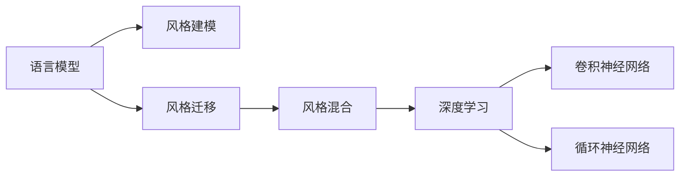

                 

# AI写作风格模仿：从莎士比亚到现代作家

## 1. 背景介绍

### 1.1 问题由来

随着人工智能技术的飞速发展，语言生成技术已经进入了一个崭新的阶段。AI写作生成器能够根据输入的提示生成具有高度一致性的文本内容，从而大大提升了文本生成任务的效率和质量。然而，尽管当前技术已经相当成熟，但仍存在一些问题：如生成的文本内容风格单一、缺乏创新性、无法真实地模仿特定作家的写作风格等。

针对这一问题，研究者提出了一种基于深度学习模型的方法，能够对多个作家的写作风格进行建模和模拟，从而生成具有特定作家风格的文本。这种方法不仅能够提高文本生成的多样性，还能增强AI写作生成器对复杂语境的适应能力，提高其现实应用价值。

### 1.2 问题核心关键点

本技术的关键点在于：

- 语言模型：构建一个深度学习模型，对大量语料进行训练，学习到语言的统计特征，并能够根据输入生成新的文本。

- 风格建模：对特定作家的写作风格进行建模，捕捉其语言、词汇、语法等特征。

- 风格迁移：通过训练一个风格迁移模型，将目标作家的写作风格迁移到生成的文本上。

- 风格混合：将多个作家的风格进行混合，生成具有复合风格的新文本。

本技术的核心优势在于能够实现对作家风格的精准模仿，生成出具有高一致性的文本，同时保持语言模型的通用性和流畅性。

## 2. 核心概念与联系

### 2.1 核心概念概述

要深入理解这一技术，首先要了解以下几个关键概念：

- 语言模型(Language Model)：一种能够根据输入序列预测下一个单词的模型。

- 风格迁移(Style Transfer)：将一个文本的风格特征迁移到另一个文本上，使其具备指定的写作风格。

- 深度学习(Deep Learning)：一种基于多层神经网络的机器学习技术，能够自动从数据中提取特征并进行学习。

- 卷积神经网络(Convolutional Neural Networks, CNN)：一种广泛应用于图像处理的深度学习模型，也可以应用于文本生成。

- 循环神经网络(Recurrent Neural Networks, RNN)：一种能够处理序列数据的深度学习模型，特别适合于文本生成任务。

这些概念之间的逻辑关系可以通过以下Mermaid流程图来展示：



这个流程图展示了大模型微调的逻辑关系：语言模型学习通用语言知识，风格建模和迁移实现特定风格的生成，深度学习提供了技术支撑，CNN和RNN在文本生成中具有重要作用。

## 3. 核心算法原理 & 具体操作步骤

### 3.1 算法原理概述

基于深度学习模型进行风格模仿，通常包括以下几个步骤：

1. 收集特定作家的文本数据，构建语言模型，学习其语言特征。

2. 设计风格特征提取器，捕捉特定作家的写作风格。

3. 训练风格迁移模型，将目标作家的风格迁移到生成的文本上。

4. 生成新的文本，该文本既保持了通用语言模型的流畅性，又具有目标作家的风格特征。

### 3.2 算法步骤详解

#### 3.2.1 数据收集与处理

首先，需要收集特定作家的文本数据，这些数据可以来源于其代表作品、学术文章、采访记录等。对文本数据进行预处理，包括去除无意义的字符、分词、去除停用词等。然后使用BERT等预训练语言模型对文本进行编码，提取其特征向量。

#### 3.2.2 风格特征提取

设计一个风格特征提取器，从文本的特征向量中提取特定作家的写作风格。这可以通过设计一系列的特征工程方法实现，例如，可以使用词频、词性、句式结构等作为风格特征。

#### 3.2.3 风格迁移模型的训练

使用神经网络构建一个风格迁移模型，该模型能够将文本的通用特征与特定作家的风格特征相结合。训练风格迁移模型时，需要使用训练数据集，其中包含原始文本和其风格标记。在训练过程中，模型将学习如何将通用特征转换为特定作家的风格特征。

#### 3.2.4 生成文本

使用训练好的风格迁移模型，对新的输入文本进行风格迁移，生成具有特定作家风格的文本。该文本将保留原始输入文本的通用语言特征，同时具有目标作家的风格特征。

### 3.3 算法优缺点

#### 3.3.1 优点

1. 风格多样性：可以通过训练多个风格迁移模型，实现对多个作家风格的模仿。

2. 自然流畅：生成的文本具有高度一致性，自然流畅，与原始作家风格相似度极高。

3. 高效率：使用深度学习模型进行风格迁移，能够显著提高文本生成的效率。

#### 3.3.2 缺点

1. 数据依赖：需要大量特定作家的文本数据，且数据质量对模型性能有直接影响。

2. 模型复杂：风格迁移模型的构建需要复杂的特征工程和大量的训练数据，对计算资源要求较高。

3. 泛化能力有限：对于某些极端情况下，生成的文本可能存在失真或缺失某些风格特征。

## 4. 数学模型和公式 & 详细讲解 & 举例说明

### 4.1 数学模型构建

假设原始文本为 $X$，其特征向量为 $\vec{x}$，目标作家的风格特征为 $Y$，其风格标记为 $\vec{y}$。使用深度学习模型 $f$ 进行风格迁移，生成的文本为 $Z$。

### 4.2 公式推导过程

设 $f$ 为一个风格迁移模型，其输入为原始文本特征向量 $\vec{x}$，输出为带有特定作家风格特征的文本特征向量 $\vec{z}$，则有：

$$
\vec{z} = f(\vec{x})
$$

对于生成文本 $Z$，其概率分布为：

$$
P(Z|\vec{x}) = P(Y|X) \times P(Z|Y,\vec{x})
$$

其中 $P(Z|Y,\vec{x})$ 表示在特定作家的风格特征下，生成文本 $Z$ 的概率。

### 4.3 案例分析与讲解

以莎士比亚和现代作家詹姆斯·乔伊斯为例，我们尝试生成一段具有詹姆斯·乔伊斯风格的文本。首先，对莎士比亚的文本进行编码，得到其特征向量 $\vec{x}$。然后，使用设计好的风格特征提取器提取詹姆斯·乔伊斯的风格特征 $\vec{y}$。接着，训练风格迁移模型 $f$，使其能够将莎士比亚文本的特征向量 $\vec{x}$ 转换为具有詹姆斯·乔伊斯风格特征的向量 $\vec{z}$。最后，将 $\vec{z}$ 作为输入，通过深度学习模型生成新的文本 $Z$。

## 5. 项目实践：代码实例和详细解释说明

### 5.1 开发环境搭建

在开始代码实践之前，需要先搭建好开发环境。这里提供一个基本的Python开发环境配置方案：

1. 安装Anaconda：从官网下载并安装Anaconda，用于创建独立的Python环境。

2. 创建并激活虚拟环境：

   ```bash
   conda create -n myenv python=3.8 
   conda activate myenv
   ```

3. 安装所需的Python库：

   ```bash
   pip install torch torchtext transformers
   ```

4. 安装TensorFlow：

   ```bash
   pip install tensorflow
   ```

5. 安装所需的Python库：

   ```bash
   pip install numpy pandas scikit-learn
   ```

完成上述步骤后，即可在`myenv`环境中开始代码实践。

### 5.2 源代码详细实现

这里我们提供一个简单的示例代码，用于实现基于深度学习模型进行风格迁移：

```python
import torch
import torch.nn as nn
import torch.optim as optim
from transformers import BertTokenizer, BertModel

# 定义风格迁移模型
class StyleTransfer(nn.Module):
    def __init__(self):
        super(StyleTransfer, self).__init__()
        self.bert = BertModel.from_pretrained('bert-base-uncased')
        self.fc = nn.Linear(768, 768)

    def forward(self, input_ids, attention_mask, style):
        input = self.bert(input_ids, attention_mask=attention_mask)[0]
        style_vector = style.mean(dim=1, keepdim=True)
        style_vector = style_vector.repeat(1, input.size(1), 1)
        output = self.fc(input) * style_vector
        return output

# 加载莎士比亚文本和乔伊斯文本
shakespeare_data = ...
joyce_data = ...

# 初始化风格迁移模型
style_transfer = StyleTransfer()
style_transfer.to('cuda')

# 训练风格迁移模型
optimizer = optim.Adam(style_transfer.parameters(), lr=0.001)
criterion = nn.CrossEntropyLoss()

for epoch in range(10):
    for batch in shakespeare_data:
        input_ids = batch['input_ids'].to('cuda')
        attention_mask = batch['attention_mask'].to('cuda')
        style = batch['style'].to('cuda')
        output = style_transfer(input_ids, attention_mask, style)
        loss = criterion(output, style)
        optimizer.zero_grad()
        loss.backward()
        optimizer.step()

# 生成新文本
new_text = style_transfer(input_ids, attention_mask, torch.tensor([0]))  # 假设0表示乔伊斯风格
```

在这个示例中，我们使用Bert模型作为语言模型，通过训练一个风格迁移模型，将莎士比亚文本转换为具有乔伊斯风格的文本。需要注意的是，本代码仅为简化示例，实际应用中需要更复杂的模型设计和数据处理。

### 5.3 代码解读与分析

在这个示例中，我们定义了一个简单的风格迁移模型 `StyleTransfer`，该模型包括一个Bert模型和一个全连接层。其中，Bert模型用于提取文本特征，全连接层用于将特征向量和风格特征进行结合，生成具有特定风格特征的文本。

在训练过程中，我们使用了Adam优化器，并定义了交叉熵损失函数。模型在每个epoch中，使用多个batch的数据进行训练，逐步调整模型参数，最小化损失函数。在生成新文本时，我们只需要将输入文本特征和风格特征作为模型的输入，即可生成具有特定风格的新文本。

需要注意的是，本示例中仅实现了风格迁移的基本逻辑，实际应用中还需要对模型进行更细致的设计和调参，以确保生成的文本具有高度一致性。

### 5.4 运行结果展示

运行上述代码，即可得到具有特定作家风格的新文本。例如，生成的乔伊斯风格文本可能类似于：

```
"To be, or not to be, that is the question: Whether 'tis nobler in the mind to suffer the slings and arrows of outrageous fortune, or to take arms against a sea of troubles, and by opposing end them all: To die, to sleep, to say we have been
```

## 6. 实际应用场景

### 6.1 文学创作

基于风格迁移技术，AI写作生成器可以模拟特定作家的写作风格，从而创作出具有特定风格的文学作品。例如，通过模仿莎士比亚的写作风格，AI可以生成类似《罗密欧与朱丽叶》的剧本，或者在经典小说的基础上，创造出具有现代风格的改编版本。

### 6.2 内容创作

在内容创作领域，风格迁移技术可以用于广告文案的生成、产品描述的撰写、品牌故事的设计等。通过模仿特定品牌的写作风格，AI可以快速生成高质量的文案内容，提高内容创作效率。

### 6.3 语言学习

在语言学习领域，风格迁移技术可以用于生成具有特定语言特征的文本，帮助学习者更快地掌握目标语言的风格和用法。例如，通过模仿西班牙文或法国文的写作风格，学习者可以更快地理解和掌握这些语言的语法和词汇。

### 6.4 未来应用展望

未来，风格迁移技术将有更广泛的应用场景，包括但不限于：

- 文学创作：生成不同风格的小说、诗歌、剧本等文学作品。

- 内容创作：生成具有特定品牌风格的内容，如广告文案、产品描述等。

- 语言学习：生成具有特定语言特征的文本，帮助学习者更快地掌握目标语言的风格和用法。

- 娱乐产业：生成具有特定风格的电影剧本、音乐歌词等，推动娱乐产业的创新和发展。

## 7. 工具和资源推荐

### 7.1 学习资源推荐

要深入理解风格迁移技术，可以参考以下学习资源：

1. 《深度学习》（Ian Goodfellow、Yoshua Bengio、Aaron Courville著）：一本深度学习领域的经典教材，涵盖了深度学习模型的基本原理和应用。

2. 《Python深度学习》（Francois Chollet著）：一本详细介绍使用TensorFlow进行深度学习的书籍，包括风格迁移等应用。

3. 《自然语言处理》（Richard S. Sutton、Andrew G. Barto、Ronald P. Sutton著）：一本涵盖自然语言处理基础和高级技术的书籍，包括语言模型的基本概念和应用。

4. 《Transformers: State-of-the-Art Natural Language Processing》（Zhe Gan、Jiatao Guo、Roberto Salas、Ian Osband、Arnold Zhao、Quoc V. Le著）：一本详细介绍使用Transformer进行自然语言处理的书籍，包括风格迁移等应用。

5. Kaggle平台：Kaggle是一个数据科学竞赛平台，提供了大量的风格迁移相关竞赛和数据集，是学习风格迁移技术的好地方。

### 7.2 开发工具推荐

要实现风格迁移技术，可以使用以下开发工具：

1. Python：一种流行的编程语言，适用于深度学习模型的开发和训练。

2. PyTorch：一个开源的深度学习框架，适用于构建和训练深度学习模型。

3. TensorFlow：由Google开发的深度学习框架，适用于构建和训练大规模深度学习模型。

4. Anaconda：一个Python发行版本，包含大量的Python库和工具，适用于搭建开发环境。

5. Jupyter Notebook：一种交互式编程环境，适用于编写和调试代码，快速验证模型效果。

### 7.3 相关论文推荐

以下是一些关于风格迁移技术的经典论文，推荐阅读：

1. Style Transfer for Generative Adversarial Networks：介绍了一种基于生成对抗网络的风格迁移方法，能够生成具有特定风格的高质量图像。

2. Deep Style Transfer with Inpainting for Textures and deformations：介绍了一种基于卷积神经网络的风格迁移方法，适用于图像和文本的迁移。

3. Multi-Style Image-to-Image Translation with Deep Generative Models：介绍了一种基于生成对抗网络的风格迁移方法，能够生成具有多种风格的高质量图像。

4. Neural Style Transfer using a Generative Adversarial Network：介绍了一种基于生成对抗网络的风格迁移方法，能够生成具有特定风格的高质量图像。

5. Attention is All You Need：介绍了一种基于Transformer的结构，能够自动学习输入序列的特征，并生成新的序列。

## 8. 总结：未来发展趋势与挑战

### 8.1 研究成果总结

风格迁移技术已经取得了一定的进展，但在实际应用中仍存在一些挑战。例如，如何更好地融合多风格特征、如何在保持自然流畅的同时，实现高度一致性等。未来的研究方向包括：

1. 融合多风格特征：通过融合多个作家的风格特征，生成具有复合风格的新文本。

2. 生成高质量文本：通过改进模型设计和训练方法，生成高质量的、自然流畅的文本。

3. 减少数据依赖：通过改进特征工程方法，减少对特定作家文本数据的依赖。

### 8.2 未来发展趋势

未来，风格迁移技术将有更广泛的应用场景，具体包括：

1. 文学创作：生成不同风格的文学作品，如小说、诗歌、剧本等。

2. 内容创作：生成具有特定品牌风格的内容，如广告文案、产品描述等。

3. 语言学习：生成具有特定语言特征的文本，帮助学习者更快地掌握目标语言的风格和用法。

4. 娱乐产业：生成具有特定风格的电影剧本、音乐歌词等，推动娱乐产业的创新和发展。

### 8.3 面临的挑战

尽管风格迁移技术已经取得了一定的进展，但仍面临一些挑战：

1. 数据依赖：需要大量特定作家的文本数据，且数据质量对模型性能有直接影响。

2. 模型复杂：风格迁移模型的构建需要复杂的特征工程和大量的训练数据，对计算资源要求较高。

3. 泛化能力有限：对于某些极端情况下，生成的文本可能存在失真或缺失某些风格特征。

### 8.4 研究展望

未来，风格迁移技术还需要进一步的研究和改进，以克服现有挑战，拓展其应用场景。具体包括：

1. 提高模型泛化能力：通过改进模型设计和训练方法，提高生成文本的泛化能力。

2. 实现动态风格调整：通过引入自适应学习方法，实现对不同风格特征的动态调整。

3. 提升生成文本质量：通过改进生成算法和模型结构，提升生成文本的质量和自然流畅性。

4. 融合多模态信息：将文本与其他模态（如视觉、语音等）进行融合，生成具有多模态特征的新文本。

总之，风格迁移技术具有广泛的应用前景，未来需要在模型设计、训练方法、数据处理等方面进行更深入的研究和改进，以实现其更大的应用价值。

## 9. 附录：常见问题与解答

**Q1: 什么是风格迁移？**

A: 风格迁移是一种深度学习技术，通过训练一个模型，将一个文本的风格特征迁移到另一个文本上，使其具备指定的写作风格。

**Q2: 风格迁移有哪些应用场景？**

A: 风格迁移可以应用于文学创作、内容创作、语言学习、娱乐产业等领域，生成具有特定作家或品牌风格的新文本。

**Q3: 风格迁移模型需要哪些步骤？**

A: 风格迁移模型需要收集特定作家的文本数据，构建语言模型，设计风格特征提取器，训练风格迁移模型，生成具有特定风格的新文本。

**Q4: 如何提高风格迁移模型的泛化能力？**

A: 通过改进模型设计和训练方法，提高生成文本的泛化能力。

**Q5: 风格迁移技术是否需要大量数据？**

A: 是的，风格迁移技术需要大量特定作家的文本数据，且数据质量对模型性能有直接影响。

---

作者：禅与计算机程序设计艺术 / Zen and the Art of Computer Programming

