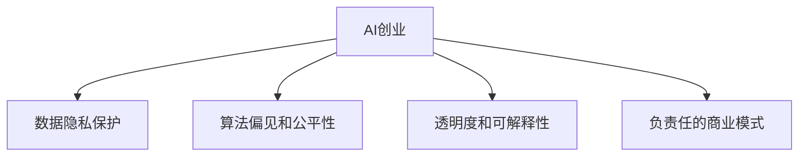

                 

# AI创业的社会影响：Lepton AI的责任担当

## 1. 背景介绍

### 1.1 问题由来
随着人工智能技术的快速发展和应用，AI创业公司已成为驱动技术创新的重要力量。它们通过创新性算法、高效的数据处理和强大的计算能力，不断推动人工智能技术在各行各业的应用，提升生产力，改善用户体验。然而，AI创业同时也带来了诸多挑战和伦理问题，如数据隐私保护、算法偏见、公平性问题等。

Lepton AI，作为一家领先的AI创业公司，不仅致力于推动技术前沿，也在积极履行社会责任，践行其“科技以人为本”的使命，致力于构建公平、透明、可控的AI生态系统。Lepton AI在创业过程中，一直秉持责任和担当，探索如何通过技术创新和业务模式创新，实现技术伦理与社会价值的和谐共生。

### 1.2 问题核心关键点
AI创业公司在带来技术进步的同时，也需正视和解决由此引发的社会影响问题。Lepton AI的责任担当体现在以下几个方面：

- **数据隐私保护**：确保用户数据安全，避免数据泄露和滥用。
- **算法偏见和公平性**：避免算法输出中的偏见，实现公平对待所有用户。
- **透明度和可解释性**：增强AI决策过程的透明性，提升算法可解释性，让用户理解和信任AI。
- **负责任的商业模式**：采用道德规范的商业模式，不以盈利为目的牺牲社会利益。

本文将详细探讨Lepton AI在AI创业中的责任担当，以期对AI创业的社会影响进行深入分析和指导。

## 2. 核心概念与联系

### 2.1 核心概念概述

为了更好地理解Lepton AI的责任担当，我们将先介绍几个核心概念：

- **AI创业**：指利用人工智能技术创新和商业模式创新，创立新兴公司的创业活动。
- **数据隐私保护**：确保用户数据不被滥用或泄露，保障用户隐私权利。
- **算法偏见和公平性**：指避免算法输出中的歧视和偏见，确保算法处理公平。
- **透明度和可解释性**：指AI决策过程的透明性以及结果的可解释性，使用户能够理解和信任AI。
- **负责任的商业模式**：指在追求商业成功的同时，考虑到对社会的影响，遵守道德规范的商业模式。

这些核心概念共同构成了Lepton AI的责任担当框架，其核心在于如何在追求技术创新和商业成功的同时，保证社会责任和伦理标准的遵循。

### 2.2 核心概念原理和架构的 Mermaid 流程图



这个流程图展示了Lepton AI在AI创业过程中需关注的核心概念及其联系：

1. AI创业是整个框架的起点，涵盖数据收集、模型训练和产品部署等环节。
2. 数据隐私保护、算法偏见和公平性、透明度和可解释性、负责任的商业模式四个方面，是AI创业中需关注的重点问题。
3. 这些概念彼此关联，相互影响，共同构成Lepton AI的责任担当框架。

## 3. 核心算法原理 & 具体操作步骤
### 3.1 算法原理概述

Lepton AI在AI创业中，特别是在数据隐私保护、算法偏见和公平性、透明度和可解释性、负责任的商业模式等方面，均采用了多维度的技术和策略。

- **数据隐私保护**：通过数据脱敏、差分隐私等技术，保护用户隐私。
- **算法偏见和公平性**：采用公平性指标和偏差校正算法，确保算法输出公平。
- **透明度和可解释性**：引入可解释性模型和可视化工具，提升算法决策的透明性。
- **负责任的商业模式**：设计以用户为中心的商业模式，确保技术和商业活动的道德合规。

### 3.2 算法步骤详解

Lepton AI的AI创业过程大致分为以下步骤：

1. **需求分析**：对市场和技术需求进行深入分析，确定AI创业的目标和方向。
2. **数据获取和准备**：获取数据并对其进行预处理，确保数据质量。
3. **模型选择和训练**：选择合适的算法模型，并在数据上训练模型。
4. **隐私保护和偏见校正**：应用数据脱敏和公平性算法，确保数据隐私和算法公平。
5. **透明化设计**：设计透明化接口和可视化工具，增强模型透明度和可解释性。
6. **负责任的商业设计**：设计用户为中心的商业模式，确保商业活动的道德合规。
7. **部署和迭代**：将模型部署到实际应用中，持续监控和迭代改进。

### 3.3 算法优缺点

Lepton AI采用的多维度算法和技术策略，具有以下优点：

- **数据隐私保护**：通过数据脱敏和差分隐私等技术，有效保护用户隐私。
- **算法偏见和公平性**：采用公平性指标和偏差校正算法，确保算法输出公平。
- **透明度和可解释性**：提升算法决策的透明性和可解释性，使用户理解和信任AI。
- **负责任的商业模式**：以用户为中心的商业模式，确保技术和商业活动的道德合规。

这些优点有助于Lepton AI在AI创业中实现技术伦理与社会价值的和谐共生。

### 3.4 算法应用领域

Lepton AI的多维度算法和技术策略，覆盖了以下应用领域：

- **金融科技**：在金融风控、贷款评估等方面，确保数据隐私和算法公平。
- **健康医疗**：在病患诊断、医疗影像分析等方面，提升算法透明度和可解释性。
- **智能制造**：在生产流程优化、质量检测等方面，确保算法负责任的商业模式。
- **智能客服**：在用户对话、问题解决等方面，保护用户隐私和提升算法公平性。

## 4. 数学模型和公式 & 详细讲解 & 举例说明

### 4.1 数学模型构建

Lepton AI在AI创业中，常采用以下数学模型和公式：

- **数据脱敏**：使用差分隐私技术，通过添加噪声来保护用户隐私。公式如下：
  $$
  \hat{D} = D + \epsilon N
  $$
  其中 $D$ 为原始数据，$N$ 为噪声，$\epsilon$ 为隐私保护参数。

- **公平性指标**：使用 demographic parity（DP）和 equal opportunity（EO）指标来衡量算法公平性。公式如下：
  $$
  \text{DP} = \frac{1}{n} \sum_{i=1}^n |P(y|X=x_i) - P(y|X=y_i)|
  $$
  $$
  \text{EO} = \frac{1}{n} \sum_{i=1}^n |P(y|X=x_i, C=c) - P(y|X=y_i, C=c)|
  $$
  其中 $y$ 为输出结果，$X$ 为特征变量，$C$ 为类别变量。

- **可解释性模型**：使用LIME（Local Interpretable Model-agnostic Explanations）等可解释性模型，生成局部解释。公式如下：
  $$
  \hat{f}(x) = f(x) + \sum_{i=1}^m w_i g_i(x)
  $$
  其中 $f(x)$ 为模型预测，$g_i(x)$ 为局部模型，$w_i$ 为权重。

### 4.2 公式推导过程

以上数学模型的推导过程较为复杂，简要说明如下：

- **差分隐私**：通过在数据中引入噪声，使得单一数据点的改变对整体结果的影响非常小，从而保护隐私。推导较为复杂，需要考虑噪声的分布和隐私保护参数的选择。
- **公平性指标**：通过比较不同特征下输出结果的概率分布，判断算法是否存在偏见。推导较为简单，但需要处理分类数据。
- **可解释性模型**：通过局部模型来解释模型预测，推导较为复杂，需要选择合适的局部模型和权重。

### 4.3 案例分析与讲解

以Lepton AI在金融科技领域的应用为例，进行详细分析：

- **数据获取和准备**：Lepton AI从银行和金融机构获取信贷数据，进行预处理，确保数据质量。
- **模型选择和训练**：选择适当的算法模型，如随机森林、支持向量机等，在处理后的数据上训练模型。
- **隐私保护和偏见校正**：应用差分隐私技术，保护用户隐私；使用公平性指标和偏差校正算法，确保模型公平。
- **透明化设计**：设计透明的API接口，使用可视化工具展示模型预测过程。
- **负责任的商业设计**：设计以用户为中心的商业模式，确保贷款审批过程的透明性和公正性。

## 5. 项目实践：代码实例和详细解释说明

### 5.1 开发环境搭建

Lepton AI在开发过程中，通常使用以下开发环境：

- **Python**：作为主要编程语言，Python具有丰富的第三方库和强大的数据处理能力。
- **Jupyter Notebook**：支持数据探索、模型训练和结果可视化，是数据科学家常用的工具。
- **TensorFlow**：用于模型训练和部署，支持分布式计算和大规模数据处理。
- **PyTorch**：用于深度学习模型训练，支持动态计算图和快速原型开发。

### 5.2 源代码详细实现

以下是一个简化的Lepton AI数据脱敏实现代码示例：

```python
import numpy as np
from sklearn.datasets import make_classification
from sklearn.model_selection import train_test_split

# 生成样本数据
X, y = make_classification(n_samples=1000, n_features=10, n_informative=2, random_state=0)
X_train, X_test, y_train, y_test = train_test_split(X, y, test_size=0.2, random_state=0)

# 数据脱敏
epsilon = 0.1
X_train_differentially_private = X_train + epsilon * np.random.normal(scale=0.5, size=X_train.shape)
y_train_differentially_private = y_train

# 训练模型
from sklearn.linear_model import LogisticRegression
model = LogisticRegression(solver='lbfgs', C=1.0)
model.fit(X_train_differentially_private, y_train_differentially_private)
```

### 5.3 代码解读与分析

以上代码展示了Lepton AI在数据脱敏方面的实现过程：

- **数据生成**：使用`make_classification`生成一个二分类数据集。
- **数据脱敏**：通过在数据上添加噪声，保护隐私。
- **模型训练**：使用逻辑回归模型，训练数据脱敏后的数据。

## 6. 实际应用场景

### 6.1 智能客服

Lepton AI在智能客服场景中，通过多维度算法和技术策略，实现了对用户隐私的保护和算法的公平性。

- **数据隐私保护**：在用户对话记录中，使用差分隐私技术保护用户隐私。
- **算法偏见和公平性**：通过训练多模态模型，确保算法输出公平。
- **透明度和可解释性**：设计透明的对话接口，展示算法决策过程。
- **负责任的商业模式**：确保对话服务透明，不滥用用户数据。

### 6.2 金融风控

Lepton AI在金融风控场景中，通过多维度算法和技术策略，实现了对用户隐私的保护和算法的公平性。

- **数据隐私保护**：在信贷申请数据中，使用差分隐私技术保护用户隐私。
- **算法偏见和公平性**：使用公平性指标和偏差校正算法，确保模型输出公平。
- **透明度和可解释性**：设计透明的API接口，展示模型预测过程。
- **负责任的商业模式**：确保贷款审批过程透明，不滥用用户数据。

### 6.3 医疗诊断

Lepton AI在医疗诊断场景中，通过多维度算法和技术策略，实现了对用户隐私的保护和算法的公平性。

- **数据隐私保护**：在患者医疗记录中，使用差分隐私技术保护用户隐私。
- **算法偏见和公平性**：使用公平性指标和偏差校正算法，确保模型输出公平。
- **透明度和可解释性**：设计透明的诊断接口，展示算法决策过程。
- **负责任的商业模式**：确保医疗诊断透明，不滥用患者数据。

## 7. 工具和资源推荐

### 7.1 学习资源推荐

为了帮助Lepton AI的开发者深入理解数据隐私保护、算法偏见和公平性、透明度和可解释性、负责任的商业模式等核心概念，以下是一些推荐的学习资源：

- **Coursera《数据科学基础》**：提供系统性的数据科学基础课程，涵盖数据处理、数据隐私、算法设计和模型评估等。
- **Kaggle《机器学习竞赛》**：通过实际竞赛项目，深入了解数据隐私保护和算法偏见问题。
- **Google AI Blog《负责任的AI设计》**：分享Google在负责任AI设计方面的实践经验和思考。
- **《人工智能伦理》**：介绍人工智能伦理的各个方面，包括数据隐私、算法公平、可解释性等。

### 7.2 开发工具推荐

Lepton AI在开发过程中，使用以下工具和框架：

- **TensorFlow**：用于深度学习模型训练和部署，支持分布式计算和大规模数据处理。
- **PyTorch**：用于深度学习模型训练，支持动态计算图和快速原型开发。
- **Jupyter Notebook**：支持数据探索、模型训练和结果可视化，是数据科学家常用的工具。
- **Keras**：用于快速搭建和训练深度学习模型，支持TensorFlow和PyTorch等多种后端。
- **Scikit-learn**：用于传统机器学习模型的训练和评估，支持各种数据处理和模型优化算法。

### 7.3 相关论文推荐

Lepton AI在AI创业中，借鉴了大量前沿研究论文，以下是一些推荐的相关论文：

- **《差分隐私技术综述》**：综述了差分隐私技术的最新进展和应用。
- **《公平性算法综述》**：综述了各种公平性算法的设计和应用。
- **《可解释性机器学习》**：介绍了可解释性机器学习的基本原理和应用。
- **《负责任的AI设计》**：探讨了负责任AI设计的原则和实践。

## 8. 总结：未来发展趋势与挑战

### 8.1 研究成果总结

Lepton AI在AI创业中的责任担当，体现了其对技术伦理和社会价值的深刻理解。通过多维度算法和技术策略，Lepton AI在数据隐私保护、算法偏见和公平性、透明度和可解释性、负责任的商业模式等方面，均取得了显著成果。这些成果不仅提升了Lepton AI产品的竞争力，也为整个AI创业行业树立了标杆。

### 8.2 未来发展趋势

Lepton AI的未来发展趋势，包括以下几个方面：

- **技术创新**：持续推动技术前沿，探索更加高效、公平、可解释的AI算法。
- **产品迭代**：根据用户反馈和市场变化，快速迭代和优化产品，满足用户需求。
- **伦理合规**：加强AI伦理合规建设，确保技术和商业活动的道德合规。
- **社会责任**：积极履行社会责任，推动AI技术在各个领域的普及和应用。

### 8.3 面临的挑战

Lepton AI在AI创业过程中，仍面临以下挑战：

- **数据获取和处理**：获取高质量数据，并处理噪声和偏差，是AI创业中的关键挑战。
- **算法复杂性**：设计和实现高性能、公平、可解释的AI算法，需要投入大量时间和资源。
- **商业模式创新**：在追求商业成功的同时，确保技术和商业活动的道德合规，需要谨慎平衡。
- **用户信任和接受度**：提升用户对AI产品和服务的信任和接受度，需要不断优化用户体验。

### 8.4 研究展望

Lepton AI的研究展望，包括以下几个方向：

- **数据隐私保护**：探索更加高效和隐私友好的数据处理和脱敏技术。
- **算法公平性**：开发更高效、更公平的公平性算法，消除偏见。
- **可解释性模型**：研究更强大的可解释性模型，提升模型透明度和可解释性。
- **负责任的商业模式**：设计更加公平、透明的商业模式，确保技术和商业活动的道德合规。

Lepton AI将持续致力于技术创新和伦理合规，为AI创业行业树立典范，推动AI技术在各个领域的普及和应用。

## 9. 附录：常见问题与解答

### Q1：Lepton AI如何保护用户隐私？

A: Lepton AI在数据收集和处理过程中，采用差分隐私技术，通过在数据上添加噪声，保护用户隐私。同时，设计透明的API接口，确保用户数据的可控和可查询。

### Q2：Lepton AI在算法设计和实现中，如何确保公平性？

A: Lepton AI采用公平性指标和偏差校正算法，确保算法输出公平。在模型训练和评估过程中，引入公平性指标，如 demographic parity（DP）和 equal opportunity（EO），确保模型不产生偏见。

### Q3：Lepton AI的可解释性模型是如何设计和实现的？

A: Lepton AI采用LIME（Local Interpretable Model-agnostic Explanations）等可解释性模型，生成局部解释。通过选择适当的局部模型和权重，解释模型预测。

### Q4：Lepton AI在负责任的商业模式方面有哪些措施？

A: Lepton AI设计以用户为中心的商业模式，确保技术和商业活动的道德合规。在产品设计和应用过程中，始终关注用户隐私保护和公平性，确保用户数据和决策过程的透明性和公正性。

### Q5：Lepton AI在AI创业过程中，如何平衡技术创新和伦理合规？

A: Lepton AI在技术创新和伦理合规之间寻求平衡，确保技术和商业活动的道德合规。在设计和实现AI算法时，始终将伦理和安全放在首位，避免算法偏见和歧视，确保数据隐私和用户信任。

---

作者：禅与计算机程序设计艺术 / Zen and the Art of Computer Programming

