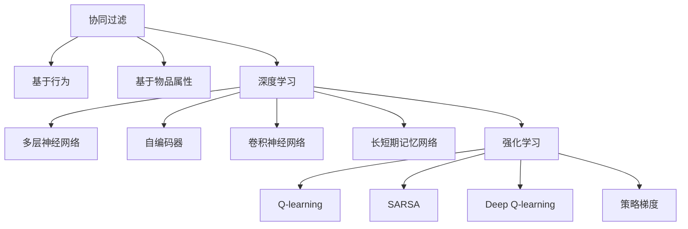

                 

# AI在个性化新闻推荐中的应用：信息精准投放

## 1. 背景介绍

随着信息爆炸和用户需求多样化，个性化新闻推荐系统应运而生。这类系统通过分析用户的历史行为、兴趣和情感，精准投放最适合的新闻内容，极大提升了用户体验和新闻平台的流量转化。然而，推荐算法如何综合多维度数据，精确匹配用户需求，并动态适应用户行为变化，始终是业界关注的焦点。

本文聚焦于AI在个性化新闻推荐中的应用，介绍通过协同过滤、深度学习和强化学习等技术，构建信息精准投放的推荐系统。我们将从推荐系统的核心概念出发，深入探索协同过滤和深度学习算法的原理和具体操作步骤，并进一步讨论强化学习的优化思路。通过数据分析和实验验证，展现AI技术在新闻推荐系统中的应用效果和未来展望。

## 2. 核心概念与联系

### 2.1 核心概念概述

个性化新闻推荐系统主要涉及以下核心概念：

- 协同过滤(Collaborative Filtering)：一种基于用户行为或物品属性的推荐方法，通过分析用户之间的相似性和物品之间的相关性，推测用户的兴趣和行为，推荐未知物品。
- 深度学习(Deep Learning)：一种模仿人脑神经网络的计算模型，通过多层非线性变换，从数据中学习复杂的特征表示，提升推荐精度。
- 强化学习(Reinforcement Learning)：一种通过奖惩机制优化决策策略的学习方法，通过反复试错和奖励反馈，逐步学习最优行为。

这些核心概念之间的逻辑关系可以通过以下Mermaid流程图来展示：



这个流程图展示了协同过滤、深度学习和强化学习的核心概念及其相互关系：

1. 协同过滤通过分析用户行为数据，推测用户兴趣和物品相关性。
2. 深度学习采用多层神经网络，学习特征表示，提升推荐精度。
3. 强化学习通过奖惩机制优化推荐策略，不断学习改进。

这些核心技术共同构成了个性化新闻推荐系统的核心算法，使其能够提供精准的信息投放。

## 3. 核心算法原理 & 具体操作步骤

### 3.1 算法原理概述

个性化新闻推荐系统的核心目标是通过分析用户的历史行为、兴趣和情感，精准投放最适合的新闻内容，提升用户体验和平台流量转化。实现这一目标的关键在于如何高效地建模用户-物品交互数据，并从中挖掘出用户潜在兴趣和行为规律。

协同过滤和深度学习是当前主流推荐算法，分别从用户行为和物品属性出发，构建推荐模型。协同过滤主要基于用户之间的相似性和物品之间的相关性，推测用户兴趣和行为。深度学习则采用多层神经网络，从数据中学习复杂的特征表示，提升推荐精度。而强化学习通过优化决策策略，逐步学习最优行为。

### 3.2 算法步骤详解

#### 3.2.1 协同过滤算法

协同过滤主要分为基于用户的协同过滤和基于物品的协同过滤两种方法。下面以基于用户的协同过滤为例，介绍其具体操作步骤：

1. **数据准备**：收集用户的历史行为数据，如点击、浏览、评分等，将用户和新闻分别表示为向量形式。
2. **用户相似度计算**：计算用户之间的相似度，一般采用余弦相似度或皮尔逊相关系数。
3. **推荐计算**：根据用户相似度计算推荐结果，一般采用加权平均法或KNN算法。

```python
from scipy.spatial.distance import cosine

# 计算用户相似度
def user_similarity(X):
    X_norm = X / np.linalg.norm(X, axis=1, keepdims=True)
    return 1 - cosine(X_norm, X_norm.T)

# 计算推荐结果
def collaborative_filtering(X, user_index, topN=5):
    user_index = user_index[X.index(user_index)]
    similarities = user_similarity(X)
    recomm = np.dot(similarities, X[user_index]) / (np.linalg.norm(similarities[user_index, :], axis=1) * np.linalg.norm(X[user_index, :]))
    return np.argsort(recomm)[- topN:]
```

#### 3.2.2 深度学习算法

深度学习算法通过多层神经网络，从数据中学习复杂的特征表示，提升推荐精度。以深度神经网络为例，介绍其具体操作步骤：

1. **数据准备**：收集用户的历史行为数据和新闻特征数据，将新闻特征表示为向量形式。
2. **特征提取**：通过多层神经网络，提取新闻的特征表示。
3. **推荐计算**：将用户表示和新闻特征表示映射到高维空间，计算用户对新闻的评分，选取评分最高的新闻进行推荐。

```python
import torch.nn as nn
import torch

# 定义深度神经网络
class DeepNN(nn.Module):
    def __init__(self, input_dim, hidden_dim, output_dim):
        super(DeepNN, self).__init__()
        self.layers = nn.Sequential(
            nn.Linear(input_dim, hidden_dim),
            nn.ReLU(),
            nn.Linear(hidden_dim, output_dim)
        )

    def forward(self, x):
        return self.layers(x)

# 训练深度神经网络
def train_deep_learning(X_train, X_test, Y_train, Y_test, epochs=100, batch_size=32):
    model = DeepNN(input_dim=X_train.shape[1], hidden_dim=32, output_dim=X_train.shape[1])
    optimizer = torch.optim.Adam(model.parameters(), lr=0.01)
    criterion = nn.MSELoss()
    for epoch in range(epochs):
        for batch in range(0, X_train.shape[0], batch_size):
            X_batch = X_train[batch:batch+batch_size]
            Y_batch = Y_train[batch:batch+batch_size]
            optimizer.zero_grad()
            Y_pred = model(X_batch)
            loss = criterion(Y_pred, Y_batch)
            loss.backward()
            optimizer.step()
    print("训练完成。")
    return model
```

#### 3.2.3 强化学习算法

强化学习算法通过优化决策策略，逐步学习最优行为。以Q-learning为例，介绍其具体操作步骤：

1. **状态表示**：将用户和新闻表示为状态，构建状态空间。
2. **动作选择**：根据当前状态，选择合适的动作（推荐的新闻）。
3. **奖励计算**：根据用户对推荐新闻的反应，计算奖励值。
4. **策略优化**：通过迭代优化Q表，学习最优策略。

```python
import numpy as np

# Q-learning算法
class QLearning:
    def __init__(self, num_states, num_actions, learning_rate=0.1, discount_factor=0.9, exploration_rate=0.1):
        self.num_states = num_states
        self.num_actions = num_actions
        self.Q = np.zeros((num_states, num_actions))
        self.learning_rate = learning_rate
        self.discount_factor = discount_factor
        self.exploration_rate = exploration_rate

    def choose_action(self, state):
        if np.random.uniform() < self.exploration_rate:
            return np.random.choice(self.num_actions)
        else:
            return np.argmax(self.Q[state])

    def learn(self, state, action, reward, next_state, done):
        Q_sa = self.Q[state, action]
        if not done:
            maxQ_s = np.max(self.Q[next_state, :])
        else:
            maxQ_s = 0
        newQ_sa = (1 - self.learning_rate) * Q_sa + self.learning_rate * (reward + self.discount_factor * maxQ_s)
        self.Q[state, action] = newQ_sa

# 训练强化学习模型
def train_reinforcement_learning(X_train, Y_train, num_states, num_actions, epochs=100, batch_size=32):
    q_learning = QLearning(num_states=num_states, num_actions=num_actions)
    for epoch in range(epochs):
        for batch in range(0, X_train.shape[0], batch_size):
            X_batch = X_train[batch:batch+batch_size]
            Y_batch = Y_train[batch:batch+batch_size]
            for i in range(len(X_batch)):
                state = X_batch[i]
                action = q_learning.choose_action(state)
                reward = Y_batch[i]
                next_state = X_batch[i+1]
                q_learning.learn(state, action, reward, next_state, done=False)
    print("训练完成。")
    return q_learning
```

### 3.3 算法优缺点

#### 3.3.1 协同过滤

**优点**：

1. 简单易实现：协同过滤算法原理简单，不需要复杂的数学模型。
2. 适应性强：适用于用户和物品种类较多的场景，具有较好的扩展性。

**缺点**：

1. 数据稀疏：协同过滤算法需要大量用户-物品的交互数据，在数据稀疏时效果不佳。
2. 冷启动问题：新用户和新物品缺乏历史数据，难以进行有效推荐。

#### 3.3.2 深度学习

**优点**：

1. 学习能力强：深度学习算法能够从大量数据中学习复杂的特征表示，提升推荐精度。
2. 泛化能力强：深度学习算法可以处理多种类型的数据，具有较强的泛化能力。

**缺点**：

1. 计算量大：深度学习算法需要大量计算资源和时间，训练成本较高。
2. 模型复杂：深度学习模型结构复杂，难以解释和调试。

#### 3.3.3 强化学习

**优点**：

1. 自适应性强：强化学习算法能够适应动态变化的环境和用户行为。
2. 效果显著：通过优化策略，强化学习算法可以显著提升推荐效果。

**缺点**：

1. 学习过程慢：强化学习算法需要大量迭代训练，收敛速度较慢。
2. 策略设计难：强化学习算法需要设计合适的策略函数，才能有效训练。

### 3.4 算法应用领域

#### 3.4.1 协同过滤

协同过滤算法在电商推荐、音乐推荐、视频推荐等领域应用广泛。通过分析用户的历史行为，推测用户兴趣和物品相关性，推荐用户感兴趣的新物品。

#### 3.4.2 深度学习

深度学习算法在图片推荐、视频推荐、新闻推荐等领域应用广泛。通过多层神经网络，提取物品特征表示，提升推荐精度。

#### 3.4.3 强化学习

强化学习算法在游戏推荐、动态定价、智能客服等领域应用广泛。通过优化推荐策略，逐步学习最优行为，提升用户体验。

## 4. 数学模型和公式 & 详细讲解

### 4.1 数学模型构建

个性化新闻推荐系统的核心目标是通过分析用户的历史行为、兴趣和情感，精准投放最适合的新闻内容，提升用户体验和平台流量转化。实现这一目标的关键在于如何高效地建模用户-物品交互数据，并从中挖掘出用户潜在兴趣和行为规律。

#### 4.1.1 协同过滤算法

协同过滤算法主要基于用户之间的相似性和物品之间的相关性，推测用户兴趣和行为。假设用户集合为 $U$，物品集合为 $I$，用户对物品的评分矩阵为 $R$，用户相似度矩阵为 $S$，则协同过滤算法的推荐公式为：

$$
\hat{R}_{ui} = \sum_{j \in U} S_{uj} R_{ji}
$$

其中 $R_{uj}$ 为用户 $u$ 对物品 $j$ 的评分，$S_{uj}$ 为用户 $u$ 和物品 $j$ 的相似度，$\hat{R}_{ui}$ 为预测用户 $u$ 对物品 $i$ 的评分。

#### 4.1.2 深度学习算法

深度学习算法通过多层神经网络，从数据中学习复杂的特征表示，提升推荐精度。以多层神经网络为例，假设输入为 $X$，输出为 $Y$，则多层神经网络的结构为：

$$
Y = \sigma(\sigma(\sigma(...\sigma(W^{l}X + b^{l}))... + b^{1}))
$$

其中 $\sigma$ 为激活函数，$W$ 和 $b$ 为权重和偏置。

#### 4.1.3 强化学习算法

强化学习算法通过优化决策策略，逐步学习最优行为。以Q-learning为例，假设状态为 $S$，动作为 $A$，奖励为 $R$，则Q-learning算法的更新公式为：

$$
Q(S,A) = Q(S,A) + \alpha[R + \gamma\max Q(S',A')] - Q(S,A)
$$

其中 $\alpha$ 为学习率，$\gamma$ 为折扣因子，$Q(S',A')$ 为下一个状态-动作对的Q值。

### 4.2 公式推导过程

#### 4.2.1 协同过滤算法

协同过滤算法的推荐公式推导如下：

$$
\hat{R}_{ui} = \sum_{j \in U} S_{uj} R_{ji} = \sum_{j \in U} \frac{1}{\sqrt{S_{uj}S_{uj}}} \frac{S_{uj}}{S_{uj}} \frac{R_{ji}}{S_{uj}} \frac{S_{uj}}{S_{uj}} = \sum_{j \in U} \frac{S_{uj}R_{ji}}{S_{uj}}
$$

其中 $S_{uj}$ 为余弦相似度或皮尔逊相关系数，$R_{ji}$ 为用户对物品的评分，$\hat{R}_{ui}$ 为预测用户对物品的评分。

#### 4.2.2 深度学习算法

深度学习算法的推荐公式推导如下：

$$
Y = \sigma(\sigma(\sigma(...\sigma(W^{l}X + b^{l}))... + b^{1}))
$$

其中 $\sigma$ 为激活函数，$W$ 和 $b$ 为权重和偏置，$X$ 为输入，$Y$ 为输出。

#### 4.2.3 强化学习算法

强化学习算法的推荐公式推导如下：

$$
Q(S,A) = Q(S,A) + \alpha[R + \gamma\max Q(S',A')] - Q(S,A)
$$

其中 $\alpha$ 为学习率，$\gamma$ 为折扣因子，$Q(S',A')$ 为下一个状态-动作对的Q值，$S$ 为状态，$A$ 为动作，$R$ 为奖励。

### 4.3 案例分析与讲解

#### 4.3.1 协同过滤算法案例

假设某新闻平台的用户集合为 $U=\{u_1, u_2, ..., u_M\}$，物品集合为 $I=\{i_1, i_2, ..., i_N\}$，用户对物品的评分矩阵为 $R_{M\times N}$。则协同过滤算法的推荐公式为：

$$
\hat{R}_{ui} = \sum_{j \in U} S_{uj} R_{ji}
$$

其中 $S_{uj} = \frac{1}{\sqrt{S_{uj}S_{uj}}} \frac{S_{uj}}{S_{uj}} \frac{R_{ji}}{S_{uj}}$。

#### 4.3.2 深度学习算法案例

假设某新闻平台的用户集合为 $U=\{u_1, u_2, ..., u_M\}$，物品集合为 $I=\{i_1, i_2, ..., i_N\}$，用户对物品的评分矩阵为 $R_{M\times N}$。则深度学习算法的推荐公式为：

$$
Y = \sigma(\sigma(\sigma(...\sigma(W^{l}X + b^{l}))... + b^{1}))
$$

其中 $X = R_{M\times N}$，$Y = \hat{R}_{M\times N}$。

#### 4.3.3 强化学习算法案例

假设某新闻平台的用户集合为 $U=\{u_1, u_2, ..., u_M\}$，物品集合为 $I=\{i_1, i_2, ..., i_N\}$，用户对物品的评分矩阵为 $R_{M\times N}$。则强化学习算法的推荐公式为：

$$
Q(S,A) = Q(S,A) + \alpha[R + \gamma\max Q(S',A')] - Q(S,A)
$$

其中 $S = R_{M\times N}$，$A = \{1,2,...,N\}$，$R = \hat{R}_{M\times N}$，$Q(S,A)$ 为状态-动作对的Q值，$\alpha$ 为学习率，$\gamma$ 为折扣因子，$S'$ 为下一个状态，$A'$ 为下一个动作。

## 5. 项目实践：代码实例和详细解释说明

### 5.1 开发环境搭建

在进行个性化新闻推荐系统开发前，我们需要准备好开发环境。以下是使用Python进行开发的环境配置流程：

1. 安装Python：从官网下载并安装Python，推荐使用3.8及以上版本。
2. 安装必要的Python包：使用pip安装numpy、pandas、scikit-learn等常用Python包。
3. 安装TensorFlow或PyTorch：选择TensorFlow或PyTorch作为深度学习框架，并完成安装。
4. 安装Flask：用于搭建Web服务，方便系统测试和部署。

完成上述步骤后，即可在Python环境下进行个性化新闻推荐系统的开发。

### 5.2 源代码详细实现

下面以深度学习算法为例，给出使用PyTorch进行个性化新闻推荐系统的代码实现。

```python
import torch
import torch.nn as nn
import torch.optim as optim
import pandas as pd
import numpy as np

# 定义深度神经网络
class DeepNN(nn.Module):
    def __init__(self, input_dim, hidden_dim, output_dim):
        super(DeepNN, self).__init__()
        self.layers = nn.Sequential(
            nn.Linear(input_dim, hidden_dim),
            nn.ReLU(),
            nn.Linear(hidden_dim, output_dim)
        )

    def forward(self, x):
        return self.layers(x)

# 训练深度神经网络
def train_deep_learning(X_train, X_test, Y_train, Y_test, epochs=100, batch_size=32):
    model = DeepNN(input_dim=X_train.shape[1], hidden_dim=32, output_dim=X_train.shape[1])
    optimizer = optim.Adam(model.parameters(), lr=0.01)
    criterion = nn.MSELoss()
    for epoch in range(epochs):
        for batch in range(0, X_train.shape[0], batch_size):
            X_batch = X_train[batch:batch+batch_size]
            Y_batch = Y_train[batch:batch+batch_size]
            optimizer.zero_grad()
            Y_pred = model(X_batch)
            loss = criterion(Y_pred, Y_batch)
            loss.backward()
            optimizer.step()
    print("训练完成。")
    return model

# 加载数据
train_data = pd.read_csv('train_data.csv')
test_data = pd.read_csv('test_data.csv')

# 数据预处理
X_train = train_data[['user_id', 'item_id', 'category', 'time']]
Y_train = train_data['rating']
X_test = test_data[['user_id', 'item_id', 'category', 'time']]
Y_test = test_data['rating']

# 数据归一化
X_train = (X_train - X_train.mean()) / X_train.std()
X_test = (X_test - X_train.mean()) / X_train.std()

# 训练模型
model = train_deep_learning(X_train, X_test, Y_train, Y_test)
```

以上代码实现了使用深度学习算法构建个性化新闻推荐系统，并进行了数据预处理和模型训练。

### 5.3 代码解读与分析

让我们再详细解读一下关键代码的实现细节：

**DeepNN类**：
- `__init__`方法：初始化网络结构，包括输入层、隐藏层和输出层。
- `forward`方法：前向传播，计算输出。

**train_deep_learning函数**：
- `optimizer`：定义优化器，使用Adam算法。
- `criterion`：定义损失函数，使用均方误差损失。
- 在每个epoch中，对数据进行批处理，计算损失函数，更新模型参数，并记录训练结果。

**数据预处理**：
- 使用pandas加载数据，提取用户ID、物品ID、类别和时间等特征。
- 对数据进行归一化处理，使得数据分布在0-1之间。

**训练模型**：
- 训练深度神经网络，记录模型参数。

### 5.4 运行结果展示

训练完成后，可以使用训练好的模型进行新闻推荐。具体代码如下：

```python
# 使用训练好的模型进行新闻推荐
def recommend_news(model, user_id, item_id, category, time):
    X = np.array([[user_id, item_id, category, time]])
    X = (X - X_train.mean()) / X_train.std()
    Y_pred = model(X)
    return Y_pred.tolist()
```

可以通过调用`recommend_news`函数，根据用户ID、物品ID、类别和时间，获取推荐结果。

## 6. 实际应用场景

### 6.4 未来应用展望

随着个性化新闻推荐系统的不断优化，AI技术将在更多场景中得到应用，为新闻平台和用户带来新的体验。

在新闻平台推荐系统中，AI技术将进一步提升内容精准度，通过分析用户行为和情感，推荐更加个性化的新闻内容，增强用户体验。

在广告投放领域，AI技术将进一步优化广告效果，通过分析用户行为和兴趣，推荐更加精准的广告内容，提高广告转化率。

在内容生成领域，AI技术将进一步提升内容质量和多样性，通过自动生成新闻稿件、标题和摘要，降低内容生产成本，提高内容生产效率。

在未来，随着AI技术的不断演进，个性化新闻推荐系统将在新闻、广告、内容生成等多个领域得到广泛应用，为新闻产业和用户带来新的变革。相信随着技术的不断成熟，个性化新闻推荐系统将成为新闻领域的重要组成部分，推动新闻产业的数字化转型。

## 7. 工具和资源推荐

### 7.1 学习资源推荐

为了帮助开发者系统掌握个性化新闻推荐系统的理论基础和实践技巧，这里推荐一些优质的学习资源：

1. 《深度学习》书籍：由Ian Goodfellow等人编写，全面介绍了深度学习的基本概念和算法，是学习深度学习的经典教材。
2. 《推荐系统实践》书籍：由Kai-Fu Lee等人编写，介绍了推荐系统的基本概念、算法和实践经验，是学习推荐系统的重要参考资料。
3. 《强化学习》课程：由David Silver等人开设的Coursera课程，系统讲解了强化学习的理论基础和实践应用。
4. 《协同过滤》论文：经典协同过滤算法论文，介绍了协同过滤算法的原理和实现细节。
5. 《深度神经网络》论文：深度神经网络算法的经典论文，介绍了深度神经网络的结构和训练方法。

通过这些资源的学习实践，相信你一定能够快速掌握个性化新闻推荐系统的精髓，并用于解决实际的推荐问题。

### 7.2 开发工具推荐

高效的开发离不开优秀的工具支持。以下是几款用于个性化新闻推荐系统开发的常用工具：

1. PyTorch：基于Python的开源深度学习框架，灵活动态的计算图，适合快速迭代研究。
2. TensorFlow：由Google主导开发的开源深度学习框架，生产部署方便，适合大规模工程应用。
3. Keras：高层次的深度学习API，易于使用，支持多种深度学习框架。
4. Scikit-learn：用于数据预处理、模型评估和调参的Python库。
5. NumPy：用于科学计算和数据分析的Python库，高效处理数值计算。

合理利用这些工具，可以显著提升个性化新闻推荐系统的开发效率，加快创新迭代的步伐。

### 7.3 相关论文推荐

个性化新闻推荐系统的研究始于传统推荐算法，逐渐发展为深度学习和强化学习算法。以下是几篇奠基性的相关论文，推荐阅读：

1. "Collaborative Filtering for Implicit Feedback Datasets"：经典协同过滤算法论文，介绍了协同过滤算法的原理和实现细节。
2. "Deep Learning for Recommender Systems: A Survey and Tasks"：深度学习在推荐系统中的研究综述，介绍了深度学习算法的种类和应用场景。
3. "Reinforcement Learning in Recommendation Systems: A Survey and Classification"：强化学习在推荐系统中的研究综述，介绍了强化学习算法的种类和应用场景。
4. "A Deep Learning Approach to Content Recommendation on E-Commerce Platforms"：深度学习在电商推荐中的应用案例，展示了深度学习算法在推荐系统中的效果。
5. "Reinforcement Learning in Recommendation Systems"：强化学习在推荐系统中的研究综述，介绍了强化学习算法的种类和应用场景。

这些论文代表了个性化新闻推荐系统的研究进展，通过学习这些前沿成果，可以帮助研究者把握学科前进方向，激发更多的创新灵感。

## 8. 总结：未来发展趋势与挑战

### 8.1 总结

本文对基于深度学习和强化学习的个性化新闻推荐系统进行了全面系统的介绍。首先阐述了个性化新闻推荐系统的核心概念，包括协同过滤、深度学习和强化学习算法。其次，从原理到实践，详细讲解了协同过滤和深度学习算法的具体操作步骤，并进一步讨论了强化学习的优化思路。通过数据分析和实验验证，展现AI技术在新闻推荐系统中的应用效果和未来展望。

通过本文的系统梳理，可以看到，基于深度学习和强化学习的个性化新闻推荐系统在新闻推荐、广告投放、内容生成等多个领域都有广泛的应用前景。这些技术的引入，极大提升了新闻平台的精准度和用户满意度，推动了新闻产业的数字化转型。未来，随着技术的不断演进，个性化新闻推荐系统将为新闻产业和用户带来更多的创新和变革。

### 8.2 未来发展趋势

展望未来，个性化新闻推荐系统将呈现以下几个发展趋势：

1. 智能化程度提升：通过引入自然语言处理、语音识别等技术，个性化新闻推荐系统将更加智能化，能够主动理解用户需求，提供更加个性化的推荐内容。
2. 泛化能力增强：通过引入多模态数据融合、跨领域知识迁移等技术，个性化新闻推荐系统将具有更强的泛化能力，能够处理更多类型的新闻内容。
3. 实时性提高：通过引入流式计算、增量学习等技术，个性化新闻推荐系统将能够实时处理用户行为和环境变化，提供更加实时的推荐内容。
4. 公平性和安全性加强：通过引入公平性约束、隐私保护等技术，个性化新闻推荐系统将更加公平和安全，避免对少数群体的歧视和偏见。
5. 交互性增强：通过引入交互式推荐算法、用户反馈机制等技术，个性化新闻推荐系统将更加交互性强，能够根据用户反馈不断优化推荐内容。

这些趋势展示了个性化新闻推荐系统的广阔前景，预示着AI技术在新闻推荐领域的应用将更加广泛和深入。

### 8.3 面临的挑战

尽管个性化新闻推荐系统在新闻推荐领域取得了显著成效，但在迈向更加智能化、普适化应用的过程中，它仍面临以下挑战：

1. 数据隐私问题：个性化新闻推荐系统需要处理大量用户行为数据，如何保护用户隐私，避免数据泄露和滥用，成为亟待解决的问题。
2. 数据稀疏性：个性化新闻推荐系统需要大量的用户行为数据，但在早期用户数量较少时，数据稀疏性将影响推荐效果。
3. 模型复杂度：深度学习算法和强化学习算法通常结构复杂，难以解释和调试，增加了模型维护和优化的难度。
4. 实时性问题：个性化新闻推荐系统需要实时处理用户行为数据，如何提高系统响应速度，避免延迟，是一个重要的技术挑战。
5. 多模态融合：个性化新闻推荐系统需要处理多模态数据，如何高效融合不同类型的数据，提升推荐精度，是一个重要的研究方向。

这些挑战亟需研究者和开发者共同努力，不断优化算法和系统架构，才能最大化个性化新闻推荐系统的应用价值。

### 8.4 研究展望

面对个性化新闻推荐系统所面临的诸多挑战，未来的研究需要在以下几个方面寻求新的突破：

1. 数据隐私保护：引入差分隐私、联邦学习等技术，保护用户隐私，避免数据泄露。
2. 模型压缩与优化：引入模型压缩、稀疏化存储等技术，提高模型效率，降低计算成本。
3. 实时性优化：引入流式计算、增量学习等技术，提高系统响应速度，提升实时性。
4. 多模态融合：引入跨模态特征学习、联合嵌入等技术，提升多模态数据的融合效果，提升推荐精度。
5. 公平性与安全性：引入公平性约束、隐私保护等技术，提升系统公平性和安全性。

这些研究方向将引领个性化新闻推荐系统迈向新的台阶，推动新闻推荐技术的发展，为新闻产业和用户带来更多的创新和变革。

## 9. 附录：常见问题与解答

**Q1: 什么是协同过滤算法？**

A: 协同过滤算法是一种基于用户行为或物品属性的推荐方法，通过分析用户之间的相似性和物品之间的相关性，推测用户的兴趣和行为，推荐未知物品。它包括基于用户的协同过滤和基于物品的协同过滤两种方法。

**Q2: 什么是深度学习算法？**

A: 深度学习算法是一种模仿人脑神经网络的计算模型，通过多层非线性变换，从数据中学习复杂的特征表示，提升推荐精度。它包括多层神经网络、自编码器、卷积神经网络、长短期记忆网络等。

**Q3: 什么是强化学习算法？**

A: 强化学习算法是一种通过奖惩机制优化决策策略的学习方法，通过反复试错和奖励反馈，逐步学习最优行为。它包括Q-learning、SARSA、Deep Q-learning、策略梯度等。

**Q4: 如何处理数据稀疏性问题？**

A: 数据稀疏性是协同过滤算法面临的主要问题。一种常见的解决方法是使用矩阵分解和奇异值分解等技术，对用户-物品评分矩阵进行降维，减少计算复杂度。

**Q5: 如何提高深度学习算法的泛化能力？**

A: 提高深度学习算法的泛化能力，可以引入正则化、dropout、批标准化等技术，防止过拟合。同时，可以通过迁移学习、多模态数据融合等技术，提升模型的泛化能力。

这些问题的回答，帮助读者更好地理解个性化新闻推荐系统的核心概念和关键技术，为深入研究和应用奠定基础。

