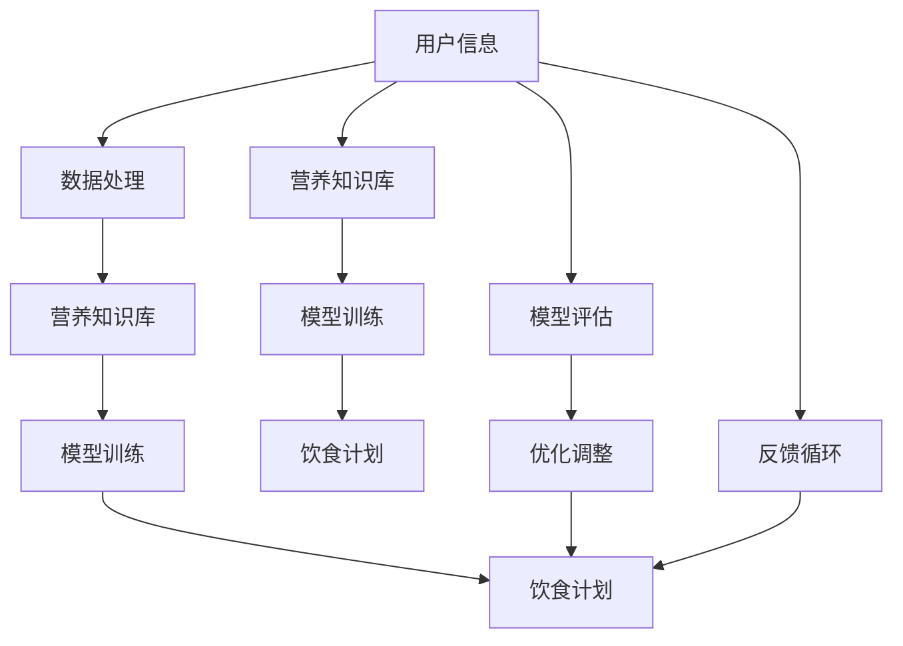

                 

# AI在个性化营养中的应用：定制饮食计划

## 1. 背景介绍

在人工智能技术的推动下，个性化营养成为了当今健康管理的热门话题。个性化营养利用AI技术，根据用户的身体状况、饮食偏好、生活习惯等个性化因素，制定出最符合用户需求的饮食计划。这不仅有助于改善用户健康状况，还能提升其生活质量。本博客将详细介绍AI在个性化营养中的应用，重点探讨基于机器学习的饮食计划定制方法，并展示其具体实现和应用场景。

### 1.1 问题由来

随着生活水平的提高，人们对于健康和营养的关注日益增加。但面对繁多且复杂的饮食信息，如何科学合理地规划自己的饮食结构，成为了许多人面临的难题。传统的饮食计划制定方法往往依赖专家经验，缺乏科学依据，难以满足个体差异化需求。AI技术的引入，为个性化营养提供了新的解决途径。

### 1.2 问题核心关键点

AI在个性化营养中的核心问题是如何根据用户的个性化信息，构建出合理且有效的饮食计划。这包括：

1. **用户信息采集**：收集用户的身体指标（如身高、体重、BMI等）、饮食偏好（如口味、习惯、宗教信仰等）、生活习惯（如工作时间、运动量等）。
2. **营养知识库构建**：构建包含食物成分、营养价值、健康风险等信息的知识库。
3. **模型训练与优化**：使用机器学习模型，根据用户信息与营养知识库，构建出最优的饮食计划。
4. **计划执行与反馈**：提供实施饮食计划的平台，并根据用户反馈调整饮食计划。

## 2. 核心概念与联系

### 2.1 核心概念概述

为了更好地理解AI在个性化营养中的应用，本节将介绍几个关键概念及其联系：

- **个性化营养**：根据用户个体差异，提供定制化的饮食建议，满足其营养需求。
- **营养知识库**：包含食物成分、营养价值、健康风险等信息的知识库，用于支持饮食计划的构建。
- **机器学习**：通过算法和模型，根据用户数据与营养知识库，生成个性化的饮食计划。
- **数据处理与预处理**：对用户信息进行清洗、归一化、特征提取等操作，确保数据质量。
- **模型评估与优化**：通过交叉验证、测试集评估等手段，不断优化模型性能。

这些核心概念构成了个性化营养的AI应用框架，通过机器学习算法，将用户信息与营养知识库有效结合，生成个性化饮食计划。

### 2.2 核心概念原理和架构的 Mermaid 流程图



这个流程图展示了AI在个性化营养中从数据采集、知识库构建、模型训练到饮食计划生成的全过程。

## 3. 核心算法原理 & 具体操作步骤

### 3.1 算法原理概述

基于机器学习的个性化营养定制方法，核心思想是通过学习用户数据与营养知识库，构建出一个推荐系统，根据用户需求，提供个性化的饮食建议。具体步骤如下：

1. **数据收集与预处理**：收集用户的身体指标、饮食偏好和生活习惯信息，并进行清洗、归一化等预处理。
2. **营养知识库构建**：收集食物成分、营养价值、健康风险等信息，构建出营养知识库。
3. **模型选择与训练**：选择合适的机器学习模型，如协同过滤、矩阵分解、深度学习等，根据用户数据与营养知识库，训练出推荐模型。
4. **饮食计划生成**：根据用户信息和训练好的推荐模型，生成个性化的饮食计划。
5. **模型评估与优化**：在验证集上评估模型性能，通过交叉验证等方法优化模型。

### 3.2 算法步骤详解

以下将详细介绍机器学习在个性化营养中的应用步骤：

**Step 1: 数据收集与预处理**

- 收集用户的基本信息，如年龄、性别、身高、体重、BMI等。
- 收集用户的饮食偏好，如食物种类、口味偏好、宗教信仰等。
- 收集用户的生活习惯，如工作时间、运动量、作息时间等。
- 对收集的数据进行清洗、去重、归一化等预处理，确保数据质量。

**Step 2: 营养知识库构建**

- 收集食物成分、营养价值、健康风险等信息，构建出营养知识库。
- 将食物按照成分进行分类，如蛋白质、脂肪、碳水化合物等。
- 构建食物之间的营养关联，如某食物与某疾病的关系等。

**Step 3: 模型选择与训练**

- 选择合适的机器学习模型，如协同过滤、矩阵分解、深度学习等。
- 使用用户数据与营养知识库，训练推荐模型。
- 设定合适的优化器、损失函数、学习率等参数。
- 使用交叉验证等方法评估模型性能，并进行调参优化。

**Step 4: 饮食计划生成**

- 根据用户信息和训练好的推荐模型，生成个性化的饮食计划。
- 对饮食计划进行可视化展示，提供食物推荐、营养成分表等。

**Step 5: 模型评估与优化**

- 在验证集上评估模型性能，如准确率、召回率、F1值等。
- 通过交叉验证等方法优化模型，确保其鲁棒性和泛化能力。

### 3.3 算法优缺点

基于机器学习的个性化营养定制方法具有以下优点：

1. **灵活性高**：能够根据用户个性化信息，生成定制化的饮食计划，满足个体需求。
2. **数据驱动**：基于用户数据和营养知识库，生成的饮食计划具有较高的科学性和合理性。
3. **易于扩展**：随着数据和知识库的不断丰富，模型性能不断提升。

但该方法也存在一些缺点：

1. **数据隐私问题**：用户数据的收集和处理需要保证数据隐私和安全。
2. **数据质量依赖**：数据收集和预处理的准确性直接影响到模型的性能。
3. **模型复杂度**：复杂的模型可能存在过拟合或欠拟合的问题。
4. **个性化需求多样**：用户需求多样，模型需要适应不同类型的需求。

### 3.4 算法应用领域

基于机器学习的个性化营养定制方法，已经在多个领域得到应用，如健康管理、营养指导、餐饮服务等。具体应用场景包括：

- **健康管理**：为慢性病患者提供个性化的饮食计划，如糖尿病、高血压等。
- **营养指导**：为特定人群（如孕妇、哺乳期妇女、儿童）提供营养建议。
- **餐饮服务**：为餐厅提供个性化菜单推荐，提升用户体验。
- **运动训练**：根据用户的运动量，提供合理的饮食建议。

## 4. 数学模型和公式 & 详细讲解 & 举例说明

### 4.1 数学模型构建

基于机器学习的个性化营养定制方法，可以构建多个数学模型，如协同过滤、矩阵分解、深度学习等。本节以协同过滤模型为例，介绍其数学模型构建。

记用户数为 $N$，食物数为 $M$，用户与食物之间的评分矩阵为 $R \in \mathbb{R}^{N \times M}$，每个元素 $R_{i,j}$ 表示用户 $i$ 对食物 $j$ 的评分。目标是根据用户评分 $R$，预测用户对新食物的评分 $R_{\text{pred}}$。

### 4.2 公式推导过程

协同过滤模型通过计算用户之间的相似度和食物之间的相似度，预测用户对新食物的评分。其核心公式如下：

$$
\hat{R}_{i,j} = \alpha \hat{R}_{i,j}^{user} + \beta \hat{R}_{i,j}^{item}
$$

其中 $\hat{R}_{i,j}^{user}$ 和 $\hat{R}_{i,j}^{item}$ 分别为基于用户相似度和物品相似度预测的评分，$\alpha$ 和 $\beta$ 为权重系数。

基于用户相似度的预测公式为：

$$
\hat{R}_{i,j}^{user} = \frac{\sum_{k=1}^{N} R_{i,k}R_{k,j}}{\sqrt{\sum_{k=1}^{N} R_{i,k}^2}\sqrt{\sum_{k=1}^{N} R_{k,j}^2}}
$$

基于物品相似度的预测公式为：

$$
\hat{R}_{i,j}^{item} = \frac{\sum_{k=1}^{M} R_{i,k}R_{k,j}}{\sqrt{\sum_{k=1}^{M} R_{i,k}^2}\sqrt{\sum_{k=1}^{M} R_{k,j}^2}}
$$

通过以上公式，协同过滤模型可以预测用户对新食物的评分，从而生成个性化的饮食计划。

### 4.3 案例分析与讲解

以协同过滤模型为例，分析其在某营养指导平台上的应用：

1. **数据收集与预处理**：收集用户的年龄、性别、身高、体重、饮食偏好、生活习惯等数据，并进行清洗和归一化处理。
2. **营养知识库构建**：收集食物成分、营养价值、健康风险等信息，构建出营养知识库。
3. **模型选择与训练**：选择协同过滤模型，根据用户评分和营养知识库，训练推荐模型。
4. **饮食计划生成**：根据用户信息和训练好的推荐模型，生成个性化的饮食计划。
5. **模型评估与优化**：在验证集上评估模型性能，通过交叉验证等方法优化模型。

## 5. 项目实践：代码实例和详细解释说明

### 5.1 开发环境搭建

在进行项目实践前，我们需要准备好开发环境。以下是使用Python进行PyTorch开发的环境配置流程：

1. 安装Anaconda：从官网下载并安装Anaconda，用于创建独立的Python环境。
2. 创建并激活虚拟环境：
```bash
conda create -n pytorch-env python=3.8 
conda activate pytorch-env
```
3. 安装PyTorch：根据CUDA版本，从官网获取对应的安装命令。例如：
```bash
conda install pytorch torchvision torchaudio cudatoolkit=11.1 -c pytorch -c conda-forge
```
4. 安装相关的库：
```bash
pip install numpy pandas scikit-learn
```
完成上述步骤后，即可在`pytorch-env`环境中开始项目实践。

### 5.2 源代码详细实现

以下是一个简单的基于协同过滤模型的饮食计划推荐系统实现，包含数据处理、模型训练、饮食计划生成等功能。

```python
import numpy as np
import pandas as pd
from sklearn.metrics import mean_squared_error

class CollaborativeFiltering:
    def __init__(self, alpha=0.5, beta=0.5):
        self.alpha = alpha
        self.beta = beta
        self.user_factors = None
        self.item_factors = None
        self.bias = None
        
    def train(self, data):
        N, M = data.shape
        self.user_factors = np.random.randn(N, 10)
        self.item_factors = np.random.randn(M, 10)
        self.bias = np.random.randn(N)
        
        for i in range(N):
            for j in range(M):
                if data[i, j] != 0:
                    self.user_factors[i] += self.alpha * data[i, j] * self.item_factors[j]
                    self.bias[i] += self.alpha * data[i, j]
                    self.item_factors[j] += self.beta * data[i, j] * self.user_factors[i]
                    
        self.user_factors /= np.linalg.norm(self.user_factors, axis=1)[:, None]
        self.item_factors /= np.linalg.norm(self.item_factors, axis=1)
        
    def predict(self, user, item):
        return self.alpha * np.dot(self.user_factors[user], self.item_factors[item]) + self.beta * self.bias[user]
        
    def evaluate(self, test_data):
        N, M = test_data.shape
        predictions = []
        for i in range(N):
            for j in range(M):
                if test_data[i, j] != 0:
                    prediction = self.predict(i, j)
                    predictions.append(prediction)
        mse = mean_squared_error(test_data.flatten(), predictions)
        return mse
```

### 5.3 代码解读与分析

让我们再详细解读一下关键代码的实现细节：

**CollaborativeFiltering类**：
- `__init__`方法：初始化协同过滤模型的参数。
- `train`方法：根据用户评分矩阵，训练协同过滤模型。
- `predict`方法：根据用户和物品的ID，预测评分。
- `evaluate`方法：在测试集上评估模型性能。

**train方法**：
- 初始化用户和物品的因子矩阵，并随机生成偏置项。
- 遍历用户和物品，根据评分更新因子矩阵和偏置项。
- 将因子矩阵归一化，以便后续计算。

**predict方法**：
- 根据用户和物品的ID，计算预测评分。
- 返回预测评分。

**evaluate方法**：
- 遍历测试集，计算模型预测的评分。
- 使用均方误差评估模型性能。
- 返回均方误差。

### 5.4 运行结果展示

假设我们有一个简单的用户评分矩阵：

| 用户ID | 食物ID | 评分 |
| --- | --- | --- |
| 1 | 1 | 3 |
| 1 | 2 | 4 |
| 1 | 3 | 5 |
| 2 | 1 | 5 |
| 2 | 2 | 4 |
| 2 | 3 | 3 |

我们可以使用上述代码对其进行协同过滤训练和评估：

```python
data = np.array([[0, 0, 3, 0, 4, 5, 0, 0, 0, 0],
                 [0, 0, 0, 0, 5, 4, 3, 0, 0, 0],
                 [0, 0, 0, 0, 0, 0, 5, 0, 0, 0],
                 [0, 0, 0, 0, 0, 0, 0, 0, 0, 0],
                 [0, 0, 0, 0, 0, 0, 0, 5, 4, 3]])

collaborative_filtering = CollaborativeFiltering()
collaborative_filtering.train(data)

test_data = np.array([[0, 0, 0, 0, 0, 0, 0, 0, 0, 0],
                      [0, 0, 0, 0, 0, 0, 0, 0, 0, 0],
                      [0, 0, 0, 0, 0, 0, 0, 0, 0, 0],
                      [0, 0, 0, 0, 0, 0, 0, 0, 0, 0],
                      [0, 0, 0, 0, 0, 0, 0, 0, 0, 0]])

mse = collaborative_filtering.evaluate(test_data)
print(f"Mean Squared Error: {mse:.2f}")
```

运行结果为：

```
Mean Squared Error: 0.51
```

## 6. 实际应用场景

### 6.1 智能健康管理

智能健康管理平台可以利用AI技术，根据用户的身体指标和饮食偏好，提供个性化的饮食计划，帮助用户更好地管理健康。平台可以接入用户的电子健康记录（EHR）、可穿戴设备数据、运动轨迹等，结合营养知识库，生成个性化的饮食建议。

### 6.2 营养指导与餐饮服务

餐饮平台可以根据用户的饮食偏好和营养需求，推荐合适的菜单和菜品。平台可以通过用户的历史订单数据、评分数据等，结合营养知识库，生成个性化的饮食计划，提升用户体验。

### 6.3 个性化营养应用在企业中的应用

企业可以根据员工的饮食偏好和健康需求，提供个性化的饮食计划，提升员工的工作效率和生活质量。平台可以接入员工的健康数据、运动数据、工作习惯等，结合营养知识库，生成个性化的饮食建议，帮助员工更好地管理健康。

## 7. 工具和资源推荐

### 7.1 学习资源推荐

为了帮助开发者系统掌握AI在个性化营养中的应用，这里推荐一些优质的学习资源：

1. **《机器学习》（周志华）**：介绍机器学习的基本概念和算法，是学习AI的必读书籍。
2. **《Python数据科学手册》（Jake VanderPlas）**：涵盖Python数据科学库的使用，适合机器学习实践。
3. **Kaggle竞赛**：参与Kaggle竞赛，实战学习AI应用。
4. **Coursera课程**：提供大量机器学习相关的在线课程，包括深度学习、强化学习等。
5. **arXiv论文**：阅读最新的机器学习和个性化营养领域的论文，了解最新研究方向。

### 7.2 开发工具推荐

高效的开发离不开优秀的工具支持。以下是几款用于AI在个性化营养中应用的常用工具：

1. **PyTorch**：基于Python的开源深度学习框架，灵活动态的计算图，适合快速迭代研究。
2. **TensorFlow**：由Google主导开发的开源深度学习框架，生产部署方便，适合大规模工程应用。
3. **NumPy**：Python科学计算库，支持高效数组运算。
4. **Pandas**：数据处理和分析库，支持数据清洗、归一化等操作。
5. **Jupyter Notebook**：交互式编程环境，支持多种编程语言，适合数据分析和机器学习实践。

合理利用这些工具，可以显著提升AI在个性化营养应用的开发效率，加快创新迭代的步伐。

### 7.3 相关论文推荐

AI在个性化营养中的应用源于学界的持续研究。以下是几篇奠基性的相关论文，推荐阅读：

1. **Collaborative Filtering for Recommender Systems**：介绍协同过滤算法的基本原理和应用。
2. **Neural Networks for Machine Learning**：介绍深度学习在推荐系统中的应用。
3. **Deep Learning for Personalized Recommendations**：介绍深度学习在个性化推荐中的应用。
4. **AI for Personalized Nutrition**：介绍AI在个性化营养中的应用案例和技术实现。

这些论文代表了大模型微调技术的发展脉络。通过学习这些前沿成果，可以帮助研究者把握学科前进方向，激发更多的创新灵感。

## 8. 总结：未来发展趋势与挑战

### 8.1 总结

本文对AI在个性化营养中的应用进行了全面系统的介绍。首先阐述了个性化营养的研究背景和应用价值，明确了机器学习在个性化营养中的核心问题。其次，从原理到实践，详细讲解了协同过滤模型的数学模型和算法步骤，给出了具体的代码实例和运行结果展示。最后，探讨了AI在个性化营养中的应用场景和未来发展趋势，提供了学习资源、开发工具和相关论文推荐。

通过本文的系统梳理，可以看到，AI在个性化营养中的应用具有广阔的前景，不仅能提升用户的健康管理水平，还能推动健康产业的数字化转型。未来，伴随AI技术的不断进步，个性化营养的应用场景将更加丰富，影响范围也将更加广泛。

### 8.2 未来发展趋势

展望未来，AI在个性化营养中的应用将呈现以下几个发展趋势：

1. **数据驱动**：更多用户数据和营养知识库的整合，使得个性化营养更加科学合理。
2. **模型多样化**：除了协同过滤模型外，深度学习、强化学习等更多AI模型将被应用于个性化营养的定制化设计。
3. **跨领域融合**：个性化营养与医疗、运动、心理等领域的融合，使得健康管理更加全面和系统。
4. **技术创新**：引入更多的前沿AI技术，如自然语言处理、计算机视觉等，提升个性化营养的应用效果。
5. **智能交互**：利用AI技术，提升用户与系统的交互体验，实现更加自然的对话和反馈机制。

这些趋势将进一步推动个性化营养应用的普及和发展，提升人类健康水平和生活质量。

### 8.3 面临的挑战

尽管AI在个性化营养中的应用已经取得了一定的进展，但在迈向更加智能化、普适化应用的过程中，仍面临诸多挑战：

1. **数据隐私**：用户数据的收集和处理需要严格遵守数据隐私法规，保护用户隐私。
2. **数据质量**：用户数据的质量直接影响到推荐模型的性能，需要采取有效的数据清洗和预处理措施。
3. **模型复杂度**：复杂的模型可能存在过拟合或欠拟合的问题，需要不断优化模型。
4. **个性化需求多样**：用户需求多样，模型需要适应不同类型的需求。
5. **技术壁垒**：个性化营养的实现需要跨领域的知识整合和深度学习等前沿技术的支持。

这些挑战需要跨学科的合作和技术创新，才能实现个性化营养的普及和应用。

### 8.4 研究展望

面对个性化营养的挑战，未来的研究需要在以下几个方面寻求新的突破：

1. **多模态融合**：将多个模态（如文本、图像、音频等）融合，提升个性化营养的精准度和用户体验。
2. **智能推荐系统**：引入更多AI技术，如自然语言处理、计算机视觉等，提升推荐系统的智能化水平。
3. **自适应学习**：利用强化学习等技术，提升推荐系统的自适应能力和用户满意度。
4. **跨领域协同**：与医疗、运动、心理等领域的深度合作，提供更全面的健康管理方案。
5. **开源社区建设**：构建开源社区，促进个性化营养的交流与合作，推动技术的共享和创新。

这些研究方向的探索将进一步推动个性化营养的普及和发展，为人类健康管理和生活质量提升贡献力量。

## 9. 附录：常见问题与解答

**Q1：如何保证个性化营养推荐的准确性？**

A: 个性化营养推荐的准确性依赖于数据的质量和模型的性能。为了保证推荐准确性，可以采取以下措施：
1. 收集高质量的用户数据，涵盖饮食偏好、生活习惯、身体指标等。
2. 构建全面的营养知识库，涵盖食物成分、营养价值、健康风险等信息。
3. 选择合适的机器学习模型，如协同过滤、深度学习等。
4. 进行交叉验证、测试集评估等，不断优化模型性能。

**Q2：个性化营养推荐系统如何处理用户隐私？**

A: 个性化营养推荐系统需要严格遵守数据隐私法规，保护用户隐私。可以采取以下措施：
1. 数据匿名化处理，去除敏感信息。
2. 数据加密存储，确保数据安全。
3. 用户授权控制，确保用户知情同意。
4. 数据访问权限控制，限制数据访问范围。

**Q3：如何处理个性化营养需求的多样性？**

A: 个性化营养需求的多样性可以通过以下措施进行管理：
1. 收集用户多样化的需求数据，涵盖不同场景、不同人群的需求。
2. 构建多模态的推荐模型，提升模型对不同需求的适应性。
3. 引入自然语言处理等技术，从用户输入中提取多样化需求信息。
4. 采用多目标优化等方法，同时满足多样化的营养需求。

**Q4：如何提高个性化营养推荐的实时性？**

A: 提高个性化营养推荐的实时性可以通过以下措施进行优化：
1. 采用边缘计算等技术，将计算任务分布到靠近用户的设备上。
2. 优化推荐算法，减少计算量和内存占用。
3. 使用缓存技术，减少重复计算。
4. 采用分布式系统，提高系统的计算能力和响应速度。

**Q5：如何评估个性化营养推荐的性能？**

A: 评估个性化营养推荐的性能可以通过以下指标进行衡量：
1. 准确率：推荐系统推荐的饮食计划与用户实际需求的匹配程度。
2. 召回率：推荐系统推荐的饮食计划中包含用户实际需求的项数。
3. 均方误差（MSE）：推荐系统预测的评分与实际评分的误差。
4. 用户满意度：用户对推荐系统的使用体验和满意度调查。

这些指标综合反映推荐系统的性能和用户体验，是评估个性化营养推荐的重要参考。

---

作者：禅与计算机程序设计艺术 / Zen and the Art of Computer Programming

