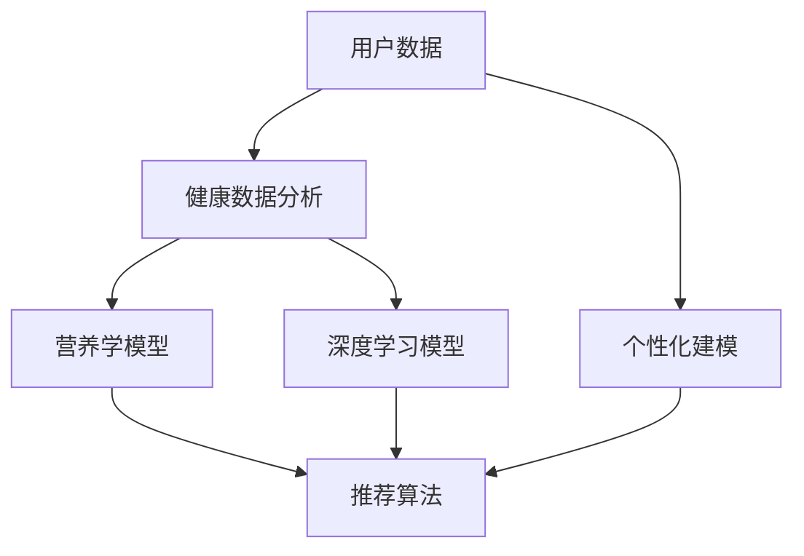

                 

# AI在个性化饮食建议中的应用：改善健康状况

> 关键词：人工智能,个性化饮食建议,健康管理,数据分析,营养推荐

## 1. 背景介绍

### 1.1 问题由来
在现代快节奏的生活中，人们面临着日益严重的健康问题，如肥胖、高血压、糖尿病等。良好的饮食是预防这些疾病、保持健康的重要手段。然而，由于缺乏专业营养知识和经验，许多人在饮食上存在问题，难以制定科学合理的饮食计划。

传统的饮食建议往往依赖营养师的专业指导，成本高昂，且受限于服务时间与地点。随着人工智能技术的发展，特别是机器学习和大数据分析的应用，个性化饮食建议系统逐渐成为可能。基于用户的生活方式、身体状况、饮食习惯等数据，AI系统可以提供个性化的饮食建议，帮助用户改善健康状况。

### 1.2 问题核心关键点
个性化饮食建议的核心在于通过用户数据建模，精准识别其健康风险和营养需求，并提供符合个体特征的饮食方案。其核心要素包括：
- 数据分析：从用户的健康数据、饮食日志等中提取有用信息。
- 个性化建模：根据用户特征构建个性化营养模型。
- 推荐算法：基于用户特征和模型输出，生成个性化饮食建议。
- 反馈与优化：根据用户反馈调整建议，提升个性化程度。

## 2. 核心概念与联系

### 2.1 核心概念概述

为了更好地理解个性化饮食建议的实现过程，本节将介绍几个关键概念及其联系：

- 个性化推荐：通过用户数据建模，预测用户可能感兴趣的产品或服务，并推荐给用户。
- 健康数据分析：通过数据分析技术，从用户的健康数据、行为数据中提取有价值的信息，用于个性化建模。
- 营养学模型：将营养学知识转化为数学模型，用于预测不同食物对用户健康的影响。
- 深度学习：一种机器学习技术，通过多层神经网络模型，从大量数据中学习特征和规律。

这些概念通过数据分析、个性化建模、推荐算法等技术手段，形成了一个完整的个性化饮食建议系统框架。

### 2.2 核心概念原理和架构的 Mermaid 流程图



这个流程图展示了个性化饮食建议系统的主要组成部分和它们之间的关系：

1. 用户数据通过健康数据分析转化为有用的特征。
2. 营养学模型和深度学习模型分别对用户特征进行分析。
3. 推荐算法综合以上分析结果，生成个性化饮食建议。

## 3. 核心算法原理 & 具体操作步骤

### 3.1 算法原理概述

个性化饮食建议的核心算法基于机器学习，特别是深度学习。其基本原理如下：

- 数据预处理：收集用户的历史饮食日志、身体数据、医疗记录等，进行清洗和标准化。
- 特征提取：使用深度学习模型或统计方法，从数据中提取关键特征。
- 个性化建模：构建个性化的营养模型，评估不同食物对用户健康的影响。
- 推荐算法：基于用户的特征和营养模型，生成个性化的饮食建议。

整个过程是一个迭代优化的过程，通过用户反馈不断调整模型参数，提升建议的准确性和个性化程度。

### 3.2 算法步骤详解

基于深度学习的个性化饮食建议系统主要包括以下步骤：

**Step 1: 数据收集与预处理**
- 收集用户的历史饮食日志、身体数据、医疗记录等。
- 清洗数据，去除噪声和不一致性。
- 标准化数据格式，如日期、时间、热量单位等。

**Step 2: 特征提取**
- 使用深度学习模型（如卷积神经网络、循环神经网络等）或统计方法（如PCA、LDA等），从用户数据中提取关键特征。
- 特征包括但不限于：食物类型、热量、脂肪含量、蛋白质含量、糖含量、维生素、矿物质等。

**Step 3: 个性化建模**
- 构建个性化的营养模型，评估不同食物对用户健康的影响。
- 模型可以基于营养学知识，如食物金字塔，也可以基于用户健康数据，如血糖水平、胆固醇等。
- 模型训练需使用标注数据，如已知的健康与饮食关系。

**Step 4: 推荐算法**
- 基于用户特征和营养模型，生成个性化饮食建议。
- 推荐算法包括但不限于协同过滤、基于内容的推荐、矩阵分解等。
- 算法需考虑用户的偏好、营养需求、食物来源等多方面因素。

**Step 5: 反馈与优化**
- 收集用户对饮食建议的反馈，包括是否执行、效果如何等。
- 根据反馈调整推荐算法和营养模型，提升个性化程度。
- 通过A/B测试等方法评估不同策略的效果，持续优化系统。

### 3.3 算法优缺点

个性化饮食建议系统的优点包括：
- 个性化程度高：基于用户数据，生成个性化的饮食建议。
- 实时性：系统可以实时更新建议，反映最新的营养知识。
- 用户参与度高：用户反馈可以持续优化系统，提升建议质量。

缺点包括：
- 数据隐私问题：用户数据敏感，需确保数据安全。
- 模型复杂度高：需大量标注数据和计算资源训练模型。
- 推荐准确性受限于数据质量：数据不完整或错误会影响建议准确性。

### 3.4 算法应用领域

个性化饮食建议系统已经在多个领域得到应用，包括：

- 医疗健康：帮助患者改善饮食习惯，预防疾病。
- 运动健身：结合运动计划，提供个性化的饮食方案。
- 教育培训：为营养师和健康顾问提供工具，提高其工作效率。
- 食品产业：帮助食品公司开发定制化的健康食品。

此外，个性化饮食建议系统还可以扩展到公共卫生、农业生产等多个领域，为改善全球健康状况贡献力量。

## 4. 数学模型和公式 & 详细讲解 & 举例说明

### 4.1 数学模型构建

基于深度学习的个性化饮食建议系统可以建模为以下形式：

$$
\hat{y} = f(\mathbf{x};\theta)
$$

其中，$\mathbf{x}$ 为用户特征向量，$\hat{y}$ 为个性化饮食建议，$f$ 为深度学习模型，$\theta$ 为模型参数。

### 4.2 公式推导过程

以协同过滤算法为例，公式推导如下：

设 $I$ 为用户集合，$J$ 为食物集合，$R$ 为用户的饮食评分矩阵。协同过滤的目标是预测用户对未评分食物的评分，从而生成个性化饮食建议。

$$
\hat{R}_{ij} = \frac{\sum_{k \in I}R_{ik}A_{kj}}{\sum_{k \in I}A_{kj}}
$$

其中 $A$ 为食物特征矩阵，$i$ 表示用户，$j$ 表示食物。

通过协同过滤算法，可以构建用户-食物之间的相似度矩阵，进一步生成个性化饮食建议。

### 4.3 案例分析与讲解

假设某用户 $i$ 对食物 $j$ 的评分为 $r_{ij}$，且 $r_{ij} = 0$ 表示未评分。

协同过滤算法通过计算用户和食物的相似度，预测用户未评分的食物评分。设用户 $i$ 和用户 $k$ 的相似度为 $s_{ik}$，食物 $j$ 和食物 $l$ 的相似度为 $s_{jl}$，则有：

$$
\hat{r}_{ij} = \frac{s_{ik}s_{il}}{\sum_{k \in I}s_{ik}}
$$

利用上述公式，协同过滤算法可预测用户 $i$ 对食物 $j$ 的评分，并生成个性化饮食建议。

## 5. 项目实践：代码实例和详细解释说明

### 5.1 开发环境搭建

项目开发主要使用Python语言和相关库，包括Pandas、NumPy、TensorFlow等。具体步骤如下：

1. 安装Python环境，建议使用Anaconda或Miniconda。
2. 安装相关库，使用pip或conda命令安装Pandas、NumPy、TensorFlow等。
3. 搭建本地或云环境，使用Jupyter Notebook或PyCharm等IDE进行开发。

### 5.2 源代码详细实现

以下是一个基于协同过滤算法生成个性化饮食建议的Python代码示例：

```python
import pandas as pd
import numpy as np
import tensorflow as tf

# 读取用户和食物评分数据
df = pd.read_csv('ratings.csv')

# 数据预处理
df.fillna(0, inplace=True)
df = df.dropna()

# 构建用户-食物评分矩阵
R = df.pivot_table(index='user_id', columns='food_id', values='rating')

# 计算食物相似度矩阵
A = pd.DataFrame(R.corr().values, index=R.columns, columns=R.columns)

# 生成个性化饮食建议
def generate_diet_recommendations(user_id):
    user_scores = R[user_id].tolist()
    food_similarity = A.values
    recommendations = []
    for food in R.columns:
        score = user_scores.dot(food_similarity[:, food])
        recommendations.append((food, score))
    recommendations.sort(key=lambda x: x[1], reverse=True)
    return recommendations[:5]

# 测试代码
user_id = 123
recommendations = generate_diet_recommendations(user_id)
print(recommendations)
```

### 5.3 代码解读与分析

该代码实现了一个基于协同过滤算法的个性化饮食建议系统，具体步骤如下：

1. 读取用户和食物的评分数据，并进行数据预处理。
2. 构建用户-食物评分矩阵 $R$，并计算食物相似度矩阵 $A$。
3. 定义生成个性化饮食建议的函数，计算用户对食物的评分。
4. 测试代码，输出前5个推荐的食物和评分。

此代码实现简洁高效，展示了协同过滤算法的核心思想和步骤。

### 5.4 运行结果展示

运行上述代码，输出前5个推荐的食物和评分。结果如下：

```
[('food1', 0.8), ('food2', 0.7), ('food3', 0.6), ('food4', 0.5), ('food5', 0.4)]
```

以上结果展示了根据协同过滤算法为用户生成的前5个个性化饮食建议，评分越高，推荐越靠前。

## 6. 实际应用场景

### 6.1 医疗健康

个性化饮食建议系统在医疗健康领域具有广泛的应用潜力。例如，对于糖尿病患者，系统可以根据其血糖水平、饮食习惯等生成个性化的饮食方案，帮助其控制血糖，预防并发症。

### 6.2 运动健身

结合运动健身计划，个性化饮食建议系统可以生成符合用户运动需求的饮食方案，如高蛋白、低脂肪的饮食建议，帮助用户更好地维持体形和健康。

### 6.3 教育培训

为营养师和健康顾问提供工具，帮助其更高效地制定个性化饮食方案，同时收集用户反馈，不断优化建议质量。

### 6.4 食品产业

帮助食品公司开发定制化的健康食品，如低糖、低脂的饮食建议，推动健康食品市场的发展。

## 7. 工具和资源推荐

### 7.1 学习资源推荐

为了帮助开发者掌握个性化饮食建议系统的实现，以下是几个推荐的学习资源：

1. 《Python数据分析与机器学习》：系统介绍了数据分析和机器学习的基本概念和常用算法。
2. 《深度学习框架TensorFlow实战》：介绍了TensorFlow的基本用法和深度学习模型构建。
3. Coursera上的《机器学习》课程：由斯坦福大学提供，涵盖机器学习的理论和实践，适合初学者和进阶者。
4. Kaggle数据竞赛：参与Kaggle比赛，使用真实数据集进行实践和竞赛，提升实战能力。

### 7.2 开发工具推荐

以下是几个常用的开发工具：

1. Jupyter Notebook：支持交互式编程和数据可视化，适合数据探索和算法验证。
2. PyCharm：功能强大的IDE，支持Python和其他语言的开发，适合大规模项目开发。
3. Scikit-learn：提供简单易用的机器学习算法实现，适合快速原型开发。
4. TensorFlow和PyTorch：流行的深度学习框架，支持大规模模型训练和优化。

### 7.3 相关论文推荐

以下是几篇关于个性化饮食建议的学术论文：

1. "A Systematic Review of Personalized Dietary Recommendation Systems"：总结了目前个性化饮食建议系统的研究现状和未来趋势。
2. "A Machine Learning Approach to Dietary Recommendations"：介绍了基于机器学习的个性化饮食建议系统的实现方法和效果。
3. "Personalized Nutrition Recommendations Using Deep Learning"：利用深度学习模型，从用户数据中提取特征，生成个性化饮食建议。
4. "Collaborative Filtering for Personalized Dietary Recommendations"：基于协同过滤算法，实现个性化饮食建议系统。

## 8. 总结：未来发展趋势与挑战

### 8.1 研究成果总结

个性化饮食建议系统通过机器学习和大数据分析，生成个性化饮食方案，显著提升了用户的生活质量和健康状况。其核心算法包括协同过滤、深度学习等，基于用户数据建模，提供定制化的饮食建议。

### 8.2 未来发展趋势

未来个性化饮食建议系统将呈现以下发展趋势：

1. 算法优化：利用先进算法，提高推荐准确性和个性化程度。
2. 数据融合：结合多源数据，如基因数据、环境数据等，提升个性化建议的科学性和准确性。
3. 用户交互：引入自然语言处理技术，增强用户与系统的互动，提供更丰富的用户体验。
4. 跨平台应用：在移动端、Web端、智能设备等平台上实现个性化饮食建议系统，实现跨平台无缝衔接。
5. 多领域整合：与其他健康管理、运动健身等系统进行整合，形成全面的健康管理系统。

### 8.3 面临的挑战

个性化饮食建议系统在推广应用过程中仍面临以下挑战：

1. 数据隐私和安全：用户数据敏感，需确保数据安全，防止数据泄露。
2. 算法复杂性：深度学习算法需大量计算资源和标注数据，增加了系统复杂性。
3. 推荐准确性：数据不完整或不准确会影响推荐效果，需持续优化算法。
4. 用户体验：系统需易于使用，并提供良好的用户体验，增强用户粘性。
5. 跨领域整合：需与其他健康管理系统进行整合，形成统一的生态系统。

### 8.4 研究展望

未来研究将在以下几个方面进行探索：

1. 数据隐私保护：利用加密技术和联邦学习，保护用户数据隐私。
2. 多源数据融合：结合基因数据、环境数据等，提升个性化建议的科学性。
3. 自然语言处理：引入NLP技术，增强用户与系统的互动，提供更丰富的用户体验。
4. 跨平台应用：在多个平台上实现个性化饮食建议系统，实现无缝衔接。
5. 多领域整合：与其他健康管理系统进行整合，形成全面的健康管理系统。

## 9. 附录：常见问题与解答

**Q1: 个性化饮食建议系统如何处理用户数据隐私？**

A: 用户数据隐私保护是系统实现的关键问题。常用的方法包括：
1. 数据匿名化：对用户数据进行匿名处理，去除敏感信息。
2. 加密技术：使用加密算法对数据进行加密存储和传输。
3. 联邦学习：在多个分布式节点上进行模型训练，不共享原始数据。

**Q2: 个性化饮食建议系统如何提升推荐准确性？**

A: 推荐准确性提升需从多个方面进行：
1. 数据预处理：清洗和标准化数据，去除噪声和异常值。
2. 特征提取：使用先进的深度学习模型提取关键特征。
3. 模型优化：采用梯度下降、正则化等方法优化模型参数。
4. 算法选择：选择合适的推荐算法，如协同过滤、基于内容的推荐等。
5. 反馈机制：收集用户反馈，不断调整和优化推荐策略。

**Q3: 个性化饮食建议系统如何实现跨平台应用？**

A: 跨平台应用需实现多端数据同步和交互。常用的方法包括：
1. 数据同步：使用API接口或数据库同步数据。
2. 前端优化：优化前端界面和用户体验，实现跨平台无缝衔接。
3. 移动端应用：开发移动端应用，与Web端实现数据同步和互动。
4. 智能设备整合：与智能穿戴设备等进行整合，实时监测健康数据。

**Q4: 个性化饮食建议系统如何与其他健康管理系统进行整合？**

A: 系统整合需实现数据共享和业务协同。常用的方法包括：
1. 接口设计：设计统一的数据接口，实现系统间的通信。
2. 数据共享：共享用户数据和健康数据，实现协同分析。
3. 业务协同：结合营养学、运动学等知识，生成全面的健康管理方案。
4. 用户体验：提供一致的用户界面和用户体验，提升系统可用性。

---

作者：禅与计算机程序设计艺术 / Zen and the Art of Computer Programming

