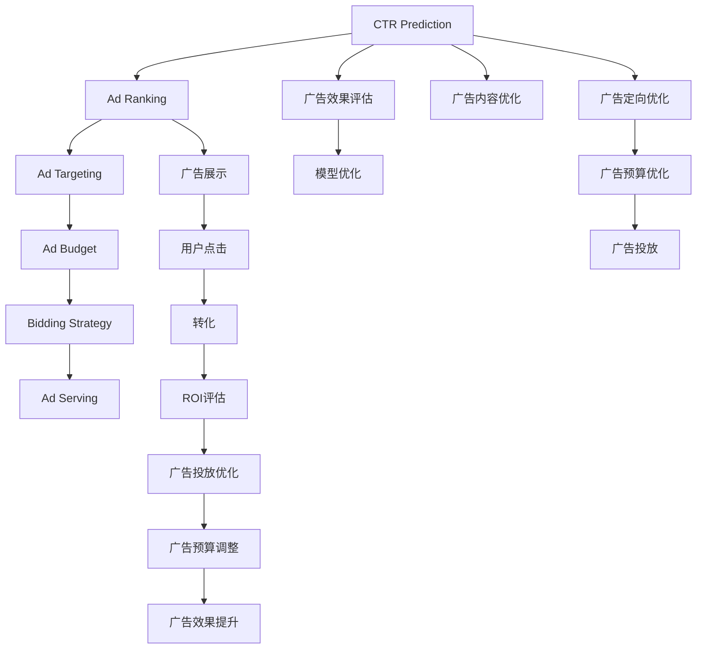

                 

# AI在搜索引擎广告投放中的应用

> 关键词：搜索引擎广告, 广告投放优化, 机器学习, 点击率预测, 广告定向, 竞价策略, 广告预算, 算法, 深度学习, 数据驱动, 自然语言处理

## 1. 背景介绍

### 1.1 问题由来

在互联网时代，搜索引擎广告（Search Engine Advertising, 简称SEA）成为了各大互联网公司获取流量、推广产品的重要手段。与传统的户外广告相比，SEA能够实现高度精准的目标用户触达，具有效果可量化、投放成本可控等优势。然而，SEA广告投放的复杂性和多样性，使得广告主在获取高ROI（投资回报率）时面临诸多挑战。

首先，用户点击（Click-Through Rate, CTR）是衡量广告效果的关键指标。CTR高的广告可以获得更多曝光和点击，带来更高的转化率和收益。但CTR受多种因素影响，如广告内容、关键词相关性、广告位置等。如何预测CTR，优化广告内容，是提高广告效果的核心问题。

其次，广告定向（Ad Targeting）也是SEA投放中一个重要环节。广告主希望将广告投放给最有可能产生购买意愿的用户，以最大化广告投资回报率。如何精准选择目标用户群体，是广告定向的关键。

再次，广告预算（Ad Budget）的合理分配和优化，是决定广告投放效果的重要因素。如何在有限的预算内，实现最佳广告效果，是广告主追求的目标。

综上，如何利用AI技术优化搜索引擎广告投放，成为各互联网公司竞相研究的焦点。基于机器学习、深度学习等AI技术，开发高性能的CTR预测模型、定向模型和竞价策略，成为解决上述问题的有效手段。

## 2. 核心概念与联系

### 2.1 核心概念概述

为深入理解AI在搜索引擎广告投放中的应用，需先了解几个核心概念：

- **搜索引擎广告（SEA）**：在搜索引擎中展示的广告，用户通过点击可访问广告主指定的页面。
- **点击率预测（CTR Prediction）**：通过模型预测特定广告在特定位置下的点击率，指导广告投放决策。
- **广告定向（Ad Targeting）**：根据用户的历史行为、兴趣等特征，精准选择目标用户群体。
- **竞价策略（Bidding Strategy）**：根据广告效果、预算等因素，动态调整出价（Bid），最大化ROI。
- **广告预算（Ad Budget）**：合理分配广告投放的资金，避免浪费和不足。
- **深度学习（Deep Learning）**：利用多层次神经网络进行广告效果预测和优化。
- **机器学习（Machine Learning）**：利用算法和统计学方法，从历史数据中学习和优化广告投放策略。
- **自然语言处理（Natural Language Processing, NLP）**：处理和分析广告文本，提升广告内容的相关性和吸引力。
- **广告排名（Ad Ranking）**：根据广告质量、关键词相关性等因素，决定广告的排名顺序。

这些核心概念通过一定的框架和逻辑，可形成一个完整、高效的广告投放系统，提高广告的CTR和ROI。

### 2.2 核心概念联系

这些概念之间的联系和互动关系可通过以下Mermaid流程图来展示：



该流程图展示了广告投放系统的核心逻辑流程：

1. 通过CTR预测模型，预测广告的点击率和广告排名，指导广告投放决策。
2. 利用广告定向模型，精准选择目标用户群体，确保广告投放的精准性和有效性。
3. 根据广告效果和预算，动态调整竞价策略，最大化ROI。
4. 实时监测广告效果，通过广告排名和效果评估，持续优化广告投放。
5. 优化广告内容和定向，提升广告展示和点击率。
6. 优化广告预算，提高广告投放的效率和效果。

这些环节相互衔接、相互影响，共同构成一个完整的广告投放系统。

## 3. 核心算法原理 & 具体操作步骤
### 3.1 算法原理概述

AI在搜索引擎广告投放中的应用，核心在于利用机器学习和深度学习算法，从大量历史数据中学习广告投放的规律，指导投放决策。具体而言，广告投放系统主要包括CTR预测、广告定向、竞价策略、广告预算优化等几个关键模块。

1. **CTR预测（CTR Prediction）**：通过模型预测广告在特定位置下的点击率，指导广告投放决策。CTR预测是广告投放系统的核心，直接影响到广告的展示和点击效果。

2. **广告定向（Ad Targeting）**：利用用户的历史行为、兴趣等特征，选择最有可能产生购买意愿的目标用户群体。广告定向能够提高广告的精准性和投放效果。

3. **竞价策略（Bidding Strategy）**：根据广告效果和预算，动态调整出价（Bid），最大化ROI。竞价策略需要综合考虑广告效果、点击率、转化率等因素，实现最优广告投放。

4. **广告预算优化（Ad Budget Optimization）**：根据广告效果和预算使用情况，动态调整广告预算，避免浪费和不足。预算优化能够提高广告投放的效率和效果。

### 3.2 算法步骤详解

#### 3.2.1 CTR预测

CTR预测是广告投放系统中的核心算法，通过预测点击率，指导广告的展示和排名。CTR预测模型的构建步骤如下：

1. **数据准备**：收集历史广告数据，包括广告特征、点击次数、展示次数等。广告特征包括广告标题、描述、关键词、展示位置等。

2. **特征工程**：对广告特征进行预处理和工程化，生成更具表达力的特征。例如，可以使用词袋模型（Bag of Words）表示广告标题和描述，使用One-Hot编码表示广告展示位置等。

3. **模型选择**：选择合适的模型进行CTR预测。常见的模型包括线性回归、逻辑回归、随机森林、梯度提升树、神经网络等。

4. **模型训练**：使用历史广告数据对模型进行训练，调整模型参数，使其能够准确预测广告的点击率。

5. **模型评估**：使用测试数据对模型进行评估，计算模型在测试集上的平均点击率。常见评估指标包括准确率、召回率、F1值等。

6. **模型部署**：将训练好的CTR预测模型部署到广告投放系统中，实时预测广告的点击率，指导广告投放决策。

#### 3.2.2 广告定向

广告定向的目标是选择最有可能产生购买意愿的目标用户群体，提高广告的精准性和投放效果。广告定向模型的构建步骤如下：

1. **用户画像**：收集用户的历史行为、兴趣、设备信息等数据，生成用户画像。

2. **特征选择**：选择与广告相关的用户特征，如年龄、性别、职业、地域、设备等。

3. **模型选择**：选择合适的模型进行广告定向。常见的模型包括逻辑回归、随机森林、神经网络等。

4. **模型训练**：使用历史广告数据对模型进行训练，调整模型参数，使其能够准确预测用户是否对广告感兴趣。

5. **模型评估**：使用测试数据对模型进行评估，计算模型在测试集上的精准率和召回率。

6. **模型部署**：将训练好的广告定向模型部署到广告投放系统中，实时选择目标用户群体，指导广告投放决策。

#### 3.2.3 竞价策略

竞价策略的目标是在有限的预算内，最大化广告的ROI。竞价策略模型的构建步骤如下：

1. **预算分配**：根据广告主的需求和预算，分配广告投放预算。

2. **竞价模型**：选择合适的模型进行竞价策略计算。常见的模型包括线性回归、梯度提升树等。

3. **模型训练**：使用历史广告数据对模型进行训练，调整模型参数，使其能够根据广告效果动态调整出价（Bid）。

4. **模型评估**：使用测试数据对模型进行评估，计算模型在测试集上的ROI。

5. **模型部署**：将训练好的竞价策略模型部署到广告投放系统中，实时动态调整出价，最大化广告投放效果。

#### 3.2.4 广告预算优化

广告预算优化的目标是在有限的预算内，实现最佳的广告效果。广告预算优化模型的构建步骤如下：

1. **预算分配**：根据广告主的需求和预算，分配广告投放预算。

2. **预算调整**：选择合适的模型进行预算调整。常见的模型包括线性回归、梯度提升树等。

3. **模型训练**：使用历史广告数据对模型进行训练，调整模型参数，使其能够根据广告效果动态调整预算。

4. **模型评估**：使用测试数据对模型进行评估，计算模型在测试集上的预算效果。

5. **模型部署**：将训练好的广告预算优化模型部署到广告投放系统中，实时动态调整预算，提高广告投放效果。

### 3.3 算法优缺点

AI在搜索引擎广告投放中的应用，通过机器学习和深度学习算法，实现了广告投放的自动化和智能化。其主要优点包括：

1. **高效性**：AI模型能够在大量历史数据的基础上，快速学习广告投放的规律，指导广告投放决策，提高广告投放效率。

2. **精准性**：AI模型能够根据用户的历史行为和兴趣，精准选择目标用户群体，提高广告的精准性和投放效果。

3. **自适应性**：AI模型能够根据广告效果和预算，动态调整出价和预算，实现最优广告投放效果。

4. **可解释性**：AI模型通过特征工程和模型训练，能够对广告效果进行解释和优化，提高广告投放的可解释性。

然而，AI在广告投放中也存在一些局限性：

1. **数据依赖性**：AI模型的训练和优化高度依赖于历史数据的质量和数量，数据不足或数据偏差可能导致模型效果不佳。

2. **模型复杂性**：AI模型通常较为复杂，需要较大的计算资源和存储空间，模型部署和维护成本较高。

3. **模型过拟合**：AI模型容易过拟合历史数据，导致泛化性能不足，影响广告投放效果。

4. **可解释性不足**：AI模型通常被认为是"黑盒"系统，难以解释其内部工作机制和决策逻辑，缺乏可解释性。

5. **隐私问题**：AI模型需要收集和处理大量用户数据，涉及隐私和安全问题，需要严格的数据保护措施。

6. **技术门槛高**：AI模型需要较高的技术水平和经验，一般只有专业的数据科学家和工程师才能进行模型开发和优化。

综上所述，AI在搜索引擎广告投放中具有显著优势，但也面临一些挑战和局限性。只有通过不断的技术创新和优化，才能更好地发挥AI在广告投放中的潜力。

### 3.4 算法应用领域

AI在搜索引擎广告投放中的应用，已广泛应用于各大互联网公司。以下是几个典型的应用领域：

1. **电商平台**：电商平台通过AI模型预测商品CTR，优化广告投放策略，提高销售额和ROI。例如，京东、淘宝等电商平台已广泛应用AI技术进行广告投放。

2. **媒体平台**：媒体平台通过AI模型预测广告点击率，优化广告定向和竞价策略，提高广告效果。例如，谷歌、Facebook等媒体平台已广泛应用AI技术进行广告投放。

3. **金融行业**：金融行业通过AI模型预测用户行为，优化广告定向和竞价策略，提高广告投放效果。例如，银行、保险公司等金融机构已广泛应用AI技术进行广告投放。

4. **旅游行业**：旅游行业通过AI模型预测用户偏好，优化广告定向和竞价策略，提高广告效果。例如，携程、去哪儿等旅游平台已广泛应用AI技术进行广告投放。

5. **教育行业**：教育行业通过AI模型预测用户学习行为，优化广告定向和竞价策略，提高广告效果。例如，Coursera、Udacity等在线教育平台已广泛应用AI技术进行广告投放。

## 4. 数学模型和公式 & 详细讲解
### 4.1 数学模型构建

在广告投放系统中，常见的数学模型包括CTR预测模型、广告定向模型、竞价策略模型和预算优化模型。以CTR预测模型为例，其数学模型构建步骤如下：

1. **特征表示**：将广告特征表示为向量形式。例如，广告标题和描述可以使用词袋模型表示，广告展示位置可以使用One-Hot编码表示。

2. **线性回归模型**：使用线性回归模型预测广告的点击率。线性回归模型表示为：

   $$
   \hat{y} = \beta_0 + \sum_{i=1}^{n} \beta_i x_i
   $$

   其中，$\hat{y}$表示预测的点击率，$x_i$表示广告特征，$\beta_i$表示特征系数，$\beta_0$表示截距。

3. **逻辑回归模型**：使用逻辑回归模型预测广告的点击率。逻辑回归模型表示为：

   $$
   \hat{p} = \frac{1}{1 + e^{-\beta^T x}}
   $$

   其中，$\hat{p}$表示预测的点击概率，$\beta$表示模型参数，$x$表示广告特征。

4. **神经网络模型**：使用神经网络模型预测广告的点击率。神经网络模型通常包含多层非线性变换，可以更好地捕捉广告特征之间的关系。例如，使用一个包含两个隐藏层的神经网络模型表示为：

   $$
   \hat{y} = \sigma(W_L h_{L-1} + b_L)
   $$

   其中，$\hat{y}$表示预测的点击率，$W_L$表示输出层的权重矩阵，$h_{L-1}$表示最后一层的隐藏表示，$b_L$表示输出层的偏置项，$\sigma$表示激活函数。

### 4.2 公式推导过程

以CTR预测模型为例，其公式推导过程如下：

1. **线性回归模型**：

   假设广告特征为$x_i = [x_{i1}, x_{i2}, ..., x_{in}]$，点击率为$y_i$，则线性回归模型的损失函数为：

   $$
   \mathcal{L}(\beta) = \frac{1}{N} \sum_{i=1}^{N} (y_i - \hat{y}_i)^2
   $$

   其中，$N$表示样本数，$\hat{y}_i$表示预测的点击率。

   求解最小化损失函数，得到线性回归模型的最优参数：

   $$
   \beta = (X^TX)^{-1}X^Ty
   $$

   其中，$X$表示广告特征矩阵，$y$表示点击率向量。

2. **逻辑回归模型**：

   假设广告特征为$x_i = [x_{i1}, x_{i2}, ..., x_{in}]$，点击概率为$p_i$，则逻辑回归模型的损失函数为：

   $$
   \mathcal{L}(\beta) = \frac{1}{N} \sum_{i=1}^{N} (y_i \log \hat{p}_i + (1 - y_i) \log (1 - \hat{p}_i))
   $$

   其中，$N$表示样本数，$\hat{p}_i$表示预测的点击概率。

   求解最小化损失函数，得到逻辑回归模型的最优参数：

   $$
   \beta = (X^TX)^{-1}X^T(y \circ p')
   $$

   其中，$y$表示点击率向量，$p'$表示预测的点击概率向量。

3. **神经网络模型**：

   假设广告特征为$x_i = [x_{i1}, x_{i2}, ..., x_{in}]$，点击率为$y_i$，则神经网络模型的损失函数为：

   $$
   \mathcal{L}(\theta) = \frac{1}{N} \sum_{i=1}^{N} \log(1 + e^{-y_i \hat{y}_i})
   $$

   其中，$N$表示样本数，$\hat{y}_i$表示预测的点击率。

   求解最小化损失函数，得到神经网络模型的最优参数：

   $$
   \theta = \arg\min_{\theta} \mathcal{L}(\theta)
   $$

   其中，$\theta$表示神经网络模型参数。

### 4.3 案例分析与讲解

以谷歌的AdWords为例，其广告投放系统通过CTR预测模型和广告定向模型，实现了广告的自动化投放。广告投放系统包括多个步骤：

1. **广告内容生成**：广告主输入关键词和广告内容，系统自动生成广告标题和描述。

2. **广告定向**：系统根据用户的历史行为和兴趣，选择最有可能产生购买意愿的目标用户群体。

3. **CTR预测**：系统根据广告特征和用户特征，预测广告的点击率，指导广告投放决策。

4. **竞价策略**：系统根据广告效果和预算，动态调整出价（Bid），最大化ROI。

5. **广告投放**：系统将生成的广告展示在搜索结果页面上，用户点击广告可访问广告主指定的页面。

谷歌AdWords通过AI技术，实现了广告投放的自动化和智能化，提高了广告投放的效率和效果。其核心在于CTR预测模型的准确性和广告定向模型的精准性，能够指导广告的展示和投放决策。

## 5. 项目实践：代码实例和详细解释说明
### 5.1 开发环境搭建

在进行广告投放系统的开发前，需要先准备好开发环境。以下是使用Python进行TensorFlow和Keras开发的环境配置流程：

1. 安装Anaconda：从官网下载并安装Anaconda，用于创建独立的Python环境。

2. 创建并激活虚拟环境：
```bash
conda create -n tf-env python=3.8
conda activate tf-env
```

3. 安装TensorFlow和Keras：
```bash
pip install tensorflow==2.3.0 keras==2.4.3
```

4. 安装各类工具包：
```bash
pip install numpy pandas scikit-learn matplotlib tqdm jupyter notebook ipython
```

完成上述步骤后，即可在`tf-env`环境中开始广告投放系统的开发。

### 5.2 源代码详细实现

下面我们以CTR预测模型为例，给出使用TensorFlow和Keras进行广告CTR预测的代码实现。

首先，定义CTR预测模型的输入和输出：

```python
from tensorflow.keras.layers import Input, Dense, Embedding, Concatenate, Dropout
from tensorflow.keras.models import Model

# 定义广告特征和用户特征的维度
input_dim = 10
user_dim = 5

# 定义广告特征输入
input_ad = Input(shape=(input_dim,))
# 定义用户特征输入
input_user = Input(shape=(user_dim,))

# 定义广告特征嵌入层
ad_embedding = Embedding(input_dim, 32, input_length=1)(input_ad)

# 定义用户特征嵌入层
user_embedding = Embedding(user_dim, 32)(input_user)

# 定义特征拼接层
concat = Concatenate()([ad_embedding, user_embedding])

# 定义隐藏层
hidden = Dense(128, activation='relu')(concat)

# 定义输出层
output = Dense(1, activation='sigmoid')(hidden)

# 定义CTR预测模型
model = Model(inputs=[input_ad, input_user], outputs=output)
```

然后，定义模型训练过程：

```python
from tensorflow.keras.optimizers import Adam
from tensorflow.keras.callbacks import EarlyStopping

# 定义优化器和损失函数
optimizer = Adam(lr=0.001)
loss = 'binary_crossentropy'

# 定义模型编译
model.compile(optimizer=optimizer, loss=loss, metrics=['accuracy'])

# 定义训练集和测试集
train_dataset = ...
test_dataset = ...

# 定义早期停止回调
early_stopping = EarlyStopping(patience=10)

# 定义模型训练过程
model.fit([train_dataset[0], train_dataset[1]], train_dataset[2], batch_size=128, epochs=100, validation_data=([test_dataset[0], test_dataset[1]], test_dataset[2]), callbacks=[early_stopping])
```

最后，在实际广告投放系统中部署和使用模型：

```python
# 定义广告特征和用户特征
ad_features = ...
user_features = ...

# 预测广告点击率
click_prob = model.predict([ad_features, user_features])

# 判断是否展示广告
if click_prob > 0.5:
    show_ad()
```

以上就是使用TensorFlow和Keras进行广告CTR预测的完整代码实现。可以看到，利用TensorFlow和Keras的强大封装能力，广告CTR预测模型的开发变得简洁高效。

### 5.3 代码解读与分析

让我们再详细解读一下关键代码的实现细节：

**广告特征和用户特征**：
- `input_dim`和`user_dim`：定义广告特征和用户特征的维度，例如广告标题长度为10，用户兴趣特征长度为5。
- `input_ad`和`input_user`：定义广告特征和用户特征的输入层。
- `ad_embedding`和`user_embedding`：定义广告特征和用户特征的嵌入层，将高维稀疏特征转化为低维稠密特征。

**特征拼接和隐藏层**：
- `Concatenate`层：将广告特征和用户特征拼接起来，形成新的特征向量。
- `Dense`层：定义隐藏层，进行非线性变换，捕捉广告特征和用户特征之间的关系。

**输出层和模型编译**：
- `output`层：定义输出层，使用sigmoid激活函数进行点击率预测。
- `Model`层：定义CTR预测模型，将广告特征和用户特征作为输入，点击率作为输出。
- `compile`方法：定义优化器和损失函数，进行模型编译。

**模型训练**：
- `Adam`优化器：定义优化器，设置学习率为0.001。
- `binary_crossentropy`损失函数：定义损失函数，用于CTR预测模型的训练。
- `fit`方法：定义模型训练过程，使用训练集进行模型训练，并设置早期停止回调，防止过拟合。

**模型使用**：
- `ad_features`和`user_features`：定义广告特征和用户特征。
- `predict`方法：使用模型进行预测，输出广告点击概率。
- `if`语句：根据预测结果，决定是否展示广告。

可以看到，广告CTR预测模型的开发主要依赖TensorFlow和Keras的强大封装能力，使得模型开发和部署变得简洁高效。同时，模型训练和预测过程也较为直观，易于理解和调试。

当然，实际广告投放系统还需要考虑更多因素，如广告预算、竞价策略、广告排名等。但核心的CTR预测范式基本与此类似。

## 6. 实际应用场景
### 6.1 智能推荐系统

智能推荐系统是搜索引擎广告投放中的一个重要应用场景。推荐系统通过分析用户的历史行为和兴趣，推荐用户可能感兴趣的商品或服务，提高用户体验和转化率。

在推荐系统中，CTR预测模型和广告定向模型可发挥重要作用。通过CTR预测模型，系统能够预测用户对推荐商品或服务的点击率，指导推荐排序。通过广告定向模型，系统能够精准选择目标用户群体，提高推荐效果。

例如，淘宝的推荐系统通过CTR预测模型和广告定向模型，实现了个性化推荐。用户浏览商品时，系统实时预测用户对不同商品的点击率，并通过广告定向模型选择最有可能产生购买意愿的用户群体，进行个性化推荐，提高用户转化率和满意度。

### 6.2 金融风险管理

金融风险管理是搜索引擎广告投放中的另一个重要应用场景。金融机构通过CTR预测模型和广告定向模型，能够有效识别和管理金融风险。

在金融风险管理中，CTR预测模型和广告定向模型可用于识别高风险用户和交易。通过CTR预测模型，系统能够预测用户交易的点击率，识别高风险交易。通过广告定向模型，系统能够精准选择高风险用户，进行风险管理。

例如，银行通过CTR预测模型和广告定向模型，实时监测用户的交易行为，识别高风险交易。对于高风险用户和交易，系统可进行预警，进行风险管理，保障用户资金安全。

### 6.3 新闻推送系统

新闻推送系统是搜索引擎广告投放中的第三个重要应用场景。新闻推送系统通过CTR预测模型和广告定向模型，能够精准推送用户感兴趣的新闻，提高用户停留时间和点击率。

在新闻推送系统中，CTR预测模型和广告定向模型可用于新闻的排序和推送。通过CTR预测模型，系统能够预测用户对不同新闻的点击率，进行新闻排序。通过广告定向模型，系统能够精准选择目标用户群体，进行新闻推送。

例如，今日头条通过CTR预测模型和广告定向模型，实现新闻推送。用户登录系统后，系统实时预测用户对不同新闻的点击率，并通过广告定向模型选择最有可能产生兴趣的用户群体，进行新闻推送，提高用户点击率和停留时间。

### 6.4 未来应用展望

随着人工智能技术的不断发展，广告投放系统将迎来更多新的应用场景和挑战。

1. **多模态广告投放**：未来的广告投放系统将不仅仅局限于文本广告，还会拓展到图像、视频等多模态广告。通过多模态广告投放，提高广告的吸引力和点击率。

2. **实时广告优化**：未来的广告投放系统将实现实时广告优化，根据用户行为实时调整广告内容、定向和竞价策略，提高广告效果。

3. **个性化广告推荐**：未来的广告投放系统将实现更精准的广告推荐，根据用户历史行为和实时行为，进行个性化广告推荐，提高用户转化率。

4. **跨平台广告投放**：未来的广告投放系统将实现跨平台广告投放，提高广告覆盖率和投放效果。

5. **情感分析广告投放**：未来的广告投放系统将实现情感分析，根据用户情感状态进行广告定向和投放，提高广告效果。

6. **AI广告创意生成**：未来的广告投放系统将实现AI广告创意生成，根据广告投放效果，自动生成高质量广告创意，提高广告投放效率。

7. **隐私保护广告投放**：未来的广告投放系统将实现隐私保护，通过匿名化处理和数据加密等措施，保护用户隐私和数据安全。

总之，随着人工智能技术的不断进步，广告投放系统将变得更加智能化、精准化和个性化，为广告主和用户带来更好的体验和效果。

## 7. 工具和资源推荐
### 7.1 学习资源推荐

为了帮助开发者掌握广告投放系统的开发技巧，这里推荐一些优质的学习资源：

1. **《广告投放系统》系列博文**：由大模型技术专家撰写，深入浅出地介绍了广告投放系统的各个环节，包括CTR预测、广告定向、竞价策略等。

2. **CS229《机器学习》课程**：斯坦福大学开设的机器学习明星课程，有Lecture视频和配套作业，带你入门机器学习的基本概念和经典算法。

3. **《TensorFlow实战》书籍**：TensorFlow官方文档，详细介绍了TensorFlow的各个组件和应用场景，是广告投放系统开发的必备资料。

4. **Kaggle竞赛**：Kaggle平台上的广告投放竞赛，提供大量真实广告数据，供开发者练习和优化广告投放系统。

5. **《深度学习广告系统》书籍**：详细介绍了深度学习在广告投放系统中的应用，包括CTR预测、广告定向、竞价策略等。

通过这些资源的学习实践，相信你一定能够快速掌握广告投放系统的开发技巧，并进行深度创新和优化。

### 7.2 开发工具推荐

高效的开发离不开优秀的工具支持。以下是几款用于广告投放系统开发的常用工具：

1. TensorFlow：基于Python的开源深度学习框架，灵活的计算图，适合快速迭代研究。

2. Keras：高层神经网络API，提供简洁的API接口，便于快速开发广告投放模型。

3. Hadoop和Spark：大数据处理框架，能够处理大规模广告数据，进行实时广告投放。

4. ElasticSearch：实时搜索和分析引擎，能够快速检索和展示广告数据，进行广告效果评估。

5. Scikit-learn：机器学习工具包，提供丰富的机器学习算法，进行广告效果预测和优化。

6. Jupyter Notebook：交互式编程环境，支持多种语言和库，便于广告投放系统的开发和调试。

合理利用这些工具，可以显著提升广告投放系统的开发效率，加快创新迭代的步伐。

### 7.3 相关论文推荐

广告投放系统的研究源于学界的持续研究。以下是几篇奠基性的相关论文，推荐阅读：

1. **点击率预测（CTR Prediction）**：介绍点击率预测模型，包括线性回归、逻辑回归、神经网络等，提高广告投放效果。

2. **广告定向（Ad Targeting）**：介绍广告定向模型，包括逻辑回归、随机森林、神经网络等，提高广告投放精准性。

3. **竞价策略（Bidding Strategy）**：介绍竞价策略模型，包括线性回归、梯度提升树等，提高广告投放ROI。

4. **广告预算优化（Ad Budget Optimization）**：介绍广告预算优化模型，包括线性回归、梯度提升树等，提高广告投放效率。

5. **多模态广告投放（Multimodal Advertising）**：介绍多模态广告投放技术，提高广告吸引力和点击率。

6. **实时广告优化（Real-Time Advertising Optimization）**：介绍实时广告优化技术，提高广告投放效果。

7. **个性化广告推荐（Personalized Advertising Recommendation）**：介绍个性化广告推荐技术，提高用户转化率。

这些论文代表了大广告投放系统的研究脉络，通过学习这些前沿成果，可以帮助研究者把握学科前进方向，激发更多的创新灵感。

## 8. 总结：未来发展趋势与挑战

### 8.1 总结

本文对AI在搜索引擎广告投放中的应用进行了全面系统的介绍。首先阐述了广告投放系统中的核心算法，包括CTR预测、广告定向、竞价策略和预算优化等。其次，从原理到实践，详细讲解了广告投放系统的数学模型和关键步骤，给出了广告投放系统的完整代码实例。同时，本文还探讨了广告投放系统的实际应用场景，展示了AI在广告投放中的强大潜力。最后，本文精选了广告投放系统的各类学习资源，力求为开发者提供全方位的技术指引。

通过本文的系统梳理，可以看到，AI技术在广告投放中的应用具有显著优势，能够大幅提升广告投放的效率和效果。AI模型通过学习历史数据，能够预测广告效果、优化广告定向和竞价策略，实现广告投放的自动化和智能化。未来，伴随AI技术的不断进步，广告投放系统将变得更加智能化、精准化和个性化，为广告主和用户带来更好的体验和效果。

### 8.2 未来发展趋势

展望未来，广告投放系统将呈现以下几个发展趋势：

1. **多模态广告投放**：未来的广告投放系统将不仅仅局限于文本广告，还会拓展到图像、视频等多模态广告。通过多模态广告投放，提高广告的吸引力和点击率。

2. **实时广告优化**：未来的广告投放系统将实现实时广告优化，根据用户行为实时调整广告内容、定向和竞价策略，提高广告效果。

3. **个性化广告推荐**：未来的广告投放系统将实现更精准的广告推荐，根据用户历史行为和实时行为，进行个性化广告推荐，提高用户转化率。

4. **跨平台广告投放**：未来的广告投放系统将实现跨平台广告投放，提高广告覆盖率和投放效果。

5. **情感分析广告投放**：未来的广告投放系统将实现情感分析，根据用户情感状态进行广告定向和投放，提高广告效果。

6. **AI广告创意生成**：未来的广告投放系统将实现AI广告创意生成，根据广告投放效果，自动生成高质量广告创意，提高广告投放效率。

7. **隐私保护广告投放**：未来的广告投放系统将实现隐私保护，通过匿名化处理和数据加密等措施，保护用户隐私和数据安全。

这些趋势凸显了广告投放系统的广阔前景。这些方向的探索发展，必将进一步提升广告投放的智能化和精准化水平，为广告主和用户带来更好的体验和效果。

### 8.3 面临的挑战

尽管AI在广告投放系统中具有显著优势，但在实现智能化、精准化投放的过程中，仍面临诸多挑战：

1. **数据依赖性**：AI模型的训练和优化高度依赖于历史数据的质量和数量，数据不足或数据偏差可能导致模型效果不佳。

2. **模型复杂性**：AI模型通常较为复杂，需要较大的计算资源和存储空间，模型部署和维护成本较高。

3. **模型过拟合**：AI模型容易过拟合历史数据，导致泛化性能不足，影响广告投放效果。

4. **可解释性不足**：AI模型通常被认为是"黑盒"系统，难以解释其内部工作机制和决策逻辑，缺乏可解释性。

5. **隐私问题**：AI模型需要收集和处理大量用户数据，涉及隐私和安全问题，需要严格的数据保护措施。

6. **技术门槛高**：AI模型需要较高的技术水平和经验，一般只有专业的数据科学家和工程师才能进行模型开发和优化。

综上所述，尽管AI在广告投放中具有显著优势，但实现智能化、精准化投放仍然需要克服诸多挑战。只有通过不断的技术创新和优化，才能更好地发挥AI在广告投放中的潜力。

### 8.4 研究展望

面对广告投放系统面临的诸多挑战，未来的研究需要在以下几个方面寻求新的突破：

1. **探索无监督和半监督微调方法**：摆脱对大规模标注数据的依赖，利用自监督学习、主动学习等无监督和半监督范式，最大限度利用非结构化数据，实现更加灵活高效的广告投放。

2. **研究参数高效和计算高效的微调范式**：开发更加参数高效的微调方法，在固定大部分预训练参数的同时，只更新极少量的任务相关参数。同时优化微调模型的计算图，减少前向传播和反向传播的资源消耗，实现更加轻量级、实时性的部署。

3. **融合因果和对比学习范式**：通过引入因果推断和对比学习思想，增强广告投放模型建立稳定因果关系的能力，学习更加普适、鲁棒的语言表征，从而提升模型泛化性和抗干扰能力。

4. **引入更多先验知识**：将符号化的先验知识，如知识图谱、逻辑规则等，与神经网络模型进行巧妙融合，引导广告投放过程学习更准确、合理的语言模型。同时加强不同模态数据的整合，实现视觉、语音等多模态信息与文本信息的协同建模。

5. **结合因果分析和博弈论工具**：将因果分析方法引入广告投放模型，识别出模型决策的关键特征，增强输出解释的因果性和逻辑性。借助博弈论工具刻画人机交互过程，主动探索并规避模型的脆弱点，提高系统稳定性。

6. **纳入伦理道德约束**：在模型训练目标中引入伦理导向的评估指标，过滤和惩罚有偏见、有害的输出倾向。同时加强人工干预和审核，建立模型行为的监管机制，确保输出符合人类价值观和伦理道德。

这些研究方向的探索，必将引领广告投放系统迈向更高的台阶，为广告主和用户带来更好的体验和效果。面向未来，广告投放系统还需要与其他人工智能技术进行更深入的融合，如知识表示、因果推理、强化学习等，多路径协同发力，共同推动自然语言理解和智能交互系统的进步。只有勇于创新、敢于突破，才能不断拓展广告投放系统的边界，让智能技术更好地造福人类社会。

## 9. 附录：常见问题与解答

**Q1：如何提高广告点击率（CTR）？**

A: 提高广告点击率（CTR）是广告投放系统的重要目标。以下是几种常用的方法：

1. **优化广告内容**：通过A/B测试等方式，优化广告标题、描述、图片等，提高广告的吸引力和相关性。

2. **精准广告定向**：利用用户的历史行为、兴趣、设备信息等特征，精准选择目标用户群体，提高广告的精准性和投放效果。

3. **CTR预测模型优化**：优化CTR预测模型，提高广告点击率的预测准确性。常用的方法包括增加特征维度、优化特征选择、调整模型参数等。

4. **竞价策略优化**：动态调整广告出价（Bid），根据广告效果和用户行为，最大化ROI。常用的方法包括增加点击率阈值、优化出价策略等。

5. **广告排名优化**：优化广告排名，提高广告的展示位置和点击率。常用的方法包括增加点击率权重、优化广告展示位置等。

通过以上方法，可以有效提高广告投放的点击率，带来更好的广告效果和ROI。

**Q2：如何优化广告定向？**

A: 广告定向是广告投放系统中的关键环节，通过精准选择目标用户群体，提高广告的投放效果。以下是几种常用的方法：

1. **用户画像**：收集用户的历史行为、兴趣、设备信息等数据，生成用户画像，作为广告定向的依据。

2. **特征选择**：选择与广告相关的用户特征，如年龄、性别、职业、地域、设备等。常用的特征选择方法包括相关性分析、因子分析等。

3. **模型选择**：选择合适的广告定向模型，如逻辑回归、随机森林、神经网络等。常用的广告定向模型包括线性回归、梯度提升树、神经网络等。

4. **模型训练**：使用历史广告数据对模型进行训练，调整模型参数，使其能够精准选择目标用户群体。

5. **模型评估**：使用测试数据对模型进行评估，计算模型在测试集上的精准率和召回率。常用的评估指标包括精准率、召回率、F1值等。

6. **模型部署**：将训练好的广告定向模型部署到广告投放系统中，实时选择目标用户群体，指导广告投放决策。

通过以上方法，可以有效优化广告定向，提高广告的精准性和投放效果。

**Q3：如何优化竞价策略？**

A: 竞价策略是广告投放系统中的核心环节，通过动态调整广告出价（Bid），最大化广告的ROI。以下是几种常用的方法：

1. **点击率预测**：通过CTR预测模型，预测广告的点击率，指导广告出价决策。

2. **预算分配**：根据广告主的需求和预算，合理分配广告投放预算。常用的预算分配方法包括平均分配、动态调整等。

3. **竞价模型**：选择合适的竞价模型，如线性回归、梯度提升树等。常用的竞价模型包括线性回归、梯度提升树、神经网络等。

4. **模型训练**：使用历史广告数据对模型进行训练，调整模型参数，使其能够动态调整广告出价。

5. **模型评估**：使用测试数据对模型进行评估，计算模型在测试集上的ROI。常用的评估指标包括ROI、投资回报率等。

6. **模型部署**：将训练好的竞价策略模型部署到广告投放系统中，实时动态调整出价，最大化广告投放效果。

通过以上方法，可以有效优化竞价策略，提高广告投放的效率和效果。

**Q4：如何优化广告预算？**

A: 广告预算优化是广告投放系统中的重要环节，通过合理分配广告预算，避免浪费和不足。以下是几种常用的方法：

1. **预算分配**：根据广告主的需求和预算，合理分配广告投放预算。常用的预算分配方法包括平均分配、动态调整等。

2. **预算调整**：选择合适的预算调整模型，如线性回归、梯度提升树等。常用的预算调整模型包括线性回归、梯度提升树、神经网络等。

3. **模型训练**：使用历史广告数据对模型进行训练，调整模型参数，使其能够动态调整广告预算。

4. **模型评估**：使用测试数据对模型进行评估，计算模型在测试集上的预算效果。常用的评估指标包括预算使用率、广告效果等。

5. **模型部署**：将训练好的广告预算优化模型部署到广告投放系统中，实时动态调整预算，提高广告投放效率。

通过以上方法，可以有效优化广告预算，提高广告投放的效率和效果。

**Q5：广告投放系统如何处理数据隐私和安全问题？**

A: 广告投放系统涉及大量用户数据，数据隐私和安全问题需要特别注意。以下是几种常用的方法：

1. **数据匿名化**：对用户数据进行匿名化处理，去除敏感信息，保护用户隐私。常用的方法包括数据脱敏、特征加密等。

2. **数据加密**：对用户数据进行加密存储和传输，防止数据泄露和篡改。常用的方法包括对称加密、非对称加密等。

3. **数据访问控制**：对用户数据进行严格的访问控制，确保只有授权人员才能访问和使用数据。常用的方法包括身份认证、权限管理等。

4. **数据审计和监控**：对用户数据的使用情况进行审计和监控，及时发现和处理异常情况，保护数据安全。常用的

