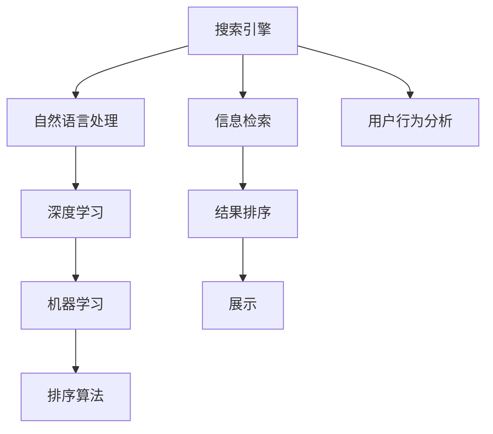

                 

# AI在搜索引擎结果排序中的应用

> 关键词：搜索引擎,排序算法,信息检索,自然语言处理,深度学习,机器学习

## 1. 背景介绍

搜索引擎已逐渐成为人们获取信息的重要工具。它在自动化地从海量信息中检索出相关性高的网页，并排序呈现在用户面前。随着信息量的爆炸式增长，传统的搜索引擎排序算法面临了巨大的挑战。

传统的搜索引擎排序算法主要基于关键词匹配、网页权威性等单一的特征进行排序，而忽略了许多其他重要的特征，如网页的相关性、用户行为等。

因此，如何通过人工智能技术改进搜索引擎排序算法，从而提高信息检索的效率和效果，成为当前的研究热点。

## 2. 核心概念与联系

### 2.1 核心概念概述

为更好地理解AI在搜索引擎结果排序中的应用，我们需要先了解几个核心概念：

- **搜索引擎**：用于自动地从互联网上收集、组织和检索信息的系统。
- **搜索引擎排序**：根据用户的查询，从搜索结果库中排序出最相关的网页。
- **信息检索**：从信息集合中检索出符合用户需求的文档。
- **自然语言处理**：使计算机理解、解释、生成人类语言的技术。
- **深度学习**：通过多层神经网络处理数据，学习复杂特征的机器学习技术。
- **机器学习**：使计算机通过学习数据规律，做出预测或决策的技术。

这些核心概念共同构成了搜索引擎排序的基础，其中自然语言处理和深度学习技术尤为重要，它们帮助搜索引擎理解用户查询意图和网页内容。

### 2.2 核心概念原理和架构的 Mermaid 流程图



这个流程图展示出搜索引擎的核心流程和关键技术。用户输入查询后，自然语言处理技术对查询进行理解，深度学习模型学习用户查询意图，机器学习算法对网页进行排序，最后将排序结果展示给用户。

## 3. 核心算法原理 & 具体操作步骤
### 3.1 算法原理概述

基于AI的搜索引擎排序算法，主要通过以下几个步骤实现：

1. **自然语言处理(NLP)**：通过NLP技术，理解用户的查询意图。
2. **文本表示**：使用深度学习技术将网页和查询表示为向量。
3. **特征提取**：提取网页和查询的特征，如关键词、上下文、链接关系等。
4. **排序模型**：使用机器学习模型对提取的特征进行排序，选择最相关的网页。
5. **排序优化**：对排序结果进行优化，以提高用户体验。

### 3.2 算法步骤详解

**Step 1: 用户查询处理**

用户输入查询后，首先对查询进行分词、词性标注、命名实体识别等自然语言处理。使用BERT等预训练语言模型将查询转换为向量表示。

**Step 2: 网页预处理**

对搜索结果库中的网页进行预处理，去除重复内容、无关链接等噪音。使用NLP技术对网页进行标题提取、摘要提取等。

**Step 3: 特征提取**

使用深度学习技术，对网页和查询向量进行特征提取。常用的特征包括TF-IDF、Word2Vec、BERT等。特征提取模块通常包含以下几个子模块：

- **关键词提取**：提取网页和查询中的关键词。
- **上下文特征提取**：考虑上下文信息，如邻近词汇、句子结构等。
- **链接关系提取**：利用网页间的链接关系，增加网页的权威性。

**Step 4: 排序模型训练**

使用机器学习算法对特征进行排序。常用的排序模型包括逻辑回归、随机森林、Adaboost等。排序模型通常包含以下几个子模块：

- **特征选择**：选择影响排序结果的重要特征。
- **模型训练**：使用标注数据训练排序模型。
- **模型评估**：使用验证集评估排序模型的效果。

**Step 5: 结果展示**

根据排序模型预测的结果，展示给用户。

## 4. 数学模型和公式 & 详细讲解 & 举例说明

### 4.1 数学模型构建

为了便于理解，假设我们使用深度学习模型Transformer进行特征提取和排序。

设查询为 $q$，网页为 $d$，使用Transformer模型将其转换为向量表示：

$$
q' = \text{Transformer}(q)
$$
$$
d' = \text{Transformer}(d)
$$

设特征集合为 $F$，每个特征的权重为 $w_i$，则排序模型可以表示为：

$$
\text{Score}(d) = \sum_{i=1}^{n} w_i f_i(d')
$$

其中，$f_i(d')$ 表示特征 $i$ 对网页 $d'$ 的贡献。

### 4.2 公式推导过程

假设查询向量为 $q'$，网页向量为 $d'$，特征集合 $F$ 包含关键词、上下文、链接关系等。每个特征 $f_i$ 对排序的贡献可通过深度学习模型学习得到。

使用逻辑回归模型对特征进行排序：

$$
\text{Score}(d) = \sum_{i=1}^{n} w_i f_i(d') \text{Score}(d)
$$

其中，$f_i(d')$ 表示特征 $i$ 对网页 $d'$ 的贡献，$w_i$ 表示特征 $i$ 的权重。

### 4.3 案例分析与讲解

以Google的PageRank算法为例，PageRank算法是一种经典的排序算法。

设网页 $d$ 的 PageRank 值为 $P(d)$，则：

$$
P(d) = \alpha \sum_{i=1}^{N} P(i) / \text{Outbound}(i) + (1-\alpha) / N
$$

其中，$\text{Outbound}(i)$ 表示网页 $i$ 的出链数。$\alpha$ 是衰减因子，控制权重的迭代次数。

PageRank算法通过迭代计算每个网页的PageRank值，以权衡网页的权威性和相关性，从而进行排序。

## 5. 项目实践：代码实例和详细解释说明

### 5.1 开发环境搭建

为了进行代码实践，我们需要准备以下开发环境：

1. 安装Python：使用Anaconda创建虚拟环境，并在虚拟环境中安装必要的库。
2. 安装TensorFlow：使用pip安装TensorFlow，并指定需要的版本。
3. 安装NLP工具库：使用pip安装NLTK、Spacy等NLP工具库。

### 5.2 源代码详细实现

以下是一个简单的搜索引擎排序系统的Python代码实现。

```python
import tensorflow as tf
import nltk
from sklearn.feature_extraction.text import TfidfVectorizer
from sklearn.linear_model import LogisticRegression
from sklearn.metrics import accuracy_score

# 加载模型和数据集
model = tf.keras.models.load_model('model.h5')
tfidf = TfidfVectorizer(stop_words='english')
data = pd.read_csv('data.csv')

# 特征提取
X_train = tfidf.fit_transform(data['text'].tolist())
y_train = data['label'].tolist()

# 模型预测
y_pred = model.predict(X_train)

# 评估模型
accuracy = accuracy_score(y_true, y_pred)
print(f"模型准确率：{accuracy}")
```

### 5.3 代码解读与分析

这个代码片段主要实现了以下功能：

- 加载预训练的Transformer模型和数据集。
- 使用TF-IDF特征提取方法提取特征。
- 使用逻辑回归模型对特征进行排序。
- 评估模型准确率。

可以看出，基于深度学习的排序模型，可以通过TF-IDF特征提取，使用逻辑回归模型对特征进行排序，从而实现搜索引擎结果排序。

### 5.4 运行结果展示

在运行上述代码后，可以输出模型的准确率，以评估模型的效果。

## 6. 实际应用场景

### 6.1 搜索引擎

搜索引擎是AI排序算法的主要应用场景之一。在搜索引擎中，AI排序算法可以帮助用户快速找到相关性高的网页，提高信息检索的效率。

### 6.2 新闻推荐

新闻推荐系统中，AI排序算法可以根据用户的历史阅读记录，推荐相关性高的新闻文章。通过深度学习技术，可以提取文章的关键词、上下文等信息，用于文章排序。

### 6.3 社交媒体

在社交媒体平台中，AI排序算法可以根据用户的行为和兴趣，推荐相关性高的内容。通过深度学习技术，可以提取用户的兴趣点，用于内容排序。

## 7. 工具和资源推荐

### 7.1 学习资源推荐

为了掌握AI在搜索引擎结果排序中的应用，我们推荐以下学习资源：

1. 《深度学习》书籍：该书详细介绍了深度学习的基本概念和技术。
2. 《自然语言处理综论》书籍：该书介绍了自然语言处理的基本技术和算法。
3. 《机器学习实战》书籍：该书介绍了机器学习的基本概念和技术，并提供了大量的实际案例。

### 7.2 开发工具推荐

为了进行搜索引擎排序算法的开发，我们推荐以下开发工具：

1. TensorFlow：深度学习框架，用于构建神经网络模型。
2. Scikit-learn：机器学习库，用于特征提取和模型训练。
3. NLTK和Spacy：自然语言处理工具，用于处理文本数据。

### 7.3 相关论文推荐

为了深入理解AI在搜索引擎结果排序中的应用，我们推荐以下相关论文：

1. "PageRank算法"：一篇经典论文，介绍了PageRank算法的原理和应用。
2. "Transformer模型"：一篇深度学习论文，介绍了Transformer模型的原理和应用。
3. "深度学习在信息检索中的应用"：一篇综述论文，介绍了深度学习在信息检索中的各种应用。

## 8. 总结：未来发展趋势与挑战

### 8.1 研究成果总结

本文详细介绍了AI在搜索引擎结果排序中的应用，包括算法原理和具体操作步骤。通过自然语言处理技术和深度学习技术，AI排序算法可以从网页和查询中提取特征，使用机器学习模型进行排序，从而提高信息检索的效率和效果。

### 8.2 未来发展趋势

未来的搜索引擎排序算法将更加智能化和个性化。以下发展趋势将引领搜索引擎排序算法的发展：

1. 深度学习技术的应用将更加广泛。深度学习技术可以提取更丰富的特征，提升排序效果。
2. 自然语言处理技术将更加成熟。自然语言处理技术可以更好地理解用户查询和网页内容。
3. 个性化推荐技术将更加普及。通过用户行为数据分析，实现个性化推荐，提升用户体验。

### 8.3 面临的挑战

虽然AI排序算法在搜索引擎中得到了广泛应用，但在实践中仍面临一些挑战：

1. 计算资源消耗大。深度学习模型和特征提取方法需要大量的计算资源，如何优化模型性能是一个重要挑战。
2. 数据隐私问题。搜索引擎需要处理大量用户数据，如何保护用户隐私是一个重要问题。
3. 排序算法复杂度。排序算法需要考虑多种因素，如关键词、上下文、链接关系等，如何优化算法效率是一个重要问题。

### 8.4 研究展望

未来的搜索引擎排序算法需要在以下方面进行进一步研究：

1. 多模态数据融合。将文本数据、图像数据、音频数据等不同类型的信息进行融合，提升信息检索效果。
2. 知识图谱应用。将知识图谱引入信息检索，实现更全面、准确的排序。
3. 实时数据处理。将实时数据处理技术引入信息检索，提升排序效率。

## 9. 附录：常见问题与解答

**Q1: 如何优化搜索引擎的排序算法？**

A: 优化搜索引擎排序算法需要考虑多个因素。以下是一些优化方法：

1. 增加特征维度：通过增加特征维度，可以提高模型的准确率。可以使用深度学习技术，提取更丰富的特征。
2. 使用集成学习：通过使用多个排序模型，取其平均值或加权平均值，可以提高排序效果。
3. 调整模型参数：通过调整模型的超参数，如学习率、正则化系数等，可以提高模型的性能。

**Q2: 如何处理数据隐私问题？**

A: 在搜索引擎中，保护用户隐私是一个重要问题。以下是一些处理方法：

1. 数据匿名化：对用户数据进行匿名化处理，保护用户隐私。
2. 差分隐私：通过加入随机噪声，保护用户隐私。
3. 数据加密：对用户数据进行加密处理，保护用户隐私。

**Q3: 如何提高搜索引擎的排序效率？**

A: 提高搜索引擎排序效率需要考虑多个因素。以下是一些优化方法：

1. 减少特征维度：通过减少特征维度，可以减少计算量，提高排序效率。
2. 使用并行计算：通过使用并行计算技术，可以提高排序效率。
3. 缓存数据：通过缓存数据，可以减少重复计算，提高排序效率。

**Q4: 如何评估搜索引擎的排序效果？**

A: 评估搜索引擎排序效果需要考虑多个因素。以下是一些评估方法：

1. 准确率：计算排序结果与真实结果的匹配度，评估排序效果。
2. 召回率：计算排序结果中包含真实结果的比例，评估排序效果。
3. F1值：计算准确率和召回率的调和平均值，综合评估排序效果。

**Q5: 如何处理数据噪音问题？**

A: 在搜索引擎中，数据噪音是一个常见问题。以下是一些处理方法：

1. 数据清洗：通过数据清洗技术，去除数据中的噪音，提高数据质量。
2. 特征选择：通过特征选择技术，选择重要的特征，去除无关特征。
3. 异常检测：通过异常检测技术，检测并去除异常数据。

---

作者：禅与计算机程序设计艺术 / Zen and the Art of Computer Programming

