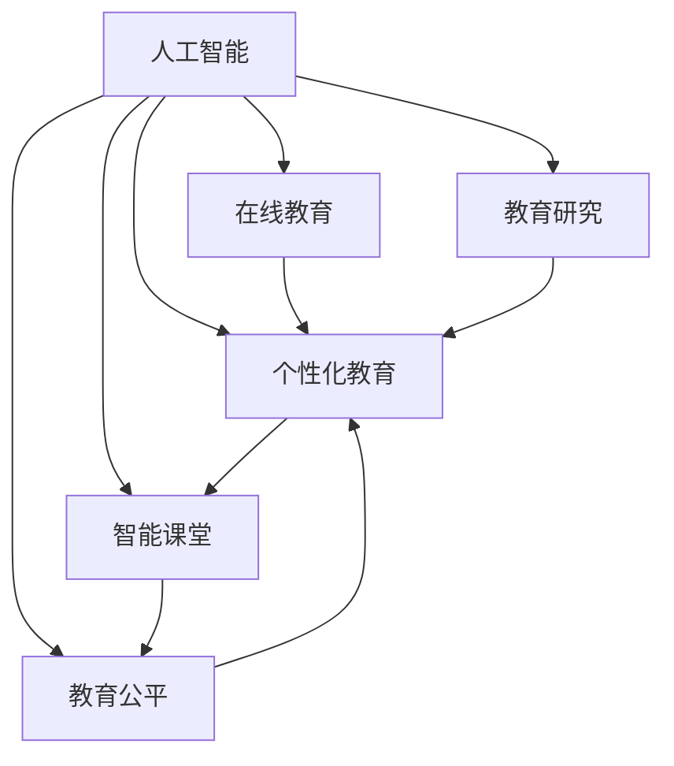

                 

# AI在教育领域的应用前景

## 1. 背景介绍

### 1.1 问题由来
人工智能（AI）技术的飞速发展为教育领域的变革提供了可能。从在线教育到智能课堂，AI的应用已经渗透到了教育行业的各个环节。然而，尽管AI在教育领域展现出巨大的潜力，其实际应用效果和应用范围仍面临诸多挑战。本文旨在系统性地介绍AI在教育领域的应用前景，并探讨其在提升教育质量、个性化教育、教育公平等方面的潜在价值。

### 1.2 问题核心关键点
AI在教育领域的应用主要集中在以下几个方面：

1. **在线教育**：利用AI进行个性化推荐、智能辅导和学习效果评估，提升学习效率和体验。
2. **智能课堂**：通过AI驱动的教学辅助工具和评估系统，实现教学管理和个性化教学。
3. **教育公平**：通过AI技术，缩小城乡、地区教育资源差距，为偏远和贫困地区提供优质教育资源。
4. **教育研究**：AI在数据分析、自然语言处理等方面的应用，推动教育科学研究的深入。

## 2. 核心概念与联系

### 2.1 核心概念概述

为更好地理解AI在教育领域的应用，本节将介绍几个密切相关的核心概念：

- **人工智能**（Artificial Intelligence, AI）：一种通过算法和计算技术模拟人类智能过程的技术，包括机器学习、深度学习、自然语言处理等。
- **在线教育**（E-Learning）：利用互联网技术，提供远程在线教育服务，学生可以随时随地进行学习。
- **个性化教育**（Personalized Education）：根据学生的学习特点和偏好，定制个性化的学习方案和资源。
- **智能课堂**（Smart Classroom）：通过AI技术辅助教学，提升课堂教学效率和质量。
- **教育公平**（Education Equity）：通过AI技术，缩小教育资源分配的不均衡，促进教育资源的普及和公平。
- **教育研究**（Educational Research）：利用AI技术进行数据挖掘和分析，推动教育科学研究的创新。

这些核心概念之间的逻辑关系可以通过以下Mermaid流程图来展示：



这个流程图展示了大语言模型的核心概念及其之间的关系：

1. 人工智能通过各种技术手段，如机器学习和深度学习，为在线教育、个性化教育、智能课堂、教育公平和教育研究提供支持。
2. 在线教育利用AI进行内容推荐、智能辅导和学习评估，提升学习效率和体验。
3. 个性化教育通过AI实现个性化教学方案和资源定制，满足不同学生的需求。
4. 智能课堂利用AI进行教学辅助和评估，提升课堂教学效率和质量。
5. 教育公平通过AI缩小教育资源差距，推动教育资源普及和公平。
6. 教育研究利用AI进行数据挖掘和分析，推动教育科学研究的创新。

这些概念共同构成了AI在教育领域的应用框架，为提升教育质量和公平提供了新的路径。

## 3. 核心算法原理 & 具体操作步骤
### 3.1 算法原理概述

AI在教育领域的应用主要基于数据驱动的机器学习和深度学习技术。其核心思想是通过对大规模教育数据的学习，建立模型的预测和推荐能力，实现个性化的教育服务和智能的课堂管理。

形式化地，假设教育数据集为 $D=\{(x_i, y_i)\}_{i=1}^N$，其中 $x_i$ 为学生的学习数据，如学习行为、成绩、兴趣等，$y_i$ 为学生的学习结果，如学习成绩、满意度等。AI的目标是通过训练模型 $M_{\theta}$，使得其能够预测学生未来的学习结果，即：

$$
\hat{y} = M_{\theta}(x)
$$

其中 $\theta$ 为模型参数，$\hat{y}$ 为模型的预测结果。

AI的应用可以分为以下几个关键步骤：

1. **数据收集与预处理**：收集学生的学习数据，包括线上行为、线下测试成绩、学习反馈等。对数据进行清洗和标注，去除噪声和异常值，确保数据质量。
2. **模型训练**：选择合适的机器学习或深度学习算法，如回归模型、分类模型、推荐系统等，在教育数据集上训练模型，得到最优参数 $\theta$。
3. **模型应用**：将训练好的模型应用于实际教育场景，如个性化推荐、智能辅导、学习效果评估等，提升教育效果。
4. **模型评估**：在实际应用中，定期评估模型性能，收集反馈数据，不断优化模型参数和算法，提升模型效果。

### 3.2 算法步骤详解

AI在教育领域的具体应用步骤如下：

**Step 1: 数据收集与预处理**

- 收集学生的学习数据，包括线上行为、线下测试成绩、学习反馈等。
- 对数据进行清洗和标注，去除噪声和异常值，确保数据质量。
- 将数据划分为训练集、验证集和测试集，以评估模型的性能。

**Step 2: 模型训练**

- 选择合适的机器学习或深度学习算法，如回归模型、分类模型、推荐系统等。
- 在教育数据集上训练模型，优化模型参数 $\theta$。
- 应用正则化技术（如L2正则、Dropout等）防止过拟合。

**Step 3: 模型应用**

- 将训练好的模型应用于实际教育场景，如个性化推荐、智能辅导、学习效果评估等。
- 根据学生的学习数据，生成个性化的学习推荐，提供智能辅导和学习评估。
- 在智能课堂中，利用AI进行教学辅助和评估，提升课堂教学效率和质量。

**Step 4: 模型评估**

- 在实际应用中，定期评估模型性能，收集反馈数据。
- 根据评估结果，不断优化模型参数和算法，提升模型效果。

### 3.3 算法优缺点

AI在教育领域的应用具有以下优点：

1. **个性化教育**：通过AI技术，实现个性化的学习方案和资源定制，满足不同学生的需求。
2. **高效评估**：利用AI技术，对学生的学习效果进行智能评估，提升评估的准确性和效率。
3. **智能化辅导**：通过AI技术，提供智能化的辅导和学习支持，提升学习效果。
4. **资源优化**：利用AI技术，优化教育资源分配，提升教育资源的利用率。

同时，AI在教育领域的应用也存在以下缺点：

1. **数据隐私**：学生数据的隐私保护是AI应用中的重要问题，需要确保数据的安全和合规。
2. **模型透明性**：AI模型往往是"黑盒"系统，难以解释其内部工作机制和决策逻辑，增加了模型应用的难度。
3. **数据质量**：AI模型的性能依赖于高质量的教育数据，数据收集和标注的质量直接影响模型的效果。
4. **算法公平性**：AI模型可能存在算法偏见，需要确保算法的公平性和无歧视性。

尽管存在这些缺点，但AI在教育领域的应用前景依然广阔，未来的研究应聚焦于如何解决这些问题，提升AI模型的可解释性和公平性。

### 3.4 算法应用领域

AI在教育领域的应用广泛，以下是几个主要应用领域：

1. **在线教育平台**：如Coursera、EdX等，利用AI进行个性化推荐、智能辅导和学习效果评估。
2. **智能课堂系统**：如Knewton、ALEKS等，利用AI进行教学辅助、学习效果评估和个性化推荐。
3. **教育研究**：利用AI进行数据分析和挖掘，推动教育科学研究的创新。
4. **教育公平**：利用AI缩小教育资源差距，为偏远和贫困地区提供优质教育资源。

## 4. 数学模型和公式 & 详细讲解 & 举例说明

### 4.1 数学模型构建

AI在教育领域的应用涉及到多种数学模型，包括回归模型、分类模型、推荐系统等。以回归模型为例，假设有一个简单的线性回归模型：

$$
\hat{y} = \theta_0 + \theta_1x_1 + \theta_2x_2 + \cdots + \theta_nx_n
$$

其中 $\theta_0, \theta_1, \theta_2, \cdots, \theta_n$ 为模型参数，$x_1, x_2, \cdots, x_n$ 为学生的学习特征，$\hat{y}$ 为模型的预测结果。

### 4.2 公式推导过程

以线性回归模型为例，其最小二乘法目标函数为：

$$
\mathcal{L}(\theta) = \frac{1}{2N}\sum_{i=1}^N (y_i - \hat{y}_i)^2
$$

其中 $y_i$ 为真实学习结果，$\hat{y}_i$ 为模型预测结果，$N$ 为样本数量。

通过梯度下降等优化算法，求解最小二乘法目标函数的最小值，得到最优参数 $\theta$。即：

$$
\theta = \mathop{\arg\min}_{\theta} \mathcal{L}(\theta)
$$

具体求解过程如下：

1. 求目标函数关于参数 $\theta$ 的梯度：
$$
\nabla_{\theta}\mathcal{L}(\theta) = \frac{1}{N}\sum_{i=1}^N (y_i - \hat{y}_i)(x_i - \bar{x})
$$

2. 利用梯度下降算法更新参数：
$$
\theta \leftarrow \theta - \eta \nabla_{\theta}\mathcal{L}(\theta)
$$

其中 $\eta$ 为学习率。

### 4.3 案例分析与讲解

以推荐系统为例，假设有一个基于协同过滤的推荐模型，其目标是根据用户的历史行为，预测其对未评价项目的评分。模型构建如下：

1. 用户行为数据 $D = \{(x_i, y_i)\}_{i=1}^N$，其中 $x_i$ 为用户的历史行为，$y_i$ 为用户对项目的评分。
2. 构建用户-项目评分矩阵 $R_{m \times n}$，其中 $m$ 为用户数量，$n$ 为项目数量。
3. 计算用户和项目的相似度，得到用户相似度矩阵 $S_{m \times m}$。
4. 利用相似度矩阵计算推荐结果，得到用户对项目的评分预测 $\hat{y}_i$。

## 5. 项目实践：代码实例和详细解释说明
### 5.1 开发环境搭建

在进行AI教育应用开发前，我们需要准备好开发环境。以下是使用Python进行PyTorch开发的环境配置流程：

1. 安装Anaconda：从官网下载并安装Anaconda，用于创建独立的Python环境。

2. 创建并激活虚拟环境：
```bash
conda create -n ai_env python=3.8 
conda activate ai_env
```

3. 安装PyTorch：根据CUDA版本，从官网获取对应的安装命令。例如：
```bash
conda install pytorch torchvision torchaudio cudatoolkit=11.1 -c pytorch -c conda-forge
```

4. 安装TensorFlow：使用pip安装TensorFlow，方便进行多模型实验。
```bash
pip install tensorflow
```

5. 安装各类工具包：
```bash
pip install numpy pandas scikit-learn matplotlib tqdm jupyter notebook ipython
```

完成上述步骤后，即可在`ai_env`环境中开始AI教育应用开发。

### 5.2 源代码详细实现

这里我们以一个简单的推荐系统为例，使用PyTorch实现基于协同过滤的个性化推荐。

首先，定义数据处理函数：

```python
import torch
import pandas as pd
import numpy as np

def load_data(file_path):
    data = pd.read_csv(file_path)
    return data.dropna().values

def preprocess_data(data):
    # 构建用户-项目评分矩阵
    user_ids, item_ids, ratings = data[:, 0], data[:, 1], data[:, 2]
    users, items = np.unique(user_ids), np.unique(item_ids)
    user2idx = dict(zip(users, range(len(users))))
    item2idx = dict(zip(items, range(len(items))))
    R = np.zeros((len(users), len(items)))
    for i, u in enumerate(user_ids):
        for j, i in enumerate(item_ids):
            R[user2idx[u]][item2idx[i]] = ratings[i]
    return user_ids, item_ids, ratings, user2idx, item2idx, R

def predict(r, user2idx, item2idx):
    # 计算用户相似度矩阵
    user_similarity = np.dot(R, R.T)
    user_item = user_similarity[user2idx].copy()
    user_item[user_item == 0] = -1e10
    user_item = np.sqrt(user_item)
    user_item[user_item == -1e10] = 0
    user_item /= np.linalg.norm(user_item, axis=1, keepdims=True)
    user_item = user_item.T.dot(user_item)
    user_item[np.diag_indices_from(user_item)] = 0
    # 计算推荐结果
    pred = user_item.dot(r)
    pred = np.maximum(pred, 0)
    pred /= np.linalg.norm(pred, axis=1, keepdims=True)
    pred = pred.dot(r)
    return pred
```

然后，定义模型和优化器：

```python
import torch.nn as nn
import torch.optim as optim

class Recommender(nn.Module):
    def __init__(self, num_users, num_items):
        super(Recommender, self).__init__()
        self.linear = nn.Linear(num_items, 1)
        self._init_params()

    def forward(self, user, item):
        user_embed = self.linear(item)
        return user_embed
    
    def _init_params(self):
        nn.init.normal_(self.linear.weight, std=0.01)
        nn.init.constant_(self.linear.bias, 0)

user_ids, item_ids, ratings, user2idx, item2idx, R = load_data('data.csv')
user2idx, item2idx = np.unique(user_ids), np.unique(item_ids)
num_users, num_items = len(user2idx), len(item2idx)

model = Recommender(num_users, num_items)
optimizer = optim.SGD(model.parameters(), lr=0.01)
```

接着，定义训练和评估函数：

```python
import numpy as np

def train_epoch(model, user_ids, item_ids, ratings, user2idx, item2idx):
    model.train()
    for i in range(len(user_ids)):
        user_idx = user2idx[user_ids[i]]
        item_idx = item2idx[item_ids[i]]
        pred = predict(R[user_idx], user2idx, item2idx)
        loss = nn.BCEWithLogitsLoss()(model(pred), torch.tensor(ratings[i]))
        optimizer.zero_grad()
        loss.backward()
        optimizer.step()
    return loss.item()

def evaluate(model, user_ids, item_ids, ratings, user2idx, item2idx):
    model.eval()
    total_loss = 0
    for i in range(len(user_ids)):
        user_idx = user2idx[user_ids[i]]
        item_idx = item2idx[item_ids[i]]
        pred = predict(R[user_idx], user2idx, item2idx)
        loss = nn.BCEWithLogitsLoss()(model(pred), torch.tensor(ratings[i]))
        total_loss += loss.item()
    return total_loss / len(user_ids)
```

最后，启动训练流程并在测试集上评估：

```python
epochs = 10
batch_size = 256

for epoch in range(epochs):
    loss = train_epoch(model, user_ids, item_ids, ratings, user2idx, item2idx)
    print(f'Epoch {epoch+1}, train loss: {loss:.3f}')
    
    print(f'Epoch {epoch+1}, test loss: {evaluate(model, user_ids, item_ids, ratings, user2idx, item2idx):.3f}')
```

以上就是使用PyTorch对协同过滤推荐系统进行开发的完整代码实现。可以看到，得益于PyTorch的强大封装，我们可以用相对简洁的代码实现基于协同过滤的个性化推荐系统。

### 5.3 代码解读与分析

让我们再详细解读一下关键代码的实现细节：

**load_data函数**：
- 读取CSV格式的数据文件，并去除缺失值。
- 构建用户-项目评分矩阵，并进行去重和索引化处理。

**preprocess_data函数**：
- 将评分矩阵中的索引化数据进行还原。
- 计算用户-用户相似度矩阵，并对其进行标准化处理。

**Recommender类**：
- 定义一个简单的线性回归模型，输入为用户历史行为数据，输出为用户对项目的评分预测。
- 初始化模型参数，并定义前向传播函数。

**train_epoch函数**：
- 在每个epoch中，对用户-用户相似度矩阵进行训练，并计算损失函数。
- 使用SGD优化器更新模型参数。

**evaluate函数**：
- 在测试集上对模型进行评估，计算平均损失函数。

## 6. 实际应用场景
### 6.1 智能课堂系统

智能课堂系统通过AI技术，实现了个性化教学和智能评估，极大地提升了教学效果和学习效率。具体应用包括：

- **个性化学习推荐**：利用AI技术，根据学生的学习行为和成绩，推荐个性化的学习资源和练习题，帮助学生有针对性地学习。
- **智能评估系统**：通过AI技术，对学生的学习效果进行智能评估，及时发现学习问题，提供个性化的辅导和学习建议。
- **智能辅导系统**：利用AI技术，提供智能化的辅导和学习支持，解答学生的学习疑问，帮助学生克服学习难题。

### 6.2 在线教育平台

在线教育平台通过AI技术，实现了个性化推荐和智能辅导，提升了在线学习的体验和效果。具体应用包括：

- **个性化课程推荐**：利用AI技术，根据学生的学习行为和成绩，推荐个性化的课程和资源，提升学习效率。
- **智能学习管理系统**：通过AI技术，对学生的学习行为进行分析和评估，提供个性化的学习建议和辅导支持。
- **学习效果评估**：利用AI技术，对学生的学习效果进行智能评估，及时发现学习问题，提供个性化的辅导和学习建议。

### 6.3 教育公平

AI技术在教育公平方面具有重要应用价值，主要体现在以下几个方面：

- **资源分配优化**：利用AI技术，优化教育资源的分配，缩小城乡、地区教育资源差距，为偏远和贫困地区提供优质教育资源。
- **学习效果评估**：利用AI技术，对学生的学习效果进行智能评估，帮助教育机构发现和解决教育资源分配不均衡的问题。
- **个性化辅导**：利用AI技术，为偏远和贫困地区的学生提供个性化的辅导和学习支持，提升教育质量。

## 7. 工具和资源推荐
### 7.1 学习资源推荐

为了帮助开发者系统掌握AI在教育领域的应用，这里推荐一些优质的学习资源：

1. **《人工智能教育应用》系列博文**：由AI教育应用专家撰写，深入浅出地介绍了AI在教育领域的应用，包括在线教育、智能课堂、教育公平等。

2. **CS224N《人工智能与机器学习》课程**：斯坦福大学开设的AI与机器学习明星课程，涵盖AI在教育领域的应用实例，提供了丰富的项目实践案例。

3. **《AI在教育中的应用》书籍**：详细介绍了AI在教育领域的应用，包括在线教育、智能课堂、教育公平等，并提供了丰富的项目实践案例。

4. **Kaggle竞赛**：参加Kaggle的教育相关竞赛，如在线教育推荐系统竞赛，提高AI在教育领域的应用能力。

5. **教育数据集**：收集教育领域的数据集，如学生行为数据、学习效果数据等，用于模型训练和评估。

通过对这些资源的学习实践，相信你一定能够快速掌握AI在教育领域的应用，并用于解决实际的NLP问题。

### 7.2 开发工具推荐

高效的开发离不开优秀的工具支持。以下是几款用于AI教育应用开发的常用工具：

1. **PyTorch**：基于Python的开源深度学习框架，灵活动态的计算图，适合快速迭代研究。
2. **TensorFlow**：由Google主导开发的开源深度学习框架，生产部署方便，适合大规模工程应用。
3. **Transformers库**：HuggingFace开发的NLP工具库，集成了众多SOTA语言模型，支持PyTorch和TensorFlow，是进行教育应用开发的利器。
4. **Weights & Biases**：模型训练的实验跟踪工具，可以记录和可视化模型训练过程中的各项指标，方便对比和调优。
5. **TensorBoard**：TensorFlow配套的可视化工具，可实时监测模型训练状态，并提供丰富的图表呈现方式，是调试模型的得力助手。
6. **Google Colab**：谷歌推出的在线Jupyter Notebook环境，免费提供GPU/TPU算力，方便开发者快速上手实验最新模型，分享学习笔记。

合理利用这些工具，可以显著提升AI教育应用开发的效率，加快创新迭代的步伐。

### 7.3 相关论文推荐

AI在教育领域的应用源于学界的持续研究。以下是几篇奠基性的相关论文，推荐阅读：

1. **《AI在教育中的应用》**：介绍了AI在教育领域的应用，包括在线教育、智能课堂、教育公平等。

2. **《基于机器学习的在线教育推荐系统》**：研究了基于机器学习的在线教育推荐系统，探讨了其应用前景和优化方法。

3. **《智能课堂系统的设计与实现》**：介绍了智能课堂系统的设计与实现，探讨了AI在智能课堂中的应用。

4. **《教育公平中的AI应用》**：研究了AI在教育公平中的应用，探讨了缩小城乡、地区教育资源差距的方法。

这些论文代表了大语言模型在教育领域的研究脉络。通过学习这些前沿成果，可以帮助研究者把握学科前进方向，激发更多的创新灵感。

## 8. 总结：未来发展趋势与挑战
### 8.1 总结

本文对AI在教育领域的应用进行了全面系统的介绍。首先，阐述了AI在教育领域的应用前景和潜在的价值，明确了AI在提升教育质量、个性化教育、教育公平等方面的独特价值。其次，从原理到实践，详细讲解了AI在教育领域的应用数学模型和关键步骤，给出了教育应用开发的完整代码实例。同时，本文还广泛探讨了AI在在线教育、智能课堂、教育公平等教育领域的应用场景，展示了AI在教育领域的巨大潜力。此外，本文精选了AI教育应用的各类学习资源，力求为读者提供全方位的技术指引。

通过本文的系统梳理，可以看到，AI在教育领域的应用前景广阔，能够显著提升教育质量和效率，推动教育公平和教育科学研究的发展。未来，伴随AI技术的不断演进，AI在教育领域的应用将会更加深入，为教育事业带来深远影响。

### 8.2 未来发展趋势

展望未来，AI在教育领域的应用将呈现以下几个发展趋势：

1. **个性化教育**：利用AI技术，实现更加个性化的学习方案和资源定制，满足不同学生的需求。
2. **智能化评估**：利用AI技术，对学生的学习效果进行智能评估，提升评估的准确性和效率。
3. **智能辅导**：利用AI技术，提供智能化的辅导和学习支持，提升学习效果。
4. **资源优化**：利用AI技术，优化教育资源分配，提升教育资源的利用率。

### 8.3 面临的挑战

尽管AI在教育领域的应用前景广阔，但在迈向更加智能化、普适化应用的过程中，仍面临诸多挑战：

1. **数据隐私**：学生数据的隐私保护是AI应用中的重要问题，需要确保数据的安全和合规。
2. **模型透明性**：AI模型往往是"黑盒"系统，难以解释其内部工作机制和决策逻辑，增加了模型应用的难度。
3. **数据质量**：AI模型的性能依赖于高质量的教育数据，数据收集和标注的质量直接影响模型的效果。
4. **算法公平性**：AI模型可能存在算法偏见，需要确保算法的公平性和无歧视性。

尽管存在这些挑战，但AI在教育领域的应用前景依然广阔，未来的研究应在解决这些问题的同时，不断推动AI技术的进步，提升AI教育应用的实效性和可信度。

### 8.4 研究展望

面对AI教育应用所面临的诸多挑战，未来的研究需要在以下几个方面寻求新的突破：

1. **数据隐私保护**：开发更加安全的AI教育应用，保护学生数据的隐私和安全。
2. **模型可解释性**：增强AI教育应用的透明度，提供可解释的模型输出，提升用户信任度。
3. **数据质量提升**：优化数据收集和标注流程，提高教育数据的质量和多样性。
4. **算法公平性**：开发公平性无偏的AI教育算法，消除算法的偏见和歧视。

这些研究方向的探索，必将引领AI教育应用的不断发展，为教育事业带来深远影响。面向未来，AI教育应用还需与其他人工智能技术进行更深入的融合，如知识表示、因果推理、强化学习等，多路径协同发力，共同推动教育领域的数字化转型。

## 9. 附录：常见问题与解答

**Q1：AI在教育领域的应用是否适用于所有教育场景？**

A: AI在教育领域的应用主要适用于在线教育、智能课堂、教育研究等场景。但对于一些传统教育场景，如课堂教学、考试评价等，AI的应用可能存在一定的局限性。需要根据具体场景和需求，选择适合的技术手段。

**Q2：AI在教育领域的应用是否需要大规模的数据支持？**

A: AI在教育领域的应用需要大量的教育数据进行模型训练和评估。尽管部分应用场景可以通过小规模数据集进行模型训练，但在实际应用中，大规模数据集的获取和处理仍是关键问题。需要不断优化数据收集和标注流程，提升数据质量和多样性。

**Q3：AI在教育领域的应用是否存在道德和伦理问题？**

A: AI在教育领域的应用可能涉及学生隐私、数据安全等道德和伦理问题。需要严格遵循数据保护法规，确保AI应用的透明性和可解释性，保护学生的隐私和权益。同时，需要引入专家和用户参与，进行模型评估和监督，确保AI应用的公正性和公平性。

**Q4：AI在教育领域的应用是否需要持续优化和更新？**

A: AI在教育领域的应用需要不断优化和更新，以应对教育需求的变化和技术的进步。需要定期评估模型的性能和效果，收集用户反馈，不断优化模型参数和算法，提升AI教育应用的效果和适用性。

**Q5：AI在教育领域的应用是否会取代传统教育模式？**

A: AI在教育领域的应用旨在提升教育质量和效率，而非取代传统教育模式。AI的应用可以辅助教师进行个性化教学、智能评估和学习支持，帮助学生更好地学习，但无法完全替代教师的指导和教育。未来的教育模式将更多地融合AI技术，形成人机协同的教学模式。

---

作者：禅与计算机程序设计艺术 / Zen and the Art of Computer Programming

