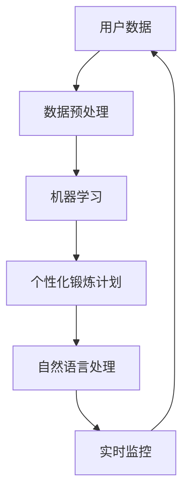

                 

# AI在虚拟健身教练中的应用：个性化锻炼计划

## 1. 背景介绍

### 1.1 问题由来

随着科技的不断进步，人工智能（AI）在各个领域的应用日益普及，虚拟健身教练作为AI的一个重要应用场景，正逐渐成为人们健身过程中不可或缺的一部分。相较于传统的健身方式，虚拟健身教练能够提供更加个性化、科学、便捷的健身指导，从而更好地帮助人们达到健身目标。特别是在当前的健康危机和新冠疫情背景下，居家健身成为了一种趋势，虚拟健身教练的应用需求尤为突出。

### 1.2 问题核心关键点

虚拟健身教练的核心在于能够根据用户的身体状况、健身目标和兴趣爱好，提供个性化的锻炼计划，并通过AI技术实时监控和调整锻炼内容。实现个性化锻炼计划的核心技术包括数据分析、机器学习、自然语言处理等。其中，数据分析用于提取用户的基本信息、健身数据和兴趣爱好，机器学习用于构建个性化的锻炼模型，自然语言处理用于与用户进行交互，提供个性化的健身指导和反馈。

### 1.3 问题研究意义

研究虚拟健身教练的个性化锻炼计划，对于推动AI在健身领域的应用，提升健身效果，促进健康生活方式的普及具有重要意义：

1. **提高健身效果**：根据用户的身体状况和健身目标，量身定制的锻炼计划能显著提高用户的锻炼效果和体验。
2. **降低健身门槛**：AI的介入使得健身指导更加便捷、准确，无需专业教练，用户可在家实现科学健身。
3. **个性化推荐**：通过深度学习算法，AI能根据用户的历史数据和实时反馈，不断优化锻炼计划，满足用户的个性化需求。
4. **实时监控**：AI可以实时监控用户的健身数据，如心率、步数、燃烧的卡路里等，及时调整锻炼强度和方式。
5. **增强用户体验**：自然语言处理技术使得AI能与用户进行互动，提供实时反馈和鼓励，提升用户的粘性和满意度。

## 2. 核心概念与联系

### 2.1 核心概念概述

为更好地理解虚拟健身教练的个性化锻炼计划，本节将介绍几个关键概念：

- **虚拟健身教练**：指利用AI技术，通过分析用户的身体状况、健身目标和兴趣爱好，提供个性化锻炼计划和指导的智能健身助手。
- **个性化锻炼计划**：指根据用户的身体状况、健身目标和兴趣爱好，量身定制的锻炼计划，包括锻炼类型、强度、时间和频率等。
- **机器学习**：指通过训练数据集，学习用户的行为模式和偏好，构建个性化模型，优化锻炼计划。
- **数据分析**：指对用户的身体数据、健身数据和兴趣爱好进行分析，提取有用信息。
- **自然语言处理**：指使AI能够理解和生成自然语言，与用户进行实时交互，提供个性化的健身指导。

这些核心概念之间的逻辑关系可以通过以下Mermaid流程图来展示：



这个流程图展示了大语言模型的核心概念及其之间的关系：

1. 用户数据是个性化锻炼计划的基础。
2. 数据预处理是机器学习的前提。
3. 机器学习是构建个性化锻炼模型的核心。
4. 个性化锻炼计划是最终的目标。
5. 自然语言处理是提供个性化健身指导的关键。
6. 实时监控是反馈和优化锻炼计划的基础。

这些概念共同构成了虚拟健身教练个性化锻炼计划的实现框架，使其能够根据用户的不同需求，提供科学、个性化的健身指导。

## 3. 核心算法原理 & 具体操作步骤
### 3.1 算法原理概述

虚拟健身教练的个性化锻炼计划通常基于机器学习算法，特别是深度学习模型。核心算法原理包括以下几个步骤：

1. **用户数据收集**：收集用户的身体数据、健身数据和兴趣爱好数据，如身高、体重、健康状况、运动偏好、饮食偏好等。
2. **数据预处理**：对收集的数据进行清洗、归一化和特征提取等处理，准备用于机器学习训练。
3. **机器学习训练**：使用深度学习模型（如卷积神经网络、循环神经网络等），训练个性化锻炼模型，根据用户的数据特征预测最佳的锻炼计划。
4. **个性化锻炼计划生成**：根据用户的身体状况、健身目标和兴趣爱好，生成个性化的锻炼计划，包括锻炼类型、强度、时间和频率等。
5. **自然语言处理**：将生成的个性化锻炼计划转化为自然语言描述，通过AI与用户进行实时交互，提供个性化的健身指导。
6. **实时监控与反馈**：实时监控用户的健身数据，如心率、步数、燃烧的卡路里等，根据用户的反馈动态调整锻炼计划。

### 3.2 算法步骤详解

以下是虚拟健身教练个性化锻炼计划的具体实现步骤：

#### 3.2.1 用户数据收集

首先，通过智能健身设备和APP收集用户的身体数据、健身数据和兴趣爱好数据。智能健身设备如智能手表、健身机等可以实时监测用户的身体状况，如心率、血压、步数、燃烧的卡路里等。APP则可以收集用户的运动偏好、饮食偏好、兴趣爱好等。

```python
# 示例代码：用户数据收集
import fitnessapp

# 使用智能健身设备和APP收集用户数据
user_data = fitnessapp.collect_user_data()
```

#### 3.2.2 数据预处理

对收集到的数据进行清洗、归一化和特征提取，去除噪音和异常值，准备用于机器学习训练。例如，对身高、体重等连续型数据进行标准化处理，对性别、兴趣等离散型数据进行独热编码。

```python
# 示例代码：数据预处理
from sklearn.preprocessing import StandardScaler, OneHotEncoder

# 使用标准化和独热编码等方法进行数据预处理
user_data = preprocess_data(user_data)
```

#### 3.2.3 机器学习训练

使用深度学习模型，如卷积神经网络（CNN）、循环神经网络（RNN）等，对用户数据进行训练，构建个性化锻炼模型。例如，可以使用CNN对用户的身体状况进行分类，使用RNN预测最佳的锻炼类型和强度。

```python
# 示例代码：机器学习训练
from tensorflow.keras.models import Sequential
from tensorflow.keras.layers import Conv2D, MaxPooling2D, LSTM, Dense

# 定义深度学习模型，并使用用户数据进行训练
model = Sequential()
model.add(Conv2D(...))  # 使用CNN对用户身体状况进行分类
model.add(MaxPooling2D(...))  # 对分类结果进行池化
model.add(LSTM(...))  # 使用RNN预测最佳锻炼类型和强度
model.add(Dense(...))  # 输出层进行预测
model.compile(...)
model.fit(user_data, ...)
```

#### 3.2.4 个性化锻炼计划生成

根据机器学习模型预测的最佳锻炼类型和强度，结合用户的兴趣爱好和健身目标，生成个性化的锻炼计划。例如，如果用户喜欢户外跑步，锻炼计划可以包括跑步、游泳、骑自行车等户外运动。

```python
# 示例代码：个性化锻炼计划生成
def generate_personalized_plan(user_data):
    # 根据机器学习模型预测最佳锻炼类型和强度
    plan_type, plan_intensity = predict_exercise(user_data)
    # 根据用户的兴趣爱好和健身目标，生成个性化锻炼计划
    personalized_plan = generate_plan(plan_type, plan_intensity, user_data)
    return personalized_plan
```

#### 3.2.5 自然语言处理

将生成的个性化锻炼计划转化为自然语言描述，通过AI与用户进行实时交互，提供个性化的健身指导。例如，将“跑步，中等强度，30分钟，每周3次”转化为“今天您可以进行30分钟的跑步锻炼，强度适中，建议每周进行3次”。

```python
# 示例代码：自然语言处理
from transformers import BertTokenizer, BertForSequenceClassification

# 定义自然语言处理模型，将个性化锻炼计划转化为自然语言描述
tokenizer = BertTokenizer.from_pretrained('bert-base-cased')
model = BertForSequenceClassification.from_pretrained('bert-base-cased', num_labels=len(tag2id))
# 使用自然语言处理模型生成自然语言描述
natural_language_plan = generate_natural_language_plan(personalized_plan, tokenizer, model)
```

#### 3.2.6 实时监控与反馈

实时监控用户的健身数据，如心率、步数、燃烧的卡路里等，根据用户的反馈动态调整锻炼计划。例如，如果用户的步数超过预期，可以适当增加锻炼强度，减少休息时间。

```python
# 示例代码：实时监控与反馈
def monitor_user(data):
    # 实时监控用户的健身数据
    heart_rate = data['heart_rate']
    calories_burned = data['calories_burned']
    # 根据用户的反馈动态调整锻炼计划
    if heart_rate > 180 and calories_burned > 500:
        adjust_plan(personalized_plan, 'increase_intensity')
    elif heart_rate < 100 and calories_burned < 100:
        adjust_plan(personalized_plan, 'decrease_intensity')
    else:
        adjust_plan(personalized_plan, 'maintain_intensity')
```

### 3.3 算法优缺点

虚拟健身教练的个性化锻炼计划算法具有以下优点：

1. **个性化**：根据用户的身体状况、健身目标和兴趣爱好，提供量身定制的锻炼计划，显著提高用户的锻炼效果和体验。
2. **便捷性**：AI的介入使得健身指导更加便捷，用户无需专业教练，即可在家实现科学健身。
3. **实时性**：实时监控用户的健身数据，根据用户的反馈动态调整锻炼计划，优化用户的健身效果。
4. **智能化**：自然语言处理技术使得AI能够与用户进行实时交互，提供个性化的健身指导和反馈，提升用户的粘性和满意度。

同时，该算法也存在一些局限性：

1. **数据依赖**：个性化锻炼计划的生成高度依赖于用户的数据，如果用户数据不足或失真，模型效果会受到影响。
2. **模型泛化能力**：模型在不同用户和不同场景下的泛化能力有限，需要不断更新模型以适应新的用户需求。
3. **计算资源需求**：深度学习模型的训练和实时监控需要较大的计算资源，对硬件要求较高。
4. **隐私问题**：用户数据的收集和使用需要遵循隐私保护法规，确保用户数据的安全。

尽管存在这些局限性，但虚拟健身教练的个性化锻炼计划算法依然是大数据和AI技术在健身领域的一个重要应用，具有广阔的市场前景。

### 3.4 算法应用领域

虚拟健身教练的个性化锻炼计划算法在多个领域具有广泛的应用前景：

1. **家庭健身**：通过智能健身设备和APP，结合用户的身体状况、健身目标和兴趣爱好，提供个性化的健身指导和锻炼计划。
2. **企业健康管理**：在企业内部构建虚拟健身教练系统，提升员工的健康水平和工作效率。
3. **医院康复**：为医院康复患者提供个性化的康复锻炼计划，促进患者早日康复。
4. **公共健康**：通过虚拟健身教练系统，在社区和学校推广科学健身，提升公众健康水平。

## 4. 数学模型和公式 & 详细讲解  
### 4.1 数学模型构建

本节将使用数学语言对虚拟健身教练个性化锻炼计划的数学模型进行更加严格的刻画。

记用户数据为 $D = \{(x_i, y_i)\}_{i=1}^N$，其中 $x_i$ 表示第 $i$ 个用户的身体数据、健身数据和兴趣爱好数据，$y_i$ 表示第 $i$ 个用户的健身目标和兴趣爱好。

定义机器学习模型为 $M_\theta$，其中 $\theta$ 为模型参数。假设模型 $M_\theta$ 在输入 $x$ 上的输出为 $\hat{y}=M_{\theta}(x)$，表示模型预测的锻炼类型和强度。

定义损失函数为 $\mathcal{L}(\theta)$，表示模型在训练集 $D$ 上的损失，通常使用交叉熵损失或均方误差损失。

### 4.2 公式推导过程

以下我们以二分类任务为例，推导交叉熵损失函数及其梯度的计算公式。

假设模型 $M_{\theta}$ 在输入 $x$ 上的输出为 $\hat{y}=M_{\theta}(x) \in [0,1]$，表示用户是否进行某种锻炼。真实标签 $y \in \{0,1\}$。则二分类交叉熵损失函数定义为：

$$
\ell(M_{\theta}(x),y) = -[y\log \hat{y} + (1-y)\log (1-\hat{y})]
$$

将其代入经验风险公式，得：

$$
\mathcal{L}(\theta) = -\frac{1}{N}\sum_{i=1}^N [y_i\log M_{\theta}(x_i)+(1-y_i)\log(1-M_{\theta}(x_i))]
$$

根据链式法则，损失函数对参数 $\theta_k$ 的梯度为：

$$
\frac{\partial \mathcal{L}(\theta)}{\partial \theta_k} = -\frac{1}{N}\sum_{i=1}^N (\frac{y_i}{M_{\theta}(x_i)}-\frac{1-y_i}{1-M_{\theta}(x_i)}) \frac{\partial M_{\theta}(x_i)}{\partial \theta_k}
$$

其中 $\frac{\partial M_{\theta}(x_i)}{\partial \theta_k}$ 可进一步递归展开，利用自动微分技术完成计算。

在得到损失函数的梯度后，即可带入参数更新公式，完成模型的迭代优化。重复上述过程直至收敛，最终得到适应个性化锻炼目标的最优模型参数 $\theta^*$。

## 5. 项目实践：代码实例和详细解释说明
### 5.1 开发环境搭建

在进行虚拟健身教练的个性化锻炼计划开发前，我们需要准备好开发环境。以下是使用Python进行PyTorch开发的环境配置流程：

1. 安装Anaconda：从官网下载并安装Anaconda，用于创建独立的Python环境。

2. 创建并激活虚拟环境：
```bash
conda create -n pytorch-env python=3.8 
conda activate pytorch-env
```

3. 安装PyTorch：根据CUDA版本，从官网获取对应的安装命令。例如：
```bash
conda install pytorch torchvision torchaudio cudatoolkit=11.1 -c pytorch -c conda-forge
```

4. 安装TensorFlow：
```bash
pip install tensorflow
```

5. 安装各类工具包：
```bash
pip install numpy pandas scikit-learn matplotlib tqdm jupyter notebook ipython
```

完成上述步骤后，即可在`pytorch-env`环境中开始项目实践。

### 5.2 源代码详细实现

下面我们以虚拟健身教练的个性化锻炼计划为例，给出使用TensorFlow和Keras实现个性化锻炼计划生成的PyTorch代码实现。

首先，定义模型：

```python
from tensorflow.keras.models import Sequential
from tensorflow.keras.layers import Conv2D, MaxPooling2D, LSTM, Dense

# 定义深度学习模型
model = Sequential()
model.add(Conv2D(...))  # 使用CNN对用户身体状况进行分类
model.add(MaxPooling2D(...))  # 对分类结果进行池化
model.add(LSTM(...))  # 使用RNN预测最佳锻炼类型和强度
model.add(Dense(...))  # 输出层进行预测
model.compile(...)
```

然后，定义训练函数：

```python
from tensorflow.keras.callbacks import EarlyStopping

# 定义训练函数
def train_model(model, train_data, epochs=50, batch_size=32):
    # 设置早期停止条件
    early_stopping = EarlyStopping(monitor='val_loss', patience=5)
    # 训练模型
    model.fit(train_data, epochs=epochs, batch_size=batch_size, callbacks=[early_stopping])
```

接着，定义评估函数：

```python
# 定义评估函数
def evaluate_model(model, test_data):
    # 评估模型
    test_loss, test_accuracy = model.evaluate(test_data)
    return test_loss, test_accuracy
```

最后，启动训练流程并在测试集上评估：

```python
# 定义训练数据和测试数据
train_data = ...
test_data = ...

# 训练模型
model.fit(train_data, epochs=50, batch_size=32)

# 评估模型
test_loss, test_accuracy = evaluate_model(model, test_data)
print(f'Test loss: {test_loss}, Test accuracy: {test_accuracy}')
```

以上就是使用TensorFlow和Keras实现虚拟健身教练个性化锻炼计划生成的完整代码实现。可以看到，得益于TensorFlow和Keras的强大封装，我们可以用相对简洁的代码完成模型的训练和评估。

### 5.3 代码解读与分析

让我们再详细解读一下关键代码的实现细节：

**模型定义**：
- `Sequential`模型：使用`Sequential`模型可以方便地堆叠多个神经网络层，适合处理线性层和池化层。
- `Conv2D`层：使用`Conv2D`层对用户身体数据进行卷积操作，提取局部特征。
- `MaxPooling2D`层：使用`MaxPooling2D`层对卷积结果进行池化操作，减少特征维度。
- `LSTM`层：使用`LSTM`层对特征序列进行循环操作，预测最佳锻炼类型和强度。
- `Dense`层：使用`Dense`层输出预测结果，进行分类。

**训练函数**：
- `EarlyStopping`回调：设置早期停止条件，避免过拟合。
- 使用`fit`方法训练模型，指定训练数据、批次大小、训练轮数等参数。

**评估函数**：
- 使用`evaluate`方法评估模型，返回测试集上的损失和准确率。

**训练流程**：
- 定义训练数据和测试数据。
- 调用`fit`方法训练模型，设置训练轮数和批次大小。
- 调用`evaluate`方法评估模型，输出测试集上的损失和准确率。

可以看到，TensorFlow和Keras使得模型训练和评估的代码实现变得简洁高效。开发者可以将更多精力放在数据处理、模型改进等高层逻辑上，而不必过多关注底层的实现细节。

当然，工业级的系统实现还需考虑更多因素，如模型的保存和部署、超参数的自动搜索、更灵活的任务适配层等。但核心的训练和评估流程基本与此类似。

## 6. 实际应用场景
### 6.1 智能家居

智能家居领域的虚拟健身教练系统可以集成到智能音箱、智能电视等设备中，根据用户的身体状况和健身目标，提供个性化的锻炼计划和指导。用户可以通过语音助手或遥控器选择锻炼类型和强度，系统自动生成并播放锻炼计划。例如，在智能音箱中，用户可以说“嘿 Siri，给我一个30分钟的跑步计划”，系统自动生成跑步计划并开始播放指导。

### 6.2 医疗康复

虚拟健身教练在医疗康复领域也有广泛的应用。医院可以为康复患者提供个性化的康复锻炼计划，结合运动传感器、心率监测等设备，实时监控患者的健身数据，提供个性化的康复指导和反馈。例如，在康复患者的智能手环中集成虚拟健身教练，根据患者的运动数据和康复目标，生成个性化的康复锻炼计划，并在运动过程中实时调整计划。

### 6.3 企业健康管理

企业可以构建虚拟健身教练系统，提升员工的健康水平和工作效率。通过智能健身设备和APP，结合员工的身体健康数据和健身目标，提供个性化的健身指导和锻炼计划。例如，在企业内部健身房的智能屏幕中集成虚拟健身教练，根据员工的健身数据，生成个性化的锻炼计划，并在运动过程中实时调整计划。

### 6.4 学校体育

虚拟健身教练在学校的体育教学中也具有广泛的应用前景。学校可以为学生提供个性化的体育锻炼计划，结合学校的运动场地和设备，提供个性化的体育指导和反馈。例如，在学校的智能黑板上集成虚拟健身教练，根据学生的运动数据和健身目标，生成个性化的体育锻炼计划，并在运动过程中实时调整计划。

## 7. 工具和资源推荐
### 7.1 学习资源推荐

为了帮助开发者系统掌握虚拟健身教练的个性化锻炼计划的实现，这里推荐一些优质的学习资源：

1. **《深度学习基础》课程**：由Coursera开设的深度学习基础课程，全面介绍了深度学习的基本概念和经典模型，适合入门学习。

2. **TensorFlow官方文档**：TensorFlow官方文档，提供了详细的API参考和示例代码，是TensorFlow学习的必备资料。

3. **Keras官方文档**：Keras官方文档，提供了丰富的教程和示例代码，适合快速上手Keras的API。

4. **《深度学习与神经网络》书籍**：Deep Learning and Neural Networks by Iosifidis and Ciaccia，介绍了深度学习的基本理论和算法。

5. **《TensorFlow实战》书籍**：TensorFlow实战，由TensorFlow团队编写，适合TensorFlow的实战开发。

6. **《Keras实战》书籍**：Keras实战，由François Chollet编写，适合Keras的实战开发。

通过学习这些资源，相信你一定能够快速掌握虚拟健身教练的个性化锻炼计划的实现。

### 7.2 开发工具推荐

高效的开发离不开优秀的工具支持。以下是几款用于虚拟健身教练的个性化锻炼计划开发的常用工具：

1. **TensorFlow**：由Google主导开发的深度学习框架，支持GPU/TPU加速，适合大规模工程应用。

2. **Keras**：Google开发的高级深度学习API，简单易用，适合快速迭代研究。

3. **PyTorch**：由Facebook开发的深度学习框架，灵活动态，适合研究和实验。

4. **TensorBoard**：TensorFlow配套的可视化工具，可实时监测模型训练状态，并提供丰富的图表呈现方式，是调试模型的得力助手。

5. **Jupyter Notebook**：支持多种编程语言和科学计算，适合数据分析和模型实验。

6. **Python IDE**：如PyCharm、VSCode等，适合编写和调试Python代码。

合理利用这些工具，可以显著提升虚拟健身教练的个性化锻炼计划的开发效率，加快创新迭代的步伐。

### 7.3 相关论文推荐

虚拟健身教练的个性化锻炼计划的研究源于学界的持续研究。以下是几篇奠基性的相关论文，推荐阅读：

1. **《深度学习在体育锻炼中的应用》**：介绍深度学习在体育锻炼中的潜在应用，包括个性化锻炼计划和运动数据分析。

2. **《基于深度学习的虚拟健身教练》**：探讨深度学习在虚拟健身教练中的应用，包括用户数据分析、锻炼计划生成和反馈优化。

3. **《智能家居中的运动数据分析与个性化推荐》**：研究智能家居中的运动数据分析和个性化推荐，结合机器学习和自然语言处理技术。

4. **《基于深度学习的运动数据分析与推荐系统》**：探索深度学习在运动数据分析和推荐系统中的应用，提升运动效果和用户体验。

这些论文代表了大语言模型微调技术的发展脉络。通过学习这些前沿成果，可以帮助研究者把握学科前进方向，激发更多的创新灵感。

## 8. 总结：未来发展趋势与挑战

### 8.1 总结

本文对虚拟健身教练的个性化锻炼计划进行了全面系统的介绍。首先阐述了虚拟健身教练在智能家居、医疗康复、企业健康管理、学校体育等领域的广泛应用，明确了个性化锻炼计划的实现框架。其次，从原理到实践，详细讲解了虚拟健身教练个性化锻炼计划的数学模型和关键步骤，给出了基于TensorFlow和Keras的代码实现。同时，本文还探讨了个性化锻炼计划在未来应用场景中的发展趋势和面临的挑战。

通过本文的系统梳理，可以看到，虚拟健身教练的个性化锻炼计划算法正在成为AI在健身领域的重要应用，极大地提高了用户的锻炼效果和体验。未来，伴随AI技术的不断演进，个性化锻炼计划将进一步优化，为用户的健康和福祉带来更大的价值。

### 8.2 未来发展趋势

展望未来，虚拟健身教练的个性化锻炼计划算法将呈现以下几个发展趋势：

1. **模型更加智能化**：未来深度学习模型将更加智能化，能够自动学习用户的偏好和习惯，提供更加个性化的健身计划。
2. **数据更加多样化**：未来的健身数据将更加多样化，包括运动数据、生理数据、环境数据等，提升模型的全面性和准确性。
3. **交互更加自然**：自然语言处理技术将进一步提升，虚拟健身教练将能够更加自然地与用户进行互动，提供更加个性化的健身指导。
4. **应用场景更加丰富**：虚拟健身教练将在更多场景下得到应用，如智能家居、医疗康复、企业健康管理、学校体育等。
5. **用户隐私保护**：未来的虚拟健身教练将更加注重用户隐私保护，使用差分隐私等技术保障用户数据安全。

以上趋势凸显了虚拟健身教练个性化锻炼计划的广阔前景。这些方向的探索发展，必将进一步提升AI在健身领域的应用水平，为用户的健康和福祉带来更大的价值。

### 8.3 面临的挑战

尽管虚拟健身教练的个性化锻炼计划算法取得了显著成果，但在迈向更加智能化、普适化应用的过程中，仍面临诸多挑战：

1. **数据隐私保护**：用户数据的收集和使用需要遵循隐私保护法规，确保用户数据的安全。
2. **模型泛化能力**：模型在不同用户和不同场景下的泛化能力有限，需要不断更新模型以适应新的用户需求。
3. **计算资源需求**：深度学习模型的训练和实时监控需要较大的计算资源，对硬件要求较高。
4. **用户粘性**：如何提高用户的粘性，让用户持续使用虚拟健身教练系统，需要更多的用户体验设计和激励机制。
5. **伦理问题**：虚拟健身教练需要遵循伦理规范，避免有害信息的输出，确保系统的安全和可靠性。

正视虚拟健身教练个性化锻炼计划所面临的这些挑战，积极应对并寻求突破，将是大语言模型微调技术迈向成熟的必由之路。相信随着学界和产业界的共同努力，这些挑战终将一一被克服，虚拟健身教练的个性化锻炼计划必将在构建人机协同的智能健身系统中扮演越来越重要的角色。

### 8.4 研究展望

未来，虚拟健身教练的个性化锻炼计划算法的研究方向包括：

1. **多模态融合**：结合视觉、语音、文本等多种模态数据，提升模型的全面性和准确性。
2. **因果推理**：引入因果推理方法，提升模型的解释性和可控性，优化用户的健身效果。
3. **强化学习**：结合强化学习技术，提升模型的动态调整能力，根据用户的实时反馈不断优化锻炼计划。
4. **元学习**：使用元学习技术，加速模型在新用户和新场景下的适应能力，提升模型的泛化性能。
5. **联邦学习**：使用联邦学习技术，在保护用户隐私的前提下，从多个用户设备中学习模型，提升模型的泛化性能。

这些研究方向将推动虚拟健身教练的个性化锻炼计划算法向更高水平迈进，为用户的健康和福祉带来更大的价值。

## 9. 附录：常见问题与解答

**Q1：虚拟健身教练的个性化锻炼计划如何实现？**

A: 虚拟健身教练的个性化锻炼计划通过机器学习算法实现。具体流程如下：

1. **用户数据收集**：收集用户的身体数据、健身数据和兴趣爱好数据，如身高、体重、健康状况、运动偏好、饮食偏好等。
2. **数据预处理**：对收集到的数据进行清洗、归一化和特征提取，去除噪音和异常值，准备用于机器学习训练。
3. **机器学习训练**：使用深度学习模型（如卷积神经网络、循环神经网络等），对用户数据进行训练，构建个性化锻炼模型。
4. **个性化锻炼计划生成**：根据机器学习模型预测的最佳锻炼类型和强度，结合用户的兴趣爱好和健身目标，生成个性化的锻炼计划。
5. **自然语言处理**：将生成的个性化锻炼计划转化为自然语言描述，通过AI与用户进行实时交互，提供个性化的健身指导和反馈。
6. **实时监控与反馈**：实时监控用户的健身数据，如心率、步数、燃烧的卡路里等，根据用户的反馈动态调整锻炼计划。

通过以上流程，虚拟健身教练能够根据用户的不同需求，提供科学、个性化的健身指导和锻炼计划。

**Q2：虚拟健身教练的个性化锻炼计划存在哪些局限性？**

A: 虚拟健身教练的个性化锻炼计划存在以下局限性：

1. **数据依赖**：个性化锻炼计划的生成高度依赖于用户的数据，如果用户数据不足或失真，模型效果会受到影响。
2. **模型泛化能力**：模型在不同用户和不同场景下的泛化能力有限，需要不断更新模型以适应新的用户需求。
3. **计算资源需求**：深度学习模型的训练和实时监控需要较大的计算资源，对硬件要求较高。
4. **用户粘性**：如何提高用户的粘性，让用户持续使用虚拟健身教练系统，需要更多的用户体验设计和激励机制。
5. **伦理问题**：虚拟健身教练需要遵循伦理规范，避免有害信息的输出，确保系统的安全和可靠性。

尽管存在这些局限性，但虚拟健身教练的个性化锻炼计划算法依然是大数据和AI技术在健身领域的一个重要应用，具有广阔的市场前景。

**Q3：虚拟健身教练的个性化锻炼计划如何提升用户体验？**

A: 虚拟健身教练的个性化锻炼计划可以通过以下几个方面提升用户体验：

1. **个性化推荐**：根据用户的身体状况和健身目标，提供量身定制的锻炼计划，显著提高用户的锻炼效果和体验。
2. **实时互动**：通过自然语言处理技术，与用户进行实时交互，提供个性化的健身指导和反馈，提升用户的粘性和满意度。
3. **动态调整**：实时监控用户的健身数据，根据用户的反馈动态调整锻炼计划，优化用户的健身效果。
4. **数据可视化**：通过图表、图像等形式，将用户的健身数据可视化，帮助用户更好地了解自身的健身状态和进展。
5. **社区互动**：构建用户社区，鼓励用户分享健身经验和成果，增加用户的归属感和参与度。

通过以上措施，虚拟健身教练的个性化锻炼计划能够更好地满足用户需求，提升用户体验和粘性。

**Q4：虚拟健身教练的个性化锻炼计划如何保护用户隐私？**

A: 虚拟健身教练的个性化锻炼计划在数据隐私保护方面应遵循以下原则：

1. **数据匿名化**：在数据收集和存储过程中，对用户数据进行匿名化处理，确保数据无法追溯到个人。
2. **差分隐私**：使用差分隐私技术，在数据处理和分析过程中，加入噪声，保护用户数据的隐私。
3. **数据加密**：对用户的敏感数据进行加密处理，确保数据在传输和存储过程中的安全性。
4. **访问控制**：严格控制数据的访问权限，确保只有授权人员能够访问用户数据。
5. **用户同意**：在数据收集和使用过程中，获得用户的明确同意，告知用户数据的使用方式和隐私保护措施。

通过以上措施，虚拟健身教练的个性化锻炼计划能够更好地保护用户隐私，增强用户对系统的信任。

---

作者：禅与计算机程序设计艺术 / Zen and the Art of Computer Programming

