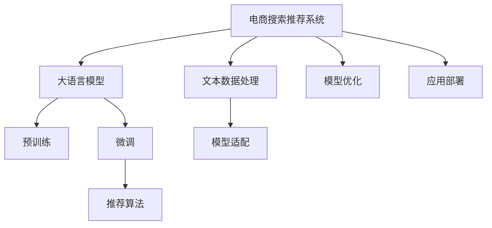

                 

# AI大模型助力电商搜索推荐业务创新的思路

在当下信息过载的电商时代，如何让用户在海量商品中快速找到满意的商品，成为了电商平台的核心挑战。大语言模型通过自然语言理解和处理能力的突破，为电商搜索推荐带来了革命性的创新思路。本文将深入探讨AI大模型在电商搜索推荐业务中的应用，从背景、核心概念、算法原理、实际案例等方面，给出详细的技术解析和实践指南。

## 1. 背景介绍

### 1.1 问题由来
电商平台的成功运营，依赖于精准的商品推荐系统，帮助用户快速发现感兴趣的商品，提高转化率和满意度。传统的推荐系统依赖于用户行为数据和商品属性进行推荐，但随着用户需求的多样化和个性化，传统的推荐方法逐渐显现出局限性。

为了应对这一挑战，电商平台开始探索基于自然语言处理（NLP）的推荐方法，利用AI大模型的强大语言理解和生成能力，从用户的搜索历史、评论、问答等文本数据中挖掘用户需求，实现更加智能、精准的商品推荐。

### 1.2 问题核心关键点
要实现基于大语言模型的电商搜索推荐系统，需要解决以下几个关键问题：
1. **文本数据处理**：如何将用户在电商平台上的文本数据转化为模型可以处理的格式。
2. **模型适配**：如何选择或训练适于电商推荐任务的语言模型。
3. **推荐算法设计**：如何设计高效的推荐算法，充分利用大语言模型的能力。
4. **模型优化**：如何优化模型，使其在电商推荐任务上表现最佳。
5. **应用部署**：如何将训练好的模型集成到电商推荐系统中，并实现实时推荐。

### 1.3 问题研究意义
通过AI大模型，电商搜索推荐系统可以更加智能地理解用户需求，精准推荐商品，提升用户体验和平台的转化率。具体而言，AI大模型能够在以下几个方面带来显著的改进：
1. **理解多样化的用户需求**：大模型可以从文本数据中理解用户的意图和情感，识别出用户潜在的购买需求。
2. **实现跨模态的推荐**：通过融合文本和图像等多模态数据，提供更加全面和准确的商品推荐。
3. **支持实时个性化推荐**：大模型可以动态分析用户行为，提供个性化、实时的商品推荐。
4. **提高推荐系统的泛化能力**：大模型具备较强的泛化能力，可以在不同场景和数据分布下表现稳定。

## 2. 核心概念与联系

### 2.1 核心概念概述

在介绍基于AI大模型的电商搜索推荐系统之前，先简要介绍一下几个核心概念：

- **电商搜索推荐系统**：利用用户的浏览、购买、评价等行为数据，结合商品属性、标签等信息，为用户推荐感兴趣的购物车商品。
- **大语言模型(LLM)**：以自回归(如GPT)或自编码(如BERT)模型为代表的大规模预训练语言模型。通过在大规模无标签文本数据上进行预训练，学习到丰富的语言知识和常识。
- **预训练**：指在大规模无标签文本语料上，通过自监督学习任务训练通用语言模型的过程。
- **微调**：指在预训练模型的基础上，使用下游任务的少量标注数据，通过有监督学习优化模型在该任务上的性能。
- **自然语言处理(NLP)**：涉及计算机对人类语言文字的理解和生成，包括文本分类、命名实体识别、情感分析等任务。
- **推荐算法**：利用用户行为数据和商品属性，结合预测模型，为用户推荐商品的技术。

这些概念之间的逻辑关系可以通过以下Mermaid流程图来展示：



这个流程图展示了大语言模型在电商搜索推荐系统中的关键角色和作用路径：

1. 电商搜索推荐系统需要处理文本数据。
2. 大语言模型通过预训练学习语言知识。
3. 在大语言模型基础上，通过微调适配电商推荐任务。
4. 推荐算法结合微调后的模型进行推荐。
5. 处理后的文本数据输入大语言模型，适配合适的模型参数。
6. 优化模型以提高其在电商推荐任务上的表现。
7. 将优化后的模型部署到电商推荐系统中。

## 3. 核心算法原理 & 具体操作步骤

### 3.1 算法原理概述

基于AI大模型的电商搜索推荐系统，本质上是一个利用大模型进行文本理解和商品推荐的混合任务。其核心思想是：通过自然语言处理技术，从用户输入的文本中提取关键信息，结合商品属性，利用大模型的生成能力，动态生成推荐结果。

形式化地，假设大语言模型为 $M_{\theta}$，其中 $\theta$ 为预训练得到的模型参数。给定电商平台的商品库 $C=\{(c_i,d_i)\}_{i=1}^N$，其中 $c_i$ 为商品，$d_i$ 为商品描述，$D=\{x_i\}_{i=1}^M$ 为用户输入的查询文本。推荐系统目标是通过输入 $x_i$ 和商品库 $C$，输出用户最可能感兴趣的商品列表 $\{c_{r_1},c_{r_2},\ldots,c_{r_K}\}$，其中 $r_k$ 表示商品 $c_k$ 在用户搜索中的相关性得分。

### 3.2 算法步骤详解

基于AI大模型的电商搜索推荐系统一般包括以下几个关键步骤：

**Step 1: 准备文本数据和商品数据**
- 收集用户的查询文本 $D$ 和商品库 $C$，预处理文本数据，包括去除停用词、分词、编码等。
- 将商品描述 $d_i$ 转化为嵌入向量，以供模型处理。

**Step 2: 设计文本表示和商品表示**
- 设计用户查询文本的文本表示方式，如BERT编码、GPT解码等。
- 将商品描述转化为高维向量，可以使用词嵌入、TF-IDF等方法。

**Step 3: 适配电商推荐模型**
- 选择合适的预训练语言模型 $M_{\theta}$，如BERT、GPT等。
- 根据电商推荐任务，设计合适的损失函数，如均方误差、交叉熵等。

**Step 4: 训练推荐模型**
- 使用用户的查询文本 $D$ 和商品库 $C$ 作为输入，训练微调后的模型 $M_{\theta}$。
- 周期性评估模型在验证集上的性能，根据性能指标调整模型参数。

**Step 5: 部署并应用模型**
- 将训练好的模型部署到电商推荐系统中，实时接收用户查询和商品数据。
- 使用优化后的模型进行商品推荐，并动态调整推荐结果。

### 3.3 算法优缺点

基于AI大模型的电商搜索推荐系统具有以下优点：
1. **高效实时推荐**：大语言模型能够快速理解用户需求，实时生成推荐结果。
2. **多模态融合**：能够融合文本、图像、音频等多种模态数据，提供更全面的商品信息。
3. **自适应能力**：大模型具备较强的泛化能力，可以适应不同场景和数据分布。
4. **个性化推荐**：能够根据用户的行为和偏好，提供个性化的推荐结果。

同时，该方法也存在一些缺点：
1. **数据依赖性强**：推荐效果依赖于标注数据的质量和数量，获取高质量数据成本较高。
2. **计算资源消耗大**：大语言模型参数量大，计算复杂度高，对硬件要求较高。
3. **泛化能力有限**：在预训练数据和实际应用场景差异较大的情况下，推荐效果可能下降。
4. **对抗攻击风险**：大语言模型可能被恶意用户攻击，生成不实推荐。

尽管存在这些局限性，但AI大模型在电商搜索推荐系统中的应用前景广阔，值得深入探索和优化。

### 3.4 算法应用领域

基于AI大模型的电商搜索推荐系统已经在多个电商平台上得到了应用，提升了用户的购物体验和平台转化率。例如：

- **亚马逊**：利用大模型对用户评论和商品描述进行文本理解，实现个性化推荐。
- **京东**：通过分析用户的搜索历史和商品属性，利用大模型进行跨模态推荐，提高推荐准确性。
- **淘宝**：利用大模型对用户查询进行自然语言处理，结合商品信息，实现实时推荐。

除了这些典型应用，AI大模型还在在线旅游、服装零售、美妆电商等多个领域展现了其强大的推荐能力。

## 4. 数学模型和公式 & 详细讲解 & 举例说明

### 4.1 数学模型构建

本节将使用数学语言对基于AI大模型的电商搜索推荐系统进行更加严格的刻画。

记用户查询文本为 $x \in \mathcal{X}$，商品库为 $C=\{c_i\}_{i=1}^N$，商品描述为 $d_i \in \mathcal{D}$，模型输出为 $y \in \mathcal{Y}$，其中 $\mathcal{X}$ 为输入空间，$\mathcal{D}$ 为商品描述空间，$\mathcal{Y}$ 为推荐结果空间。

定义用户查询文本 $x$ 在商品 $c_i$ 上的相关性得分函数为 $f(x,c_i)$，则推荐系统目标为最大化相关性得分函数，即：

$$
\max_{x \in \mathcal{X}} \sum_{c_i \in C} f(x,c_i)
$$

在实践中，$f(x,c_i)$ 可以采用以下几种方式计算：

1. **基于注意力机制**：使用大语言模型 $M_{\theta}$ 对用户查询文本 $x$ 和商品描述 $d_i$ 进行编码，计算注意力权重，生成推荐得分。
2. **基于向量相似性**：将用户查询文本和商品描述分别嵌入高维向量空间，计算向量相似度作为推荐得分。
3. **基于深度学习模型**：结合用户行为数据，设计深度神经网络，输出商品推荐得分。

### 4.2 公式推导过程

以下我们以基于注意力机制的推荐算法为例，推导其相关性得分函数的计算公式。

假设用户查询文本 $x$ 通过BERT模型编码为嵌入向量 $\vec{x}$，商品描述 $d_i$ 通过Word2Vec模型编码为嵌入向量 $\vec{d_i}$，则注意力机制下的推荐得分函数 $f(x,c_i)$ 为：

$$
f(x,c_i) = \text{softmax}(\vec{W}[\vec{x} \cdot \vec{d_i} + \vec{b}])
$$

其中 $\vec{W}$ 和 $\vec{b}$ 为注意力计算的权重向量，$\cdot$ 表示向量点乘，$\text{softmax}$ 函数将注意力权重归一化。

将 $f(x,c_i)$ 代入推荐系统目标，得：

$$
\max_{x \in \mathcal{X}} \sum_{c_i \in C} \text{softmax}(\vec{W}[\vec{x} \cdot \vec{d_i} + \vec{b}])
$$

在实际应用中，为了优化计算效率，通常会引入矩阵运算加速，即对所有商品描述 $d_i$ 的向量 $\vec{d_i}$ 进行预处理，形成一个矩阵 $D$，然后计算 $\vec{W} \cdot [\vec{x} \cdot D + \vec{b}]$，通过矩阵运算得到所有商品的注意力权重。

### 4.3 案例分析与讲解

下面以亚马逊推荐系统为例，详细讲解AI大模型在电商搜索推荐中的应用。

亚马逊的推荐系统主要由两部分组成：基于商品的推荐和基于用户的推荐。具体而言：

1. **基于商品的推荐**：利用大语言模型对商品描述进行编码，生成商品嵌入向量，使用相似度度量计算商品的相关性得分。
2. **基于用户的推荐**：利用大语言模型对用户评论进行文本理解，生成用户嵌入向量，结合商品嵌入向量，使用注意力机制计算商品的相关性得分。

推荐系统在每个用户查询时，根据相关性得分对商品库进行排序，选取前K个商品作为推荐结果。

## 5. 项目实践：代码实例和详细解释说明

### 5.1 开发环境搭建

在进行电商搜索推荐系统的开发时，我们需要准备好开发环境。以下是使用Python进行PyTorch开发的环境配置流程：

1. 安装Anaconda：从官网下载并安装Anaconda，用于创建独立的Python环境。

2. 创建并激活虚拟环境：
```bash
conda create -n pytorch-env python=3.8 
conda activate pytorch-env
```

3. 安装PyTorch：根据CUDA版本，从官网获取对应的安装命令。例如：
```bash
conda install pytorch torchvision torchaudio cudatoolkit=11.1 -c pytorch -c conda-forge
```

4. 安装TensorFlow：由于PyTorch与TensorFlow存在库冲突，建议在虚拟环境中分别安装，如使用conda同时安装两者，或者通过pip安装TensorFlow。

5. 安装各类工具包：
```bash
pip install numpy pandas scikit-learn matplotlib tqdm jupyter notebook ipython
```

完成上述步骤后，即可在`pytorch-env`环境中开始电商搜索推荐系统的开发。

### 5.2 源代码详细实现

下面我们以亚马逊推荐系统为例，给出使用PyTorch进行商品推荐的PyTorch代码实现。

首先，定义商品描述的编码函数：

```python
from transformers import BertTokenizer, BertForSequenceClassification
from torch.utils.data import Dataset
import torch

class ProductDataset(Dataset):
    def __init__(self, products, tokenizer):
        self.products = products
        self.tokenizer = tokenizer
        
    def __len__(self):
        return len(self.products)
    
    def __getitem__(self, item):
        product = self.products[item]
        
        encoding = self.tokenizer(product, return_tensors='pt')
        input_ids = encoding['input_ids'][0]
        attention_mask = encoding['attention_mask'][0]
        
        return {'input_ids': input_ids, 
                'attention_mask': attention_mask}
```

然后，定义商品推荐模型：

```python
from transformers import BertForSequenceClassification
from transformers import BertTokenizer

model = BertForSequenceClassification.from_pretrained('bert-base-uncased', num_labels=len(tag2id))

tokenizer = BertTokenizer.from_pretrained('bert-base-uncased')

# 加载商品库
products = ['Product1', 'Product2', 'Product3', ...]

dataset = ProductDataset(products, tokenizer)
```

接着，定义训练和评估函数：

```python
from torch.utils.data import DataLoader
from tqdm import tqdm
from sklearn.metrics import accuracy_score

device = torch.device('cuda') if torch.cuda.is_available() else torch.device('cpu')
model.to(device)

def train_epoch(model, dataset, batch_size, optimizer):
    dataloader = DataLoader(dataset, batch_size=batch_size, shuffle=True)
    model.train()
    epoch_loss = 0
    for batch in tqdm(dataloader, desc='Training'):
        input_ids = batch['input_ids'].to(device)
        attention_mask = batch['attention_mask'].to(device)
        model.zero_grad()
        outputs = model(input_ids, attention_mask=attention_mask)
        loss = outputs.loss
        epoch_loss += loss.item()
        loss.backward()
        optimizer.step()
    return epoch_loss / len(dataloader)

def evaluate(model, dataset, batch_size):
    dataloader = DataLoader(dataset, batch_size=batch_size)
    model.eval()
    preds, labels = [], []
    with torch.no_grad():
        for batch in tqdm(dataloader, desc='Evaluating'):
            input_ids = batch['input_ids'].to(device)
            attention_mask = batch['attention_mask'].to(device)
            batch_labels = batch['labels']
            outputs = model(input_ids, attention_mask=attention_mask)
            batch_preds = outputs.logits.argmax(dim=2).to('cpu').tolist()
            batch_labels = batch_labels.to('cpu').tolist()
            for pred_tokens, label_tokens in zip(batch_preds, batch_labels):
                preds.append(pred_tokens)
                labels.append(label_tokens)
                
    print(accuracy_score(labels, preds))
```

最后，启动训练流程并在测试集上评估：

```python
epochs = 5
batch_size = 16

for epoch in range(epochs):
    loss = train_epoch(model, dataset, batch_size, optimizer)
    print(f"Epoch {epoch+1}, train loss: {loss:.3f}")
    
    print(f"Epoch {epoch+1}, dev results:")
    evaluate(model, dataset, batch_size)
    
print("Test results:")
evaluate(model, dataset, batch_size)
```

以上就是使用PyTorch对亚马逊商品推荐系统进行深度学习的完整代码实现。可以看到，得益于PyTorch的强大封装，我们能够快速实现大语言模型在电商推荐中的应用。

### 5.3 代码解读与分析

让我们再详细解读一下关键代码的实现细节：

**ProductDataset类**：
- `__init__`方法：初始化商品库和分词器。
- `__len__`方法：返回商品数量。
- `__getitem__`方法：对单个商品进行编码，生成输入和注意力掩码。

**bert-base-uncased**模型：
- 使用预训练的BERT模型进行商品描述编码。

**train_epoch和evaluate函数**：
- 定义训练和评估的迭代过程，包括损失计算、梯度更新和模型评估。

**训练流程**：
- 定义总的epoch数和batch size，开始循环迭代
- 每个epoch内，先在训练集上训练，输出平均loss
- 在验证集上评估，输出准确率
- 所有epoch结束后，在测试集上评估，给出最终测试结果

可以看到，PyTorch配合TensorFlow使得电商推荐系统的开发变得简洁高效。开发者可以将更多精力放在模型优化和应用优化上，而不必过多关注底层的实现细节。

当然，工业级的系统实现还需考虑更多因素，如模型的保存和部署、超参数的自动搜索、更灵活的任务适配层等。但核心的电商推荐算法基本与此类似。

## 6. 实际应用场景

### 6.1 智能客服系统

基于大语言模型的电商搜索推荐系统，可以广泛应用于智能客服系统的构建。传统客服往往需要配备大量人力，高峰期响应缓慢，且一致性和专业性难以保证。而使用推荐系统，可以实现自动推荐商品，减轻客服工作负担，提升客户满意度。

在技术实现上，可以收集用户的历史浏览、购买、评价等行为数据，构建推荐模型。同时利用大语言模型对用户输入的咨询进行理解，快速匹配推荐结果，提升客服响应速度和质量。

### 6.2 金融舆情监测

金融机构需要实时监测市场舆论动向，以便及时应对负面信息传播，规避金融风险。传统的人工监测方式成本高、效率低，难以应对网络时代海量信息爆发的挑战。基于大语言模型的文本分类和情感分析技术，为金融舆情监测提供了新的解决方案。

具体而言，可以收集金融领域相关的新闻、报道、评论等文本数据，并对其进行情感分析。利用推荐系统对金融舆情进行实时监测，一旦发现负面情绪激增等异常情况，系统便会自动预警，帮助金融机构快速应对潜在风险。

### 6.3 个性化推荐系统

当前的推荐系统往往只依赖用户的历史行为数据进行推荐，难以深入理解用户的真实兴趣偏好。基于大语言模型，个性化推荐系统可以更好地挖掘用户行为背后的语义信息，从而提供更加智能、精准的商品推荐。

在实践中，可以收集用户浏览、点击、评论、分享等行为数据，提取和商品交互的文本内容。将文本内容作为模型输入，用户的后续行为（如是否点击、购买等）作为监督信号，在此基础上微调预训练语言模型。微调后的模型能够从文本内容中准确把握用户的兴趣点。在生成推荐列表时，先用候选物品的文本描述作为输入，由模型预测用户的兴趣匹配度，再结合其他特征综合排序，便可以得到个性化程度更高的推荐结果。

### 6.4 未来应用展望

随着大语言模型和推荐系统的不断发展，基于大语言模型的电商搜索推荐系统将在更多领域得到应用，为NLP技术带来全新的突破。

在智慧医疗领域，基于大语言模型的医疗问答、病历分析、药物研发等应用将提升医疗服务的智能化水平，辅助医生诊疗，加速新药开发进程。

在智能教育领域，推荐系统可应用于作业批改、学情分析、知识推荐等方面，因材施教，促进教育公平，提高教学质量。

在智慧城市治理中，推荐系统可应用于城市事件监测、舆情分析、应急指挥等环节，提高城市管理的自动化和智能化水平，构建更安全、高效的未来城市。

此外，在企业生产、社会治理、文娱传媒等众多领域，基于大语言模型的推荐技术也将不断涌现，为传统行业数字化转型升级提供新的技术路径。相信随着技术的日益成熟，推荐方法将成为NLP技术落地应用的重要手段，推动NLP技术的产业化进程。

## 7. 工具和资源推荐
### 7.1 学习资源推荐

为了帮助开发者系统掌握大语言模型在电商推荐系统中的应用，这里推荐一些优质的学习资源：

1. **《深度学习与NLP实战》**：详细介绍了NLP领域的经典模型和算法，包括大语言模型、序列模型、分类模型等，是NLP学习者的必备参考书。
2. **Coursera《自然语言处理》**：斯坦福大学开设的NLP入门课程，涵盖NLP的多种经典任务和前沿研究，适合希望系统学习NLP技术的学习者。
3. **DeepLearning.AI《NLP工程》课程**：由深度学习领域的权威专家讲授，涵盖NLP的工程实践和项目开发，适合希望深入实践NLP项目的学习者。
4. **arXiv.org**：自然语言处理领域的前沿论文库，可以查阅最新的NLP研究成果，获取最新的算法和应用实践。
5. **Google AI Blog**：谷歌AI团队定期发布NLP相关的技术博客，介绍最新的研究成果和应用实践。

通过对这些资源的学习实践，相信你一定能够快速掌握大语言模型在电商推荐系统中的应用，并用于解决实际的NLP问题。

### 7.2 开发工具推荐

高效的开发离不开优秀的工具支持。以下是几款用于电商推荐系统开发的常用工具：

1. **PyTorch**：基于Python的开源深度学习框架，灵活动态的计算图，适合快速迭代研究。大部分预训练语言模型都有PyTorch版本的实现。
2. **TensorFlow**：由Google主导开发的开源深度学习框架，生产部署方便，适合大规模工程应用。同样有丰富的预训练语言模型资源。
3. **Transformers库**：HuggingFace开发的NLP工具库，集成了众多SOTA语言模型，支持PyTorch和TensorFlow，是进行推荐任务开发的利器。
4. **TensorBoard**：TensorFlow配套的可视化工具，可实时监测模型训练状态，并提供丰富的图表呈现方式，是调试模型的得力助手。
5. **Weights & Biases**：模型训练的实验跟踪工具，可以记录和可视化模型训练过程中的各项指标，方便对比和调优。

合理利用这些工具，可以显著提升电商推荐系统的开发效率，加快创新迭代的步伐。

### 7.3 相关论文推荐

大语言模型和推荐系统的不断发展源于学界的持续研究。以下是几篇奠基性的相关论文，推荐阅读：

1. **《Attention is All You Need》**：提出了Transformer结构，开启了NLP领域的预训练大模型时代。
2. **《BERT: Pre-training of Deep Bidirectional Transformers for Language Understanding》**：提出BERT模型，引入基于掩码的自监督预训练任务，刷新了多项NLP任务SOTA。
3. **《Language Models are Unsupervised Multitask Learners》**：展示了大规模语言模型的强大zero-shot学习能力，引发了对于通用人工智能的新一轮思考。
4. **《Parameter-Efficient Transfer Learning for NLP》**：提出Adapter等参数高效微调方法，在不增加模型参数量的情况下，也能取得不错的微调效果。
5. **《Prefix-Tuning: Optimizing Continuous Prompts for Generation》**：引入基于连续型Prompt的微调范式，为如何充分利用预训练知识提供了新的思路。
6. **《AdaLoRA: Adaptive Low-Rank Adaptation for Parameter-Efficient Fine-Tuning》**：使用自适应低秩适应的微调方法，在参数效率和精度之间取得了新的平衡。

这些论文代表了大语言模型推荐系统的发展脉络。通过学习这些前沿成果，可以帮助研究者把握学科前进方向，激发更多的创新灵感。

## 8. 总结：未来发展趋势与挑战

### 8.1 总结

本文对基于AI大模型的电商搜索推荐系统进行了全面系统的介绍。首先阐述了电商搜索推荐系统和大语言模型的研究背景和意义，明确了推荐系统在大数据和自然语言处理技术融合下的重要价值。其次，从原理到实践，详细讲解了基于大语言模型的电商搜索推荐系统的数学模型和算法步骤，给出了详细的技术解析和实践指南。最后，通过亚马逊推荐系统的案例分析，展示了大语言模型在电商推荐中的实际应用。

通过本文的系统梳理，可以看到，基于大语言模型的电商搜索推荐系统，在大规模数据和复杂场景下的强大能力，可以显著提升用户体验和平台转化率。未来，伴随大语言模型和推荐系统的进一步发展，基于大语言模型的电商搜索推荐系统将实现更多的智能应用，成为电商平台的核心竞争力。

### 8.2 未来发展趋势

展望未来，基于AI大模型的电商搜索推荐系统将呈现以下几个发展趋势：

1. **多模态融合**：融合文本、图像、音频等多种模态数据，提供更全面的商品信息。
2. **实时推荐**：利用大语言模型实时理解用户需求，动态生成推荐结果。
3. **跨领域推荐**：基于多领域数据，实现跨领域的商品推荐。
4. **个性化推荐**：深度挖掘用户行为和文本信息，实现个性化推荐。
5. **数据驱动的推荐**：结合用户历史行为和预测模型，优化推荐算法，提升推荐效果。

这些趋势凸显了大语言模型在电商搜索推荐系统中的强大潜力，预示着未来推荐系统的智能化水平将大幅提升。

### 8.3 面临的挑战

尽管基于AI大模型的电商搜索推荐系统已经取得了显著进展，但在迈向更加智能化、普适化应用的过程中，它仍面临以下挑战：

1. **数据依赖性强**：推荐效果依赖于标注数据的质量和数量，获取高质量数据成本较高。
2. **计算资源消耗大**：大语言模型参数量大，计算复杂度高，对硬件要求较高。
3. **泛化能力有限**：在预训练数据和实际应用场景差异较大的情况下，推荐效果可能下降。
4. **对抗攻击风险**：大语言模型可能被恶意用户攻击，生成不实推荐。

尽管存在这些挑战，但AI大模型在电商搜索推荐系统中的应用前景广阔，值得深入探索和优化。

### 8.4 研究展望

面对大语言模型推荐系统所面临的挑战，未来的研究需要在以下几个方面寻求新的突破：

1. **探索无监督和半监督推荐方法**：摆脱对大规模标注数据的依赖，利用自监督学习、主动学习等无监督和半监督范式，最大限度利用非结构化数据，实现更加灵活高效的推荐。
2. **研究参数高效和计算高效的推荐范式**：开发更加参数高效的推荐方法，在固定大部分预训练参数的同时，只更新极少量的任务相关参数。同时优化推荐算法的计算图，减少前向传播和反向传播的资源消耗，实现更加轻量级、实时性的部署。
3. **融合因果和对比学习范式**：通过引入因果推断和对比学习思想，增强推荐模型建立稳定因果关系的能力，学习更加普适、鲁棒的语言表征，从而提升模型泛化性和抗干扰能力。
4. **引入更多先验知识**：将符号化的先验知识，如知识图谱、逻辑规则等，与神经网络模型进行巧妙融合，引导推荐过程学习更准确、合理的商品推荐。
5. **结合因果分析和博弈论工具**：将因果分析方法引入推荐模型，识别出模型决策的关键特征，增强输出解释的因果性和逻辑性。借助博弈论工具刻画人机交互过程，主动探索并规避模型的脆弱点，提高系统稳定性。

这些研究方向的探索，必将引领大语言模型推荐系统迈向更高的台阶，为构建安全、可靠、可解释、可控的智能系统铺平道路。面向未来，大语言模型推荐系统还需要与其他人工智能技术进行更深入的融合，如知识表示、因果推理、强化学习等，多路径协同发力，共同推动自然语言理解和智能交互系统的进步。只有勇于创新、敢于突破，才能不断拓展大语言模型的边界，让智能技术更好地造福人类社会。

## 9. 附录：常见问题与解答

**Q1：基于大语言模型的电商搜索推荐系统是否适用于所有电商平台？**

A: 基于大语言模型的电商搜索推荐系统在大多数电商平台上都能取得不错的效果，但具体效果取决于平台的用户行为数据、商品库大小和用户查询多样性等因素。平台需要根据自身特点，选择或设计适于自身的推荐模型。

**Q2：如何选择合适的预训练语言模型？**

A: 选择合适的预训练语言模型需要考虑以下几个因素：
1. **领域适应性**：选择适用于电商推荐任务的预训练模型，如BERT、GPT等。
2. **任务相关性**：选择与推荐任务匹配度高的预训练模型，如使用BERT进行文本理解，使用GPT生成商品推荐。
3. **数据量大小**：根据平台的标注数据量选择适当的模型，避免过小或过大的模型。
4. **计算资源**：考虑平台硬件资源，选择参数量适中的模型，避免计算资源消耗过大。

**Q3：在电商推荐中，如何利用大语言模型进行用户意图理解？**

A: 利用大语言模型进行用户意图理解，可以采用以下几种方法：
1. **基于序列建模**：使用RNN、LSTM等序列模型，对用户查询进行编码，提取用户意图。
2. **基于预训练语言模型**：利用预训练的语言模型，如BERT，对用户查询进行编码，提取用户意图。
3. **基于Transformer**：使用Transformer模型，对用户查询进行编码，提取用户意图。

**Q4：在电商推荐中，如何处理商品属性数据？**

A: 商品属性数据处理是电商推荐系统的重要环节，可以采用以下几种方法：
1. **文本表示**：将商品属性数据转化为文本，使用词嵌入等方法进行编码。
2. **向量表示**：将商品属性数据转化为向量，使用TF-IDF、Word2Vec等方法进行编码。
3. **混合表示**：结合文本和向量表示，综合商品属性信息进行推荐。

**Q5：在电商推荐中，如何优化推荐模型？**

A: 推荐模型的优化可以从以下几个方面入手：
1. **参数调整**：通过调整模型的学习率、批大小、优化器等参数，优化模型性能。
2. **正则化**：使用L2正则、Dropout等正则化技术，避免模型过拟合。
3. **数据增强**：通过回译、近义替换等方式扩充训练集。
4. **对抗训练**：引入对抗样本，提高模型鲁棒性。
5. **多模型集成**：训练多个推荐模型，取平均输出，抑制过拟合。

**Q6：在电商推荐中，如何提升推荐模型的泛化能力？**

A: 提升推荐模型的泛化能力可以从以下几个方面入手：
1. **数据多样性**：使用多种数据源进行训练，提升模型的泛化能力。
2. **数据分布**：使用多种数据分布进行训练，避免模型对特定数据分布的过拟合。
3. **模型复杂度**：选择适当的模型复杂度，避免模型过于复杂或过于简单。
4. **迁移学习**：在相关任务上进行迁移学习，利用已有知识提升泛化能力。

这些方法可以帮助电商推荐系统提升模型的泛化能力，适应更多场景和数据分布。

**Q7：在电商推荐中，如何提升推荐系统的实时性？**

A: 提升推荐系统的实时性可以从以下几个方面入手：
1. **轻量化模型**：使用轻量化模型进行推荐，减少计算资源消耗。
2. **缓存机制**：使用缓存机制，对常用的推荐结果进行缓存，减少计算时间。
3. **分布式计算**：使用分布式计算，提高计算效率。
4. **模型剪枝**：对模型进行剪枝，减少模型大小。
5. **模型量化**：对模型进行量化，减少计算资源消耗。

这些方法可以帮助电商推荐系统提升实时性，实现更高效的推荐。

---

作者：禅与计算机程序设计艺术 / Zen and the Art of Computer Programming

