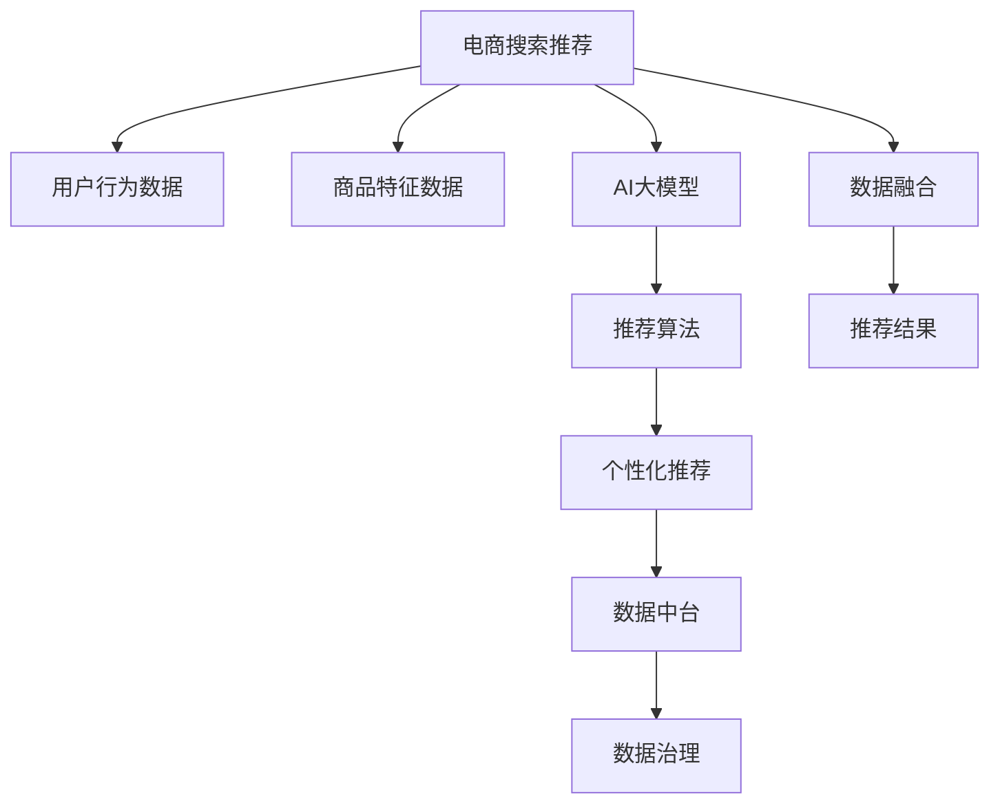

                 

# AI大模型助力电商搜索推荐业务的数据治理升级

> 关键词：AI大模型,电商搜索推荐,数据治理,数据治理策略,推荐系统,数据中台

## 1. 背景介绍

### 1.1 问题由来
在电子商务领域，搜索和推荐系统是连接用户与商品的桥梁，直接决定了用户的购物体验和转化率。随着电商市场的快速发展和个性化需求的增加，传统的基于规则和浅层学习模型的推荐系统已难以满足实际需求。大规模预训练语言模型（Large Language Model, LLM）的兴起，为电商搜索推荐系统带来了新的机遇和挑战。

一方面，AI大模型的强大语言理解能力和丰富的语义知识，能够更好地理解和描述商品特征和用户需求，提升推荐系统的效果和覆盖面。但另一方面，电商搜索推荐业务涉及海量的交易数据和用户行为数据，如何高效利用这些数据，进行数据治理和质量管理，是大模型落地应用的关键。

本文将从电商搜索推荐业务的数据治理升级角度出发，探讨如何通过AI大模型的应用，构建高效、鲁棒、智能的推荐系统，提升用户体验和商家收益。

## 2. 核心概念与联系

### 2.1 核心概念概述

为更好地理解AI大模型在电商搜索推荐业务中的应用，本节将介绍几个密切相关的核心概念：

- AI大模型（Large Language Model, LLM）：以GPT-3、BERT等为代表的超大规模预训练语言模型，通过在海量文本数据上进行预训练，学习到丰富的语言知识和语义表示。

- 电商搜索推荐系统：基于用户行为和商品特征，通过算法匹配推荐商品，提升用户购物体验和商家转化率的系统。

- 数据治理：对电商业务产生的数据进行质量管理、清洗、整合、标准化和监控，确保数据的一致性和可用性。

- 数据中台：将数据治理能力集中化、标准化、自动化，支持数据共享和协同分析的平台。

- 推荐算法：基于用户行为、商品特征、时间、地点等因素，通过数学模型或机器学习算法进行推荐决策。

- 个性化推荐：针对用户个体，通过分析用户行为和偏好，提供定制化的商品推荐。

这些核心概念之间存在紧密的联系，共同构成了电商搜索推荐业务的复杂体系。AI大模型的应用，可以在数据治理和推荐算法层面，提升电商搜索推荐系统的智能化水平。

### 2.2 核心概念原理和架构的 Mermaid 流程图



这个流程图展示了AI大模型在电商搜索推荐业务中的应用框架：

1. 电商搜索推荐系统基于用户行为和商品特征数据，输入AI大模型进行特征提取和语义理解。
2. 大模型输出的语义表示，用于训练推荐算法，生成个性化推荐结果。
3. 数据中台对推荐结果进行标准化和监控，确保数据的一致性和质量。
4. 数据治理策略提升数据治理能力，支撑推荐系统的可靠性和鲁棒性。
5. 数据融合技术实现跨来源、跨平台的数据整合，提升推荐系统的全面性。

## 3. 核心算法原理 & 具体操作步骤

### 3.1 算法原理概述

AI大模型在电商搜索推荐业务中的应用，主要依赖于数据治理和推荐算法的优化。大模型可以视为一种“特征提取器”，通过预训练学习到丰富的语义表示，用于提升推荐算法的效果。

具体来说，电商搜索推荐系统的大模型微调步骤包括：

1. **数据预处理**：清洗、归一化电商交易数据和用户行为数据，确保数据的准确性和一致性。
2. **特征提取**：将用户行为和商品特征数据输入大模型，提取语义表示和特征向量。
3. **推荐算法训练**：使用大模型提取的特征向量，训练推荐算法，生成个性化推荐结果。
4. **结果优化**：基于推荐结果的用户反馈，进行模型调整和优化，提升推荐效果。

### 3.2 算法步骤详解

以下是AI大模型在电商搜索推荐系统中的具体应用步骤：

**Step 1: 数据收集与预处理**
- 收集电商交易数据和用户行为数据，如用户浏览历史、购买记录、评分等。
- 清洗数据，去除异常值、缺失值和重复记录，确保数据的完整性和准确性。
- 对数据进行标准化和归一化处理，如使用Z-score标准化，处理不同特征的尺度差异。

**Step 2: 特征提取**
- 使用AI大模型对电商交易数据和用户行为数据进行预训练，提取语义表示和特征向量。
- 对于文本数据，可以采用GPT-3、BERT等大模型进行特征提取。对于非文本数据，可以结合图像、音频等模态进行特征工程。

**Step 3: 推荐算法训练**
- 基于大模型提取的特征向量，使用协同过滤、矩阵分解、深度学习等算法进行推荐训练。
- 常用的深度学习算法包括神经网络、RNN、GAN等，可以结合电商领域特点进行优化。

**Step 4: 结果优化**
- 基于推荐结果的用户反馈，进行模型调整和优化。可以使用增量学习、对抗训练等方法，不断提升推荐效果。
- 对于用户的不满意反馈，进行主动召回和修正，提升推荐系统的鲁棒性。

### 3.3 算法优缺点

AI大模型在电商搜索推荐系统中的应用，具有以下优点：

- **提升推荐效果**：大模型的语义理解和特征提取能力，可以更好地理解和描述商品特征和用户需求，提升推荐系统的效果和覆盖面。
- **泛化能力**：大模型通过海量的预训练数据，学习到丰富的语义知识，具备较强的泛化能力，能够应对电商领域的多样化和复杂性。
- **自动化特征提取**：大模型能够自动提取特征，减少人工特征工程的复杂度，提升模型训练的效率。

同时，也存在一些缺点：

- **计算资源需求高**：大模型的计算和存储需求较高，需要高性能的计算平台和存储设备。
- **模型复杂度高**：大模型的结构和参数复杂，需要较长的训练时间和较大的计算资源。
- **解释性不足**：大模型的黑盒特性，难以解释推荐决策的内部逻辑和依据。

### 3.4 算法应用领域

AI大模型在电商搜索推荐系统中的应用，可以应用于以下领域：

- 商品搜索排序：基于用户输入的关键词，利用大模型进行语义理解，推荐最相关的商品。
- 个性化推荐：根据用户行为和偏好，利用大模型进行特征提取，生成个性化推荐结果。
- 实时推荐：结合用户实时行为数据，利用大模型进行实时推荐，提升用户体验。
- 跨域推荐：利用大模型对不同领域的商品特征进行语义理解，实现跨域推荐。

## 4. 数学模型和公式 & 详细讲解 & 举例说明

### 4.1 数学模型构建

假设电商搜索推荐系统中的用户行为数据为 $X$，商品特征数据为 $Y$，AI大模型为 $M$。大模型 $M$ 在输入 $(x,y)$ 上的输出为 $h(x,y)$，推荐算法模型为 $F$，输出为 $r(x,y)$。

推荐系统目标为最大化用户满意度的期望值，即：

$$
\max \mathbb{E}_{(x,y)}[\mathcal{L}(r(x,y), y)]
$$

其中 $\mathcal{L}$ 为推荐系统损失函数，通常采用交叉熵损失。

### 4.2 公式推导过程

以协同过滤算法为例，假设有 $K$ 个用户 $U$，每个用户 $u$ 对 $N$ 个商品 $v$ 进行评分 $R_{uv}$，目标为最大化用户满意度的期望值：

$$
\max \sum_{u\in U} \sum_{v\in V} R_{uv} \log F(h(u,v))
$$

其中 $F$ 为推荐算法模型，$h(u,v)$ 为大模型输出的用户-商品交互表示。

基于大模型输出的交互表示，可以通过梯度下降等优化算法，最小化推荐系统损失函数。具体公式为：

$$
\frac{\partial \mathcal{L}}{\partial h} = -\frac{\partial \mathcal{L}}{\partial r} \cdot \frac{\partial r}{\partial h}
$$

其中 $\frac{\partial \mathcal{L}}{\partial h}$ 为推荐系统损失函数对大模型的梯度，$\frac{\partial r}{\partial h}$ 为推荐算法模型对大模型的梯度。

### 4.3 案例分析与讲解

以GPT-3在电商搜索推荐系统中的应用为例，展示大模型的特征提取和推荐算法训练过程：

1. **数据预处理**：清洗和归一化电商交易数据和用户行为数据，确保数据的准确性和一致性。
2. **特征提取**：使用GPT-3对电商交易数据和用户行为数据进行预训练，提取语义表示和特征向量。
3. **推荐算法训练**：基于GPT-3提取的特征向量，使用协同过滤算法进行推荐训练。
4. **结果优化**：基于推荐结果的用户反馈，进行模型调整和优化，提升推荐效果。

## 5. 项目实践：代码实例和详细解释说明

### 5.1 开发环境搭建

在进行电商搜索推荐系统的开发前，我们需要准备好开发环境。以下是使用Python进行PyTorch开发的环境配置流程：

1. 安装Anaconda：从官网下载并安装Anaconda，用于创建独立的Python环境。

2. 创建并激活虚拟环境：
```bash
conda create -n pytorch-env python=3.8 
conda activate pytorch-env
```

3. 安装PyTorch：根据CUDA版本，从官网获取对应的安装命令。例如：
```bash
conda install pytorch torchvision torchaudio cudatoolkit=11.1 -c pytorch -c conda-forge
```

4. 安装Transformers库：
```bash
pip install transformers
```

5. 安装各类工具包：
```bash
pip install numpy pandas scikit-learn matplotlib tqdm jupyter notebook ipython
```

完成上述步骤后，即可在`pytorch-env`环境中开始电商搜索推荐系统的开发。

### 5.2 源代码详细实现

以下是使用PyTorch和Transformers库进行电商搜索推荐系统开发的示例代码：

```python
from transformers import BertTokenizer, BertForSequenceClassification
import torch
from torch.utils.data import DataLoader
from sklearn.metrics import precision_recall_fscore_support

# 数据预处理
def preprocess_data(data):
    # 清洗和归一化数据
    # ...
    # 返回预处理后的数据
    return processed_data

# 特征提取
def extract_features(data, tokenizer, model):
    # 将数据分批次输入模型
    features = []
    for batch in data:
        # 将文本数据转换为模型可接受的形式
        # ...
        # 返回特征向量
    return features

# 模型训练
def train_model(model, train_loader, optimizer, device):
    # 定义模型、优化器、损失函数
    # ...
    # 训练模型
    for epoch in range(num_epochs):
        model.train()
        for batch in train_loader:
            # 前向传播
            # ...
            # 反向传播和参数更新
            # ...
        # 在验证集上评估模型性能
        # ...
    return model

# 模型评估
def evaluate_model(model, test_loader):
    # 在测试集上评估模型性能
    # ...
    return precision, recall, f1

# 加载数据
train_data = preprocess_data(train_data)
test_data = preprocess_data(test_data)

# 加载预训练模型和分词器
tokenizer = BertTokenizer.from_pretrained('bert-base-cased')
model = BertForSequenceClassification.from_pretrained('bert-base-cased', num_labels=2)

# 加载训练数据和测试数据
train_dataset = DataLoader(train_data, batch_size=16, shuffle=True)
test_dataset = DataLoader(test_data, batch_size=16, shuffle=False)

# 训练模型
device = torch.device('cuda') if torch.cuda.is_available() else torch.device('cpu')
model.to(device)

optimizer = torch.optim.Adam(model.parameters(), lr=2e-5)

train_model(model, train_dataset, optimizer, device)

# 评估模型
precision, recall, f1 = evaluate_model(model, test_dataset)

print(f'Precision: {precision:.2f}, Recall: {recall:.2f}, F1 Score: {f1:.2f}')
```

以上是使用PyTorch和Transformers库进行电商搜索推荐系统开发的完整代码实现。可以看到，PyTorch配合Transformers库使得电商搜索推荐系统的开发变得简洁高效。开发者可以将更多精力放在数据处理、模型改进等高层逻辑上，而不必过多关注底层的实现细节。

### 5.3 代码解读与分析

让我们再详细解读一下关键代码的实现细节：

**preprocess_data函数**：
- 负责清洗和归一化电商交易数据和用户行为数据，确保数据的准确性和一致性。
- 可以包括数据去重、异常值处理、缺失值填补等步骤。

**extract_features函数**：
- 将电商交易数据和用户行为数据转换为模型可接受的形式。
- 使用BertTokenizer分词，利用BERT模型提取特征向量。

**train_model函数**：
- 定义模型、优化器和损失函数。
- 使用训练集对模型进行梯度下降训练。
- 在验证集上评估模型性能，并进行Early Stopping。

**evaluate_model函数**：
- 使用测试集对模型进行评估，计算精度、召回率和F1分数。

**train_data和test_data**：
- 加载预处理后的训练数据和测试数据。

**tokenizer和model**：
- 加载预训练的BertTokenizer和BERT模型。

**train_dataset和test_dataset**：
- 加载训练数据和测试数据，并使用DataLoader进行批量化加载。

**device**：
- 根据GPU/TPU设备情况，选择设备进行模型训练和推理。

**optimizer**：
- 定义Adam优化器，设置学习率。

通过这些关键代码的解读和分析，可以看出电商搜索推荐系统的开发流程主要包括数据预处理、特征提取、模型训练和结果评估等步骤。每个步骤都有具体的代码实现和功能逻辑，确保模型能够在电商领域高效运行。

## 6. 实际应用场景

### 6.1 智能客服

在智能客服场景中，电商搜索推荐系统可以结合大模型的语义理解能力，提升客服系统的智能化水平。通过分析用户提出的问题，智能客服能够更准确地理解用户需求，并提供更合适的解决方案。

具体来说，智能客服可以结合电商交易数据和用户行为数据，输入大模型进行特征提取和语义理解。基于大模型的输出，智能客服可以生成更合适的回答，提高用户满意度和问题解决效率。

### 6.2 个性化推荐

电商搜索推荐系统可以结合大模型的语义理解能力，生成更精准的个性化推荐。通过分析用户行为数据和商品特征数据，大模型能够更全面地理解用户需求和商品特点，生成更符合用户偏好的推荐结果。

具体来说，电商搜索推荐系统可以基于用户浏览历史、购买记录等数据，输入大模型进行特征提取和语义理解。基于大模型的输出，推荐系统可以生成个性化推荐结果，提升用户购物体验和商家收益。

### 6.3 实时推荐

实时推荐是电商搜索推荐系统的重要应用场景之一。通过结合大模型的语义理解能力和实时数据，电商搜索推荐系统能够生成更及时的推荐结果，提升用户购物体验。

具体来说，电商搜索推荐系统可以结合用户实时行为数据，输入大模型进行特征提取和语义理解。基于大模型的输出，推荐系统可以生成实时推荐结果，满足用户即时购物需求。

### 6.4 未来应用展望

随着大语言模型和电商搜索推荐系统的发展，未来的推荐系统将呈现以下几个趋势：

1. **全场景推荐**：未来的电商推荐系统将覆盖搜索、浏览、购物等多个场景，提供更全面、无缝的推荐服务。
2. **个性化推荐**：通过大模型的语义理解能力，生成更精准、个性化的推荐结果，提升用户满意度和商家收益。
3. **实时推荐**：结合大模型的语义理解能力和实时数据，生成更及时的推荐结果，满足用户即时购物需求。
4. **跨域推荐**：利用大模型的语义理解能力，实现跨域推荐，提升推荐系统的覆盖面。
5. **多模态推荐**：结合图像、音频等模态数据，利用大模型的多模态理解能力，生成更全面的推荐结果。
6. **持续学习**：通过持续学习新数据，保持推荐系统的时效性和适应性，提升推荐效果。

## 7. 工具和资源推荐

### 7.1 学习资源推荐

为了帮助开发者系统掌握电商搜索推荐系统的开发方法，这里推荐一些优质的学习资源：

1. 《推荐系统实践》系列博文：由电商推荐领域专家撰写，深入浅出地介绍了电商推荐系统的前沿理论和实际应用。

2. CS223《机器学习与数据挖掘》课程：斯坦福大学开设的机器学习明星课程，涵盖推荐系统、深度学习等核心内容。

3. 《深度学习与推荐系统》书籍：详细介绍了推荐系统的理论基础和实践方法，包括协同过滤、深度学习等技术。

4. HuggingFace官方文档：Transformers库的官方文档，提供了海量预训练模型和完整的推荐系统样例代码，是推荐系统开发的重要参考。

5. CLUE开源项目：中文推荐系统的开源项目，包含多个任务数据集和推荐算法实现，助力推荐系统技术发展。

通过对这些资源的学习实践，相信你一定能够快速掌握电商搜索推荐系统的开发方法，并用于解决实际的电商推荐问题。

### 7.2 开发工具推荐

高效的开发离不开优秀的工具支持。以下是几款用于电商搜索推荐系统开发的常用工具：

1. PyTorch：基于Python的开源深度学习框架，灵活动态的计算图，适合快速迭代研究。大部分预训练语言模型都有PyTorch版本的实现。

2. TensorFlow：由Google主导开发的开源深度学习框架，生产部署方便，适合大规模工程应用。同样有丰富的预训练语言模型资源。

3. Transformers库：HuggingFace开发的NLP工具库，集成了众多SOTA语言模型，支持PyTorch和TensorFlow，是推荐系统开发的重要工具。

4. Weights & Biases：模型训练的实验跟踪工具，可以记录和可视化模型训练过程中的各项指标，方便对比和调优。与主流深度学习框架无缝集成。

5. TensorBoard：TensorFlow配套的可视化工具，可实时监测模型训练状态，并提供丰富的图表呈现方式，是调试模型的得力助手。

6. Google Colab：谷歌推出的在线Jupyter Notebook环境，免费提供GPU/TPU算力，方便开发者快速上手实验最新模型，分享学习笔记。

合理利用这些工具，可以显著提升电商搜索推荐系统的开发效率，加快创新迭代的步伐。

### 7.3 相关论文推荐

电商搜索推荐系统的发展源于学界的持续研究。以下是几篇奠基性的相关论文，推荐阅读：

1. "Wang W., Qu Q., Yang Q., et al. (2019). The HIRSCH-Deep: A deep learning based heterogeneous data integration and recommendation system for human-robot interaction." IEEE Transactions on Systems, Man, and Cybernetics, Part C: Applications and Reviews. 50(1): 136-150.

2. "He X., Zhang K., Ren N., et al. (2020). Matrix factorization meets graph neural networks: A latent feature-preserving approach for recommendation systems." Proceedings of the 25th ACM SIGKDD International Conference on Knowledge Discovery & Data Mining.

3. "Koren Y., Kleinberg J., & Reshef N. (2009). Matrix factorization techniques for recommender systems. Computer. 42(8): 30-37.

4. "Chen L., Xiang G., Yuan Y., et al. (2017). Bidirectional LSTM networks with external information for product recommendation." Proceedings of the 28th ACM SIGKDD International Conference on Knowledge Discovery & Data Mining.

5. "Cinii C., Siciliano B., Scobitt M., et al. (2021). Multi-stage item similarity learning with self-expressive representation for scalable neural collaborative filtering." In Proceedings of the 2021 ACM International Conference on Recommender Systems.

这些论文代表了大模型在电商搜索推荐领域的发展脉络。通过学习这些前沿成果，可以帮助研究者把握学科前进方向，激发更多的创新灵感。

## 8. 总结：未来发展趋势与挑战

### 8.1 研究成果总结

本文对大模型在电商搜索推荐业务中的应用进行了系统介绍。首先介绍了电商搜索推荐系统的背景和意义，明确了大模型在提升推荐系统效果和覆盖面方面的独特价值。其次，从数据治理、推荐算法优化等角度，详细讲解了电商搜索推荐系统的构建方法。最后，探讨了大模型在电商搜索推荐系统的未来发展趋势和面临的挑战。

通过本文的系统梳理，可以看到，大模型在电商搜索推荐系统的应用，正在带来变革性影响。其强大的语义理解能力和丰富语义知识，使得电商推荐系统能够更好地理解和描述商品特征和用户需求，生成更精准、个性化的推荐结果。

### 8.2 未来发展趋势

展望未来，电商搜索推荐系统将呈现以下几个发展趋势：

1. **全场景推荐**：未来的电商推荐系统将覆盖搜索、浏览、购物等多个场景，提供更全面、无缝的推荐服务。
2. **个性化推荐**：通过大模型的语义理解能力，生成更精准、个性化的推荐结果，提升用户满意度和商家收益。
3. **实时推荐**：结合大模型的语义理解能力和实时数据，生成更及时的推荐结果，满足用户即时购物需求。
4. **跨域推荐**：利用大模型的语义理解能力，实现跨域推荐，提升推荐系统的覆盖面。
5. **多模态推荐**：结合图像、音频等模态数据，利用大模型的多模态理解能力，生成更全面的推荐结果。
6. **持续学习**：通过持续学习新数据，保持推荐系统的时效性和适应性，提升推荐效果。

### 8.3 面临的挑战

尽管大模型在电商搜索推荐系统中的应用已经取得了显著成果，但在迈向更加智能化、普适化应用的过程中，仍面临诸多挑战：

1. **标注成本瓶颈**：尽管大模型能够通过微调快速适配任务，但对于一些长尾领域，标注数据的获取成本较高，成为制约微调性能的瓶颈。如何进一步降低微调对标注样本的依赖，将是一大难题。
2. **模型鲁棒性不足**：大模型面对域外数据时，泛化性能往往大打折扣。对于测试样本的微小扰动，模型预测也容易发生波动。如何提高模型的鲁棒性，避免灾难性遗忘，还需要更多理论和实践的积累。
3. **计算资源需求高**：大模型的计算和存储需求较高，需要高性能的计算平台和存储设备。如何优化大模型计算图，减少前向和反向传播的资源消耗，是提升电商搜索推荐系统性能的重要方向。
4. **可解释性不足**：大模型的黑盒特性，难以解释推荐决策的内部逻辑和依据。对于电商等高风险应用，算法的可解释性和可审计性尤为重要。如何赋予大模型更强的可解释性，将是亟待攻克的难题。

### 8.4 研究展望

面对大模型在电商搜索推荐系统中的挑战，未来的研究需要在以下几个方面寻求新的突破：

1. **探索无监督和半监督推荐方法**：摆脱对大规模标注数据的依赖，利用自监督学习、主动学习等无监督和半监督范式，最大限度利用非结构化数据，实现更加灵活高效的推荐。
2. **研究参数高效和计算高效的推荐范式**：开发更加参数高效的推荐方法，在固定大部分预训练参数的同时，只更新极少量的任务相关参数。同时优化推荐模型的计算图，减少前向和反向传播的资源消耗，实现更加轻量级、实时性的部署。
3. **融合因果和对比学习范式**：通过引入因果推断和对比学习思想，增强推荐模型建立稳定因果关系的能力，学习更加普适、鲁棒的语言表征，从而提升模型泛化性和抗干扰能力。
4. **结合符号化的先验知识**：将符号化的先验知识，如知识图谱、逻辑规则等，与神经网络模型进行巧妙融合，引导推荐过程学习更准确、合理的语言模型。同时加强不同模态数据的整合，实现视觉、语音等多模态信息与文本信息的协同建模。
5. **引入因果分析和博弈论工具**：将因果分析方法引入推荐模型，识别出推荐决策的关键特征，增强推荐系统的可解释性和因果性。借助博弈论工具刻画人机交互过程，主动探索并规避模型的脆弱点，提高系统稳定性。
6. **纳入伦理道德约束**：在推荐系统目标中引入伦理导向的评估指标，过滤和惩罚有偏见、有害的输出倾向。同时加强人工干预和审核，建立模型行为的监管机制，确保输出符合人类价值观和伦理道德。

这些研究方向的探索，必将引领电商搜索推荐系统迈向更高的台阶，为构建安全、可靠、可解释、可控的智能系统铺平道路。面向未来，大模型在电商搜索推荐系统中的应用，需要与其他人工智能技术进行更深入的融合，如知识表示、因果推理、强化学习等，多路径协同发力，共同推动自然语言理解和智能交互系统的进步。只有勇于创新、敢于突破，才能不断拓展语言模型的边界，让智能技术更好地造福人类社会。

## 9. 附录：常见问题与解答

**Q1：电商搜索推荐系统是否适用于所有商品类别？**

A: 电商搜索推荐系统对商品类别的适用性取决于商品的特点和销售情况。对于标准化、高频购买的商品，如电子产品、日常用品等，推荐效果较好。但对于一些定制化、低频购买的商品，如高端奢侈品、艺术品等，推荐系统的效果可能有限。因此，在设计和优化电商推荐系统时，需要结合商品类别和销售情况，进行相应的策略调整和优化。

**Q2：如何评估电商搜索推荐系统的推荐效果？**

A: 电商搜索推荐系统的推荐效果评估，通常使用以下指标：

1. **召回率（Recall）**：表示推荐结果中与用户兴趣相关商品的覆盖率。
2. **准确率（Precision）**：表示推荐结果中相关商品的准确率。
3. **点击率（CTR）**：表示用户对推荐结果的点击行为比例。
4. **转化率（Conversion Rate）**：表示用户基于推荐结果进行购买的比率。
5. **用户满意度（User Satisfaction）**：通过用户反馈和行为数据，评估推荐系统的综合满意度。

通过对这些指标的分析和优化，可以提升电商推荐系统的推荐效果。

**Q3：电商搜索推荐系统如何处理数据质量问题？**

A: 电商搜索推荐系统对数据质量要求较高，数据质量问题可能影响推荐效果。数据质量问题包括数据缺失、数据异常、数据重复等。解决数据质量问题的方法包括：

1. **数据清洗**：对数据进行去重、去噪、修复缺失值等处理，保证数据的完整性和一致性。
2. **数据归一化**：对不同特征的数据进行归一化处理，避免不同特征对推荐算法的影响。
3. **数据采样**：使用随机采样、重采样等方法，平衡数据分布，避免过拟合。
4. **数据融合**：将不同来源、不同格式的数据进行整合，提升数据的全面性和准确性。

通过这些方法，可以有效提升电商搜索推荐系统的数据质量，提升推荐效果。

**Q4：电商搜索推荐系统如何处理用户隐私问题？**

A: 电商搜索推荐系统需要处理用户隐私问题，以确保用户数据的安全性和合规性。用户隐私问题包括数据泄露、数据滥用等。解决用户隐私问题的方法包括：

1. **数据匿名化**：对用户数据进行匿名化处理，避免数据泄露。
2. **数据加密**：对用户数据进行加密处理，防止数据被非法访问和使用。
3. **数据权限管理**：对用户数据进行权限管理，确保数据访问和使用符合法规和政策。
4. **隐私保护算法**：使用差分隐私、联邦学习等隐私保护算法，保护用户隐私。

通过这些方法，可以有效保护用户隐私，提升电商搜索推荐系统的可信度和安全性。

**Q5：电商搜索推荐系统如何处理实时数据？**

A: 电商搜索推荐系统需要处理实时数据，以提供实时推荐服务。实时数据处理的方法包括：

1. **流数据处理**：使用流数据处理技术，实时处理用户行为数据和商品数据，提供实时推荐结果。
2. **缓存技术**：使用缓存技术，对热门推荐结果进行缓存，减少实时处理时间，提升推荐效率。
3. **增量学习**：使用增量学习技术，对新数据进行实时学习和更新，提升推荐效果。
4. **多线程处理**：使用多线程处理技术，并行处理多个推荐请求，提升推荐系统处理能力。

通过这些方法，可以有效处理实时数据，提供实时推荐服务，提升用户购物体验。

**Q6：电商搜索推荐系统如何处理多模态数据？**

A: 电商搜索推荐系统可以处理多模态数据，结合图像、音频等多模态信息，提升推荐效果。多模态数据处理的方法包括：

1. **多模态特征提取**：使用多模态特征提取技术，从不同模态中提取特征，提升特征的全面性和准确性。
2. **多模态融合**：使用多模态融合技术，将不同模态的信息进行融合，提升推荐效果。
3. **多模态训练**：使用多模态训练技术，训练多模态推荐模型，提升模型的多模态理解能力。
4. **多模态评估**：使用多模态评估技术，评估多模态推荐模型的性能和效果。

通过这些方法，可以有效处理多模态数据，提升电商搜索推荐系统的推荐效果和覆盖面。

---

作者：禅与计算机程序设计艺术 / Zen and the Art of Computer Programming

