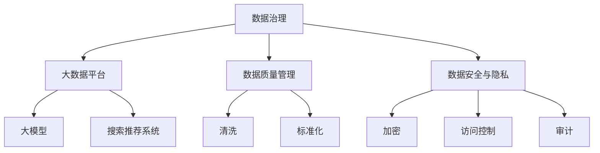

                 

# AI大模型助力电商搜索推荐业务的数据治理工具选型

## 1. 背景介绍

### 1.1 问题由来
随着人工智能技术的快速发展，电商平台开始将人工智能大模型应用到搜索推荐业务中，以提升用户体验和业务指标。然而，庞大的数据量和复杂的业务逻辑对数据治理提出了更高的要求。如何在确保数据质量、实时性和安全性的同时，高效地训练和应用大模型，成为了电商搜索推荐业务中的重要挑战。本文将详细讨论如何选择合适的数据治理工具，以助力大模型在电商搜索推荐业务中的高效应用。

### 1.2 问题核心关键点
本文关注的核心问题是：在电商搜索推荐业务中，如何通过数据治理工具选型，确保大数据平台的高效运行，同时充分利用大模型的能力，提升推荐系统的效果和用户满意度。具体关键点包括：

1. 数据治理工具的选型原则与指标
2. 大模型的应用框架与流程
3. 数据治理工具与大模型的集成方法
4. 数据治理工具的实际应用案例
5. 未来数据治理工具的发展趋势

## 2. 核心概念与联系

### 2.1 核心概念概述

为更好地理解数据治理工具在电商搜索推荐业务中的应用，本节将介绍几个密切相关的核心概念：

- **数据治理**：通过技术和管理手段，确保数据的质量、完整性、一致性、安全性和可访问性，提升数据价值，支撑业务发展。

- **大数据平台**：基于分布式计算和存储技术构建的数据处理基础设施，用于高效存储和处理海量数据，支持数据湖、数据仓库、数据管道等数据治理应用场景。

- **大模型**：基于深度学习架构构建的大型模型，如BERT、GPT等，通过大规模数据预训练，具备强大的语言理解和生成能力，广泛应用于自然语言处理、图像处理、语音识别等领域。

- **搜索推荐系统**：利用用户行为数据、商品信息等，为用户推荐可能感兴趣的商品和搜索结果，以提高用户体验和业务转化率。

- **数据质量管理**：通过清洗、清洗、标准化等手段，确保数据的准确性、一致性和完整性。

- **数据安全与隐私**：通过数据加密、访问控制、审计等技术手段，确保数据在存储、传输和使用过程中的安全性。

这些核心概念之间的逻辑关系可以通过以下Mermaid流程图来展示：



这个流程图展示了大数据平台、大模型和搜索推荐系统的数据治理工作流程：

1. 数据治理通过清洗和标准化等手段提升数据质量。
2. 数据安全与隐私通过加密、访问控制、审计等措施保护数据安全。
3. 大数据平台用于存储和处理数据，为大模型训练和搜索推荐系统部署提供基础设施。
4. 大模型在电商搜索推荐业务中发挥语言理解、生成等能力。
5. 搜索推荐系统通过用户行为和商品信息，为电商用户提供个性化推荐和搜索结果。

这些概念共同构成了电商搜索推荐业务的数据治理框架，使得大模型能够高效地应用于推荐系统中，提升用户体验和业务指标。

## 3. 核心算法原理 & 具体操作步骤

### 3.1 算法原理概述

大模型在电商搜索推荐业务中的应用，依赖于数据的治理和优化。核心算法原理如下：

- **数据收集与清洗**：收集用户行为数据、商品信息、市场环境等，通过清洗、去重等手段，确保数据的准确性和完整性。
- **数据存储与管理**：将清洗后的数据存储到分布式数据平台中，进行归档、备份等操作，确保数据的高可用性和可访问性。
- **数据预处理**：对存储在数据平台中的数据进行标准化、去噪、降维等处理，便于后续大模型训练和应用。
- **大模型训练与优化**：利用预处理后的数据，在大模型上进行训练，并通过微调等手段优化模型参数，提升模型效果。
- **推荐系统构建与部署**：将训练好的大模型部署到电商搜索推荐系统中，根据用户行为数据进行实时推荐，并不断优化推荐算法。

### 3.2 算法步骤详解

大模型在电商搜索推荐业务中的应用流程可以分为以下几个关键步骤：

**Step 1: 数据收集与清洗**

- **用户行为数据收集**：收集用户在电商平台的点击、浏览、购买等行为数据。
- **商品信息收集**：收集商品名称、描述、价格、评价等数据。
- **市场环境收集**：收集市场动态、促销活动、节假日等信息。
- **数据清洗**：使用ETL工具进行数据清洗，包括去重、去噪、填补缺失值等操作。

**Step 2: 数据存储与管理**

- **数据平台搭建**：选择适合的数据平台，如Hadoop、Spark等，搭建大数据存储环境。
- **数据归档与备份**：定期对数据进行归档和备份，确保数据的高可用性和可恢复性。
- **元数据管理**：建立元数据管理机制，确保数据的一致性和可访问性。

**Step 3: 数据预处理**

- **标准化**：将清洗后的数据进行标准化处理，包括统一数据格式、处理异常值等。
- **去噪与降维**：使用PCA、t-SNE等方法对数据进行去噪和降维，提高数据处理效率。
- **数据增强**：使用数据增强技术，生成更多的训练样本，提高模型泛化能力。

**Step 4: 大模型训练与优化**

- **模型选择**：选择合适的预训练模型，如BERT、GPT等，作为大模型的初始化参数。
- **微调**：在电商数据集上进行微调，优化模型参数，提升模型效果。
- **参数高效微调**：采用参数高效微调技术，减少微调参数量，提高模型训练效率。

**Step 5: 推荐系统构建与部署**

- **推荐算法设计**：设计推荐算法，如协同过滤、深度学习推荐等，结合电商搜索推荐业务需求。
- **模型集成**：将训练好的大模型集成到推荐系统中，进行实时推荐。
- **系统优化**：不断优化推荐系统算法，提升推荐效果和用户体验。

### 3.3 算法优缺点

大模型在电商搜索推荐业务中的应用，具有以下优点：

- **推荐效果高**：大模型通过大规模预训练，具备强大的语言理解和生成能力，能够更好地理解用户需求和商品信息，提供精准的推荐结果。
- **用户满意度提升**：通过个性化推荐，提升用户满意度，增加用户粘性，提高业务转化率。
- **业务指标提升**：提高电商搜索推荐业务的点击率、转化率和用户满意度，为业务带来显著增长。

同时，也存在以下缺点：

- **数据处理复杂**：大模型需要海量数据进行训练，数据清洗、预处理等操作复杂。
- **计算资源需求高**：大模型的训练和推理需要大量的计算资源，对硬件要求高。
- **模型调试困难**：大模型的调试和优化过程复杂，需要丰富的经验和专业知识。

### 3.4 算法应用领域

大模型在电商搜索推荐业务中的应用，主要涵盖以下几个领域：

- **商品推荐**：根据用户行为数据和商品信息，为用户推荐可能感兴趣的商品。
- **搜索优化**：根据用户输入的关键词，提供个性化的搜索结果，提升用户体验。
- **市场分析**：通过分析用户行为数据，洞察市场动态，指导电商策略制定。
- **智能客服**：通过大模型进行自然语言处理，实现智能客服，提高客户服务效率。

此外，大模型还可以应用于个性化广告、金融风控、医疗健康等众多领域，带来广泛的应用前景。

## 4. 数学模型和公式 & 详细讲解 & 举例说明

### 4.1 数学模型构建

假设电商搜索推荐业务中的推荐系统基于深度学习模型进行构建，大模型 $M_{\theta}$ 作为基础组件，用于理解用户行为和商品信息。推荐系统分为用户行为建模、商品特征提取和推荐结果生成三个部分。

- **用户行为建模**：使用长短期记忆网络(LSTM)等模型，对用户行为数据进行建模，提取用户兴趣和行为特征。
- **商品特征提取**：使用卷积神经网络(CNN)等模型，对商品信息进行特征提取，得到商品特征向量。
- **推荐结果生成**：将用户行为特征和商品特征向量输入到大模型 $M_{\theta}$，得到推荐结果。

### 4.2 公式推导过程

假设用户行为数据为 $X$，商品特征向量为 $Y$，大模型参数为 $\theta$。推荐系统模型的预测结果为 $Z=M_{\theta}(X, Y)$。模型的损失函数为均方误差损失，即：

$$
\mathcal{L}(\theta) = \frac{1}{N}\sum_{i=1}^N (Z_i - Y_i)^2
$$

其中 $N$ 为样本数量，$Z_i$ 和 $Y_i$ 分别为第 $i$ 个样本的预测结果和真实标签。

大模型 $M_{\theta}$ 的输出为 $Z_i$，可以通过以下公式进行计算：

$$
Z_i = M_{\theta}(X_i, Y_i)
$$

其中 $X_i$ 和 $Y_i$ 分别为第 $i$ 个样本的用户行为数据和商品特征向量。

### 4.3 案例分析与讲解

以电商商品推荐系统为例，分析大模型在推荐系统中的应用。假设大模型为BERT，用户行为数据为点击、浏览、购买等行为，商品信息为名称、描述、价格、评价等。

**Step 1: 数据收集与清洗**

- **数据收集**：收集用户点击、浏览、购买等行为数据，商品名称、描述、价格、评价等信息。
- **数据清洗**：去重、去噪、填补缺失值等，确保数据的准确性和完整性。

**Step 2: 数据存储与管理**

- **数据平台搭建**：搭建Hadoop、Spark等大数据存储环境。
- **数据归档与备份**：定期进行数据归档和备份，确保数据的高可用性和可恢复性。

**Step 3: 数据预处理**

- **标准化**：统一数据格式，处理异常值。
- **去噪与降维**：使用PCA、t-SNE等方法进行去噪和降维。
- **数据增强**：使用数据增强技术，生成更多的训练样本。

**Step 4: 大模型训练与优化**

- **模型选择**：选择BERT作为大模型的初始化参数。
- **微调**：在电商数据集上进行微调，优化模型参数，提升模型效果。
- **参数高效微调**：采用参数高效微调技术，减少微调参数量，提高模型训练效率。

**Step 5: 推荐系统构建与部署**

- **推荐算法设计**：设计协同过滤、深度学习推荐等算法，结合电商搜索推荐业务需求。
- **模型集成**：将训练好的BERT模型集成到推荐系统中，进行实时推荐。
- **系统优化**：不断优化推荐系统算法，提升推荐效果和用户体验。

## 5. 项目实践：代码实例和详细解释说明

### 5.1 开发环境搭建

在开发大模型助力电商搜索推荐业务的数据治理工具时，需要搭建相应的开发环境，包括数据平台、数据处理工具、模型训练工具等。

**Step 1: 搭建数据平台**

- **大数据平台选择**：选择适合的数据平台，如Hadoop、Spark等，搭建大数据存储环境。
- **搭建环境**：根据数据平台文档，搭建开发环境，安装所需的依赖库和工具。

**Step 2: 数据处理工具**

- **ETL工具选择**：选择适合的数据清洗工具，如Pig、Hive等，进行数据清洗和预处理。
- **数据增强工具**：使用数据增强工具，生成更多的训练样本。

**Step 3: 模型训练工具**

- **深度学习框架选择**：选择适合的深度学习框架，如TensorFlow、PyTorch等。
- **模型选择**：选择合适的预训练模型，如BERT、GPT等，作为大模型的初始化参数。
- **微调工具**：使用微调工具，对大模型进行微调。

### 5.2 源代码详细实现

以下是一个基于PyTorch框架的电商商品推荐系统的实现代码：

```python
import torch
import torch.nn as nn
import torch.optim as optim

# 定义BERT模型
class BERT(nn.Module):
    def __init__(self):
        super(BERT, self).__init__()
        # 定义BERT模型的各层
        self.encoder = BERTEncoder()
        self.linear = nn.Linear(768, 1)
    
    def forward(self, user_behavio, item_feature):
        # 将用户行为和商品特征向量拼接
        x = torch.cat([user_behavio, item_feature], dim=1)
        # 使用BERT模型进行编码
        x = self.encoder(x)
        # 线性层输出预测结果
        return self.linear(x)

# 定义数据预处理函数
def preprocess_data(user_behavio, item_feature):
    # 数据标准化
    user_behavio = (user_behavio - user_behavio.mean()) / user_behavio.std()
    item_feature = (item_feature - item_feature.mean()) / item_feature.std()
    # 数据增强
    user_behavio = data_augmentation(user_behavio)
    item_feature = data_augmentation(item_feature)
    # 返回预处理后的数据
    return user_behavio, item_feature

# 定义优化器
optimizer = optim.Adam(model.parameters(), lr=0.001)

# 定义损失函数
criterion = nn.MSELoss()

# 定义训练函数
def train_epoch(model, user_behavio, item_feature, labels):
    model.train()
    optimizer.zero_grad()
    # 前向传播
    predictions = model(user_behavio, item_feature)
    # 计算损失函数
    loss = criterion(predictions, labels)
    # 反向传播
    loss.backward()
    # 更新参数
    optimizer.step()
    # 返回损失值
    return loss.item()

# 训练模型
for epoch in range(num_epochs):
    train_loss = 0.0
    for user_behavio, item_feature, labels in train_loader:
        # 获取当前批次的数据
        user_behavio = preprocess_data(user_behavio, item_feature)
        labels = preprocess_data(labels)
        # 计算当前批次的损失
        train_loss += train_epoch(model, user_behavio, item_feature, labels)
    print(f"Epoch {epoch+1}, train loss: {train_loss/len(train_loader):.4f}")
```

### 5.3 代码解读与分析

**Step 1: 搭建数据平台**

- **Hadoop搭建**：安装Hadoop环境，配置HDFS、YARN等组件。
- **Spark搭建**：安装Spark环境，配置Spark Core、Spark SQL等组件。

**Step 2: 数据处理工具**

- **ETL工具**：使用Pig或Hive等ETL工具，对用户行为数据和商品信息进行清洗、去重、去噪、降维等操作。
- **数据增强**：使用数据增强技术，如随机旋转、裁剪等，生成更多的训练样本。

**Step 3: 模型训练工具**

- **深度学习框架**：选择TensorFlow或PyTorch等深度学习框架，进行大模型的训练和微调。
- **模型选择**：选择合适的预训练模型，如BERT、GPT等，作为大模型的初始化参数。
- **微调工具**：使用微调工具，对大模型进行微调，优化模型参数。

**Step 4: 代码实现**

- **BERT模型定义**：定义BERT模型，包括编码器和线性层等组件。
- **数据预处理函数**：定义数据预处理函数，包括标准化、数据增强等操作。
- **优化器和损失函数**：定义优化器和损失函数，用于模型训练。
- **训练函数**：定义训练函数，对模型进行训练。

## 6. 实际应用场景

### 6.1 智能客服系统

在智能客服系统中，大模型可以用于自然语言处理，实现智能问答、智能路由等应用。通过微调，大模型可以理解用户输入的文本，并根据预定的规则和知识库，给出合适的回复或进行路由分配，提升客服系统的智能化水平。

### 6.2 金融舆情监测

在金融舆情监测系统中，大模型可以用于情感分析、舆情趋势预测等任务。通过微调，大模型能够自动理解新闻、评论等文本内容，预测舆情走向，帮助金融机构及时应对舆情变化，规避风险。

### 6.3 个性化推荐系统

在个性化推荐系统中，大模型可以用于推荐算法的设计和优化。通过微调，大模型可以学习用户的行为和商品信息，为用户推荐个性化的商品，提升用户体验和业务转化率。

### 6.4 未来应用展望

未来，大模型在电商搜索推荐业务中的应用将更加广泛。随着技术的进步和数据的积累，大模型将能够更好地理解用户需求和商品信息，提供更精准、更个性化的推荐结果，提升用户体验和业务指标。

## 7. 工具和资源推荐

### 7.1 学习资源推荐

为帮助开发者系统掌握大模型在电商搜索推荐业务中的应用，以下是一些优质的学习资源：

- **《深度学习》课程**：斯坦福大学开设的深度学习课程，涵盖深度学习基础和应用案例。
- **《PyTorch官方文档》**：PyTorch官方文档，提供详细的使用指南和API参考。
- **《深度学习理论与实践》书籍**：介绍深度学习理论和实践，涵盖深度学习模型、训练和优化等主题。

### 7.2 开发工具推荐

为提高大模型在电商搜索推荐业务中的开发效率，以下是一些常用的开发工具：

- **Hadoop**：大数据平台，支持大规模数据存储和处理。
- **Spark**：大数据计算框架，支持分布式数据处理。
- **TensorFlow**：深度学习框架，支持大模型的训练和微调。
- **PyTorch**：深度学习框架，支持动态图和静态图计算。

### 7.3 相关论文推荐

为深入理解大模型在电商搜索推荐业务中的应用，以下是一些相关论文：

- **《深度学习在电商推荐系统中的应用》**：介绍深度学习在电商推荐系统中的应用，涵盖协同过滤、深度学习推荐等算法。
- **《基于大模型的电商搜索推荐系统》**：探讨大模型在电商搜索推荐系统中的应用，涵盖数据清洗、预处理、训练和优化等技术。
- **《大模型在金融舆情监测中的应用》**：探讨大模型在金融舆情监测中的应用，涵盖情感分析、舆情趋势预测等技术。

## 8. 总结：未来发展趋势与挑战

### 8.1 研究成果总结

本文对大模型在电商搜索推荐业务中的应用进行了详细讨论，主要内容包括：

- 数据治理工具的选型原则与指标。
- 大模型的应用框架与流程。
- 数据治理工具与大模型的集成方法。
- 数据治理工具的实际应用案例。
- 未来数据治理工具的发展趋势。

### 8.2 未来发展趋势

未来，大模型在电商搜索推荐业务中的应用将呈现以下发展趋势：

- **实时性提升**：通过流式计算和大数据平台，实现实时推荐。
- **模型精度提升**：通过更好的预训练和微调方法，提高模型精度。
- **多模态融合**：结合文本、图像、音频等多模态数据，提升推荐效果。
- **跨领域迁移**：通过迁移学习，在大模型中学习通用知识，应用于不同领域。

### 8.3 面临的挑战

尽管大模型在电商搜索推荐业务中的应用前景广阔，但仍面临诸多挑战：

- **数据质量问题**：电商数据量大且复杂，数据质量管理困难。
- **计算资源限制**：大模型的训练和推理需要大量计算资源，硬件成本高。
- **模型复杂性**：大模型参数量庞大，模型调试和优化复杂。

### 8.4 研究展望

未来，需要从以下几个方向进行研究：

- **数据治理技术**：研究如何通过数据清洗、标准化、增强等手段，提升数据质量。
- **大模型优化**：研究如何通过优化算法、参数高效微调等手段，提高模型训练效率。
- **多模态融合**：研究如何通过多模态数据融合，提升推荐效果。
- **跨领域迁移**：研究如何通过迁移学习，在大模型中学习通用知识，应用于不同领域。

通过不断探索和创新，未来大模型在电商搜索推荐业务中的应用将更加高效、智能和精准，为用户带来更好的体验。

## 9. 附录：常见问题与解答

### 9.1 问题1：电商数据质量管理如何实施？

**解答**：电商数据质量管理可以通过以下步骤实施：

1. 数据清洗：去除重复、异常、缺失数据。
2. 数据标准化：统一数据格式，标准化数据格式。
3. 数据增强：生成更多的训练样本，提高模型泛化能力。
4. 数据监控：定期监控数据质量，及时发现和处理异常数据。

### 9.2 问题2：大模型训练和推理耗时过长怎么办？

**解答**：大模型训练和推理耗时过长可以通过以下方法解决：

1. 硬件升级：使用GPU/TPU等高性能硬件设备。
2. 模型优化：采用剪枝、量化等技术，减小模型参数量。
3. 分布式训练：使用分布式训练框架，加速模型训练。
4. 微调策略：采用参数高效微调等策略，减小微调参数量。

### 9.3 问题3：如何提高电商推荐系统的准确性？

**解答**：提高电商推荐系统的准确性可以通过以下方法：

1. 数据治理：确保数据质量，提高数据准确性。
2. 模型优化：通过参数优化、超参数调优等方法，提高模型精度。
3. 多模态融合：结合文本、图像、音频等多模态数据，提升推荐效果。
4. 模型集成：采用集成学习等方法，结合多个模型，提升推荐系统准确性。

---

作者：禅与计算机程序设计艺术 / Zen and the Art of Computer Programming

