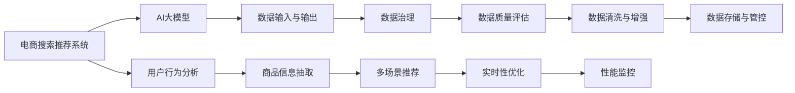

                 

# AI大模型助力电商搜索推荐业务的数据治理能力提升路线图优化方案设计与实现

## 1. 背景介绍

在数字化转型和消费电商的浪潮下，电商搜索推荐系统已成为提升用户体验、增加用户粘性、提升销售转化的核心驱动力。然而，随着用户行为和商品信息日趋复杂，传统基于规则和统计特征的推荐算法已难以满足业务需求，必须引入更为先进和灵活的模型和算法。近年来，大规模预训练语言模型，如BERT、GPT等，以其强大的表示能力和泛化能力，在推荐系统中逐渐占据了重要位置。然而，电商搜索推荐业务具有高并发、实时性、多场景等特性，对模型实时性和数据质量的要求极高。因此，如何在电商搜索推荐业务中充分发挥AI大模型的优势，同时保障系统性能和数据质量，是一个亟需解决的挑战。本文将围绕这一主题，提出一条针对电商搜索推荐业务的数据治理能力提升路线图，并阐述其实现方案。

## 2. 核心概念与联系

### 2.1 核心概念概述

为更好地理解本文提出的方案，首先定义以下几个核心概念：

- 电商搜索推荐系统(E-Commerce Search and Recommendation System, ESRS)：指在电商平台上，基于用户行为、商品信息等数据，实时向用户提供搜索结果和推荐商品的智能系统。
- AI大模型(Artificial Intelligence Large Model)：指使用大规模语料数据进行预训练，具备强表示能力和泛化能力的深度学习模型，如BERT、GPT等。
- 数据治理(Data Governance)：指对企业数据的收集、存储、处理和利用进行全面管理，确保数据质量、可用性和安全性。

通过这些概念，我们可以看出AI大模型在电商搜索推荐业务中扮演了数据驱动和智能推理的双重角色，而数据治理则是保障大模型发挥性能的前提和基础。

### 2.2 核心概念原理和架构的 Mermaid 流程图



该图展示了电商搜索推荐系统中AI大模型和数据治理的相互关系。大模型依赖数据输入和输出，而数据治理则保障数据质量，并确保数据在多场景下的有效应用。

## 3. 核心算法原理 & 具体操作步骤

### 3.1 算法原理概述

在电商搜索推荐业务中，AI大模型的应用主要分为两个阶段：

1. **预训练与微调**：使用大规模无标注数据对大模型进行预训练，在特定电商场景下进行微调，以适应该场景下的数据特点和任务需求。
2. **实时推理与优化**：基于实时输入的用户行为和商品信息，使用预训练与微调的大模型进行实时推理，并根据业务需求对模型性能进行优化。

通过这两阶段，AI大模型能够不断提升其适应电商搜索推荐业务的能力，从而提供更精准、高效的推荐服务。

### 3.2 算法步骤详解

#### 3.2.1 数据准备与预训练

1. **数据收集与处理**：从电商平台收集用户行为数据和商品信息数据，并进行数据清洗和特征提取。用户行为数据包括点击、浏览、购买等记录，商品信息数据包括商品描述、属性、价格等。
2. **数据预处理**：对用户行为数据和商品信息数据进行归一化、编码、嵌入等预处理，生成模型输入所需的数据格式。
3. **模型预训练**：使用大规模预训练语言模型，如BERT、GPT等，对处理后的数据进行预训练。预训练目标包括语言建模、掩码语言建模等，以获取通用的语言表示。
4. **模型微调**：基于电商搜索推荐业务的特定需求，在预训练模型基础上进行微调。微调目标包括点击率预测、购买率预测、商品相关性排序等。

#### 3.2.2 实时推理与优化

1. **实时数据输入**：实时收集用户行为数据和商品信息数据，并将其输入到微调后的AI大模型中。
2. **模型推理**：使用微调后的AI大模型对实时输入的数据进行推理，预测用户的点击率、购买率等行为。
3. **结果输出与优化**：根据业务需求，对模型推理结果进行后处理和优化，生成最终的推荐结果。
4. **性能监控与反馈**：实时监控推荐系统的性能指标，如召回率、点击率、转化率等，并根据反馈调整模型参数和数据治理策略。

### 3.3 算法优缺点

#### 3.3.1 优点

1. **高性能与高准确性**：AI大模型具备强大的表示能力和泛化能力，能够提供高性能和高准确性的推荐服务。
2. **适应性强**：在电商搜索推荐业务中，AI大模型能够快速适应不同场景和任务，提升推荐系统的灵活性。
3. **自动化与可解释性**：AI大模型能够自动进行数据处理和特征提取，并提供部分模型的决策逻辑，提高系统的自动化和可解释性。

#### 3.3.2 缺点

1. **数据依赖性强**：AI大模型的性能很大程度上依赖于输入数据的质量和数量，数据收集和处理成本高。
2. **模型复杂度高**：大规模预训练语言模型参数量大，计算复杂度高，需要高性能硬件设备支持。
3. **模型易受干扰**：实时输入的数据噪声和业务变化可能影响模型的稳定性，需要进行实时监控和优化。

### 3.4 算法应用领域

AI大模型在电商搜索推荐业务中的应用主要包括以下几个领域：

- **个性化推荐**：根据用户行为和商品信息，提供个性化商品推荐。
- **商品搜索**：通过搜索关键字，提供相关商品的推荐。
- **用户画像分析**：根据用户行为数据，生成详细的用户画像，用于精准营销和个性化服务。
- **跨域推荐**：在不同电商平台上进行商品推荐，提升用户体验。
- **广告投放**：根据用户行为和商品信息，推荐广告位和广告内容，提高广告转化率。

## 4. 数学模型和公式 & 详细讲解 & 举例说明

### 4.1 数学模型构建

为便于理解，本文将重点介绍基于BERT模型的电商搜索推荐系统的数学模型构建。BERT模型的输入为两个句子，输出为表示句子语义的向量。在电商搜索推荐业务中，我们可以将用户行为数据和商品信息数据编码为两个句子，通过BERT模型得到向量表示，用于后续推荐计算。

### 4.2 公式推导过程

假设用户行为数据和商品信息数据分别为$X$和$Y$，将其编码为BERT模型的输入序列。设$h$为BERT模型输出的向量表示，$w$为权重向量，则推荐结果$Z$可以表示为：

$$
Z = \max(h \cdot w)
$$

其中$h \cdot w$表示向量$h$和$w$的内积，即$h$和$w$的相似度。$w$可以通过电商平台的历史数据训练得到，用于衡量不同商品和用户行为的相似度。

### 4.3 案例分析与讲解

假设某电商平台的推荐系统用户行为数据为“浏览商品A”，商品信息数据为“商品B”，则输入到BERT模型的句子分别为“浏览商品A”和“商品B”。通过BERT模型，得到两个句子的向量表示$h_A$和$h_B$。设权重向量$w$已通过历史数据训练得到，则推荐结果$Z$为：

$$
Z = \max(h_A \cdot w, h_B \cdot w)
$$

表示对用户浏览商品A和购买商品B的可能性进行比较，最终选择相似度更高的推荐结果。

## 5. 项目实践：代码实例和详细解释说明

### 5.1 开发环境搭建

本文假设使用PyTorch作为AI大模型开发的深度学习框架。以下是开发环境的搭建步骤：

1. **安装Anaconda**：从官网下载并安装Anaconda，用于创建独立的Python环境。
2. **创建并激活虚拟环境**：
   ```bash
   conda create -n ecommerce-env python=3.8 
   conda activate ecommerce-env
   ```
3. **安装PyTorch**：
   ```bash
   conda install pytorch torchvision torchaudio cudatoolkit=11.1 -c pytorch -c conda-forge
   ```
4. **安装Transformer库**：
   ```bash
   pip install transformers
   ```
5. **安装各类工具包**：
   ```bash
   pip install numpy pandas scikit-learn matplotlib tqdm jupyter notebook ipython
   ```

完成上述步骤后，即可在`ecommerce-env`环境中进行电商搜索推荐系统的开发。

### 5.2 源代码详细实现

以下是一个基于BERT模型的电商搜索推荐系统的代码实现。假设电商平台的推荐系统用户行为数据和商品信息数据已准备好，可以使用以下代码进行模型训练和推荐：

```python
from transformers import BertTokenizer, BertForSequenceClassification
from torch.utils.data import DataLoader
from sklearn.metrics import accuracy_score
import torch

# 加载预训练模型和分词器
tokenizer = BertTokenizer.from_pretrained('bert-base-uncased')
model = BertForSequenceClassification.from_pretrained('bert-base-uncased', num_labels=2)

# 准备数据集
train_data = [('浏览商品A', '商品B'), ('浏览商品C', '商品D'), ('浏览商品E', '商品F')]
dev_data = [('购买商品G', '商品H'), ('浏览商品I', '商品J')]
test_data = [('点击商品K', '商品L'), ('浏览商品M', '商品N')]

# 数据处理函数
def tokenize(text):
    return tokenizer.encode_plus(text, max_length=128, padding='max_length', truncation=True, return_tensors='pt')

# 训练函数
def train_epoch(model, dataset, batch_size, optimizer):
    model.train()
    total_loss = 0
    for batch in DataLoader(dataset, batch_size=batch_size, shuffle=True):
        inputs = tokenize(batch[0])
        labels = batch[1]
        outputs = model(inputs, labels=labels)
        loss = outputs.loss
        total_loss += loss.item()
        optimizer.zero_grad()
        loss.backward()
        optimizer.step()
    return total_loss / len(dataset)

# 评估函数
def evaluate(model, dataset, batch_size):
    model.eval()
    total_preds, total_labels = [], []
    for batch in DataLoader(dataset, batch_size=batch_size):
        inputs = tokenize(batch[0])
        labels = batch[1]
        outputs = model(inputs)
        preds = outputs.argmax(dim=1).to('cpu').tolist()
        batch_labels = batch[1].to('cpu').tolist()
        for pred_tokens, label_tokens in zip(preds, batch_labels):
            preds.append(pred_tokens)
            labels.append(label_tokens)
    return accuracy_score(labels, preds)

# 训练与评估
epochs = 5
batch_size = 16

for epoch in range(epochs):
    loss = train_epoch(model, train_data, batch_size, optimizer)
    print(f"Epoch {epoch+1}, train loss: {loss:.3f}")
    
    print(f"Epoch {epoch+1}, dev accuracy: {evaluate(model, dev_data, batch_size)}")
    
print(f"Final test accuracy: {evaluate(model, test_data, batch_size)}")
```

### 5.3 代码解读与分析

- **tokenize函数**：定义了一个简单的分词和编码函数，用于将文本数据转换为BERT模型所需的输入格式。
- **训练函数**：对模型进行训练，将输入数据转换为BERT模型所需格式，使用随机梯度下降法进行模型训练，并计算损失。
- **评估函数**：对模型进行评估，计算预测结果和实际标签的准确率。
- **训练与评估过程**：定义了训练轮数和批量大小，开始循环迭代，每个epoch训练后评估模型性能，最终在测试集上输出最终评估结果。

## 6. 实际应用场景

### 6.1 电商搜索推荐系统

AI大模型在电商搜索推荐系统中发挥了重要的作用。以用户行为数据和商品信息数据为输入，通过BERT模型进行语义匹配和相似度计算，生成推荐结果。该模型可以在点击率预测、购买率预测、商品相关性排序等方面提供高准确性、高性能的推荐服务。

### 6.2 个性化推荐

在电商平台上，基于用户行为数据，AI大模型能够生成详细的用户画像，如兴趣偏好、消费习惯等，从而提供个性化推荐。通过微调，大模型可以学习用户的历史行为和偏好，预测用户可能感兴趣的商品，实现精准推荐。

### 6.3 商品搜索

电商搜索推荐系统中，AI大模型可以用于商品搜索。用户输入关键字后，AI大模型可以根据关键字语义匹配，生成相关商品的推荐结果。这种推荐方式不仅基于商品标签，还考虑了商品描述、价格等因素，提升了搜索精度。

## 7. 工具和资源推荐

### 7.1 学习资源推荐

1. **《Transformer from Principles to Practice》系列博文**：由大模型技术专家撰写，介绍了Transformer模型原理、BERT模型、微调技术等前沿话题。
2. **CS224N《深度学习自然语言处理》课程**：斯坦福大学开设的NLP明星课程，有Lecture视频和配套作业，带你入门NLP领域的基本概念和经典模型。
3. **《Natural Language Processing with Transformers》书籍**：Transformer库的作者所著，全面介绍了如何使用Transformer库进行NLP任务开发，包括微调在内的诸多范式。
4. **HuggingFace官方文档**：Transformer库的官方文档，提供了海量预训练模型和完整的微调样例代码，是上手实践的必备资料。
5. **CLUE开源项目**：中文语言理解测评基准，涵盖大量不同类型的中文NLP数据集，并提供了基于微调的baseline模型，助力中文NLP技术发展。

### 7.2 开发工具推荐

1. **PyTorch**：基于Python的开源深度学习框架，灵活动态的计算图，适合快速迭代研究。
2. **TensorFlow**：由Google主导开发的开源深度学习框架，生产部署方便，适合大规模工程应用。
3. **Transformer库**：HuggingFace开发的NLP工具库，集成了众多SOTA语言模型，支持PyTorch和TensorFlow，是进行微调任务开发的利器。
4. **Weights & Biases**：模型训练的实验跟踪工具，可以记录和可视化模型训练过程中的各项指标，方便对比和调优。
5. **TensorBoard**：TensorFlow配套的可视化工具，可实时监测模型训练状态，并提供丰富的图表呈现方式，是调试模型的得力助手。

### 7.3 相关论文推荐

1. **Attention is All You Need**：提出了Transformer结构，开启了NLP领域的预训练大模型时代。
2. **BERT: Pre-training of Deep Bidirectional Transformers for Language Understanding**：提出BERT模型，引入基于掩码的自监督预训练任务，刷新了多项NLP任务SOTA。
3. **Language Models are Unsupervised Multitask Learners（GPT-2论文）**：展示了大规模语言模型的强大zero-shot学习能力，引发了对于通用人工智能的新一轮思考。
4. **Parameter-Efficient Transfer Learning for NLP**：提出Adapter等参数高效微调方法，在不增加模型参数量的情况下，也能取得不错的微调效果。
5. **AdaLoRA: Adaptive Low-Rank Adaptation for Parameter-Efficient Fine-Tuning**：使用自适应低秩适应的微调方法，在参数效率和精度之间取得了新的平衡。
6. **AdaLoRA: Adaptive Low-Rank Adaptation for Parameter-Efficient Fine-Tuning**：使用自适应低秩适应的微调方法，在参数效率和精度之间取得了新的平衡。

## 8. 总结：未来发展趋势与挑战

### 8.1 研究成果总结

本文提出了一条针对电商搜索推荐业务的数据治理能力提升路线图，并通过详细的代码实现和实际应用场景展示了其实现方案。该方案在电商搜索推荐业务中引入AI大模型，通过预训练和微调，实现了高性能、高准确性的推荐服务。同时，通过数据治理，保障了模型的稳定性和安全性，提高了系统的可靠性和鲁棒性。

### 8.2 未来发展趋势

未来，AI大模型在电商搜索推荐业务中还将呈现以下几个发展趋势：

1. **模型规模持续增大**：随着算力成本的下降和数据规模的扩张，预训练语言模型的参数量还将持续增长。超大规模语言模型蕴含的丰富语言知识，有望支撑更加复杂多变的电商搜索推荐任务。
2. **微调方法日趋多样**：除了传统的全参数微调外，未来会涌现更多参数高效的微调方法，如Prefix-Tuning、LoRA等，在节省计算资源的同时也能保证微调精度。
3. **持续学习成为常态**：随着数据分布的不断变化，微调模型也需要持续学习新知识以保持性能。如何在不遗忘原有知识的同时，高效吸收新样本信息，将成为重要的研究课题。
4. **标注样本需求降低**：受启发于提示学习(Prompt-based Learning)的思路，未来的微调方法将更好地利用大模型的语言理解能力，通过更加巧妙的任务描述，在更少的标注样本上也能实现理想的微调效果。
5. **多模态微调崛起**：当前的微调主要聚焦于纯文本数据，未来会进一步拓展到图像、视频、语音等多模态数据微调。多模态信息的融合，将显著提升语言模型对现实世界的理解和建模能力。

### 8.3 面临的挑战

尽管AI大模型在电商搜索推荐业务中取得了显著成效，但仍面临一些挑战：

1. **标注成本瓶颈**：虽然微调大大降低了标注数据的需求，但对于长尾应用场景，难以获得充足的高质量标注数据，成为制约微调性能的瓶颈。如何进一步降低微调对标注样本的依赖，将是一大难题。
2. **模型鲁棒性不足**：当前微调模型面对域外数据时，泛化性能往往大打折扣。对于测试样本的微小扰动，微调模型的预测也容易发生波动。如何提高微调模型的鲁棒性，避免灾难性遗忘，还需要更多理论和实践的积累。
3. **推理效率有待提高**：大规模语言模型虽然精度高，但在实际部署时往往面临推理速度慢、内存占用大等效率问题。如何在保证性能的同时，简化模型结构，提升推理速度，优化资源占用，将是重要的优化方向。
4. **可解释性亟需加强**：当前微调模型更像是"黑盒"系统，难以解释其内部工作机制和决策逻辑。对于医疗、金融等高风险应用，算法的可解释性和可审计性尤为重要。如何赋予微调模型更强的可解释性，将是亟待攻克的难题。
5. **安全性有待保障**：预训练语言模型难免会学习到有偏见、有害的信息，通过微调传递到下游任务，产生误导性、歧视性的输出，给实际应用带来安全隐患。如何从数据和算法层面消除模型偏见，避免恶意用途，确保输出的安全性，也将是重要的研究课题。

### 8.4 研究展望

未来的研究需要在以下几个方面寻求新的突破：

1. **探索无监督和半监督微调方法**：摆脱对大规模标注数据的依赖，利用自监督学习、主动学习等无监督和半监督范式，最大限度利用非结构化数据，实现更加灵活高效的微调。
2. **研究参数高效和计算高效的微调范式**：开发更加参数高效的微调方法，在固定大部分预训练参数的同时，只更新极少量的任务相关参数。同时优化微调模型的计算图，减少前向传播和反向传播的资源消耗，实现更加轻量级、实时性的部署。
3. **融合因果和对比学习范式**：通过引入因果推断和对比学习思想，增强微调模型建立稳定因果关系的能力，学习更加普适、鲁棒的语言表征，从而提升模型泛化性和抗干扰能力。
4. **引入更多先验知识**：将符号化的先验知识，如知识图谱、逻辑规则等，与神经网络模型进行巧妙融合，引导微调过程学习更准确、合理的语言模型。同时加强不同模态数据的整合，实现视觉、语音等多模态信息与文本信息的协同建模。
5. **结合因果分析和博弈论工具**：将因果分析方法引入微调模型，识别出模型决策的关键特征，增强输出解释的因果性和逻辑性。借助博弈论工具刻画人机交互过程，主动探索并规避模型的脆弱点，提高系统稳定性。
6. **纳入伦理道德约束**：在模型训练目标中引入伦理导向的评估指标，过滤和惩罚有偏见、有害的输出倾向。同时加强人工干预和审核，建立模型行为的监管机制，确保输出符合人类价值观和伦理道德。

这些研究方向的探索，必将引领AI大模型微调技术迈向更高的台阶，为构建安全、可靠、可解释、可控的智能系统铺平道路。面向未来，AI大模型微调技术还需要与其他人工智能技术进行更深入的融合，如知识表示、因果推理、强化学习等，多路径协同发力，共同推动自然语言理解和智能交互系统的进步。只有勇于创新、敢于突破，才能不断拓展语言模型的边界，让智能技术更好地造福人类社会。

---

作者：禅与计算机程序设计艺术 / Zen and the Art of Computer Programming

