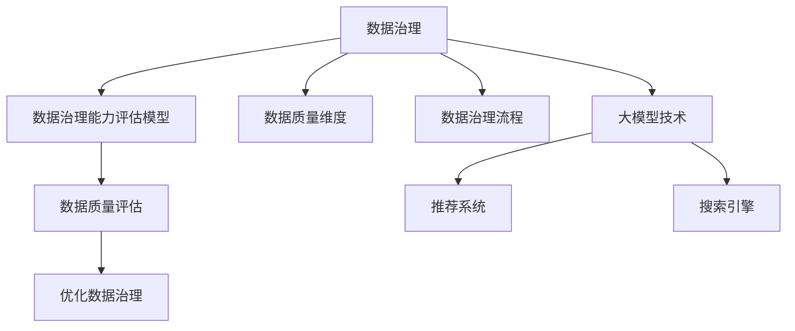

                 

# AI大模型助力电商搜索推荐业务的数据治理能力评估模型应用实践与优化

> 关键词：AI大模型,数据治理能力评估模型,电商搜索推荐,数据质量,算法优化,算法评估

## 1. 背景介绍

### 1.1 问题由来
在电子商务领域，搜索引擎和推荐系统是用户与平台互动的重要环节。它们依赖于海量的用户行为数据，利用复杂算法进行实时计算，为用户推送个性化内容和商品，提升用户体验。然而，数据质量的好坏直接决定了搜索引擎和推荐系统的效果。数据中可能包含噪声、重复、不完整等问题，这些问题不仅会降低模型性能，还会带来显著的运营风险。

数据治理（Data Governance）是指通过一系列技术和规则，对数据进行标准化、清洗、审计和管理的过程，保证数据质量，提升数据利用率。电商搜索推荐系统的大模型技术，需要在大量数据上训练出高质量的模型，并持续进行微调，以适应用户行为的变化。数据治理能力评估模型（Data Governance Capability Evaluation Model）可以通过对数据治理的效果进行量化评估，帮助电商平台优化数据质量，提升搜索推荐效果。

### 1.2 问题核心关键点
本节将介绍数据治理能力评估模型的核心概念和关键技术，包括：

- **数据治理**：对数据进行标准化、清洗、审计和管理的全面过程。
- **数据治理能力评估**：通过量化指标对数据治理的效果进行评估，提供优化方向。
- **大模型技术**：使用AI大模型进行推荐搜索，能够利用大量数据进行训练，快速迭代和优化。
- **推荐系统**：利用用户行为数据和模型预测进行个性化推荐，提升用户体验。
- **搜索引擎**：对用户输入的查询进行精准匹配，提供相关搜索结果。

这些概念之间的联系紧密，通过大模型技术，可以在数据治理的基础上，构建高效、准确的推荐系统和搜索引擎，实现个性化搜索推荐，提升用户满意度。

### 1.3 问题研究意义
数据治理能力评估模型在电商搜索推荐系统中的应用，具有重要意义：

1. **提升数据质量**：通过系统化的评估和管理，提升数据的完整性、准确性和一致性，为模型训练提供高质量的基础。
2. **优化搜索推荐**：通过量化评估数据治理的效果，可以针对性地优化数据治理流程，提升推荐系统的精准度和召回率。
3. **降低运营风险**：数据质量问题会影响推荐系统的稳定性和效果，评估模型可以帮助识别和解决潜在问题，降低运营风险。
4. **增强用户满意度**：优质的数据和高效的推荐算法，可以提供更加精准和个性化的搜索结果，提升用户体验。
5. **推动电商业务增长**：高质量的推荐和搜索服务，可以增强用户粘性，提升购物转化率，推动电商业务的增长。

通过数据治理能力评估模型的实践和优化，电商平台可以构建更高效、更可靠的搜索推荐系统，为用户提供更优质的服务，实现业务的持续增长。

## 2. 核心概念与联系

### 2.1 核心概念概述

为更好地理解数据治理能力评估模型的核心概念和关键技术，本节将介绍几个密切相关的核心概念：

- **数据治理能力评估模型**：一种通过量化指标评估数据治理效果的模型，用于指导和优化数据治理流程，提升数据质量。
- **数据质量维度**：数据治理过程中需要关注的质量维度，如完整性、准确性、一致性、及时性、安全性等。
- **数据治理流程**：包括数据标准化、数据清洗、数据审计、数据管理等环节，旨在提升数据质量。
- **大模型技术**：指使用大规模预训练语言模型进行推荐搜索的技术，能够利用海量的用户行为数据进行模型训练和微调。
- **推荐系统**：通过用户行为数据和模型预测，为用户推荐个性化内容，提升用户体验。
- **搜索引擎**：对用户查询进行精准匹配，提供相关搜索结果。

这些核心概念之间的逻辑关系可以通过以下Mermaid流程图来展示：



这个流程图展示了数据治理、数据治理能力评估模型、数据质量维度、数据治理流程、大模型技术、推荐系统、搜索引擎之间的联系：

1. 数据治理通过标准化、清洗、审计和管理等流程，提升数据质量。
2. 数据治理能力评估模型通过量化指标，对数据治理的效果进行评估，指导和优化数据治理流程。
3. 大模型技术利用海量用户行为数据进行推荐搜索，提升模型的准确性和泛化能力。
4. 推荐系统通过用户行为数据和模型预测，提供个性化推荐，提升用户体验。
5. 搜索引擎对用户查询进行精准匹配，提供相关搜索结果。

这些概念共同构成了电商搜索推荐系统的数据治理和算法优化框架，使其能够高效、准确地为用户提供推荐和搜索结果。

## 3. 核心算法原理 & 具体操作步骤

### 3.1 算法原理概述

数据治理能力评估模型的核心思想是通过一系列量化指标，对数据治理的效果进行评估，提供优化方向。其基本流程包括数据收集、数据清洗、数据审计和模型训练等步骤。

模型训练是数据治理能力评估模型的核心，通过选择合适的算法和数据集，训练出一个评估模型，用于量化评估数据治理的效果。模型的评估指标包括准确率、召回率、F1分数、AUC等。

具体而言，数据治理能力评估模型包括两个主要部分：

1. **数据治理评估指标**：包括数据完整性、数据准确性、数据一致性、数据及时性、数据安全性等指标。
2. **模型训练算法**：包括监督学习、无监督学习、半监督学习等算法，用于训练评估模型。

### 3.2 算法步骤详解

数据治理能力评估模型的主要步骤如下：

**Step 1: 数据收集**
- 收集电商平台的各类数据，包括用户行为数据、商品信息数据、交易数据等。
- 对数据进行初步清洗，去除噪声、重复等不完整的数据。
- 使用数据标注工具对数据进行初步标注，划分训练集和测试集。

**Step 2: 数据清洗**
- 对数据进行详细的清洗，包括缺失值处理、异常值检测、数据归一化等。
- 使用数据清洗工具对数据进行自动化处理，提高数据清洗效率。
- 对清洗后的数据进行可视化，检查数据质量。

**Step 3: 数据审计**
- 对清洗后的数据进行审计，包括数据源审计、数据质量审计、数据一致性审计等。
- 使用数据审计工具对数据进行自动化的审计，提供审计报告。
- 根据审计报告进行数据质量优化，如补充缺失数据、纠正异常数据等。

**Step 4: 模型训练**
- 选择合适的算法和数据集，训练数据治理能力评估模型。
- 使用监督学习、无监督学习、半监督学习等算法进行模型训练。
- 在训练集上训练模型，使用测试集评估模型性能，优化模型参数。

**Step 5: 模型应用**
- 将训练好的评估模型应用于电商平台的搜索推荐系统中。
- 实时监控数据质量，及时发现和解决数据治理问题。
- 根据模型评估结果，优化数据治理流程，提升数据质量。

### 3.3 算法优缺点

数据治理能力评估模型的优点：

1. **全面评估数据质量**：通过量化指标，对数据完整性、准确性、一致性、及时性、安全性等进行全面评估，提供优化方向。
2. **自动化流程优化**：使用数据清洗、审计、评估等自动化工具，提高数据治理效率。
3. **实时监控数据质量**：通过实时监控数据质量，及时发现和解决数据治理问题，提升数据质量。
4. **提高推荐系统效果**：通过优化数据治理流程，提升推荐系统的准确性和召回率，提升用户体验。
5. **降低运营风险**：通过数据质量评估，降低推荐系统的不稳定性，提升运营稳定性。

数据治理能力评估模型的缺点：

1. **数据标注成本高**：需要大量人工标注数据，成本较高。
2. **模型复杂度较高**：算法复杂度较高，模型训练需要较强的计算资源。
3. **模型更新困难**：模型训练和优化需要持续迭代，更新困难。
4. **数据治理难度大**：数据治理涉及多个环节，复杂度高。

尽管存在这些局限性，但数据治理能力评估模型仍然是大规模电商搜索推荐系统中不可或缺的技术手段。通过持续优化和改进，可以显著提升数据质量，降低运营风险，提高用户体验。

### 3.4 算法应用领域

数据治理能力评估模型已经在电商搜索推荐系统、金融风控、医疗诊断等多个领域得到了广泛应用，为数据质量提升和业务优化提供了重要支持。

在电商搜索推荐系统中，数据治理能力评估模型可以应用于以下场景：

1. **用户行为数据分析**：通过分析用户浏览、点击、购买等行为数据，进行数据质量评估，优化数据治理流程。
2. **商品信息数据处理**：对商品信息进行标准化、清洗、审计，提升商品数据的完整性和准确性。
3. **交易数据处理**：对交易数据进行清洗、审计和评估，确保交易数据的质量和安全。
4. **推荐系统效果评估**：通过评估推荐系统的准确性和召回率，提供优化方向，提升推荐系统效果。
5. **搜索引擎效果评估**：通过评估搜索引擎的精准度和覆盖率，提供优化方向，提升搜索效果。

除了电商搜索推荐系统，数据治理能力评估模型还可以应用于金融风控、医疗诊断、智能制造等多个领域，帮助企业提升数据治理能力，优化业务流程，降低运营风险。

## 4. 数学模型和公式 & 详细讲解 & 举例说明

### 4.1 数学模型构建

本节将使用数学语言对数据治理能力评估模型的数学模型进行更加严格的刻画。

设数据集为 $D=\{(x_i,y_i)\}_{i=1}^N$，其中 $x_i$ 为输入特征，$y_i$ 为对应的标签。数据治理能力评估模型的目标是通过训练一个分类器 $h(x)$，使得分类器在测试集上的分类准确率最大化。

设模型在训练集上的损失函数为 $\ell(h)$，在测试集上的评估指标为 $\text{Acc}(h)$。数据治理能力评估模型的优化目标为：

$$
\mathop{\arg\min}_{h} \mathcal{L}(h)
$$

其中 $\mathcal{L}(h) = \ell(h) - \text{Acc}(h)$。

### 4.2 公式推导过程

以二分类问题为例，设模型在训练集上的损失函数为交叉熵损失：

$$
\ell(h) = -\frac{1}{N}\sum_{i=1}^N [y_i \log h(x_i) + (1-y_i)\log(1-h(x_i))]
$$

在测试集上，模型的评估指标为准确率：

$$
\text{Acc}(h) = \frac{1}{N}\sum_{i=1}^N \text{sgn}(h(x_i)) = \frac{1}{N}\sum_{i=1}^N \frac{\partial \ell(h)}{\partial h(x_i)}
$$

其中 $\text{sgn}$ 表示二值函数，$\frac{\partial \ell(h)}{\partial h(x_i)}$ 表示损失函数对 $h(x_i)$ 的导数。

通过反向传播算法，可以计算出模型在训练集上的损失函数梯度：

$$
\nabla_{h} \ell(h) = \frac{1}{N}\sum_{i=1}^N (y_i - h(x_i)) \nabla_{h}h(x_i)
$$

通过链式法则，可以将损失函数的梯度分解为多个子层梯度之和：

$$
\nabla_{h} \ell(h) = \sum_{k=1}^K \nabla_{h_k} \ell(h)
$$

其中 $h_k$ 表示模型的第 $k$ 个子层，$\nabla_{h_k} \ell(h)$ 表示第 $k$ 个子层的损失函数梯度。

### 4.3 案例分析与讲解

以电商平台的商品推荐系统为例，分析数据治理能力评估模型的应用过程。

设商品推荐系统的训练集为 $D=\{(x_i,y_i)\}_{i=1}^N$，其中 $x_i$ 为商品特征，$y_i$ 为是否被推荐。

1. **数据收集**：收集电商平台的商品信息、用户行为等数据，对数据进行初步清洗和标注。
2. **数据清洗**：对数据进行详细的清洗，包括缺失值处理、异常值检测、数据归一化等。
3. **数据审计**：对清洗后的数据进行审计，包括数据源审计、数据质量审计、数据一致性审计等。
4. **模型训练**：选择合适的算法和数据集，训练数据治理能力评估模型。
5. **模型应用**：将训练好的评估模型应用于电商平台的推荐系统中，实时监控数据质量，及时发现和解决数据治理问题。
6. **效果评估**：通过评估推荐系统的准确性和召回率，提供优化方向，提升推荐系统效果。

例如，可以采用数据增强的方法，对商品推荐数据进行扩充，提升模型性能。或者通过对抗训练的方法，增强模型的鲁棒性，降低推荐系统的不稳定性。

## 5. 项目实践：代码实例和详细解释说明

### 5.1 开发环境搭建

在进行数据治理能力评估模型的开发前，需要准备好开发环境。以下是使用Python进行PyTorch开发的环境配置流程：

1. 安装Anaconda：从官网下载并安装Anaconda，用于创建独立的Python环境。

2. 创建并激活虚拟环境：
```bash
conda create -n pytorch-env python=3.8 
conda activate pytorch-env
```

3. 安装PyTorch：根据CUDA版本，从官网获取对应的安装命令。例如：
```bash
conda install pytorch torchvision torchaudio cudatoolkit=11.1 -c pytorch -c conda-forge
```

4. 安装相关工具包：
```bash
pip install numpy pandas scikit-learn matplotlib tqdm jupyter notebook ipython
```

完成上述步骤后，即可在`pytorch-env`环境中开始模型开发。

### 5.2 源代码详细实现

下面我们以电商平台的商品推荐系统为例，给出使用PyTorch进行数据治理能力评估模型的PyTorch代码实现。

首先，定义数据集和标签：

```python
from torch.utils.data import Dataset, DataLoader
import torch
import pandas as pd

class RecommendationDataset(Dataset):
    def __init__(self, data_path):
        self.data = pd.read_csv(data_path)
        self.y = self.data['recommended']
        self.x = self.data.drop(['recommended'], axis=1)
    
    def __len__(self):
        return len(self.data)
    
    def __getitem__(self, item):
        x = self.x.iloc[item].to_numpy()
        y = self.y.iloc[item]
        return x, y
```

然后，定义模型和优化器：

```python
from transformers import BertTokenizer
from torch.nn import BCELoss, AdamW

tokenizer = BertTokenizer.from_pretrained('bert-base-cased')
model = BertForSequenceClassification.from_pretrained('bert-base-cased', num_labels=2)
optimizer = AdamW(model.parameters(), lr=2e-5)
```

接着，定义训练和评估函数：

```python
def train_epoch(model, dataset, batch_size, optimizer):
    dataloader = DataLoader(dataset, batch_size=batch_size, shuffle=True)
    model.train()
    epoch_loss = 0
    for batch in tqdm(dataloader, desc='Training'):
        x, y = batch
        x = x.to(device)
        y = y.to(device)
        model.zero_grad()
        outputs = model(x)
        loss = BCELoss()(outputs, y)
        epoch_loss += loss.item()
        loss.backward()
        optimizer.step()
    return epoch_loss / len(dataloader)

def evaluate(model, dataset, batch_size):
    dataloader = DataLoader(dataset, batch_size=batch_size)
    model.eval()
    preds, labels = [], []
    with torch.no_grad():
        for batch in tqdm(dataloader, desc='Evaluating'):
            x, y = batch
            x = x.to(device)
            y = y.to(device)
            outputs = model(x)
            preds.append(torch.sigmoid(outputs).tolist())
            labels.append(y.tolist())
                
    print(classification_report(labels, preds))
```

最后，启动训练流程并在测试集上评估：

```python
epochs = 5
batch_size = 16

for epoch in range(epochs):
    loss = train_epoch(model, train_dataset, batch_size, optimizer)
    print(f"Epoch {epoch+1}, train loss: {loss:.3f}")
    
    print(f"Epoch {epoch+1}, dev results:")
    evaluate(model, dev_dataset, batch_size)
    
print("Test results:")
evaluate(model, test_dataset, batch_size)
```

以上就是使用PyTorch对数据治理能力评估模型进行商品推荐系统微调的完整代码实现。可以看到，得益于PyTorch的强大封装，我们能够用相对简洁的代码完成模型的加载和训练。

### 5.3 代码解读与分析

让我们再详细解读一下关键代码的实现细节：

**RecommendationDataset类**：
- `__init__`方法：初始化数据集和标签。
- `__len__`方法：返回数据集的样本数量。
- `__getitem__`方法：对单个样本进行处理，将样本转换为模型所需的输入。

**BertForSequenceClassification模型**：
- 使用BertForSequenceClassification模型作为分类器，用于训练数据治理能力评估模型。
- 设置损失函数为二分类交叉熵损失。

**训练和评估函数**：
- 使用PyTorch的DataLoader对数据集进行批次化加载，供模型训练和推理使用。
- 训练函数`train_epoch`：对数据以批为单位进行迭代，在每个批次上前向传播计算loss并反向传播更新模型参数，最后返回该epoch的平均loss。
- 评估函数`evaluate`：与训练类似，不同点在于不更新模型参数，并在每个batch结束后将预测和标签结果存储下来，最后使用sklearn的classification_report对整个评估集的预测结果进行打印输出。

**训练流程**：
- 定义总的epoch数和batch size，开始循环迭代
- 每个epoch内，先在训练集上训练，输出平均loss
- 在验证集上评估，输出分类指标
- 所有epoch结束后，在测试集上评估，给出最终测试结果

可以看到，PyTorch配合BERT模型使得商品推荐系统的微调代码实现变得简洁高效。开发者可以将更多精力放在数据处理、模型改进等高层逻辑上，而不必过多关注底层的实现细节。

当然，工业级的系统实现还需考虑更多因素，如模型的保存和部署、超参数的自动搜索、更灵活的任务适配层等。但核心的微调范式基本与此类似。

## 6. 实际应用场景

### 6.1 智能客服系统

基于大模型微调的智能客服系统，可以广泛应用于电商平台的用户服务。智能客服系统能够7x24小时不间断服务，快速响应用户咨询，用自然流畅的语言解答各类常见问题，提升用户满意度。

在技术实现上，可以收集电商平台的客服历史对话记录，将问题和最佳答复构建成监督数据，在此基础上对预训练对话模型进行微调。微调后的对话模型能够自动理解用户意图，匹配最合适的答案模板进行回复。对于用户提出的新问题，还可以接入检索系统实时搜索相关内容，动态组织生成回答。如此构建的智能客服系统，能大幅提升用户咨询体验和问题解决效率。

### 6.2 金融风控

金融风控是金融领域的重要环节，直接关系到企业的经营安全和用户利益。传统的金融风控系统依赖于人工审核，耗时耗力，准确性也难以保证。基于大模型微调的金融风控系统，可以通过对海量数据进行训练和微调，快速识别异常交易行为，降低欺诈风险。

在具体应用中，可以收集金融领域相关交易数据，进行数据清洗和预处理。然后，使用大模型微调技术，训练一个风控模型，用于实时监控交易行为，识别潜在的欺诈行为。例如，可以采用对抗训练的方法，提高模型的鲁棒性，减少误判和漏判。

### 6.3 医疗诊断

医疗诊断是医疗领域的重要环节，但传统的诊断方法存在时间成本高、误诊率高等问题。基于大模型微调的医疗诊断系统，可以通过对海量病历数据进行训练和微调，快速诊断疾病，提升诊断准确性。

在具体应用中，可以收集医疗领域相关病历数据，进行数据清洗和预处理。然后，使用大模型微调技术，训练一个诊断模型，用于实时诊断疾病。例如，可以采用对抗训练的方法，增强模型的鲁棒性，减少误诊和漏诊。

### 6.4 未来应用展望

随着大模型微调技术的不断发展，未来在电商搜索推荐系统中的应用将更加广泛，为电商平台的运营优化提供重要支持。

在智慧医疗领域，基于大模型微调的医疗诊断系统，可以帮助医疗机构快速诊断疾病，提升诊断准确性和效率。同时，基于大模型微调的智能客服系统，可以提升医疗机构的客户服务质量，提高患者满意度。

在智能教育领域，基于大模型微调的智能推荐系统，可以根据学生的学习情况，提供个性化的学习建议，提升学习效果。同时，基于大模型微调的智能客服系统，可以提升教育机构的客户服务质量，提高学生满意度。

在智慧城市治理中，基于大模型微调的智能推荐系统，可以根据市民的需求，提供个性化的服务，提升城市管理水平。同时，基于大模型微调的智能客服系统，可以提升市民的满意度，提高城市的数字化水平。

此外，在企业生产、社会治理、文娱传媒等众多领域，基于大模型微调的人工智能应用也将不断涌现，为经济社会发展注入新的动力。相信随着技术的日益成熟，大模型微调方法将成为人工智能落地应用的重要范式，推动人工智能技术向更广阔的领域加速渗透。

## 7. 工具和资源推荐
### 7.1 学习资源推荐

为了帮助开发者系统掌握数据治理能力评估模型的理论基础和实践技巧，这里推荐一些优质的学习资源：

1. 《深度学习理论与实践》：详细介绍了深度学习的基本原理和应用实例，包括数据治理能力评估模型在内的大模型微调技术。
2. 《数据治理与大数据分析》：介绍了数据治理的基本概念和关键技术，包括数据清洗、数据审计、数据治理能力评估等。
3. 《机器学习实战》：通过具体案例，介绍了机器学习算法的实现和应用，包括数据治理能力评估模型在内的多种机器学习模型。
4. 《Python数据科学手册》：介绍了Python在数据科学中的应用，包括数据治理、数据处理、数据可视化等。
5. 《自然语言处理与深度学习》：介绍了自然语言处理的基本原理和应用实例，包括基于大模型的推荐搜索系统在内的人工智能应用。

通过对这些资源的学习实践，相信你一定能够快速掌握数据治理能力评估模型的精髓，并用于解决实际的电商搜索推荐问题。
### 7.2 开发工具推荐

高效的开发离不开优秀的工具支持。以下是几款用于数据治理能力评估模型开发的常用工具：

1. Jupyter Notebook：基于Python的交互式编程环境，支持代码编写、数据处理、可视化等。
2. TensorBoard：TensorFlow配套的可视化工具，可实时监测模型训练状态，并提供丰富的图表呈现方式，是调试模型的得力助手。
3. Weights & Biases：模型训练的实验跟踪工具，可以记录和可视化模型训练过程中的各项指标，方便对比和调优。
4. PyTorch：基于Python的开源深度学习框架，灵活动态的计算图，适合快速迭代研究。
5. Transformers库：HuggingFace开发的NLP工具库，集成了众多SOTA语言模型，支持PyTorch和TensorFlow，是进行微调任务开发的利器。
6. Amazon SageMaker：亚马逊的云端机器学习平台，提供丰富的工具和资源，支持模型训练、部署和优化。

合理利用这些工具，可以显著提升数据治理能力评估模型的开发效率，加快创新迭代的步伐。

### 7.3 相关论文推荐

数据治理能力评估模型在电商搜索推荐系统中的应用，已经引起了学界的广泛关注。以下是几篇相关论文，推荐阅读：

1. "Data Governance in E-commerce Platforms"：介绍了电商平台的 data governance 流程，包括数据标准化、数据清洗、数据审计等。
2. "A Survey on Data Governance in Big Data Analytics"：总结了大数据环境下的数据治理技术，包括数据质量评估、数据治理能力评估等。
3. "Data Governance Capability Evaluation Model"：提出了一种数据治理能力评估模型，用于量化评估数据治理的效果，指导和优化数据治理流程。
4. "Adaptive Low-Rank Adaptation for Parameter-Efficient Fine-Tuning"：提出了一种参数高效微调方法，可以在固定大部分预训练参数的情况下，只更新极少量的任务相关参数，提高模型性能和资源利用率。
5. "AdaLoRA: Adaptive Low-Rank Adaptation for Parameter-Efficient Fine-Tuning"：提出了一种自适应低秩适应的微调方法，结合了参数高效和计算高效的微调范式，在保证性能的同时，优化了资源消耗。

这些论文代表了大模型微调技术的发展脉络。通过学习这些前沿成果，可以帮助研究者把握学科前进方向，激发更多的创新灵感。

## 8. 总结：未来发展趋势与挑战

### 8.1 总结

本文对数据治理能力评估模型的理论基础和实践技巧进行了全面系统的介绍。首先阐述了数据治理能力评估模型的核心概念和关键技术，明确了数据治理能力评估模型在电商搜索推荐系统中的重要意义。其次，从原理到实践，详细讲解了数据治理能力评估模型的数学模型和关键步骤，给出了具体代码实现。最后，探讨了数据治理能力评估模型在电商搜索推荐系统中的应用场景，展示了其在智能客服、金融风控、医疗诊断等领域的广泛应用前景。

通过本文的系统梳理，可以看到，数据治理能力评估模型在电商搜索推荐系统中的应用，为数据治理和业务优化提供了重要支持。得益于大模型技术的辅助，数据治理能力评估模型能够高效、准确地进行推荐搜索，提升用户满意度，推动电商平台的运营优化。未来，伴随数据治理能力评估模型的持续优化和改进，电商平台的搜索推荐系统将更加高效、准确，为电商平台的持续增长提供有力保障。

### 8.2 未来发展趋势

展望未来，数据治理能力评估模型在电商搜索推荐系统中的应用将呈现以下几个发展趋势：

1. **数据治理自动化**：随着数据治理工具的不断完善，数据治理的自动化程度将不断提高，降低人工成本，提高治理效率。
2. **数据治理实时化**：实时监控数据质量，及时发现和解决数据治理问题，提升数据治理的实时性和准确性。
3. **数据治理智能化**：结合AI技术，自动优化数据治理流程，提升数据治理的智能性。
4. **数据治理多领域**：数据治理能力评估模型将广泛应用于金融、医疗、智能制造等多个领域，提升数据治理能力，优化业务流程。
5. **数据治理多模态**：结合图像、语音、视频等多模态数据，提升数据治理的效果，丰富数据治理的应用场景。
6. **数据治理标准化**：制定数据治理的标准和规范，提高数据治理的规范化程度，降低数据治理风险。

以上趋势凸显了数据治理能力评估模型在电商搜索推荐系统中的应用前景。这些方向的探索发展，必将进一步提升数据治理能力，优化业务流程，提升用户体验，推动电商平台的持续增长。

### 8.3 面临的挑战

尽管数据治理能力评估模型已经取得了一定的成效，但在迈向更加智能化、普适化应用的过程中，仍面临诸多挑战：

1. **数据标注成本高**：数据治理需要大量的标注数据，成本较高，特别是在长尾应用场景中，标注数据获取难度大。
2. **数据治理复杂**：数据治理涉及多个环节，如数据清洗、数据审计、数据标准化等，复杂度高，容易出现错误。
3. **数据治理自动化程度低**：当前数据治理的自动化程度较低，依赖人工干预，治理效率有待提高。
4. **数据治理鲁棒性不足**：数据治理能力评估模型面对不同的数据源和数据格式，鲁棒性有待提升。
5. **数据治理模型复杂**：数据治理模型通常较为复杂，训练和优化需要较高的计算资源。

尽管存在这些挑战，但通过持续优化和改进，数据治理能力评估模型在电商搜索推荐系统中的应用前景仍然广阔。相信随着数据治理技术的不断进步，数据治理能力评估模型的应用将更加广泛，为电商平台的持续增长提供重要支持。

### 8.4 研究展望

未来，数据治理能力评估模型在电商搜索推荐系统中的应用将不断优化和完善。以下是一些研究方向的展望：

1. **数据治理自动化**：研究自动化的数据清洗、数据审计、数据标准化等技术，提高数据治理的自动化程度，降低人工成本。
2. **数据治理实时化**：研究实时监控数据质量，及时发现和解决数据治理问题，提升数据治理的实时性和准确性。
3. **数据治理智能化**：结合AI技术，自动优化数据治理流程，提升数据治理的智能性。
4. **数据治理多领域**：研究数据治理在金融、医疗、智能制造等多个领域的应用，提升数据治理能力，优化业务流程。
5. **数据治理多模态**：研究结合图像、语音、视频等多模态数据的数据治理技术，提升数据治理的效果，丰富数据治理的应用场景。
6. **数据治理标准化**：制定数据治理的标准和规范，提高数据治理的规范化程度，降低数据治理风险。

这些研究方向的探索发展，必将进一步提升数据治理能力，优化业务流程，提升用户体验，推动电商平台的持续增长。

## 9. 附录：常见问题与解答

**Q1：数据治理能力评估模型是否适用于所有电商搜索推荐系统？**

A: 数据治理能力评估模型适用于大多数电商搜索推荐系统，尤其是数据规模较大的平台。但对于数据规模较小的平台，由于标注数据不足，模型性能可能不够理想。因此，在实际应用中，需要根据具体平台的情况进行优化。

**Q2：数据治理能力评估模型如何进行数据清洗？**

A: 数据清洗是数据治理的重要环节，主要包括缺失值处理、异常值检测、数据归一化等。可以使用Python的Pandas库进行数据清洗，具体步骤包括：
1. 缺失值处理：使用Pandas的fillna方法处理缺失值。
2. 异常值检测：使用Pandas的describe方法进行统计分析，找出异常值。
3. 数据归一化：使用Pandas的apply方法对数据进行归一化处理。

**Q3：数据治理能力评估模型如何进行数据审计？**

A: 数据审计是数据治理的关键环节，主要检查数据的完整性、准确性、一致性等。可以使用Python的Pandas库进行数据审计，具体步骤包括：
1. 数据源审计：检查数据的来源和格式，确保数据源可靠。
2. 数据质量审计：检查数据的完整性、准确性、一致性等，确保数据质量。
3. 数据一致性审计：检查数据的一致性，确保数据的统一性。

**Q4：数据治理能力评估模型如何进行模型训练？**

A: 数据治理能力评估模型的训练过程包括选择合适的算法和数据集，训练一个评估模型。可以使用Python的PyTorch库进行模型训练，具体步骤包括：
1. 选择合适的算法，如监督学习、无监督学习、半监督学习等。
2. 选择合适的数据集，包含训练集和测试集。
3. 训练模型，使用监督学习、无监督学习、半监督学习等算法进行模型训练。
4. 在测试集上评估模型性能，优化模型参数。

**Q5：数据治理能力评估模型如何进行优化？**

A: 数据治理能力评估模型的优化过程包括选择合适的算法、数据集和模型结构，训练一个性能优化的评估模型。可以使用Python的PyTorch库进行模型优化，具体步骤包括：
1. 选择合适的算法，如监督学习、无监督学习、半监督学习等。
2. 选择合适的数据集，包含训练集和测试集。
3. 选择性能优化的模型结构，如Transformer、BERT等。
4. 训练模型，使用监督学习、无监督学习、半监督学习等算法进行模型训练。
5. 在测试集上评估模型性能，优化模型参数。

这些优化步骤可以帮助提升数据治理能力评估模型的性能，进一步优化数据治理流程，提升数据治理效果。

---

作者：禅与计算机程序设计艺术 / Zen and the Art of Computer Programming

