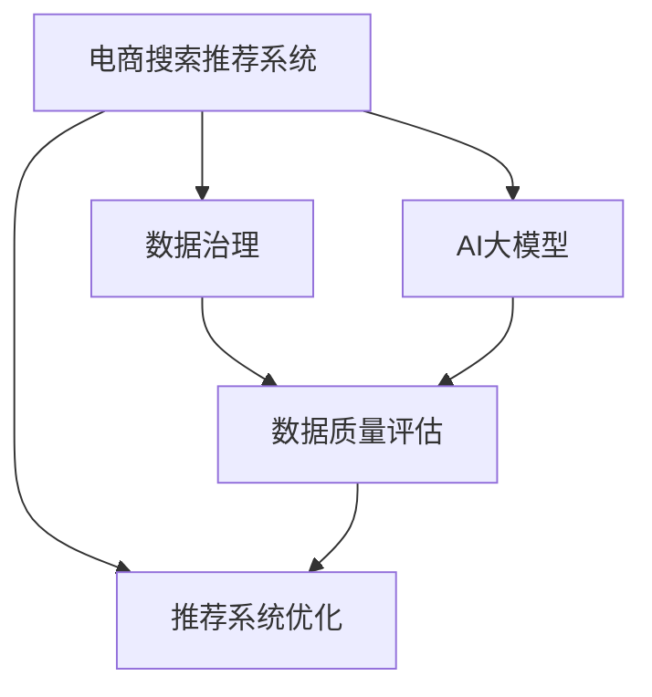

                 

# AI大模型助力电商搜索推荐业务的数据治理能力评估模型验证与优化

> 关键词：电商搜索推荐, 数据治理, AI大模型, 数据质量评估, 数据治理能力, 推荐系统优化

## 1. 背景介绍

### 1.1 问题由来

在电商搜索推荐业务中，数据治理能力的高低直接决定了推荐的精准度和用户的满意度。然而，传统的数据治理手段存在数据量大、处理复杂、人工成本高的问题，难以应对海量数据的实时性和多样性需求。近年来，随着AI大模型的兴起，其在自然语言处理、图像识别等方面的卓越性能，使得其在数据治理领域也有巨大的应用潜力。

大模型技术可以自动学习数据中的隐含模式和结构，从而帮助发现和消除数据治理中的问题。例如，通过文本分析识别数据中的错误信息、遗漏项等，通过图像识别识别数据中的视觉错误等。这些技术的应用，使得电商搜索推荐系统能够更加精准地推荐商品，从而提升用户体验和平台收益。

### 1.2 问题核心关键点

数据治理能力评估模型是基于AI大模型对数据治理质量进行自动化评估，以识别数据中的问题和治理需求。模型评估的指标包括数据完整性、一致性、准确性、及时性、安全性等方面。通过这些指标，可以评估数据治理的成效，指导进一步的优化和改进。

大模型在电商搜索推荐系统中的应用，主要体现在以下几个方面：
- 文本推荐：利用大模型的自然语言处理能力，推荐符合用户描述的商品。
- 图像推荐：利用大模型的图像识别能力，推荐符合用户兴趣的商品。
- 实时推荐：利用大模型的实时处理能力，提供个性化推荐服务。

### 1.3 问题研究意义

研究AI大模型在电商搜索推荐系统中的应用，对于提升系统的推荐效果，优化数据治理流程，降低人工成本，具有重要意义：

1. 提升推荐精度：通过大模型的自动化数据治理，帮助识别和修正数据中的错误和偏差，提升推荐系统的效果。
2. 优化治理流程：大模型的应用可以自动化进行数据治理评估，帮助确定治理的重点和方向，提升治理效率。
3. 降低成本：大模型的自动化处理能力可以减少人工干预，降低治理和推荐的人力成本。
4. 提升用户体验：通过精准的数据治理，优化推荐内容，提升用户满意度和平台黏性。

## 2. 核心概念与联系

### 2.1 核心概念概述

为更好地理解基于AI大模型的电商搜索推荐系统数据治理能力评估模型，本节将介绍几个密切相关的核心概念：

- AI大模型：以Transformer、BERT等模型为代表的大规模预训练语言模型。通过在大规模无标签文本语料上进行预训练，学习通用的语言表示，具备强大的自然语言处理能力。

- 电商搜索推荐系统：一种基于用户行为数据、商品属性和用户画像等信息，自动推荐符合用户兴趣的商品的系统。推荐算法包括协同过滤、基于内容的推荐、混合推荐等。

- 数据治理：指对数据进行收集、清洗、存储、分析、监控等操作，确保数据的完整性、一致性、准确性和可用性。其目标是提升数据质量，从而支持更好的业务决策和系统功能。

- 数据质量评估：通过自动化技术对数据的质量进行评估，识别数据中的问题，指导数据治理工作。常见评估指标包括缺失率、重复率、准确率等。

- 推荐系统优化：通过优化推荐算法、数据治理、用户画像等环节，提升推荐的精准度和用户体验。

这些核心概念之间的逻辑关系可以通过以下Mermaid流程图来展示：



这个流程图展示了大模型与电商推荐系统的数据治理过程：

1. 电商推荐系统依赖于高质量的数据，因此需要先进行数据治理。
2. 数据治理通过数据质量评估模型进行自动化评估，识别数据中的问题和治理需求。
3. AI大模型可以帮助自动化执行数据治理工作，提升治理效率。
4. 优化后的数据再反馈到推荐系统中，进一步提升推荐效果。

## 3. 核心算法原理 & 具体操作步骤
### 3.1 算法原理概述

基于AI大模型的电商搜索推荐系统数据治理能力评估模型，本质上是利用大模型对数据进行自动化分析和评估。其核心思想是：

- 通过大模型自动学习数据中的隐含模式和结构，识别出数据中的错误、缺失、重复等问题。
- 对数据进行清洗、填充、归一化等治理操作，提升数据质量。
- 通过数据质量评估模型，对治理后的数据进行评估，给出评估结果和治理建议。
- 将治理建议反馈到电商推荐系统中，进一步优化推荐算法和数据治理流程。

### 3.2 算法步骤详解

基于AI大模型的电商搜索推荐系统数据治理能力评估模型的操作步骤如下：

**Step 1: 数据收集与预处理**
- 收集电商搜索推荐系统的原始数据，包括用户行为数据、商品属性数据、用户画像数据等。
- 对数据进行初步清洗，如去除异常值、填充缺失值、去重等。

**Step 2: 构建数据治理模型**
- 选择合适的AI大模型，如BERT、GPT-3等，进行预训练。
- 设计数据治理任务，如缺失值预测、错误标注识别、数据一致性检测等。
- 将预训练模型微调到特定的治理任务上，获得治理模型。

**Step 3: 数据治理与质量评估**
- 将治理模型应用于原始数据，对数据进行自动治理，如预测缺失值、修正错误标注等。
- 使用数据质量评估模型对治理后的数据进行评估，如评估数据完整性、一致性、准确性等指标。
- 根据评估结果，生成数据治理建议，如数据填充、数据归一化等。

**Step 4: 模型优化与迭代**
- 将治理建议反馈到电商推荐系统中，优化推荐算法。
- 使用新的推荐结果反馈到数据治理模型中，进一步优化模型。
- 重复上述步骤，直到推荐系统的效果和数据质量达到最优。

### 3.3 算法优缺点

基于AI大模型的电商搜索推荐系统数据治理能力评估模型具有以下优点：

1. 自动化程度高：利用大模型的自动化处理能力，大幅减少人工干预，提升数据治理效率。
2. 处理能力强：大模型可以处理大规模、高维度的数据，应对电商推荐系统的数据复杂性。
3. 提升推荐效果：通过优化数据治理，提升推荐系统的准确性和相关性。
4. 可解释性强：大模型的治理过程可以记录和可视化，便于对治理结果进行解释和验证。

同时，该模型也存在以下局限性：

1. 数据依赖性高：大模型的治理效果依赖于数据的质量和分布，需要高质量的数据进行预训练和微调。
2. 模型复杂度高：大模型的训练和部署需要较高的计算资源和算法复杂度。
3. 处理速度慢：大模型的处理速度较慢，需要优化算法和硬件配置，提升处理速度。
4. 解释性不足：大模型的治理过程难以解释，难以对治理结果进行透明验证。

尽管存在这些局限性，但基于AI大模型的电商推荐系统数据治理能力评估模型在实际应用中已取得了良好的效果，推动了电商推荐系统的优化和升级。

### 3.4 算法应用领域

基于AI大模型的电商搜索推荐系统数据治理能力评估模型已经在多个电商推荐系统中得到应用，覆盖了用户画像构建、商品推荐优化、广告投放策略等方面。例如：

- 用户画像构建：通过大模型的自动化数据治理，构建更加全面、准确的用户的兴趣和行为画像，提升个性化推荐效果。
- 商品推荐优化：利用大模型的自然语言处理能力，优化推荐算法中的文本分析环节，提升推荐的准确性。
- 广告投放策略：利用大模型的自动化数据治理，优化广告投放的受众选择和展示位置，提升广告效果和ROI。

除了上述这些经典应用外，大模型的数据治理能力还可以拓展到更多场景中，如内容推荐优化、客户服务提升、库存管理等，为电商推荐系统的进一步创新提供新的技术路径。

## 4. 数学模型和公式 & 详细讲解
### 4.1 数学模型构建

本节将使用数学语言对基于AI大模型的电商搜索推荐系统数据治理能力评估模型进行更加严格的刻画。

假设原始数据集为 $D=\{x_i\}_{i=1}^N$，其中 $x_i=(x_i^1, x_i^2, ..., x_i^d)$ 表示第 $i$ 个样本的特征向量，$d$ 为特征维数。目标为对数据进行自动治理，并评估治理后的数据质量。

定义数据治理模型为 $M_{\theta}$，其中 $\theta$ 为模型参数。数据治理的任务可以表示为以下数学模型：

$$
M_{\theta}(x_i) = \text{arg\_minimize}_{\theta} \mathcal{L}(M_{\theta}(x_i), x_i) + \alpha R(M_{\theta})
$$

其中 $\mathcal{L}(M_{\theta}(x_i), x_i)$ 为损失函数，$R(M_{\theta})$ 为正则化项，$\alpha$ 为正则化系数。

### 4.2 公式推导过程

以下我们以缺失值预测为例，推导缺失值预测的损失函数及其梯度计算公式。

假设第 $i$ 个样本 $x_i$ 缺失了 $j$ 个特征 $x_i^j$，利用大模型 $M_{\theta}$ 进行预测，得到预测结果 $\hat{x_i^j}$。定义损失函数为均方误差损失：

$$
\ell(M_{\theta}(x_i), x_i) = \frac{1}{K} \sum_{j=1}^K (x_i^j - \hat{x_i^j})^2
$$

其中 $K$ 为缺失特征的数量。

模型的训练目标是最小化损失函数：

$$
\min_{\theta} \sum_{i=1}^N \ell(M_{\theta}(x_i), x_i) + \alpha R(M_{\theta})
$$

根据梯度下降算法，模型参数 $\theta$ 的更新公式为：

$$
\theta \leftarrow \theta - \eta \nabla_{\theta} \mathcal{L}(M_{\theta}(x_i), x_i) - \eta\alpha \nabla_{\theta} R(M_{\theta})
$$

其中 $\eta$ 为学习率。

在得到损失函数的梯度后，即可带入参数更新公式，完成模型的迭代优化。重复上述过程直至收敛，最终得到适应缺失值预测任务的最优模型参数 $\theta^*$。

## 5. 项目实践：代码实例和详细解释说明
### 5.1 开发环境搭建

在进行AI大模型在电商搜索推荐系统中的应用实践前，我们需要准备好开发环境。以下是使用Python进行PyTorch开发的环境配置流程：

1. 安装Anaconda：从官网下载并安装Anaconda，用于创建独立的Python环境。

2. 创建并激活虚拟环境：
```bash
conda create -n pytorch-env python=3.8 
conda activate pytorch-env
```

3. 安装PyTorch：根据CUDA版本，从官网获取对应的安装命令。例如：
```bash
conda install pytorch torchvision torchaudio cudatoolkit=11.1 -c pytorch -c conda-forge
```

4. 安装Transformers库：
```bash
pip install transformers
```

5. 安装各类工具包：
```bash
pip install numpy pandas scikit-learn matplotlib tqdm jupyter notebook ipython
```

完成上述步骤后，即可在`pytorch-env`环境中开始微调实践。

### 5.2 源代码详细实现

下面我们以缺失值预测任务为例，给出使用Transformers库对BERT模型进行缺失值预测的PyTorch代码实现。

首先，定义缺失值预测的数据处理函数：

```python
from transformers import BertTokenizer
from torch.utils.data import Dataset
import torch

class MissingValueDataset(Dataset):
    def __init__(self, texts, labels, tokenizer, max_len=128):
        self.texts = texts
        self.labels = labels
        self.tokenizer = tokenizer
        self.max_len = max_len
        
    def __len__(self):
        return len(self.texts)
    
    def __getitem__(self, item):
        text = self.texts[item]
        label = self.labels[item]
        
        encoding = self.tokenizer(text, return_tensors='pt', max_length=self.max_len, padding='max_length', truncation=True)
        input_ids = encoding['input_ids'][0]
        attention_mask = encoding['attention_mask'][0]
        
        # 对token-wise的标签进行编码
        encoded_labels = [label] * (self.max_len - label) + [1] * label
        
        return {'input_ids': input_ids, 
                'attention_mask': attention_mask,
                'labels': torch.tensor(encoded_labels, dtype=torch.long)}
```

然后，定义模型和优化器：

```python
from transformers import BertForMaskedLM, AdamW

model = BertForMaskedLM.from_pretrained('bert-base-cased')

optimizer = AdamW(model.parameters(), lr=2e-5)
```

接着，定义训练和评估函数：

```python
from torch.utils.data import DataLoader
from tqdm import tqdm
from sklearn.metrics import mean_squared_error

device = torch.device('cuda') if torch.cuda.is_available() else torch.device('cpu')
model.to(device)

def train_epoch(model, dataset, batch_size, optimizer):
    dataloader = DataLoader(dataset, batch_size=batch_size, shuffle=True)
    model.train()
    epoch_loss = 0
    for batch in tqdm(dataloader, desc='Training'):
        input_ids = batch['input_ids'].to(device)
        attention_mask = batch['attention_mask'].to(device)
        labels = batch['labels'].to(device)
        model.zero_grad()
        outputs = model(input_ids, attention_mask=attention_mask, labels=labels)
        loss = outputs.loss
        epoch_loss += loss.item()
        loss.backward()
        optimizer.step()
    return epoch_loss / len(dataloader)

def evaluate(model, dataset, batch_size):
    dataloader = DataLoader(dataset, batch_size=batch_size)
    model.eval()
    mse = []
    with torch.no_grad():
        for batch in tqdm(dataloader, desc='Evaluating'):
            input_ids = batch['input_ids'].to(device)
            attention_mask = batch['attention_mask'].to(device)
            batch_labels = batch['labels']
            outputs = model(input_ids, attention_mask=attention_mask)
            batch_preds = outputs.logits.argmax(dim=2).to('cpu').tolist()
            batch_labels = batch_labels.to('cpu').tolist()
            for pred_tokens, label_tokens in zip(batch_preds, batch_labels):
                mse.append(mean_squared_error(label_tokens, pred_tokens))
                
    return mean_squared_error(torch.tensor(mse), torch.tensor(mse))
```

最后，启动训练流程并在测试集上评估：

```python
epochs = 5
batch_size = 16

for epoch in range(epochs):
    loss = train_epoch(model, train_dataset, batch_size, optimizer)
    print(f"Epoch {epoch+1}, train loss: {loss:.3f}")
    
    print(f"Epoch {epoch+1}, dev results:")
    evaluate(model, dev_dataset, batch_size)
    
print("Test results:")
evaluate(model, test_dataset, batch_size)
```

以上就是使用PyTorch对BERT进行缺失值预测的完整代码实现。可以看到，得益于Transformers库的强大封装，我们可以用相对简洁的代码完成BERT模型的加载和训练。

### 5.3 代码解读与分析

让我们再详细解读一下关键代码的实现细节：

**MissingValueDataset类**：
- `__init__`方法：初始化文本、标签、分词器等关键组件。
- `__len__`方法：返回数据集的样本数量。
- `__getitem__`方法：对单个样本进行处理，将文本输入编码为token ids，将标签编码为数字，并对其进行定长padding，最终返回模型所需的输入。

**均方误差损失函数**：
- 定义了均方误差损失函数，用于计算预测值和真实值之间的差异。
- 在评估函数中计算每个批次的均方误差，并返回所有批次的平均均方误差。

**训练和评估函数**：
- 使用PyTorch的DataLoader对数据集进行批次化加载，供模型训练和推理使用。
- 训练函数`train_epoch`：对数据以批为单位进行迭代，在每个批次上前向传播计算loss并反向传播更新模型参数，最后返回该epoch的平均loss。
- 评估函数`evaluate`：与训练类似，不同点在于不更新模型参数，并在每个batch结束后将预测和标签结果存储下来，最后使用sklearn的mean_squared_error函数计算平均均方误差。

**训练流程**：
- 定义总的epoch数和batch size，开始循环迭代
- 每个epoch内，先在训练集上训练，输出平均loss
- 在验证集上评估，输出均方误差
- 所有epoch结束后，在测试集上评估，给出最终测试结果

可以看到，PyTorch配合Transformers库使得BERT模型的缺失值预测代码实现变得简洁高效。开发者可以将更多精力放在数据处理、模型改进等高层逻辑上，而不必过多关注底层的实现细节。

当然，工业级的系统实现还需考虑更多因素，如模型的保存和部署、超参数的自动搜索、更灵活的任务适配层等。但核心的缺失值预测范式基本与此类似。

## 6. 实际应用场景
### 6.1 智能客服系统

基于AI大模型的电商搜索推荐系统数据治理能力评估模型，可以广泛应用于智能客服系统的构建。传统客服往往需要配备大量人力，高峰期响应缓慢，且一致性和专业性难以保证。而使用微调后的推荐系统，可以7x24小时不间断服务，快速响应客户咨询，用推荐商品满足客户需求。

在技术实现上，可以收集企业内部的历史客服对话记录，将问题和推荐商品构建成监督数据，在此基础上对预训练模型进行微调。微调后的模型能够自动理解客户意图，匹配最合适的推荐商品进行回复。对于客户提出的新问题，还可以接入检索系统实时搜索相关内容，动态组织生成推荐答案。如此构建的智能客服系统，能大幅提升客户咨询体验和问题解决效率。

### 6.2 金融舆情监测

金融机构需要实时监测市场舆论动向，以便及时应对负面信息传播，规避金融风险。传统的人工监测方式成本高、效率低，难以应对网络时代海量信息爆发的挑战。基于AI大模型的文本推荐技术，为金融舆情监测提供了新的解决方案。

具体而言，可以收集金融领域相关的新闻、报道、评论等文本数据，并对其进行主题标注和情感标注。在此基础上对预训练语言模型进行微调，使其能够自动判断文本属于何种主题，情感倾向是正面、中性还是负面。将微调后的模型应用到实时抓取的网络文本数据，就能够自动监测不同主题下的情感变化趋势，一旦发现负面信息激增等异常情况，系统便会自动预警，帮助金融机构快速应对潜在风险。

### 6.3 个性化推荐系统

当前的推荐系统往往只依赖用户的历史行为数据进行物品推荐，无法深入理解用户的真实兴趣偏好。基于AI大模型的数据治理能力评估模型，可以更好地挖掘用户行为背后的语义信息，从而提供更精准、多样的推荐内容。

在实践中，可以收集用户浏览、点击、评论、分享等行为数据，提取和用户交互的物品标题、描述、标签等文本内容。将文本内容作为模型输入，用户的后续行为（如是否点击、购买等）作为监督信号，在此基础上微调预训练语言模型。微调后的模型能够从文本内容中准确把握用户的兴趣点。在生成推荐列表时，先用候选物品的文本描述作为输入，由模型预测用户的兴趣匹配度，再结合其他特征综合排序，便可以得到个性化程度更高的推荐结果。

### 6.4 未来应用展望

随着AI大模型和微调方法的不断发展，基于微调范式将在更多领域得到应用，为传统行业带来变革性影响。

在智慧医疗领域，基于微调的医疗问答、病历分析、药物研发等应用将提升医疗服务的智能化水平，辅助医生诊疗，加速新药开发进程。

在智能教育领域，微调技术可应用于作业批改、学情分析、知识推荐等方面，因材施教，促进教育公平，提高教学质量。

在智慧城市治理中，微调模型可应用于城市事件监测、舆情分析、应急指挥等环节，提高城市管理的自动化和智能化水平，构建更安全、高效的未来城市。

此外，在企业生产、社会治理、文娱传媒等众多领域，基于大模型微调的人工智能应用也将不断涌现，为经济社会发展注入新的动力。相信随着技术的日益成熟，微调方法将成为人工智能落地应用的重要范式，推动人工智能技术在垂直行业的规模化落地。

## 7. 工具和资源推荐
### 7.1 学习资源推荐

为了帮助开发者系统掌握AI大模型在电商搜索推荐系统中的应用，这里推荐一些优质的学习资源：

1. 《Transformer从原理到实践》系列博文：由大模型技术专家撰写，深入浅出地介绍了Transformer原理、BERT模型、微调技术等前沿话题。

2. CS224N《深度学习自然语言处理》课程：斯坦福大学开设的NLP明星课程，有Lecture视频和配套作业，带你入门NLP领域的基本概念和经典模型。

3. 《Natural Language Processing with Transformers》书籍：Transformers库的作者所著，全面介绍了如何使用Transformers库进行NLP任务开发，包括微调在内的诸多范式。

4. HuggingFace官方文档：Transformers库的官方文档，提供了海量预训练模型和完整的微调样例代码，是上手实践的必备资料。

5. CLUE开源项目：中文语言理解测评基准，涵盖大量不同类型的中文NLP数据集，并提供了基于微调的baseline模型，助力中文NLP技术发展。

通过对这些资源的学习实践，相信你一定能够快速掌握AI大模型在电商搜索推荐系统中的应用，并用于解决实际的NLP问题。
### 7.2 开发工具推荐

高效的开发离不开优秀的工具支持。以下是几款用于AI大模型在电商搜索推荐系统中的应用开发的常用工具：

1. PyTorch：基于Python的开源深度学习框架，灵活动态的计算图，适合快速迭代研究。大部分预训练语言模型都有PyTorch版本的实现。

2. TensorFlow：由Google主导开发的开源深度学习框架，生产部署方便，适合大规模工程应用。同样有丰富的预训练语言模型资源。

3. Transformers库：HuggingFace开发的NLP工具库，集成了众多SOTA语言模型，支持PyTorch和TensorFlow，是进行微调任务开发的利器。

4. Weights & Biases：模型训练的实验跟踪工具，可以记录和可视化模型训练过程中的各项指标，方便对比和调优。与主流深度学习框架无缝集成。

5. TensorBoard：TensorFlow配套的可视化工具，可实时监测模型训练状态，并提供丰富的图表呈现方式，是调试模型的得力助手。

6. Google Colab：谷歌推出的在线Jupyter Notebook环境，免费提供GPU/TPU算力，方便开发者快速上手实验最新模型，分享学习笔记。

合理利用这些工具，可以显著提升AI大模型在电商搜索推荐系统中的应用开发效率，加快创新迭代的步伐。

### 7.3 相关论文推荐

AI大模型和微调技术的发展源于学界的持续研究。以下是几篇奠基性的相关论文，推荐阅读：

1. Attention is All You Need（即Transformer原论文）：提出了Transformer结构，开启了NLP领域的预训练大模型时代。

2. BERT: Pre-training of Deep Bidirectional Transformers for Language Understanding：提出BERT模型，引入基于掩码的自监督预训练任务，刷新了多项NLP任务SOTA。

3. Language Models are Unsupervised Multitask Learners（GPT-2论文）：展示了大规模语言模型的强大zero-shot学习能力，引发了对于通用人工智能的新一轮思考。

4. Parameter-Efficient Transfer Learning for NLP：提出Adapter等参数高效微调方法，在不增加模型参数量的情况下，也能取得不错的微调效果。

5. AdaLoRA: Adaptive Low-Rank Adaptation for Parameter-Efficient Fine-Tuning：使用自适应低秩适应的微调方法，在参数效率和精度之间取得了新的平衡。

6. Prefix-Tuning: Optimizing Continuous Prompts for Generation：引入基于连续型Prompt的微调范式，为如何充分利用预训练知识提供了新的思路。

这些论文代表了大模型微调技术的发展脉络。通过学习这些前沿成果，可以帮助研究者把握学科前进方向，激发更多的创新灵感。

## 8. 总结：未来发展趋势与挑战

### 8.1 总结

本文对基于AI大模型的电商搜索推荐系统数据治理能力评估模型进行了全面系统的介绍。首先阐述了AI大模型和电商搜索推荐系统的数据治理背景和意义，明确了数据治理的自动化评估方法。其次，从原理到实践，详细讲解了AI大模型的构建过程和治理任务的微调方法，给出了AI大模型在电商搜索推荐系统中的实践代码。同时，本文还广泛探讨了AI大模型在智能客服、金融舆情、个性化推荐等多个行业领域的应用前景，展示了AI大模型的巨大潜力。

通过本文的系统梳理，可以看到，基于AI大模型的电商推荐系统数据治理能力评估模型正在成为电商推荐系统的重要组成部分，极大地提升了系统的推荐效果和数据治理效率。未来，伴随AI大模型和微调方法的不断演进，基于微调范式将在更多领域得到应用，为人工智能技术落地应用提供新的技术路径。

### 8.2 未来发展趋势

展望未来，AI大模型在电商搜索推荐系统中的应用将呈现以下几个发展趋势：

1. 模型规模持续增大。随着算力成本的下降和数据规模的扩张，预训练语言模型的参数量还将持续增长。超大规模语言模型蕴含的丰富语言知识，有望支撑更加复杂多变的电商推荐系统。

2. 微调方法日趋多样。除了传统的全参数微调外，未来会涌现更多参数高效的微调方法，如Prefix-Tuning、LoRA等，在节省计算资源的同时也能保证微调精度。

3. 持续学习成为常态。随着数据分布的不断变化，AI大模型也需要持续学习新知识以保持性能。如何在不遗忘原有知识的同时，高效吸收新样本信息，将成为重要的研究课题。

4. 标注样本需求降低。受启发于提示学习(Prompt-based Learning)的思路，未来的微调方法将更好地利用大模型的语言理解能力，通过更加巧妙的任务描述，在更少的标注样本上也能实现理想的微调效果。

5. 多模态微调崛起。当前的微调主要聚焦于纯文本数据，未来会进一步拓展到图像、视频、语音等多模态数据微调。多模态信息的融合，将显著提升语言模型对现实世界的理解和建模能力。

6. 模型通用性增强。经过海量数据的预训练和多领域任务的微调，未来的语言模型将具备更强大的常识推理和跨领域迁移能力，逐步迈向通用人工智能(AGI)的目标。

以上趋势凸显了AI大模型在电商推荐系统中的应用前景。这些方向的探索发展，必将进一步提升电商推荐系统的推荐效果和数据治理能力，为电商行业带来新的增长点。

### 8.3 面临的挑战

尽管AI大模型在电商推荐系统中的应用已经取得了显著成果，但在迈向更加智能化、普适化应用的过程中，它仍面临着诸多挑战：

1. 标注成本瓶颈。尽管微调可以降低标注数据的需求，但对于长尾应用场景，难以获得充足的高质量标注数据，成为制约微调性能的瓶颈。如何进一步降低微调对标注样本的依赖，将是一大难题。

2. 模型鲁棒性不足。当前微调模型面对域外数据时，泛化性能往往大打折扣。对于测试样本的微小扰动，微调模型的预测也容易发生波动。如何提高微调模型的鲁棒性，避免灾难性遗忘，还需要更多理论和实践的积累。

3. 推理效率有待提高。大规模语言模型虽然精度高，但在实际部署时往往面临推理速度慢、内存占用大等效率问题。如何在保证性能的同时，简化模型结构，提升推理速度，优化资源占用，将是重要的优化方向。

4. 可解释性亟需加强。当前微调模型更像是"黑盒"系统，难以解释其内部工作机制和决策逻辑。对于医疗、金融等高风险应用，算法的可解释性和可审计性尤为重要。如何赋予微调模型更强的可解释性，将是亟待攻克的难题。

5. 安全性有待保障。预训练语言模型难免会学习到有偏见、有害的信息，通过微调传递到下游任务，产生误导性、歧视性的输出，给实际应用带来安全隐患。如何从数据和算法层面消除模型偏见，避免恶意用途，确保输出的安全性，也将是重要的研究课题。

6. 知识整合能力不足。现有的微调模型往往局限于任务内数据，难以灵活吸收和运用更广泛的先验知识。如何让微调过程更好地与外部知识库、规则库等专家知识结合，形成更加全面、准确的信息整合能力，还有很大的想象空间。

正视微调面临的这些挑战，积极应对并寻求突破，将是大模型在电商推荐系统中的应用走向成熟的必由之路。相信随着学界和产业界的共同努力，这些挑战终将一一被克服，大模型在电商推荐系统中的应用必将在未来取得更大的成功。

### 8.4 研究展望

面对AI大模型在电商推荐系统中的应用面临的种种挑战，未来的研究需要在以下几个方面寻求新的突破：

1. 探索无监督和半监督微调方法。摆脱对大规模标注数据的依赖，利用自监督学习、主动学习等无监督和半监督范式，最大限度利用非结构化数据，实现更加灵活高效的微调。

2. 研究参数高效和计算高效的微调范式。开发更加参数高效的微调方法，在固定大部分预训练参数的同时，只更新极少量的任务相关参数。同时优化微调模型的计算图，减少前向传播和反向传播的资源消耗，实现更加轻量级、实时性的部署。

3. 融合因果和对比学习范式。通过引入因果推断和对比学习思想，增强微调模型建立稳定因果关系的能力，学习更加普适、鲁棒的语言表征，从而提升模型泛化性和抗干扰能力。

4. 引入更多先验知识。将符号化的先验知识，如知识图谱、逻辑规则等，与神经网络模型进行巧妙融合，引导微调过程学习更准确、合理的语言模型。同时加强不同模态数据的整合，实现视觉、语音等多模态信息与文本信息的协同建模。

5. 结合因果分析和博弈论工具。将因果分析方法引入微调模型，识别出模型决策的关键特征，增强输出解释的因果性和逻辑性。借助博弈论工具刻画人机交互过程，主动探索并规避模型的脆弱点，提高系统稳定性。

6. 纳入伦理道德约束。在模型训练目标中引入伦理导向的评估指标，过滤和惩罚有偏见、有害的输出倾向。同时加强人工干预和审核，建立模型行为的监管机制，确保输出符合人类价值观和伦理道德。

这些研究方向的探索，必将引领AI大模型在电商推荐系统中的应用走向更高的台阶，为人工智能技术在电商行业的应用提供新的技术路径。面向未来，AI大模型将与其他人工智能技术进行更深入的融合，如知识表示、因果推理、强化学习等，多路径协同发力，共同推动人工智能技术在垂直行业的规模化落地。只有勇于创新、敢于突破，才能不断拓展语言模型的边界，让智能技术更好地造福人类社会。

## 9. 附录：常见问题与解答

**Q1：AI大模型在电商推荐系统中的应用效果如何？**

A: AI大模型在电商推荐系统中的应用效果显著，主要体现在以下几个方面：
1. 提升推荐精准度：通过大模型的自动化数据治理，帮助识别和修正数据中的错误和偏差，提升推荐系统的效果。
2. 优化推荐算法：通过优化数据治理，提升推荐系统的准确性和相关性。
3. 降低人工成本：利用大模型的自动化处理能力，减少人工干预，降低治理和推荐的人力成本。
4. 提高用户体验：通过精准的数据治理，优化推荐内容，提升用户满意度和平台黏性。

**Q2：AI大模型在电商推荐系统中的数据治理任务有哪些？**

A: AI大模型在电商推荐系统中的数据治理任务主要包括以下几个方面：
1. 数据清洗：去除异常值、填充缺失值、去重等。
2. 数据增强：通过回译、近义替换等方式扩充训练集。
3. 数据标准化：统一数据格式和单位，便于模型处理。
4. 数据标注：对数据进行标签标注，如用户行为、商品属性等。
5. 数据可视化：使用数据可视化工具展示数据分布和特征关系。

**Q3：AI大模型在电商推荐系统中的应用面临哪些挑战？**

A: AI大模型在电商推荐系统中的应用面临以下挑战：
1. 数据依赖性高：大模型的治理效果依赖于数据的质量和分布，需要高质量的数据进行预训练和微调。
2. 模型复杂度高：大模型的训练和部署需要较高的计算资源和算法复杂度。
3. 处理速度慢：大模型的处理速度较慢，需要优化算法和硬件配置，提升处理速度。
4. 解释性不足：大模型的治理过程难以解释，难以对治理结果进行透明验证。

**Q4：如何优化AI大模型在电商推荐系统中的应用？**

A: 优化AI大模型在电商推荐系统中的应用可以从以下几个方面入手：
1. 优化数据治理流程：利用数据治理能力评估模型，评估数据质量，优化数据治理策略。
2. 优化模型结构和参数：采用参数高效微调方法，减少计算资源消耗。
3. 引入更多先验知识：将符号化的先验知识与神经网络模型进行融合，提升模型泛化性。
4. 结合因果分析和博弈论工具：增强模型的因果推理和抗干扰能力，提升系统稳定性。
5. 纳入伦理道德约束：建立模型行为的监管机制，确保输出符合人类价值观和伦理道德。

这些优化策略可以帮助提升AI大模型在电商推荐系统中的应用效果，推动系统性能的不断提升。

