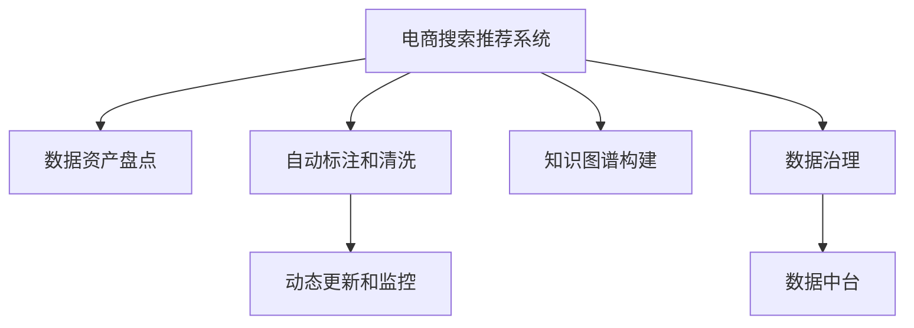

                 

# AI大模型助力电商搜索推荐业务的数据资产盘点自动化工具开发与应用

> 关键词：
- AI大模型
- 电商搜索推荐
- 数据资产盘点
- 自动化工具
- 数据治理
- 数据中台
- 知识图谱

## 1. 背景介绍

### 1.1 问题由来
在电商领域，搜索和推荐系统的开发和优化需要大量的数据支持。从用户行为数据到商品描述信息，从用户画像到商品标签，数据收集和整理是一项繁琐且耗时的工作。尤其是随着业务规模的扩大和用户需求的多样化，如何高效地管理海量数据资产，确保数据的时效性、完整性和安全性，成为电商搜索推荐业务面临的重要挑战。

为了提升搜索推荐系统的精准度和用户体验，数据资产盘点工作变得尤为关键。然而，手动盘点数据不仅耗时耗力，而且容易出错，影响业务决策和系统优化。在此背景下，开发一个基于AI大模型的数据资产盘点自动化工具，成为提升电商搜索推荐业务数据治理效率的重要方向。

### 1.2 问题核心关键点
在电商搜索推荐业务中，数据资产盘点自动化工具的核心关键点包括：

- **数据盘点和资产管理**：对电商平台存储的各种数据进行全面盘点和分类，构建详细的数据资产目录。
- **自动标注和清洗**：使用AI大模型对数据进行自动化标注和清洗，减少人工干预。
- **知识图谱构建**：通过构建商品和用户之间的知识图谱，促进数据的深度融合和智能推荐。
- **动态更新和监控**：实现数据资产的动态更新和异常监控，保障数据的时效性和安全性。

解决这些问题，可以大大提升电商搜索推荐系统的数据治理能力，为业务优化和用户服务带来显著的改进。

## 2. 核心概念与联系

### 2.1 核心概念概述

为更好地理解AI大模型在电商搜索推荐业务中的数据资产盘点自动化工具开发与应用，本节将介绍几个密切相关的核心概念：

- **AI大模型**：基于大规模深度学习模型训练获得的高效、通用的AI模型。如GPT-3、BERT等。
- **电商搜索推荐系统**：利用用户行为数据和商品信息，为用户提供个性化搜索结果和推荐服务的技术系统。
- **数据资产盘点**：对电商平台中存储的数据进行全面的盘点、分类、标注和清洗，构建详尽的数据资产目录。
- **自动化工具**：使用AI和软件工程方法，自动化执行数据盘点、标注和清洗等任务的工具。
- **数据治理**：包括数据采集、存储、清洗、管理和监控等，确保数据质量和安全性的全过程。
- **数据中台**：提供统一的数据接入、治理和分析平台，实现数据的全生命周期管理。
- **知识图谱**：通过节点和边构建的知识图，描述实体和实体间的关系，支持复杂查询和推理。

这些核心概念之间的逻辑关系可以通过以下Mermaid流程图来展示：



这个流程图展示了大模型在电商搜索推荐业务中的数据资产盘点自动化工具的核心功能及其相互关系：

1. **电商搜索推荐系统**：数据治理的最终目标。
2. **数据资产盘点**：构建基础的数据目录，是数据治理的起点。
3. **自动标注和清洗**：对数据进行自动化处理，减少人工干预，提高数据质量。
4. **知识图谱构建**：促进数据的深度融合，提升智能推荐能力。
5. **动态更新和监控**：实现数据的时效性和安全性保障。
6. **数据治理**：确保数据治理流程的完整性和有效性。
7. **数据中台**：提供数据治理的平台和工具支持。

## 3. 核心算法原理 & 具体操作步骤
### 3.1 算法原理概述

基于AI大模型的电商搜索推荐业务数据资产盘点自动化工具，其核心算法原理主要包括以下几个方面：

1. **数据盘点和分类**：使用自然语言处理（NLP）技术，自动提取电商平台中的文本信息，如商品描述、用户评价等，并根据主题和领域进行分类。
2. **自动标注和清洗**：利用预训练的文本分类和命名实体识别（NER）模型，对文本数据进行自动标注，识别出商品名称、属性、用户评分等信息，并对噪声和异常值进行清洗。
3. **知识图谱构建**：构建基于商品和用户的知识图谱，描述商品和用户之间的关系，如商品类别、用户画像等。
4. **动态更新和监控**：实时监控数据资产的变化，自动更新和补充数据目录，保证数据的时效性和完整性。

这些算法原理通过深度学习模型的预训练和微调过程来实现，具体步骤将在后续详细讲解。

### 3.2 算法步骤详解

#### 3.2.1 数据盘点和分类

1. **数据采集**：从电商平台中获取各种文本数据，如商品描述、用户评论、商品属性等。
2. **文本预处理**：对文本数据进行清洗、分词、去除停用词等预处理操作。
3. **分类模型训练**：使用预训练的文本分类模型，如BERT，在电商领域数据上进行微调，构建针对电商领域的文本分类模型。
4. **文本分类**：将预处理后的文本数据输入分类模型，得到分类结果，如商品类别、用户评分等。
5. **数据目录构建**：根据分类结果构建详细的数据资产目录，便于后续的数据治理和优化。

#### 3.2.2 自动标注和清洗

1. **自动标注模型训练**：使用预训练的命名实体识别（NER）模型，如BiLSTM-CRF，在电商领域数据上进行微调，构建针对电商领域的命名实体识别模型。
2. **自动标注**：将预处理后的文本数据输入NER模型，识别出商品名称、属性、用户评分等信息。
3. **异常值检测**：利用异常检测算法，如统计学方法和机器学习模型，识别和剔除异常值和噪声。
4. **数据清洗**：根据自动标注结果和异常值检测结果，对数据进行清洗，去除无效和重复信息。

#### 3.2.3 知识图谱构建

1. **实体抽取**：使用NER模型从电商文本数据中抽取实体，如商品名称、类别、属性等。
2. **关系抽取**：利用关系抽取模型，如TransE，从电商文本中抽取实体间的关系，如商品类别、用户评分等。
3. **知识图谱构建**：将抽取的实体和关系整合到知识图谱中，构建商品和用户之间的关系网络。

#### 3.2.4 动态更新和监控

1. **数据更新**：实时采集电商平台的文本数据，更新数据资产目录。
2. **数据监控**：利用异常检测算法，实时监控数据资产的变化，识别异常数据。
3. **自动补全**：根据监控结果，自动补充和更新数据目录，保证数据的时效性和完整性。

### 3.3 算法优缺点

基于AI大模型的电商搜索推荐业务数据资产盘点自动化工具具有以下优点：

1. **效率高**：自动盘点和分类，减少人工干预，提高数据处理效率。
2. **精度高**：使用预训练模型，提升标注和清洗的准确性。
3. **灵活性高**：通过动态更新和监控，实时响应业务需求。
4. **可扩展性强**：支持大规模数据处理，适用于电商平台的快速扩张。

同时，该工具也存在一些局限性：

1. **初始模型成本高**：预训练模型的训练和微调需要大量数据和计算资源。
2. **数据多样性要求高**：电商平台的文本数据多样性较大，需要高精度模型处理。
3. **更新复杂**：实时更新和监控需要持续维护和优化。

尽管如此，基于AI大模型的电商搜索推荐业务数据资产盘点自动化工具在提高数据治理效率和质量方面仍具有显著优势，适用于电商平台的广泛应用。

### 3.4 算法应用领域

基于AI大模型的电商搜索推荐业务数据资产盘点自动化工具，可以应用于电商平台的各个环节，包括但不限于：

- **商品管理**：自动盘点和分类商品描述、属性等，构建详细的商品数据目录。
- **用户画像**：自动标注和清洗用户评价、行为数据，构建用户画像。
- **智能推荐**：构建商品和用户之间的关系图谱，提升智能推荐系统的精准度。
- **库存管理**：实时监控商品库存变化，确保数据的时效性和准确性。
- **业务决策**：提供数据资产盘点和分析报告，支持业务决策和优化。

## 4. 数学模型和公式 & 详细讲解 & 举例说明

### 4.1 数学模型构建

假设电商平台的文本数据集为 $D=\{(x_i, y_i)\}_{i=1}^N$，其中 $x_i$ 为文本数据，$y_i$ 为分类标签或实体。

#### 4.1.1 文本分类模型

**模型构建**：
- 使用预训练的BERT模型作为初始化参数，通过电商领域数据进行微调。
- 微调目标为：最小化预测标签与真实标签之间的交叉熵损失，即：
$$
\min_{\theta} \frac{1}{N} \sum_{i=1}^N H(p_i, y_i)
$$
其中 $p_i$ 为模型对文本 $x_i$ 的分类预测，$H$ 为交叉熵损失函数。

**训练过程**：
- 输入预处理后的文本数据 $x_i$，通过BERT模型得到分类概率 $p_i$。
- 计算交叉熵损失 $H(p_i, y_i)$。
- 使用AdamW等优化器，更新模型参数 $\theta$。

#### 4.1.2 命名实体识别模型

**模型构建**：
- 使用预训练的BiLSTM-CRF模型作为初始化参数，通过电商领域数据进行微调。
- 微调目标为：最大化命名实体识别的准确率，即：
$$
\max_{\theta} \frac{1}{N} \sum_{i=1}^N \mathcal{L}(x_i, y_i)
$$
其中 $\mathcal{L}$ 为命名实体识别模型的损失函数。

**训练过程**：
- 输入预处理后的文本数据 $x_i$，通过BiLSTM-CRF模型得到命名实体序列 $\hat{y}_i$。
- 计算命名实体识别损失 $\mathcal{L}(x_i, y_i)$。
- 使用AdamW等优化器，更新模型参数 $\theta$。

### 4.2 公式推导过程

以文本分类模型为例，推导其损失函数和梯度更新公式。

设输入文本 $x$ 的分类标签为 $y \in \{0, 1\}$，模型的预测概率为 $p$。则交叉熵损失函数为：
$$
H(p, y) = -[y \log p + (1-y) \log (1-p)]
$$

根据链式法则，模型参数 $\theta$ 的梯度为：
$$
\frac{\partial H(p, y)}{\partial \theta} = -(y - p) \frac{\partial p}{\partial \theta}
$$

其中 $\frac{\partial p}{\partial \theta}$ 为模型的导数，可以通过自动微分技术高效计算。

在得到损失函数的梯度后，即可带入梯度更新公式，完成模型的迭代优化。重复上述过程直至收敛，最终得到适应电商领域的数据分类模型。

## 5. 项目实践：代码实例和详细解释说明

### 5.1 开发环境搭建

在进行工具开发前，我们需要准备好开发环境。以下是使用Python进行PyTorch开发的环境配置流程：

1. 安装Anaconda：从官网下载并安装Anaconda，用于创建独立的Python环境。

2. 创建并激活虚拟环境：
```bash
conda create -n e-commerce-env python=3.8 
conda activate e-commerce-env
```

3. 安装PyTorch：根据CUDA版本，从官网获取对应的安装命令。例如：
```bash
conda install pytorch torchvision torchaudio cudatoolkit=11.1 -c pytorch -c conda-forge
```

4. 安装各类工具包：
```bash
pip install numpy pandas scikit-learn matplotlib tqdm jupyter notebook ipython
```

完成上述步骤后，即可在`e-commerce-env`环境中开始工具开发。

### 5.2 源代码详细实现

这里我们以电商搜索推荐系统的商品管理模块为例，给出使用PyTorch和Transformers库进行数据盘点和分类的代码实现。

首先，定义数据处理函数：

```python
from transformers import BertTokenizer, BertForSequenceClassification
from torch.utils.data import Dataset
import torch

class CommerceDataset(Dataset):
    def __init__(self, texts, labels, tokenizer, max_len=128):
        self.texts = texts
        self.labels = labels
        self.tokenizer = tokenizer
        self.max_len = max_len
        
    def __len__(self):
        return len(self.texts)
    
    def __getitem__(self, item):
        text = self.texts[item]
        label = self.labels[item]
        
        encoding = self.tokenizer(text, return_tensors='pt', max_length=self.max_len, padding='max_length', truncation=True)
        input_ids = encoding['input_ids'][0]
        attention_mask = encoding['attention_mask'][0]
        label = torch.tensor(label, dtype=torch.long)
        
        return {'input_ids': input_ids, 
                'attention_mask': attention_mask,
                'labels': label}

# 定义商品类别和标签
categories = ['电子产品', '服饰鞋包', '家居用品', '食品饮料', '图书文具', '化妆品', '运动户外', '个人护理', '家庭娱乐', '数码配件']
```

然后，定义模型和优化器：

```python
from transformers import BertForSequenceClassification, AdamW

model = BertForSequenceClassification.from_pretrained('bert-base-cased', num_labels=len(categories))

optimizer = AdamW(model.parameters(), lr=2e-5)
```

接着，定义训练和评估函数：

```python
from torch.utils.data import DataLoader
from tqdm import tqdm
from sklearn.metrics import accuracy_score

device = torch.device('cuda') if torch.cuda.is_available() else torch.device('cpu')
model.to(device)

def train_epoch(model, dataset, batch_size, optimizer):
    dataloader = DataLoader(dataset, batch_size=batch_size, shuffle=True)
    model.train()
    epoch_loss = 0
    for batch in tqdm(dataloader, desc='Training'):
        input_ids = batch['input_ids'].to(device)
        attention_mask = batch['attention_mask'].to(device)
        labels = batch['labels'].to(device)
        model.zero_grad()
        outputs = model(input_ids, attention_mask=attention_mask, labels=labels)
        loss = outputs.loss
        epoch_loss += loss.item()
        loss.backward()
        optimizer.step()
    return epoch_loss / len(dataloader)

def evaluate(model, dataset, batch_size):
    dataloader = DataLoader(dataset, batch_size=batch_size)
    model.eval()
    correct = 0
    total = 0
    with torch.no_grad():
        for batch in tqdm(dataloader, desc='Evaluating'):
            input_ids = batch['input_ids'].to(device)
            attention_mask = batch['attention_mask'].to(device)
            labels = batch['labels']
            outputs = model(input_ids, attention_mask=attention_mask)
            logits = outputs.logits.argmax(dim=2).to('cpu').tolist()
            labels = labels.to('cpu').tolist()
            for pred_tokens, label_tokens in zip(logits, labels):
                correct += pred_tokens == label_tokens
                total += 1
                
    print(f"Accuracy: {correct / total * 100:.2f}%")
```

最后，启动训练流程并在测试集上评估：

```python
epochs = 5
batch_size = 16

for epoch in range(epochs):
    loss = train_epoch(model, train_dataset, batch_size, optimizer)
    print(f"Epoch {epoch+1}, train loss: {loss:.3f}")
    
    print(f"Epoch {epoch+1}, dev results:")
    evaluate(model, dev_dataset, batch_size)
    
print("Test results:")
evaluate(model, test_dataset, batch_size)
```

以上就是使用PyTorch对BERT进行电商领域商品管理模块数据盘点和分类的代码实现。可以看到，得益于Transformers库的强大封装，我们可以用相对简洁的代码完成商品管理模块的开发。

### 5.3 代码解读与分析

让我们再详细解读一下关键代码的实现细节：

**CommerceDataset类**：
- `__init__`方法：初始化文本、标签、分词器等关键组件。
- `__len__`方法：返回数据集的样本数量。
- `__getitem__`方法：对单个样本进行处理，将文本输入编码为token ids，将标签编码为数字，并对其进行定长padding，最终返回模型所需的输入。

**categories字典**：
- 定义了商品类别和数字标签之间的映射关系，用于将token-wise的预测结果解码回真实的标签。

**训练和评估函数**：
- 使用PyTorch的DataLoader对数据集进行批次化加载，供模型训练和推理使用。
- 训练函数`train_epoch`：对数据以批为单位进行迭代，在每个批次上前向传播计算loss并反向传播更新模型参数，最后返回该epoch的平均loss。
- 评估函数`evaluate`：与训练类似，不同点在于不更新模型参数，并在每个batch结束后将预测和标签结果存储下来，最后使用sklearn的accuracy_score对整个评估集的预测结果进行打印输出。

**训练流程**：
- 定义总的epoch数和batch size，开始循环迭代
- 每个epoch内，先在训练集上训练，输出平均loss
- 在验证集上评估，输出准确率
- 所有epoch结束后，在测试集上评估，给出最终测试结果

可以看到，PyTorch配合Transformers库使得BERT微调的代码实现变得简洁高效。开发者可以将更多精力放在数据处理、模型改进等高层逻辑上，而不必过多关注底层的实现细节。

当然，工业级的系统实现还需考虑更多因素，如模型的保存和部署、超参数的自动搜索、更灵活的任务适配层等。但核心的微调范式基本与此类似。

## 6. 实际应用场景
### 6.1 智能推荐系统

基于大模型的电商搜索推荐业务数据资产盘点自动化工具，可以广泛应用于智能推荐系统的构建。智能推荐系统能够根据用户行为和商品属性，生成个性化推荐结果，提升用户体验和满意度。

在技术实现上，可以收集用户的历史浏览、购买、评价等行为数据，以及商品的属性、类别、价格等信息，构建电商领域的数据资产目录。然后利用工具对数据进行自动盘点和分类，构建用户画像和商品图谱，从而提升智能推荐系统的精准度。

例如，对于搜索“运动鞋”的用户，系统可以根据用户画像和商品图谱，推荐相似或互补的商品，如“运动户外”、“服饰鞋包”类别的商品。对于“家居用品”的用户，系统可以推荐相关装饰品、家电等商品。通过不断优化推荐算法，智能推荐系统能够更好地满足用户需求，提升电商平台的转化率和用户粘性。

### 6.2 库存管理

库存管理是电商业务中不可或缺的一环。实时监控商品库存变化，及时补充和更新，对于提升销售效率和用户体验至关重要。

基于大模型的电商搜索推荐业务数据资产盘点自动化工具，可以用于库存管理的数据治理。通过对商品信息和销售数据的自动盘点和分类，构建商品图谱，实时监控库存变化，生成库存预警报告。对于库存不足的商品，系统自动下单补货，确保库存充足。对于库存过剩的商品，系统自动优化库存策略，减少库存成本。

例如，对于“电子产品”类别商品，系统可以实时监控其库存变化，及时补充热销商品，避免缺货现象。对于“食品饮料”类商品，系统可以监控保质期变化，生成库存预警，确保商品新鲜度。通过智能库存管理，电商平台的运营效率将得到显著提升。

### 6.3 数据治理

数据治理是大模型在电商搜索推荐业务中发挥作用的基础。良好的数据治理可以提升数据质量和系统性能，降低数据管理和维护成本。

基于大模型的电商搜索推荐业务数据资产盘点自动化工具，可以用于电商平台的全面数据治理。通过对电商平台中存储的各种文本数据进行自动盘点和分类，构建详细的数据资产目录，从而实现数据的高效管理和优化。

例如，对于“用户评价”数据，系统可以自动盘点和分类，构建用户评价图谱，分析用户评价趋势和情感倾向，为业务决策提供参考。对于“商品描述”数据，系统可以自动盘点和分类，构建商品描述图谱，提升商品展示效果。通过数据治理，电商平台的运营质量和用户体验将得到显著提升。

### 6.4 未来应用展望

随着大模型和微调方法的不断发展，基于大模型的电商搜索推荐业务数据资产盘点自动化工具的应用前景将更加广阔。

在智慧零售领域，该工具可以与物联网设备、智能货架等相结合，实现商品信息的实时采集和智能推荐，提升零售效率和用户体验。

在供应链管理中，该工具可以用于商品信息的自动化盘点和分类，提升供应链管理的可视化、智能化水平，优化库存管理策略。

在客户关系管理中，该工具可以用于用户画像的自动化构建，提升客户服务的个性化水平，增强客户粘性和忠诚度。

此外，在金融、教育、医疗等众多领域，基于大模型的数据资产盘点自动化工具也将不断涌现，为各行各业的数据治理带来变革性影响。相信随着技术的日益成熟，大模型将在更多领域得到应用，为行业数字化转型升级提供新的技术路径。

## 7. 工具和资源推荐
### 7.1 学习资源推荐

为了帮助开发者系统掌握大模型在电商搜索推荐业务中的数据资产盘点自动化工具开发与应用，这里推荐一些优质的学习资源：

1. 《Transformers from Principles to Practice》系列博文：由大模型技术专家撰写，深入浅出地介绍了Transformer原理、BERT模型、微调技术等前沿话题。

2. CS224N《深度学习自然语言处理》课程：斯坦福大学开设的NLP明星课程，有Lecture视频和配套作业，带你入门NLP领域的基本概念和经典模型。

3. 《Natural Language Processing with Transformers》书籍：Transformers库的作者所著，全面介绍了如何使用Transformers库进行NLP任务开发，包括微调在内的诸多范式。

4. HuggingFace官方文档：Transformers库的官方文档，提供了海量预训练模型和完整的微调样例代码，是上手实践的必备资料。

5. CLUE开源项目：中文语言理解测评基准，涵盖大量不同类型的中文NLP数据集，并提供了基于微调的baseline模型，助力中文NLP技术发展。

通过对这些资源的学习实践，相信你一定能够快速掌握大模型在电商搜索推荐业务中的数据资产盘点自动化工具开发与应用。

### 7.2 开发工具推荐

高效的开发离不开优秀的工具支持。以下是几款用于大模型开发的常用工具：

1. PyTorch：基于Python的开源深度学习框架，灵活动态的计算图，适合快速迭代研究。大部分预训练语言模型都有PyTorch版本的实现。

2. TensorFlow：由Google主导开发的开源深度学习框架，生产部署方便，适合大规模工程应用。同样有丰富的预训练语言模型资源。

3. Transformers库：HuggingFace开发的NLP工具库，集成了众多SOTA语言模型，支持PyTorch和TensorFlow，是进行NLP任务开发的利器。

4. Weights & Biases：模型训练的实验跟踪工具，可以记录和可视化模型训练过程中的各项指标，方便对比和调优。与主流深度学习框架无缝集成。

5. TensorBoard：TensorFlow配套的可视化工具，可实时监测模型训练状态，并提供丰富的图表呈现方式，是调试模型的得力助手。

6. Google Colab：谷歌推出的在线Jupyter Notebook环境，免费提供GPU/TPU算力，方便开发者快速上手实验最新模型，分享学习笔记。

合理利用这些工具，可以显著提升大模型在电商搜索推荐业务中的数据资产盘点自动化工具开发效率，加快创新迭代的步伐。

### 7.3 相关论文推荐

大模型和微调技术的发展源于学界的持续研究。以下是几篇奠基性的相关论文，推荐阅读：

1. Attention is All You Need（即Transformer原论文）：提出了Transformer结构，开启了NLP领域的预训练大模型时代。

2. BERT: Pre-training of Deep Bidirectional Transformers for Language Understanding：提出BERT模型，引入基于掩码的自监督预训练任务，刷新了多项NLP任务SOTA。

3. Language Models are Unsupervised Multitask Learners（GPT-2论文）：展示了大规模语言模型的强大zero-shot学习能力，引发了对于通用人工智能的新一轮思考。

4. Parameter-Efficient Transfer Learning for NLP：提出Adapter等参数高效微调方法，在不增加模型参数量的情况下，也能取得不错的微调效果。

5. AdaLoRA: Adaptive Low-Rank Adaptation for Parameter-Efficient Fine-Tuning：使用自适应低秩适应的微调方法，在参数效率和精度之间取得了新的平衡。

这些论文代表了大模型微调技术的发展脉络。通过学习这些前沿成果，可以帮助研究者把握学科前进方向，激发更多的创新灵感。

## 8. 总结：未来发展趋势与挑战

### 8.1 总结

本文对基于大模型的电商搜索推荐业务数据资产盘点自动化工具进行了全面系统的介绍。首先阐述了大模型在电商领域中的重要地位和数据治理的必要性，明确了工具在提升电商搜索推荐系统性能和效率方面的关键作用。其次，从原理到实践，详细讲解了基于大模型的电商搜索推荐业务数据资产盘点自动化工具的核心算法和具体操作步骤，给出了代码实例和详细解释。同时，本文还广泛探讨了工具在智能推荐、库存管理、数据治理等多个电商业务环节的应用前景，展示了其巨大的应用潜力。此外，本文精选了工具开发所需的各类学习资源和开发工具，力求为开发者提供全方位的技术指引。

通过本文的系统梳理，可以看到，基于大模型的电商搜索推荐业务数据资产盘点自动化工具正在成为电商业务的重要助手，极大地提升了数据治理的效率和质量，为电商平台的运营优化和用户体验提升提供了有力保障。未来，伴随大模型和微调方法的不断演进，该工具必将在电商搜索推荐系统的数据治理中发挥更大的作用。

### 8.2 未来发展趋势

展望未来，大模型在电商搜索推荐业务中的数据资产盘点自动化工具将呈现以下几个发展趋势：

1. **技术融合**：结合自然语言处理（NLP）、计算机视觉（CV）、增强现实（AR）等技术，构建全栈式电商搜索推荐系统。

2. **多模态融合**：结合图像、视频、音频等多模态数据，提升电商推荐系统的智能性和多样性。

3. **实时计算**：利用云计算和边缘计算技术，实现实时数据处理和智能推荐，提升用户体验。

4. **联邦学习**：在保护用户隐私的前提下，利用联邦学习技术，进行跨用户数据协作，提升推荐系统的精准度和覆盖面。

5. **自动化优化**：利用强化学习、自动机器学习（AutoML）等技术，实现模型的自动化调优和优化，提升推荐系统的性能。

6. **知识图谱**：结合知识图谱技术，提升推荐系统的推理和解释能力，增强系统的可解释性和可信度。

这些趋势将进一步提升电商搜索推荐系统的智能化水平，为电商平台的快速扩张和优化提供有力支撑。

### 8.3 面临的挑战

尽管基于大模型的电商搜索推荐业务数据资产盘点自动化工具在提升电商搜索推荐系统性能和效率方面取得了显著成果，但在推广应用的过程中，仍面临一些挑战：

1. **数据隐私和安全**：电商业务涉及大量敏感数据，如何在保护用户隐私的前提下进行数据治理，是一个重要问题。

2. **模型鲁棒性**：电商领域的数据多样性和复杂性较大，模型在处理多样化数据时容易出现过拟合或泛化能力不足的问题。

3. **计算资源需求高**：大模型的训练和微调需要大量计算资源，如何降低计算成本，提高资源利用率，是一个重要的研究方向。

4. **模型可解释性不足**：大模型的决策过程复杂，如何提高模型的可解释性和可解释性，增强用户的信任和接受度，是一个亟待解决的问题。

5. **跨领域迁移能力弱**：电商搜索推荐系统中的数据资产盘点自动化工具，如何跨领域迁移和应用，提升模型的通用性，是一个重要研究方向。

6. **系统集成难度高**：大模型与现有电商系统的集成和优化，需要考虑系统架构、接口设计等多个环节，系统集成难度较大。

解决这些挑战，需要技术界和产业界的共同努力，不断提升模型的性能和可靠性，确保数据治理的有效性和安全性。

### 8.4 研究展望

面对基于大模型的电商搜索推荐业务数据资产盘点自动化工具所面临的挑战，未来的研究需要在以下几个方面寻求新的突破：

1. **数据隐私保护技术**：结合隐私保护技术，如差分隐私、联邦学习等，保护用户隐私，增强数据治理的合法性和可信度。

2. **鲁棒性和泛化能力提升**：结合对抗训练、正则化等技术，提升模型的鲁棒性和泛化能力，确保模型在不同数据分布上的稳定性和准确性。

3. **轻量化模型开发**：结合模型压缩、量化加速等技术，降低计算成本，提高资源利用率，实现轻量化模型的实时处理。

4. **模型可解释性增强**：结合解释性技术，如因果推理、对抗样本等，增强模型的可解释性和可解释性，提升用户信任度。

5. **跨领域迁移能力增强**：结合跨领域迁移学习技术，提升模型的通用性和跨领域迁移能力，增强模型的普适性。

6. **系统集成优化**：结合微服务架构、API设计等技术，优化系统集成和优化，实现大模型与现有系统的无缝对接和优化。

这些研究方向将推动大模型在电商搜索推荐业务中的数据资产盘点自动化工具的进一步发展和优化，为电商平台的数字化转型提供有力支持。总之，大模型在电商搜索推荐业务中的数据资产盘点自动化工具，必将随着技术的不断进步和应用的深入，逐步走向成熟和普及，为电商平台的智能化转型和优化提供新的动力。

## 9. 附录：常见问题与解答

**Q1：如何确保基于大模型的电商搜索推荐业务数据资产盘点自动化工具的安全性和隐私保护？**

A: 确保工具的安全性和隐私保护，需要从数据治理的各个环节进行严格控制：
1. **数据匿名化**：在数据采集和处理过程中，对敏感信息进行匿名化处理，保护用户隐私。
2. **差分隐私**：利用差分隐私技术，对数据进行扰动处理，防止数据泄露。
3. **数据权限管理**：对数据进行严格的权限管理，确保只有授权人员能够访问和使用数据。
4. **加密存储**：对敏感数据进行加密存储，防止数据被非法访问和篡改。

通过这些措施，可以最大限度地保护用户隐私，确保基于大模型的电商搜索推荐业务数据资产盘点自动化工具的安全性和可靠性。

**Q2：大模型的训练和微调需要大量计算资源，如何解决计算资源不足的问题？**

A: 解决计算资源不足的问题，可以考虑以下几种方法：
1. **分布式训练**：利用分布式训练技术，将计算任务分配到多台机器上进行并行处理，提升计算效率。
2. **硬件加速**：利用GPU、TPU等硬件加速器，提升模型训练和推理速度。
3. **模型压缩和量化**：利用模型压缩、量化等技术，减少模型参数量，降低计算资源需求。
4. **自动机器学习（AutoML）**：利用AutoML技术，自动优化模型结构和参数，减少手动调参的工作量，提高计算效率。

这些方法可以有效地解决大模型的计算资源需求高的问题，提高模型训练和推理的效率和可扩展性。

**Q3：如何提高基于大模型的电商搜索推荐业务数据资产盘点自动化工具的模型泛化能力？**

A: 提高模型的泛化能力，可以从以下几个方面入手：
1. **多样性数据集**：使用多样化的数据集进行模型训练，提升模型的泛化能力。
2. **对抗训练**：利用对抗样本进行模型训练，提升模型的鲁棒性和泛化能力。
3. **正则化技术**：使用正则化技术，如L2正则、Dropout等，防止模型过拟合。
4. **多任务学习**：结合多个相关任务进行模型训练，提升模型的泛化能力和迁移能力。
5. **知识图谱融合**：结合知识图谱，提升模型的推理和解释能力，增强模型的泛化能力。

通过这些方法，可以提高模型的泛化能力和鲁棒性，确保基于大模型的电商搜索推荐业务数据资产盘点自动化工具在多样化的数据分布下仍能保持良好的性能。

**Q4：基于大模型的电商搜索推荐业务数据资产盘点自动化工具在应用过程中需要注意哪些问题？**

A: 基于大模型的电商搜索推荐业务数据资产盘点自动化工具在应用过程中，需要注意以下几个问题：
1. **数据质量控制**：确保输入数据的准确性和完整性，防止数据质量问题影响工具的性能。
2. **模型性能监控**：实时监控模型的性能指标，及时发现和解决模型性能问题。
3. **用户反馈机制**：建立用户反馈机制，收集用户使用工具的体验和建议，不断优化工具性能。
4. **系统集成优化**：结合电商平台的业务流程和系统架构，优化工具的集成和优化，确保工具与电商系统的无缝对接和高效运行。

通过这些问题，可以确保基于大模型的电商搜索推荐业务数据资产盘点自动化工具在应用过程中能够发挥最大的作用，为电商平台的运营优化和用户体验提升提供有力保障。

**Q5：如何优化基于大模型的电商搜索推荐业务数据资产盘点自动化工具的性能？**

A: 优化基于大模型的电商搜索推荐业务数据资产盘点自动化工具的性能，可以从以下几个方面入手：
1. **模型压缩和量化**：利用模型压缩和量化技术，减少模型参数量，提升模型推理速度。
2. **分布式训练**：利用分布式训练技术，提升模型训练效率。
3. **硬件加速**：利用GPU、TPU等硬件加速器，提升模型训练和推理速度。
4. **自动化调优**：利用AutoML技术，自动优化模型结构和参数，提升模型性能。
5. **多模型集成**：结合多个相关模型进行集成，提升模型性能和鲁棒性。

通过这些方法，可以显著提升基于大模型的电商搜索推荐业务数据资产盘点自动化工具的性能，确保其在电商平台的运营优化和用户体验提升中发挥最大作用。

---

作者：禅与计算机程序设计艺术 / Zen and the Art of Computer Programming

