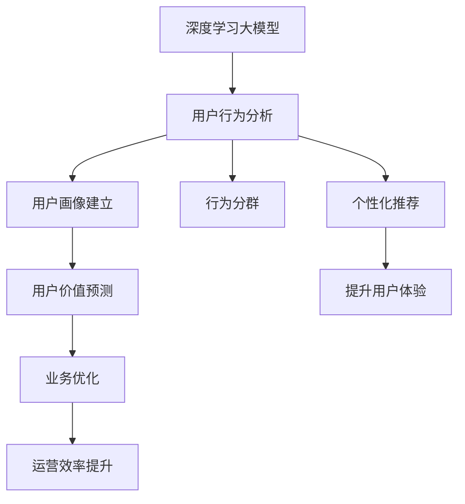

                 

# AI大模型在电商平台用户生命周期管理中的作用

> 关键词：电商平台,用户生命周期,用户行为分析,个性化推荐,大模型,深度学习,业务优化,客户体验

## 1. 背景介绍

### 1.1 问题由来
近年来，电商平台迅速发展，用户数量和交易额持续增长。用户生命周期管理(User Lifecycle Management, ULM)已成为电商平台优化用户体验、提高业务效率的重要手段。ULM主要关注如何通过精细化运营，提升用户转化率、留存率、复购率等关键指标，从而实现商业价值最大化。

然而，ULM涉及众多复杂因素，如用户属性、行为、偏好、市场变化等，如何高效分析并利用这些数据，是传统机器学习方法难以应对的挑战。大模型技术以其强大的泛化能力和可解释性，为电商平台提供了一种全新的解决方案。

### 1.2 问题核心关键点
- 用户生命周期管理(ULM)：通过用户行为数据分析，建立用户画像，实现用户价值预测、行为分群、个性化推荐等功能。
- 深度学习大模型：以Transformer等神经网络架构为代表的预训练模型，能够从海量数据中学习到高层次的特征表示，具备强大的泛化能力。
- 用户行为分析：对用户在平台上的浏览、搜索、购买、评价等行为数据进行分析，挖掘用户偏好和需求。
- 个性化推荐系统：根据用户画像和行为数据，推荐符合用户兴趣的产品，提升用户体验和转化率。
- 业务优化：通过数据驱动的策略调整，优化营销策略、产品设计、运营流程，实现业务增长。

这些关键概念通过有效的技术手段相结合，能够为电商平台提供强大的用户分析能力和个性化推荐服务，从而提升用户体验和商业价值。

### 1.3 问题研究意义
研究AI大模型在电商平台用户生命周期管理中的应用，对于提升用户满意度、优化业务运营、推动电商行业健康发展具有重要意义：

1. **提升用户体验**：通过个性化的推荐和服务，满足用户多样化需求，提升用户在平台上的粘性和满意度。
2. **优化运营效率**：通过数据驱动的运营决策，提高运营策略的精准性和有效性，降低运营成本。
3. **增强商业价值**：通过精准的用户画像和行为分析，实现更高效的客户转化和留存，增加收入。
4. **创新业务模式**：大模型技术的应用推动了电商行业服务智能化、产品个性化、营销精准化的趋势，催生了新的商业模式。

## 2. 核心概念与联系

### 2.1 核心概念概述

为更好地理解AI大模型在电商平台用户生命周期管理中的应用，本节将介绍几个密切相关的核心概念：

- **深度学习大模型**：以Transformer为代表的大规模预训练模型，通过在大规模无标签数据上自监督学习，获得强大的泛化能力。
- **用户生命周期管理(ULM)**：电商平台通过用户行为数据分析，建立用户画像，实现用户价值预测、行为分群、个性化推荐等功能。
- **用户行为分析**：对用户在平台上的浏览、搜索、购买、评价等行为数据进行分析，挖掘用户偏好和需求。
- **个性化推荐系统**：根据用户画像和行为数据，推荐符合用户兴趣的产品，提升用户体验和转化率。
- **业务优化**：通过数据驱动的策略调整，优化营销策略、产品设计、运营流程，实现业务增长。

这些核心概念之间的逻辑关系可以通过以下Mermaid流程图来展示：



这个流程图展示了大模型在电商平台ULM中的核心概念及其之间的关系：

1. 大模型通过学习海量数据，获得高层次的特征表示。
2. 用户行为分析利用大模型对用户行为数据进行挖掘和分析，形成用户画像。
3. 用户画像用于用户价值预测、行为分群和个性化推荐。
4. 个性化推荐提升用户体验，增加用户粘性。
5. 业务优化通过数据驱动的运营策略调整，提高运营效率。

## 3. 核心算法原理 & 具体操作步骤

### 3.1 算法原理概述

AI大模型在电商平台用户生命周期管理中的应用，主要涉及以下几个算法原理：

- **自监督预训练**：在大模型上应用自监督任务，如掩码语言模型、自编码器等，通过在大规模无标签数据上的预训练，获得高层次的语言表示。
- **行为数据抽取与特征构建**：对用户行为数据进行抽取和特征构建，生成可供模型训练的输入。
- **用户画像建立与行为分析**：通过大模型对用户行为特征进行建模，建立用户画像，进行用户行为分析。
- **用户价值预测与行为分群**：利用大模型对用户画像进行价值预测和行为分群，帮助电商平台进行精细化运营。
- **个性化推荐系统**：构建个性化推荐模型，根据用户画像和行为数据，推荐符合用户兴趣的产品。
- **业务优化与策略调整**：通过分析用户行为数据和模型预测结果，优化营销策略、产品设计、运营流程，实现业务增长。

### 3.2 算法步骤详解

AI大模型在电商平台ULM中的应用，主要包括以下几个关键步骤：

**Step 1: 数据准备**
- 收集和整理电商平台的各项用户行为数据，如浏览记录、搜索历史、购买记录、评价反馈等。
- 对数据进行清洗和预处理，去除噪声和异常值，确保数据质量。

**Step 2: 自监督预训练**
- 选择合适的预训练模型，如BERT、GPT等，在无标签数据上进行预训练。
- 在电商数据上应用自监督任务，如掩码语言模型、自编码器等，进行微调。

**Step 3: 用户画像建立**
- 对用户行为数据进行特征抽取和构建，生成用户画像。
- 利用大模型对用户画像进行表示学习，生成高层次的用户表示。

**Step 4: 用户价值预测与行为分群**
- 对用户表示进行预测，预测用户未来的行为（如购买、流失）。
- 基于预测结果，对用户进行行为分群，识别潜在的高价值用户和流失风险用户。

**Step 5: 个性化推荐系统**
- 构建个性化推荐模型，根据用户画像和行为数据，生成推荐列表。
- 在推荐系统中应用大模型，进行动态推荐，提升用户体验和转化率。

**Step 6: 业务优化与策略调整**
- 通过分析用户行为数据和模型预测结果，优化营销策略、产品设计、运营流程。
- 实时监测业务指标，根据模型预测和用户反馈，动态调整运营策略，提高业务效率。

### 3.3 算法优缺点

使用AI大模型进行电商平台用户生命周期管理的优点包括：

- **强大的泛化能力**：大模型能够从海量数据中学习到高层次的语言表示，适用于各种复杂场景。
- **高效的用户画像**：通过大模型进行用户行为分析，建立高效的用户画像。
- **精准的个性化推荐**：根据用户画像和行为数据，生成精准的推荐结果。
- **灵活的业务优化**：利用大模型进行数据驱动的运营决策，优化业务流程和策略。

然而，该方法也存在一定的局限性：

- **高计算成本**：大规模预训练模型的训练和推理需要高性能计算资源。
- **数据隐私风险**：用户行为数据的收集和使用需要遵守相关法律法规，保护用户隐私。
- **模型复杂性**：大模型的结构和参数复杂，难以解释和调试。
- **动态数据适应**：电商平台的数据分布经常变化，需要定期重新训练和微调模型，以适应新数据。

尽管存在这些局限性，但AI大模型在电商平台ULM中的应用仍然具有重要的价值。随着技术的不断进步和优化，相信这些问题都将得到有效解决。

### 3.4 算法应用领域

AI大模型在电商平台用户生命周期管理中的应用领域十分广泛，包括但不限于：

- **用户行为分析**：对用户浏览、搜索、购买、评价等行为进行深度分析，挖掘用户偏好和需求。
- **个性化推荐系统**：根据用户画像和行为数据，推荐符合用户兴趣的产品，提升用户体验和转化率。
- **客户流失预测**：利用大模型预测用户流失风险，进行精准预警和挽留。
- **营销策略优化**：通过分析用户行为数据和模型预测结果，优化营销策略，提高广告投放效果。
- **产品设计优化**：利用用户行为数据和模型分析结果，优化产品设计，提升用户满意度。
- **运营流程改进**：通过数据驱动的运营策略调整，提高运营效率，降低运营成本。

这些应用领域凸显了大模型在电商平台ULM中的强大应用潜力。

## 4. 数学模型和公式 & 详细讲解 & 举例说明

### 4.1 数学模型构建

本节将使用数学语言对AI大模型在电商平台用户生命周期管理中的应用进行更加严格的刻画。

设电商平台的用户数据集为 $D=\{(x_i,y_i)\}_{i=1}^N$，其中 $x_i$ 表示用户行为数据， $y_i$ 表示用户价值标签，如是否购买、是否流失等。假设大模型为 $M_\theta$，其中 $\theta$ 为模型参数。

定义损失函数 $\ell(M_\theta,x,y)$ 为模型预测输出 $M_\theta(x)$ 与真实标签 $y$ 之间的差异。则经验风险为：

$$
\mathcal{L}(\theta) = \frac{1}{N}\sum_{i=1}^N \ell(M_\theta(x_i),y_i)
$$

在电商平台中，用户价值预测是一个常见的任务，可以使用二分类交叉熵损失函数：

$$
\ell(M_\theta(x),y) = -[y\log M_\theta(x)+(1-y)\log(1-M_\theta(x))]
$$

其中 $y \in \{0,1\}$，表示用户是否购买。

### 4.2 公式推导过程

以用户价值预测为例，对大模型的训练过程进行详细推导：

首先，根据大模型的预测结果，计算预测概率：

$$
\hat{y} = M_\theta(x)
$$

然后，根据二分类交叉熵损失函数计算损失：

$$
\ell(M_\theta(x),y) = -[y\log \hat{y}+(1-y)\log(1-\hat{y})]
$$

将损失函数对模型参数 $\theta$ 求导，得到梯度：

$$
\frac{\partial \ell(M_\theta(x),y)}{\partial \theta} = -\frac{y}{M_\theta(x)}+\frac{1-y}{1-M_\theta(x)}\frac{\partial M_\theta(x)}{\partial \theta}
$$

根据梯度下降算法，更新模型参数 $\theta$：

$$
\theta \leftarrow \theta - \eta \frac{\partial \ell(M_\theta(x),y)}{\partial \theta}
$$

其中 $\eta$ 为学习率。通过不断迭代训练，模型参数逐渐逼近最优值，完成用户价值预测任务。

### 4.3 案例分析与讲解

假设电商平台希望预测用户是否会在未来一周内购买某商品，可以通过以下步骤进行建模和训练：

**Step 1: 数据准备**
- 收集用户浏览、搜索、点击、购买等行为数据，作为训练集的输入。
- 将用户是否购买作为标签，标记为1或0。

**Step 2: 特征工程**
- 对用户行为数据进行特征工程，提取有意义的特征，如用户历史购买记录、浏览时长、点击次数等。
- 对用户画像进行表示学习，生成高层次的用户表示。

**Step 3: 模型训练**
- 使用大模型对用户表示进行训练，预测用户购买概率。
- 在训练过程中应用正则化技术，如L2正则、Dropout等，避免过拟合。

**Step 4: 模型评估与优化**
- 在验证集上评估模型性能，使用AUC、ROC等指标衡量模型效果。
- 根据评估结果调整模型参数和训练策略，优化模型性能。

## 5. 项目实践：代码实例和详细解释说明

### 5.1 开发环境搭建

在进行AI大模型在电商平台ULM中的应用实践前，我们需要准备好开发环境。以下是使用Python进行TensorFlow开发的环境配置流程：

1. 安装Anaconda：从官网下载并安装Anaconda，用于创建独立的Python环境。

2. 创建并激活虚拟环境：
```bash
conda create -n tf-env python=3.8 
conda activate tf-env
```

3. 安装TensorFlow：根据CUDA版本，从官网获取对应的安装命令。例如：
```bash
conda install tensorflow==2.7.0
```

4. 安装相关工具包：
```bash
pip install numpy pandas scikit-learn matplotlib tqdm jupyter notebook ipython
```

完成上述步骤后，即可在`tf-env`环境中开始模型开发。

### 5.2 源代码详细实现

下面我们以电商平台个性化推荐系统为例，给出使用TensorFlow进行模型训练和评估的Python代码实现。

首先，定义推荐系统的数据处理函数：

```python
import tensorflow as tf
from tensorflow.keras import layers

def build_model(input_dim, hidden_dim, output_dim):
    model = tf.keras.Sequential()
    model.add(layers.Dense(hidden_dim, activation='relu', input_shape=(input_dim,)))
    model.add(layers.Dense(hidden_dim, activation='relu'))
    model.add(layers.Dense(output_dim, activation='sigmoid'))
    return model

def train_model(model, train_data, train_labels, epochs, batch_size):
    model.compile(optimizer='adam', loss='binary_crossentropy', metrics=['accuracy'])
    history = model.fit(train_data, train_labels, epochs=epochs, batch_size=batch_size, validation_split=0.2)
    return model, history
```

然后，定义用户行为数据的特征工程函数：

```python
def preprocess_data(data):
    # 特征选择和转换
    features = []
    for item in data:
        # 将用户行为数据转化为向量形式
        features.append([item['feature1'], item['feature2'], item['feature3']])
    return np.array(features)

# 构建训练数据集
data = [
    {'feature1': 1, 'feature2': 0, 'feature3': 1, 'label': 1},
    {'feature1': 0, 'feature2': 1, 'feature3': 0, 'label': 0},
    {'feature1': 1, 'feature2': 1, 'feature3': 1, 'label': 1},
    {'feature1': 0, 'feature2': 0, 'feature3': 0, 'label': 0}
]

# 将数据转化为模型可接受的格式
features = preprocess_data(data)
labels = np.array([label for _, label in data])

# 划分训练集和验证集
train_data, val_data = features[:int(0.8*len(features)), :], features[int(0.8*len(features)):, :]
train_labels, val_labels = labels[:int(0.8*len(labels)), :], labels[int(0.8*len(labels)):, :]
```

接着，定义模型训练函数和评估函数：

```python
# 构建模型
input_dim = features.shape[1]
hidden_dim = 64
output_dim = 1
model = build_model(input_dim, hidden_dim, output_dim)

# 训练模型
epochs = 100
batch_size = 32
model, history = train_model(model, train_data, train_labels, epochs, batch_size)

# 评估模型
val_loss, val_accuracy = model.evaluate(val_data, val_labels)
print(f'Validation loss: {val_loss:.4f}')
print(f'Validation accuracy: {val_accuracy:.4f}')
```

最后，启动训练流程并在验证集上评估：

```python
# 训练模型
model.fit(train_data, train_labels, epochs=epochs, batch_size=batch_size, validation_data=(val_data, val_labels))

# 评估模型
val_loss, val_accuracy = model.evaluate(val_data, val_labels)
print(f'Validation loss: {val_loss:.4f}')
print(f'Validation accuracy: {val_accuracy:.4f}')
```

以上就是使用TensorFlow对电商平台个性化推荐系统进行模型训练和评估的完整代码实现。可以看到，TensorFlow提供了强大的模型构建和训练工具，可以方便地进行复杂神经网络的训练和优化。

### 5.3 代码解读与分析

让我们再详细解读一下关键代码的实现细节：

**build_model函数**：
- 定义了一个简单的全连接神经网络模型，包括两个隐藏层和一个输出层。

**train_model函数**：
- 对模型进行编译，设置优化器、损失函数和评估指标。
- 在训练数据上调用模型fit方法进行训练，记录训练过程中的指标。
- 返回训练后的模型和历史训练结果。

**preprocess_data函数**：
- 对用户行为数据进行特征工程处理，将其转化为模型可接受的格式。
- 示例数据为一个二维数组，包含用户行为特征和标签。

**训练和评估流程**：
- 定义训练数据集和验证数据集。
- 构建模型并设置参数。
- 在训练数据上训练模型，在验证数据上评估模型效果。
- 输出训练后的模型和验证结果。

可以看到，TensorFlow的高级API使得模型训练和评估的代码实现变得简洁高效。开发者可以将更多精力放在数据处理、模型优化等高层逻辑上，而不必过多关注底层的实现细节。

当然，工业级的系统实现还需考虑更多因素，如模型的保存和部署、超参数的自动搜索、更灵活的任务适配层等。但核心的模型训练和评估过程基本与此类似。

## 6. 实际应用场景

### 6.1 智能客服系统

基于AI大模型的电商平台智能客服系统，可以实时响应用户咨询，提供24小时不间断服务，显著提升客户满意度。

在技术实现上，可以通过收集历史客服聊天记录，构建监督数据集，对大模型进行微调。微调后的模型能够自动理解用户意图，匹配最合适的回复模板，进行智能客服。对于新问题，还可以接入检索系统实时搜索相关内容，动态生成回复。

### 6.2 个性化推荐系统

通过AI大模型进行电商平台个性化推荐，能够精准匹配用户兴趣，提升用户购买体验和转化率。

在技术实现上，可以收集用户浏览、搜索、点击、购买等行为数据，提取特征并进行预训练。在电商平台数据上应用微调任务，训练推荐模型。根据用户画像和行为数据，生成个性化推荐结果，并在推荐系统中应用大模型，进行动态推荐。

### 6.3 客户流失预测

通过AI大模型进行客户流失预测，可以提前预警潜在流失用户，进行精准挽留。

在技术实现上，可以收集用户行为数据和购买记录，构建流失预测数据集。利用大模型进行微调，预测用户流失风险。根据模型预测结果，进行客户分组和分类，对高风险用户进行精准挽留策略。

### 6.4 营销策略优化

基于AI大模型的电商平台营销策略优化，能够实现更高效的广告投放和营销效果。

在技术实现上，可以收集用户行为数据和广告投放数据，进行数据分析和建模。利用大模型进行微调，预测广告效果和用户响应。根据模型预测结果，优化广告投放策略，提高广告投放效果。

## 7. 工具和资源推荐

### 7.1 学习资源推荐

为了帮助开发者系统掌握AI大模型在电商平台ULM中的应用，这里推荐一些优质的学习资源：

1. 《深度学习基础》课程：由Coursera提供，涵盖深度学习基础和常见算法，适合入门学习。

2. 《TensorFlow官方文档》：TensorFlow的官方文档，提供了丰富的教程和示例，适合深入学习。

3. 《大规模深度学习模型在NLP中的应用》书籍：介绍了大模型在NLP领域的应用，包括用户行为分析、个性化推荐等。

4. 《NLP与深度学习》课程：由Kaggle提供，涵盖NLP基础和深度学习算法，适合进阶学习。

5. 《Transformers与NLP应用》书籍：介绍了Transformers模型在大模型中的应用，包括电商推荐等。

通过对这些资源的学习实践，相信你一定能够快速掌握AI大模型在电商平台ULM中的应用，并用于解决实际的NLP问题。

### 7.2 开发工具推荐

高效的开发离不开优秀的工具支持。以下是几款用于AI大模型在电商平台ULM中应用的开发工具：

1. TensorFlow：由Google主导开发的开源深度学习框架，生产部署方便，适合大规模工程应用。

2. PyTorch：基于Python的开源深度学习框架，灵活动态的计算图，适合快速迭代研究。

3. Scikit-learn：基于Python的机器学习库，提供了丰富的算法和工具，适合数据处理和特征工程。

4. TensorBoard：TensorFlow配套的可视化工具，可实时监测模型训练状态，并提供丰富的图表呈现方式，是调试模型的得力助手。

5. Weights & Biases：模型训练的实验跟踪工具，可以记录和可视化模型训练过程中的各项指标，方便对比和调优。

合理利用这些工具，可以显著提升AI大模型在电商平台ULM中的应用开发效率，加快创新迭代的步伐。

### 7.3 相关论文推荐

AI大模型在电商平台ULM中的应用源于学界的持续研究。以下是几篇奠基性的相关论文，推荐阅读：

1. Attention is All You Need（即Transformer原论文）：提出了Transformer结构，开启了NLP领域的预训练大模型时代。

2. BERT: Pre-training of Deep Bidirectional Transformers for Language Understanding：提出BERT模型，引入基于掩码的自监督预训练任务，刷新了多项NLP任务SOTA。

3. Multi-Task Learning with Pre-training for Text Generation：利用多任务学习，提高生成任务的效果，适合电商推荐等应用。

4. Personalized Recommendation with Self-Attention-based Networks：介绍了自注意力机制在推荐系统中的应用，适合电商推荐等任务。

5. Online Learning for Recommender Systems with Large-Dimensional Sparse Data：介绍了在线学习算法在推荐系统中的应用，适合电商平台数据动态变化的情况。

这些论文代表了大模型在电商平台ULM中的应用发展脉络。通过学习这些前沿成果，可以帮助研究者把握学科前进方向，激发更多的创新灵感。

## 8. 总结：未来发展趋势与挑战

### 8.1 总结

本文对AI大模型在电商平台用户生命周期管理中的应用进行了全面系统的介绍。首先阐述了用户生命周期管理的背景和重要性，明确了AI大模型在ULM中的独特价值。其次，从原理到实践，详细讲解了AI大模型在电商平台ULM中的应用，给出了完整的代码实例。同时，本文还广泛探讨了AI大模型在电商平台的应用场景，展示了其强大的应用潜力。此外，本文精选了AI大模型在电商平台ULM中的学习资源、开发工具和相关论文，力求为开发者提供全方位的技术指引。

通过本文的系统梳理，可以看到，AI大模型在电商平台ULM中的强大应用潜力。得益于大模型技术的强大泛化能力和可解释性，电商平台能够通过精细化运营，提升用户体验和商业价值。未来，随着大模型技术的发展和优化，相信这些应用将进一步拓展，为电商行业带来更大的变革。

### 8.2 未来发展趋势

展望未来，AI大模型在电商平台ULM中的应用将呈现以下几个发展趋势：

1. **模型规模持续增大**：随着算力成本的下降和数据规模的扩张，预训练语言模型的参数量还将持续增长。超大规模语言模型蕴含的丰富语言知识，有望支撑更加复杂多变的电商平台ULM任务。

2. **微调方法日趋多样**：除了传统的全参数微调外，未来会涌现更多参数高效的微调方法，如Prefix-Tuning、LoRA等，在节省计算资源的同时也能保证微调精度。

3. **业务优化更加智能**：通过引入更多的先验知识和领域知识，如知识图谱、逻辑规则等，结合大模型的强泛化能力，实现更加全面、准确的用户行为分析。

4. **个性化推荐更加精准**：通过融合多模态数据（如视觉、语音、文本等），构建更加精准的个性化推荐模型，提升用户体验和转化率。

5. **智能客服更加人性化**：通过大模型的语言理解和生成能力，构建更加智能和人性化的电商平台客服系统，提升客户满意度。

6. **实时推荐更加及时**：通过实时数据流处理和在线学习技术，构建实时推荐系统，提升推荐的时效性和准确性。

以上趋势凸显了AI大模型在电商平台ULM中的广阔前景。这些方向的探索发展，必将进一步提升电商平台的运营效率和用户体验，推动电商行业健康发展。

### 8.3 面临的挑战

尽管AI大模型在电商平台ULM中的应用已经取得了显著成效，但在迈向更加智能化、普适化应用的过程中，它仍面临着诸多挑战：

1. **高计算成本**：大规模预训练模型的训练和推理需要高性能计算资源，导致成本高昂。

2. **数据隐私风险**：用户行为数据的收集和使用需要遵守相关法律法规，保护用户隐私。

3. **模型复杂性**：大模型的结构和参数复杂，难以解释和调试。

4. **动态数据适应**：电商平台的数据分布经常变化，需要定期重新训练和微调模型，以适应新数据。

5. **客户体验问题**：智能推荐系统可能会过度干预用户选择，导致客户体验下降。

6. **市场竞争**：电商平台之间的竞争加剧，需要不断优化推荐系统以保持竞争力。

尽管存在这些挑战，但AI大模型在电商平台ULM中的应用仍然具有重要的价值。随着技术的不断进步和优化，相信这些问题都将得到有效解决。

### 8.4 研究展望

面向未来，AI大模型在电商平台ULM中的应用研究需要在以下几个方面寻求新的突破：

1. **多模态数据融合**：将视觉、语音、文本等多模态数据融合，构建更加全面的用户画像，提升推荐系统的效果。

2. **因果推理技术**：引入因果推理技术，增强推荐系统的稳定性和鲁棒性，避免过度拟合。

3. **可解释性增强**：研究如何赋予AI大模型更强的可解释性，增强用户对推荐结果的信任度。

4. **实时数据处理**：利用在线学习技术，实时处理用户行为数据，构建实时推荐系统，提升推荐的时效性。

5. **跨领域知识整合**：将跨领域的知识整合到推荐系统中，提升推荐系统的全面性和准确性。

6. **用户隐私保护**：研究如何在保护用户隐私的前提下，收集和使用用户行为数据，提高推荐系统的公平性和透明度。

这些研究方向的探索，必将引领AI大模型在电商平台ULM中的技术创新和应用优化，推动电商行业的发展和进步。

## 9. 附录：常见问题与解答

**Q1：电商平台如何利用AI大模型进行个性化推荐？**

A: 电商平台可以利用AI大模型进行个性化推荐，具体步骤如下：

1. 收集用户行为数据，如浏览、搜索、点击、购买等。
2. 对行为数据进行特征工程，提取有意义的特征。
3. 应用自监督预训练任务，在大模型上微调推荐模型。
4. 根据用户画像和行为数据，生成个性化推荐结果。
5. 在推荐系统中应用大模型，进行动态推荐，提升用户体验和转化率。

**Q2：AI大模型在电商平台中如何进行用户行为分析？**

A: AI大模型在电商平台中进行用户行为分析，可以通过以下步骤：

1. 收集用户行为数据，如浏览、搜索、点击、评价等。
2. 对行为数据进行特征工程，提取有意义的特征。
3. 应用自监督预训练任务，在大模型上微调用户行为分析模型。
4. 利用大模型对用户行为特征进行建模，建立用户画像。
5. 根据用户画像，进行用户行为分析，挖掘用户偏好和需求。

**Q3：电商平台如何利用AI大模型进行用户价值预测？**

A: 电商平台可以利用AI大模型进行用户价值预测，具体步骤如下：

1. 收集用户行为数据，如浏览、搜索、点击、购买等。
2. 对行为数据进行特征工程，提取有意义的特征。
3. 应用自监督预训练任务，在大模型上微调用户价值预测模型。
4. 根据用户画像和行为数据，预测用户未来的行为，如购买、流失等。
5. 利用大模型进行用户价值预测，帮助电商平台进行精细化运营。

**Q4：电商平台如何利用AI大模型进行客户流失预测？**

A: 电商平台可以利用AI大模型进行客户流失预测，具体步骤如下：

1. 收集用户行为数据，如浏览、搜索、点击、购买等。
2. 对行为数据进行特征工程，提取有意义的特征。
3. 应用自监督预训练任务，在大模型上微调客户流失预测模型。
4. 根据用户画像和行为数据，预测用户流失风险，进行精准预警和挽留。
5. 利用大模型进行客户流失预测，帮助电商平台进行精准挽留策略。

**Q5：电商平台如何利用AI大模型进行营销策略优化？**

A: 电商平台可以利用AI大模型进行营销策略优化，具体步骤如下：

1. 收集用户行为数据和广告投放数据，进行数据分析和建模。
2. 应用自监督预训练任务，在大模型上微调营销策略优化模型。
3. 根据模型预测结果，优化广告投放策略，提高广告投放效果。
4. 利用大模型进行营销策略优化，实现更高效的广告投放和营销效果。

---

作者：禅与计算机程序设计艺术 / Zen and the Art of Computer Programming

