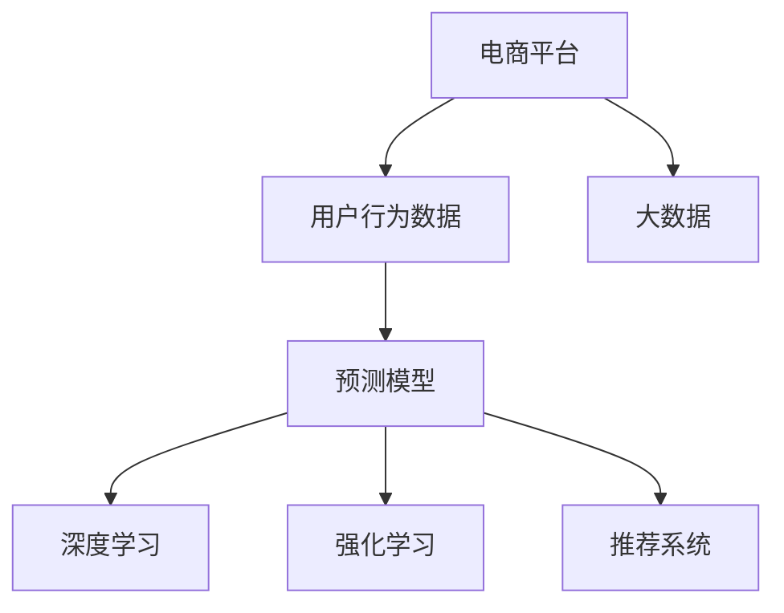

                 

# AI大模型在电商平台用户行为预测精确化中的应用

> 关键词：电商平台, 用户行为, 预测精确化, AI大模型, 深度学习, 强化学习, 推荐系统, 大数据

## 1. 背景介绍

在当今数字化时代，电商平台已经成为消费者购物的重要平台。面对海量的商品和瞬息万变的市场环境，用户的行为预测变得至关重要。精准预测用户的购买意愿、浏览行为、评价反馈等，有助于电商平台提供个性化推荐，提升用户体验，增加销售转化率。传统的用户行为预测方法通常基于简单的统计模型，难以捕捉复杂的用户偏好和动态行为。而人工智能大模型，特别是深度学习和强化学习模型，提供了新的可能性。

### 1.1 问题由来

电商平台面临的用户行为预测问题主要包括以下几个方面：

1. **用户偏好预测**：预测用户的购物偏好，如喜欢的商品类别、品牌、价格区间等。
2. **浏览行为预测**：预测用户访问电商平台时的浏览行为，如浏览路径、停留时间、点击率等。
3. **购买意愿预测**：预测用户的购买意愿，如点击转化率、购买转化率等。
4. **评价反馈预测**：预测用户对商品的评价情感倾向，如好评、差评等。

传统的方法如逻辑回归、随机森林等在面对复杂多变的用户行为数据时，表现有限。而人工智能大模型，尤其是深度学习模型，能够利用大数据学习到更加复杂的特征和模式，提高预测的准确性。

### 1.2 问题核心关键点

电商平台的用户行为预测需要解决以下几个核心问题：

1. **数据收集和预处理**：收集用户在平台上的行为数据，并进行清洗、去重、归一化等预处理，为模型训练提供高质量数据。
2. **模型选择和设计**：选择适当的模型架构，如深度学习神经网络、强化学习模型等，并设计合适的损失函数和优化算法。
3. **模型训练和优化**：使用电商平台的历史数据进行模型训练，并优化模型的超参数，提高预测精度。
4. **模型部署和评估**：将训练好的模型部署到实际应用中，并持续评估模型的表现，进行迭代优化。

解决这些问题的关键在于如何充分利用电商平台的大数据资源，以及如何设计高效、灵活的AI大模型，以适应不同的用户行为预测任务。

## 2. 核心概念与联系

### 2.1 核心概念概述

为了更好地理解AI大模型在电商平台用户行为预测中的应用，本节将介绍几个关键概念：

- **电商平台**：指在线销售商品的商业平台，如淘宝、京东、亚马逊等。
- **用户行为数据**：指用户在电商平台上的各种行为数据，如浏览记录、点击记录、购买记录、评价记录等。
- **预测模型**：指通过历史数据训练得到的，能够预测用户未来行为的概率模型，如深度学习神经网络、强化学习模型等。
- **深度学习**：指通过多层次神经网络学习数据的复杂表示，能够捕捉数据中的高阶特征和模式。
- **强化学习**：指通过试错学习，不断优化模型策略，以最大化累积奖励，适用于需要考虑长期奖励的行为预测任务。
- **推荐系统**：指利用用户行为数据和商品特征，为每个用户推荐最适合的商品的系统。
- **大数据**：指规模大、类型多、速度快、价值密度低的数据，电商平台具有天然的大数据优势。

这些核心概念之间的逻辑关系可以通过以下Mermaid流程图来展示：



这个流程图展示了电商平台、用户行为数据、预测模型、深度学习、强化学习、推荐系统和大数据之间的关系：

1. 电商平台收集用户行为数据。
2. 深度学习和强化学习模型对用户行为数据进行建模。
3. 基于预测模型的推荐系统为用户推荐商品。
4. 大数据为模型提供丰富的训练和测试数据。

## 3. 核心算法原理 & 具体操作步骤

### 3.1 算法原理概述

AI大模型在电商平台用户行为预测中，通常使用深度学习和强化学习算法。深度学习模型能够利用多层次的非线性变换，捕捉用户行为数据中的复杂模式，适用于推荐系统和评价预测等任务。强化学习模型则通过试错学习，优化策略以最大化长期奖励，适用于购买意愿预测等任务。

### 3.2 算法步骤详解

以下以深度学习模型为例，详细介绍电商平台用户行为预测的深度学习算法步骤：

**Step 1: 数据收集和预处理**
- 收集电商平台的用户行为数据，包括浏览记录、点击记录、购买记录、评价记录等。
- 对数据进行清洗、去重、归一化等预处理，去除异常值和噪声。

**Step 2: 特征工程**
- 提取用户行为数据中的关键特征，如用户ID、商品ID、浏览时间、点击次数、购买次数等。
- 设计合适的特征表示方法，如向量表示、稀疏表示、嵌入式表示等。

**Step 3: 模型选择和设计**
- 选择合适的深度学习模型架构，如多层感知机、卷积神经网络、循环神经网络等。
- 设计合适的损失函数和优化算法，如交叉熵损失、Adam优化器等。

**Step 4: 模型训练和优化**
- 使用电商平台的历史数据进行模型训练，并优化模型的超参数，提高预测精度。
- 使用交叉验证等方法评估模型性能，进行模型选择。

**Step 5: 模型部署和评估**
- 将训练好的模型部署到实际应用中，进行实时预测。
- 持续收集新的用户行为数据，更新模型参数，进行迭代优化。

### 3.3 算法优缺点

AI大模型在电商平台用户行为预测中有以下优点：

1. **预测精度高**：深度学习模型能够利用大数据学习到复杂模式，提高预测精度。
2. **模型灵活性**：可以根据不同的用户行为预测任务，设计不同的模型架构和损失函数。
3. **数据利用率高**：大数据为模型提供了丰富的训练和测试数据，能够最大化利用数据价值。

同时，这些模型也存在一些缺点：

1. **计算资源需求高**：深度学习模型通常需要大量的计算资源进行训练和推理。
2. **模型复杂度高**：模型结构复杂，参数数量庞大，难以解释和调试。
3. **过拟合风险**：数据量不足或特征工程不当，容易导致模型过拟合。

### 3.4 算法应用领域

AI大模型在电商平台用户行为预测中，主要应用于以下领域：

1. **推荐系统**：根据用户历史行为和偏好，为用户推荐最适合的商品。
2. **购买意愿预测**：预测用户点击商品后的购买概率，优化广告投放策略。
3. **浏览行为预测**：预测用户浏览商品时的停留时间、点击率等行为特征。
4. **评价反馈预测**：预测用户对商品的评价情感倾向，优化商品评价策略。

## 4. 数学模型和公式 & 详细讲解 & 举例说明

### 4.1 数学模型构建

在本节中，我们以电商平台用户行为预测为例，构建深度学习模型。假设输入为 $x$，输出为 $y$，其中 $x$ 为特征向量， $y$ 为预测结果（如购买概率）。模型结构如图1所示。


### 4.2 公式推导过程

模型使用多层感知机（MLP）结构，如图2所示。设 $x$ 为输入特征向量， $w_i$ 为第 $i$ 层的权重矩阵， $b_i$ 为第 $i$ 层的偏置向量， $f_i$ 为激活函数。


模型的输出为：

$$
h^{[L]} = f_L(W^{[L]}h^{[L-1]} + b^{[L]})
$$

其中 $h^{[L]}$ 为输出层的激活函数输出。

假设模型有 $n$ 个训练样本，训练数据集为 $D = \{(x_i,y_i)\}_{i=1}^n$。模型的损失函数为均方误差损失（Mean Squared Error，MSE）：

$$
\mathcal{L}(\theta) = \frac{1}{n} \sum_{i=1}^n (y_i - \hat{y}_i)^2
$$

其中 $\hat{y}_i$ 为模型预测的输出。

### 4.3 案例分析与讲解

以电商平台用户购买行为预测为例，假设有一个电商平台，收集了1000个用户的购买数据。每个用户有10个特征，如年龄、性别、历史购买次数等。使用多层感知机模型进行预测，训练样本数为800个，验证样本数为200个，测试样本数为100个。

具体步骤如下：

1. 将用户特征进行编码，得到特征向量 $x$。
2. 使用多层感知机模型进行预测，得到购买概率 $\hat{y}$。
3. 计算预测结果与真实标签之间的均方误差损失。
4. 使用Adam优化器更新模型参数，最小化损失函数。
5. 在验证集上评估模型性能，选择最优模型。
6. 在测试集上评估模型性能，输出最终预测结果。

## 5. 项目实践：代码实例和详细解释说明

### 5.1 开发环境搭建

在进行项目实践前，我们需要准备好开发环境。以下是使用Python进行PyTorch开发的环境配置流程：

1. 安装Anaconda：从官网下载并安装Anaconda，用于创建独立的Python环境。

2. 创建并激活虚拟环境：
```bash
conda create -n pytorch-env python=3.8 
conda activate pytorch-env
```

3. 安装PyTorch：根据CUDA版本，从官网获取对应的安装命令。例如：
```bash
conda install pytorch torchvision torchaudio cudatoolkit=11.1 -c pytorch -c conda-forge
```

4. 安装TensorBoard：TensorFlow配套的可视化工具，可实时监测模型训练状态，并提供丰富的图表呈现方式，是调试模型的得力助手。

5. 安装TensorFlow：由Google主导开发的开源深度学习框架，生产部署方便，适合大规模工程应用。

6. 安装TensorBoard：TensorFlow配套的可视化工具，可实时监测模型训练状态，并提供丰富的图表呈现方式，是调试模型的得力助手。

7. 安装Weights & Biases：模型训练的实验跟踪工具，可以记录和可视化模型训练过程中的各项指标，方便对比和调优。

### 5.2 源代码详细实现

下面我们以电商平台用户购买行为预测为例，给出使用PyTorch实现深度学习模型的代码。

首先，定义模型结构：

```python
import torch
import torch.nn as nn
import torch.optim as optim

class MLP(nn.Module):
    def __init__(self, input_size, hidden_size, output_size):
        super(MLP, self).__init__()
        self.layers = nn.Sequential(
            nn.Linear(input_size, hidden_size),
            nn.ReLU(),
            nn.Linear(hidden_size, output_size),
            nn.Sigmoid()
        )
    
    def forward(self, x):
        return self.layers(x)
```

然后，定义训练函数：

```python
def train(model, train_loader, valid_loader, epochs, batch_size, learning_rate):
    optimizer = optim.Adam(model.parameters(), lr=learning_rate)
    loss_fn = nn.MSELoss()
    device = torch.device('cuda' if torch.cuda.is_available() else 'cpu')
    
    for epoch in range(epochs):
        model.train()
        train_loss = 0.0
        train_correct = 0
        
        for batch_idx, (features, targets) in enumerate(train_loader):
            features = features.to(device)
            targets = targets.to(device)
            
            optimizer.zero_grad()
            outputs = model(features)
            loss = loss_fn(outputs, targets)
            loss.backward()
            optimizer.step()
            
            train_loss += loss.item()
            _, predicted = torch.max(outputs.data, 1)
            train_correct += (predicted == targets).sum().item()
            
        train_loss /= len(train_loader)
        train_acc = train_correct / len(train_loader.dataset)
        
        model.eval()
        valid_loss = 0.0
        valid_correct = 0
        
        with torch.no_grad():
            for features, targets in valid_loader:
                features = features.to(device)
                targets = targets.to(device)
                
                outputs = model(features)
                loss = loss_fn(outputs, targets)
                valid_loss += loss.item()
                _, predicted = torch.max(outputs.data, 1)
                valid_correct += (predicted == targets).sum().item()
            
        valid_loss /= len(valid_loader)
        valid_acc = valid_correct / len(valid_loader.dataset)
        
        print(f'Epoch {epoch+1}, train loss: {train_loss:.4f}, train acc: {train_acc:.4f}, valid loss: {valid_loss:.4f}, valid acc: {valid_acc:.4f}')
```

最后，启动训练流程：

```python
input_size = 10
hidden_size = 128
output_size = 1
batch_size = 64
learning_rate = 0.001
epochs = 10

model = MLP(input_size, hidden_size, output_size).to(device)
train_loader = DataLoader(train_dataset, batch_size=batch_size, shuffle=True)
valid_loader = DataLoader(valid_dataset, batch_size=batch_size, shuffle=False)

train(model, train_loader, valid_loader, epochs, batch_size, learning_rate)
```

### 5.3 代码解读与分析

让我们再详细解读一下关键代码的实现细节：

**MLP类**：
- `__init__`方法：初始化神经网络的层和激活函数。
- `forward`方法：前向传播计算输出结果。

**train函数**：
- 定义优化器、损失函数、设备等。
- 在每个epoch中，对训练集和验证集进行迭代，计算损失和准确率，并输出。
- 使用Adam优化器更新模型参数，最小化损失函数。
- 在验证集上评估模型性能，选择最优模型。

**训练流程**：
- 定义模型参数、批次大小、学习率、epoch数等。
- 在训练集上训练模型，在验证集上评估模型性能。
- 重复训练epoch次，更新模型参数，输出模型在训练集和验证集上的性能指标。

可以看到，使用PyTorch实现深度学习模型非常简单高效。开发者可以专注于模型架构和超参数的调整，而不必过多关注底层的实现细节。

当然，工业级的系统实现还需考虑更多因素，如模型的保存和部署、超参数的自动搜索、更灵活的任务适配层等。但核心的深度学习模型实现代码与此类似。

## 6. 实际应用场景

### 6.1 智能推荐系统

电商平台使用AI大模型进行智能推荐系统，能够为用户推荐最感兴趣的商品，提升用户体验和销售转化率。推荐系统一般分为两个部分：召回和排序。

1. **召回**：通过用户历史行为数据，预测用户可能感兴趣的商品。
2. **排序**：根据用户行为和商品特征，对推荐商品进行排序，提升推荐质量。

AI大模型在推荐系统中的应用如图3所示。


### 6.2 个性化营销

电商平台使用AI大模型进行个性化营销，能够根据用户行为预测其购买意向，制定个性化的营销策略，提升营销效果。个性化营销一般包括以下几个步骤：

1. **用户画像构建**：通过用户行为数据构建用户画像，描述用户兴趣和偏好。
2. **个性化广告投放**：根据用户画像，推送个性化的广告，提升广告点击率。
3. **效果评估**：评估个性化广告的效果，不断优化广告投放策略。

### 6.3 实时评价预测

电商平台使用AI大模型进行实时评价预测，能够预测用户对商品的评价情感倾向，优化商品评价策略，提升商品质量。评价预测一般包括以下几个步骤：

1. **用户情感分析**：通过用户评论和评分，预测用户对商品的评价情感倾向。
2. **情感分类**：将评价情感分类为正面、中性或负面。
3. **评价优化**：根据评价情感，优化商品质量，提升用户满意度。

### 6.4 未来应用展望

随着AI大模型的不断发展，电商平台用户行为预测的应用将更加广泛。未来，AI大模型将在以下几个方面发挥重要作用：

1. **动态定价**：通过用户行为预测，动态调整商品价格，优化销售利润。
2. **库存管理**：通过用户行为预测，优化库存管理，避免缺货或积压。
3. **营销策略优化**：通过用户行为预测，优化营销策略，提升广告效果。
4. **客户服务**：通过用户行为预测，预测客户投诉风险，提高客户服务质量。

## 7. 工具和资源推荐

### 7.1 学习资源推荐

为了帮助开发者系统掌握AI大模型在电商平台用户行为预测中的应用，这里推荐一些优质的学习资源：

1. 《深度学习》课程：由斯坦福大学开设的深度学习明星课程，涵盖深度学习的基础理论和实际应用。
2. 《强化学习》课程：由斯坦福大学开设的强化学习课程，涵盖强化学习的基础理论和实际应用。
3. 《推荐系统》书籍：详细介绍了推荐系统的基本概念和算法，包括深度学习推荐系统。
4. 《自然语言处理》书籍：详细介绍了自然语言处理的基本概念和算法，包括深度学习在自然语言处理中的应用。
5. PyTorch官方文档：提供了大量深度学习模型的实现和应用示例。
6. TensorFlow官方文档：提供了大量深度学习模型的实现和应用示例。

通过对这些资源的学习实践，相信你一定能够快速掌握AI大模型在电商平台用户行为预测中的精髓，并用于解决实际的电商问题。

### 7.2 开发工具推荐

高效的开发离不开优秀的工具支持。以下是几款用于AI大模型开发的工具：

1. PyTorch：基于Python的开源深度学习框架，灵活动态的计算图，适合快速迭代研究。
2. TensorFlow：由Google主导开发的开源深度学习框架，生产部署方便，适合大规模工程应用。
3. TensorBoard：TensorFlow配套的可视化工具，可实时监测模型训练状态，并提供丰富的图表呈现方式。
4. Weights & Biases：模型训练的实验跟踪工具，可以记录和可视化模型训练过程中的各项指标。
5. Keras：Keras是一个高级神经网络API，提供了简单易用的接口，方便快速构建深度学习模型。

合理利用这些工具，可以显著提升AI大模型在电商平台用户行为预测中的开发效率，加快创新迭代的步伐。

### 7.3 相关论文推荐

AI大模型在电商平台用户行为预测的研究涉及多个领域，以下是几篇奠基性的相关论文，推荐阅读：

1. Attention is All You Need（即Transformer原论文）：提出了Transformer结构，开启了深度学习在大模型中的应用。
2. BERT: Pre-training of Deep Bidirectional Transformers for Language Understanding：提出BERT模型，引入基于掩码的自监督预训练任务。
3. Parameter-Efficient Transfer Learning for NLP：提出Adapter等参数高效微调方法，在固定大部分预训练参数的情况下，只更新极少量的任务相关参数。
4. Sequence to Sequence Learning with Neural Networks：提出了序列到序列的模型架构，应用于机器翻译、文本生成等任务。
5. Hierarchical Attention Networks for Document Classification：提出层次注意力网络，应用于文本分类任务。

这些论文代表了大模型在电商平台用户行为预测中的发展脉络。通过学习这些前沿成果，可以帮助研究者把握学科前进方向，激发更多的创新灵感。

## 8. 总结：未来发展趋势与挑战

### 8.1 总结

本文对AI大模型在电商平台用户行为预测中的应用进行了全面系统的介绍。首先阐述了电商平台面临的用户行为预测问题，明确了AI大模型在预测中的应用价值。其次，从原理到实践，详细讲解了深度学习模型和强化学习模型的算法步骤和实现方法，给出了具体的代码实例。同时，本文还探讨了AI大模型在推荐系统、个性化营销、实时评价预测等电商应用中的广泛应用，展示了AI大模型的强大应用潜力。最后，本文精选了AI大模型相关的学习资源、开发工具和经典论文，力求为读者提供全方位的技术指引。

通过本文的系统梳理，可以看到，AI大模型在电商平台用户行为预测中的应用前景广阔，能够显著提升电商平台的运营效率和用户体验。未来，随着AI大模型的不断发展，其在电商平台中的应用将更加广泛，带来更多智能化解决方案。

### 8.2 未来发展趋势

展望未来，AI大模型在电商平台用户行为预测中，将呈现以下几个发展趋势：

1. **多模态融合**：引入图像、视频等多模态数据，扩展模型的输入信息，提高预测准确性。
2. **实时化处理**：使用流式处理和增量学习技术，实现实时预测，满足用户即时需求。
3. **隐私保护**：采用差分隐私和联邦学习技术，保护用户隐私，增强数据安全性。
4. **可解释性增强**：引入可解释性技术，提升模型的决策透明度和可信度。
5. **自动化调参**：使用自动调参技术，优化模型超参数，提升预测精度。
6. **跨平台协同**：实现电商平台的跨平台协同，提升用户行为预测的全面性和准确性。

这些趋势将推动AI大模型在电商平台用户行为预测中的应用向更加智能化、高效化、隐私化方向发展。

### 8.3 面临的挑战

尽管AI大模型在电商平台用户行为预测中取得了显著进展，但在迈向更加智能化、普适化应用的过程中，仍面临诸多挑战：

1. **数据质量问题**：电商平台用户行为数据的质量和完整性直接影响模型的预测效果，数据收集和清洗是关键挑战。
2. **计算资源瓶颈**：AI大模型的计算资源需求高，如何高效利用计算资源，提高模型训练和推理效率，是重要难题。
3. **模型可解释性不足**：AI大模型的决策过程难以解释，缺乏透明性和可理解性，影响用户的信任度和接受度。
4. **隐私和安全问题**：电商平台用户数据敏感，如何保护用户隐私，防止数据泄露和滥用，是重要挑战。
5. **模型泛化能力不足**：模型容易过拟合电商平台的特定数据，泛化到其他平台或场景的性能可能较差。

### 8.4 研究展望

面对AI大模型在电商平台用户行为预测中的挑战，未来的研究需要在以下几个方面寻求新的突破：

1. **数据增强技术**：利用数据增强技术，扩充训练集，提升模型的泛化能力。
2. **自动化数据清洗**：开发自动化数据清洗工具，提升数据质量和完整性。
3. **联邦学习**：采用联邦学习技术，保护用户隐私，实现跨平台协同。
4. **解释性增强**：引入解释性技术，提升模型的决策透明度和可信度。
5. **可解释性增强**：使用可视化工具，帮助用户理解模型决策过程。
6. **跨平台协同**：实现电商平台的跨平台协同，提升用户行为预测的全面性和准确性。

这些研究方向将推动AI大模型在电商平台用户行为预测中的进一步发展，带来更多智能化解决方案。

## 9. 附录：常见问题与解答

**Q1: 电商平台用户行为预测有哪些步骤？**

A: 电商平台用户行为预测的主要步骤如下：

1. 数据收集：收集用户在电商平台上的行为数据，包括浏览记录、点击记录、购买记录、评价记录等。
2. 数据预处理：对数据进行清洗、去重、归一化等预处理，去除异常值和噪声。
3. 特征工程：提取用户行为数据中的关键特征，如用户ID、商品ID、浏览时间、点击次数、购买次数等。
4. 模型选择和设计：选择合适的深度学习模型架构，如多层感知机、卷积神经网络、循环神经网络等。
5. 模型训练和优化：使用电商平台的历史数据进行模型训练，并优化模型的超参数，提高预测精度。
6. 模型部署和评估：将训练好的模型部署到实际应用中，并持续评估模型的表现，进行迭代优化。

**Q2: 如何优化电商平台用户行为预测的深度学习模型？**

A: 电商平台用户行为预测的深度学习模型优化主要包括以下几个方面：

1. 数据增强：利用数据增强技术，扩充训练集，提升模型的泛化能力。
2. 正则化：使用L2正则、Dropout等技术，防止模型过拟合。
3. 激活函数：选择合适的激活函数，如ReLU、sigmoid等，提升模型的表达能力。
4. 批量归一化：使用批量归一化技术，加速模型训练，提高模型泛化能力。
5. 网络架构：设计合适的网络架构，如多层感知机、卷积神经网络、循环神经网络等。
6. 优化算法：选择合适的优化算法，如Adam、SGD等，提升模型训练效率。

**Q3: 电商平台用户行为预测的深度学习模型有哪些？**

A: 电商平台用户行为预测的深度学习模型主要包括以下几种：

1. 多层感知机（MLP）：最基本的神经网络结构，适用于线性或非线性关系建模。
2. 卷积神经网络（CNN）：适用于图像处理和序列建模任务，能够提取局部特征。
3. 循环神经网络（RNN）：适用于序列建模任务，能够捕捉序列数据中的时间依赖关系。
4. 长短时记忆网络（LSTM）：适用于长序列数据建模，能够有效处理时间依赖关系。
5. 生成对抗网络（GAN）：适用于生成任务，能够生成高质量的假数据。

**Q4: 电商平台用户行为预测的强化学习模型有哪些？**

A: 电商平台用户行为预测的强化学习模型主要包括以下几种：

1. Q-learning：基于Q值表进行决策，适用于离散动作空间的任务。
2. SARSA：结合当前状态、动作、奖励和下一个状态进行决策，适用于连续动作空间的任务。
3. Deep Q-Learning：结合深度神经网络进行决策，适用于复杂动作空间的任务。
4. Proximal Policy Optimization（PPO）：结合策略梯度和正则化，适用于离散和连续动作空间的任务。

**Q5: 电商平台用户行为预测的深度学习模型和强化学习模型有什么区别？**

A: 电商平台用户行为预测的深度学习模型和强化学习模型有以下区别：

1. 建模方式：深度学习模型通过前向传播计算输出，适用于回归、分类等任务；强化学习模型通过试错学习，优化策略以最大化长期奖励，适用于动作空间选择等任务。
2. 数据处理：深度学习模型适用于静态数据，需要手动构建特征；强化学习模型适用于动态数据，能够自动提取特征。
3. 模型结构：深度学习模型结构固定，需要手动设计和优化；强化学习模型结构灵活，需要根据具体任务设计。
4. 目标函数：深度学习模型使用均方误差、交叉熵等损失函数，优化模型参数；强化学习模型使用Q值、状态值等奖励函数，优化策略参数。
5. 优化算法：深度学习模型使用反向传播算法进行优化；强化学习模型使用蒙特卡洛树搜索、Q-learning等算法进行优化。

这些区别决定了深度学习模型和强化学习模型在电商平台用户行为预测中的不同应用场景。

