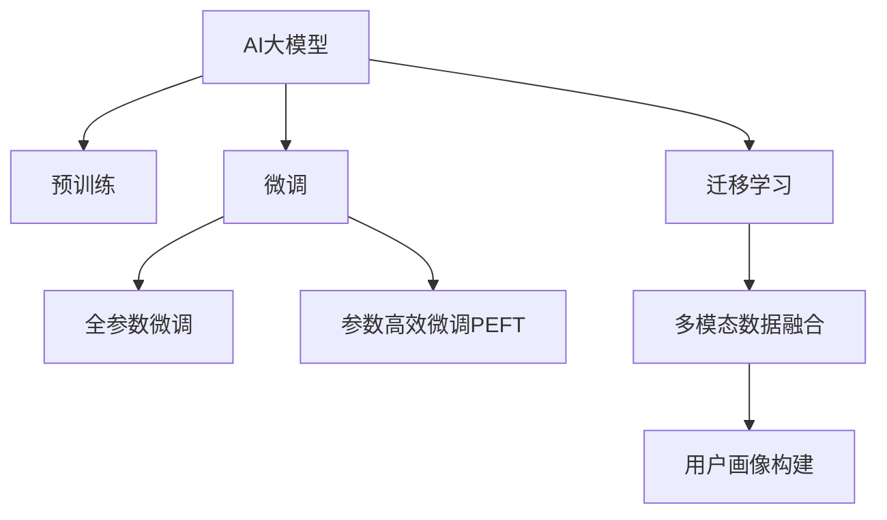

                 

## 1. 背景介绍

### 1.1 问题由来

在当今电商行业，精准的用户画像对于提升转化率、优化广告投放、个性化推荐等有着极其重要的作用。传统的用户画像构建方法依赖于手工设计特征，不仅耗时耗力，且效果受限于特征设计的好坏，难以扩展到复杂的用户行为分析。为了应对这一挑战，AI大模型在用户画像中的应用逐渐兴起，利用其强大的学习能力，直接从原始数据中自动学习用户行为的高级表征，极大地提升了用户画像构建的效率和效果。

### 1.2 问题核心关键点

AI大模型在电商用户画像中的应用，主要体现在以下几个关键点：

- 数据驱动：AI大模型能够直接从电商平台上的交易记录、浏览历史、用户评论等数据中自动学习用户的高级行为特征，无需手工设计特征。
- 高泛化性：大模型预训练于大规模无标签数据上，具备较强的泛化能力，能够适应多种用户行为分析任务。
- 动态更新：电商用户行为是动态变化的，AI大模型能够实时接收新的用户数据，动态更新用户画像，保持最新状态。
- 高扩展性：大模型能够处理多模态数据，结合文本、图片、行为等多种信息构建用户画像，适用于多维度的用户分析。

通过这些关键点，AI大模型在电商用户画像中的应用，能够为电商平台带来显著的业务价值，帮助其更好地理解用户需求，提升用户体验和运营效率。

## 2. 核心概念与联系

### 2.1 核心概念概述

在阐述AI大模型在电商用户画像中的应用之前，需要理解一些核心概念：

- **AI大模型**：指基于Transformer架构，经过大规模无标签数据预训练，具备强大自监督学习能力的大型语言模型，如GPT、BERT等。
- **用户画像**：指通过数据挖掘和统计分析，描述特定用户群体特征的视图，用于指导业务决策和运营策略。
- **预训练**：指在大规模无标签数据上进行的自监督学习过程，预训练模型能够自动学习到通用语言知识，提升模型的泛化能力。
- **微调**：指在预训练模型基础上，通过特定任务的数据进行有监督学习，使模型适配具体任务，提升模型性能。
- **迁移学习**：指将预训练模型知识迁移到新任务上，利用已有知识加速新任务学习过程。

这些概念之间存在紧密联系，共同构成了AI大模型在电商用户画像中的基础理论框架。通过理解和运用这些概念，可以更好地设计和实现基于大模型的电商用户画像系统。

### 2.2 核心概念原理和架构的 Mermaid 流程图



这个流程图展示了AI大模型在电商用户画像中的应用流程：

1. **预训练**：AI大模型在大规模无标签数据上自动学习语言知识。
2. **微调**：在大模型基础上，通过电商用户数据进行有监督学习，适配用户画像构建任务。
3. **全参数微调**：微调模型所有参数，以获取特定任务的最佳性能。
4. **参数高效微调(PEFT)**：仅微调模型顶层或部分参数，减少计算资源消耗。
5. **迁移学习**：将预训练知识迁移到新任务上，加速模型学习。
6. **多模态数据融合**：结合文本、图片、行为等多种信息，构建更全面的用户画像。
7. **用户画像构建**：通过微调模型获取的特征，描述用户行为和特征，构建用户画像视图。

这些步骤相互配合，构成了一个完整的AI大模型在电商用户画像中的应用流程。

## 3. 核心算法原理 & 具体操作步骤

### 3.1 算法原理概述

AI大模型在电商用户画像中的算法原理，主要基于自然语言处理(NLP)技术，利用大模型的预训练知识和特定任务的数据，通过微调或迁移学习，自动学习用户行为的高级特征。其核心思想是：

1. **数据驱动**：自动从电商平台上的交易记录、浏览历史等数据中学习用户特征。
2. **高泛化性**：利用大规模无标签数据的预训练，模型能够适应多种用户行为分析任务。
3. **动态更新**：通过实时接收新数据，动态更新用户画像，保持最新状态。
4. **多模态融合**：结合文本、图片、行为等多种信息，构建多维度的用户画像。

### 3.2 算法步骤详解

以下是AI大模型在电商用户画像中常用的算法步骤：

**Step 1: 数据准备**
- 收集电商平台上的用户行为数据，如交易记录、浏览历史、评价评论等。
- 将数据进行预处理，去除噪声和异常值，进行特征工程，如缺失值填充、归一化等。
- 将文本数据进行分词、向量化处理，准备好大模型的输入数据。

**Step 2: 模型选择与预训练**
- 选择适合电商用户画像的预训练模型，如BERT、GPT等。
- 在大规模无标签数据上对模型进行预训练，如新闻语料库、维基百科等。

**Step 3: 微调用户画像模型**
- 在电商用户数据上对预训练模型进行微调，获取用户行为特征。
- 选择适当的损失函数，如交叉熵、均方误差等，衡量模型输出与真实标签之间的差异。
- 设置优化算法，如Adam、SGD等，并调整超参数，如学习率、批大小等。
- 在验证集上评估模型性能，避免过拟合。

**Step 4: 多模态数据融合**
- 将文本、图片、行为等多种模态的数据进行特征提取和融合，构建多维度的用户画像。
- 使用集成学习方法，如Bagging、Boosting等，将多模态特征进行加权融合。
- 利用AI大模型的泛化能力，将不同模态的数据进行统一表示和处理。

**Step 5: 用户画像应用**
- 通过微调模型获取的用户画像，进行用户行为分析和预测，如购物推荐、广告投放优化等。
- 利用实时更新的用户画像，动态调整运营策略，提升用户体验和运营效率。
- 定期重新训练和更新用户画像模型，保持最新状态。

### 3.3 算法优缺点

AI大模型在电商用户画像中的应用具有以下优点：

- **高效率**：大模型能够自动从数据中学习用户特征，减少了手工设计特征的时间和成本。
- **高泛化性**：预训练模型具备较强的泛化能力，能够适应多种用户行为分析任务。
- **动态更新**：模型能够实时接收新数据，动态更新用户画像，保持最新状态。
- **多模态融合**：结合多种模态的数据，构建更全面的用户画像，提升分析准确性。

同时，也存在一些局限性：

- **数据依赖**：模型性能依赖于电商平台的标注数据质量和数量，获取高质量数据成本较高。
- **模型复杂度**：大模型参数量较大，计算资源消耗较多，需要高性能硬件支持。
- **过拟合风险**：电商用户行为复杂多变，模型可能出现过拟合现象，需要充分验证和调整。
- **隐私问题**：电商用户数据涉及隐私，需确保数据处理和存储的合规性和安全性。

### 3.4 算法应用领域

AI大模型在电商用户画像中的应用，可以广泛应用于以下领域：

- **个性化推荐**：根据用户画像，动态推荐商品和活动，提升用户体验。
- **广告投放优化**：通过用户画像，优化广告投放策略，提升广告点击率和转化率。
- **客户细分**：根据用户画像，对用户进行细分，进行针对性营销和运营。
- **风险控制**：通过用户画像，进行行为分析，识别潜在风险用户，防范欺诈行为。
- **流失预测**：利用用户画像，预测用户流失概率，进行挽留策略。

## 4. 数学模型和公式 & 详细讲解 & 举例说明

### 4.1 数学模型构建

假设电商用户画像构建任务为预测用户是否购买某商品，模型输入为文本描述和用户行为数据，输出为二分类标签。

设输入为文本 $x$，用户行为特征 $y$，模型输出为 $p$，则预测任务可以表示为：

$$
p = M_{\theta}(x, y)
$$

其中 $M_{\theta}$ 为AI大模型，$\theta$ 为模型参数。

模型的损失函数为交叉熵损失函数：

$$
L = -\frac{1}{N}\sum_{i=1}^N [y_i\log p_i + (1-y_i)\log (1-p_i)]
$$

模型的优化目标为最小化损失函数：

$$
\theta^* = \mathop{\arg\min}_{\theta} L
$$

在实践中，通常使用梯度下降等优化算法，更新模型参数 $\theta$，最小化损失函数 $L$。

### 4.2 公式推导过程

以二分类任务为例，推导交叉熵损失函数及其梯度的计算公式。

假设模型 $M_{\theta}$ 在输入 $x$ 上的输出为 $\hat{y}=M_{\theta}(x) \in [0,1]$，表示样本属于正类的概率。真实标签 $y \in \{0,1\}$。则二分类交叉熵损失函数定义为：

$$
\ell(M_{\theta}(x),y) = -[y\log \hat{y} + (1-y)\log (1-\hat{y})]
$$

将其代入经验风险公式，得：

$$
\mathcal{L}(\theta) = -\frac{1}{N}\sum_{i=1}^N [y_i\log M_{\theta}(x_i)+(1-y_i)\log(1-M_{\theta}(x_i))]
$$

根据链式法则，损失函数对参数 $\theta_k$ 的梯度为：

$$
\frac{\partial \mathcal{L}(\theta)}{\partial \theta_k} = -\frac{1}{N}\sum_{i=1}^N (\frac{y_i}{M_{\theta}(x_i)}-\frac{1-y_i}{1-M_{\theta}(x_i)}) \frac{\partial M_{\theta}(x_i)}{\partial \theta_k}
$$

其中 $\frac{\partial M_{\theta}(x_i)}{\partial \theta_k}$ 可进一步递归展开，利用自动微分技术完成计算。

### 4.3 案例分析与讲解

以电商商品推荐为例，假设某电商平台的商品推荐系统需要进行个性化推荐。首先，收集用户历史购买记录、浏览行为、评价评论等数据，作为电商用户数据 $D=\{(x_i,y_i)\}_{i=1}^N$。然后，在预训练模型BERT的基础上，对模型进行微调，学习用户购买商品的高级特征。

具体步骤如下：

1. **数据预处理**：对电商用户数据进行清洗、归一化等预处理，准备输入模型。
2. **模型微调**：使用BERT模型作为初始参数，在电商用户数据上微调模型，获取用户购买商品的高级特征。
3. **特征融合**：将电商用户数据中的文本特征和行为特征进行融合，使用多模态融合方法，如Bagging、Boosting等，构建多维度的用户画像。
4. **推荐模型训练**：在用户画像的基础上，训练推荐模型，预测用户是否购买某商品，并根据预测结果进行推荐。

最终，电商推荐系统可以基于实时更新的用户画像，动态调整推荐策略，提升用户体验和运营效率。

## 5. 项目实践：代码实例和详细解释说明

### 5.1 开发环境搭建

在进行电商用户画像构建的微调实践前，需要准备好开发环境。以下是使用Python进行PyTorch开发的环境配置流程：

1. 安装Anaconda：从官网下载并安装Anaconda，用于创建独立的Python环境。

2. 创建并激活虚拟环境：
```bash
conda create -n pytorch-env python=3.8 
conda activate pytorch-env
```

3. 安装PyTorch：根据CUDA版本，从官网获取对应的安装命令。例如：
```bash
conda install pytorch torchvision torchaudio cudatoolkit=11.1 -c pytorch -c conda-forge
```

4. 安装Transformer库：
```bash
pip install transformers
```

5. 安装各类工具包：
```bash
pip install numpy pandas scikit-learn matplotlib tqdm jupyter notebook ipython
```

完成上述步骤后，即可在`pytorch-env`环境中开始微调实践。

### 5.2 源代码详细实现

下面我们以电商商品推荐为例，给出使用Transformers库对BERT模型进行微调的PyTorch代码实现。

首先，定义电商商品推荐的数据处理函数：

```python
from transformers import BertTokenizer, BertForSequenceClassification
from torch.utils.data import Dataset, DataLoader
import torch
import pandas as pd

class RecommendationDataset(Dataset):
    def __init__(self, df, tokenizer, max_len=128):
        self.df = df
        self.tokenizer = tokenizer
        self.max_len = max_len
        
    def __len__(self):
        return len(self.df)
    
    def __getitem__(self, item):
        text = self.df['description'][item]
        label = self.df['label'][item]
        
        encoding = self.tokenizer(text, return_tensors='pt', max_length=self.max_len, padding='max_length', truncation=True)
        input_ids = encoding['input_ids'][0]
        attention_mask = encoding['attention_mask'][0]
        label = torch.tensor(self.df['label'][item], dtype=torch.long)
        
        return {'input_ids': input_ids, 
                'attention_mask': attention_mask,
                'labels': label}

# 定义数据集
tokenizer = BertTokenizer.from_pretrained('bert-base-cased')
df = pd.read_csv('recommendation_data.csv')

train_dataset = RecommendationDataset(df, tokenizer)
test_dataset = RecommendationDataset(df, tokenizer)

# 定义模型和优化器
model = BertForSequenceClassification.from_pretrained('bert-base-cased', num_labels=2)
optimizer = torch.optim.Adam(model.parameters(), lr=2e-5)
```

然后，定义训练和评估函数：

```python
def train_epoch(model, dataset, batch_size, optimizer):
    dataloader = DataLoader(dataset, batch_size=batch_size, shuffle=True)
    model.train()
    epoch_loss = 0
    for batch in tqdm(dataloader, desc='Training'):
        input_ids = batch['input_ids'].to(device)
        attention_mask = batch['attention_mask'].to(device)
        labels = batch['labels'].to(device)
        model.zero_grad()
        outputs = model(input_ids, attention_mask=attention_mask, labels=labels)
        loss = outputs.loss
        epoch_loss += loss.item()
        loss.backward()
        optimizer.step()
    return epoch_loss / len(dataloader)

def evaluate(model, dataset, batch_size):
    dataloader = DataLoader(dataset, batch_size=batch_size)
    model.eval()
    preds, labels = [], []
    with torch.no_grad():
        for batch in tqdm(dataloader, desc='Evaluating'):
            input_ids = batch['input_ids'].to(device)
            attention_mask = batch['attention_mask'].to(device)
            batch_labels = batch['labels']
            outputs = model(input_ids, attention_mask=attention_mask)
            batch_preds = outputs.logits.argmax(dim=2).to('cpu').tolist()
            batch_labels = batch_labels.to('cpu').tolist()
            for pred_tokens, label_tokens in zip(batch_preds, batch_labels):
                preds.append(pred_tokens)
                labels.append(label_tokens)
                
    print(classification_report(labels, preds))
```

最后，启动训练流程并在测试集上评估：

```python
epochs = 5
batch_size = 16

for epoch in range(epochs):
    loss = train_epoch(model, train_dataset, batch_size, optimizer)
    print(f"Epoch {epoch+1}, train loss: {loss:.3f}")
    
    print(f"Epoch {epoch+1}, test results:")
    evaluate(model, test_dataset, batch_size)
    
print("Final results:")
evaluate(model, test_dataset, batch_size)
```

以上就是使用PyTorch对BERT进行电商商品推荐微调的完整代码实现。可以看到，得益于Transformer库的强大封装，我们可以用相对简洁的代码完成BERT模型的加载和微调。

### 5.3 代码解读与分析

让我们再详细解读一下关键代码的实现细节：

**RecommendationDataset类**：
- `__init__`方法：初始化电商商品数据集、分词器等组件。
- `__len__`方法：返回数据集的样本数量。
- `__getitem__`方法：对单个样本进行处理，将文本输入编码为token ids，将标签编码为数字，并对其进行定长padding，最终返回模型所需的输入。

**模型和优化器**：
- 使用BERT模型作为初始化参数，定义优化器及其超参数。

**训练和评估函数**：
- 使用PyTorch的DataLoader对数据集进行批次化加载，供模型训练和推理使用。
- 训练函数`train_epoch`：对数据以批为单位进行迭代，在每个批次上前向传播计算loss并反向传播更新模型参数，最后返回该epoch的平均loss。
- 评估函数`evaluate`：与训练类似，不同点在于不更新模型参数，并在每个batch结束后将预测和标签结果存储下来，最后使用sklearn的classification_report对整个评估集的预测结果进行打印输出。

**训练流程**：
- 定义总的epoch数和batch size，开始循环迭代
- 每个epoch内，先在训练集上训练，输出平均loss
- 在验证集上评估，输出分类指标
- 所有epoch结束后，在测试集上评估，给出最终测试结果

可以看到，PyTorch配合Transformer库使得BERT微调的代码实现变得简洁高效。开发者可以将更多精力放在数据处理、模型改进等高层逻辑上，而不必过多关注底层的实现细节。

当然，工业级的系统实现还需考虑更多因素，如模型的保存和部署、超参数的自动搜索、更灵活的任务适配层等。但核心的微调范式基本与此类似。

## 6. 实际应用场景

### 6.1 智能客服系统

基于大语言模型微调的电商用户画像技术，可以广泛应用于智能客服系统的构建。传统客服往往需要配备大量人力，高峰期响应缓慢，且一致性和专业性难以保证。而使用微调后的用户画像技术，可以7x24小时不间断服务，快速响应客户咨询，用自然流畅的语言解答各类常见问题。

在技术实现上，可以收集用户历史咨询记录、浏览历史、购买记录等数据，将用户画像作为客服系统的输入，通过微调后的模型进行意图理解和问题解答。对于用户提出的新问题，还可以接入检索系统实时搜索相关内容，动态组织生成回答。如此构建的智能客服系统，能大幅提升客户咨询体验和问题解决效率。

### 6.2 金融舆情监测

金融机构需要实时监测市场舆论动向，以便及时应对负面信息传播，规避金融风险。传统的人工监测方式成本高、效率低，难以应对网络时代海量信息爆发的挑战。基于大语言模型微调的电商用户画像技术，可以应用于金融舆情监测。

具体而言，可以收集金融领域相关的新闻、报道、评论等文本数据，并对其进行主题标注和情感标注。在此基础上对预训练语言模型进行微调，使其能够自动判断文本属于何种主题，情感倾向是正面、中性还是负面。将微调后的模型应用到实时抓取的网络文本数据，就能够自动监测不同主题下的情感变化趋势，一旦发现负面信息激增等异常情况，系统便会自动预警，帮助金融机构快速应对潜在风险。

### 6.3 个性化推荐系统

当前的推荐系统往往只依赖用户的历史行为数据进行物品推荐，无法深入理解用户的真实兴趣偏好。基于大语言模型微调的用户画像技术，可以应用于个性化推荐系统。

在实践中，可以收集用户浏览、点击、评价、分享等行为数据，提取和用户交互的物品标题、描述、标签等文本内容。将文本内容作为模型输入，用户的后续行为（如是否点击、购买等）作为监督信号，在此基础上微调预训练语言模型。微调后的模型能够从文本内容中准确把握用户的兴趣点。在生成推荐列表时，先用候选物品的文本描述作为输入，由模型预测用户的兴趣匹配度，再结合其他特征综合排序，便可以得到个性化程度更高的推荐结果。

### 6.4 未来应用展望

随着大语言模型微调技术的发展，未来将在更多领域得到应用，为传统行业带来变革性影响。

在智慧医疗领域，基于用户画像的医疗问答、病历分析、药物研发等应用将提升医疗服务的智能化水平，辅助医生诊疗，加速新药开发进程。

在智能教育领域，微调技术可应用于作业批改、学情分析、知识推荐等方面，因材施教，促进教育公平，提高教学质量。

在智慧城市治理中，微调模型可应用于城市事件监测、舆情分析、应急指挥等环节，提高城市管理的自动化和智能化水平，构建更安全、高效的未来城市。

此外，在企业生产、社会治理、文娱传媒等众多领域，基于大模型微调的人工智能应用也将不断涌现，为NLP技术带来了全新的突破。相信随着技术的日益成熟，微调方法将成为人工智能落地应用的重要范式，推动人工智能技术在垂直行业的规模化落地。

## 7. 工具和资源推荐

### 7.1 学习资源推荐

为了帮助开发者系统掌握AI大模型微调的理论基础和实践技巧，这里推荐一些优质的学习资源：

1. 《Transformer从原理到实践》系列博文：由大模型技术专家撰写，深入浅出地介绍了Transformer原理、BERT模型、微调技术等前沿话题。

2. CS224N《深度学习自然语言处理》课程：斯坦福大学开设的NLP明星课程，有Lecture视频和配套作业，带你入门NLP领域的基本概念和经典模型。

3. 《Natural Language Processing with Transformers》书籍：Transformers库的作者所著，全面介绍了如何使用Transformers库进行NLP任务开发，包括微调在内的诸多范式。

4. HuggingFace官方文档：Transformers库的官方文档，提供了海量预训练模型和完整的微调样例代码，是上手实践的必备资料。

5. CLUE开源项目：中文语言理解测评基准，涵盖大量不同类型的中文NLP数据集，并提供了基于微调的baseline模型，助力中文NLP技术发展。

通过对这些资源的学习实践，相信你一定能够快速掌握AI大模型微调的精髓，并用于解决实际的NLP问题。

### 7.2 开发工具推荐

高效的开发离不开优秀的工具支持。以下是几款用于AI大模型微调开发的常用工具：

1. PyTorch：基于Python的开源深度学习框架，灵活动态的计算图，适合快速迭代研究。大部分预训练语言模型都有PyTorch版本的实现。

2. TensorFlow：由Google主导开发的开源深度学习框架，生产部署方便，适合大规模工程应用。同样有丰富的预训练语言模型资源。

3. Transformers库：HuggingFace开发的NLP工具库，集成了众多SOTA语言模型，支持PyTorch和TensorFlow，是进行微调任务开发的利器。

4. Weights & Biases：模型训练的实验跟踪工具，可以记录和可视化模型训练过程中的各项指标，方便对比和调优。与主流深度学习框架无缝集成。

5. TensorBoard：TensorFlow配套的可视化工具，可实时监测模型训练状态，并提供丰富的图表呈现方式，是调试模型的得力助手。

6. Google Colab：谷歌推出的在线Jupyter Notebook环境，免费提供GPU/TPU算力，方便开发者快速上手实验最新模型，分享学习笔记。

合理利用这些工具，可以显著提升AI大模型微调任务的开发效率，加快创新迭代的步伐。

### 7.3 相关论文推荐

AI大模型和微调技术的发展源于学界的持续研究。以下是几篇奠基性的相关论文，推荐阅读：

1. Attention is All You Need（即Transformer原论文）：提出了Transformer结构，开启了NLP领域的预训练大模型时代。

2. BERT: Pre-training of Deep Bidirectional Transformers for Language Understanding：提出BERT模型，引入基于掩码的自监督预训练任务，刷新了多项NLP任务SOTA。

3. Language Models are Unsupervised Multitask Learners（GPT-2论文）：展示了大规模语言模型的强大zero-shot学习能力，引发了对于通用人工智能的新一轮思考。

4. Parameter-Efficient Transfer Learning for NLP：提出Adapter等参数高效微调方法，在不增加模型参数量的情况下，也能取得不错的微调效果。

5. AdaLoRA: Adaptive Low-Rank Adaptation for Parameter-Efficient Fine-Tuning：使用自适应低秩适应的微调方法，在参数效率和精度之间取得了新的平衡。

这些论文代表了大语言模型微调技术的发展脉络。通过学习这些前沿成果，可以帮助研究者把握学科前进方向，激发更多的创新灵感。

## 8. 总结：未来发展趋势与挑战

### 8.1 总结

本文对AI大模型在电商用户画像中的应用进行了全面系统的介绍。首先阐述了电商用户画像构建的难点和AI大模型的优势，明确了电商用户画像构建的现状和趋势。其次，从原理到实践，详细讲解了AI大模型在电商用户画像中的算法原理和操作步骤，给出了微调任务开发的完整代码实例。同时，本文还探讨了AI大模型在电商用户画像中的实际应用场景，展示了微调技术在电商领域的巨大潜力。最后，本文精选了微调技术的各类学习资源，力求为读者提供全方位的技术指引。

通过本文的系统梳理，可以看到，AI大模型在电商用户画像中的应用，能够为电商平台带来显著的业务价值，帮助其更好地理解用户需求，提升用户体验和运营效率。未来，随着预训练语言模型和微调方法的持续演进，基于AI大模型的电商用户画像技术必将在电商领域大放异彩，推动电商行业的数字化转型升级。

### 8.2 未来发展趋势

展望未来，AI大模型在电商用户画像中的应用将呈现以下几个发展趋势：

1. **数据驱动**：随着电商平台数据的积累，AI大模型能够更全面、深入地学习用户行为特征，构建更精细化的用户画像。

2. **高泛化性**：预训练模型在大规模无标签数据上学习到的语言知识，能够适应多种用户行为分析任务，提升模型的泛化能力。

3. **实时更新**：电商用户行为是动态变化的，AI大模型能够实时接收新数据，动态更新用户画像，保持最新状态。

4. **多模态融合**：结合文本、图片、行为等多种信息，构建多维度的用户画像，提升分析准确性。

5. **个性化推荐**：基于用户画像，动态推荐商品和活动，提升用户体验和运营效率。

6. **智能客服**：利用用户画像，构建智能客服系统，提升客户咨询体验和问题解决效率。

7. **金融舆情监测**：将用户画像应用于金融舆情监测，实时监测市场舆论动向，规避金融风险。

8. **智慧医疗**：结合用户画像，提供智慧医疗服务，辅助医生诊疗，加速新药开发进程。

9. **智能教育**：通过用户画像，进行个性化推荐和学情分析，因材施教，促进教育公平。

10. **智慧城市**：结合用户画像，优化城市事件监测、舆情分析、应急指挥等环节，提高城市管理的自动化和智能化水平。

以上趋势凸显了AI大模型在电商用户画像中的广阔前景。这些方向的探索发展，必将进一步提升NLP系统的性能和应用范围，为人类认知智能的进化带来深远影响。

### 8.3 面临的挑战

尽管AI大模型在电商用户画像中的应用已经取得了显著成果，但在迈向更加智能化、普适化应用的过程中，仍面临诸多挑战：

1. **数据质量与获取**：高质量标注数据对于电商用户画像的构建至关重要，但获取这些数据成本较高。如何降低数据获取成本，提高数据质量，将是重要的研究方向。

2. **模型复杂度与资源消耗**：大模型参数量较大，计算资源消耗较多，需要高性能硬件支持。如何降低模型复杂度，提高计算效率，减少资源消耗，是未来需要解决的难题。

3. **模型鲁棒性与泛化能力**：电商用户行为复杂多变，模型可能出现过拟合现象。如何提高模型的鲁棒性和泛化能力，避免灾难性遗忘，还需要更多理论和实践的积累。

4. **隐私保护与安全**：电商用户数据涉及隐私，需确保数据处理和存储的合规性和安全性。如何保护用户隐私，确保数据安全，将是未来的重要课题。

5. **模型可解释性与透明度**：AI大模型在电商用户画像中的应用，需要模型具备一定的可解释性，便于用户理解和信任。如何增强模型的可解释性，提升模型的透明度，将是未来的研究方向。

6. **系统整合与协同**：电商用户画像的构建需要与其他系统如推荐系统、客服系统等协同工作，如何整合这些系统，优化系统协同效率，将是重要的研究方向。

这些挑战凸显了AI大模型在电商用户画像中的复杂性和多样性。只有不断突破这些挑战，才能将AI大模型更好地应用于电商领域，推动电商行业的数字化转型升级。

### 8.4 研究展望

面对AI大模型在电商用户画像应用中面临的挑战，未来的研究需要在以下几个方面寻求新的突破：

1. **低成本高效的数据获取与处理**：探索无监督学习、半监督学习等低成本数据获取方法，结合多模态数据融合技术，提高数据处理效率。

2. **高效的模型压缩与优化**：研究参数高效微调、模型裁剪等方法，降低模型复杂度，提高计算效率，优化资源消耗。

3. **稳健的模型训练与优化**：引入自适应学习率、对抗训练等方法，提高模型的鲁棒性和泛化能力，避免过拟合和灾难性遗忘。

4. **可解释的模型与系统**：引入因果推断、博弈论等方法，增强模型的可解释性，提升系统的透明度和可信度。

5. **隐私保护与安全性**：引入差分隐私、联邦学习等技术，确保用户数据的安全性和隐私保护。

6. **系统整合与协同优化**：研究系统协同机制，优化电商平台的推荐系统、客服系统等，提升系统整体的协同效率和用户体验。

这些研究方向将推动AI大模型在电商用户画像中的技术演进，提升系统的性能和应用范围，为电商行业的数字化转型升级提供新的动力。相信随着研究的不断深入和技术的持续进步，AI大模型在电商用户画像中的应用将日益成熟，为电商行业带来更多的价值和创新。

## 9. 附录：常见问题与解答

**Q1: AI大模型微调对电商用户画像构建有什么好处？**

A: AI大模型微调能够自动从电商用户数据中学习高级行为特征，减少手工设计特征的时间和成本。同时，预训练模型具备较强的泛化能力，能够适应多种用户行为分析任务。通过实时更新的用户画像，动态调整推荐策略，提升用户体验和运营效率。

**Q2: 电商用户画像构建中，数据质量如何影响模型性能？**

A: 电商用户画像构建依赖于高质量标注数据，数据质量直接影响模型的泛化能力和预测准确性。标注数据的缺失、噪声和异常值会降低模型的学习效果。因此，数据清洗和预处理是构建高质量用户画像的重要步骤。

**Q3: 电商用户画像构建中，如何选择适合任务的预训练模型？**

A: 电商用户画像构建应选择与任务相关的预训练模型。例如，针对电商商品推荐，可以选择BERT、GPT等预训练模型；针对智能客服系统，可以选择T5等预训练模型。选择合适的预训练模型，能够提高模型的泛化能力和预测准确性。

**Q4: 电商用户画像构建中，如何处理多模态数据融合？**

A: 电商用户画像构建涉及文本、图片、行为等多种模态数据，需要采用多模态数据融合技术。例如，可以使用Bagging、Boosting等集成学习方法，将不同模态的数据进行加权融合。同时，利用AI大模型的泛化能力，将不同模态的数据进行统一表示和处理，提高用户画像的全面性和准确性。

**Q5: 电商用户画像构建中，如何降低模型计算资源的消耗？**

A: 电商用户画像构建需要处理大规模数据，模型计算资源消耗较大。可以采用模型裁剪、混合精度训练等方法，降低模型复杂度，提高计算效率，优化资源消耗。例如，使用LoRA等参数高效微调方法，只微调模型顶层或部分参数，减少计算资源消耗。

这些常见问题及其解答，有助于读者更好地理解AI大模型在电商用户画像中的关键技术和应用实践，为构建高效、准确的电商用户画像提供参考。

---

作者：禅与计算机程序设计艺术 / Zen and the Art of Computer Programming

