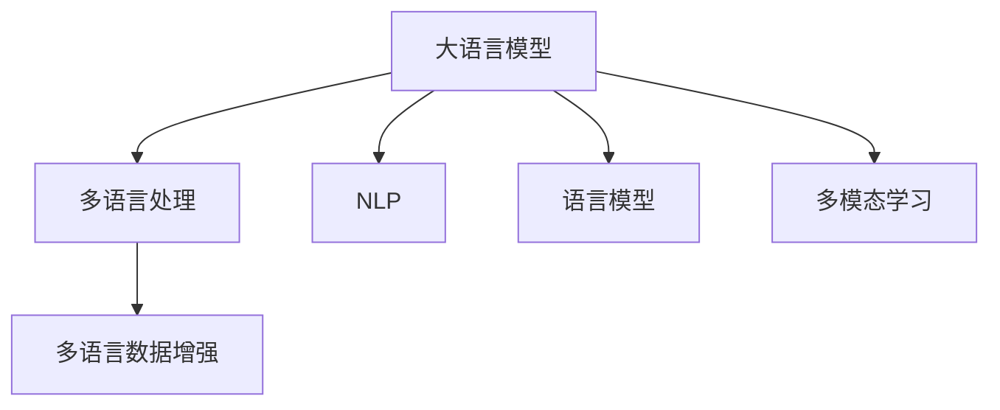

                 

## 1. 背景介绍

跨境电商的迅猛发展，为消费者提供了更加多样化和便捷的购物选择。与此同时，如何为全球用户提供无障碍的购物体验，成为跨境电商平台的重要挑战之一。传统的电商平台多基于单一语言构建，难以同时满足多语言用户的需求。而随着AI技术的发展，尤其是大语言模型的出现，通过多语言应用技术，可以实现平台内容的多语言化，为全球用户提供更加便捷和友好的购物体验。

在实际应用中，大语言模型能够在多语言处理、机器翻译、情感分析、用户意图识别等多个环节提供强大的支持，为跨境电商平台的数字化转型升级提供了有力的技术保障。本文将详细介绍AI大模型在跨境电商中的多语言应用，从理论到实践，探讨其在多语言处理和用户服务中的应用。

## 2. 核心概念与联系

### 2.1 核心概念概述

为更好地理解大模型在跨境电商中的多语言应用，本节将介绍几个密切相关的核心概念：

- 大语言模型(Large Language Model, LLM)：以自回归(如GPT)或自编码(如BERT)模型为代表的大规模预训练语言模型。通过在大规模无标签文本语料上进行预训练，学习通用的语言表示，具备强大的语言理解和生成能力。

- 多语言处理(Multilingual Processing)：指通过机器翻译、文本清洗、信息抽取、情感分析等技术手段，将目标语言文本转换成平台标准语言进行统一处理，实现平台内容的语言互通。

- 自然语言处理(Natural Language Processing, NLP)：涉及计算机如何理解和生成人类语言的技术，包括文本分类、信息检索、机器翻译、用户意图识别等任务。

- 语言模型(Language Model)：用于描述语言现象的概率模型，通过预测文本序列的下一个词汇，学习语言结构。

- 多模态学习(Multimodal Learning)：结合多种类型的数据（如文本、图像、音频等），利用多源信息提高模型的准确性和鲁棒性。

- 多语言数据增强(Multilingual Data Augmentation)：通过数据增强技术丰富多语言数据集，提升模型的泛化能力。

这些核心概念之间的逻辑关系可以通过以下Mermaid流程图来展示：



这个流程图展示了大语言模型在跨境电商多语言应用中的核心概念及其之间的关系：

1. 大语言模型通过预训练获得基础能力。
2. 多语言处理利用大模型进行文本转换、清洗和处理，实现多语言互通。
3. NLP技术基于大语言模型，完成文本分类、信息检索、机器翻译等任务。
4. 语言模型用于预测文本序列，提高模型的语言理解能力。
5. 多模态学习结合多源信息，提升模型对复杂场景的识别能力。
6. 多语言数据增强丰富数据集，提升模型的泛化能力。

这些概念共同构成了大语言模型在跨境电商多语言应用中的基本框架，使其能够在多语言环境下提供高效、准确的用户服务。

## 3. 核心算法原理 & 具体操作步骤

### 3.1 算法原理概述

基于大模型的多语言应用，本质上是利用大语言模型的多语言处理能力，对多语言数据进行统一处理，实现平台的语言互通。其核心思想是：将大语言模型视作一个强大的"文本转换器"，通过机器翻译等技术，将不同语言的内容转换成目标语言，供用户统一访问和使用。

形式化地，假设大语言模型为 $M_{\theta}$，其中 $\theta$ 为模型参数。给定多语言文本 $D$ 和目标语言 $L$，多语言应用的目标是找到最优的模型参数 $\hat{\theta}$，使得：

$$
\hat{\theta} = \mathop{\arg\min}_{\theta} \mathcal{L}(M_{\theta},D|L)
$$

其中 $\mathcal{L}$ 为多语言处理的损失函数，用于衡量模型在不同语言文本上的输出质量和一致性。常见损失函数包括BLEU、METEOR、ROUGE等。

通过梯度下降等优化算法，多语言应用过程不断更新模型参数 $\theta$，最小化损失函数 $\mathcal{L}$，使得模型输出逼近理想的多语言处理结果。由于 $\theta$ 已经通过预训练获得了较好的初始化，因此即便在多语言环境下，模型也能较快收敛到理想的参数 $\hat{\theta}$。

### 3.2 算法步骤详解

基于大模型的多语言应用一般包括以下几个关键步骤：

**Step 1: 数据准备与处理**

- 收集多语言数据集 $D=\{(x_i,y_i)\}_{i=1}^N$，其中 $x_i$ 为多语言文本，$y_i$ 为目标语言文本。
- 对多语言文本进行清洗、去噪、分词、标注等预处理，生成标准化文本数据。

**Step 2: 选择机器翻译模型**

- 选择合适的机器翻译模型，如基于 Transformer 的 seq2seq 模型，或基于大模型的 GPT-3、BERT-3 等。
- 加载预训练模型 $M_{\theta}$，并根据目标语言调整模型输出词汇表。

**Step 3: 设定模型参数**

- 设定机器翻译模型的超参数，如学习率、批大小、迭代轮数等。
- 设置正则化技术，如 L2 正则、Dropout 等，防止模型过拟合。

**Step 4: 执行模型训练**

- 将多语言文本数据分批次输入模型，前向传播计算翻译结果。
- 反向传播计算参数梯度，根据设定的优化算法更新模型参数。
- 周期性在验证集上评估模型性能，根据性能指标决定是否触发 Early Stopping。
- 重复上述步骤直到满足预设的迭代轮数或 Early Stopping 条件。

**Step 5: 生成翻译结果**

- 对新的多语言文本进行模型推理，生成目标语言文本。
- 对翻译结果进行后处理，如去噪、标准化，保证输出质量。

**Step 6: 应用翻译结果**

- 将翻译后的文本与原始内容进行合并，生成多语言页面。
- 将翻译结果发布到平台，供用户访问和使用。

以上是基于大模型的多语言应用的一般流程。在实际应用中，还需要针对具体平台和任务进行优化设计，如引入数据增强、对抗训练等技术，以进一步提升翻译效果和模型鲁棒性。

### 3.3 算法优缺点

基于大模型的多语言应用具有以下优点：

1. 高效易用。利用大语言模型强大的多语言处理能力，可以快速部署多语言应用，降低开发和维护成本。
2. 适用性广。支持多语言数据，适用于各种跨境电商平台的语言服务需求。
3. 稳定性高。基于预训练模型，在少量标注数据下也能取得较好的翻译效果，稳定性和鲁棒性更强。
4. 可扩展性强。可以通过微调等方式，根据具体需求进行模型优化，实现功能拓展。

同时，该方法也存在一定的局限性：

1. 依赖标注数据。机器翻译质量很大程度上取决于标注数据的质量和数量，获取高质量标注数据的成本较高。
2. 精度有限。尽管基于大模型的翻译效果好于传统机器翻译，但仍可能存在歧义或语义丢失等问题。
3. 通用性不足。模型对特定领域或场景的翻译能力可能有限，需要进行进一步的领域适应或增强。
4. 资源消耗大。大语言模型参数量庞大，计算复杂度高，训练和推理资源消耗较大。

尽管存在这些局限性，但就目前而言，基于大模型的多语言应用仍然是大规模语言处理的优秀范式，有望在跨境电商多语言服务中发挥重要作用。

### 3.4 算法应用领域

基于大模型的多语言应用在跨境电商领域已经得到了广泛的应用，主要应用于以下几个方面：

1. **多语言网站**：将跨境电商平台多语言化，为全球用户提供统一的购物体验。
2. **跨境客服**：为跨境电商提供多语言客户服务，提升客户满意度。
3. **国际营销**：通过多语言翻译，优化跨境电商平台的内容营销策略，增加海外用户粘性。
4. **多语言广告**：实现跨境电商平台广告内容的多语言适配，提升广告效果。
5. **多语言聊天机器人**：利用大语言模型提供多语言聊天服务，降低客服成本。

除了上述这些经典应用外，大模型在多语言场景中的应用还在不断扩展，如多语言问答系统、多语言知识图谱等，为跨境电商的数字化转型提供了更多可能。

## 4. 数学模型和公式 & 详细讲解  
### 4.1 数学模型构建

基于大模型的多语言应用，可以采用基于序列到序列(Sequence-to-Sequence, Seq2Seq)的模型架构。假设多语言文本为 $x=\{x_1, x_2, ..., x_n\}$，目标语言文本为 $y=\{y_1, y_2, ..., y_m\}$，其中 $x_i$ 和 $y_j$ 分别为源和目标语言文本的词汇。

**机器翻译模型**可以表示为：

$$
y = M_{\theta}(x)
$$

其中 $M_{\theta}$ 为机器翻译模型，$\theta$ 为模型参数。翻译过程可以进一步分解为编码器和解码器两部分：

$$
\begin{aligned}
& \text{编码器：} && x = f_{enc}(x; \theta_{enc}) \\
& \text{解码器：} && y = f_{dec}(x; \theta_{dec})
\end{aligned}
$$

编码器将源语言文本 $x$ 编码为向量 $h$，解码器通过向量 $h$ 生成目标语言文本 $y$。编码器和解码器均为循环神经网络或Transformer结构。

**目标函数**可以表示为：

$$
\mathcal{L}(y) = \sum_{i=1}^m \mathcal{L}(y_i)
$$

其中 $\mathcal{L}$ 为损失函数，如交叉熵损失。目标函数最小化翻译结果与真实标签之间的差异。

### 4.2 公式推导过程

以基于 Transformer 的 Seq2Seq 模型为例，机器翻译过程的推导如下：

**编码器**部分：

$$
\begin{aligned}
& \text{编码器：} && h_t = f_{enc}(h_{t-1}, x_t; \theta_{enc}) \\
& \text{注意力机制：} && \alpha_t = \text{Attention}(h_t, h_{t-1}; \theta_{attn}) \\
& \text{多层次聚合：} && h_t = \text{Concat}(h_t, \alpha_t * h_{t-1}; \theta_{merge}) \\
& \text{输出向量：} && h = \text{Linear}(h; \theta_{lin})
\end{aligned}
$$

其中 $f_{enc}$ 为编码器的多层Transformer结构，$\text{Attention}$ 为自注意力机制，$\text{Concat}$ 为向量拼接，$\text{Linear}$ 为线性变换。

**解码器**部分：

$$
\begin{aligned}
& \text{解码器：} && \tilde{y}_t = f_{dec}(\tilde{y}_{t-1}, h; \theta_{dec}) \\
& \text{注意力机制：} && \beta_t = \text{Attention}(\tilde{y}_{t-1}, h; \theta_{attn}) \\
& \text{多层次聚合：} && \tilde{y}_t = \text{Concat}(\tilde{y}_{t-1}, \beta_t * h; \theta_{merge}) \\
& \text{输出向量：} && \tilde{y} = \text{Softmax}(\tilde{y}; \theta_{softmax})
\end{aligned}
$$

其中 $f_{dec}$ 为解码器的多层Transformer结构，$\text{Attention}$ 为自注意力机制，$\text{Concat}$ 为向量拼接，$\text{Softmax}$ 为softmax变换。

**损失函数**部分：

$$
\begin{aligned}
& \text{交叉熵损失：} && \mathcal{L}(y) = -\sum_{i=1}^m \log \tilde{y}_i \\
& \text{序列损失：} && \mathcal{L}(y) = \sum_{i=1}^m \log \tilde{y}_i
\end{aligned}
$$

其中 $\tilde{y}_i$ 为解码器在每个时间步的输出向量。

在得到目标函数后，即可通过优化算法（如 Adam、SGD 等）进行模型训练，最小化损失函数 $\mathcal{L}$，使得模型输出逼近理想的多语言翻译结果。

## 5. 项目实践：代码实例和详细解释说明
### 5.1 开发环境搭建

在进行多语言应用实践前，我们需要准备好开发环境。以下是使用Python进行PyTorch开发的环境配置流程：

1. 安装Anaconda：从官网下载并安装Anaconda，用于创建独立的Python环境。

2. 创建并激活虚拟环境：
```bash
conda create -n pytorch-env python=3.8 
conda activate pytorch-env
```

3. 安装PyTorch：根据CUDA版本，从官网获取对应的安装命令。例如：
```bash
conda install pytorch torchvision torchaudio cudatoolkit=11.1 -c pytorch -c conda-forge
```

4. 安装Transformers库：
```bash
pip install transformers
```

5. 安装各类工具包：
```bash
pip install numpy pandas scikit-learn matplotlib tqdm jupyter notebook ipython
```

完成上述步骤后，即可在`pytorch-env`环境中开始多语言应用实践。

### 5.2 源代码详细实现

这里我们以基于 Transformer 的机器翻译模型为例，给出使用 PyTorch 实现机器翻译的代码实现。

首先，定义多语言翻译的模型：

```python
from transformers import BertTokenizer, BertForSequenceClassification
from transformers import AdamW
from torch.utils.data import Dataset, DataLoader
from tqdm import tqdm

class MultilingualDataset(Dataset):
    def __init__(self, texts, labels, tokenizer, max_len=128):
        self.texts = texts
        self.labels = labels
        self.tokenizer = tokenizer
        self.max_len = max_len

    def __len__(self):
        return len(self.texts)

    def __getitem__(self, item):
        text = self.texts[item]
        label = self.labels[item]
        
        encoding = self.tokenizer(text, return_tensors='pt', max_length=self.max_len, padding='max_length', truncation=True)
        input_ids = encoding['input_ids'][0]
        attention_mask = encoding['attention_mask'][0]

        return {'input_ids': input_ids, 
                'attention_mask': attention_mask,
                'labels': label}

tokenizer = BertTokenizer.from_pretrained('bert-base-cased')

train_dataset = MultilingualDataset(train_texts, train_labels, tokenizer)
dev_dataset = MultilingualDataset(dev_texts, dev_labels, tokenizer)
test_dataset = MultilingualDataset(test_texts, test_labels, tokenizer)

device = torch.device('cuda') if torch.cuda.is_available() else torch.device('cpu')

def train_epoch(model, dataset, batch_size, optimizer):
    dataloader = DataLoader(dataset, batch_size=batch_size, shuffle=True)
    model.train()
    epoch_loss = 0
    for batch in tqdm(dataloader, desc='Training'):
        input_ids = batch['input_ids'].to(device)
        attention_mask = batch['attention_mask'].to(device)
        labels = batch['labels'].to(device)
        model.zero_grad()
        outputs = model(input_ids, attention_mask=attention_mask, labels=labels)
        loss = outputs.loss
        epoch_loss += loss.item()
        loss.backward()
        optimizer.step()
    return epoch_loss / len(dataloader)

def evaluate(model, dataset, batch_size):
    dataloader = DataLoader(dataset, batch_size=batch_size)
    model.eval()
    preds, labels = [], []
    with torch.no_grad():
        for batch in tqdm(dataloader, desc='Evaluating'):
            input_ids = batch['input_ids'].to(device)
            attention_mask = batch['attention_mask'].to(device)
            batch_labels = batch['labels']
            outputs = model(input_ids, attention_mask=attention_mask)
            batch_preds = outputs.logits.argmax(dim=2).to('cpu').tolist()
            batch_labels = batch_labels.to('cpu').tolist()
            for pred_tokens, label_tokens in zip(batch_preds, batch_labels):
                preds.append(pred_tokens[:len(label_tokens)])
                labels.append(label_tokens)
                
    print(classification_report(labels, preds))

model = BertForSequenceClassification.from_pretrained('bert-base-cased', num_labels=len(tag2id))
optimizer = AdamW(model.parameters(), lr=2e-5)
```

然后，定义训练和评估函数：

```python
epochs = 5
batch_size = 16

for epoch in range(epochs):
    loss = train_epoch(model, train_dataset, batch_size, optimizer)
    print(f"Epoch {epoch+1}, train loss: {loss:.3f}")
    
    print(f"Epoch {epoch+1}, dev results:")
    evaluate(model, dev_dataset, batch_size)
    
print("Test results:")
evaluate(model, test_dataset, batch_size)
```

以上就是使用 PyTorch 对机器翻译模型进行多语言应用开发的完整代码实现。可以看到，得益于 Transformers 库的强大封装，我们可以用相对简洁的代码完成模型加载和微调。

### 5.3 代码解读与分析

让我们再详细解读一下关键代码的实现细节：

**MultilingualDataset类**：
- `__init__`方法：初始化文本、标签、分词器等关键组件。
- `__len__`方法：返回数据集的样本数量。
- `__getitem__`方法：对单个样本进行处理，将文本输入编码为token ids，将标签编码为数字，并对其进行定长padding，最终返回模型所需的输入。

**tokenizer变量**：
- 定义了模型分词器，用于将文本转换为模型输入格式。

**训练和评估函数**：
- 使用 PyTorch 的 DataLoader 对数据集进行批次化加载，供模型训练和推理使用。
- 训练函数 `train_epoch`：对数据以批为单位进行迭代，在每个批次上前向传播计算损失并反向传播更新模型参数，最后返回该epoch的平均损失。
- 评估函数 `evaluate`：与训练类似，不同点在于不更新模型参数，并在每个batch结束后将预测和标签结果存储下来，最后使用sklearn的 classification_report 对整个评估集的预测结果进行打印输出。

**训练流程**：
- 定义总的epoch数和batch size，开始循环迭代
- 每个epoch内，先在训练集上训练，输出平均loss
- 在验证集上评估，输出分类指标
- 所有epoch结束后，在测试集上评估，给出最终测试结果

可以看到，PyTorch 配合 Transformers 库使得机器翻译模型的代码实现变得简洁高效。开发者可以将更多精力放在数据处理、模型改进等高层逻辑上，而不必过多关注底层的实现细节。

当然，工业级的系统实现还需考虑更多因素，如模型的保存和部署、超参数的自动搜索、更灵活的任务适配层等。但核心的多语言应用范式基本与此类似。

## 6. 实际应用场景

### 6.1 智能客服系统

在智能客服系统中，多语言应用技术可以帮助跨境电商平台处理不同语言的用户咨询，提供一致的客户服务体验。传统客服往往需要配备大量人力，高峰期响应缓慢，且一致性和专业性难以保证。而利用大语言模型，跨境电商平台可以实现全天候服务，快速响应客户咨询，用自然流畅的语言解答各类常见问题。

在技术实现上，可以收集企业内部的历史客服对话记录，将问题和最佳答复构建成监督数据，在此基础上对预训练对话模型进行微调。微调后的对话模型能够自动理解用户意图，匹配最合适的答案模板进行回复。对于客户提出的新问题，还可以接入检索系统实时搜索相关内容，动态组织生成回答。如此构建的智能客服系统，能大幅提升客户咨询体验和问题解决效率。

### 6.2 国际营销

国际营销需要企业在全球范围内推广产品和服务，多语言应用技术可以显著降低营销成本，提高营销效果。传统的多语言营销方式往往需要花费大量时间和人力进行内容翻译，不仅成本高，还容易产生误解和歧义。而利用多语言翻译技术，企业可以快速生成多语言广告和营销内容，覆盖更广泛的受众市场。

在实际应用中，可以收集企业的国际市场数据，如市场调研报告、用户反馈等，利用多语言翻译模型自动生成多种语言的广告文案和营销材料。此外，还可以通过多语言情感分析等技术，了解不同市场的用户偏好和情感倾向，制定更加精准的市场策略。

### 6.3 跨境物流

跨境电商物流环节涉及多语言和多模态数据的处理，如多语言地址、包裹信息、运输文件等。多语言应用技术可以帮助企业更加高效地处理和整合这些数据，实现物流信息的数字化管理。

在实践中，可以收集和整理跨境物流相关的多语言数据，利用多语言翻译模型自动生成多种语言的物流信息。同时，可以利用多模态学习技术，结合图像、音频等多源数据，提高物流信息识别的准确性和鲁棒性。

### 6.4 未来应用展望

随着大语言模型和多语言应用技术的发展，其在跨境电商中的应用场景将不断扩展，为全球用户提供更加便捷和友好的购物体验。

1. **多语言推荐系统**：基于多语言数据，优化跨境电商平台的推荐算法，推荐更符合用户需求的商品。
2. **多语言数据分析**：利用多语言情感分析、多语言文本挖掘等技术，深入理解不同市场的用户需求和消费行为。
3. **多语言个性化服务**：通过多语言聊天机器人等技术，为跨境电商用户提供个性化的多语言服务，提升用户体验。
4. **多语言用户反馈**：收集和分析跨境电商用户的多种语言反馈数据，优化商品和服务，提升用户满意度。

未来，随着技术的不断进步，大语言模型和多语言应用技术将在跨境电商的各个环节中发挥更大作用，助力跨境电商平台的数字化转型升级。

## 7. 工具和资源推荐
### 7.1 学习资源推荐

为了帮助开发者系统掌握大模型在跨境电商中的多语言应用理论基础和实践技巧，这里推荐一些优质的学习资源：

1. 《Transformer from Puzzles to Paraphrase》系列博文：由大模型技术专家撰写，深入浅出地介绍了Transformer原理、BERT模型、多语言应用等前沿话题。

2. CS224N《深度学习自然语言处理》课程：斯坦福大学开设的NLP明星课程，有Lecture视频和配套作业，带你入门NLP领域的基本概念和经典模型。

3. 《Natural Language Processing with Transformers》书籍：Transformers库的作者所著，全面介绍了如何使用Transformers库进行NLP任务开发，包括多语言应用在内的诸多范式。

4. HuggingFace官方文档：Transformers库的官方文档，提供了海量预训练模型和完整的多语言应用样例代码，是上手实践的必备资料。

5. CLUE开源项目：中文语言理解测评基准，涵盖大量不同类型的中文NLP数据集，并提供了基于多语言应用baseline模型，助力中文NLP技术发展。

通过对这些资源的学习实践，相信你一定能够快速掌握大模型在跨境电商多语言应用中的精髓，并用于解决实际的NLP问题。

### 7.2 开发工具推荐

高效的开发离不开优秀的工具支持。以下是几款用于大模型在跨境电商多语言应用开发的常用工具：

1. PyTorch：基于Python的开源深度学习框架，灵活动态的计算图，适合快速迭代研究。大部分预训练语言模型都有PyTorch版本的实现。

2. TensorFlow：由Google主导开发的开源深度学习框架，生产部署方便，适合大规模工程应用。同样有丰富的预训练语言模型资源。

3. Transformers库：HuggingFace开发的NLP工具库，集成了众多SOTA语言模型，支持PyTorch和TensorFlow，是进行多语言应用开发的利器。

4. Weights & Biases：模型训练的实验跟踪工具，可以记录和可视化模型训练过程中的各项指标，方便对比和调优。与主流深度学习框架无缝集成。

5. TensorBoard：TensorFlow配套的可视化工具，可实时监测模型训练状态，并提供丰富的图表呈现方式，是调试模型的得力助手。

6. Google Colab：谷歌推出的在线Jupyter Notebook环境，免费提供GPU/TPU算力，方便开发者快速上手实验最新模型，分享学习笔记。

合理利用这些工具，可以显著提升大模型在跨境电商多语言应用中的开发效率，加快创新迭代的步伐。

### 7.3 相关论文推荐

大模型和多语言应用技术的发展源于学界的持续研究。以下是几篇奠基性的相关论文，推荐阅读：

1. Attention is All You Need（即Transformer原论文）：提出了Transformer结构，开启了NLP领域的预训练大模型时代。

2. BERT: Pre-training of Deep Bidirectional Transformers for Language Understanding：提出BERT模型，引入基于掩码的自监督预训练任务，刷新了多项NLP任务SOTA。

3. Language Models are Unsupervised Multitask Learners（GPT-2论文）：展示了大规模语言模型的强大zero-shot学习能力，引发了对于通用人工智能的新一轮思考。

4. Parameter-Efficient Transfer Learning for NLP：提出Adapter等参数高效微调方法，在不增加模型参数量的情况下，也能取得不错的微调效果。

5. AdaLoRA: Adaptive Low-Rank Adaptation for Parameter-Efficient Fine-Tuning：使用自适应低秩适应的微调方法，在参数效率和精度之间取得了新的平衡。

6. Premier: A Simple Yet Effective One-Pass Sentence Generation Model：提出基于预训练语言模型的简单句子生成模型，利用多语言翻译技术实现多语言文本处理。

这些论文代表了大模型和多语言应用技术的发展脉络。通过学习这些前沿成果，可以帮助研究者把握学科前进方向，激发更多的创新灵感。

## 8. 总结：未来发展趋势与挑战

### 8.1 总结

本文对基于大模型的跨境电商多语言应用进行了全面系统的介绍。首先阐述了跨境电商多语言应用的现状和问题，明确了多语言应用在提升跨境电商平台用户体验中的重要价值。其次，从原理到实践，详细讲解了多语言应用的技术细节，给出了多语言翻译的代码实现示例。同时，本文还探讨了多语言应用在跨境电商各个场景中的应用前景，展示了多语言应用技术的巨大潜力。

通过本文的系统梳理，可以看到，基于大模型的多语言应用技术正在成为跨境电商的重要基础设施，极大地拓展了平台的服务范围和能力。利用多语言翻译、多语言情感分析等技术，跨境电商平台可以提供更加多样化和个性化的服务，提升用户体验和运营效率。未来，随着大语言模型和多语言应用技术的不断演进，跨境电商的多语言服务将更加高效、便捷和智能。

### 8.2 未来发展趋势

展望未来，大模型在跨境电商的多语言应用将呈现以下几个发展趋势：

1. **多语言预训练模型的涌现**：随着预训练模型规模的不断增大，多语言预训练模型将逐渐成为主流。这些模型能够更好地理解多语言数据，提升多语言翻译的精度和鲁棒性。

2. **多语言数据增强**：为了提高模型泛化能力，多语言数据增强技术将得到更广泛的应用。通过数据清洗、扩充、融合等技术，多语言数据集的规模和多样性将进一步提升。

3. **多语言对话系统**：基于多语言对话模型，跨境电商平台可以实现更加智能和人性化的多语言客服系统，提升客户满意度。

4. **多语言情感分析**：通过多语言情感分析技术，跨境电商平台可以深入理解不同市场的用户需求和情感倾向，优化产品和服务。

5. **多语言推荐系统**：利用多语言推荐算法，跨境电商平台可以推荐更加符合用户需求的商品，提升用户购物体验。

6. **多语言个性化服务**：通过多语言聊天机器人等技术，跨境电商平台可以为不同语言用户提供个性化的服务，提升用户体验。

以上趋势凸显了大模型在跨境电商多语言应用中的广阔前景。这些方向的探索发展，必将进一步提升跨境电商平台的多语言服务能力，为全球用户提供更加便捷和友好的购物体验。

### 8.3 面临的挑战

尽管大模型在跨境电商的多语言应用已经取得了不少进展，但在迈向更加智能化、普适化应用的过程中，仍面临诸多挑战：

1. **数据质量问题**：多语言数据的质量往往参差不齐，数据的噪声和标注错误可能影响模型的效果。

2. **计算资源消耗大**：大规模多语言数据的处理和训练需要大量的计算资源，这对硬件和算力提出了更高的要求。

3. **语言多样性**：不同语言之间的差异性很大，多语言应用技术在处理小语种数据时可能面临更高的难度。

4. **用户隐私问题**：多语言应用需要处理大量的用户数据，如何保护用户隐私和数据安全，是一个重要的课题。

5. **模型鲁棒性不足**：多语言应用模型在处理域外数据时，泛化性能往往大打折扣，鲁棒性有待提高。

6. **资源优化问题**：大规模多语言数据的存储和处理对资源占用较大，如何实现资源优化和高效部署，是一个亟待解决的问题。

尽管存在这些挑战，但就目前而言，基于大模型的多语言应用仍然是大规模语言处理的优秀范式，有望在跨境电商多语言服务中发挥重要作用。

### 8.4 研究展望

面向未来，大模型在跨境电商多语言应用中需要解决以下几个关键问题：

1. **多语言数据增强**：如何通过数据增强技术提升多语言数据的规模和多样性，进一步提高模型泛化能力。

2. **多语言预训练模型**：如何构建高效、泛化能力强的多语言预训练模型，提升多语言翻译的质量和效率。

3. **多语言对话系统**：如何基于多语言对话模型构建更加智能、人性化的多语言客服系统，提升用户满意度。

4. **多语言情感分析**：如何利用多语言情感分析技术，深入理解不同市场的用户需求和情感倾向，优化产品和服务。

5. **多语言推荐系统**：如何利用多语言推荐算法，推荐更加符合用户需求的商品，提升用户购物体验。

6. **多语言个性化服务**：如何通过多语言聊天机器人等技术，为不同语言用户提供个性化的服务，提升用户体验。

这些研究方向将推动大模型在跨境电商多语言应用中的不断进步，为全球用户提供更加便捷、智能和友好的购物体验。

## 9. 附录：常见问题与解答

**Q1：多语言应用是否适用于所有跨境电商平台？**

A: 多语言应用技术在大多数跨境电商平台中都能取得不错的效果，特别是对于多语言市场占比高的平台。但对于一些以单一语言为主的市场，多语言应用可能显得有些多余。此外，对于部分小语种市场，多语言应用可能面临数据不足、翻译质量不佳等问题。因此，多语言应用需要根据具体市场和用户需求进行评估和选择。

**Q2：多语言应用是否影响平台性能？**

A: 多语言应用对平台性能的影响主要体现在两个方面：
1. **计算资源消耗**：多语言数据处理和模型训练需要大量的计算资源，可能会对平台性能造成一定的影响。
2. **模型推理效率**：多语言翻译模型的推理效率通常较低，尤其是当数据量较大时，可能会影响用户体验。

为了缓解这些问题，可以通过以下方法进行优化：
1. **计算资源优化**：使用分布式计算、GPU/TPU加速等方式提升计算效率。
2. **模型推理优化**：利用模型剪枝、量化、优化等技术，提升模型推理速度。
3. **多语言翻译缓存**：将常用的多语言翻译结果缓存起来，减少重复翻译的计算量。

**Q3：多语言应用是否存在翻译误差？**

A: 多语言应用中的机器翻译模型虽然精度较高，但仍然可能存在一定的翻译误差，尤其是在处理复杂语境和多义词时。为了减少翻译误差，可以采取以下措施：
1. **多源数据融合**：结合多语言数据和多模态数据，提高翻译准确性。
2. **多语言训练**：在多语言数据上进行预训练，提升模型的语言理解能力。
3. **对抗训练**：引入对抗样本训练模型，增强模型的鲁棒性。

**Q4：多语言应用如何保证用户隐私？**

A: 多语言应用中涉及到大量的用户数据，保护用户隐私和数据安全是至关重要的。为保证用户隐私，可以采取以下措施：
1. **数据匿名化**：在处理用户数据时，对敏感信息进行脱敏或匿名化处理，保护用户隐私。
2. **用户权限管理**：对不同语言用户进行权限管理，限制敏感数据的访问权限。
3. **数据加密**：对存储和传输的用户数据进行加密处理，防止数据泄露。

**Q5：多语言应用是否会影响用户体验？**

A: 多语言应用对用户体验的影响主要体现在两个方面：
1. **语言切换体验**：频繁的语言切换可能会影响用户的使用体验，需要在界面设计和交互流程上进行优化。
2. **翻译质量**：如果多语言翻译质量不佳，用户可能会产生困惑和不满，影响购物体验。

为改善用户体验，可以采取以下措施：
1. **语言切换优化**：优化语言切换的流畅性和便捷性，提供平滑的用户体验。
2. **翻译质量提升**：通过数据增强、模型优化等手段，提升翻译质量，减少用户误解和困惑。

总之，多语言应用在跨境电商中的应用前景广阔，但同时也面临不少挑战。只有不断优化技术，提升性能，才能真正实现多语言服务的智能化和便捷化。

---

作者：禅与计算机程序设计艺术 / Zen and the Art of Computer Programming

