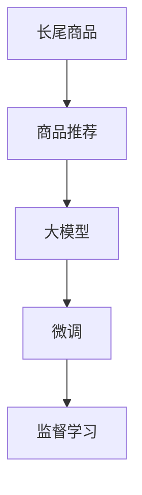

                 

# AI大模型在长尾商品推荐中的应用

> 关键词：长尾商品, 商品推荐, 大模型, 用户行为, 推荐系统, 冷启动问题, 鲁棒性

## 1. 背景介绍

### 1.1 问题由来

在电子商务领域，随着互联网的普及和用户消费习惯的变迁，传统的热门商品推荐已无法满足日益增长的个性化需求。长尾商品因其种类繁多、销量稀少，常常被主流推荐算法所忽视。长尾商品的独特性质（如独特性、高价值性等）使其在满足用户个性化需求、提升用户满意度等方面具有巨大潜力，但也给推荐系统带来了新的挑战。

### 1.2 问题核心关键点

长尾商品推荐的核心问题在于如何在海量商品中高效识别并推荐给用户可能感兴趣的、非热门的商品。大模型通过海量数据进行预训练，具备强大的表示能力和泛化能力，在推荐系统中的应用逐渐成为研究热点。本文将从核心概念、算法原理和具体实践等方面，全面探讨大模型在长尾商品推荐中的应用。

### 1.3 问题研究意义

长尾商品推荐系统不仅能帮助用户发现更多有趣且价值高的商品，还能显著提升电商平台的销售额和用户留存率。通过大模型微调，可以快速构建一个能高效识别和推荐长尾商品的推荐系统，从而降低营销成本，提高用户体验。

## 2. 核心概念与联系

### 2.1 核心概念概述

为更好地理解大模型在长尾商品推荐中的应用，本节将介绍几个关键概念：

- 长尾商品(Long Tail Items)：销量较低但种类繁多、个性化需求高的商品。长尾商品通常占总商品的20%，但销售额却占总销售额的80%。
- 商品推荐(Product Recommendation)：根据用户的历史行为和偏好，预测其可能感兴趣的商品，从而提高用户满意度和购买率。
- 大模型(Large Model)：如BERT、GPT等基于Transformer结构的预训练语言模型。大模型通过海量的无监督学习，获得了丰富的语言表示能力，能处理各种复杂的语言和结构化数据。
- 微调(Fine-Tuning)：在预训练模型的基础上，通过少量标注数据对模型进行有监督的微调，使其能够适配特定任务。

这些概念之间的联系可通过以下Mermaid流程图来展示：



此图展示了长尾商品推荐系统的主要流程：

1. 通过大模型进行预训练，学习商品的多样化语言表示。
2. 在微调过程中，针对特定用户的个性化需求，进行有监督的优化，生成推荐结果。
3. 使用监督学习优化模型的输出，提高推荐效果。

## 3. 核心算法原理 & 具体操作步骤
### 3.1 算法原理概述

大模型在长尾商品推荐中的应用，主要基于以下算法原理：

- **预训练阶段**：使用大模型对商品名称、描述、价格等文本信息进行预训练，学习到丰富的语义表示。
- **微调阶段**：针对特定用户的个性化需求，使用少量标注数据进行微调，生成个性化推荐结果。
- **后处理**：通过一系列后处理技术，如排序、去重等，提高推荐结果的质量。

### 3.2 算法步骤详解

基于大模型的长尾商品推荐系统，主要包括以下几个关键步骤：

**Step 1: 数据准备**

1. 数据收集：收集商品的基本信息和用户的历史行为数据。
2. 数据预处理：对数据进行清洗、格式化、分词等处理，生成模型所需的输入格式。

**Step 2: 模型训练**

1. 选择预训练模型：如BERT、GPT等。
2. 微调模型：在少量标注数据上微调模型，学习商品的个性化表示。
3. 后处理：对模型输出进行排序、去重等后处理，生成推荐结果。

**Step 3: 评估与优化**

1. 评估模型：使用离线评估和在线测试，评估模型的推荐效果。
2. 优化模型：根据评估结果，调整微调策略，优化模型性能。

### 3.3 算法优缺点

基于大模型的长尾商品推荐系统有以下优点：

1. 高效处理长尾商品：大模型能够处理海量长尾商品的语义信息，提升推荐精度。
2. 个性化推荐：通过微调，生成个性化推荐结果，满足用户多样化需求。
3. 快速构建推荐系统：使用预训练和微调结合的方式，快速部署推荐系统。

同时，该方法也存在一些缺点：

1. 对标注数据依赖：长尾商品的标注数据通常较少，可能导致模型过拟合。
2. 计算资源消耗大：大模型需要较大的计算资源，可能存在资源消耗问题。
3. 鲁棒性不足：模型对标注数据分布的变化敏感，可能性能波动较大。

### 3.4 算法应用领域

长尾商品推荐系统在电子商务、个性化推荐、智能客服等领域具有广泛应用：

- 电子商务：电商平台上，长尾商品推荐系统帮助用户发现更多感兴趣的商品，提升购物体验。
- 个性化推荐：如音乐、视频、图书等个性化推荐平台，通过长尾商品推荐提高推荐多样性和个性化程度。
- 智能客服：智能客服系统使用长尾商品推荐技术，对用户查询进行语义理解，推荐相关商品，提高客服效率。

## 4. 数学模型和公式 & 详细讲解 & 举例说明

### 4.1 数学模型构建

假设用户对商品 $i$ 的评分表示为 $y_i$，模型的预测评分为 $\hat{y}_i$，则损失函数可以表示为：

$$
\mathcal{L}(y,\hat{y}) = \frac{1}{N}\sum_{i=1}^N (y_i - \hat{y}_i)^2
$$

其中 $N$ 为样本数量。模型的预测评分 $\hat{y}_i$ 可以通过线性回归模型表示：

$$
\hat{y}_i = \theta_0 + \sum_{j=1}^d \theta_j x_{ij}
$$

其中 $x_{ij}$ 为商品 $i$ 的特征向量，$\theta$ 为模型参数。

### 4.2 公式推导过程

根据上述线性回归模型，推导损失函数的梯度：

$$
\frac{\partial \mathcal{L}}{\partial \theta} = \frac{2}{N}\sum_{i=1}^N (y_i - \hat{y}_i) \frac{\partial \hat{y}_i}{\partial \theta} = \frac{2}{N}\sum_{i=1}^N (y_i - \hat{y}_i) x_{ij}
$$

在微调过程中，使用随机梯度下降等优化算法，迭代更新模型参数 $\theta$，最小化损失函数 $\mathcal{L}$：

$$
\theta \leftarrow \theta - \eta \nabla_{\theta}\mathcal{L}(\theta)
$$

其中 $\eta$ 为学习率。

### 4.3 案例分析与讲解

以推荐系统中的协同过滤算法为例，分析大模型的应用。

协同过滤算法分为基于用户的协同过滤和基于物品的协同过滤。基于用户的协同过滤使用用户-商品评分矩阵进行推荐，而基于物品的协同过滤使用物品特征向量进行推荐。大模型可以通过预训练学习到商品的语义表示，然后在微调过程中学习到商品与用户的关联关系，生成推荐结果。

## 5. 项目实践：代码实例和详细解释说明
### 5.1 开发环境搭建

在开始长尾商品推荐系统的构建之前，需要搭建好开发环境。以下是使用Python进行PyTorch开发的环境配置流程：

1. 安装Anaconda：从官网下载并安装Anaconda，用于创建独立的Python环境。
2. 创建并激活虚拟环境：
```bash
conda create -n pytorch-env python=3.8 
conda activate pytorch-env
```
3. 安装PyTorch：根据CUDA版本，从官网获取对应的安装命令。例如：
```bash
conda install pytorch torchvision torchaudio cudatoolkit=11.1 -c pytorch -c conda-forge
```
4. 安装Transformers库：
```bash
pip install transformers
```
5. 安装各类工具包：
```bash
pip install numpy pandas scikit-learn matplotlib tqdm jupyter notebook ipython
```

完成上述步骤后，即可在`pytorch-env`环境中开始微调实践。

### 5.2 源代码详细实现

下面我们以长尾商品推荐任务为例，给出使用Transformers库对BERT模型进行微调的PyTorch代码实现。

首先，定义长尾商品推荐任务的数据处理函数：

```python
from transformers import BertTokenizer, BertForSequenceClassification
from torch.utils.data import Dataset
import torch

class LongTailRecommendationDataset(Dataset):
    def __init__(self, texts, labels, tokenizer, max_len=128):
        self.texts = texts
        self.labels = labels
        self.tokenizer = tokenizer
        self.max_len = max_len
        
    def __len__(self):
        return len(self.texts)
    
    def __getitem__(self, item):
        text = self.texts[item]
        label = self.labels[item]
        
        encoding = self.tokenizer(text, return_tensors='pt', max_length=self.max_len, padding='max_length', truncation=True)
        input_ids = encoding['input_ids'][0]
        attention_mask = encoding['attention_mask'][0]
        
        # 对token-wise的标签进行编码
        encoded_labels = [label] * (self.max_len - len(encoded_labels))
        labels = torch.tensor(encoded_labels, dtype=torch.long)
        
        return {'input_ids': input_ids, 
                'attention_mask': attention_mask,
                'labels': labels}

# 标签与id的映射
label2id = {'1': 1, '0': 0}
id2label = {v: k for k, v in label2id.items()}

# 创建dataset
tokenizer = BertTokenizer.from_pretrained('bert-base-cased')

train_dataset = LongTailRecommendationDataset(train_texts, train_labels, tokenizer)
dev_dataset = LongTailRecommendationDataset(dev_texts, dev_labels, tokenizer)
test_dataset = LongTailRecommendationDataset(test_texts, test_labels, tokenizer)
```

然后，定义模型和优化器：

```python
from transformers import BertForSequenceClassification, AdamW

model = BertForSequenceClassification.from_pretrained('bert-base-cased', num_labels=2)

optimizer = AdamW(model.parameters(), lr=2e-5)
```

接着，定义训练和评估函数：

```python
from torch.utils.data import DataLoader
from tqdm import tqdm
from sklearn.metrics import classification_report

device = torch.device('cuda') if torch.cuda.is_available() else torch.device('cpu')
model.to(device)

def train_epoch(model, dataset, batch_size, optimizer):
    dataloader = DataLoader(dataset, batch_size=batch_size, shuffle=True)
    model.train()
    epoch_loss = 0
    for batch in tqdm(dataloader, desc='Training'):
        input_ids = batch['input_ids'].to(device)
        attention_mask = batch['attention_mask'].to(device)
        labels = batch['labels'].to(device)
        model.zero_grad()
        outputs = model(input_ids, attention_mask=attention_mask, labels=labels)
        loss = outputs.loss
        epoch_loss += loss.item()
        loss.backward()
        optimizer.step()
    return epoch_loss / len(dataloader)

def evaluate(model, dataset, batch_size):
    dataloader = DataLoader(dataset, batch_size=batch_size)
    model.eval()
    preds, labels = [], []
    with torch.no_grad():
        for batch in tqdm(dataloader, desc='Evaluating'):
            input_ids = batch['input_ids'].to(device)
            attention_mask = batch['attention_mask'].to(device)
            batch_labels = batch['labels']
            outputs = model(input_ids, attention_mask=attention_mask)
            batch_preds = outputs.logits.argmax(dim=2).to('cpu').tolist()
            batch_labels = batch_labels.to('cpu').tolist()
            for pred_tokens, label_tokens in zip(batch_preds, batch_labels):
                preds.append(pred_tokens[:len(label_tokens)])
                labels.append(label_tokens)
                
    print(classification_report(labels, preds))
```

最后，启动训练流程并在测试集上评估：

```python
epochs = 5
batch_size = 16

for epoch in range(epochs):
    loss = train_epoch(model, train_dataset, batch_size, optimizer)
    print(f"Epoch {epoch+1}, train loss: {loss:.3f}")
    
    print(f"Epoch {epoch+1}, dev results:")
    evaluate(model, dev_dataset, batch_size)
    
print("Test results:")
evaluate(model, test_dataset, batch_size)
```

以上就是使用PyTorch对BERT进行长尾商品推荐任务微调的完整代码实现。可以看到，得益于Transformers库的强大封装，我们可以用相对简洁的代码完成BERT模型的加载和微调。

### 5.3 代码解读与分析

让我们再详细解读一下关键代码的实现细节：

**LongTailRecommendationDataset类**：
- `__init__`方法：初始化文本、标签、分词器等关键组件。
- `__len__`方法：返回数据集的样本数量。
- `__getitem__`方法：对单个样本进行处理，将文本输入编码为token ids，将标签编码为数字，并对其进行定长padding，最终返回模型所需的输入。

**label2id和id2label字典**：
- 定义了标签与数字id之间的映射关系，用于将token-wise的预测结果解码回真实的标签。

**训练和评估函数**：
- 使用PyTorch的DataLoader对数据集进行批次化加载，供模型训练和推理使用。
- 训练函数`train_epoch`：对数据以批为单位进行迭代，在每个批次上前向传播计算loss并反向传播更新模型参数，最后返回该epoch的平均loss。
- 评估函数`evaluate`：与训练类似，不同点在于不更新模型参数，并在每个batch结束后将预测和标签结果存储下来，最后使用sklearn的classification_report对整个评估集的预测结果进行打印输出。

**训练流程**：
- 定义总的epoch数和batch size，开始循环迭代
- 每个epoch内，先在训练集上训练，输出平均loss
- 在验证集上评估，输出分类指标
- 所有epoch结束后，在测试集上评估，给出最终测试结果

可以看到，PyTorch配合Transformers库使得BERT微调的代码实现变得简洁高效。开发者可以将更多精力放在数据处理、模型改进等高层逻辑上，而不必过多关注底层的实现细节。

当然，工业级的系统实现还需考虑更多因素，如模型的保存和部署、超参数的自动搜索、更灵活的任务适配层等。但核心的微调范式基本与此类似。

## 6. 实际应用场景
### 6.1 电子商务平台

在电子商务平台上，长尾商品推荐系统可以通过对用户行为数据的分析，发现并推荐用户可能感兴趣的长尾商品。这不仅能够丰富用户的购物体验，还能显著提升平台的销售业绩和用户满意度。

具体而言，可以通过收集用户的浏览记录、点击行为、购买历史等数据，构建用户兴趣图谱，然后在长尾商品数据上训练和微调推荐模型。微调后的模型能够根据用户的历史行为，推荐符合其兴趣的长尾商品，从而提高商品的曝光率和转化率。

### 6.2 个性化音乐推荐

音乐平台面临的是典型的长尾商品推荐问题。用户对音乐的需求极为多样化，而热门音乐的比例很小，大量音乐只能通过长尾推荐获取。

通过大模型微调，音乐平台能够构建一个高效的推荐系统，不仅推荐热门歌曲，还能推荐用户可能喜欢的长尾音乐。用户可以通过对推荐结果的反馈，进一步优化模型，实现个性化推荐，提升用户粘性。

### 6.3 旅游目的地推荐

旅游平台通常提供大量不同类型和价位的旅游产品，而热门产品往往是少数。通过长尾商品推荐系统，旅游平台可以推荐用户可能感兴趣的长尾旅游产品，包括冷门景点、特色民宿、定制旅游等。

平台可以根据用户的历史查询和浏览记录，使用大模型微调推荐模型，生成个性化旅游推荐结果。用户可以在海量的长尾产品中找到自己感兴趣的内容，提升旅游体验。

### 6.4 未来应用展望

随着大模型和微调技术的不断进步，长尾商品推荐系统将在更多领域得到应用，为传统行业带来变革性影响。

在教育领域，推荐系统可以推荐学生可能感兴趣的课程、书籍等长尾资源，提升学习效果。

在文化娱乐领域，推荐系统可以推荐用户可能喜欢的电影、电视剧、书籍等长尾内容，丰富娱乐体验。

在健康医疗领域，推荐系统可以推荐用户可能感兴趣的健康信息、医疗产品等长尾资源，提升健康管理水平。

总之，长尾商品推荐系统将成为推动各行各业数字化转型和智能升级的重要工具，带来更多的机会和挑战。

## 7. 工具和资源推荐
### 7.1 学习资源推荐

为了帮助开发者系统掌握长尾商品推荐的技术基础和实践技巧，这里推荐一些优质的学习资源：

1. 《深度学习与推荐系统》系列书籍：介绍了深度学习在推荐系统中的应用，包括协同过滤、序列模型等经典算法。
2. 《深度学习与自然语言处理》课程：由吴恩达等教授讲授，涵盖深度学习在NLP任务中的应用，包括文本表示、情感分析等。
3. 《推荐系统》书籍：介绍了推荐系统的理论基础和实际应用，包括协同过滤、基于内容推荐、混合推荐等。
4. 推荐系统论文选集：提供了大量推荐系统的经典论文，涵盖了从推荐算法到应用实践的各个方面。
5. GitHub上的开源推荐系统项目：提供了大量实际应用场景下的推荐系统代码，可供学习参考。

通过对这些资源的学习实践，相信你一定能够快速掌握长尾商品推荐的核心技术，并用于解决实际的推荐问题。

### 7.2 开发工具推荐

高效的开发离不开优秀的工具支持。以下是几款用于长尾商品推荐开发的常用工具：

1. PyTorch：基于Python的开源深度学习框架，灵活动态的计算图，适合快速迭代研究。大部分推荐算法都有PyTorch版本的实现。
2. TensorFlow：由Google主导开发的开源深度学习框架，生产部署方便，适合大规模工程应用。推荐算法也有丰富的TensorFlow实现。
3. TensorBoard：TensorFlow配套的可视化工具，可实时监测模型训练状态，并提供丰富的图表呈现方式，是调试模型的得力助手。
4. Weights & Biases：模型训练的实验跟踪工具，可以记录和可视化模型训练过程中的各项指标，方便对比和调优。与主流深度学习框架无缝集成。
5. Jupyter Notebook：支持Python代码的交互式编程环境，便于开发和调试推荐系统。

合理利用这些工具，可以显著提升长尾商品推荐任务的开发效率，加快创新迭代的步伐。

### 7.3 相关论文推荐

长尾商品推荐系统的发展依赖于相关理论和技术的研究。以下是几篇奠基性的相关论文，推荐阅读：

1. "Towards Optimal Black-Box Recommendation by Learning to Rank"：提出基于学习的推荐系统方法，将推荐过程转化为排名问题，提升了推荐效果。
2. "Collaborative Filtering with Matrix Factorization"：提出基于矩阵分解的协同过滤算法，为推荐系统提供了经典的数据处理方法。
3. "A Survey of Machine Learning Techniques for Recommender Systems"：综述了推荐系统的机器学习技术，包括协同过滤、内容推荐、混合推荐等。
4. "Deep Neural Networks for Content Recommendation"：提出基于深度学习的推荐系统方法，通过自编码器、卷积神经网络等技术，提升推荐性能。
5. "Domain-Aware Recommender Systems"：提出考虑用户领域特性的推荐系统方法，提高了推荐系统的个性化和多样性。

这些论文代表了长尾商品推荐系统的研究脉络。通过学习这些前沿成果，可以帮助研究者把握学科前进方向，激发更多的创新灵感。

## 8. 总结：未来发展趋势与挑战
### 8.1 总结

本文对基于大模型的长尾商品推荐方法进行了全面系统的介绍。首先阐述了长尾商品推荐系统的背景和意义，明确了长尾商品推荐在电商、音乐、旅游等领域的重要价值。其次，从核心概念、算法原理和具体实践等方面，详细讲解了长尾商品推荐系统的构建流程和关键技术。最后，对未来发展趋势和面临的挑战进行了讨论，展望了长尾商品推荐技术的广阔前景。

通过本文的系统梳理，可以看到，大模型在长尾商品推荐系统中的应用，能够高效识别和推荐用户可能感兴趣的长尾商品，提升用户满意度，促进电商、音乐、旅游等领域的数字化转型。未来，伴随深度学习和大模型技术的持续演进，长尾商品推荐系统还将不断优化，带来更多的应用场景和创新突破。

### 8.2 未来发展趋势

展望未来，长尾商品推荐技术将呈现以下几个发展趋势：

1. 模型融合与优化：未来的推荐系统将融合多种推荐算法和优化方法，如协同过滤、深度学习、知识图谱等，提升推荐效果和系统鲁棒性。
2. 多模态推荐：除了文本信息，推荐系统还将融合图片、视频、音频等多模态数据，丰富推荐内容，提高推荐效果。
3. 个性化推荐：通过结合用户行为数据、兴趣图谱、社交网络等，实现更加个性化的推荐，满足用户多样化需求。
4. 实时推荐：通过实时数据流处理技术，实现实时推荐，提升用户体验。
5. 安全与隐私：随着数据量增大，推荐系统面临隐私保护和安全问题。未来的推荐系统将更加注重数据安全性和用户隐私保护。

以上趋势凸显了长尾商品推荐技术的广阔前景。这些方向的探索发展，必将进一步提升推荐系统的性能和用户体验，推动各行各业的智能化转型。

### 8.3 面临的挑战

尽管长尾商品推荐系统已经取得了瞩目成就，但在迈向更加智能化、普适化应用的过程中，它仍面临着诸多挑战：

1. 数据质量和数量：长尾商品的标注数据通常较少，导致模型训练效果不佳。如何获取高质量标注数据，是推荐系统面临的重要问题。
2. 推荐算法复杂性：长尾商品推荐系统涉及多种推荐算法和优化方法，算法复杂度高，难以调优。如何简化算法，提高推荐效果，是一个重要课题。
3. 模型鲁棒性：推荐系统对标注数据分布的变化敏感，可能性能波动较大。如何提高推荐系统的鲁棒性，是一个重要研究方向。
4. 用户隐私保护：推荐系统涉及大量用户数据，如何保护用户隐私，防止数据泄露，是一个重要课题。
5. 推荐效果与效率的平衡：推荐系统需要在推荐效果和计算效率之间进行平衡，如何提高系统效率，同时保持推荐效果，是一个重要研究方向。

### 8.4 研究展望

面对长尾商品推荐系统所面临的挑战，未来的研究需要在以下几个方面寻求新的突破：

1. 数据采集与预处理：通过数据采集和预处理技术，提升长尾商品的标注数据质量，提高推荐系统性能。
2. 算法优化与融合：融合多种推荐算法和优化方法，提升推荐效果和系统鲁棒性。
3. 模型压缩与加速：通过模型压缩和加速技术，提高推荐系统的计算效率，提升用户体验。
4. 安全与隐私保护：引入隐私保护技术，保护用户数据安全，增强推荐系统可信度。
5. 融合外部知识：将符号化的先验知识，如知识图谱、逻辑规则等，与神经网络模型进行巧妙融合，引导推荐过程学习更准确、合理的语言模型。

这些研究方向的探索，必将引领长尾商品推荐技术迈向更高的台阶，为构建更加智能、高效、安全的推荐系统铺平道路。面向未来，长尾商品推荐技术还需要与其他人工智能技术进行更深入的融合，如知识表示、因果推理、强化学习等，多路径协同发力，共同推动推荐系统的进步。只有勇于创新、敢于突破，才能不断拓展长尾商品推荐系统的边界，让推荐技术更好地造福各行各业。

## 9. 附录：常见问题与解答

**Q1：长尾商品推荐系统如何处理冷启动问题？**

A: 冷启动问题是推荐系统面临的常见问题，特别是在新用户的场景下。针对冷启动问题，可以采用以下几种方法：

1. 用户画像：通过用户注册信息、社交网络等数据，构建用户画像，进行个性化推荐。
2. 相似用户推荐：在用户画像的基础上，找到与新用户相似的其他用户，使用其历史行为进行推荐。
3. 新用户引导：通过推荐热门商品、新商品等方式，引导新用户进行探索和试用，积累历史数据。

**Q2：长尾商品推荐系统的模型如何避免过拟合？**

A: 长尾商品推荐系统中的模型容易过拟合，特别是在标注数据较少的情况下。以下是几种常用的方法：

1. 正则化：使用L2正则、Dropout等技术，避免模型过度拟合标注数据。
2. 数据增强：通过数据扩充、样本生成等技术，增加训练数据的多样性。
3. 迁移学习：使用其他领域或任务的数据进行迁移学习，提高模型的泛化能力。
4. 多模型集成：使用多个推荐模型，取平均输出，减少单一模型的过拟合风险。

**Q3：长尾商品推荐系统如何处理长尾商品的曝光问题？**

A: 长尾商品推荐系统面临的一个重要问题是长尾商品的曝光问题，即用户无法发现和尝试到这些商品。以下是几种常用的方法：

1. 多模态推荐：结合文本、图片、视频等多种模态信息，提高长尾商品的曝光率。
2. 个性化推荐：根据用户历史行为和兴趣图谱，推荐符合用户口味的长尾商品。
3. 热门商品辅助：在长尾商品推荐的基础上，增加热门商品的推荐，提升用户的整体购物体验。

**Q4：长尾商品推荐系统如何处理标注数据不足的问题？**

A: 标注数据不足是长尾商品推荐系统面临的主要问题之一。以下是几种常用的方法：

1. 主动学习：通过主动学习技术，在少量标注数据的基础上，使用无监督或半监督的方法，逐步构建标注数据集。
2. 数据增强：通过数据扩充、样本生成等技术，增加训练数据的多样性。
3. 迁移学习：使用其他领域或任务的数据进行迁移学习，提高模型的泛化能力。
4. 无监督学习：使用无监督学习方法，如自编码器、GAN等，从无标签数据中提取特征，进行推荐。

通过这些方法，可以有效地解决长尾商品推荐系统中的标注数据不足问题，提高系统的推荐效果。

**Q5：长尾商品推荐系统如何处理长尾商品的丰富性问题？**

A: 长尾商品的丰富性是推荐系统面临的另一个重要问题，即用户可能感兴趣的商品非常多样。以下是几种常用的方法：

1. 多模态推荐：结合文本、图片、视频等多种模态信息，提高长尾商品的丰富性。
2. 个性化推荐：根据用户历史行为和兴趣图谱，推荐符合用户口味的长尾商品。
3. 多样化推荐：通过多样化推荐算法，如协同过滤、基于内容的推荐等，提升推荐结果的多样性。

这些方法可以提高长尾商品的丰富性，使用户能够发现更多感兴趣的商品，提升用户的购物体验。

---

作者：禅与计算机程序设计艺术 / Zen and the Art of Computer Programming

