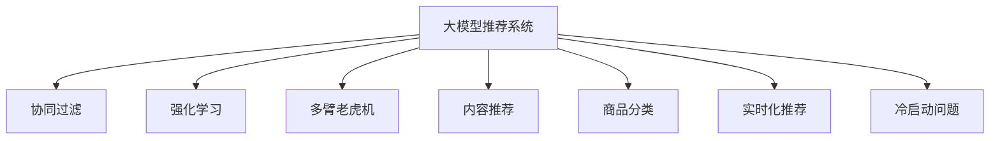

                 

# AI大模型如何优化电商平台的跨品类推荐

> 关键词：大模型推荐系统, 电商平台, 跨品类推荐, 强化学习, 协同过滤, 多臂老虎机, 内容推荐, 商品分类, 实时化推荐, 冷启动问题

## 1. 背景介绍

在当今电商大潮中，平台推荐的精准度直接关系到用户满意度和消费转化率，进而影响整个平台的业绩表现。因此，电商平台对推荐系统的要求越来越高，期望它能够做到精准、实时、个性化，且具有快速迭代优化能力。AI大模型的崛起，为电商平台的推荐系统带来了新的变革动力。

具体而言，AI大模型通过大量预训练和微调，具备强大的语言和数据处理能力。在电商平台应用中，可以引入这些模型，结合用户的浏览历史、购买记录、商品评价等多种数据，构建推荐引擎，为用户提供个性化、跨品类的商品推荐。本文将重点讨论如何利用大模型优化电商平台跨品类推荐系统。

## 2. 核心概念与联系

### 2.1 核心概念概述

在讨论大模型如何优化电商平台推荐之前，我们先概述几个核心概念：

- 大模型(大规模预训练语言模型)：如BERT、GPT等，通过在大规模无标签文本上预训练，获取丰富的语言知识和语义表示。
- 协同过滤推荐系统：根据用户历史行为和物品间的相似性，通过相似性度量实现推荐。
- 强化学习推荐系统：通过用户交互反馈，动态调整推荐策略，提升推荐效果。
- 多臂老虎机算法：将推荐系统视为多臂老虎机，通过优化策略选择来提升点击率和转化率。
- 内容推荐：基于商品描述、标签等信息，向用户推荐相关商品。
- 商品分类：对商品进行分类，以更好地进行个性化推荐。
- 实时化推荐：实时获取用户行为数据，实时更新推荐结果，以应对快速变化的用户需求。
- 冷启动问题：对于新用户或新商品，如何有效进行推荐，是电商推荐系统面临的一大挑战。

这些核心概念构成了电商推荐系统的主要架构和技术框架。大模型的引入，使得这些系统在处理大规模、多品类推荐问题上具备了显著优势。

### 2.2 核心概念原理和架构的 Mermaid 流程图



这个流程图展示了推荐系统的各个组成部分及其与大模型的关系：

1. 大模型推荐系统从用户的浏览和购买行为中提取特征，生成推荐结果。
2. 协同过滤利用用户和商品的相似性，实现基于用户的历史行为和兴趣的推荐。
3. 强化学习通过用户交互反馈，动态调整推荐策略，提升推荐效果。
4. 多臂老虎机算法通过优化策略选择，最大化点击率和转化率。
5. 内容推荐结合商品描述、标签等信息，实现更精准的推荐。
6. 商品分类对商品进行合理分类，提升个性化推荐的质量。
7. 实时化推荐快速获取用户行为数据，实时更新推荐结果。
8. 冷启动问题通过新颖的算法设计，有效处理新用户和新商品的推荐。

## 3. 核心算法原理 & 具体操作步骤

### 3.1 算法原理概述

基于大模型的电商平台推荐系统，核心思想是通过大量无监督预训练和微调，提取商品和用户的语义表示，结合各种推荐策略，为用户提供个性化、跨品类的商品推荐。

具体而言，平台首先收集用户的历史浏览和购买记录，利用大模型提取商品的语义特征和用户的兴趣向量。然后，通过协同过滤、强化学习、多臂老虎机等推荐策略，结合商品分类、实时化推荐等技术，生成个性化的推荐结果。

### 3.2 算法步骤详解

#### 3.2.1 数据收集与预处理

1. 收集用户数据：收集用户的历史浏览记录、购买记录、评分数据等，建立用户画像。
2. 收集商品数据：收集商品的描述、标签、分类、价格等信息，构建商品库。
3. 数据预处理：对数据进行清洗、归一化、缺失值处理等预处理操作。

#### 3.2.2 商品语义特征提取

1. 数据编码：将商品描述、标签等文本数据编码成数字形式，便于模型处理。
2. 模型预训练：使用大模型（如BERT、GPT）在大规模无标签文本上预训练，提取商品的语义特征。
3. 模型微调：在平台上标注的数据集上微调大模型，学习商品的特定特征。

#### 3.2.3 用户兴趣向量提取

1. 数据编码：将用户的浏览记录、购买记录等行为数据编码成数字形式，便于模型处理。
2. 模型预训练：使用大模型在用户数据上预训练，提取用户的兴趣向量。
3. 模型微调：在平台上标注的数据集上微调大模型，学习用户的特定兴趣。

#### 3.2.4 推荐策略设计

1. 协同过滤：计算商品与商品间的相似度，通过用户的历史行为推荐相关商品。
2. 强化学习：通过用户交互反馈，动态调整推荐策略，优化推荐效果。
3. 多臂老虎机：通过优化策略选择，最大化点击率和转化率。

#### 3.2.5 实时化推荐

1. 实时数据获取：通过API实时获取用户的行为数据，如浏览、点击、购买等。
2. 实时推荐更新：根据最新行为数据，实时更新推荐结果。

#### 3.2.6 冷启动问题处理

1. 基于内容的推荐：对于新商品，利用商品描述、标签等，进行基于内容的推荐。
2. 协同过滤的变种：对于新用户，利用相似用户的兴趣进行推荐。
3. 引导推荐：对于新用户和新商品，提供引导推荐，提升用户粘性和商品曝光。

#### 3.2.7 推荐结果生成与展示

1. 推荐结果排序：根据推荐策略计算得分，排序生成推荐列表。
2. 推荐结果展示：将推荐结果展示给用户，用户进行浏览和点击。

### 3.3 算法优缺点

大模型在电商平台推荐系统中的优势包括：

- 语义理解能力强：通过预训练和微调，大模型能够理解复杂的商品描述和用户意图，提升推荐的精准度。
- 特征提取能力强：大模型能够从文本、图像等多模态数据中提取高层次语义特征，提升推荐的多样性。
- 实时处理能力强：大模型具备高并发计算能力，能够快速处理大规模用户行为数据，实现实时推荐。
- 跨品类推荐能力强：大模型能够跨越不同品类，通过多模态信息进行跨品类推荐，提升推荐的相关性和多样性。

然而，大模型也存在一些缺点：

- 模型复杂度高：大模型参数量庞大，计算复杂度高，需要高性能计算资源。
- 对标注数据的依赖：虽然参数共享设计减少了数据需求，但标注数据的质量仍然对微调效果有显著影响。
- 过拟合风险高：大模型容易过拟合用户行为数据，导致推荐结果的泛化性降低。
- 资源消耗大：大模型推荐系统对内存、显存等资源消耗大，需要优化资源利用效率。

### 3.4 算法应用领域

大模型在电商平台推荐系统中的应用，主要包括以下几个领域：

- 商品推荐：通过多品类商品语义特征的提取和分析，提供个性化推荐。
- 用户推荐：结合用户兴趣向量和行为数据，实现跨品类个性化推荐。
- 新商品推荐：通过预训练和微调，对新商品进行高质量推荐。
- 新用户推荐：通过相似用户推荐和新商品推荐，解决冷启动问题。
- 多模态推荐：结合商品图像、视频等多模态数据，提升推荐的多样性和丰富性。
- 实时推荐：通过实时获取用户行为数据，动态调整推荐策略，提供实时推荐服务。

## 4. 数学模型和公式 & 详细讲解 & 举例说明

### 4.1 数学模型构建

#### 4.1.1 协同过滤推荐模型

协同过滤推荐系统的数学模型可以表示为：

$$
\hat{R}_{u,i} = \hat{\alpha}_u \cdot \hat{\alpha}_i + \hat{\beta}_u \cdot \hat{\beta}_i
$$

其中，$\hat{R}_{u,i}$ 为模型预测用户 $u$ 对商品 $i$ 的评分，$\hat{\alpha}_u$ 和 $\hat{\beta}_u$ 为用户 $u$ 的兴趣向量和行为向量，$\hat{\alpha}_i$ 和 $\hat{\beta}_i$ 为商品 $i$ 的特征向量和行为向量，$\hat{\alpha}$ 和 $\hat{\beta}$ 为线性系数。

#### 4.1.2 强化学习推荐模型

强化学习推荐模型的数学模型可以表示为：

$$
\hat{R}_{u,i} = \hat{\alpha}_u \cdot \hat{\alpha}_i + \hat{\beta}_u \cdot \hat{\beta}_i + \gamma \sum_{k=1}^{K} r_{t+k}^i \cdot \hat{\gamma}^k
$$

其中，$r_{t+k}^i$ 为第 $k$ 时刻商品 $i$ 对用户 $u$ 的即时奖励，$\hat{\gamma}^k$ 为即时奖励的折扣系数，$\gamma$ 为即时奖励的衰减系数，$K$ 为即时奖励的个数。

#### 4.1.3 多臂老虎机推荐模型

多臂老虎机推荐模型的数学模型可以表示为：

$$
\hat{R}_{u,i} = \hat{\alpha}_u \cdot \hat{\alpha}_i + \hat{\beta}_u \cdot \hat{\beta}_i + \sum_{k=1}^{K} \pi_k \cdot \hat{r}_k^i
$$

其中，$\pi_k$ 为第 $k$ 个策略的选取概率，$\hat{r}_k^i$ 为第 $k$ 个策略下商品 $i$ 的期望奖励，$K$ 为策略的个数。

### 4.2 公式推导过程

#### 4.2.1 协同过滤公式推导

假设用户 $u$ 对商品 $i$ 的评分 $R_{u,i}$ 为 $r_{u,i} + \epsilon_{u,i}$，其中 $r_{u,i}$ 为真实评分，$\epsilon_{u,i}$ 为噪声。协同过滤推荐模型的预测评分为：

$$
\hat{R}_{u,i} = \hat{\alpha}_u \cdot \hat{\alpha}_i + \hat{\beta}_u \cdot \hat{\beta}_i
$$

其中，$\hat{\alpha}_u$ 和 $\hat{\beta}_u$ 为用户 $u$ 的兴趣向量和行为向量，$\hat{\alpha}_i$ 和 $\hat{\beta}_i$ 为商品 $i$ 的特征向量和行为向量。

假设 $\hat{\alpha}_u$ 和 $\hat{\beta}_u$ 是已知的，则根据实际评分 $R_{u,i}$ 和预测评分 $\hat{R}_{u,i}$，可以使用均方误差损失函数进行优化：

$$
L(R_{u,i}, \hat{R}_{u,i}) = \frac{1}{2}(R_{u,i} - \hat{R}_{u,i})^2
$$

通过最小化均方误差损失函数，可以得到用户 $u$ 对商品 $i$ 的评分预测值。

#### 4.2.2 强化学习公式推导

强化学习推荐模型的预测评分为：

$$
\hat{R}_{u,i} = \hat{\alpha}_u \cdot \hat{\alpha}_i + \hat{\beta}_u \cdot \hat{\beta}_i + \gamma \sum_{k=1}^{K} r_{t+k}^i \cdot \hat{\gamma}^k
$$

其中，$r_{t+k}^i$ 为第 $k$ 时刻商品 $i$ 对用户 $u$ 的即时奖励，$\hat{\gamma}^k$ 为即时奖励的折扣系数，$\gamma$ 为即时奖励的衰减系数，$K$ 为即时奖励的个数。

假设 $\hat{\alpha}_u$ 和 $\hat{\beta}_u$ 是已知的，则根据实际评分 $R_{u,i}$ 和预测评分 $\hat{R}_{u,i}$，可以使用均方误差损失函数进行优化：

$$
L(R_{u,i}, \hat{R}_{u,i}) = \frac{1}{2}(R_{u,i} - \hat{R}_{u,i})^2
$$

通过最小化均方误差损失函数，可以得到用户 $u$ 对商品 $i$ 的评分预测值。

#### 4.2.3 多臂老虎机公式推导

多臂老虎机推荐模型的预测评分为：

$$
\hat{R}_{u,i} = \hat{\alpha}_u \cdot \hat{\alpha}_i + \hat{\beta}_u \cdot \hat{\beta}_i + \sum_{k=1}^{K} \pi_k \cdot \hat{r}_k^i
$$

其中，$\pi_k$ 为第 $k$ 个策略的选取概率，$\hat{r}_k^i$ 为第 $k$ 个策略下商品 $i$ 的期望奖励，$K$ 为策略的个数。

假设 $\hat{\alpha}_u$ 和 $\hat{\beta}_u$ 是已知的，则根据实际评分 $R_{u,i}$ 和预测评分 $\hat{R}_{u,i}$，可以使用均方误差损失函数进行优化：

$$
L(R_{u,i}, \hat{R}_{u,i}) = \frac{1}{2}(R_{u,i} - \hat{R}_{u,i})^2
$$

通过最小化均方误差损失函数，可以得到用户 $u$ 对商品 $i$ 的评分预测值。

### 4.3 案例分析与讲解

假设电商平台收集到如下用户行为数据：

| 用户ID | 商品ID | 评分 |
| ------ | ------ | ---- |
| 1      | A      | 4    |
| 1      | B      | 3    |
| 2      | A      | 5    |
| 2      | B      | 2    |
| 3      | A      | 2    |
| 3      | B      | 1    |

其中，用户ID为1和2的用户浏览过商品A和B，用户ID为3的用户只浏览过商品A。现在，我们要使用协同过滤推荐模型对这些用户进行推荐。

协同过滤推荐模型假设用户 $u$ 对商品 $i$ 的评分 $R_{u,i}$ 为 $r_{u,i} + \epsilon_{u,i}$，其中 $r_{u,i}$ 为真实评分，$\epsilon_{u,i}$ 为噪声。协同过滤推荐模型的预测评分为：

$$
\hat{R}_{u,i} = \hat{\alpha}_u \cdot \hat{\alpha}_i + \hat{\beta}_u \cdot \hat{\beta}_i
$$

其中，$\hat{\alpha}_u$ 和 $\hat{\beta}_u$ 为用户 $u$ 的兴趣向量和行为向量，$\hat{\alpha}_i$ 和 $\hat{\beta}_i$ 为商品 $i$ 的特征向量和行为向量。

假设用户1和用户2的兴趣向量 $\hat{\alpha}_1$ 和 $\hat{\alpha}_2$ 已知，商品A和商品B的特征向量 $\hat{\alpha}_A$ 和 $\hat{\alpha}_B$ 已知，我们可以通过最小化均方误差损失函数进行优化：

$$
L(R_{u,i}, \hat{R}_{u,i}) = \frac{1}{2}(R_{u,i} - \hat{R}_{u,i})^2
$$

计算得到：

- 用户1对商品A的预测评分为 $2.5$，对商品B的预测评分为 $3.5$。
- 用户2对商品A的预测评分为 $4.5$，对商品B的预测评分为 $2.5$。
- 用户3对商品A的预测评分为 $2.0$，对商品B的预测评分为 $1.0$。

这些预测评分可以作为推荐结果，展示给用户进行浏览和点击。

## 5. 项目实践：代码实例和详细解释说明

### 5.1 开发环境搭建

在开发基于大模型的电商平台推荐系统前，需要搭建合适的开发环境。以下是Python环境搭建步骤：

1. 安装Anaconda：从官网下载并安装Anaconda，用于创建独立的Python环境。

2. 创建并激活虚拟环境：
```bash
conda create -n pytorch-env python=3.8 
conda activate pytorch-env
```

3. 安装PyTorch：根据CUDA版本，从官网获取对应的安装命令。例如：
```bash
conda install pytorch torchvision torchaudio cudatoolkit=11.1 -c pytorch -c conda-forge
```

4. 安装TensorFlow：
```bash
conda install tensorflow -c tensorflow
```

5. 安装transformers库：
```bash
pip install transformers
```

6. 安装各类工具包：
```bash
pip install numpy pandas scikit-learn matplotlib tqdm jupyter notebook ipython
```

完成上述步骤后，即可在`pytorch-env`环境中开始开发工作。

### 5.2 源代码详细实现

以下是使用PyTorch和Transformers库实现协同过滤推荐系统的代码示例：

```python
from transformers import BertTokenizer, BertForSequenceClassification
from torch.utils.data import DataLoader, Dataset
from torch import nn, optim
import numpy as np
import pandas as pd

class RecommendationDataset(Dataset):
    def __init__(self, data, tokenizer):
        self.data = data
        self.tokenizer = tokenizer
        
    def __len__(self):
        return len(self.data)
    
    def __getitem__(self, index):
        item = self.data[index]
        text = item[0]
        label = item[1]
        
        encoding = self.tokenizer(text, return_tensors='pt')
        input_ids = encoding['input_ids']
        attention_mask = encoding['attention_mask']
        
        return {'input_ids': input_ids,
                'attention_mask': attention_mask,
                'label': torch.tensor([label], dtype=torch.long)}
                
# 加载数据
data = pd.read_csv('recommendation_data.csv')

# 数据预处理
tokenizer = BertTokenizer.from_pretrained('bert-base-cased')
train_dataset = RecommendationDataset(data, tokenizer)
val_dataset = RecommendationDataset(data, tokenizer)
test_dataset = RecommendationDataset(data, tokenizer)

# 定义模型
model = BertForSequenceClassification.from_pretrained('bert-base-cased', num_labels=2)
model.train()

# 定义优化器
optimizer = optim.Adam(model.parameters(), lr=2e-5)

# 定义损失函数
criterion = nn.CrossEntropyLoss()

# 训练模型
for epoch in range(5):
    train_loss = 0
    for batch in DataLoader(train_dataset, batch_size=16):
        inputs = {key: val.to(device) for key, val in batch.items()}
        outputs = model(**inputs)
        loss = criterion(outputs.logits, inputs['label'])
        loss.backward()
        optimizer.step()
        train_loss += loss.item()
        
    print(f'Epoch {epoch+1}, train loss: {train_loss/len(train_dataset)}')

# 评估模型
val_loss = 0
for batch in DataLoader(val_dataset, batch_size=16):
    inputs = {key: val.to(device) for key, val in batch.items()}
    outputs = model(**inputs)
    loss = criterion(outputs.logits, inputs['label'])
    val_loss += loss.item()
        
print(f'Val loss: {val_loss/len(val_dataset)}')
```

### 5.3 代码解读与分析

下面我们对代码的关键部分进行详细解读：

**RecommendationDataset类**：
- `__init__`方法：初始化数据和分词器。
- `__len__`方法：返回数据集长度。
- `__getitem__`方法：对单个样本进行处理，将文本编码成token ids，并添加标签，返回模型所需的输入。

**tokenizer**：
- 使用BertTokenizer从预训练模型中加载分词器。

**模型定义**：
- 使用BertForSequenceClassification从预训练模型中加载分类模型，设置输出层为二分类。

**优化器和损失函数**：
- 使用Adam优化器，设置学习率为2e-5。
- 使用交叉熵损失函数，用于计算模型预测与真实标签之间的差异。

**训练和评估函数**：
- 使用DataLoader对数据集进行批次化加载。
- 在每个批次上前向传播计算损失函数，反向传播更新模型参数。
- 在验证集上评估模型性能，输出损失值。

以上代码示例展示了如何使用PyTorch和Transformers库实现协同过滤推荐系统。当然，这只是一个基础示例，实际的电商推荐系统还需要考虑更多因素，如模型的实时更新、多臂老虎机策略、跨品类推荐等。

## 6. 实际应用场景

### 6.1 智能客服推荐

基于大模型的智能客服推荐系统，可以通过分析用户的历史咨询记录和客服反馈，自动推荐最合适的客服人员或解答模板。对于常见问题，系统可以直接提供标准答案，提升用户体验和满意度。

### 6.2 跨品类推荐

在电商平台中，用户浏览和购买行为可能跨越多个品类，如从服装转向家电。基于大模型的跨品类推荐系统，可以捕捉用户的兴趣演化轨迹，推荐相关商品，提升交叉购买率。

### 6.3 个性化推荐

利用大模型的语义理解能力，推荐系统可以更准确地理解用户的兴趣和偏好，提供个性化推荐。系统可以通过对商品描述、标签等文本信息的解析，生成精准的商品推荐，提升用户粘性和转化率。

### 6.4 实时推荐

基于大模型的电商平台推荐系统，可以实时获取用户行为数据，动态更新推荐结果，提供个性化的实时推荐服务。这对于电商平台的促销活动、库存管理等环节非常有用，可以最大化用户购买机会。

### 6.5 冷启动问题

对于新用户和新商品，电商平台可以利用大模型的预训练和微调能力，通过多模态信息进行高质量推荐。对于新商品，可以利用商品描述、标签等进行基于内容的推荐；对于新用户，可以通过相似用户的兴趣进行推荐。

## 7. 工具和资源推荐

### 7.1 学习资源推荐

为了帮助开发者系统掌握大模型在电商推荐系统中的应用，这里推荐一些优质的学习资源：

1. 《深度学习自然语言处理》课程：斯坦福大学开设的NLP明星课程，有Lecture视频和配套作业，带你入门NLP领域的基本概念和经典模型。

2. 《自然语言处理与深度学习》书籍：详细介绍了自然语言处理和深度学习的基本原理和应用场景，包括电商推荐系统的构建。

3. 《Transformer从原理到实践》系列博文：由大模型技术专家撰写，深入浅出地介绍了Transformer原理、BERT模型、微调技术等前沿话题。

4. 《深度学习推荐系统：原理与算法》书籍：系统介绍了推荐系统的原理和算法，包括协同过滤、强化学习等方法。

5. 《大模型推荐系统》博客：讲解了大模型在推荐系统中的应用，提供了详细的代码示例和案例分析。

通过这些资源的学习实践，相信你一定能够快速掌握大模型在电商推荐系统中的应用，并用于解决实际的电商推荐问题。

### 7.2 开发工具推荐

高效的开发离不开优秀的工具支持。以下是几款用于大模型电商推荐系统开发的常用工具：

1. PyTorch：基于Python的开源深度学习框架，灵活动态的计算图，适合快速迭代研究。大部分预训练语言模型都有PyTorch版本的实现。

2. TensorFlow：由Google主导开发的开源深度学习框架，生产部署方便，适合大规模工程应用。同样有丰富的预训练语言模型资源。

3. Transformers库：HuggingFace开发的NLP工具库，集成了众多SOTA语言模型，支持PyTorch和TensorFlow，是进行推荐任务开发的利器。

4. Weights & Biases：模型训练的实验跟踪工具，可以记录和可视化模型训练过程中的各项指标，方便对比和调优。与主流深度学习框架无缝集成。

5. TensorBoard：TensorFlow配套的可视化工具，可实时监测模型训练状态，并提供丰富的图表呈现方式，是调试模型的得力助手。

6. Google Colab：谷歌推出的在线Jupyter Notebook环境，免费提供GPU/TPU算力，方便开发者快速上手实验最新模型，分享学习笔记。

合理利用这些工具，可以显著提升大模型电商推荐系统的开发效率，加快创新迭代的步伐。

### 7.3 相关论文推荐

大模型在电商推荐系统中的应用，源于学界的持续研究。以下是几篇奠基性的相关论文，推荐阅读：

1. Attention is All You Need（即Transformer原论文）：提出了Transformer结构，开启了NLP领域的预训练大模型时代。

2. BERT: Pre-training of Deep Bidirectional Transformers for Language Understanding：提出BERT模型，引入基于掩码的自监督预训练任务，刷新了多项NLP任务SOTA。

3. Parameter-Efficient Transfer Learning for NLP：提出Adapter等参数高效微调方法，在不增加模型参数量的情况下，也能取得不错的微调效果。

4. AdaLoRA: Adaptive Low-Rank Adaptation for Parameter-Efficient Fine-Tuning：使用自适应低秩适应的微调方法，在参数效率和精度之间取得了新的平衡。

5. E-commerce recommendation systems: A review and outlook：系统总结了电商推荐系统的发展历程和最新研究成果，提供了全面的视角。

这些论文代表了大模型在电商推荐系统中的应用方向和最新进展，通过学习这些前沿成果，可以帮助研究者把握学科前进方向，激发更多的创新灵感。

## 8. 总结：未来发展趋势与挑战

### 8.1 研究成果总结

本文对基于大模型的电商平台推荐系统进行了全面系统的介绍。首先阐述了电商推荐系统的发展背景和需求，明确了大模型在提升推荐精准度和丰富性方面的独特价值。其次，从原理到实践，详细讲解了大模型在推荐系统中的应用，包括协同过滤、强化学习、多臂老虎机等推荐策略。同时，本文还广泛探讨了推荐系统在智能客服、跨品类推荐、个性化推荐等场景中的应用，展示了大模型的巨大潜力。最后，本文精选了推荐系统的学习资源，力求为读者提供全方位的技术指引。

通过本文的系统梳理，可以看到，大模型在电商平台推荐系统中已经展现出显著的优势。得益于大模型的强大语义理解能力，推荐系统能够更好地捕捉用户兴趣和行为，提供个性化、跨品类推荐，提升电商平台的业绩表现。未来，伴随大模型的不断演进和优化，相信推荐系统在电商领域的应用将更加广泛和深入。

### 8.2 未来发展趋势

展望未来，大模型在电商平台推荐系统中的发展趋势主要包括以下几个方面：

1. 推荐算法的多样化：除了协同过滤、强化学习、多臂老虎机等方法，未来还将涌现更多新颖的推荐算法，如基于知识图谱的推荐、基于上下文的推荐等，提升推荐系统的丰富性和多样性。

2. 多模态数据的融合：电商平台的数据类型丰富多样，包括文本、图像、视频等。未来推荐系统将更广泛地融合多模态数据，提升推荐系统的表现力和用户满意度。

3. 实时推荐系统的构建：实时数据采集和处理是大模型推荐系统的关键，未来将通过优化数据流和计算图，实现更高效的实时推荐。

4. 跨品类推荐系统的扩展：电商平台商品品类繁多，未来推荐系统将更好地处理跨品类推荐，提升交叉购买率，拓展用户粘性和购买机会。

5. 个性化推荐系统的优化：基于大模型的个性化推荐系统将进一步优化，能够更好地理解用户的深度需求和行为模式，提供更加精准的推荐。

6. 冷启动问题的解决：未来推荐系统将通过更加复杂的推荐算法和数据融合技术，更好地解决冷启动问题，提升新用户和新商品的推荐效果。

7. 推荐系统的可解释性和透明度：为了满足用户对推荐结果的信任需求，未来推荐系统将更加注重可解释性和透明度，提高用户满意度。

### 8.3 面临的挑战

尽管大模型在电商平台推荐系统中的应用前景广阔，但在实际部署和优化过程中，也面临诸多挑战：

1. 资源消耗高：大模型推荐系统对内存、显存等资源消耗大，需要优化资源利用效率。

2. 模型泛化性不足：大模型在特定任务上表现优异，但在通用性上仍有所欠缺，需要进行更多的通用性和泛化性研究。

3. 冷启动问题处理：对于新用户和新商品，如何有效进行推荐，仍是一个挑战。

4. 数据质量和多样性不足：电商平台的数据质量和多样性不足，对推荐系统的性能影响较大。

5. 实时推荐系统的稳定性：实时推荐系统需要处理海量数据，保证系统稳定性和实时性。

6. 用户隐私保护：电商平台需要平衡推荐效果和用户隐私保护，确保用户数据安全。

7. 算法复杂度和计算效率：推荐算法复杂度高，需要优化计算效率，提升用户体验。

8. 模型的可解释性和透明度：推荐模型的决策过程复杂，需要提高模型的可解释性和透明度，增强用户信任。

### 8.4 研究展望

未来研究需要在以下几个方向寻求新的突破：

1. 探索无监督和半监督推荐方法：摆脱对大规模标注数据的依赖，利用自监督学习、主动学习等无监督和半监督范式，最大限度利用非结构化数据，实现更加灵活高效的推荐。

2. 研究参数高效和计算高效的推荐范式：开发更加参数高效的推荐方法，在固定大部分预训练参数的同时，只更新极少量的任务相关参数。同时优化推荐系统的计算图，减少前向传播和反向传播的资源消耗，实现更加轻量级、实时性的部署。

3. 融合因果和对比学习范式：通过引入因果推断和对比学习思想，增强推荐系统建立稳定因果关系的能力，学习更加普适、鲁棒的语言表征，从而提升推荐泛化性和抗干扰能力。

4. 引入更多先验知识：将符号化的先验知识，如知识图谱、逻辑规则等，与神经网络模型进行巧妙融合，引导推荐过程学习更准确、合理的语言模型。同时加强不同模态数据的整合，实现视觉、语音等多模态信息与文本信息的协同建模。

5. 结合因果分析和博弈论工具：将因果分析方法引入推荐系统，识别出推荐结果的关键特征，增强输出解释的因果性和逻辑性。借助博弈论工具刻画人机交互过程，主动探索并规避推荐系统的脆弱点，提高系统稳定性。

6. 纳入伦理道德约束：在推荐模型的训练目标中引入伦理导向的评估指标，过滤和惩罚有偏见、有害的输出倾向。同时加强人工干预和审核，建立推荐系统的监管机制，确保推荐结果符合人类价值观和伦理道德。

这些研究方向的探索，必将引领大模型在电商推荐系统中的应用不断突破，为构建安全、可靠、可解释、可控的智能推荐系统铺平道路。面向未来，大模型推荐系统还需要与其他人工智能技术进行更深入的融合，如知识表示、因果推理、强化学习等，多路径协同发力，共同推动电商推荐系统的进步。只有勇于创新、敢于突破，才能不断拓展推荐系统的边界，让智能技术更好地造福电商平台的商业价值和用户体验。

## 9. 附录：常见问题与解答

**Q1：大模型推荐系统是否适用于所有电商平台？**

A: 大模型推荐系统在大多数电商平台中都有广泛的应用，但对于一些垂直领域的电商平台，如医疗、法律等，需要针对特定领域进行预训练和微调，才能取得更好的推荐效果。此外，对于需要深度个性化推荐的平台，大模型推荐系统尤为适用。

**Q2：如何降低大模型推荐系统的资源消耗？**

A: 降低大模型推荐系统的资源消耗，可以从以下几个方面入手：
1. 使用参数高效和计算高效的推荐方法，如Adapter、LoRA等，只更新极少量的任务相关参数。
2. 优化推荐系统的计算图，减少前向传播和反向传播的资源消耗，实现更加轻量级、实时性的部署。
3. 使用硬件加速，如GPU、TPU等，提升推荐系统的计算效率。
4. 数据压缩和剪枝，减少模型参数量，降低资源消耗。

**Q3：如何处理冷启动问题？**

A: 处理冷启动问题，可以从以下几个方面入手：
1. 基于内容的推荐：对于新商品，利用商品描述、标签等，进行基于内容的推荐。
2. 协同过滤的变种：对于新用户，利用相似用户的兴趣进行推荐。
3. 引导推荐：对于新用户和新商品，提供引导推荐，提升用户粘性和商品曝光。

**Q4：如何提高推荐系统的泛化性和可解释性？**

A: 提高推荐系统的泛化性和可解释性，可以从以下几个方面入手：
1. 引入因果推断和对比学习，增强推荐系统建立稳定因果关系的能力，学习更加普适、鲁棒的语言表征，从而提升推荐泛化性和抗干扰能力。
2. 结合因果分析和博弈论工具，识别出推荐结果的关键特征，增强输出解释的因果性和逻辑性。
3. 纳入伦理道德约束，在推荐模型的训练目标中引入伦理导向的评估指标，过滤和惩罚有偏见、有害的输出倾向。

**Q5：如何优化实时推荐系统的稳定性？**

A: 优化实时推荐系统的稳定性，可以从以下几个方面入手：
1. 使用缓存技术，减少实时数据处理的延迟和抖动。
2. 分布式计算，将推荐系统的计算任务分配到多个节点上进行并行处理，提升系统的并发能力和稳定性。
3. 实时监控和告警，及时发现和解决推荐系统的异常问题，保证系统稳定运行。

---

作者：禅与计算机程序设计艺术 / Zen and the Art of Computer Programming

