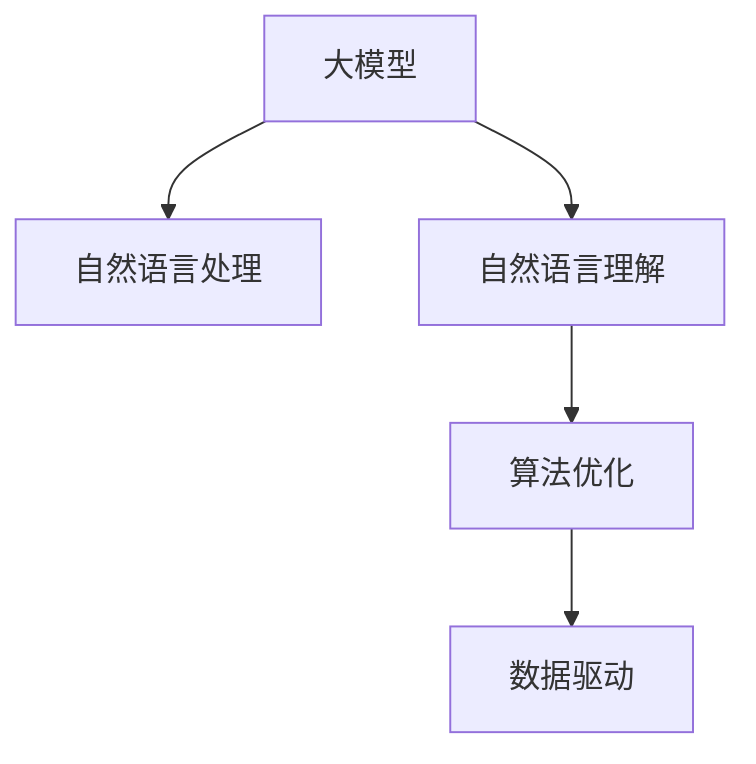

                 

# AI大模型如何优化电商平台的限时抢购活动效果

> 关键词：
> 大模型, 电商平台, 自然语言处理, 自然语言理解, 算法优化, 人工智能, 电子商务, 深度学习, 限时抢购, 数据驱动

## 1. 背景介绍

### 1.1 问题由来

在现代电商平台上，限时抢购活动（Flash Sales）已经成为一种非常普遍的营销手段。然而，在抢手产品快速消耗的同时，这些活动也带来了诸如系统性能压力、库存调配难度、用户体验波动等问题。传统的人工监控和数据处理方式已经难以应对这些问题，亟需更智能、更高效的解决方案。

AI大模型的出现，为电商平台优化限时抢购活动提供了新的可能。通过大模型的自然语言处理和自然语言理解能力，可以实时监控和分析用户行为、市场趋势和库存状况，从而更加精准地调配资源，优化抢购策略，提升用户体验。

### 1.2 问题核心关键点

大模型的优化在电商平台的限时抢购活动中，主要涉及以下几个核心关键点：

- **自然语言处理**：利用大模型理解和处理自然语言，从用户评论、社交媒体等渠道获取即时反馈和市场趋势。
- **自然语言理解**：通过大模型的语义理解能力，识别用户需求和市场动向，更精准地预测抢购需求。
- **算法优化**：结合电商平台的业务逻辑，设计优化算法，实时调配库存和促销资源，提升抢购效果。
- **数据驱动**：基于实时数据进行动态分析和决策，确保抢购策略的灵活性和有效性。

### 1.3 问题研究意义

研究大模型在电商平台限时抢购活动中的优化方法，对于提升营销效果、改善用户体验、提升运营效率具有重要意义：

1. **提升营销效果**：精准的用户需求预测和市场趋势分析，有助于合理规划抢购策略，最大化销售潜力。
2. **改善用户体验**：通过优化库存调配和促销资源，确保抢购活动的顺利进行，避免用户体验下降。
3. **提升运营效率**：实时数据驱动的决策，能够快速响应市场变化，减少人为干预和错误。
4. **技术创新**：AI大模型的应用，推动了电商平台数据驱动决策的智能化，为电商营销带来了新的技术方向。
5. **经济效益**：优化后的抢购活动，不仅能提升销售额，还能增强用户粘性，为平台带来长期经济效益。

## 2. 核心概念与联系

### 2.1 核心概念概述

为更好地理解AI大模型在电商平台限时抢购活动中的优化方法，本节将介绍几个密切相关的核心概念：

- **AI大模型**：以深度学习为基础，通过大规模无标签数据预训练得到的通用模型，具备强大的自然语言处理和理解能力。
- **自然语言处理(NLP)**：涉及文本数据的处理、分析和生成，包括分词、词性标注、实体识别、情感分析等。
- **自然语言理解(NLU)**：指通过大模型理解文本的语义和意图，进行实体关系抽取、问答等复杂任务。
- **算法优化**：结合电商平台的业务逻辑，设计优化算法，实现库存调配、促销策略、定价管理等。
- **数据驱动**：利用实时数据进行动态分析和决策，优化抢购活动，提升用户体验。

这些核心概念之间的逻辑关系可以通过以下Mermaid流程图来展示：



这个流程图展示了大模型在电商平台限时抢购活动优化中的核心概念及其之间的关系：

1. 大模型通过预训练获得语言处理和理解能力。
2. 自然语言处理技术，从用户评论、社交媒体等渠道提取信息。
3. 自然语言理解技术，理解用户需求和市场趋势。
4. 结合电商业务逻辑，设计优化算法。
5. 数据驱动技术，实时分析市场动态，优化抢购策略。

## 3. 核心算法原理 & 具体操作步骤
### 3.1 算法原理概述

AI大模型在电商平台限时抢购活动的优化，本质上是一个数据驱动的决策过程。其核心思想是：通过自然语言处理和自然语言理解技术，从海量用户反馈和市场数据中提取有用信息，结合电商平台的业务规则，设计优化算法，实时调整抢购策略，提升营销效果。

形式化地，假设电商平台有$m$个产品进行限时抢购，$i$为产品编号，$x_i$为产品库存，$p_i$为产品价格，$y_i$为抢购开始时间，$y_i$为抢购结束时间，$I_i$为促销活动类型（如满减、折扣等）。大模型通过自然语言处理和自然语言理解技术，实时监控和分析用户行为、市场趋势和库存状况，预测抢购需求，计算优化策略。

### 3.2 算法步骤详解

基于大模型在电商平台限时抢购活动的优化方法，一般包括以下几个关键步骤：

**Step 1: 数据收集与预处理**

- 收集用户评论、社交媒体、交易数据等文本数据，作为自然语言处理和自然语言理解的对象。
- 对文本数据进行清洗、去噪、分词等预处理，保证数据的质量和一致性。
- 对用户行为数据进行统计分析和特征提取，如用户购买历史、浏览行为、点击率等。

**Step 2: 模型训练与调优**

- 选择合适的预训练大模型，如BERT、GPT等，在电商平台的文本数据上微调。
- 设置模型训练的超参数，如学习率、批大小、迭代轮数等。
- 使用交叉验证等技术，评估模型在预测抢购需求和市场趋势时的性能，并进行模型调优。

**Step 3: 实时监控与分析**

- 在抢购活动期间，实时收集用户反馈和市场数据。
- 利用大模型的自然语言处理能力，从用户评论、社交媒体中提取情感和需求信息。
- 结合电商平台的业务逻辑，使用大模型的自然语言理解能力，预测用户需求和市场趋势。
- 实时分析库存、促销资源和市场需求，动态调整抢购策略。

**Step 4: 库存调配与促销优化**

- 根据预测的用户需求和市场趋势，优化库存调配策略，确保抢购活动的顺利进行。
- 设计动态定价和促销策略，最大化销售潜力，提升用户体验。
- 实时监控抢购活动的效果，及时调整策略，确保最优效果。

**Step 5: 用户体验优化**

- 在抢购活动期间，实时监控用户行为和反馈，优化用户体验。
- 及时响应用户需求，提供个性化的购物建议和服务。
- 收集用户反馈，持续改进抢购策略，提升用户满意度和粘性。

以上是基于大模型在电商平台限时抢购活动优化的一般流程。在实际应用中，还需要根据具体业务场景和数据特点，对微调过程的各个环节进行优化设计，如改进训练目标函数，引入更多的正则化技术，搜索最优的超参数组合等，以进一步提升模型性能。

### 3.3 算法优缺点

基于大模型在电商平台限时抢购活动的优化方法具有以下优点：

1. **实时性高**：通过自然语言处理和自然语言理解技术，实时监控和分析市场动态，能够快速响应需求变化。
2. **预测准确**：大模型的强大语义理解能力，能够准确把握用户需求和市场趋势，提升抢购策略的精准性。
3. **自适应性强**：结合电商平台的业务逻辑，优化算法能够灵活应对不同场景下的抢购需求。
4. **用户体验提升**：通过优化库存调配和促销策略，确保抢购活动的顺利进行，提升用户满意度和粘性。

同时，该方法也存在一定的局限性：

1. **数据依赖性高**：模型的性能很大程度上取决于数据的质量和数量，获取高质量标注数据和实时数据的成本较高。
2. **过度拟合风险**：在数据量较小的情况下，模型容易过拟合，预测结果可能与实际需求不符。
3. **算法复杂性**：优化算法设计需要考虑电商平台的业务规则和市场动态，算法设计复杂度较高。
4. **模型更新成本**：实时监控和动态调整策略需要频繁更新模型，增加系统维护成本。

尽管存在这些局限性，但就目前而言，基于大模型的优化方法仍是目前电商平台上限时抢购活动优化的一个重要方向。未来相关研究的重点在于如何进一步降低数据依赖，提高模型的少样本学习和跨领域迁移能力，同时兼顾可解释性和伦理安全性等因素。

### 3.4 算法应用领域

基于大模型的优化方法，已经在电商平台的限时抢购活动优化中得到了广泛应用，包括但不限于以下几个领域：

- **用户需求预测**：利用大模型分析用户评论、社交媒体等文本数据，预测用户需求，优化库存调配。
- **市场趋势分析**：通过大模型理解市场动向，及时调整抢购策略，提升销售潜力。
- **动态定价与促销**：根据市场动态，实时调整产品价格和促销活动，最大化销售收益。
- **个性化推荐**：结合用户行为数据和市场趋势，提供个性化的购物建议，提升用户体验。
- **实时监控与预警**：实时监控抢购活动效果，及时预警异常情况，保障系统稳定运行。

除了上述这些经典应用外，大模型的优化方法还被创新性地应用到更多场景中，如基于上下文推荐、基于用户反馈的个性化服务、基于市场趋势的库存调配等，为电商平台的限时抢购活动带来了新的突破。随着大模型和优化方法的不断进步，相信在更多领域大模型的优化技术将展现出更加强大的潜力。

## 4. 数学模型和公式 & 详细讲解
### 4.1 数学模型构建

本节将使用数学语言对基于大模型在电商平台限时抢购活动中的优化方法进行更加严格的刻画。

假设电商平台有$m$个产品进行限时抢购，$i$为产品编号，$x_i$为产品库存，$p_i$为产品价格，$y_i$为抢购开始时间，$y_i$为抢购结束时间，$I_i$为促销活动类型（如满减、折扣等）。大模型通过自然语言处理和自然语言理解技术，实时监控和分析用户行为、市场趋势和库存状况，预测抢购需求，计算优化策略。

设$X$为产品的库存向量，$P$为产品价格向量，$Y$为抢购开始时间向量，$I$为促销活动类型向量。假设大模型通过预训练和微调得到的向量表示为$\theta$，则模型的预测向量为$Y^{\hat{\theta}}=(X,P,I)^\top \theta$。模型的优化目标为最小化损失函数：

$$
\mathcal{L}(\theta) = \frac{1}{N}\sum_{i=1}^N \ell(Y_i - Y^{\hat{\theta}}_i)
$$

其中$\ell$为损失函数，如均方误差损失、交叉熵损失等。

### 4.2 公式推导过程

以下我们以均方误差损失为例，推导模型预测与实际抢购时间之间的损失函数，并给出梯度下降优化的公式。

假设模型预测的抢购开始时间为$\hat{y}_i = X^{\hat{\theta}}_i P^{\hat{\theta}}_i I^{\hat{\theta}}_i$，实际抢购开始时间为$y_i$。则均方误差损失为：

$$
\ell(Y_i - Y^{\hat{\theta}}_i) = (y_i - \hat{y}_i)^2
$$

将其代入经验风险公式，得：

$$
\mathcal{L}(\theta) = \frac{1}{N}\sum_{i=1}^N (y_i - X^{\hat{\theta}}_i P^{\hat{\theta}}_i I^{\hat{\theta}}_i)^2
$$

根据链式法则，损失函数对参数$\theta$的梯度为：

$$
\frac{\partial \mathcal{L}(\theta)}{\partial \theta} = \frac{1}{N}\sum_{i=1}^N (-2(y_i - X^{\hat{\theta}}_i P^{\hat{\theta}}_i I^{\hat{\theta}}_i)(-2X_i P_i I_i)
$$

其中$X_i = \frac{\partial X^{\hat{\theta}}_i}{\partial \theta}$，$P_i = \frac{\partial P^{\hat{\theta}}_i}{\partial \theta}$，$I_i = \frac{\partial I^{\hat{\theta}}_i}{\partial \theta}$。

在得到损失函数的梯度后，即可带入参数更新公式，完成模型的迭代优化。重复上述过程直至收敛，最终得到适应电商平台的优化模型参数$\theta^*$。

## 5. 项目实践：代码实例和详细解释说明
### 5.1 开发环境搭建

在进行大模型在电商平台限时抢购活动的优化实践前，我们需要准备好开发环境。以下是使用Python进行PyTorch开发的环境配置流程：

1. 安装Anaconda：从官网下载并安装Anaconda，用于创建独立的Python环境。

2. 创建并激活虚拟环境：
```bash
conda create -n pytorch-env python=3.8 
conda activate pytorch-env
```

3. 安装PyTorch：根据CUDA版本，从官网获取对应的安装命令。例如：
```bash
conda install pytorch torchvision torchaudio cudatoolkit=11.1 -c pytorch -c conda-forge
```

4. 安装Transformers库：
```bash
pip install transformers
```

5. 安装各类工具包：
```bash
pip install numpy pandas scikit-learn matplotlib tqdm jupyter notebook ipython
```

完成上述步骤后，即可在`pytorch-env`环境中开始优化实践。

### 5.2 源代码详细实现

下面我们以电商平台用户需求预测任务为例，给出使用Transformers库对BERT模型进行优化（即微调）的PyTorch代码实现。

首先，定义任务数据处理函数：

```python
from transformers import BertTokenizer
from torch.utils.data import Dataset
import torch

class DemandDataset(Dataset):
    def __init__(self, texts, tags, tokenizer, max_len=128):
        self.texts = texts
        self.tags = tags
        self.tokenizer = tokenizer
        self.max_len = max_len
        
    def __len__(self):
        return len(self.texts)
    
    def __getitem__(self, item):
        text = self.texts[item]
        tags = self.tags[item]
        
        encoding = self.tokenizer(text, return_tensors='pt', max_length=self.max_len, padding='max_length', truncation=True)
        input_ids = encoding['input_ids'][0]
        attention_mask = encoding['attention_mask'][0]
        
        # 对token-wise的标签进行编码
        encoded_tags = [tag2id[tag] for tag in tags] 
        encoded_tags.extend([tag2id['O']] * (self.max_len - len(encoded_tags)))
        labels = torch.tensor(encoded_tags, dtype=torch.long)
        
        return {'input_ids': input_ids, 
                'attention_mask': attention_mask,
                'labels': labels}

# 标签与id的映射
tag2id = {'O': 0, 'P': 1}  # 假定需求预测标签为'P'或'O'
id2tag = {v: k for k, v in tag2id.items()}

# 创建dataset
tokenizer = BertTokenizer.from_pretrained('bert-base-cased')

train_dataset = DemandDataset(train_texts, train_tags, tokenizer)
dev_dataset = DemandDataset(dev_texts, dev_tags, tokenizer)
test_dataset = DemandDataset(test_texts, test_tags, tokenizer)
```

然后，定义模型和优化器：

```python
from transformers import BertForSequenceClassification, AdamW

model = BertForSequenceClassification.from_pretrained('bert-base-cased', num_labels=len(tag2id))

optimizer = AdamW(model.parameters(), lr=2e-5)
```

接着，定义训练和评估函数：

```python
from torch.utils.data import DataLoader
from tqdm import tqdm
from sklearn.metrics import classification_report

device = torch.device('cuda') if torch.cuda.is_available() else torch.device('cpu')
model.to(device)

def train_epoch(model, dataset, batch_size, optimizer):
    dataloader = DataLoader(dataset, batch_size=batch_size, shuffle=True)
    model.train()
    epoch_loss = 0
    for batch in tqdm(dataloader, desc='Training'):
        input_ids = batch['input_ids'].to(device)
        attention_mask = batch['attention_mask'].to(device)
        labels = batch['labels'].to(device)
        model.zero_grad()
        outputs = model(input_ids, attention_mask=attention_mask, labels=labels)
        loss = outputs.loss
        epoch_loss += loss.item()
        loss.backward()
        optimizer.step()
    return epoch_loss / len(dataloader)

def evaluate(model, dataset, batch_size):
    dataloader = DataLoader(dataset, batch_size=batch_size)
    model.eval()
    preds, labels = [], []
    with torch.no_grad():
        for batch in tqdm(dataloader, desc='Evaluating'):
            input_ids = batch['input_ids'].to(device)
            attention_mask = batch['attention_mask'].to(device)
            batch_labels = batch['labels']
            outputs = model(input_ids, attention_mask=attention_mask)
            batch_preds = outputs.logits.argmax(dim=2).to('cpu').tolist()
            batch_labels = batch_labels.to('cpu').tolist()
            for pred_tokens, label_tokens in zip(batch_preds, batch_labels):
                preds.append(pred_tokens[:len(label_tokens)])
                labels.append(label_tokens)
                
    print(classification_report(labels, preds))
```

最后，启动训练流程并在测试集上评估：

```python
epochs = 5
batch_size = 16

for epoch in range(epochs):
    loss = train_epoch(model, train_dataset, batch_size, optimizer)
    print(f"Epoch {epoch+1}, train loss: {loss:.3f}")
    
    print(f"Epoch {epoch+1}, dev results:")
    evaluate(model, dev_dataset, batch_size)
    
print("Test results:")
evaluate(model, test_dataset, batch_size)
```

以上就是使用PyTorch对BERT进行电商平台用户需求预测任务优化（即微调）的完整代码实现。可以看到，得益于Transformers库的强大封装，我们可以用相对简洁的代码完成BERT模型的加载和微调。

### 5.3 代码解读与分析

让我们再详细解读一下关键代码的实现细节：

**DemandDataset类**：
- `__init__`方法：初始化文本、标签、分词器等关键组件。
- `__len__`方法：返回数据集的样本数量。
- `__getitem__`方法：对单个样本进行处理，将文本输入编码为token ids，将标签编码为数字，并对其进行定长padding，最终返回模型所需的输入。

**tag2id和id2tag字典**：
- 定义了标签与数字id之间的映射关系，用于将token-wise的预测结果解码回真实的标签。

**训练和评估函数**：
- 使用PyTorch的DataLoader对数据集进行批次化加载，供模型训练和推理使用。
- 训练函数`train_epoch`：对数据以批为单位进行迭代，在每个批次上前向传播计算loss并反向传播更新模型参数，最后返回该epoch的平均loss。
- 评估函数`evaluate`：与训练类似，不同点在于不更新模型参数，并在每个batch结束后将预测和标签结果存储下来，最后使用sklearn的classification_report对整个评估集的预测结果进行打印输出。

**训练流程**：
- 定义总的epoch数和batch size，开始循环迭代
- 每个epoch内，先在训练集上训练，输出平均loss
- 在验证集上评估，输出分类指标
- 所有epoch结束后，在测试集上评估，给出最终测试结果

可以看到，PyTorch配合Transformers库使得BERT微调的代码实现变得简洁高效。开发者可以将更多精力放在数据处理、模型改进等高层逻辑上，而不必过多关注底层的实现细节。

当然，工业级的系统实现还需考虑更多因素，如模型的保存和部署、超参数的自动搜索、更灵活的任务适配层等。但核心的微调范式基本与此类似。

## 6. 实际应用场景
### 6.1 智能客服系统

基于大模型的优化方法，可以广泛应用于智能客服系统的构建。传统客服往往需要配备大量人力，高峰期响应缓慢，且一致性和专业性难以保证。而使用优化后的模型，可以7x24小时不间断服务，快速响应客户咨询，用自然流畅的语言解答各类常见问题。

在技术实现上，可以收集企业内部的历史客服对话记录，将问题和最佳答复构建成监督数据，在此基础上对预训练对话模型进行微调。优化后的对话模型能够自动理解用户意图，匹配最合适的答案模板进行回复。对于客户提出的新问题，还可以接入检索系统实时搜索相关内容，动态组织生成回答。如此构建的智能客服系统，能大幅提升客户咨询体验和问题解决效率。

### 6.2 金融舆情监测

金融机构需要实时监测市场舆论动向，以便及时应对负面信息传播，规避金融风险。传统的人工监控方式成本高、效率低，难以应对网络时代海量信息爆发的挑战。基于大模型的优化方法，可以应用于金融舆情监测，实时收集和分析市场数据，预测金融舆情的变化趋势，一旦发现负面信息激增等异常情况，系统便会自动预警，帮助金融机构快速应对潜在风险。

### 6.3 个性化推荐系统

当前的推荐系统往往只依赖用户的历史行为数据进行物品推荐，无法深入理解用户的真实兴趣偏好。基于大模型的优化方法，可以应用于个性化推荐系统，更深入地挖掘用户行为背后的语义信息，从而提供更精准、多样的推荐内容。

在实践中，可以收集用户浏览、点击、评论、分享等行为数据，提取和用户交互的物品标题、描述、标签等文本内容。将文本内容作为模型输入，用户的后续行为（如是否点击、购买等）作为监督信号，在此基础上微调预训练语言模型。优化后的模型能够从文本内容中准确把握用户的兴趣点。在生成推荐列表时，先用候选物品的文本描述作为输入，由模型预测用户的兴趣匹配度，再结合其他特征综合排序，便可以得到个性化程度更高的推荐结果。

### 6.4 未来应用展望

随着大模型和优化方法的不断发展，基于大模型在电商平台限时抢购活动中的优化技术将呈现以下几个发展趋势：

1. **模型规模持续增大**：随着算力成本的下降和数据规模的扩张，预训练语言模型的参数量还将持续增长。超大规模语言模型蕴含的丰富语言知识，有望支撑更加复杂多变的业务场景。
2. **优化算法多样化**：除了传统的全参数微调外，未来会涌现更多参数高效的微调方法，如Prefix-Tuning、LoRA等，在节省计算资源的同时也能保证微调精度。
3. **实时监控与动态调整**：结合电商平台的业务逻辑，优化算法能够实时监控市场动态，动态调整库存和促销策略，确保抢购活动的顺利进行。
4. **个性化推荐**：通过深度学习技术，优化算法能够更深入地挖掘用户行为背后的语义信息，提供更精准、多样的推荐内容。
5. **跨领域迁移学习**：优化算法能够更好地迁移应用到其他领域，提升市场趋势分析和用户需求预测的准确性。
6. **自适应学习**：优化算法能够根据市场动态和用户反馈，自适应地调整模型参数，保持最优性能。

以上趋势凸显了大模型在电商平台限时抢购活动优化中的广阔前景。这些方向的探索发展，必将进一步提升营销效果、改善用户体验、提升运营效率，为电商营销带来新的技术方向。

## 7. 工具和资源推荐
### 7.1 学习资源推荐

为了帮助开发者系统掌握大模型在电商平台限时抢购活动中的优化理论基础和实践技巧，这里推荐一些优质的学习资源：

1. 《Transformer from Principle to Practice》系列博文：由大模型技术专家撰写，深入浅出地介绍了Transformer原理、BERT模型、优化技术等前沿话题。

2. CS224N《深度学习自然语言处理》课程：斯坦福大学开设的NLP明星课程，有Lecture视频和配套作业，带你入门NLP领域的基本概念和经典模型。

3. 《Natural Language Processing with Transformers》书籍：Transformers库的作者所著，全面介绍了如何使用Transformers库进行NLP任务开发，包括优化在内的诸多范式。

4. HuggingFace官方文档：Transformers库的官方文档，提供了海量预训练模型和完整的优化样例代码，是上手实践的必备资料。

5. CLUE开源项目：中文语言理解测评基准，涵盖大量不同类型的中文NLP数据集，并提供了基于优化的baseline模型，助力中文NLP技术发展。

通过对这些资源的学习实践，相信你一定能够快速掌握大模型在电商平台限时抢购活动中的优化精髓，并用于解决实际的NLP问题。
###  7.2 开发工具推荐

高效的开发离不开优秀的工具支持。以下是几款用于大模型在电商平台限时抢购活动优化开发的常用工具：

1. PyTorch：基于Python的开源深度学习框架，灵活动态的计算图，适合快速迭代研究。大部分预训练语言模型都有PyTorch版本的实现。

2. TensorFlow：由Google主导开发的开源深度学习框架，生产部署方便，适合大规模工程应用。同样有丰富的预训练语言模型资源。

3. Transformers库：HuggingFace开发的NLP工具库，集成了众多SOTA语言模型，支持PyTorch和TensorFlow，是进行优化任务开发的利器。

4. Weights & Biases：模型训练的实验跟踪工具，可以记录和可视化模型训练过程中的各项指标，方便对比和调优。与主流深度学习框架无缝集成。

5. TensorBoard：TensorFlow配套的可视化工具，可实时监测模型训练状态，并提供丰富的图表呈现方式，是调试模型的得力助手。

6. Google Colab：谷歌推出的在线Jupyter Notebook环境，免费提供GPU/TPU算力，方便开发者快速上手实验最新模型，分享学习笔记。

合理利用这些工具，可以显著提升大模型在电商平台限时抢购活动优化任务的开发效率，加快创新迭代的步伐。

### 7.3 相关论文推荐

大模型在电商平台限时抢购活动优化方法的研究源于学界的持续研究。以下是几篇奠基性的相关论文，推荐阅读：

1. Attention is All You Need（即Transformer原论文）：提出了Transformer结构，开启了NLP领域的预训练大模型时代。

2. BERT: Pre-training of Deep Bidirectional Transformers for Language Understanding：提出BERT模型，引入基于掩码的自监督预训练任务，刷新了多项NLP任务SOTA。

3. Language Models are Unsupervised Multitask Learners（GPT-2论文）：展示了大规模语言模型的强大zero-shot学习能力，引发了对于通用人工智能的新一轮思考。

4. Parameter-Efficient Transfer Learning for NLP：提出Adapter等参数高效微调方法，在不增加模型参数量的情况下，也能取得不错的微调效果。

5. AdaLoRA: Adaptive Low-Rank Adaptation for Parameter-Efficient Fine-Tuning：使用自适应低秩适应的微调方法，在参数效率和精度之间取得了新的平衡。

6. Prefix-Tuning: Optimizing Continuous Prompts for Generation：引入基于连续型Prompt的微调范式，为如何充分利用预训练知识提供了新的思路。

这些论文代表了大模型在电商平台限时抢购活动优化方法的发展脉络。通过学习这些前沿成果，可以帮助研究者把握学科前进方向，激发更多的创新灵感。

## 8. 总结：未来发展趋势与挑战
### 8.1 总结

本文对基于大模型在电商平台限时抢购活动中的优化方法进行了全面系统的介绍。首先阐述了大模型在电商平台的限时抢购活动优化中的研究背景和意义，明确了优化在提升营销效果、改善用户体验、提升运营效率等方面的独特价值。其次，从原理到实践，详细讲解了优化方法的数学原理和关键步骤，给出了优化任务开发的完整代码实例。同时，本文还广泛探讨了优化方法在智能客服、金融舆情、个性化推荐等多个行业领域的应用前景，展示了优化技术的广泛应用潜力。

通过本文的系统梳理，可以看到，基于大模型的优化方法在电商平台限时抢购活动中展现出强大的灵活性和智能化，极大地拓展了电商平台的数据驱动决策能力，带来了更高效、更智能的运营模式。未来，伴随大模型和优化方法的不断进步，相信电商平台限时抢购活动的优化将进一步深入，为电商营销带来更多的创新和突破。

### 8.2 未来发展趋势

展望未来，大模型在电商平台限时抢购活动的优化方法将呈现以下几个发展趋势：

1. **实时性提升**：随着计算资源的投入，实时监控和动态调整策略将变得更加高效，能够实时响应市场需求变化，提升用户体验。
2. **数据驱动优化**：结合电商平台的业务逻辑，优化算法将更加依赖数据驱动，能够自动分析和调整策略，提升决策的科学性和准确性。
3. **个性化推荐**：深度学习技术将进一步提升个性化推荐的精准性，根据用户行为和语义信息，提供更符合用户需求的推荐内容。
4. **跨领域迁移**：优化算法将更好地迁移应用到其他领域，提升市场趋势分析和用户需求预测的准确性。
5. **自适应学习**：优化算法将能够根据市场动态和用户反馈，自适应地调整模型参数，保持最优性能。
6. **模型压缩与加速**：随着模型参数量的增加，优化算法的模型压缩与加速技术将不断进步，使得大模型在实际应用中更加高效。

以上趋势凸显了大模型在电商平台限时抢购活动优化中的广阔前景。这些方向的探索发展，必将进一步提升营销效果、改善用户体验、提升运营效率，为电商营销带来新的技术方向。

### 8.3 面临的挑战

尽管大模型在电商平台限时抢购活动优化中已经取得了显著成效，但在迈向更加智能化、普适化应用的过程中，它仍面临着诸多挑战：

1. **数据依赖性高**：模型的性能很大程度上取决于数据的质量和数量，获取高质量标注数据和实时数据的成本较高。
2. **模型鲁棒性不足**：在数据量较小的情况下，模型容易过拟合，预测结果可能与实际需求不符。
3. **算法复杂性高**：优化算法设计需要考虑电商平台的业务规则和市场动态，算法设计复杂度较高。
4. **资源消耗大**：超大规模语言模型在实际应用中面临推理速度慢、内存占用大等效率问题。
5. **安全性有待保障**：预训练语言模型难免会学习到有偏见、有害的信息，通过优化传递到下游任务，产生误导性、歧视性的输出，给实际应用带来安全隐患。
6. **模型解释性不足**：优化后的模型通常缺乏可解释性，难以对其决策逻辑进行分析和调试。

尽管存在这些挑战，但就目前而言，基于大模型的优化方法仍是电商平台限时抢购活动优化的一个重要方向。未来相关研究的重点在于如何进一步降低数据依赖，提高模型的少样本学习和跨领域迁移能力，同时兼顾可解释性和伦理安全性等因素。

### 8.4 研究展望

面对大模型在电商平台限时抢购活动优化中面临的种种挑战，未来的研究需要在以下几个方面寻求新的突破：

1. **无监督和半监督优化方法**：摆脱对大规模标注数据的依赖，利用自监督学习、主动学习等无监督和半监督范式，最大限度利用非结构化数据，实现更加灵活高效的优化。
2. **参数高效与计算高效优化**：开发更加参数高效的优化方法，在固定大部分预训练参数的同时，只更新极少量的任务相关参数。同时优化模型的计算图，减少前向传播和反向传播的资源消耗，实现更加轻量级、实时性的部署。
3. **因果推理与对比学习**：引入因果推断和对比学习思想，增强优化模型建立稳定因果关系的能力，学习更加普适、鲁棒的语言表征，从而提升模型泛化性和抗干扰能力。
4. **融合外部知识库**：将符号化的先验知识，如知识图谱、逻辑规则等，与神经网络模型进行巧妙融合，引导优化过程学习更准确、合理的语言模型。同时加强不同模态数据的整合，实现视觉、语音等多模态信息与文本信息的协同建模。
5. **引入伦理导向评估指标**：在优化目标中引入伦理导向的评估指标，过滤和惩罚有偏见、有害的输出倾向。同时加强人工干预和审核，建立模型行为的监管机制，确保输出符合人类价值观和伦理道德。

这些研究方向的探索，必将引领大模型在电商平台限时抢购活动优化技术迈向更高的台阶，为构建安全、可靠、可解释、可控的智能系统铺平道路。面向未来，大模型在电商平台限时抢购活动优化技术还需要与其他人工智能技术进行更深入的融合，如知识表示、因果推理、强化学习等，多路径协同发力，共同推动自然语言理解和智能交互系统的进步。只有勇于创新、敢于突破，才能不断拓展语言模型的边界，让智能技术更好地造福人类社会。

## 9. 附录：常见问题与解答

**Q1：电商平台用户需求预测的优化方法有哪些？**

A: 电商平台用户需求预测的优化方法主要包括以下几种：
1. **自然语言处理(NLP)**：通过预训练大模型，处理用户评论、社交媒体等文本数据，提取用户需求信息。
2. **自然语言理解(NLU)**：利用大模型的语义理解能力，预测用户需求和市场趋势。
3. **参数高效微调(Pearson-Efficient Transfer Learning)**：仅更新部分参数，提高优化效率。
4. **对抗训练(Adversarial Training)**：引入对抗样本，提高模型的鲁棒性。
5. **数据增强(Data Augmentation)**：通过对训练数据进行改写、回译等方式扩充数据集，增强模型的泛化能力。

这些方法通过不同角度的优化，可以在不同场景下提升用户需求预测的准确性。

**Q2：如何选择合适的学习率？**

A: 电商平台的优化学习率一般要比预训练时小1-2个数量级，建议使用warmup策略，从较小的学习率开始，逐渐过渡到预设值。常用的学习率调度策略包括线性、余弦、指数等。

**Q3：电商平台的优化过程中需要注意哪些资源瓶颈？**

A: 电商平台的优化过程中，主要面临以下资源瓶颈：
1. **数据依赖性高**：模型的性能很大程度上取决于数据的质量和数量，获取高质量标注数据和实时数据的成本较高。
2. **模型鲁棒性不足**：在数据量较小的情况下，模型容易过拟合，预测结果可能与实际需求不符。
3. **算法复杂性高**：优化算法设计需要考虑电商平台的业务规则和市场动态，算法设计复杂度较高。
4. **资源消耗大**：超大规模语言模型在实际应用中面临推理速度慢、内存占用大等效率问题。
5. **安全性有待保障**：预训练语言模型难免会学习到有偏见、有害的信息，通过优化传递到下游任务，产生误导性、歧视性的输出，给实际应用带来安全隐患。
6. **模型解释性不足**：优化后的模型通常缺乏可解释性，难以对其决策逻辑进行分析和调试。

需要综合考虑这些资源瓶颈，合理选择优化方法，提升系统的稳定性和安全性。

**Q4：电商平台的优化模型应该如何部署？**

A: 电商平台的优化模型部署主要包括以下几个步骤：
1. **模型裁剪**：去除不必要的层和参数，减小模型尺寸，加快推理速度。
2. **量化加速**：将浮点模型转为定点模型，压缩存储空间，提高计算效率。
3. **服务化封装**：将模型封装为标准化服务接口，便于集成调用。
4. **弹性伸缩**：根据请求流量动态调整资源配置，平衡服务质量和成本。
5. **监控告警**：实时采集系统指标，设置异常告警阈值，确保服务稳定性。
6. **安全防护**：采用访问鉴权、数据脱敏等措施，保障数据和模型安全。

合理部署优化模型，能够提升系统的性能和稳定性，确保电商平台的限时抢购活动顺利进行。

---

作者：禅与计算机程序设计艺术 / Zen and the Art of Computer Programming

