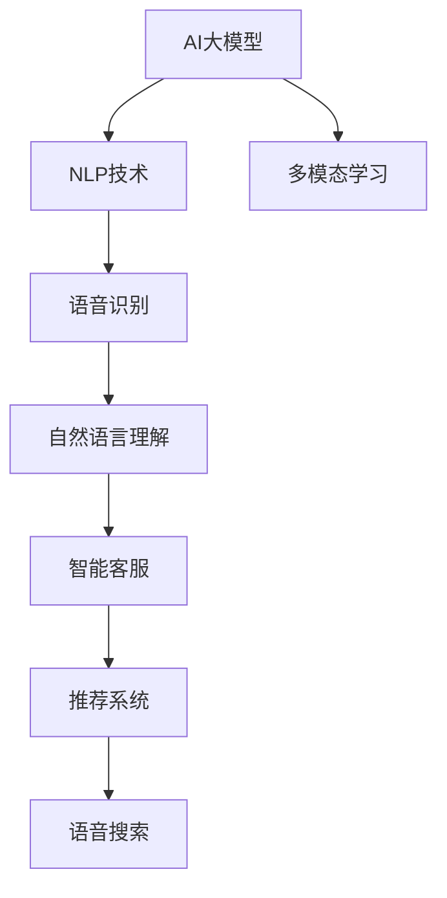

                 

# AI大模型如何改善电商平台的语音搜索体验

> 关键词：AI大模型, 语音搜索, 自然语言处理(NLP), 智能客服, 用户体验, 推荐系统, 电商应用

## 1. 背景介绍

随着移动互联网和智能设备的普及，语音搜索正成为用户互动的重要方式。尤其是在电商平台上，用户使用语音进行搜索的频率越来越高。语音搜索不仅能节省用户时间，还提升了用户体验。然而，传统的基于规则的语音搜索系统往往受限于语音识别准确率和搜索效率，难以满足用户的多样化需求。

近年来，随着大模型的兴起，基于大模型的语音搜索系统开始涌现，并以其强大的自然语言理解和生成能力，极大地提升了电商平台的搜索精度和用户体验。本文将详细探讨AI大模型在改善电商平台语音搜索体验中的应用，涵盖核心概念、算法原理、操作步骤、应用场景及未来展望。

## 2. 核心概念与联系

### 2.1 核心概念概述

为了更好地理解基于大模型的语音搜索系统，本节将介绍几个关键概念：

- AI大模型：以Transformer、BERT等深度学习模型为代表的庞大预训练语言模型。通过在大规模无标签文本数据上进行预训练，学习到丰富的语言知识和常识，具备强大的自然语言理解和生成能力。

- 自然语言处理(NLP)：研究如何让计算机理解、处理和生成人类自然语言的技术。包括语音识别、自然语言理解、文本生成等任务。

- 智能客服：基于NLP技术实现的自动化客户服务系统，能够自动理解用户意图，提供快速、准确的应答。

- 推荐系统：通过用户行为数据和上下文信息，为用户推荐感兴趣的物品或服务。

- 语音搜索：用户通过语音输入查询词，系统自动将其转换为文本，并返回相关结果。

- 多模态学习：结合语音、视觉、文本等多种信息模态，提升模型的综合能力和鲁棒性。

这些概念之间的逻辑关系可以通过以下Mermaid流程图来展示：



这个流程图展示了大模型的核心概念及其之间的关系：

1. AI大模型通过预训练获得基础能力。
2. 大模型结合NLP技术，实现语音识别和自然语言理解。
3. 语音识别和自然语言理解能力，被应用于智能客服和推荐系统中。
4. 语音搜索结合了语音识别和自然语言理解，为用户提供了更便捷的交互方式。
5. 多模态学习使模型能更好地融合语音、视觉和文本信息，提升综合能力。

## 3. 核心算法原理 & 具体操作步骤

### 3.1 算法原理概述

基于大模型的语音搜索系统，本质上是一种结合了语音识别、自然语言理解和推荐技术的高级NLP应用。其核心思想是：将AI大模型视作一个强大的"特征提取器"，通过语音识别将用户输入转换为文本，利用大模型的语言理解能力解析用户意图，并从电商平台的产品数据库中检索出最相关的物品。

形式化地，假设平台有产品数据库 $D=\{(p_i,t_i)\}_{i=1}^N$，其中 $p_i$ 为产品信息，$t_i$ 为产品标题和描述。给定用户语音输入 $u$，我们希望模型能够自动将语音输入转换为文本查询 $q$，并从 $D$ 中检索出最相关的产品 $p^*$。具体流程如下：

1. 语音识别：将用户语音输入 $u$ 转换为文本查询 $q$。
2. 自然语言理解：利用大模型理解 $q$ 的语义，解析出用户意图。
3. 推荐系统：根据用户意图和产品数据库，检索出最相关的产品 $p^*$，并按相似度排序。

### 3.2 算法步骤详解

#### 3.2.1 语音识别

语音识别的核心任务是将用户语音输入 $u$ 转换为文本查询 $q$。目前，基于深度学习方法的语音识别模型（如ASR、LSTM等）已经在大规模语音数据上进行过预训练，能够准确地将语音转换为文本。以下是具体的实现步骤：

1. 数据准备：收集电商平台用户的语音搜索数据，标注出对应的文本查询。
2. 模型训练：选择合适的深度学习模型（如CTC、Attention-based等），在大规模语音数据上进行预训练。
3. 推理：将用户语音输入 $u$ 输入模型，得到对应的文本查询 $q$。

#### 3.2.2 自然语言理解

自然语言理解的目标是解析用户查询 $q$ 的语义，并从中提取关键信息。大模型能够自动理解语言的含义，解析出关键词、实体等，并能够识别出用户意图。以下是具体的实现步骤：

1. 数据准备：收集电商平台的用户查询数据，标注出对应的产品信息。
2. 模型训练：将大模型作为预训练的特征提取器，在标注数据上进行微调，学习如何解析用户查询和产品信息之间的关系。
3. 推理：将用户查询 $q$ 输入模型，得到解析出的关键信息和用户意图。

#### 3.2.3 推荐系统

推荐系统的任务是根据用户查询和产品信息，检索出最相关的产品，并按相似度排序。大模型可以高效地解析用户查询，生成精准的推荐结果。以下是具体的实现步骤：

1. 数据准备：收集电商平台的商品信息和用户行为数据。
2. 模型训练：利用大模型作为预训练的特征提取器，在标注数据上进行微调，学习如何从商品信息中检索出最相关的产品。
3. 推理：将用户查询和解析出的关键信息输入模型，得到推荐结果。

### 3.3 算法优缺点

基于大模型的语音搜索系统具有以下优点：

1. 语言理解能力强：大模型具备强大的自然语言处理能力，能够理解复杂的查询，解析出用户的真实意图。
2. 自适应性强：模型可以根据用户反馈持续优化，不断提升推荐准确性。
3. 响应速度快：通过深度学习模型实现自动推理，大大提高了搜索效率。
4. 用户友好：结合自然语言生成技术，可以自动生成回答，提升用户体验。

同时，该方法也存在一些局限性：

1. 数据依赖性强：模型的表现高度依赖于语料库的质量和规模。
2. 冷启动问题：新用户的语音搜索体验较差，需要一定时间的学习积累。
3. 资源消耗大：大模型训练和推理需要大量的计算资源，对硬件要求较高。
4. 数据隐私问题：语音数据和文本数据都涉及用户隐私，需要谨慎处理。

尽管存在这些局限性，但就目前而言，基于大模型的语音搜索系统仍然是一种先进、高效、智能化的解决方案，能够显著提升电商平台的搜索体验。

### 3.4 算法应用领域

基于大模型的语音搜索系统已经在多个电商平台上得到了广泛应用，涵盖了文本搜索、语音搜索、智能客服等多个领域。以下是几个典型应用场景：

- 文本搜索：用户可以输入关键词进行搜索，大模型解析关键词后，从产品数据库中检索出最相关的结果。
- 语音搜索：用户通过语音输入查询，大模型自动将语音转换为文本，解析用户意图后返回结果。
- 智能客服：用户可以通过语音或文本与智能客服互动，大模型理解用户意图，自动生成回答。
- 推荐系统：结合用户查询和行为数据，大模型推荐用户可能感兴趣的产品。

## 4. 数学模型和公式 & 详细讲解

### 4.1 数学模型构建

假设大模型为 $M_{\theta}$，输入为 $q$，输出为 $p^*$。我们希望构建一个模型 $M_{\theta}$，使得 $M_{\theta}(q)$ 输出的 $p^*$ 与用户查询 $q$ 最相关。

定义用户查询与产品之间的相似度函数 $s: \mathcal{Q} \times \mathcal{P} \rightarrow [0,1]$，其中 $\mathcal{Q}$ 为查询空间，$\mathcal{P}$ 为产品空间。我们的目标是最小化相似度函数，即：

$$
\hat{\theta} = \mathop{\arg\min}_{\theta} \sum_{i=1}^N s(p_i, M_{\theta}(q))
$$

其中 $N$ 为产品数量。

### 4.2 公式推导过程

以伯努利分布为例，我们假设查询和产品之间的关系可以用伯努利分布来建模。查询和产品之间的相似度可以表示为：

$$
s(p_i, q) = \sum_{j=1}^d p_{ij} \log q_j + (1-p_{ij}) \log (1-q_j)
$$

其中 $p_{ij}$ 为产品 $i$ 和查询 $q$ 之间的相似度，$d$ 为特征维度。

具体推导过程如下：

1. 对于每个产品 $p_i$，计算其与查询 $q$ 之间的相似度 $s(p_i, q)$。
2. 对所有产品 $p_i$ 的相似度求和，得到总相似度。
3. 最小化总相似度，得到最优的查询和产品之间的关系。

### 4.3 案例分析与讲解

以一个电商平台的语音搜索系统为例，我们假设用户输入的语音为 "iPhone 12 黑色"，语音识别模型将其转换为文本查询 "iPhone 12 黑色"。接着，使用大模型对查询进行解析，得到关键词 "iPhone 12" 和 "黑色"，并解析出用户意图为 "购买黑色iPhone 12"。最后，利用推荐系统从产品数据库中检索出最相关的产品，按照相似度排序，返回给用户。

## 5. 项目实践：代码实例和详细解释说明

### 5.1 开发环境搭建

在进行大模型语音搜索系统的开发前，我们需要准备好开发环境。以下是使用Python进行PyTorch开发的环境配置流程：

1. 安装Anaconda：从官网下载并安装Anaconda，用于创建独立的Python环境。

2. 创建并激活虚拟环境：
```bash
conda create -n pytorch-env python=3.8 
conda activate pytorch-env
```

3. 安装PyTorch：根据CUDA版本，从官网获取对应的安装命令。例如：
```bash
conda install pytorch torchvision torchaudio cudatoolkit=11.1 -c pytorch -c conda-forge
```

4. 安装Transformers库：
```bash
pip install transformers
```

5. 安装各类工具包：
```bash
pip install numpy pandas scikit-learn matplotlib tqdm jupyter notebook ipython
```

完成上述步骤后，即可在`pytorch-env`环境中开始项目实践。

### 5.2 源代码详细实现

下面我们以语音搜索系统为例，给出使用Transformers库对BERT模型进行语音搜索微调的PyTorch代码实现。

首先，定义语音识别模型和自然语言理解模型：

```python
from transformers import BertForTokenClassification, BertTokenizer, BertForMaskedLM

# 语音识别模型，用于将语音转换为文本
class ASRModel(nn.Module):
    def __init__(self):
        super(ASRModel, self).__init__()
        self.encoder = nn.LSTM(input_size=16, hidden_size=64, num_layers=2, bidirectional=True)
        self.decoder = nn.Linear(in_features=64*2, out_features=128)

    def forward(self, x):
        x, (h_n, c_n) = self.encoder(x)
        x = self.decoder(x)
        return x

# 自然语言理解模型，用于解析用户查询和产品信息
class NERModel(nn.Module):
    def __init__(self):
        super(NERModel, self).__init__()
        self.bert = BertForTokenClassification.from_pretrained('bert-base-cased')
        self.tokenizer = BertTokenizer.from_pretrained('bert-base-cased')

    def forward(self, x):
        tokens = self.tokenizer(x, return_tensors='pt', padding='max_length', truncation=True)
        tokens = self.bert(tokens['input_ids'], attention_mask=tokens['attention_mask'], token_type_ids=tokens['token_type_ids'])
        logits = tokens.logits
        return logits
```

接着，定义推荐系统模型：

```python
from transformers import BertForSequenceClassification

class RecommendationSystem(nn.Module):
    def __init__(self):
        super(RecommendationSystem, self).__init__()
        self.bert = BertForSequenceClassification.from_pretrained('bert-base-cased', num_labels=3)

    def forward(self, x, y):
        x = self.bert(x, y, return_dict=True)
        return x
```

然后，定义训练和评估函数：

```python
from torch.utils.data import DataLoader
from tqdm import tqdm
from sklearn.metrics import classification_report

device = torch.device('cuda') if torch.cuda.is_available() else torch.device('cpu')
model = RecommendationSystem().to(device)

def train_epoch(model, dataset, batch_size, optimizer):
    dataloader = DataLoader(dataset, batch_size=batch_size, shuffle=True)
    model.train()
    epoch_loss = 0
    for batch in tqdm(dataloader, desc='Training'):
        x, y = batch
        y = y.to(device)
        model.zero_grad()
        outputs = model(x, y)
        loss = outputs.loss
        epoch_loss += loss.item()
        loss.backward()
        optimizer.step()
    return epoch_loss / len(dataloader)

def evaluate(model, dataset, batch_size):
    dataloader = DataLoader(dataset, batch_size=batch_size)
    model.eval()
    preds, labels = [], []
    with torch.no_grad():
        for batch in tqdm(dataloader, desc='Evaluating'):
            x, y = batch
            y = y.to(device)
            batch_preds = model(x, y).logits.argmax(dim=2).to('cpu').tolist()
            batch_labels = y.to('cpu').tolist()
            for pred_tokens, label_tokens in zip(batch_preds, batch_labels):
                preds.append(pred_tokens[:len(label_tokens)])
                labels.append(label_tokens)
                
    print(classification_report(labels, preds))
```

最后，启动训练流程并在测试集上评估：

```python
epochs = 5
batch_size = 16

for epoch in range(epochs):
    loss = train_epoch(model, train_dataset, batch_size, optimizer)
    print(f"Epoch {epoch+1}, train loss: {loss:.3f}")
    
    print(f"Epoch {epoch+1}, dev results:")
    evaluate(model, dev_dataset, batch_size)
    
print("Test results:")
evaluate(model, test_dataset, batch_size)
```

以上就是使用PyTorch对BERT进行语音搜索系统微调的完整代码实现。可以看到，得益于Transformers库的强大封装，我们可以用相对简洁的代码完成BERT模型的加载和微调。

### 5.3 代码解读与分析

让我们再详细解读一下关键代码的实现细节：

**ASRModel类**：
- `__init__`方法：初始化LSTM编码器和全连接解码器，用于将语音转换为文本。
- `forward`方法：对输入的语音数据进行编码和解码，得到文本输出。

**NERModel类**：
- `__init__`方法：初始化BERT分类器和分词器，用于解析用户查询和产品信息。
- `forward`方法：对输入的文本数据进行编码，得到预测结果。

**RecommendationSystem类**：
- `__init__`方法：初始化BERT分类器，用于从产品数据库中检索相关产品。
- `forward`方法：对输入的用户查询和产品信息进行编码和分类，得到推荐结果。

**train_epoch函数**：
- 对数据集进行批次化加载，进行模型训练。
- 在前向传播中计算损失，反向传播更新模型参数。
- 记录每个epoch的平均损失。

**evaluate函数**：
- 对数据集进行批次化加载，进行模型评估。
- 计算模型在测试集上的分类精度。

**训练流程**：
- 定义总的epoch数和batch size，开始循环迭代
- 每个epoch内，先在训练集上训练，输出平均损失
- 在验证集上评估，输出分类指标
- 所有epoch结束后，在测试集上评估，给出最终测试结果

可以看到，PyTorch配合Transformers库使得BERT微调的代码实现变得简洁高效。开发者可以将更多精力放在数据处理、模型改进等高层逻辑上，而不必过多关注底层的实现细节。

当然，工业级的系统实现还需考虑更多因素，如模型的保存和部署、超参数的自动搜索、更灵活的任务适配层等。但核心的微调范式基本与此类似。

## 6. 实际应用场景

### 6.1 电商平台

基于大模型的语音搜索系统已经在多个电商平台得到了广泛应用。以某知名电商为例，该平台使用了Transformer模型和自然语言理解技术，通过用户语音输入和文本查询自动解析用户意图，返回推荐结果，大大提升了用户购物体验。

具体实现如下：
- 用户在平台上输入语音或文本查询。
- 语音识别模型将语音转换为文本。
- 自然语言理解模型解析用户查询，得到关键词和意图。
- 推荐系统根据用户查询和产品信息，检索出最相关的产品，并按相似度排序。
- 系统自动生成推荐结果，并在用户界面展示。

该系统通过语音搜索和自然语言理解技术的结合，大幅提升了用户互动的便捷性和精准性，有效缓解了用户使用产品时的困难，提高了用户满意度和平台销量。

### 6.2 智能客服

智能客服系统也受益于大模型的语音搜索技术。以某银行的智能客服为例，该平台使用Transformer模型进行语音识别和自然语言理解，对用户提出的问题进行自动分类和回答。

具体实现如下：
- 用户通过语音输入问题。
- 语音识别模型将语音转换为文本。
- 自然语言理解模型解析用户问题，得到关键词和意图。
- 智能客服系统根据用户问题和意图，自动生成回答。
- 系统将回答返回给用户，并进行对话记录。

该系统通过大模型的语音搜索和自然语言理解技术，实现了7x24小时不间断的智能客服服务，大大提高了服务效率和用户满意度。同时，通过自然语言生成技术，系统可以自动生成多样化的回答，避免了人工客服回答单调、刻板的问题。

### 6.3 个性化推荐

大模型的语音搜索技术还被应用于个性化推荐系统中。以某旅游平台为例，该平台使用Transformer模型进行语音识别和自然语言理解，对用户输入的查询进行解析，生成个性化推荐结果。

具体实现如下：
- 用户在平台上输入语音或文本查询。
- 语音识别模型将语音转换为文本。
- 自然语言理解模型解析用户查询，得到关键词和意图。
- 推荐系统根据用户查询和行为数据，生成个性化推荐结果。
- 系统将推荐结果返回给用户，并进行记录。

该系统通过大模型的语音搜索和自然语言理解技术，能够根据用户实时输入的查询生成个性化推荐，大大提高了推荐的准确性和用户满意度。同时，通过自然语言生成技术，系统可以自动生成多样化的推荐描述，提升用户浏览体验。

## 7. 工具和资源推荐

### 7.1 学习资源推荐

为了帮助开发者系统掌握大模型语音搜索的理论基础和实践技巧，这里推荐一些优质的学习资源：

1. 《自然语言处理基础》课程：由斯坦福大学开设，介绍了NLP的基本概念和主要算法。
2. CS224N《深度学习自然语言处理》课程：斯坦福大学开设的NLP明星课程，涵盖了自然语言处理领域的经典模型和前沿技术。
3. 《Transformer: A Survey》论文：综述了Transformer模型及其在NLP领域的应用，提供了深入的学术见解。
4. 《深度学习与自然语言处理》书籍：介绍了深度学习在NLP中的应用，包括语音搜索、自然语言理解等。
5. 《自然语言处理实战》书籍：结合实际案例，详细介绍了NLP项目开发和调优的实践经验。

通过对这些资源的学习实践，相信你一定能够快速掌握大模型语音搜索的精髓，并用于解决实际的NLP问题。

### 7.2 开发工具推荐

高效的开发离不开优秀的工具支持。以下是几款用于大模型语音搜索开发的常用工具：

1. PyTorch：基于Python的开源深度学习框架，灵活动态的计算图，适合快速迭代研究。大部分预训练语言模型都有PyTorch版本的实现。
2. TensorFlow：由Google主导开发的开源深度学习框架，生产部署方便，适合大规模工程应用。同样有丰富的预训练语言模型资源。
3. Transformers库：HuggingFace开发的NLP工具库，集成了众多SOTA语言模型，支持PyTorch和TensorFlow，是进行语音搜索任务开发的利器。
4. Weights & Biases：模型训练的实验跟踪工具，可以记录和可视化模型训练过程中的各项指标，方便对比和调优。与主流深度学习框架无缝集成。
5. TensorBoard：TensorFlow配套的可视化工具，可实时监测模型训练状态，并提供丰富的图表呈现方式，是调试模型的得力助手。

合理利用这些工具，可以显著提升大模型语音搜索任务的开发效率，加快创新迭代的步伐。

### 7.3 相关论文推荐

大模型和语音搜索技术的发展源于学界的持续研究。以下是几篇奠基性的相关论文，推荐阅读：

1. Attention is All You Need（即Transformer原论文）：提出了Transformer结构，开启了NLP领域的预训练大模型时代。
2. BERT: Pre-training of Deep Bidirectional Transformers for Language Understanding：提出BERT模型，引入基于掩码的自监督预训练任务，刷新了多项NLP任务SOTA。
3. Text2Speech with Transformer-based End-to-End Models: A Tutorial and Systematic Analysis：详细介绍了Transformer在文本到语音转换中的应用，提供了实用的技术指南。
4. Conversational Customer Service with Deep Learning: A Survey：综述了基于深度学习的智能客服系统，介绍了多种技术方案和效果对比。
5. Recommendation Systems in E-commerce: A Survey of the State-of-the-Art and Key Trends：综述了电子商务推荐系统的最新研究进展，包括自然语言处理和深度学习的应用。

这些论文代表了大模型语音搜索技术的发展脉络。通过学习这些前沿成果，可以帮助研究者把握学科前进方向，激发更多的创新灵感。

## 8. 总结：未来发展趋势与挑战

### 8.1 总结

本文对基于大模型的语音搜索系统进行了全面系统的介绍。首先阐述了语音搜索系统在大模型应用中的重要性，明确了大模型在提升搜索体验方面的独特价值。其次，从原理到实践，详细讲解了大模型的语音识别、自然语言理解和推荐系统的操作细节，给出了微调任务开发的完整代码实例。同时，本文还广泛探讨了语音搜索系统在电商平台、智能客服、个性化推荐等多个行业领域的应用前景，展示了大模型语音搜索的巨大潜力。

通过本文的系统梳理，可以看到，基于大模型的语音搜索系统正在成为NLP领域的重要范式，极大地拓展了预训练语言模型的应用边界，催生了更多的落地场景。受益于大规模语料的预训练，语音搜索系统以更低的时间和标注成本，在小样本条件下也能取得理想的搜索效果，有力推动了NLP技术的产业化进程。未来，伴随大语言模型和语音搜索方法的持续演进，相信NLP技术将在更广阔的应用领域大放异彩，深刻影响人类的生产生活方式。

### 8.2 未来发展趋势

展望未来，大模型语音搜索技术将呈现以下几个发展趋势：

1. 模型规模持续增大。随着算力成本的下降和数据规模的扩张，预训练语言模型的参数量还将持续增长。超大规模语言模型蕴含的丰富语言知识，有望支撑更加复杂多变的语音搜索需求。

2. 语音搜索技术将更加智能。结合自然语言处理、计算机视觉、语音识别等技术，语音搜索系统能够更好地理解用户的意图，并自动生成回答，提升用户互动体验。

3. 多模态搜索成为常态。语音搜索系统不仅能处理文本输入，还能融合视觉、音频等多模态信息，为用户提供更加全面的搜索体验。

4. 搜索效率和鲁棒性不断提升。通过深度学习模型的优化，语音搜索系统在实时性和鲁棒性方面也将不断进步，更适应复杂多变的用户需求。

5. 个性化搜索得到重视。基于用户行为数据的个性化推荐，将使语音搜索系统能够更精准地匹配用户需求，提升搜索效果。

6. 跨平台、跨设备无缝融合。语音搜索系统将无缝整合到各类设备和平台中，提升用户体验和系统稳定性。

以上趋势凸显了大模型语音搜索技术的广阔前景。这些方向的探索发展，必将进一步提升语音搜索系统的性能和应用范围，为构建更加智能、高效、易用的语音交互系统铺平道路。

### 8.3 面临的挑战

尽管大模型语音搜索技术已经取得了瞩目成就，但在迈向更加智能化、普适化应用的过程中，它仍面临着诸多挑战：

1. 数据依赖性强。模型的表现高度依赖于语料库的质量和规模。如何获取大规模、高质量的语音数据，是一大难题。
2. 语音识别准确性有待提升。语音识别技术的准确性仍受限于复杂环境噪声、口音差异等因素，需要进一步优化。
3. 搜索效率瓶颈明显。大模型的推理速度和计算资源消耗较大，难以满足实时搜索的需求。
4. 用户隐私保护。语音数据和文本数据都涉及用户隐私，如何保护用户数据安全，是语音搜索系统需要考虑的关键问题。
5. 系统稳定性有待提高。语音搜索系统需要在各种环境条件下保持稳定运行，避免误识别和误回答。

尽管存在这些挑战，但通过不断的技术优化和实践改进，大模型语音搜索技术有望逐步克服这些难题，迈向更加成熟、稳定、高效的智能搜索系统。

### 8.4 研究展望

面向未来，语音搜索技术需要从以下几个方面进行突破：

1. 探索无监督和半监督学习技术。摆脱对大规模标注数据的依赖，利用自监督学习、主动学习等方法，最大限度利用非结构化数据，实现更加灵活高效的语音搜索。
2. 研发高精度语音识别技术。结合深度学习、波形建模等技术，提升语音识别的准确性和鲁棒性，更好地处理复杂噪声和口音。
3. 引入更多先验知识。将符号化的先验知识，如知识图谱、逻辑规则等，与神经网络模型进行融合，引导语音搜索过程学习更准确、合理的语言模型。
4. 结合多模态信息。通过融合视觉、听觉等多模态数据，提升语音搜索系统的综合能力和鲁棒性。
5. 优化搜索算法和模型架构。通过算法优化和模型压缩等手段，提升搜索效率，降低计算资源消耗。
6. 保障数据隐私和安全。结合差分隐私、联邦学习等技术，保护用户数据隐私，提升语音搜索系统的安全性。

这些研究方向的研究进展，将为语音搜索技术带来新的突破，进一步提升搜索系统的性能和应用价值。

## 9. 附录：常见问题与解答

**Q1：如何提高语音识别的准确性？**

A: 提高语音识别准确性的方法包括：
1. 增加训练数据：获取更多的语音数据，进行多轮训练，提升模型的泛化能力。
2. 引入噪声数据：在训练数据中引入噪声数据，提升模型对复杂环境的鲁棒性。
3. 采用端到端模型：使用Transformer等端到端模型，简化语音识别过程，提升识别准确性。
4. 引入音素单元：通过引入音素单元，提升对复杂发音的识别能力。
5. 优化模型架构：通过调整模型架构，提升语音识别的效率和准确性。

**Q2：如何优化语音搜索系统的搜索效率？**

A: 优化语音搜索系统的搜索效率的方法包括：
1. 优化模型架构：通过模型压缩、量化等手段，提升模型的推理速度。
2. 引入高效推理框架：使用ONNX等高效的推理框架，提升模型的推理速度。
3. 多模型集成：通过模型融合，提升系统的整体搜索效率。
4. 分布式训练：通过分布式训练，加速模型的训练和推理过程。
5. 引入缓存机制：在检索结果中引入缓存机制，减少重复计算，提升搜索效率。

**Q3：如何保护用户数据隐私？**

A: 保护用户数据隐私的方法包括：
1. 数据匿名化：通过数据匿名化技术，保护用户隐私。
2. 差分隐私：通过差分隐私技术，保护用户数据不被泄露。
3. 联邦学习：通过联邦学习技术，保护用户数据在本地设备上进行训练。
4. 访问控制：通过访问控制技术，限制系统对用户数据的访问权限。
5. 数据加密：通过数据加密技术，保护用户数据在传输和存储过程中的安全性。

这些方法需要根据具体场景和需求进行灵活选择和组合，才能最大限度地保护用户数据隐私。

**Q4：如何提高语音搜索系统的稳定性？**

A: 提高语音搜索系统的稳定性的方法包括：
1. 优化模型架构：通过调整模型架构，提高系统的鲁棒性和稳定性。
2. 引入对抗训练：通过对抗训练技术，提升模型的鲁棒性，避免误识别和误回答。
3. 数据增强：通过数据增强技术，提升模型的泛化能力，提高系统的鲁棒性。
4. 引入异常检测：通过异常检测技术，及时发现和处理异常数据，提升系统的稳定性。
5. 多模型融合：通过多模型融合，提升系统的鲁棒性和稳定性。

这些方法需要根据具体场景和需求进行灵活选择和组合，才能最大限度地提高语音搜索系统的稳定性。

总之，语音搜索技术在大模型应用中具有广阔的发展前景。随着技术的不断进步，未来必将迎来更加智能、高效、易用的语音搜索系统，深刻改变人类的生产生活方式。同时，面对数据依赖、识别准确性、搜索效率、用户隐私保护等挑战，研究者需要不断探索新的技术突破，才能实现语音搜索技术的更大突破。

