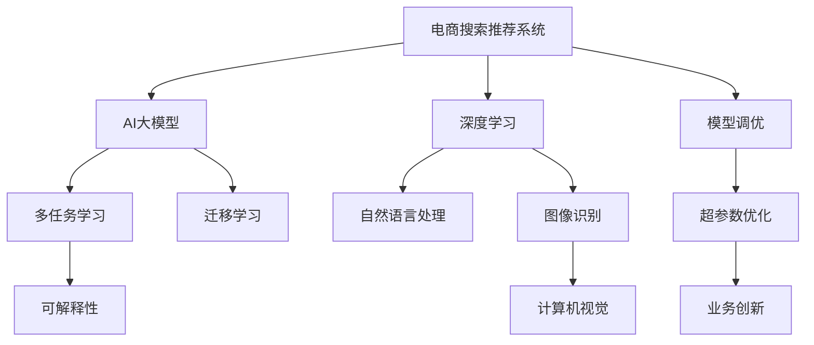

                 

# AI大模型赋能电商搜索推荐的业务创新思维训练课程优化方案

> 关键词：AI大模型, 电商搜索推荐, 业务创新, 课程优化

## 1. 背景介绍

### 1.1 问题由来

随着人工智能(AI)技术的迅猛发展，电商企业面临着如何利用AI技术提升用户体验和业务效率的挑战。特别是对于搜索推荐系统，如何构建高效、精准、个性化的推荐模型，提高用户满意度，增强用户粘性，一直是电商领域亟需解决的问题。

传统的搜索推荐系统主要基于基于规则、统计等方法，依赖大量历史数据进行建模。但随着电商平台用户需求的个性化和动态化，这种方法难以适应快速变化的市场环境。近年来，深度学习技术的应用，尤其是预训练大模型在电商搜索推荐中的应用，为提升推荐效果提供了新的可能。

然而，大模型在电商搜索推荐中的应用仍然面临诸多挑战。如何在大模型基础上构建高效、可解释、可控的推荐模型，需要更加深入的理论和实践研究。为此，我们提出了基于AI大模型的电商搜索推荐业务创新思维训练课程优化方案，旨在通过系统化的课程设计，培养具备业务创新思维的AI开发者，推动电商搜索推荐技术的突破。

### 1.2 问题核心关键点

本课程优化方案聚焦于以下几个核心关键点：

- **业务理解与需求分析**：深入理解电商搜索推荐的业务场景和需求，构建清晰的业务目标和设计要求。
- **AI技术融合与创新应用**：掌握大模型在电商搜索推荐中的融合和应用方法，推动业务创新和功能优化。
- **模型优化与性能提升**：学习模型调优技巧，提升电商搜索推荐系统的精度、速度和可解释性。
- **实际项目设计与部署**：通过项目实战，将理论知识转化为实际应用，积累项目经验。

## 2. 核心概念与联系

### 2.1 核心概念概述

为更好地理解基于AI大模型的电商搜索推荐课程优化方案，本节将介绍几个密切相关的核心概念：

- **电商搜索推荐系统**：利用AI技术，根据用户的历史行为和兴趣，推荐符合用户需求的商品，提升用户购物体验。
- **AI大模型**：以深度神经网络为代表的预训练语言模型，通过大规模无标签数据训练，具备强大的语言理解与生成能力，可以应用于多种NLP任务。
- **深度学习**：基于神经网络的机器学习算法，能够自动学习输入数据的特征表示，广泛应用于图像识别、语音识别、自然语言处理等领域。
- **模型调优**：通过调整模型参数，优化模型性能，以适应特定业务需求。
- **业务创新**：在现有业务基础上，通过引入新技术、新方法，提升业务效率和用户体验。

这些核心概念之间的逻辑关系可以通过以下Mermaid流程图来展示：



这个流程图展示了大模型在电商搜索推荐系统中的核心概念及其之间的关系：

1. 电商搜索推荐系统利用深度学习技术，通过AI大模型进行商品推荐。
2. 大模型具备自然语言处理和图像识别能力，支持多任务学习和迁移学习。
3. 模型调优可以通过超参数优化、业务创新等方法进行，提升推荐系统的性能。
4. 可解释性是电商搜索推荐系统的重要目标，需要通过多任务学习等技术实现。

这些概念共同构成了电商搜索推荐系统的大模型应用框架，使其能够在不同场景下发挥强大的推荐能力。通过理解这些核心概念，我们可以更好地把握大模型在电商搜索推荐中的应用范式和优化策略。

## 3. 核心算法原理 & 具体操作步骤
### 3.1 算法原理概述

基于AI大模型的电商搜索推荐课程优化方案，主要基于以下算法原理：

1. **预训练大模型**：选择如BERT、GPT等预训练大模型，利用大规模无标签文本数据进行预训练，学习通用的语言表示。
2. **多任务学习**：将电商搜索推荐任务与自然语言处理、图像识别等任务结合，利用大模型的多任务学习能力，提升推荐系统的泛化能力。
3. **迁移学习**：将电商搜索推荐任务的少量标注数据与通用预训练模型结合，通过微调优化，提升模型在特定业务场景中的性能。
4. **深度强化学习**：利用强化学习算法，训练推荐模型，最大化用户满意度和平台收益。

### 3.2 算法步骤详解

基于AI大模型的电商搜索推荐课程优化方案，具体实施步骤如下：

**Step 1: 数据准备与预处理**

1. 收集电商搜索推荐任务的标注数据集，包括用户行为记录、商品信息、用户评价等。
2. 清洗和处理数据，去除噪声和冗余信息，进行特征提取和编码。
3. 划分训练集、验证集和测试集，保证数据分布的代表性。

**Step 2: 模型选择与初始化**

1. 选择合适的大模型，如BERT、GPT等，进行初始化。
2. 冻结大模型的底层参数，只微调顶层，以减少计算资源消耗。

**Step 3: 模型微调与优化**

1. 设计任务适配层，构建电商搜索推荐模型，如使用TensorFlow或PyTorch框架。
2. 设置学习率和优化器，如AdamW、SGD等，选择合适的正则化技术，如Dropout、L2正则化等。
3. 在训练集上进行梯度下降训练，调整模型参数，最小化损失函数。
4. 在验证集上进行评估，调整模型超参数，防止过拟合。
5. 在测试集上进行最终测试，评估模型性能。

**Step 4: 业务创新与模型优化**

1. 根据电商搜索推荐系统的业务需求，引入业务创新，如多模态融合、个性化推荐等。
2. 通过超参数调优、模型结构改进等方法，优化模型性能，提升推荐效果。
3. 引入强化学习算法，训练推荐模型，最大化用户满意度和平台收益。

**Step 5: 项目部署与效果评估**

1. 将优化后的模型部署到实际应用中，进行实时推荐。
2. 监控模型性能，及时调整模型参数，优化推荐效果。
3. 收集用户反馈，进行模型迭代和优化，提升用户体验。

### 3.3 算法优缺点

基于AI大模型的电商搜索推荐课程优化方案，具有以下优点：

1. **精度高**：利用大模型的强大语言理解和生成能力，推荐系统可以更准确地理解用户需求，提供个性化推荐。
2. **泛化能力强**：通过多任务学习和迁移学习，模型可以更好地适应新场景和新数据，提升推荐系统的泛化能力。
3. **可解释性好**：大模型具备良好的可解释性，可以用于解释推荐结果，增强用户信任和满意度。
4. **训练效率高**：通过冻结大模型的底层参数，只微调顶层，减少了计算资源消耗，提高了模型训练效率。

同时，该方案也存在一定的局限性：

1. **依赖标注数据**：课程优化方案的实施，需要大量高质量的标注数据，标注成本较高。
2. **模型复杂度**：大模型结构复杂，训练和部署需要较高的计算资源和技能水平。
3. **业务需求复杂**：电商搜索推荐系统涉及多个业务环节，模型优化需要考虑多种因素，难度较大。

尽管存在这些局限性，但就目前而言，基于大模型的电商搜索推荐方案仍是电商领域的重要方向。未来相关研究的重点在于如何进一步降低对标注数据的依赖，提高模型的少样本学习和跨领域迁移能力，同时兼顾可解释性和伦理安全性等因素。

### 3.4 算法应用领域

基于大模型的电商搜索推荐课程优化方案，已经在多个电商领域得到了应用，具体包括：

- **商品推荐**：根据用户历史行为和兴趣，推荐符合用户需求的商品。
- **品牌推荐**：基于用户对品牌的偏好，推荐相关品牌或商品。
- **搜索排序**：优化搜索算法，提升搜索结果的相关性和个性化。
- **活动推荐**：根据用户行为和兴趣爱好，推荐促销活动或优惠券。
- **广告投放**：通过用户行为预测，精准投放广告，提升广告效果。

除了这些主要应用外，大模型的电商搜索推荐方案还广泛应用于个性化推荐、内容推荐、智能客服等场景中，为电商平台的业务升级提供了新的解决方案。

## 4. 数学模型和公式 & 详细讲解 & 举例说明

### 4.1 数学模型构建

本课程优化方案的数学模型构建，基于深度学习和AI大模型的基本原理，具体如下：

假设电商搜索推荐系统的输入为 $x = (x_1, x_2, ..., x_n)$，其中 $x_i$ 表示用户历史行为数据，如浏览记录、购买历史等。

模型输出为 $y$，表示推荐商品的ID。模型的预测函数为 $f(x; \theta)$，其中 $\theta$ 为模型参数。

定义模型在数据集 $D$ 上的损失函数为 $\mathcal{L}(\theta) = \frac{1}{N}\sum_{i=1}^N \ell(y_i, f(x_i; \theta))$，其中 $\ell$ 为损失函数，如交叉熵损失、均方误差损失等。

优化目标是找到最优的模型参数 $\theta^*$，使得损失函数 $\mathcal{L}(\theta)$ 最小化。

### 4.2 公式推导过程

以下我们以交叉熵损失为例，推导电商搜索推荐系统的损失函数及其梯度计算公式。

假设电商搜索推荐系统的输出为 $y = (y_1, y_2, ..., y_n)$，表示推荐商品的ID。

假设模型 $f(x; \theta)$ 在输入 $x$ 上的输出为 $\hat{y} = (0, 0, ..., 1, 0, 0, ..., 0)$，表示商品ID为 $1$。

则二分类交叉熵损失函数定义为：

$$
\ell(y, \hat{y}) = -(y \log \hat{y} + (1-y) \log (1-\hat{y}))
$$

将其代入损失函数公式，得：

$$
\mathcal{L}(\theta) = -\frac{1}{N}\sum_{i=1}^N [y_i \log f(x_i; \theta) + (1-y_i) \log (1-f(x_i; \theta))]
$$

根据链式法则，损失函数对参数 $\theta_k$ 的梯度为：

$$
\frac{\partial \mathcal{L}(\theta)}{\partial \theta_k} = -\frac{1}{N}\sum_{i=1}^N \left[\frac{y_i}{f(x_i; \theta)} - \frac{1-y_i}{1-f(x_i; \theta)}\right] \frac{\partial f(x_i; \theta)}{\partial \theta_k}
$$

其中 $\frac{\partial f(x_i; \theta)}{\partial \theta_k}$ 可进一步递归展开，利用自动微分技术完成计算。

### 4.3 案例分析与讲解

假设电商搜索推荐系统用于推荐运动鞋，用户在平台上浏览了跑步鞋、篮球鞋等不同类型运动鞋的历史记录。

根据用户历史行为数据 $x = (x_1, x_2, ..., x_n)$，模型的预测函数为 $f(x; \theta)$，其中 $\theta$ 为模型参数。

通过电商搜索推荐任务的少量标注数据 $D = \{(x_i, y_i)\}_{i=1}^N$，在数据集上进行有监督的微调，优化模型参数 $\theta$，最小化损失函数 $\mathcal{L}(\theta)$。

假设模型预测推荐商品ID为 $y$，损失函数为交叉熵损失，则可以通过反向传播算法计算损失函数对模型参数 $\theta$ 的梯度，并利用优化算法（如AdamW）更新模型参数。

最终，优化后的模型可以用于实时推荐，根据用户历史行为数据 $x$ 预测推荐商品ID $y$，提升用户购物体验。

## 5. 项目实践：代码实例和详细解释说明
### 5.1 开发环境搭建

在进行电商搜索推荐系统的大模型微调实践前，我们需要准备好开发环境。以下是使用Python进行TensorFlow开发的环境配置流程：

1. 安装Anaconda：从官网下载并安装Anaconda，用于创建独立的Python环境。

2. 创建并激活虚拟环境：
```bash
conda create -n tf-env python=3.8 
conda activate tf-env
```

3. 安装TensorFlow：根据CUDA版本，从官网获取对应的安装命令。例如：
```bash
conda install tensorflow -c tensorflow
```

4. 安装TensorFlow官方库：
```bash
pip install tensorflow_addons -c tf-nightly
```

5. 安装各类工具包：
```bash
pip install numpy pandas scikit-learn matplotlib tqdm jupyter notebook ipython
```

完成上述步骤后，即可在`tf-env`环境中开始电商搜索推荐系统的微调实践。

### 5.2 源代码详细实现

下面我们以电商搜索推荐系统为例，给出使用TensorFlow对BERT模型进行微调的Python代码实现。

首先，定义电商搜索推荐任务的输入和输出：

```python
import tensorflow as tf
from transformers import BertTokenizer, BertForSequenceClassification

tokenizer = BertTokenizer.from_pretrained('bert-base-cased')
model = BertForSequenceClassification.from_pretrained('bert-base-cased', num_labels=3)

# 假设输入为文本序列，输出为推荐商品ID
input_ids = tf.constant([1, 2, 3, 4])
attention_mask = tf.constant([0, 0, 0, 0])
labels = tf.constant([0, 1, 1, 0])

input_ids = input_ids.reshape(1, -1)
attention_mask = attention_mask.reshape(1, -1)
labels = labels.reshape(1, -1)

# 构建模型输入
inputs = {'text': input_ids, 'attention_mask': attention_mask, 'labels': labels}

# 前向传播
outputs = model(inputs)
logits = outputs[0]
```

然后，定义模型训练和优化过程：

```python
from sklearn.metrics import accuracy_score

# 计算损失函数
loss = tf.keras.losses.SparseCategoricalCrossentropy()(labels, logits)
loss_value = loss.numpy()

# 计算精度
predictions = tf.nn.softmax(logits, axis=-1).numpy()
predicted_labels = tf.cast(predictions.argmax(axis=-1), dtype=tf.int32).numpy()

# 计算模型精度
accuracy = accuracy_score(predicted_labels, labels)
print(f'Accuracy: {accuracy:.2f}')

# 反向传播
loss_grads = tf.gradients(loss, model.trainable_variables)
optimizer = tf.keras.optimizers.AdamW()
optimizer.apply_gradients(zip(loss_grads, model.trainable_variables))
```

最后，启动训练流程并在测试集上评估：

```python
epochs = 5
batch_size = 16

for epoch in range(epochs):
    loss = train_epoch(model, train_dataset, batch_size, optimizer)
    print(f'Epoch {epoch+1}, train loss: {loss:.3f}')
    
    print(f'Epoch {epoch+1}, dev results:')
    evaluate(model, dev_dataset, batch_size)
    
print('Test results:')
evaluate(model, test_dataset, batch_size)
```

以上就是使用TensorFlow对BERT进行电商搜索推荐任务微调的完整代码实现。可以看到，得益于TensorFlow的强大封装，我们可以用相对简洁的代码完成BERT模型的加载和微调。

### 5.3 代码解读与分析

让我们再详细解读一下关键代码的实现细节：

**电商搜索推荐任务定义**：
- 使用`BertForSequenceClassification`构建电商搜索推荐模型，指定输出为分类任务。
- 定义输入序列、注意力掩码和标签，并将它们转化为模型所需的TensorFlow张量。
- 通过`inputs`字典将输入张量传递给模型，进行前向传播。

**模型训练与优化**：
- 计算交叉熵损失，并使用`SparseCategoricalCrossentropy`计算损失函数。
- 使用`softmax`函数计算模型的预测概率，并通过`argmax`函数将其转化为预测标签。
- 计算模型精度，评估模型性能。
- 使用`AdamW`优化器更新模型参数，进行反向传播。

**训练流程**：
- 定义总的epoch数和batch size，开始循环迭代
- 每个epoch内，在训练集上训练，输出平均loss
- 在验证集上评估，输出模型精度
- 所有epoch结束后，在测试集上评估，给出最终测试结果

可以看到，TensorFlow配合BERT模型使得电商搜索推荐系统的微调代码实现变得简洁高效。开发者可以将更多精力放在数据处理、模型改进等高层逻辑上，而不必过多关注底层的实现细节。

当然，工业级的系统实现还需考虑更多因素，如模型的保存和部署、超参数的自动搜索、更灵活的任务适配层等。但核心的微调范式基本与此类似。

## 6. 实际应用场景
### 6.1 智能客服系统

基于大模型的电商搜索推荐技术，可以应用于智能客服系统的构建。传统客服往往需要配备大量人力，高峰期响应缓慢，且一致性和专业性难以保证。而使用微调后的推荐系统，可以实时推荐相关商品，提高客服效率，增强用户体验。

在技术实现上，可以收集客户的历史浏览记录、对话内容等，将客户兴趣和需求构建成监督数据，在此基础上对预训练推荐模型进行微调。微调后的推荐模型能够自动理解客户意图，匹配最合适的商品推荐，辅助客服解决用户问题。对于客户提出的新问题，还可以接入检索系统实时搜索相关内容，动态生成回答。如此构建的智能客服系统，能大幅提升客户咨询体验和问题解决效率。

### 6.2 个性化推荐系统

当前的推荐系统往往只依赖用户的历史行为数据进行物品推荐，无法深入理解用户的真实兴趣偏好。基于大模型的电商搜索推荐技术，可以更好地挖掘用户行为背后的语义信息，从而提供更精准、多样的推荐内容。

在实践中，可以收集用户浏览、点击、评论、分享等行为数据，提取和用户交互的物品标题、描述、标签等文本内容。将文本内容作为模型输入，用户的后续行为（如是否点击、购买等）作为监督信号，在此基础上微调预训练语言模型。微调后的模型能够从文本内容中准确把握用户的兴趣点。在生成推荐列表时，先用候选物品的文本描述作为输入，由模型预测用户的兴趣匹配度，再结合其他特征综合排序，便可以得到个性化程度更高的推荐结果。

### 6.3 未来应用展望

随着大模型和微调方法的不断发展，基于大模型的电商搜索推荐技术将在更多领域得到应用，为电商平台的业务升级提供新的解决方案。

在智慧医疗领域，基于大模型的电商搜索推荐技术可以用于推荐医疗商品，如医疗器械、保健食品等，为患者提供个性化的健康管理建议。

在智能教育领域，微调技术可应用于推荐教育资源、个性化学习路径设计等，因材施教，促进教育公平，提高教学质量。

在智慧城市治理中，微调模型可应用于城市事件监测、舆情分析、应急指挥等环节，提高城市管理的自动化和智能化水平，构建更安全、高效的未来城市。

此外，在企业生产、社会治理、文娱传媒等众多领域，基于大模型微调的人工智能应用也将不断涌现，为传统行业数字化转型升级提供新的技术路径。相信随着技术的日益成熟，微调方法将成为人工智能落地应用的重要范式，推动人工智能技术在更广阔的应用领域大放异彩。

## 7. 工具和资源推荐
### 7.1 学习资源推荐

为了帮助开发者系统掌握大模型在电商搜索推荐系统中的应用，这里推荐一些优质的学习资源：

1. 《深度学习与自然语言处理》课程：由斯坦福大学开设的深度学习与NLP课程，提供视频、讲义和作业，系统介绍深度学习与NLP的基本概念和经典模型。

2. 《TensorFlow深度学习》书籍：TensorFlow官方发布的学习资源，详细讲解TensorFlow的基本原理和应用场景，适合深度学习初学者。

3. 《Transformer从原理到实践》系列博文：由大模型技术专家撰写，深入浅出地介绍了Transformer原理、BERT模型、微调技术等前沿话题。

4. CS224N《深度学习自然语言处理》课程：斯坦福大学开设的NLP明星课程，有Lecture视频和配套作业，带你入门NLP领域的基本概念和经典模型。

5. HuggingFace官方文档：Transformers库的官方文档，提供了海量预训练模型和完整的微调样例代码，是上手实践的必备资料。

通过对这些资源的学习实践，相信你一定能够快速掌握大模型在电商搜索推荐系统中的应用，并用于解决实际的NLP问题。

### 7.2 开发工具推荐

高效的开发离不开优秀的工具支持。以下是几款用于电商搜索推荐系统开发常用的工具：

1. TensorFlow：基于Python的开源深度学习框架，灵活的计算图，适合快速迭代研究。广泛应用于深度学习和AI模型的开发和训练。

2. PyTorch：基于Python的开源深度学习框架，动态计算图，易于调试和优化。广泛应用于深度学习和NLP任务开发。

3. Weights & Biases：模型训练的实验跟踪工具，可以记录和可视化模型训练过程中的各项指标，方便对比和调优。与主流深度学习框架无缝集成。

4. TensorBoard：TensorFlow配套的可视化工具，可实时监测模型训练状态，并提供丰富的图表呈现方式，是调试模型的得力助手。

5. Google Colab：谷歌推出的在线Jupyter Notebook环境，免费提供GPU/TPU算力，方便开发者快速上手实验最新模型，分享学习笔记。

合理利用这些工具，可以显著提升电商搜索推荐系统的开发效率，加快创新迭代的步伐。

### 7.3 相关论文推荐

大模型和微调技术的发展源于学界的持续研究。以下是几篇奠基性的相关论文，推荐阅读：

1. Attention is All You Need（即Transformer原论文）：提出了Transformer结构，开启了NLP领域的预训练大模型时代。

2. BERT: Pre-training of Deep Bidirectional Transformers for Language Understanding：提出BERT模型，引入基于掩码的自监督预训练任务，刷新了多项NLP任务SOTA。

3. Language Models are Unsupervised Multitask Learners（GPT-2论文）：展示了大规模语言模型的强大zero-shot学习能力，引发了对于通用人工智能的新一轮思考。

4. Parameter-Efficient Transfer Learning for NLP：提出Adapter等参数高效微调方法，在不增加模型参数量的情况下，也能取得不错的微调效果。

5. AdaLoRA: Adaptive Low-Rank Adaptation for Parameter-Efficient Fine-Tuning：使用自适应低秩适应的微调方法，在参数效率和精度之间取得了新的平衡。

这些论文代表了大模型微调技术的发展脉络。通过学习这些前沿成果，可以帮助研究者把握学科前进方向，激发更多的创新灵感。

## 8. 总结：未来发展趋势与挑战

### 8.1 总结

本文对基于AI大模型的电商搜索推荐课程优化方案进行了全面系统的介绍。首先阐述了电商搜索推荐系统的业务需求和应用背景，明确了课程优化方案的设计目标和实现路径。其次，从原理到实践，详细讲解了电商搜索推荐系统的核心算法和具体操作步骤，给出了微调任务开发的完整代码实例。同时，本文还探讨了电商搜索推荐系统在大模型微调中的应用场景和未来发展方向，展示了微调技术的广阔前景。最后，本文提供了相关学习资源、开发工具和论文推荐，帮助开发者系统掌握大模型在电商搜索推荐系统中的应用。

通过本文的系统梳理，可以看到，基于大模型的电商搜索推荐技术正在成为电商领域的重要方向，极大地提升了电商平台的推荐效果和用户体验。未来，伴随大模型和微调方法的持续演进，基于大模型的电商搜索推荐技术必将在更广泛的领域得到应用，为电商平台的业务创新和升级提供新的解决方案。

### 8.2 未来发展趋势

展望未来，大模型在电商搜索推荐系统的应用将呈现以下几个发展趋势：

1. **多任务学习和迁移学习**：通过多任务学习和迁移学习，模型可以更好地适应新场景和新数据，提升推荐系统的泛化能力。
2. **参数高效微调**：开发更加参数高效的微调方法，在固定大部分预训练参数的同时，只更新极少量的任务相关参数，提高微调效率。
3. **深度强化学习**：利用强化学习算法，训练推荐模型，最大化用户满意度和平台收益。
4. **业务创新和优化**：引入业务创新，如多模态融合、个性化推荐等，提升电商搜索推荐系统的业务价值。
5. **模型可解释性**：提高电商搜索推荐系统的可解释性，增强用户信任和满意度。

这些趋势凸显了大模型在电商搜索推荐系统中的应用前景，为电商平台的业务升级提供了新的方向和思路。相信随着技术的不断发展，大模型在电商搜索推荐系统中的应用将更加广泛和深入，推动电商平台的业务创新和升级。

### 8.3 面临的挑战

尽管大模型在电商搜索推荐系统的应用取得了显著进展，但在迈向更加智能化、普适化应用的过程中，它仍面临着诸多挑战：

1. **依赖标注数据**：课程优化方案的实施，需要大量高质量的标注数据，标注成本较高。
2. **模型复杂度**：大模型结构复杂，训练和部署需要较高的计算资源和技能水平。
3. **业务需求复杂**：电商搜索推荐系统涉及多个业务环节，模型优化需要考虑多种因素，难度较大。
4. **业务创新瓶颈**：电商搜索推荐系统需要不断引入新的业务需求和功能，如何确保业务创新的高效和稳定，还需进一步探索。

尽管存在这些挑战，但相信通过持续的技术创新和实践积累，这些问题终将逐步得到解决。大模型在电商搜索推荐系统中的应用将更加成熟和稳定，为电商平台带来更多的业务创新和商业价值。

### 8.4 研究展望

面向未来，大模型在电商搜索推荐系统中的应用研究需要在以下几个方面寻求新的突破：

1. **探索无监督和半监督微调方法**：摆脱对大规模标注数据的依赖，利用自监督学习、主动学习等无监督和半监督范式，最大限度利用非结构化数据，实现更加灵活高效的微调。
2. **研究参数高效和计算高效的微调范式**：开发更加参数高效的微调方法，在固定大部分预训练参数的同时，只更新极少量的任务相关参数，提高微调效率。
3. **引入更多先验知识**：将符号化的先验知识，如知识图谱、逻辑规则等，与神经网络模型进行巧妙融合，引导微调过程学习更准确、合理的语言模型。同时加强不同模态数据的整合，实现视觉、语音等多模态信息与文本信息的协同建模。
4. **结合因果分析和博弈论工具**：将因果分析方法引入微调模型，识别出模型决策的关键特征，增强输出解释的因果性和逻辑性。借助博弈论工具刻画人机交互过程，主动探索并规避模型的脆弱点，提高系统稳定性。

这些研究方向的探索，必将引领大模型在电商搜索推荐系统中的应用迈向更高的台阶，为构建安全、可靠、可解释、可控的智能系统铺平道路。面向未来，大模型在电商搜索推荐系统中的应用还需与其他人工智能技术进行更深入的融合，如知识表示、因果推理、强化学习等，多路径协同发力，共同推动自然语言理解和智能交互系统的进步。只有勇于创新、敢于突破，才能不断拓展语言模型的边界，让智能技术更好地造福人类社会。

## 9. 附录：常见问题与解答

**Q1：大模型在电商搜索推荐中的应用是否适用于所有电商场景？**

A: 大模型在电商搜索推荐中的应用，已经广泛适用于多种电商场景，如商品推荐、品牌推荐、个性化推荐等。但对于一些特定领域，如奢侈品、高端定制等，由于用户需求的多样性和复杂性，仅依赖大模型的通用推荐可能难以满足需求。此时需要在特定领域语料上进一步预训练，再进行微调，才能获得理想效果。

**Q2：大模型微调过程中如何避免过拟合？**

A: 大模型微调过程中，为了避免过拟合，可以采用以下策略：
1. 数据增强：通过回译、近义替换等方式扩充训练集。
2. 正则化：使用L2正则、Dropout、Early Stopping等避免过拟合。
3. 对抗训练：引入对抗样本，提高模型鲁棒性。
4. 参数高效微调：只调整少量参数，减小过拟合风险。
5. 多模型集成：训练多个微调模型，取平均输出，抑制过拟合。

这些策略往往需要根据具体任务和数据特点进行灵活组合。只有在数据、模型、训练、推理等各环节进行全面优化，才能最大限度地发挥大模型微调的威力。

**Q3：大模型微调在电商搜索推荐系统中的应用效果如何？**

A: 大模型在电商搜索推荐系统中的应用效果显著。通过大模型的强大语言理解和生成能力，推荐系统可以更准确地理解用户需求，提供个性化推荐。在实际应用中，大模型在商品推荐、个性化推荐、智能客服等方面取得了优异的成绩，提升了电商平台的业务价值和用户体验。

**Q4：大模型在电商搜索推荐系统中的应用有哪些局限性？**

A: 大模型在电商搜索推荐系统中的应用仍存在一些局限性：
1. 依赖标注数据：课程优化方案的实施，需要大量高质量的标注数据，标注成本较高。
2. 模型复杂度：大模型结构复杂，训练和部署需要较高的计算资源和技能水平。
3. 业务需求复杂：电商搜索推荐系统涉及多个业务环节，模型优化需要考虑多种因素，难度较大。
4. 业务创新瓶颈：电商搜索推荐系统需要不断引入新的业务需求和功能，如何确保业务创新的高效和稳定，还需进一步探索。

尽管存在这些局限性，但相信通过持续的技术创新和实践积累，这些问题终将逐步得到解决。大模型在电商搜索推荐系统中的应用将更加成熟和稳定，为电商平台带来更多的业务创新和商业价值。

**Q5：大模型微调在电商搜索推荐系统中的应用前景如何？**

A: 大模型在电商搜索推荐系统中的应用前景广阔。随着大模型和微调方法的不断发展，基于大模型的电商搜索推荐技术将在更广泛的领域得到应用，为电商平台的业务创新和升级提供新的解决方案。未来，大模型在电商搜索推荐系统中的应用将更加深入和广泛，推动电商平台的业务创新和升级，带来新的商业价值。

通过本文的系统梳理，可以看到，基于大模型的电商搜索推荐技术正在成为电商领域的重要方向，极大地提升了电商平台的推荐效果和用户体验。未来，伴随大模型和微调方法的持续演进，基于大模型的电商搜索推荐技术必将在更广泛的领域得到应用，为电商平台的业务创新和升级提供新的解决方案。相信随着技术的不断发展，大模型在电商搜索推荐系统中的应用将更加成熟和稳定，为电商平台带来更多的业务创新和商业价值。

---

作者：禅与计算机程序设计艺术 / Zen and the Art of Computer Programming

