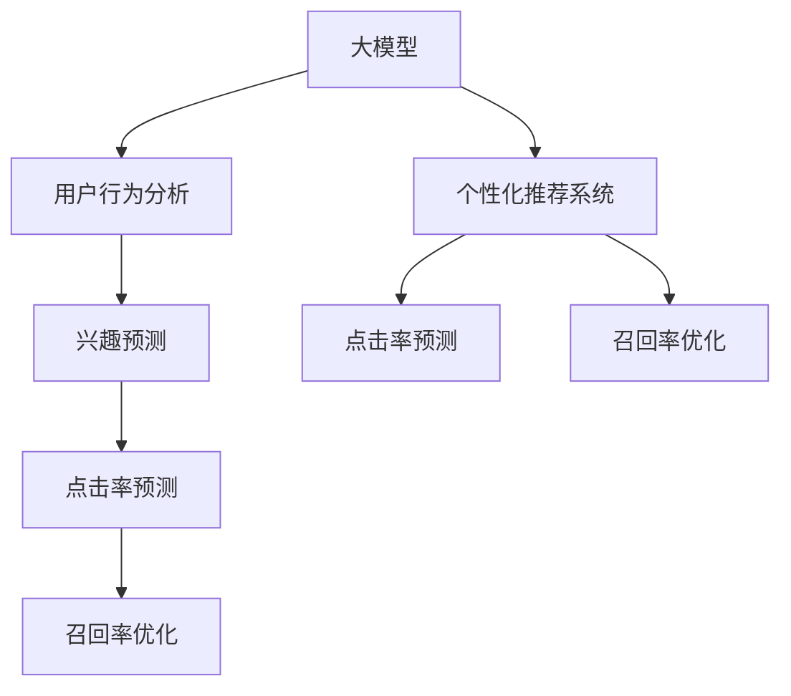

                 

# AI大模型驱动的个性化首页推荐

> 关键词：AI大模型,个性化推荐系统,首页推荐算法,深度学习,自然语言处理(NLP),用户行为分析,兴趣预测

## 1. 背景介绍

### 1.1 问题由来

随着互联网和移动互联网的普及，网站首页成为了用户进入网络世界的第一个窗口，其布局、内容推荐直接影响用户的浏览体验和停留时长。然而，由于资源有限，传统的首页推荐系统往往无法精准匹配用户兴趣，推荐效果欠佳。

近年来，基于大模型的个性化推荐系统应运而生。大模型凭借其海量的数据和强大的学习能力，能够从用户历史行为中挖掘出更深层次的兴趣特征，从而为用户提供更加精准的个性化推荐。本文将详细介绍大模型在个性化首页推荐中的应用，包括算法原理、具体实现和实际应用场景。

### 1.2 问题核心关键点

个性化首页推荐的核心在于如何构建一个高效的推荐系统，以提高用户满意度、增加网站粘性。传统推荐系统通常基于用户历史行为（如浏览记录、购买记录等）进行推荐，但这种方法存在冷启动问题，难以捕捉新用户的潜在兴趣。

基于大模型的个性化推荐系统则利用深度学习技术，通过对用户文本数据的深度学习，捕捉用户的兴趣特征。具体而言，利用大模型可以对用户行为进行语义理解，从而对未来的点击行为进行精准预测。

### 1.3 问题研究意义

个性化首页推荐系统对提升用户体验、增加网站收益具有重要意义：

1. **提高用户满意度**：通过推荐与用户兴趣高度匹配的内容，提高用户点击率，增加用户满意度。
2. **增加网站粘性**：精准的推荐内容可以延长用户停留时间，提升网站粘性。
3. **增加收益**：个性化推荐能够显著提升点击率和转化率，增加网站广告收入。
4. **实现数据驱动决策**：通过分析推荐效果，优化推荐策略，提升业务决策效率。

## 2. 核心概念与联系

### 2.1 核心概念概述

为更好地理解基于大模型的个性化推荐系统，本节将介绍几个关键概念：

- **大模型(大规模预训练语言模型)**：如GPT、BERT、RoBERTa等，通过在大规模无标签文本数据上进行预训练，学习到丰富的语言知识，具备强大的语义理解和生成能力。
- **个性化推荐系统**：根据用户历史行为和当前兴趣，推荐最符合用户需求的内容的系统。
- **用户行为分析**：通过分析用户的浏览历史、购买记录等行为数据，提取用户兴趣特征。
- **兴趣预测**：利用深度学习技术，对用户未来的兴趣行为进行预测，为用户推荐可能感兴趣的内容。
- **点击率预测**：预测用户点击某一推荐的概率，从而优化推荐策略。
- **召回率优化**：提高推荐的覆盖范围，保证推荐内容的相关性。

这些概念之间的逻辑关系可以通过以下Mermaid流程图来展示：



### 2.2 核心概念原理和架构的 Mermaid 流程图

在上述概念关系图中，大模型作为数据驱动的核心组件，利用用户行为分析结果，通过兴趣预测模型，最终输出个性化推荐。兴趣预测模型和个性化推荐系统的互动反馈，共同优化点击率和召回率，提升推荐效果。

## 3. 核心算法原理 & 具体操作步骤
### 3.1 算法原理概述

基于大模型的个性化推荐系统，其核心思想是利用深度学习技术，对用户历史行为进行语义理解，捕捉用户的兴趣特征，预测用户未来的点击行为。

假设用户的历史行为数据为 $H=\{x_1, x_2, \ldots, x_N\}$，其中 $x_i$ 表示用户在某次浏览中的行为信息，如浏览时间、浏览内容等。基于大模型的个性化推荐系统通过对历史数据进行预训练，学习到用户兴趣特征 $f(x_i)$，然后利用这些特征进行兴趣预测，从而生成个性化推荐。

兴趣预测模型通常为深度神经网络，包括多层全连接网络、循环神经网络(RNN)、长短期记忆网络(LSTM)、Transformer等。通过在大规模预训练数据上进行微调，学习到与用户兴趣高度相关的特征表示。

### 3.2 算法步骤详解

基于大模型的个性化推荐系统通常包括以下几个关键步骤：

**Step 1: 数据准备**

1. 收集用户历史行为数据 $H=\{x_1, x_2, \ldots, x_N\}$。
2. 对每个行为 $x_i$ 进行编码，生成向量表示 $v_i \in \mathbb{R}^d$，其中 $d$ 为向量维度。
3. 将 $H$ 划分为训练集、验证集和测试集。

**Step 2: 大模型预训练**

1. 选择合适的预训练语言模型，如BERT、GPT等。
2. 在大规模无标签文本数据上进行预训练，学习通用的语言表示。
3. 保存预训练的模型参数 $\theta$。

**Step 3: 大模型微调**

1. 将预训练模型加载到推荐系统中，作为兴趣预测模型的初始化参数。
2. 将用户历史行为数据 $H$ 划分为训练集和测试集，将 $H$ 的训练集作为微调数据。
3. 使用交叉熵等损失函数，最小化预测结果与真实标签之间的差距。
4. 通过梯度下降等优化算法，更新模型参数，直至收敛。

**Step 4: 个性化推荐**

1. 对用户当前的行为 $x$ 进行编码，生成向量表示 $v$。
2. 将 $v$ 输入到微调后的模型，预测用户对某一内容的点击概率 $p$。
3. 根据点击概率 $p$，对内容进行排序，生成个性化推荐列表。

### 3.3 算法优缺点

基于大模型的个性化推荐系统具有以下优点：

1. **效果显著**：利用大模型的强大学习能力，可以从用户行为中挖掘出更深层次的兴趣特征，提升推荐效果。
2. **适应性强**：适用于各种类型的推荐任务，只需微调部分层即可适应不同任务需求。
3. **可扩展性好**：由于大模型的预训练知识，可以轻松扩展到其他相似类型的推荐任务。

同时，该方法也存在一定的局限性：

1. **数据依赖性高**：微调效果很大程度上取决于数据的质量和数量，获取高质量用户行为数据的成本较高。
2. **计算资源消耗大**：大模型训练和微调需要大量的计算资源和存储资源。
3. **模型复杂度较高**：深度神经网络的复杂度较高，训练和推理速度较慢。
4. **解释性不足**：深度学习模型的黑盒特性使得难以解释其内部工作机制。

尽管存在这些局限性，但就目前而言，基于大模型的个性化推荐系统仍是最有效的推荐技术之一。未来相关研究的重点在于如何进一步降低对标注数据的依赖，提高模型的解释性和可扩展性。

### 3.4 算法应用领域

基于大模型的个性化推荐系统已经在电商、新闻、视频等多个领域得到了广泛应用，提升了用户的浏览体验和网站收益。例如：

- **电商推荐**：对用户的浏览记录、购买记录等行为数据进行语义理解，生成个性化商品推荐。
- **新闻推荐**：对用户的阅读历史进行语义分析，生成个性化新闻推荐。
- **视频推荐**：对用户的观看历史进行语义分析，生成个性化视频推荐。
- **音乐推荐**：对用户的听歌历史进行语义分析，生成个性化音乐推荐。

除了上述这些经典应用外，大模型个性化推荐系统还被创新性地应用于更多场景中，如文章推荐、游戏推荐、旅游推荐等，为推荐系统带来了新的突破。随着预训练语言模型和推荐技术的不断进步，相信个性化推荐系统将在更广阔的应用领域发挥更大作用。

## 4. 数学模型和公式 & 详细讲解 & 举例说明
### 4.1 数学模型构建

假设用户历史行为数据 $H=\{x_1, x_2, \ldots, x_N\}$，其中 $x_i$ 表示用户在某次浏览中的行为信息，如浏览时间、浏览内容等。将每个行为 $x_i$ 编码为向量表示 $v_i \in \mathbb{R}^d$，其中 $d$ 为向量维度。

定义兴趣预测模型为 $M_{\theta}(v)$，其中 $\theta$ 为模型参数。模型输出用户对某一内容的点击概率 $p$。

**目标**：最小化预测结果与真实标签之间的差距，即最小化交叉熵损失函数。

### 4.2 公式推导过程

假设用户历史行为 $H$ 中的某一行为 $x_i$ 的向量表示为 $v_i$，当前用户行为 $x$ 的向量表示为 $v$。模型的预测结果为 $p=softmax(M_{\theta}(v))$，其中 $softmax$ 函数将模型输出转换为概率分布。

定义交叉熵损失函数为 $\mathcal{L}(\theta)$，则：

$$
\mathcal{L}(\theta) = -\frac{1}{N}\sum_{i=1}^N [y_i\log p_i + (1-y_i)\log(1-p_i)]
$$

其中 $y_i \in \{0,1\}$ 表示用户是否点击了某一内容，$p_i$ 为模型预测的点击概率。

通过梯度下降等优化算法，更新模型参数 $\theta$，最小化损失函数 $\mathcal{L}(\theta)$，直至收敛。

### 4.3 案例分析与讲解

假设有一家电商网站，希望通过大模型驱动的个性化推荐系统提升用户点击率。具体步骤如下：

1. **数据准备**：收集用户历史浏览记录 $H=\{x_1, x_2, \ldots, x_N\}$，其中 $x_i$ 表示用户在某次浏览中的行为信息，如浏览时间、浏览商品等。
2. **大模型预训练**：选择预训练语言模型，如BERT，在大规模无标签文本数据上进行预训练。
3. **大模型微调**：将预训练模型加载到推荐系统中，使用交叉熵损失函数进行微调，训练兴趣预测模型 $M_{\theta}(v)$。
4. **个性化推荐**：对用户当前行为 $x$ 进行编码，生成向量表示 $v$，将 $v$ 输入到微调后的模型 $M_{\theta}(v)$，预测用户对某一商品的点击概率 $p$。根据 $p$ 对商品进行排序，生成个性化推荐列表。

## 5. 项目实践：代码实例和详细解释说明
### 5.1 开发环境搭建

在进行项目实践前，我们需要准备好开发环境。以下是使用Python进行PyTorch开发的环境配置流程：

1. 安装Anaconda：从官网下载并安装Anaconda，用于创建独立的Python环境。

2. 创建并激活虚拟环境：
```bash
conda create -n pytorch-env python=3.8 
conda activate pytorch-env
```

3. 安装PyTorch：根据CUDA版本，从官网获取对应的安装命令。例如：
```bash
conda install pytorch torchvision torchaudio cudatoolkit=11.1 -c pytorch -c conda-forge
```

4. 安装Transformers库：
```bash
pip install transformers
```

5. 安装各类工具包：
```bash
pip install numpy pandas scikit-learn matplotlib tqdm jupyter notebook ipython
```

完成上述步骤后，即可在`pytorch-env`环境中开始项目实践。

### 5.2 源代码详细实现

这里我们以电商推荐为例，给出使用Transformers库对预训练语言模型进行微调的PyTorch代码实现。

首先，定义电商推荐的数据处理函数：

```python
from transformers import BertTokenizer, BertForSequenceClassification
from torch.utils.data import Dataset, DataLoader
import torch

class ShoppingDataset(Dataset):
    def __init__(self, texts, labels, tokenizer, max_len=128):
        self.texts = texts
        self.labels = labels
        self.tokenizer = tokenizer
        self.max_len = max_len
        
    def __len__(self):
        return len(self.texts)
    
    def __getitem__(self, item):
        text = self.texts[item]
        label = self.labels[item]
        
        encoding = self.tokenizer(text, return_tensors='pt', max_length=self.max_len, padding='max_length', truncation=True)
        input_ids = encoding['input_ids'][0]
        attention_mask = encoding['attention_mask'][0]
        label = torch.tensor(label, dtype=torch.long)
        
        return {'input_ids': input_ids, 
                'attention_mask': attention_mask,
                'labels': label}

# 数据加载器
tokenizer = BertTokenizer.from_pretrained('bert-base-cased')
train_dataset = ShoppingDataset(train_texts, train_labels, tokenizer)
dev_dataset = ShoppingDataset(dev_texts, dev_labels, tokenizer)
test_dataset = ShoppingDataset(test_texts, test_labels, tokenizer)

# 模型初始化
model = BertForSequenceClassification.from_pretrained('bert-base-cased', num_labels=2)

# 优化器
optimizer = AdamW(model.parameters(), lr=2e-5)
```

然后，定义训练和评估函数：

```python
from tqdm import tqdm

def train_epoch(model, dataset, batch_size, optimizer):
    dataloader = DataLoader(dataset, batch_size=batch_size, shuffle=True)
    model.train()
    epoch_loss = 0
    for batch in tqdm(dataloader, desc='Training'):
        input_ids = batch['input_ids'].to(device)
        attention_mask = batch['attention_mask'].to(device)
        labels = batch['labels'].to(device)
        model.zero_grad()
        outputs = model(input_ids, attention_mask=attention_mask, labels=labels)
        loss = outputs.loss
        epoch_loss += loss.item()
        loss.backward()
        optimizer.step()
    return epoch_loss / len(dataloader)

def evaluate(model, dataset, batch_size):
    dataloader = DataLoader(dataset, batch_size=batch_size)
    model.eval()
    preds, labels = [], []
    with torch.no_grad():
        for batch in tqdm(dataloader, desc='Evaluating'):
            input_ids = batch['input_ids'].to(device)
            attention_mask = batch['attention_mask'].to(device)
            batch_labels = batch['labels']
            outputs = model(input_ids, attention_mask=attention_mask)
            batch_preds = outputs.logits.argmax(dim=2).to('cpu').tolist()
            batch_labels = batch_labels.to('cpu').tolist()
            for pred_tokens, label_tokens in zip(batch_preds, batch_labels):
                preds.append(pred_tokens)
                labels.append(label_tokens)
                
    print(classification_report(labels, preds))
```

最后，启动训练流程并在测试集上评估：

```python
epochs = 5
batch_size = 16

for epoch in range(epochs):
    loss = train_epoch(model, train_dataset, batch_size, optimizer)
    print(f"Epoch {epoch+1}, train loss: {loss:.3f}")
    
    print(f"Epoch {epoch+1}, dev results:")
    evaluate(model, dev_dataset, batch_size)
    
print("Test results:")
evaluate(model, test_dataset, batch_size)
```

以上就是使用PyTorch对BERT进行电商推荐任务微调的完整代码实现。可以看到，得益于Transformers库的强大封装，我们可以用相对简洁的代码完成BERT模型的加载和微调。

### 5.3 代码解读与分析

让我们再详细解读一下关键代码的实现细节：

**ShoppingDataset类**：
- `__init__`方法：初始化文本、标签、分词器等关键组件。
- `__len__`方法：返回数据集的样本数量。
- `__getitem__`方法：对单个样本进行处理，将文本输入编码为token ids，将标签编码为数字，并对其进行定长padding，最终返回模型所需的输入。

**BertForSequenceClassification**：
- 继承自BERT模型的分类分支，将文本分类任务作为预训练语言模型的下游任务，进行微调。

**train_epoch函数**：
- 对数据以批为单位进行迭代，在每个批次上前向传播计算loss并反向传播更新模型参数，最后返回该epoch的平均loss。

**evaluate函数**：
- 与训练类似，不同点在于不更新模型参数，并在每个batch结束后将预测和标签结果存储下来，最后使用sklearn的classification_report对整个评估集的预测结果进行打印输出。

**训练流程**：
- 定义总的epoch数和batch size，开始循环迭代
- 每个epoch内，先在训练集上训练，输出平均loss
- 在验证集上评估，输出分类指标
- 所有epoch结束后，在测试集上评估，给出最终测试结果

可以看到，PyTorch配合Transformers库使得BERT微调的代码实现变得简洁高效。开发者可以将更多精力放在数据处理、模型改进等高层逻辑上，而不必过多关注底层的实现细节。

当然，工业级的系统实现还需考虑更多因素，如模型的保存和部署、超参数的自动搜索、更灵活的任务适配层等。但核心的微调范式基本与此类似。

## 6. 实际应用场景
### 6.1 智能客服系统

基于大模型驱动的个性化推荐系统，可以广泛应用于智能客服系统的构建。传统客服往往需要配备大量人力，高峰期响应缓慢，且一致性和专业性难以保证。而使用推荐系统进行智能推荐，可以大大降低人力成本，提升响应速度和满意度。

在技术实现上，可以收集企业内部的历史客服对话记录，将问题和最佳答复构建成监督数据，在此基础上对预训练模型进行微调。微调后的模型能够自动理解用户意图，匹配最合适的答案模板进行回复。对于客户提出的新问题，还可以接入检索系统实时搜索相关内容，动态组织生成回答。如此构建的智能客服系统，能大幅提升客户咨询体验和问题解决效率。

### 6.2 金融舆情监测

金融机构需要实时监测市场舆论动向，以便及时应对负面信息传播，规避金融风险。传统的人工监测方式成本高、效率低，难以应对网络时代海量信息爆发的挑战。基于大模型驱动的文本分类和情感分析技术，为金融舆情监测提供了新的解决方案。

具体而言，可以收集金融领域相关的新闻、报道、评论等文本数据，并对其进行主题标注和情感标注。在此基础上对预训练语言模型进行微调，使其能够自动判断文本属于何种主题，情感倾向是正面、中性还是负面。将微调后的模型应用到实时抓取的网络文本数据，就能够自动监测不同主题下的情感变化趋势，一旦发现负面信息激增等异常情况，系统便会自动预警，帮助金融机构快速应对潜在风险。

### 6.3 个性化推荐系统

传统的推荐系统往往只依赖用户历史行为数据进行物品推荐，无法深入理解用户的真实兴趣偏好。基于大模型的个性化推荐系统可以更好地挖掘用户行为背后的语义信息，从而提供更精准、多样的推荐内容。

在实践中，可以收集用户浏览、点击、评论、分享等行为数据，提取和用户交互的物品标题、描述、标签等文本内容。将文本内容作为模型输入，用户的后续行为（如是否点击、购买等）作为监督信号，在此基础上微调预训练语言模型。微调后的模型能够从文本内容中准确把握用户的兴趣点。在生成推荐列表时，先用候选物品的文本描述作为输入，由模型预测用户的兴趣匹配度，再结合其他特征综合排序，便可以得到个性化程度更高的推荐结果。

### 6.4 未来应用展望

随着大模型和推荐技术的不断发展，基于大模型驱动的个性化推荐系统将在更多领域得到应用，为各行各业带来变革性影响。

在智慧医疗领域，基于大模型驱动的推荐系统可以推荐个性化的医疗信息，辅助医生诊疗，加速新药开发进程。

在智能教育领域，推荐系统可以个性化推荐学习内容，因材施教，促进教育公平，提高教学质量。

在智慧城市治理中，推荐系统可以推荐个性化的城市服务信息，提高城市管理的自动化和智能化水平，构建更安全、高效的未来城市。

此外，在企业生产、社会治理、文娱传媒等众多领域，基于大模型驱动的推荐系统也将不断涌现，为传统行业数字化转型升级提供新的技术路径。相信随着技术的日益成熟，推荐系统必将在更广阔的应用领域大放异彩。

## 7. 工具和资源推荐
### 7.1 学习资源推荐

为了帮助开发者系统掌握大模型驱动的个性化推荐技术，这里推荐一些优质的学习资源：

1. 《Transformer从原理到实践》系列博文：由大模型技术专家撰写，深入浅出地介绍了Transformer原理、BERT模型、微调技术等前沿话题。

2. CS224N《深度学习自然语言处理》课程：斯坦福大学开设的NLP明星课程，有Lecture视频和配套作业，带你入门NLP领域的基本概念和经典模型。

3. 《Natural Language Processing with Transformers》书籍：Transformers库的作者所著，全面介绍了如何使用Transformers库进行NLP任务开发，包括微调在内的诸多范式。

4. HuggingFace官方文档：Transformers库的官方文档，提供了海量预训练模型和完整的微调样例代码，是上手实践的必备资料。

5. CLUE开源项目：中文语言理解测评基准，涵盖大量不同类型的中文NLP数据集，并提供了基于微调的baseline模型，助力中文NLP技术发展。

通过对这些资源的学习实践，相信你一定能够快速掌握大模型驱动的个性化推荐技术的精髓，并用于解决实际的NLP问题。
###  7.2 开发工具推荐

高效的开发离不开优秀的工具支持。以下是几款用于大模型驱动的个性化推荐系统开发的常用工具：

1. PyTorch：基于Python的开源深度学习框架，灵活动态的计算图，适合快速迭代研究。大部分预训练语言模型都有PyTorch版本的实现。

2. TensorFlow：由Google主导开发的开源深度学习框架，生产部署方便，适合大规模工程应用。同样有丰富的预训练语言模型资源。

3. Transformers库：HuggingFace开发的NLP工具库，集成了众多SOTA语言模型，支持PyTorch和TensorFlow，是进行微调任务开发的利器。

4. Weights & Biases：模型训练的实验跟踪工具，可以记录和可视化模型训练过程中的各项指标，方便对比和调优。与主流深度学习框架无缝集成。

5. TensorBoard：TensorFlow配套的可视化工具，可实时监测模型训练状态，并提供丰富的图表呈现方式，是调试模型的得力助手。

6. Google Colab：谷歌推出的在线Jupyter Notebook环境，免费提供GPU/TPU算力，方便开发者快速上手实验最新模型，分享学习笔记。

合理利用这些工具，可以显著提升大模型驱动的个性化推荐系统的开发效率，加快创新迭代的步伐。

### 7.3 相关论文推荐

大模型驱动的个性化推荐系统的发展源于学界的持续研究。以下是几篇奠基性的相关论文，推荐阅读：

1. Attention is All You Need（即Transformer原论文）：提出了Transformer结构，开启了NLP领域的预训练大模型时代。

2. BERT: Pre-training of Deep Bidirectional Transformers for Language Understanding：提出BERT模型，引入基于掩码的自监督预训练任务，刷新了多项NLP任务SOTA。

3. Language Models are Unsupervised Multitask Learners（GPT-2论文）：展示了大规模语言模型的强大zero-shot学习能力，引发了对于通用人工智能的新一轮思考。

4. Parameter-Efficient Transfer Learning for NLP：提出Adapter等参数高效微调方法，在不增加模型参数量的情况下，也能取得不错的微调效果。

5. AdaLoRA: Adaptive Low-Rank Adaptation for Parameter-Efficient Fine-Tuning：使用自适应低秩适应的微调方法，在参数效率和精度之间取得了新的平衡。

6. Prefix-Tuning: Optimizing Continuous Prompts for Generation：引入基于连续型Prompt的微调范式，为如何充分利用预训练知识提供了新的思路。

这些论文代表了大模型驱动的个性化推荐系统的发展脉络。通过学习这些前沿成果，可以帮助研究者把握学科前进方向，激发更多的创新灵感。

## 8. 总结：未来发展趋势与挑战

### 8.1 研究成果总结

本文对基于大模型驱动的个性化推荐系统进行了全面系统的介绍。首先阐述了个性化推荐系统的背景和意义，明确了推荐系统通过深度学习技术，从用户行为中挖掘出更深层次的兴趣特征，为用户推荐最符合需求的内容。接着，从原理到实践，详细讲解了基于大模型的个性化推荐系统的算法原理和具体操作步骤，给出了微调任务开发的完整代码实例。最后，本文还广泛探讨了推荐系统在电商、新闻、视频等多个领域的应用前景，展示了其广阔的应用空间。

通过本文的系统梳理，可以看到，基于大模型的个性化推荐系统正在成为推荐系统的重要范式，极大地拓展了推荐模型的应用边界，为推荐系统带来了新的突破。随着大模型和推荐技术的不断进步，相信推荐系统将在更广阔的应用领域大放异彩，深刻影响用户的生产生活方式。

### 8.2 未来发展趋势

展望未来，大模型驱动的个性化推荐系统将呈现以下几个发展趋势：

1. **模型规模持续增大**：随着算力成本的下降和数据规模的扩张，预训练语言模型的参数量还将持续增长。超大规模语言模型蕴含的丰富语言知识，有望支撑更加复杂多变的推荐任务。

2. **推荐范式更加多样化**：除了传统的深度学习范式外，未来将涌现更多推荐技术，如生成对抗网络(GAN)、强化学习等，从不同的角度提升推荐效果。

3. **用户兴趣更加细粒度**：通过语义理解技术，推荐系统能够从用户的行为数据中挖掘出更深层次的兴趣特征，为用户提供更加精准的个性化推荐。

4. **实时性更强**：利用分布式计算和大数据技术，推荐系统能够在短时间内处理大量数据，实现实时推荐。

5. **跨模态推荐**：推荐系统将从单一模态的数据来源扩展到多模态数据，融合视觉、听觉等多种信息源，提供更全面的推荐服务。

6. **推荐系统更加开放**：推荐系统将引入社区推荐、社交推荐等新机制，利用用户之间的交互和评价，提供更加多样化和个性化的推荐。

以上趋势凸显了大模型驱动的个性化推荐系统的发展前景。这些方向的探索发展，必将进一步提升推荐系统的性能和用户体验，为用户带来更好的服务体验。

### 8.3 面临的挑战

尽管大模型驱动的个性化推荐系统已经取得了显著成果，但在迈向更加智能化、普适化应用的过程中，它仍面临着诸多挑战：

1. **数据依赖性高**：微调效果很大程度上取决于数据的质量和数量，获取高质量用户行为数据的成本较高。如何进一步降低对标注数据的依赖，将是一大难题。

2. **计算资源消耗大**：大模型训练和微调需要大量的计算资源和存储资源。如何降低计算成本，提高系统的可扩展性，还需要进一步的研究。

3. **推荐效果不稳定**：随着用户行为的变化，推荐效果也会随之波动。如何在数据动态变化的情况下，保证推荐系统的稳定性和鲁棒性，是一个重要问题。

4. **隐私保护和数据安全**：推荐系统需要处理大量的用户隐私数据，如何保护用户隐私，防止数据泄露，仍需进一步加强技术保障。

5. **冷启动问题**：新用户或新物品加入推荐系统时，由于缺乏足够的历史数据，推荐效果较差。如何提高冷启动效果，是一个亟待解决的挑战。

6. **模型复杂度较高**：深度神经网络的复杂度较高，训练和推理速度较慢。如何优化模型结构，提高推理效率，还需要进一步的研究。

正视推荐系统面临的这些挑战，积极应对并寻求突破，将是大模型驱动的个性化推荐系统走向成熟的必由之路。相信随着学界和产业界的共同努力，这些挑战终将一一被克服，推荐系统必将在更广阔的应用领域发挥更大的作用。

### 8.4 研究展望

面对大模型驱动的个性化推荐系统所面临的挑战，未来的研究需要在以下几个方面寻求新的突破：

1. **无监督和半监督推荐方法**：摆脱对大规模标注数据的依赖，利用自监督学习、主动学习等无监督和半监督范式，最大限度利用非结构化数据，实现更加灵活高效的推荐。

2. **参数高效和计算高效的推荐方法**：开发更加参数高效的推荐方法，在固定大部分预训练参数的情况下，只更新极少量的任务相关参数。同时优化推荐模型的计算图，减少前向传播和反向传播的资源消耗，实现更加轻量级、实时性的部署。

3. **多模态推荐**：推荐系统将从单一模态的数据来源扩展到多模态数据，融合视觉、听觉等多种信息源，提供更全面的推荐服务。

4. **因果分析和博弈论工具**：将因果分析方法引入推荐系统，识别出推荐过程的关键特征，增强推荐结果的因果性和逻辑性。借助博弈论工具刻画人机交互过程，主动探索并规避推荐模型的脆弱点，提高系统稳定性。

5. **知识整合和规则引入**：推荐系统需要引入外部知识库、规则库等专家知识，与神经网络模型进行融合，引导推荐过程学习更准确、合理的兴趣特征。

6. **增强用户隐私保护**：在推荐系统设计中引入隐私保护技术，保护用户隐私数据，防止数据泄露。

这些研究方向的探索，必将引领推荐系统迈向更高的台阶，为推荐系统带来新的突破。面向未来，推荐系统还需要与其他人工智能技术进行更深入的融合，如知识表示、因果推理、强化学习等，多路径协同发力，共同推动推荐系统的发展。只有勇于创新、敢于突破，才能不断拓展推荐系统的边界，让推荐系统更好地服务于用户。

## 9. 附录：常见问题与解答

**Q1：基于大模型的个性化推荐系统是否适用于所有推荐场景？**

A: 基于大模型的个性化推荐系统适用于大多数推荐场景，但也有一些特殊场景可能需要采用其他推荐技术。例如，对于数据量较小的推荐场景，传统的协同过滤推荐可能更适合。而对于实时性要求很高的推荐场景，如电商推荐，基于大模型的推荐系统需要进一步优化，以保证实时性。

**Q2：如何选择合适的大模型进行个性化推荐？**

A: 选择合适的大模型进行个性化推荐需要考虑以下几个因素：
1. **任务需求**：不同任务对模型的准确度和解释性要求不同，选择合适的模型以满足任务需求。
2. **数据规模**：大规模数据集适合选择参数较大的模型，而小规模数据集适合选择参数较小的模型。
3. **计算资源**：计算资源有限的场景适合选择参数较小的模型，以保证训练和推理速度。

**Q3：如何降低大模型驱动的个性化推荐系统的计算成本？**

A: 降低计算成本可以采取以下措施：
1. **参数剪枝**：通过剪枝技术减少模型参数量，提高推理速度。
2. **模型压缩**：使用量化技术将模型转换为低比特数的形式，减少存储空间和计算资源消耗。
3. **分布式训练**：利用分布式计算技术，加速模型训练过程。
4. **混合精度训练**：采用混合精度训练技术，降低计算成本。

**Q4：如何提高大模型驱动的个性化推荐系统的推荐效果？**

A: 提高推荐效果可以从以下几个方面入手：
1. **数据质量**：提高用户行为数据的标注质量，增加数据的多样性。
2. **模型优化**：使用参数高效微调技术，减少过拟合风险。
3. **特征工程**：优化特征选择和特征组合，提高模型的特征表达能力。
4. **上下文理解**：利用上下文信息，提高推荐模型的语义理解能力。

**Q5：如何平衡推荐系统的大模型与小模型之间的优势？**

A: 平衡大模型与小模型之间的优势需要根据具体任务进行选择：
1. **大模型**：适用于数据量较大、特征丰富的任务，能够捕捉到更多的用户兴趣特征。
2. **小模型**：适用于数据量较小、特征简单的任务，能够保证训练和推理速度，适用于实时性要求高的场景。

总之，大模型驱动的个性化推荐系统在推荐效果和性能上具有显著优势，但也需要根据具体任务需求进行选择和优化。

---

作者：禅与计算机程序设计艺术 / Zen and the Art of Computer Programming

