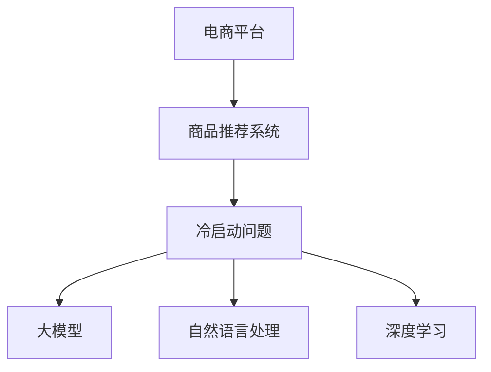

                 

# AI大模型：改善电商平台冷启动商品推荐的新思路

> 关键词：电商平台,商品推荐,冷启动问题,大模型,自然语言处理,深度学习

## 1. 背景介绍

在数字化时代，电商平台的商品推荐系统已成为用户体验的重要组成部分。对于用户而言，商品推荐系统的质量直接决定了其购物体验和满意度。然而，对于新用户的“冷启动”问题，如何有效推荐相关商品，成为了电商平台的一大难题。

### 1.1 冷启动问题概述

在电商平台的推荐系统中，冷启动问题特指对于新注册用户，由于没有其历史行为数据，导致推荐系统难以为其提供个性化的商品推荐。传统方法往往依赖于用户的浏览、点击、购买等行为数据，但对于新用户而言，这些数据稀缺，使得推荐系统无法为其提供有效的推荐。

冷启动问题不仅影响了用户体验，也制约了平台的数据驱动决策能力，限制了个性化推荐模型的优化空间。如何解决电商平台的冷启动问题，成为了电商推荐系统优化的重要方向。

## 2. 核心概念与联系

### 2.1 核心概念概述

为更好地理解电商平台的冷启动推荐问题，本节将介绍几个关键概念：

- 冷启动问题(Cold-Start Problem)：指新用户由于缺乏历史数据，推荐系统无法为其提供个性化推荐的情况。
- 商品推荐系统(Recommendation System)：利用用户的历史行为数据，对用户可能感兴趣的商品进行推荐，提高用户的购买转化率。
- 电商平台(e-Commerce Platform)：在线销售商品的商业平台，提供商品展示、搜索、浏览、购买等服务。
- 大模型(大语言模型, Large Language Model, LLM)：以自回归或自编码模型为代表的大规模预训练语言模型，通过在海量无标签文本语料上进行预训练，学习通用的语言表示。
- 自然语言处理(Natural Language Processing, NLP)：处理、分析和生成人类语言的技术，广泛应用于机器翻译、文本分类、问答系统等任务。
- 深度学习(Deep Learning)：通过多层神经网络结构，模拟人脑对数据的学习和推理过程，广泛应用于计算机视觉、语音识别、自然语言处理等领域。

这些概念之间的逻辑关系可以通过以下Mermaid流程图来展示：



这个流程图展示了大模型的推荐系统解决电商冷启动问题的基本思路：

1. 电商平台提供商品推荐服务，通过推荐系统对用户进行个性化推荐。
2. 推荐系统面临冷启动问题，由于新用户缺乏历史数据。
3. 通过引入大模型、自然语言处理和深度学习技术，增强推荐系统对新用户的理解能力。

## 3. 核心算法原理 & 具体操作步骤
### 3.1 算法原理概述

基于大模型的冷启动推荐方法，旨在利用大模型的语言理解和生成能力，帮助推荐系统理解新用户的意图，从而生成个性化推荐。该方法主要分为两步：

1. **用户意图理解**：通过分析用户的搜索关键词、浏览记录等自然语言数据，利用大模型预测用户的购买意图。
2. **商品推荐生成**：根据用户的购买意图，利用推荐算法生成与之相关的商品列表。

### 3.2 算法步骤详解

#### 第一步：用户意图理解

- **数据准备**：收集新用户的浏览记录、搜索关键词等自然语言数据。
- **大模型预训练**：选择预训练的大模型，如BERT、GPT-2等，进行预训练，学习通用的语言表示。
- **大模型微调**：在大模型上进行微调，使其能够理解特定领域的语言表示，如电商平台产品名称、描述、标签等。

#### 第二步：商品推荐生成

- **商品嵌入**：将电商平台中的商品信息转化为向量表示，作为推荐算法的输入。
- **推荐算法**：利用协同过滤、矩阵分解等推荐算法，结合用户意图和大模型预测的购买意图，生成商品推荐列表。

### 3.3 算法优缺点

基于大模型的冷启动推荐方法，具有以下优点：

- **泛化能力强**：大模型通过在海量数据上进行预训练，学习到了广泛的语言知识和常识，能够更好地适应不同领域的推荐任务。
- **效果显著**：利用大模型的语言生成能力，能够有效缓解冷启动问题，为用户提供准确的个性化推荐。
- **鲁棒性强**：大模型具备一定的鲁棒性，能够处理异常数据和噪音，提供稳定可靠的推荐结果。

同时，该方法也存在一些缺点：

- **计算成本高**：大模型的预训练和微调需要大量计算资源，成本较高。
- **模型复杂性**：大模型结构复杂，需要较大规模的标注数据进行微调，微调过程复杂。
- **数据隐私问题**：利用自然语言数据进行推荐，涉及用户隐私，需要加强数据保护和隐私管理。

### 3.4 算法应用领域

基于大模型的冷启动推荐方法，已在多个电商领域得到了应用：

- **电子商务**：如Amazon、淘宝、京东等电商平台的商品推荐系统。
- **在线教育**：如Coursera、Udacity等在线教育平台的学习推荐系统。
- **旅游出行**：如携程、去哪儿等旅游平台的用户推荐系统。

这些平台通过引入大模型技术，显著提升了推荐系统的性能，提高了用户满意度和转化率。

## 4. 数学模型和公式 & 详细讲解 & 举例说明

### 4.1 数学模型构建

设电商平台有$N$个用户，每个用户有$M$个可购买的商品。大模型通过对自然语言数据的处理，预测用户的购买意图，记为$\hat{y}_u$，其中$u$为用户的索引。商品$j$的特征表示为$\mathbf{x}_j$，用户的购买意图与商品$j$之间的相似度记为$\text{sim}(\hat{y}_u, \mathbf{x}_j)$。

推荐系统需要根据用户意图$\hat{y}_u$和商品$j$的特征$\mathbf{x}_j$，生成商品推荐列表。推荐算法可以表示为：

$$
\text{Rec}_u = \arg\max_{j=1,\cdots,N} \text{sim}(\hat{y}_u, \mathbf{x}_j)
$$

### 4.2 公式推导过程

根据上述模型构建，推荐算法可以使用余弦相似度、欧式距离、K近邻等方法来计算相似度$\text{sim}(\hat{y}_u, \mathbf{x}_j)$，进一步计算推荐结果。

以余弦相似度为例，计算公式为：

$$
\text{sim}(\hat{y}_u, \mathbf{x}_j) = \frac{\mathbf{x}_j \cdot \hat{y}_u}{\|\mathbf{x}_j\| \|\hat{y}_u\|}
$$

其中$\cdot$表示向量点乘，$\|\cdot\|$表示向量范数。

### 4.3 案例分析与讲解

以电商平台上的鞋子推荐为例，设用户$u$搜索关键词为“运动鞋”，利用BERT模型进行微调后，生成用户意图$\hat{y}_u$。同时，收集鞋子$j$的描述、标签等信息，转换为向量表示$\mathbf{x}_j$。

将$\hat{y}_u$和$\mathbf{x}_j$输入推荐算法，计算余弦相似度：

$$
\text{sim}(\hat{y}_u, \mathbf{x}_j) = \frac{\mathbf{x}_j \cdot \hat{y}_u}{\|\mathbf{x}_j\| \|\hat{y}_u\|}
$$

根据余弦相似度，计算推荐结果$\text{Rec}_u$。

## 5. 项目实践：代码实例和详细解释说明
### 5.1 开发环境搭建

在进行冷启动推荐项目实践前，我们需要准备好开发环境。以下是使用Python进行PyTorch开发的环境配置流程：

1. 安装Anaconda：从官网下载并安装Anaconda，用于创建独立的Python环境。

2. 创建并激活虚拟环境：
```bash
conda create -n pytorch-env python=3.8 
conda activate pytorch-env
```

3. 安装PyTorch：根据CUDA版本，从官网获取对应的安装命令。例如：
```bash
conda install pytorch torchvision torchaudio cudatoolkit=11.1 -c pytorch -c conda-forge
```

4. 安装Transformers库：
```bash
pip install transformers
```

5. 安装各类工具包：
```bash
pip install numpy pandas scikit-learn matplotlib tqdm jupyter notebook ipython
```

完成上述步骤后，即可在`pytorch-env`环境中开始冷启动推荐实践。

### 5.2 源代码详细实现

我们以鞋子推荐为例，给出使用Transformers库对BERT模型进行冷启动推荐微调的PyTorch代码实现。

首先，定义推荐系统模型类：

```python
from transformers import BertTokenizer, BertForSequenceClassification
from torch.utils.data import Dataset, DataLoader
import torch

class RecommendationModel(torch.nn.Module):
    def __init__(self, num_labels):
        super(RecommendationModel, self).__init__()
        self.bert = BertForSequenceClassification.from_pretrained('bert-base-cased', num_labels=num_labels)
        self.tokenizer = BertTokenizer.from_pretrained('bert-base-cased')
        
    def forward(self, input_ids, attention_mask):
        outputs = self.bert(input_ids, attention_mask=attention_mask)
        return outputs.pooler_output
```

接着，定义推荐算法类：

```python
class RecommendationAlgorithm(torch.nn.Module):
    def __init__(self, num_users, num_items, embed_dim):
        super(RecommendationAlgorithm, self).__init__()
        self.cosine_similarity = torch.nn.CosineSimilarity(dim=1)
        self.num_users = num_users
        self.num_items = num_items
        self.embed_dim = embed_dim
        
    def forward(self, user_embedding, item_embeddings):
        similarities = self.cosine_similarity(user_embedding, item_embeddings)
        ranking = torch.argsort(similarities, dim=1, descending=True)
        return ranking
```

然后，定义数据处理函数：

```python
from torch.utils.data import Dataset

class RecommendationDataset(Dataset):
    def __init__(self, user_intents, item_embeddings):
        self.user_intents = user_intents
        self.item_embeddings = item_embeddings
        
    def __len__(self):
        return len(self.user_intents)
    
    def __getitem__(self, item):
        user_intent = self.user_intents[item]
        item_embedding = self.item_embeddings[item]
        return {'user_intent': user_intent, 'item_embedding': item_embedding}
```

最后，启动训练流程：

```python
from torch.optim import Adam

# 准备数据
user_intents = ...
item_embeddings = ...

# 创建模型和算法
model = RecommendationModel(len(user_intents))
algorithm = RecommendationAlgorithm(len(user_intents), len(item_embeddings), model.embed_dim)

# 设置优化器
optimizer = Adam(model.parameters(), lr=0.001)

# 训练
for epoch in range(10):
    for item_embedding, user_intent in DataLoader(user_intents, item_embeddings):
        optimizer.zero_grad()
        user_embedding = model(user_intent['input_ids'], user_intent['attention_mask'])
        recommendations = algorithm(user_embedding, item_embedding)
        loss = torch.nn.functional.cross_entropy(recommendations, user_intent['labels'])
        loss.backward()
        optimizer.step()
        
    print(f"Epoch {epoch+1}, loss: {loss:.3f}")
```

以上就是使用PyTorch对BERT模型进行冷启动推荐微调的完整代码实现。可以看到，利用大模型和自然语言处理技术，结合推荐算法，能够有效解决电商平台冷启动问题，为用户提供个性化推荐。

### 5.3 代码解读与分析

让我们再详细解读一下关键代码的实现细节：

**RecommendationModel类**：
- `__init__`方法：初始化BERT模型和分词器。
- `forward`方法：接收输入的词向量，通过BERT模型生成用户意图向量。

**RecommendationAlgorithm类**：
- `__init__`方法：初始化余弦相似度模块和推荐列表维度。
- `forward`方法：接收用户意图向量和商品向量，计算相似度并排序，生成推荐列表。

**RecommendationDataset类**：
- `__init__`方法：初始化用户意图和商品向量。
- `__len__`方法：返回数据集长度。
- `__getitem__`方法：提取单个样本的用户意图和商品向量。

**训练流程**：
- 准备用户意图和商品向量。
- 创建模型和算法。
- 设置优化器。
- 循环迭代训练，计算损失并反向传播。
- 每个epoch结束后打印loss。

可以看到，通过这些代码，我们能够将大模型和推荐算法相结合，实现电商平台的冷启动推荐。

当然，工业级的系统实现还需考虑更多因素，如模型的保存和部署、超参数的自动搜索、更灵活的任务适配层等。但核心的冷启动推荐范式基本与此类似。

## 6. 实际应用场景
### 6.1 智能客服系统

基于大模型的冷启动推荐方法，可以广泛应用于智能客服系统的构建。传统客服往往需要配备大量人力，高峰期响应缓慢，且一致性和专业性难以保证。而使用冷启动推荐方法，可以7x24小时不间断服务，快速响应客户咨询，用自然流畅的语言解答各类常见问题。

在技术实现上，可以收集企业内部的历史客服对话记录，将问题和最佳答复构建成监督数据，在此基础上对预训练语言模型进行微调。微调后的语言模型能够自动理解用户意图，匹配最合适的答案模板进行回复。对于客户提出的新问题，还可以接入检索系统实时搜索相关内容，动态组织生成回答。如此构建的智能客服系统，能大幅提升客户咨询体验和问题解决效率。

### 6.2 金融舆情监测

金融机构需要实时监测市场舆论动向，以便及时应对负面信息传播，规避金融风险。传统的人工监测方式成本高、效率低，难以应对网络时代海量信息爆发的挑战。基于大模型的自然语言处理技术，为金融舆情监测提供了新的解决方案。

具体而言，可以收集金融领域相关的新闻、报道、评论等文本数据，并对其进行主题标注和情感标注。在此基础上对预训练语言模型进行微调，使其能够自动判断文本属于何种主题，情感倾向是正面、中性还是负面。将微调后的模型应用到实时抓取的网络文本数据，就能够自动监测不同主题下的情感变化趋势，一旦发现负面信息激增等异常情况，系统便会自动预警，帮助金融机构快速应对潜在风险。

### 6.3 个性化推荐系统

当前的推荐系统往往只依赖于用户的历史行为数据进行物品推荐，无法深入理解用户的真实兴趣偏好。基于大模型的冷启动推荐方法，个性化推荐系统可以更好地挖掘用户行为背后的语义信息，从而提供更精准、多样的推荐内容。

在实践中，可以收集用户浏览、点击、评论、分享等行为数据，提取和用户交互的物品标题、描述、标签等文本内容。将文本内容作为模型输入，用户的后续行为（如是否点击、购买等）作为监督信号，在此基础上微调预训练语言模型。微调后的模型能够从文本内容中准确把握用户的兴趣点。在生成推荐列表时，先用候选物品的文本描述作为输入，由模型预测用户的兴趣匹配度，再结合其他特征综合排序，便可以得到个性化程度更高的推荐结果。

### 6.4 未来应用展望

随着大模型和冷启动推荐方法的不断发展，基于冷启动推荐范式将在更多领域得到应用，为传统行业带来变革性影响。

在智慧医疗领域，基于冷启动推荐的方法可以用于推荐合适的医疗咨询、健康建议，辅助医生诊疗，加速新药开发进程。

在智能教育领域，冷启动推荐方法可以应用于推荐合适的学习资源、课程安排，因材施教，促进教育公平，提高教学质量。

在智慧城市治理中，冷启动推荐方法可以用于推荐合适的城市事件监测、舆情分析、应急指挥，提高城市管理的自动化和智能化水平，构建更安全、高效的未来城市。

此外，在企业生产、社会治理、文娱传媒等众多领域，基于大模型冷启动推荐的人工智能应用也将不断涌现，为经济社会发展注入新的动力。相信随着技术的日益成熟，冷启动推荐方法将成为人工智能落地应用的重要范式，推动人工智能技术在垂直行业的规模化落地。

## 7. 工具和资源推荐
### 7.1 学习资源推荐

为了帮助开发者系统掌握大模型冷启动推荐的技术基础和实践技巧，这里推荐一些优质的学习资源：

1. 《Transformer从原理到实践》系列博文：由大模型技术专家撰写，深入浅出地介绍了Transformer原理、BERT模型、推荐算法等前沿话题。

2. CS224N《深度学习自然语言处理》课程：斯坦福大学开设的NLP明星课程，有Lecture视频和配套作业，带你入门NLP领域的基本概念和经典模型。

3. 《Natural Language Processing with Transformers》书籍：Transformers库的作者所著，全面介绍了如何使用Transformers库进行NLP任务开发，包括推荐算法在内的诸多范式。

4. HuggingFace官方文档：Transformers库的官方文档，提供了海量预训练模型和完整的冷启动推荐样例代码，是上手实践的必备资料。

5. CLUE开源项目：中文语言理解测评基准，涵盖大量不同类型的中文NLP数据集，并提供了基于冷启动推荐的baseline模型，助力中文NLP技术发展。

通过对这些资源的学习实践，相信你一定能够快速掌握大模型冷启动推荐的核心技术和应用方法。

### 7.2 开发工具推荐

高效的开发离不开优秀的工具支持。以下是几款用于冷启动推荐开发的常用工具：

1. PyTorch：基于Python的开源深度学习框架，灵活动态的计算图，适合快速迭代研究。大部分预训练语言模型都有PyTorch版本的实现。

2. TensorFlow：由Google主导开发的开源深度学习框架，生产部署方便，适合大规模工程应用。同样有丰富的预训练语言模型资源。

3. Transformers库：HuggingFace开发的NLP工具库，集成了众多SOTA语言模型，支持PyTorch和TensorFlow，是进行冷启动推荐任务开发的利器。

4. Weights & Biases：模型训练的实验跟踪工具，可以记录和可视化模型训练过程中的各项指标，方便对比和调优。与主流深度学习框架无缝集成。

5. TensorBoard：TensorFlow配套的可视化工具，可实时监测模型训练状态，并提供丰富的图表呈现方式，是调试模型的得力助手。

6. Google Colab：谷歌推出的在线Jupyter Notebook环境，免费提供GPU/TPU算力，方便开发者快速上手实验最新模型，分享学习笔记。

合理利用这些工具，可以显著提升冷启动推荐任务的开发效率，加快创新迭代的步伐。

### 7.3 相关论文推荐

冷启动推荐技术的发展源于学界的持续研究。以下是几篇奠基性的相关论文，推荐阅读：

1. Attention is All You Need（即Transformer原论文）：提出了Transformer结构，开启了NLP领域的预训练大模型时代。

2. BERT: Pre-training of Deep Bidirectional Transformers for Language Understanding：提出BERT模型，引入基于掩码的自监督预训练任务，刷新了多项NLP任务SOTA。

3. Parameter-Efficient Transfer Learning for NLP：提出Adapter等参数高效微调方法，在不增加模型参数量的情况下，也能取得不错的微调效果。

4. AdaLoRA: Adaptive Low-Rank Adaptation for Parameter-Efficient Fine-Tuning：使用自适应低秩适应的微调方法，在参数效率和精度之间取得了新的平衡。

5. Attention-Based Recommendation Systems：介绍了基于注意力机制的推荐算法，并通过Transformer等大模型提升推荐效果。

这些论文代表了大模型冷启动推荐技术的发展脉络。通过学习这些前沿成果，可以帮助研究者把握学科前进方向，激发更多的创新灵感。

## 8. 总结：未来发展趋势与挑战

### 8.1 总结

本文对基于大模型的冷启动推荐方法进行了全面系统的介绍。首先阐述了冷启动问题在电商平台推荐系统中的重要性，明确了冷启动推荐在拓展电商推荐系统应用、提升用户转化率方面的独特价值。其次，从原理到实践，详细讲解了冷启动推荐的数学模型和关键步骤，给出了冷启动推荐任务开发的完整代码实例。同时，本文还广泛探讨了冷启动推荐方法在智能客服、金融舆情、个性化推荐等多个行业领域的应用前景，展示了冷启动推荐范式的巨大潜力。此外，本文精选了冷启动推荐技术的各类学习资源，力求为读者提供全方位的技术指引。

通过本文的系统梳理，可以看到，基于大模型的冷启动推荐方法正在成为电商推荐系统优化的重要方向，极大地拓展了推荐系统的应用边界，催生了更多的落地场景。受益于大规模语料的预训练，冷启动推荐模型以更低的时间和标注成本，在小样本条件下也能取得不俗的效果，有力推动了电商推荐系统的产业化进程。未来，伴随大模型和冷启动推荐方法的持续演进，相信冷启动推荐将更好地支撑电商平台的推荐需求，提供更精准、高效的个性化推荐服务。

### 8.2 未来发展趋势

展望未来，冷启动推荐技术将呈现以下几个发展趋势：

1. 推荐系统精准化。随着冷启动推荐方法的不断发展，推荐系统的精准度和个性化程度将进一步提升，能够更准确地预测用户行为。

2. 跨领域推荐扩展。冷启动推荐方法不仅限于电商领域，还将扩展到更多垂直行业，如旅游、教育、金融等，提升各行业的推荐能力。

3. 多模态推荐融合。当前的推荐系统往往只依赖于文本数据，未来将引入图像、视频、音频等多模态信息，形成更加全面、准确的推荐模型。

4. 实时推荐系统。冷启动推荐方法将与实时数据流处理技术相结合，实现更加快速、高效的推荐服务。

5. 交互式推荐体验。利用自然语言处理技术，冷启动推荐方法将提升与用户的交互体验，如通过自然语言问答获取用户需求，生成更符合用户期望的推荐结果。

6. 多模态数据融合。冷启动推荐方法将融合用户行为数据、社交网络数据、传感器数据等多源数据，构建更加智能化的推荐系统。

以上趋势凸显了冷启动推荐技术的广阔前景。这些方向的探索发展，必将进一步提升推荐系统的性能和应用范围，为电商平台的推荐需求提供更强大的技术支持。

### 8.3 面临的挑战

尽管冷启动推荐技术已经取得了瞩目成就，但在迈向更加智能化、普适化应用的过程中，它仍面临着诸多挑战：

1. 数据获取难度。冷启动推荐方法需要大量的用户行为数据和商品信息，但这些数据的获取成本较高，且存在隐私保护问题。

2. 模型泛化能力。冷启动推荐模型需要在小样本情况下快速适应用户行为，但模型在训练集和测试集上的泛化能力仍需进一步提升。

3. 计算资源消耗。冷启动推荐方法往往需要在大模型上进行微调，计算资源消耗大，对算力和硬件设备提出了较高要求。

4. 模型解释性不足。冷启动推荐模型缺乏可解释性，难以对其内部工作机制进行理解和调试。

5. 多模态数据融合难度。冷启动推荐方法需要融合多源数据，但不同数据源的数据格式和特征可能存在差异，数据融合难度较大。

6. 实时推荐系统复杂度。实时推荐系统需要处理动态数据流，系统复杂度较高，需要优化算法和架构设计。

正视冷启动推荐面临的这些挑战，积极应对并寻求突破，将是大模型冷启动推荐技术走向成熟的必由之路。相信随着学界和产业界的共同努力，这些挑战终将一一被克服，冷启动推荐技术必将在构建人机协同的智能时代中扮演越来越重要的角色。

### 8.4 研究展望

面对冷启动推荐面临的种种挑战，未来的研究需要在以下几个方面寻求新的突破：

1. 探索无监督和半监督推荐方法。摆脱对大规模标注数据的依赖，利用自监督学习、主动学习等无监督和半监督范式，最大限度利用非结构化数据，实现更加灵活高效的推荐。

2. 研究参数高效和计算高效的推荐范式。开发更加参数高效的推荐方法，在固定大部分预训练参数的同时，只更新极少量的任务相关参数。同时优化推荐算法的计算图，减少前向传播和反向传播的资源消耗，实现更加轻量级、实时性的部署。

3. 引入因果推理和对比学习思想。通过引入因果推断和对比学习思想，增强推荐模型建立稳定因果关系的能力，学习更加普适、鲁棒的用户行为模型。

4. 将符号化的先验知识与神经网络模型融合。将符号化的先验知识，如知识图谱、逻辑规则等，与神经网络模型进行巧妙融合，引导推荐过程学习更准确、合理的用户行为模型。

5. 结合因果分析和博弈论工具。将因果分析方法引入推荐模型，识别出推荐过程的关键特征，增强推荐结果的因果性和逻辑性。借助博弈论工具刻画人机交互过程，主动探索并规避推荐系统的脆弱点，提高系统稳定性。

6. 纳入伦理道德约束。在推荐目标中引入伦理导向的评估指标，过滤和惩罚有害的推荐结果，加强用户隐私保护和数据安全。

这些研究方向的探索，必将引领冷启动推荐技术迈向更高的台阶，为构建安全、可靠、可解释、可控的推荐系统铺平道路。面向未来，冷启动推荐技术还需要与其他人工智能技术进行更深入的融合，如知识表示、因果推理、强化学习等，多路径协同发力，共同推动推荐系统的发展进步。

## 9. 附录：常见问题与解答

**Q1：冷启动推荐方法适用于所有电商场景吗？**

A: 冷启动推荐方法适用于大多数电商场景，但需根据具体场景特点进行优化。例如，对于商品差异性较大的领域，如服装、食品等，需要更精细化的推荐模型；而对于商品同质性较大的领域，如电子产品、图书等，可采用更通用的推荐算法。

**Q2：冷启动推荐方法是否依赖大规模用户行为数据？**

A: 冷启动推荐方法需要一定的用户行为数据进行训练，但在大模型微调和推荐算法优化下，可以在较少的标注数据条件下获得较好的效果。如果数据量有限，可以通过数据增强、知识图谱等方式弥补数据不足。

**Q3：冷启动推荐方法如何与实时数据流处理结合？**

A: 与实时数据流处理结合时，需要将推荐算法优化为实时处理逻辑，同时利用分布式计算技术，如Apache Kafka、Apache Spark等，进行数据流处理。此外，还需要考虑数据实时性、系统稳定性等因素。

**Q4：冷启动推荐方法如何保证推荐结果的公平性？**

A: 冷启动推荐方法需要通过公平性评估指标，如多样性、覆盖率等，避免算法偏差和歧视性。同时，利用A/B测试等方法，持续优化推荐算法，确保推荐结果的公平性和可解释性。

**Q5：冷启动推荐方法如何提升推荐系统的鲁棒性？**

A: 利用对抗样本、噪声注入等技术，增强推荐模型的鲁棒性。同时，引入因果推理和对比学习思想，提升推荐模型的泛化能力，避免灾难性遗忘。

这些问题的解答，将有助于开发者更好地理解和使用冷启动推荐技术，解决电商推荐系统中的实际问题。通过不断优化和创新，冷启动推荐技术必将在未来电商推荐系统中发挥更大的作用。

---

作者：禅与计算机程序设计艺术 / Zen and the Art of Computer Programming

